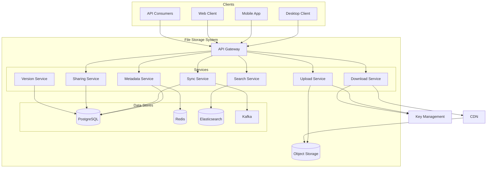
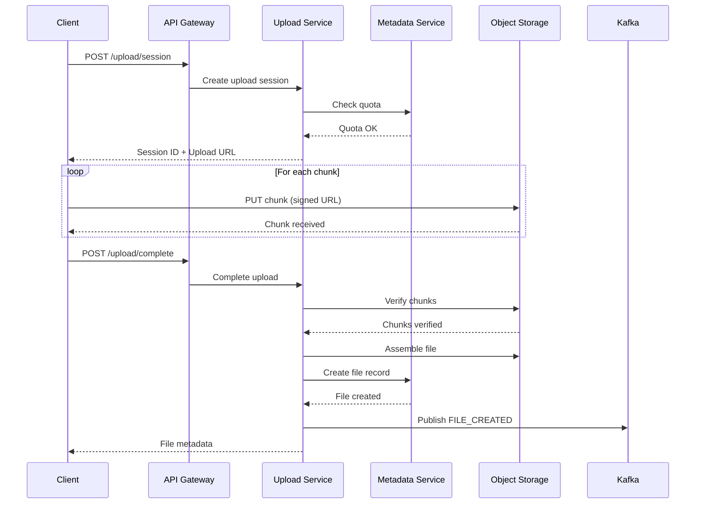
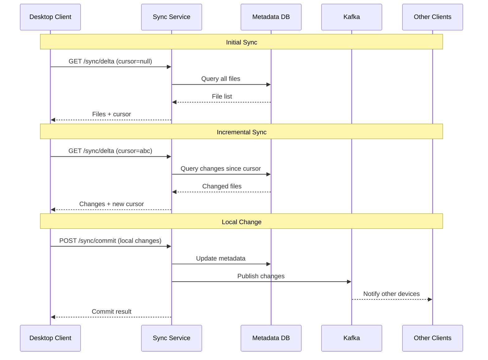

# File Storage System - Data Model & Architecture

## 1. High-Level Architecture

### System Overview

```
┌─────────────────────────────────────────────────────────────────────────────────┐
│                           File Storage System Architecture                        │
├─────────────────────────────────────────────────────────────────────────────────┤
│                                                                                   │
│    ┌─────────────┐  ┌─────────────┐  ┌─────────────┐  ┌─────────────┐           │
│    │  Desktop    │  │   Mobile    │  │    Web      │  │   API       │           │
│    │   Client    │  │    App      │  │   Client    │  │  Consumers  │           │
│    └──────┬──────┘  └──────┬──────┘  └──────┬──────┘  └──────┬──────┘           │
│           │                │                │                │                   │
│           └────────────────┴────────────────┴────────────────┘                   │
│                                    │                                             │
│                          ┌─────────▼─────────┐                                   │
│                          │   Load Balancer   │                                   │
│                          │   (CloudFlare)    │                                   │
│                          └─────────┬─────────┘                                   │
│                                    │                                             │
│         ┌──────────────────────────┼──────────────────────────┐                 │
│         │                          │                          │                  │
│  ┌──────▼──────┐           ┌───────▼───────┐          ┌───────▼───────┐         │
│  │   API       │           │   Upload      │          │   Download    │         │
│  │  Gateway    │           │   Service     │          │   Service     │         │
│  └──────┬──────┘           └───────┬───────┘          └───────┬───────┘         │
│         │                          │                          │                  │
│         │                          │                          │                  │
│  ┌──────▼──────────────────────────▼──────────────────────────▼──────┐          │
│  │                         Service Mesh (Istio)                       │          │
│  └──────┬──────────────────────────┬──────────────────────────┬──────┘          │
│         │                          │                          │                  │
│  ┌──────▼──────┐           ┌───────▼───────┐          ┌───────▼───────┐         │
│  │  Metadata   │           │    Sync       │          │   Sharing     │         │
│  │  Service    │           │   Service     │          │   Service     │         │
│  └──────┬──────┘           └───────┬───────┘          └───────┬───────┘         │
│         │                          │                          │                  │
│  ┌──────▼──────┐           ┌───────▼───────┐          ┌───────▼───────┐         │
│  │   Search    │           │   Version     │          │  Notification │         │
│  │  Service    │           │   Service     │          │   Service     │         │
│  └──────┬──────┘           └───────┬───────┘          └───────┬───────┘         │
│         │                          │                          │                  │
│  ┌──────┴──────────────────────────┴──────────────────────────┴──────┐          │
│  │                                                                    │          │
│  │  ┌──────────┐  ┌──────────┐  ┌──────────┐  ┌──────────┐          │          │
│  │  │PostgreSQL│  │  Redis   │  │  Kafka   │  │Elasticsrch│          │          │
│  │  │ (Sharded)│  │ Cluster  │  │ Cluster  │  │  Cluster │          │          │
│  │  └──────────┘  └──────────┘  └──────────┘  └──────────┘          │          │
│  │                                                                    │          │
│  └────────────────────────────────────────────────────────────────────┘          │
│                                    │                                             │
│                          ┌─────────▼─────────┐                                   │
│                          │  Object Storage   │                                   │
│                          │  (S3 / GCS)       │                                   │
│                          └───────────────────┘                                   │
│                                                                                   │
└─────────────────────────────────────────────────────────────────────────────────┘
```

---

## 2. Component Details

### 2.1 API Gateway

```
Purpose: Entry point for all API requests
Responsibilities:
├── Authentication (JWT validation)
├── Rate limiting
├── Request routing
├── SSL termination
├── Request/response transformation
└── API versioning

Technology: Kong / AWS API Gateway / Custom

Configuration:
├── Rate limits: 1000 req/min (free), 10000 req/min (pro)
├── Timeout: 30 seconds (metadata), 5 minutes (uploads)
├── Max request size: 50 GB
└── Compression: gzip for responses
```

### 2.2 Metadata Service

```
Purpose: Manage file and folder metadata
Responsibilities:
├── CRUD operations for files/folders
├── Path resolution
├── Permission checking
├── Quota management
└── Version tracking

Key Operations:
├── Create file record
├── Update file metadata
├── Move/rename files
├── Delete files (soft delete)
├── List folder contents
└── Get file by path/ID

Database: PostgreSQL (sharded by user_id)
Cache: Redis (hot metadata, 15-minute TTL)
```

### 2.3 Upload Service

```
Purpose: Handle file uploads
Responsibilities:
├── Receive file content
├── Chunk management for large files
├── Content hashing
├── Deduplication check
├── Store to object storage
├── Trigger post-processing
└── Resume interrupted uploads

Flow:
1. Client requests upload URL
2. Service creates upload session
3. Client uploads chunks directly to storage
4. Service verifies and commits
5. Metadata updated
6. Sync notifications sent

Chunking Strategy:
├── Chunk size: 4 MB (configurable)
├── Parallel uploads: Up to 4 concurrent
├── Resume: From last successful chunk
└── Verification: SHA-256 per chunk
```

### 2.4 Download Service

```
Purpose: Serve file downloads
Responsibilities:
├── Generate signed URLs
├── Handle range requests
├── Bandwidth throttling
├── Access logging
└── CDN integration

Flow:
1. Client requests download
2. Service verifies permissions
3. Generate signed CDN URL
4. Redirect to CDN
5. CDN serves from edge cache

Optimization:
├── Hot files: Served from CDN edge
├── Warm files: CDN origin pull from S3
├── Cold files: Restore from Glacier first
└── Preview: Separate optimized endpoints
```

### 2.5 Sync Service

```
Purpose: Coordinate file synchronization across devices
Responsibilities:
├── Track changes per user
├── Generate delta lists
├── Handle conflicts
├── Manage sync cursors
└── Push notifications for changes

Sync Protocol:
1. Client sends cursor (last sync position)
2. Service returns changes since cursor
3. Client applies changes locally
4. Client uploads local changes
5. Service detects conflicts
6. New cursor returned

Conflict Resolution:
├── Same file modified: Keep both, rename newer
├── File deleted vs modified: Keep modified
├── Folder deleted with contents: Move to root
└── Name collision: Add suffix
```

### 2.6 Sharing Service

```
Purpose: Manage file and folder sharing
Responsibilities:
├── Create share links
├── Manage user permissions
├── Team folder access
├── External sharing
└── Share analytics

Permission Model:
├── Owner: Full control
├── Editor: Read, write, share
├── Commenter: Read, comment
├── Viewer: Read only
└── Link viewer: Read via link

Inheritance:
├── Folder permissions cascade to contents
├── Explicit permissions override inherited
└── Most permissive wins for conflicts
```

### 2.7 Search Service

```
Purpose: Full-text and metadata search
Responsibilities:
├── Index file content
├── Index metadata
├── Handle search queries
├── Rank results
└── Autocomplete

Indexing:
├── File name and path
├── Text content (extracted)
├── Metadata (size, type, dates)
├── Tags and comments
└── Sharing information

Technology: Elasticsearch
├── Index per user shard
├── Near real-time indexing (< 5 min)
├── Query: Multi-match with boosting
└── Filters: Type, date, size, owner
```

### 2.8 Version Service

```
Purpose: Manage file version history
Responsibilities:
├── Create versions on change
├── Store version metadata
├── Serve historical versions
├── Cleanup old versions
└── Version comparison

Retention Policy:
├── Free: 30 days
├── Pro: 180 days
├── Business: 1 year
├── Enterprise: Unlimited (configurable)

Storage:
├── Each version stored separately
├── Block-level deduplication
├── Incremental storage for similar versions
└── Glacier for old versions
```

---

## 3. Data Flow Diagrams

### 3.1 File Upload Flow

```
┌──────────────────────────────────────────────────────────────────────────────┐
│                            File Upload Flow                                   │
├──────────────────────────────────────────────────────────────────────────────┤
│                                                                               │
│  Client                API Gateway         Upload Service        Object Store │
│    │                       │                     │                    │       │
│    │  1. POST /upload     │                     │                    │       │
│    │  (file metadata)     │                     │                    │       │
│    │─────────────────────>│                     │                    │       │
│    │                       │  2. Forward        │                    │       │
│    │                       │─────────────────-->│                    │       │
│    │                       │                     │                    │       │
│    │                       │                     │  3. Check dedup   │       │
│    │                       │                     │  (hash lookup)    │       │
│    │                       │                     │                    │       │
│    │                       │                     │  4. Create session│       │
│    │                       │                     │                    │       │
│    │  5. Return upload URL │                    │                    │       │
│    │<─────────────────────│<────────────────────│                    │       │
│    │                       │                     │                    │       │
│    │  6. PUT chunks directly to storage         │                    │       │
│    │─────────────────────────────────────────────────────────────────>│      │
│    │                       │                     │                    │       │
│    │  7. POST /complete    │                     │                    │       │
│    │─────────────────────>│─────────────────────>│                    │       │
│    │                       │                     │                    │       │
│    │                       │                     │  8. Verify chunks │       │
│    │                       │                     │─────────────────-->│       │
│    │                       │                     │                    │       │
│    │                       │                     │  9. Assemble file │       │
│    │                       │                     │<────────────────────│      │
│    │                       │                     │                    │       │
│    │                       │                     │  10. Update metadata      │
│    │                       │                     │  (PostgreSQL)     │       │
│    │                       │                     │                    │       │
│    │                       │                     │  11. Publish event│       │
│    │                       │                     │  (Kafka)          │       │
│    │                       │                     │                    │       │
│    │  12. Return file info │                    │                    │       │
│    │<─────────────────────│<────────────────────│                    │       │
│    │                       │                     │                    │       │
└──────────────────────────────────────────────────────────────────────────────┘
```

### 3.2 Sync Flow

```
┌──────────────────────────────────────────────────────────────────────────────┐
│                              Sync Flow                                        │
├──────────────────────────────────────────────────────────────────────────────┤
│                                                                               │
│  Desktop Client          Sync Service           Metadata DB        Kafka     │
│       │                       │                     │                │       │
│       │  1. GET /sync/delta   │                     │                │       │
│       │  (cursor: abc123)     │                     │                │       │
│       │──────────────────────>│                     │                │       │
│       │                       │                     │                │       │
│       │                       │  2. Query changes   │                │       │
│       │                       │  since cursor       │                │       │
│       │                       │────────────────────>│                │       │
│       │                       │                     │                │       │
│       │                       │  3. Return changes  │                │       │
│       │                       │<────────────────────│                │       │
│       │                       │                     │                │       │
│       │  4. Return delta      │                     │                │       │
│       │  (changes + new cursor)                     │                │       │
│       │<──────────────────────│                     │                │       │
│       │                       │                     │                │       │
│       │  5. Apply changes locally                   │                │       │
│       │  (download new files)                       │                │       │
│       │                       │                     │                │       │
│       │  6. POST /sync/commit │                     │                │       │
│       │  (local changes)      │                     │                │       │
│       │──────────────────────>│                     │                │       │
│       │                       │                     │                │       │
│       │                       │  7. Check conflicts │                │       │
│       │                       │────────────────────>│                │       │
│       │                       │                     │                │       │
│       │                       │  8. Update metadata │                │       │
│       │                       │────────────────────>│                │       │
│       │                       │                     │                │       │
│       │                       │  9. Publish events  │                │       │
│       │                       │─────────────────────────────────────>│       │
│       │                       │                     │                │       │
│       │  10. Return result    │                     │                │       │
│       │  (conflicts if any)   │                     │                │       │
│       │<──────────────────────│                     │                │       │
│       │                       │                     │                │       │
└──────────────────────────────────────────────────────────────────────────────┘
```

### 3.3 Sharing Flow

```
┌──────────────────────────────────────────────────────────────────────────────┐
│                            Sharing Flow                                       │
├──────────────────────────────────────────────────────────────────────────────┤
│                                                                               │
│  Owner              Sharing Service         Notification         Recipient   │
│    │                       │                     │                    │       │
│    │  1. POST /share       │                     │                    │       │
│    │  (file_id, email,     │                     │                    │       │
│    │   access_level)       │                     │                    │       │
│    │──────────────────────>│                     │                    │       │
│    │                       │                     │                    │       │
│    │                       │  2. Check permissions                    │       │
│    │                       │  (can owner share?)                      │       │
│    │                       │                     │                    │       │
│    │                       │  3. Lookup recipient│                    │       │
│    │                       │  (existing user?)   │                    │       │
│    │                       │                     │                    │       │
│    │                       │  4. Create share    │                    │       │
│    │                       │  record             │                    │       │
│    │                       │                     │                    │       │
│    │                       │  5. Send notification                    │       │
│    │                       │─────────────────────>│                    │       │
│    │                       │                     │                    │       │
│    │                       │                     │  6. Email/Push    │       │
│    │                       │                     │─────────────────-->│       │
│    │                       │                     │                    │       │
│    │  7. Return share info │                     │                    │       │
│    │<──────────────────────│                     │                    │       │
│    │                       │                     │                    │       │
│    │                       │                     │                    │       │
│    │                       │                     │  8. Click link    │       │
│    │                       │<────────────────────────────────────────│       │
│    │                       │                     │                    │       │
│    │                       │  9. Verify access   │                    │       │
│    │                       │                     │                    │       │
│    │                       │  10. Grant access   │                    │       │
│    │                       │─────────────────────────────────────────>│       │
│    │                       │                     │                    │       │
└──────────────────────────────────────────────────────────────────────────────┘
```

---

## 4. Storage Architecture

### 4.1 Block-Level Storage

```
┌──────────────────────────────────────────────────────────────────────────────┐
│                        Block-Level Storage Design                             │
├──────────────────────────────────────────────────────────────────────────────┤
│                                                                               │
│  File: presentation.pptx (100 MB)                                            │
│  ┌────────────────────────────────────────────────────────────────────┐      │
│  │  Block 0   │  Block 1   │  Block 2   │  ...  │  Block 24  │       │      │
│  │  (4 MB)    │  (4 MB)    │  (4 MB)    │       │  (4 MB)    │       │      │
│  │  hash: a1  │  hash: b2  │  hash: c3  │       │  hash: y25 │       │      │
│  └────────────────────────────────────────────────────────────────────┘      │
│                                                                               │
│  Block Storage (S3):                                                          │
│  ┌──────────────┐  ┌──────────────┐  ┌──────────────┐                        │
│  │ blocks/a1   │  │ blocks/b2   │  │ blocks/c3   │  ...                     │
│  │ (4 MB)      │  │ (4 MB)      │  │ (4 MB)      │                          │
│  └──────────────┘  └──────────────┘  └──────────────┘                        │
│                                                                               │
│  Deduplication Example:                                                       │
│  ┌────────────────────────────────────────────────────────────────────┐      │
│  │  User A: file1.pptx                                                │      │
│  │  Blocks: [a1, b2, c3, d4, e5]                                      │      │
│  └────────────────────────────────────────────────────────────────────┘      │
│  ┌────────────────────────────────────────────────────────────────────┐      │
│  │  User B: file1_copy.pptx (same content)                            │      │
│  │  Blocks: [a1, b2, c3, d4, e5]  ← Same blocks, no new storage!     │      │
│  └────────────────────────────────────────────────────────────────────┘      │
│  ┌────────────────────────────────────────────────────────────────────┐      │
│  │  User A: file1_v2.pptx (small edit)                                │      │
│  │  Blocks: [a1, b2, c3, d4, f6]  ← Only 1 new block stored          │      │
│  └────────────────────────────────────────────────────────────────────┘      │
│                                                                               │
│  Storage Savings: ~30% through deduplication                                  │
│                                                                               │
└──────────────────────────────────────────────────────────────────────────────┘
```

### 4.2 Storage Tiering

```
┌──────────────────────────────────────────────────────────────────────────────┐
│                          Storage Tiering Strategy                             │
├──────────────────────────────────────────────────────────────────────────────┤
│                                                                               │
│  Access Pattern Analysis:                                                     │
│  ┌─────────────────────────────────────────────────────────────────────┐     │
│  │                                                                      │     │
│  │  100% ┤                                                             │     │
│  │       │████                                                         │     │
│  │   80% ┤████                                                         │     │
│  │       │████████                                                     │     │
│  │   60% ┤████████                                                     │     │
│  │       │████████████                                                 │     │
│  │   40% ┤████████████                                                 │     │
│  │       │████████████████                                             │     │
│  │   20% ┤████████████████████████████                                 │     │
│  │       │████████████████████████████████████████████████████████     │     │
│  │    0% └──────────────────────────────────────────────────────────   │     │
│  │         0-7d    7-30d   30-90d  90-180d  180d+                      │     │
│  │                     Last Access Time                                │     │
│  │                                                                      │     │
│  │  Finding: 80% of accesses are to files modified in last 30 days    │     │
│  └─────────────────────────────────────────────────────────────────────┘     │
│                                                                               │
│  Tier Assignment:                                                             │
│  ┌─────────────────────────────────────────────────────────────────────┐     │
│  │  Hot Tier (S3 Standard)          │  Last accessed < 30 days        │     │
│  │  • Instant access                │  • 20% of data                  │     │
│  │  • $0.023/GB/month              │  • 80% of accesses              │     │
│  ├─────────────────────────────────────────────────────────────────────┤     │
│  │  Warm Tier (S3 IA)               │  Last accessed 30-180 days      │     │
│  │  • Instant access                │  • 40% of data                  │     │
│  │  • $0.0125/GB/month             │  • 15% of accesses              │     │
│  ├─────────────────────────────────────────────────────────────────────┤     │
│  │  Cold Tier (S3 Glacier)          │  Last accessed > 180 days       │     │
│  │  • 1-5 hour restore             │  • 40% of data                  │     │
│  │  • $0.004/GB/month              │  • 5% of accesses               │     │
│  └─────────────────────────────────────────────────────────────────────┘     │
│                                                                               │
└──────────────────────────────────────────────────────────────────────────────┘
```

---

## 5. Sync Architecture

### 5.1 Delta Sync Algorithm

```
┌──────────────────────────────────────────────────────────────────────────────┐
│                         Delta Sync Algorithm                                  │
├──────────────────────────────────────────────────────────────────────────────┤
│                                                                               │
│  Step 1: Change Detection (Client Side)                                       │
│  ┌─────────────────────────────────────────────────────────────────────┐     │
│  │  For each file in sync folder:                                       │     │
│  │    1. Compare modification time with last sync                       │     │
│  │    2. If changed, compute rolling hash (rsync algorithm)            │     │
│  │    3. Identify changed blocks                                        │     │
│  │    4. Queue for upload                                               │     │
│  └─────────────────────────────────────────────────────────────────────┘     │
│                                                                               │
│  Step 2: Server Reconciliation                                                │
│  ┌─────────────────────────────────────────────────────────────────────┐     │
│  │  Client state:  [A:v1, B:v2, C:v1]                                   │     │
│  │  Server state:  [A:v2, B:v2, D:v1]                                   │     │
│  │                                                                      │     │
│  │  Diff result:                                                        │     │
│  │    • A: Server newer → Download                                     │     │
│  │    • B: Same → No action                                            │     │
│  │    • C: Client only → Upload                                        │     │
│  │    • D: Server only → Download                                      │     │
│  └─────────────────────────────────────────────────────────────────────┘     │
│                                                                               │
│  Step 3: Conflict Resolution                                                  │
│  ┌─────────────────────────────────────────────────────────────────────┐     │
│  │  Scenario: File modified on both client and server                   │     │
│  │                                                                      │     │
│  │  Resolution strategies:                                              │     │
│  │    1. Last-write-wins (simple, may lose data)                       │     │
│  │    2. Keep both (rename: "file (conflicted copy).txt")              │     │
│  │    3. Merge (for supported file types)                              │     │
│  │    4. User resolution (prompt user)                                 │     │
│  │                                                                      │     │
│  │  Default: Keep both with conflict suffix                            │     │
│  └─────────────────────────────────────────────────────────────────────┘     │
│                                                                               │
└──────────────────────────────────────────────────────────────────────────────┘
```

### 5.2 Cursor-Based Sync

```java
// Sync cursor implementation
public class SyncCursor {
    private String userId;
    private String deviceId;
    private long lastEventId;      // Monotonic event ID
    private Instant lastSyncTime;
    private String pathPrefix;     // For selective sync
    
    // Generate cursor string for client
    public String toCursorString() {
        return Base64.encode(
            userId + ":" + deviceId + ":" + lastEventId + ":" + pathPrefix
        );
    }
    
    public static SyncCursor fromString(String cursor) {
        // Decode and parse
    }
}

// Delta query
public class SyncService {
    
    public SyncDelta getDelta(String cursorString, int limit) {
        SyncCursor cursor = SyncCursor.fromString(cursorString);
        
        // Query changes since last sync
        List<FileChange> changes = fileChangeRepository.findChanges(
            cursor.getUserId(),
            cursor.getLastEventId(),
            cursor.getPathPrefix(),
            limit + 1  // Fetch one extra to check hasMore
        );
        
        boolean hasMore = changes.size() > limit;
        if (hasMore) {
            changes = changes.subList(0, limit);
        }
        
        // Update cursor
        SyncCursor newCursor = cursor.withLastEventId(
            changes.isEmpty() ? cursor.getLastEventId() 
                              : changes.get(changes.size() - 1).getEventId()
        );
        
        return new SyncDelta(changes, newCursor.toCursorString(), hasMore);
    }
}
```

---

## 6. Database Architecture

### 6.1 Sharding Strategy

```
┌──────────────────────────────────────────────────────────────────────────────┐
│                         Database Sharding Strategy                            │
├──────────────────────────────────────────────────────────────────────────────┤
│                                                                               │
│  Sharding Key: user_id                                                        │
│  Reason: All file operations are user-scoped                                  │
│                                                                               │
│  Shard Distribution:                                                          │
│  ┌─────────────────────────────────────────────────────────────────────┐     │
│  │  Shard 0    │  Shard 1    │  Shard 2    │  ...  │  Shard 99   │     │     │
│  │  users 0-99 │  users 100- │  users 200- │       │  users 9900-│     │     │
│  │  (hash mod) │    199      │    299      │       │    9999     │     │     │
│  └─────────────────────────────────────────────────────────────────────┘     │
│                                                                               │
│  Shard Routing:                                                               │
│  ┌─────────────────────────────────────────────────────────────────────┐     │
│  │  shard_id = hash(user_id) % num_shards                              │     │
│  │                                                                      │     │
│  │  Example:                                                            │     │
│  │    user_id = "user_abc123"                                          │     │
│  │    hash = 12345                                                      │     │
│  │    shard_id = 12345 % 100 = 45                                      │     │
│  │    → Route to shard 45                                              │     │
│  └─────────────────────────────────────────────────────────────────────┘     │
│                                                                               │
│  Cross-Shard Operations:                                                      │
│  ┌─────────────────────────────────────────────────────────────────────┐     │
│  │  Scenario: User A shares file with User B (different shards)        │     │
│  │                                                                      │     │
│  │  Solution:                                                           │     │
│  │    1. Share record stored on sharer's shard (source of truth)       │     │
│  │    2. Recipient lookup via global share index                       │     │
│  │    3. File access goes to owner's shard                             │     │
│  └─────────────────────────────────────────────────────────────────────┘     │
│                                                                               │
└──────────────────────────────────────────────────────────────────────────────┘
```

### 6.2 Replication and Consistency

```
┌──────────────────────────────────────────────────────────────────────────────┐
│                      Replication and Consistency                              │
├──────────────────────────────────────────────────────────────────────────────┤
│                                                                               │
│  PostgreSQL Replication:                                                      │
│  ┌─────────────────────────────────────────────────────────────────────┐     │
│  │                                                                      │     │
│  │    ┌─────────┐         ┌─────────┐         ┌─────────┐             │     │
│  │    │ Primary │────────>│ Replica │────────>│ Replica │             │     │
│  │    │  (RW)   │  sync   │  (RO)   │  async  │  (RO)   │             │     │
│  │    └─────────┘         └─────────┘         └─────────┘             │     │
│  │         │                   │                   │                   │     │
│  │         │                   │                   │                   │     │
│  │    Same AZ            Different AZ         Different Region        │     │
│  │    (< 1ms lag)        (< 10ms lag)         (< 100ms lag)          │     │
│  │                                                                      │     │
│  └─────────────────────────────────────────────────────────────────────┘     │
│                                                                               │
│  Read/Write Routing:                                                          │
│  ┌─────────────────────────────────────────────────────────────────────┐     │
│  │  Writes: Always to primary                                          │     │
│  │  Reads:                                                              │     │
│  │    • After write: Read from primary (read-your-writes)             │     │
│  │    • Normal reads: Read from nearest replica                        │     │
│  │    • Search: Read from Elasticsearch                                │     │
│  └─────────────────────────────────────────────────────────────────────┘     │
│                                                                               │
│  Consistency Guarantees:                                                      │
│  ┌─────────────────────────────────────────────────────────────────────┐     │
│  │  • File metadata: Strong consistency (single shard)                 │     │
│  │  • Cross-user shares: Eventual consistency (< 1 second)            │     │
│  │  • Search index: Eventual consistency (< 5 minutes)                │     │
│  │  • Sync state: Causal consistency (via cursors)                    │     │
│  └─────────────────────────────────────────────────────────────────────┘     │
│                                                                               │
└──────────────────────────────────────────────────────────────────────────────┘
```

---

## 7. Caching Architecture

### 7.1 Cache Layers

```
┌──────────────────────────────────────────────────────────────────────────────┐
│                           Caching Architecture                                │
├──────────────────────────────────────────────────────────────────────────────┤
│                                                                               │
│  Layer 1: CDN Edge Cache                                                      │
│  ┌─────────────────────────────────────────────────────────────────────┐     │
│  │  Purpose: Serve file downloads close to users                        │     │
│  │  TTL: 1 hour (with ETag validation)                                 │     │
│  │  Hit rate: 60%                                                       │     │
│  │  Cached: File content, thumbnails, previews                         │     │
│  └─────────────────────────────────────────────────────────────────────┘     │
│                                                                               │
│  Layer 2: Application Cache (Redis)                                           │
│  ┌─────────────────────────────────────────────────────────────────────┐     │
│  │  Purpose: Cache hot metadata and session data                        │     │
│  │  TTL: 15 minutes (metadata), 24 hours (sessions)                    │     │
│  │  Hit rate: 85%                                                       │     │
│  │  Cached:                                                             │     │
│  │    • File metadata (path → file info)                               │     │
│  │    • Folder listings (folder_id → items)                            │     │
│  │    • User permissions (user_id → permissions)                       │     │
│  │    • Sync cursors                                                    │     │
│  │    • Rate limit counters                                            │     │
│  └─────────────────────────────────────────────────────────────────────┘     │
│                                                                               │
│  Layer 3: Local Cache (In-Memory)                                             │
│  ┌─────────────────────────────────────────────────────────────────────┐     │
│  │  Purpose: Reduce Redis calls for ultra-hot data                     │     │
│  │  TTL: 1 minute                                                       │     │
│  │  Hit rate: 30% (of Redis-bound requests)                            │     │
│  │  Cached: Config, feature flags, popular folder structures           │     │
│  └─────────────────────────────────────────────────────────────────────┘     │
│                                                                               │
└──────────────────────────────────────────────────────────────────────────────┘
```

### 7.2 Cache Invalidation

```java
// Cache invalidation strategy
public class FileCacheService {
    
    private final RedisTemplate<String, Object> redis;
    private final KafkaTemplate<String, FileEvent> kafka;
    
    // Cache keys
    private String fileKey(String fileId) {
        return "file:" + fileId;
    }
    
    private String pathKey(String userId, String path) {
        return "path:" + userId + ":" + path.toLowerCase();
    }
    
    private String folderKey(String folderId) {
        return "folder:" + folderId + ":items";
    }
    
    // Invalidation on file change
    @Transactional
    public void updateFile(File file, FileUpdate update) {
        // 1. Update database
        fileRepository.save(file);
        
        // 2. Invalidate all related caches
        invalidateFileCache(file);
        
        // 3. Publish event for distributed invalidation
        kafka.send("file-events", new FileEvent(
            FileEventType.MODIFIED,
            file.getId(),
            file.getOwnerId()
        ));
    }
    
    private void invalidateFileCache(File file) {
        // Delete file cache
        redis.delete(fileKey(file.getId()));
        
        // Delete path cache
        redis.delete(pathKey(file.getOwnerId(), file.getPath()));
        
        // Delete parent folder listing cache
        redis.delete(folderKey(file.getParentId()));
        
        // Invalidate CDN cache (async)
        cdnService.invalidate(file.getDownloadUrl());
    }
    
    // Listen for events from other instances
    @KafkaListener(topics = "file-events")
    public void onFileEvent(FileEvent event) {
        // Invalidate local caches
        localCache.invalidate(event.getFileId());
    }
}
```

---

## 8. Security Architecture

### 8.1 Access Control Model

```
┌──────────────────────────────────────────────────────────────────────────────┐
│                          Access Control Model                                 │
├──────────────────────────────────────────────────────────────────────────────┤
│                                                                               │
│  Permission Hierarchy:                                                        │
│  ┌─────────────────────────────────────────────────────────────────────┐     │
│  │                                                                      │     │
│  │  Owner ─────────────────────────────────────────────────────────┐   │     │
│  │    │  • Full control                                            │   │     │
│  │    │  • Transfer ownership                                      │   │     │
│  │    │  • Delete permanently                                      │   │     │
│  │    │                                                            │   │     │
│  │    └──> Editor ─────────────────────────────────────────────┐   │   │     │
│  │           │  • Read/Write content                           │   │   │     │
│  │           │  • Create/delete in folders                     │   │   │     │
│  │           │  • Share with others                            │   │   │     │
│  │           │                                                 │   │   │     │
│  │           └──> Commenter ──────────────────────────────┐    │   │   │     │
│  │                  │  • Read content                     │    │   │   │     │
│  │                  │  • Add comments                     │    │   │   │     │
│  │                  │                                     │    │   │   │     │
│  │                  └──> Viewer ─────────────────────┐    │    │   │   │     │
│  │                         │  • Read only            │    │    │   │   │     │
│  │                         │  • Download (if allowed)│    │    │   │   │     │
│  │                         └─────────────────────────┘    │    │   │   │     │
│  │                                                        │    │   │   │     │
│  └────────────────────────────────────────────────────────┴────┴───┴───┘     │
│                                                                               │
│  Permission Resolution:                                                       │
│  ┌─────────────────────────────────────────────────────────────────────┐     │
│  │  1. Check explicit file permission                                   │     │
│  │  2. Check inherited folder permission                                │     │
│  │  3. Check team membership                                            │     │
│  │  4. Check link access (if via shared link)                          │     │
│  │  5. Most permissive wins                                            │     │
│  └─────────────────────────────────────────────────────────────────────┘     │
│                                                                               │
└──────────────────────────────────────────────────────────────────────────────┘
```

### 8.2 Encryption Architecture

```
┌──────────────────────────────────────────────────────────────────────────────┐
│                         Encryption Architecture                               │
├──────────────────────────────────────────────────────────────────────────────┤
│                                                                               │
│  At Rest Encryption:                                                          │
│  ┌─────────────────────────────────────────────────────────────────────┐     │
│  │                                                                      │     │
│  │  File Upload → Generate DEK → Encrypt File → Store                  │     │
│  │       │              │              │           │                   │     │
│  │       │              │              │           ▼                   │     │
│  │       │              │              │    ┌──────────────┐           │     │
│  │       │              │              │    │ Object Store │           │     │
│  │       │              │              │    │ (Encrypted)  │           │     │
│  │       │              │              │    └──────────────┘           │     │
│  │       │              │              │                               │     │
│  │       │              ▼              │                               │     │
│  │       │    ┌──────────────┐        │                               │     │
│  │       │    │  Encrypt DEK │        │                               │     │
│  │       │    │  with KEK    │        │                               │     │
│  │       │    └──────┬───────┘        │                               │     │
│  │       │           │                │                               │     │
│  │       │           ▼                │                               │     │
│  │       │    ┌──────────────┐        │                               │     │
│  │       │    │ Store EDEK   │        │                               │     │
│  │       │    │ in Metadata  │        │                               │     │
│  │       │    └──────────────┘        │                               │     │
│  │       │                            │                               │     │
│  │  DEK = Data Encryption Key (AES-256, per file)                     │     │
│  │  KEK = Key Encryption Key (stored in KMS)                          │     │
│  │  EDEK = Encrypted DEK                                              │     │
│  │                                                                      │     │
│  └─────────────────────────────────────────────────────────────────────┘     │
│                                                                               │
│  In Transit Encryption:                                                       │
│  ┌─────────────────────────────────────────────────────────────────────┐     │
│  │  • TLS 1.3 for all API communications                               │     │
│  │  • Certificate pinning for mobile apps                              │     │
│  │  • mTLS for service-to-service communication                        │     │
│  └─────────────────────────────────────────────────────────────────────┘     │
│                                                                               │
└──────────────────────────────────────────────────────────────────────────────┘
```

---

## 9. Mermaid Diagrams

### System Context Diagram



### Upload Sequence Diagram



### Sync Flow Diagram



