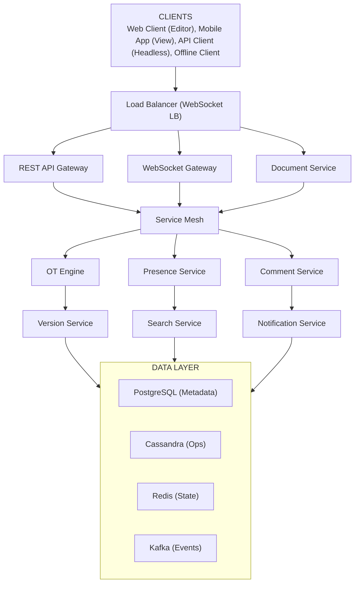
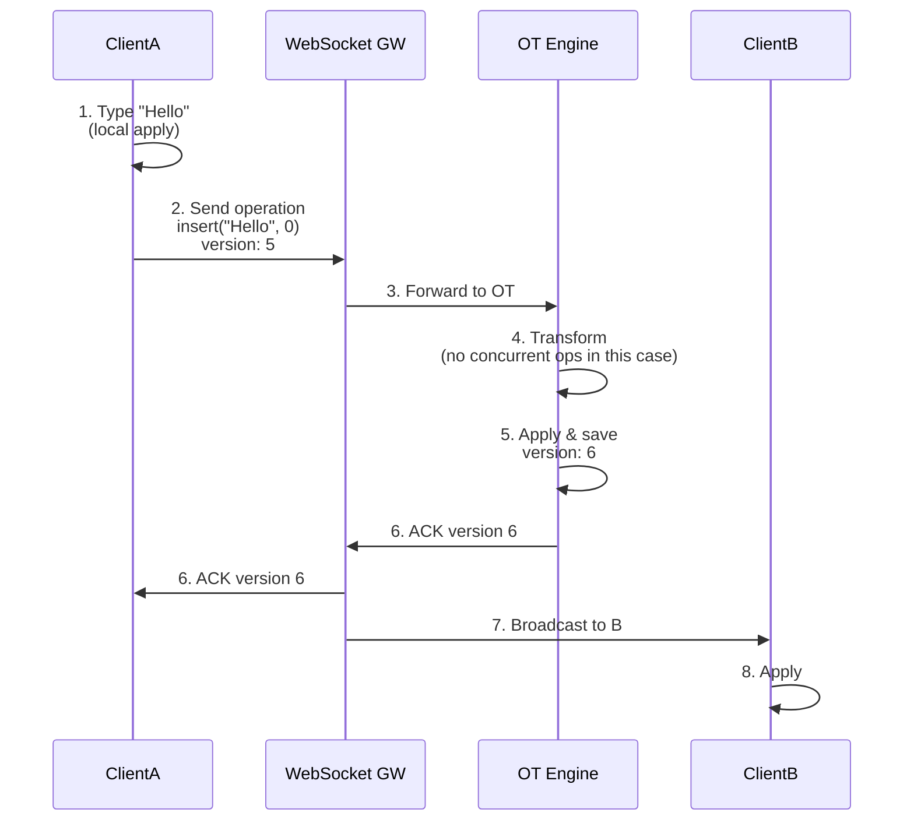
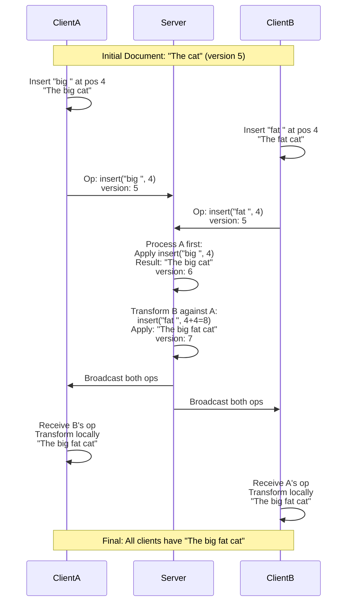
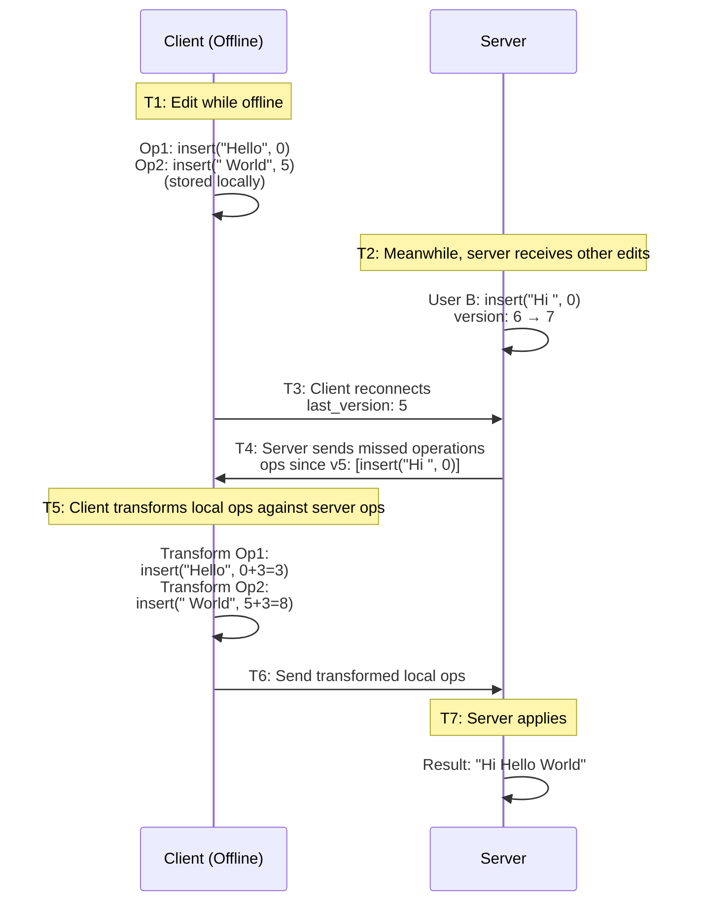
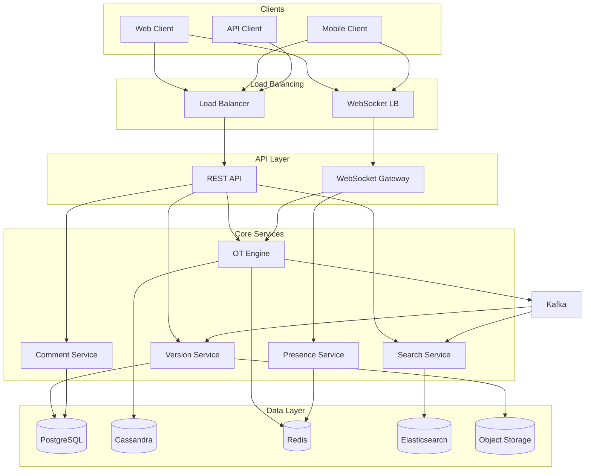
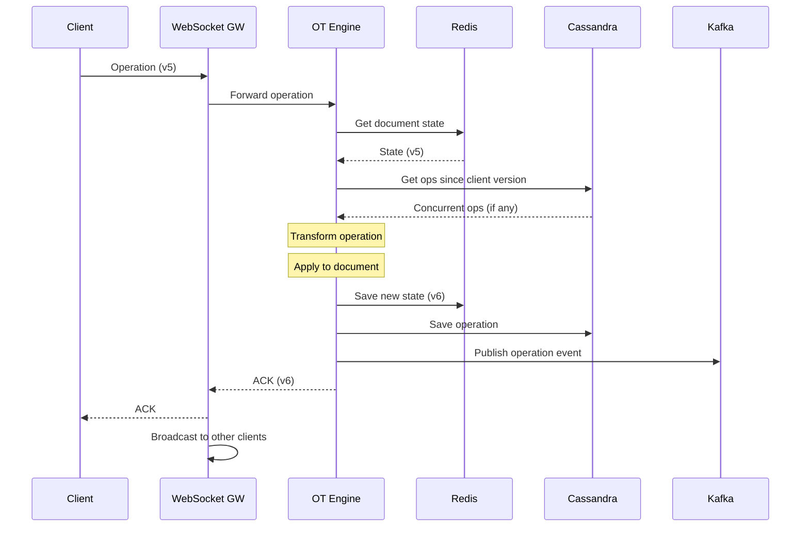
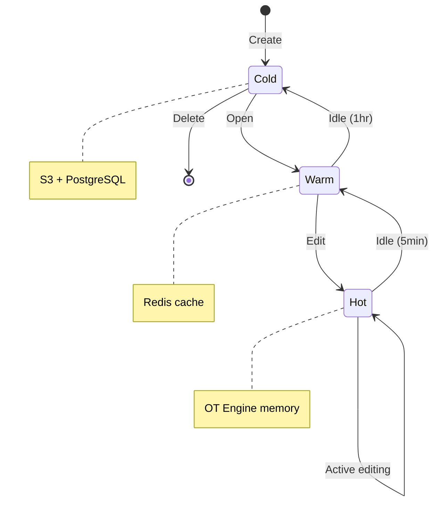

# Collaborative Document Editor - Data Model & Architecture

## 1. High-Level Architecture

### System Overview



<details>
<summary>ASCII diagram (reference)</summary>

```text
┌─────────────────────────────────────────────────────────────────────────────────┐
│                    Collaborative Document Editor Architecture                    │
├─────────────────────────────────────────────────────────────────────────────────┤
│                                                                                   │
│    ┌─────────────┐  ┌─────────────┐  ┌─────────────┐  ┌─────────────┐           │
│    │  Web Client │  │ Mobile App  │  │  API Client │  │  Offline    │           │
│    │  (Editor)   │  │  (View)     │  │  (Headless) │  │  Client     │           │
│    └──────┬──────┘  └──────┬──────┘  └──────┬──────┘  └──────┬──────┘           │
│           │                │                │                │                   │
│           └────────────────┴────────────────┴────────────────┘                   │
│                                    │                                             │
│                          ┌─────────▼─────────┐                                   │
│                          │   Load Balancer   │                                   │
│                          │   (WebSocket LB)  │                                   │
│                          └─────────┬─────────┘                                   │
│                                    │                                             │
│         ┌──────────────────────────┼──────────────────────────┐                 │
│         │                          │                          │                  │
│  ┌──────▼──────┐           ┌───────▼───────┐          ┌───────▼───────┐         │
│  │   REST API  │           │   WebSocket   │          │   Document    │         │
│  │   Gateway   │           │   Gateway     │          │   Service     │         │
│  └──────┬──────┘           └───────┬───────┘          └───────┬───────┘         │
│         │                          │                          │                  │
│         │                          │                          │                  │
│  ┌──────▼──────────────────────────▼──────────────────────────▼──────┐          │
│  │                         Service Mesh                               │          │
│  └──────┬──────────────────────────┬──────────────────────────┬──────┘          │
│         │                          │                          │                  │
│  ┌──────▼──────┐           ┌───────▼───────┐          ┌───────▼───────┐         │
│  │     OT      │           │   Presence    │          │   Comment     │         │
│  │   Engine    │           │   Service     │          │   Service     │         │
│  └──────┬──────┘           └───────┬───────┘          └───────┬───────┘         │
│         │                          │                          │                  │
│  ┌──────▼──────┐           ┌───────▼───────┐          ┌───────▼───────┐         │
│  │   Version   │           │   Search      │          │  Notification │         │
│  │   Service   │           │   Service     │          │   Service     │         │
│  └──────┬──────┘           └───────┬───────┘          └───────┬───────┘         │
│         │                          │                          │                  │
│  ┌──────┴──────────────────────────┴──────────────────────────┴──────┐          │
│  │                                                                    │          │
│  │  ┌──────────┐  ┌──────────┐  ┌──────────┐  ┌──────────┐          │          │
│  │  │PostgreSQL│  │ Cassandra│  │  Redis   │  │  Kafka   │          │          │
│  │  │(Metadata)│  │  (Ops)   │  │ (State)  │  │ (Events) │          │          │
```

</details>
```
│  │  └──────────┘  └──────────┘  └──────────┘  └──────────┘          │          │
│  │                                                                    │          │
│  └────────────────────────────────────────────────────────────────────┘          │
│                                                                                   │
└─────────────────────────────────────────────────────────────────────────────────┘
```

---

## 2. Operational Transformation (OT) Deep Dive

### What is OT?

```
Operational Transformation is an algorithm for maintaining consistency
in collaborative editing systems. It transforms operations so they can
be applied in different orders while achieving the same result.

Problem:
- User A types "Hello" at position 0
- User B types "World" at position 0
- Both operations sent to server simultaneously
- Without OT: One user's edit is lost

With OT:
- Server receives both operations
- Transforms B's operation: insert("World", 5)
- Result: "HelloWorld" - both edits preserved
```

### OT Transform Functions

```java
public class OperationalTransform {
    
    /**
     * Transform operation B against operation A.
     * Returns B' such that apply(apply(doc, A), B') = apply(apply(doc, B), A')
     */
    public Operation transform(Operation a, Operation b) {
        if (a instanceof InsertOp && b instanceof InsertOp) {
            return transformInsertInsert((InsertOp) a, (InsertOp) b);
        } else if (a instanceof InsertOp && b instanceof DeleteOp) {
            return transformInsertDelete((InsertOp) a, (DeleteOp) b);
        } else if (a instanceof DeleteOp && b instanceof InsertOp) {
            return transformDeleteInsert((DeleteOp) a, (InsertOp) b);
        } else if (a instanceof DeleteOp && b instanceof DeleteOp) {
            return transformDeleteDelete((DeleteOp) a, (DeleteOp) b);
        }
        throw new IllegalArgumentException("Unknown operation types");
    }
    
    private InsertOp transformInsertInsert(InsertOp a, InsertOp b) {
        // If A inserts before B's position, shift B right
        if (a.getPosition() <= b.getPosition()) {
            return new InsertOp(
                b.getPosition() + a.getContent().length(),
                b.getContent()
            );
        }
        // A inserts after B's position, no change needed
        return b;
    }
    
    private DeleteOp transformInsertDelete(InsertOp a, DeleteOp b) {
        // If insert is before delete range, shift delete right
        if (a.getPosition() <= b.getPosition()) {
            return new DeleteOp(
                b.getPosition() + a.getContent().length(),
                b.getLength()
            );
        }
        // If insert is within delete range, expand delete
        if (a.getPosition() < b.getPosition() + b.getLength()) {
            return new DeleteOp(
                b.getPosition(),
                b.getLength() + a.getContent().length()
            );
        }
        // Insert is after delete, no change
        return b;
    }
    
    private InsertOp transformDeleteInsert(DeleteOp a, InsertOp b) {
        // If delete is before insert, shift insert left
        if (a.getPosition() + a.getLength() <= b.getPosition()) {
            return new InsertOp(
                b.getPosition() - a.getLength(),
                b.getContent()
            );
        }
        // If delete contains insert position, insert at delete position
        if (a.getPosition() <= b.getPosition()) {
            return new InsertOp(a.getPosition(), b.getContent());
        }
        // Delete is after insert, no change
        return b;
    }
    
    private DeleteOp transformDeleteDelete(DeleteOp a, DeleteOp b) {
        // Complex: handle overlapping deletes
        // ... (detailed implementation)
    }
}
```

### OT Server Implementation

```java
@Service
public class OTServer {
    
    private final DocumentRepository documentRepository;
    private final OperationRepository operationRepository;
    private final OperationalTransform ot;
    
    /**
     * Process an incoming operation from a client.
     * 1. Transform against concurrent operations
     * 2. Apply to document
     * 3. Broadcast to other clients
     */
    @Transactional
    public OperationResult processOperation(
            String documentId,
            String clientId,
            long clientVersion,
            Operation operation) {
        
        // Get current server state
        DocumentState state = documentRepository.getState(documentId);
        long serverVersion = state.getVersion();
        
        // Get operations since client's version
        List<Operation> concurrentOps = operationRepository
            .getOperationsSince(documentId, clientVersion);
        
        // Transform operation against all concurrent operations
        Operation transformed = operation;
        for (Operation concurrent : concurrentOps) {
            transformed = ot.transform(concurrent, transformed);
        }
        
        // Apply transformed operation to document
        Document newDoc = applyOperation(state.getDocument(), transformed);
        
        // Save new state
        long newVersion = serverVersion + 1;
        documentRepository.saveState(documentId, newDoc, newVersion);
        operationRepository.save(documentId, newVersion, transformed, clientId);
        
        // Broadcast to other clients
        broadcastOperation(documentId, clientId, newVersion, transformed);
        
        return new OperationResult(newVersion, transformed);
    }
}
```

---

## 3. Component Details

### 3.1 WebSocket Gateway

```
Purpose: Manage real-time connections for collaborative editing
Responsibilities:
├── WebSocket connection management
├── Authentication and session handling
├── Message routing to OT engine
├── Presence updates
└── Connection health monitoring

Scale:
├── 30M concurrent connections (peak)
├── 50K connections per server
├── 600+ gateway servers
└── Sticky sessions by document_id

Protocol:
├── Binary encoding (MessagePack)
├── Heartbeat every 30 seconds
├── Automatic reconnection
└── Message ordering guarantees
```

### 3.2 OT Engine

```
Purpose: Process and transform collaborative operations
Responsibilities:
├── Receive operations from clients
├── Transform against concurrent operations
├── Apply to document state
├── Maintain operation history
└── Handle conflict resolution

Implementation:
├── Stateless transformation logic
├── Document state in Redis
├── Operation log in Cassandra
└── Horizontal scaling by document

Performance:
├── 50K operations/second per instance
├── < 10ms transformation time
├── 300 instances at peak
```

### 3.3 Presence Service

```
Purpose: Track and broadcast user presence in documents
Responsibilities:
├── Track active users per document
├── Cursor position updates
├── Selection highlighting
├── User activity status
└── Typing indicators

Implementation:
├── Redis for real-time state
├── 5-second presence TTL
├── Batch presence updates
└── Efficient delta broadcasts

Data Model:
├── Document → Active Users (Set)
├── User → Cursor Position (Hash)
├── User → Selection Range (Hash)
└── User → Last Activity (Timestamp)
```

### 3.4 Version Service

```
Purpose: Manage document version history
Responsibilities:
├── Create version snapshots
├── Store version metadata
├── Serve historical versions
├── Named version management
└── Version comparison

Snapshot Strategy:
├── Automatic: Every 100 operations
├── Time-based: Every 5 minutes of activity
├── Manual: User-triggered named versions
└── Retention: 30 days auto, forever named

Storage:
├── Full snapshots: Object storage (S3)
├── Metadata: PostgreSQL
├── Operations: Cassandra (for replay)
```

---

## 4. Data Flow Diagrams

### 4.1 Real-time Editing Flow



<details>
<summary>ASCII diagram (reference)</summary>

```text
┌──────────────────────────────────────────────────────────────────────────────┐
│                         Real-time Editing Flow                                │
├──────────────────────────────────────────────────────────────────────────────┤
│                                                                               │
│  Client A             WebSocket GW           OT Engine            Client B   │
│     │                      │                     │                    │       │
│     │  1. Type "Hello"     │                     │                    │       │
│     │  (local apply)       │                     │                    │       │
│     │                      │                     │                    │       │
│     │  2. Send operation   │                     │                    │       │
│     │  insert("Hello", 0)  │                     │                    │       │
│     │  version: 5          │                     │                    │       │
│     │─────────────────────>│                     │                    │       │
│     │                      │                     │                    │       │
│     │                      │  3. Forward to OT   │                    │       │
│     │                      │─────────────────────>│                    │       │
│     │                      │                     │                    │       │
│     │                      │                     │  4. Transform      │       │
│     │                      │                     │  (no concurrent    │       │
│     │                      │                     │   ops in this case)│       │
│     │                      │                     │                    │       │
│     │                      │                     │  5. Apply & save   │       │
│     │                      │                     │  version: 6        │       │
│     │                      │                     │                    │       │
│     │  6. ACK version 6    │                     │                    │       │
│     │<─────────────────────│<────────────────────│                    │       │
│     │                      │                     │                    │       │
│     │                      │  7. Broadcast to B  │                    │       │
│     │                      │─────────────────────────────────────────>│       │
│     │                      │                     │                    │       │
│     │                      │                     │                    │  8.   │
│     │                      │                     │                    │ Apply │
│     │                      │                     │                    │       │
└──────────────────────────────────────────────────────────────────────────────┘
```

</details>
```

### 4.2 Concurrent Edit Resolution



<details>
<summary>ASCII diagram (reference)</summary>

```text
┌──────────────────────────────────────────────────────────────────────────────┐
│                      Concurrent Edit Resolution                               │
├──────────────────────────────────────────────────────────────────────────────┤
│                                                                               │
│  Initial Document: "The cat"  (version 5)                                    │
│                                                                               │
│  Client A                    Server                    Client B              │
│     │                          │                          │                  │
│     │  Insert "big " at pos 4  │  Insert "fat " at pos 4  │                  │
│     │  "The big cat"           │                          │ "The fat cat"    │
│     │                          │                          │                  │
│     │  Op: insert("big ", 4)   │                          │                  │
│     │  version: 5              │                          │                  │
│     │─────────────────────────>│                          │                  │
│     │                          │                          │                  │
│     │                          │  Op: insert("fat ", 4)   │                  │
│     │                          │  version: 5              │                  │
│     │                          │<─────────────────────────│                  │
│     │                          │                          │                  │
│     │                          │  Process A first:        │                  │
│     │                          │  Apply insert("big ", 4) │                  │
│     │                          │  Result: "The big cat"   │                  │
│     │                          │  version: 6              │                  │
│     │                          │                          │                  │
│     │                          │  Transform B against A:  │                  │
│     │                          │  insert("fat ", 4+4=8)   │                  │
│     │                          │  Apply: "The big fat cat"│                  │
│     │                          │  version: 7              │                  │
│     │                          │                          │                  │
│     │  Receive B's op         │  Broadcast both ops      │  Receive A's op  │
│     │  Transform locally       │                          │  Transform locally│
│     │  "The big fat cat"       │                          │  "The big fat cat"│
│     │<─────────────────────────│─────────────────────────>│                  │
│     │                          │                          │                  │
│     │  Final: All clients have "The big fat cat"         │                  │
│                                                                               │
└──────────────────────────────────────────────────────────────────────────────┘
```

</details>
```

### 4.3 Offline Sync Flow



<details>
<summary>ASCII diagram (reference)</summary>

```text
┌──────────────────────────────────────────────────────────────────────────────┐
│                           Offline Sync Flow                                   │
├──────────────────────────────────────────────────────────────────────────────┤
│                                                                               │
│  Client (Offline)              Server                                        │
│       │                          │                                           │
│       │  T1: Edit while offline  │                                           │
│       │  Op1: insert("Hello", 0) │                                           │
│       │  Op2: insert(" World", 5)│                                           │
│       │  (stored locally)        │                                           │
│       │                          │                                           │
│       │  T2: Meanwhile, server   │                                           │
│       │  receives other edits    │                                           │
│       │                          │  User B: insert("Hi ", 0)                 │
│       │                          │  version: 6 → 7                           │
│       │                          │                                           │
│       │  T3: Client reconnects   │                                           │
│       │─────────────────────────>│                                           │
│       │  last_version: 5         │                                           │
│       │                          │                                           │
│       │  T4: Server sends        │                                           │
│       │  missed operations       │                                           │
│       │<─────────────────────────│                                           │
│       │  ops since v5: [insert("Hi ", 0)]                                    │
│       │                          │                                           │
│       │  T5: Client transforms   │                                           │
│       │  local ops against       │                                           │
│       │  server ops              │                                           │
│       │                          │                                           │
│       │  Transform Op1:          │                                           │
│       │  insert("Hello", 0+3=3)  │                                           │
│       │  Transform Op2:          │                                           │
│       │  insert(" World", 5+3=8) │                                           │
│       │                          │                                           │
│       │  T6: Send transformed    │                                           │
│       │  local ops               │                                           │
│       │─────────────────────────>│                                           │
│       │                          │                                           │
│       │  T7: Server applies      │                                           │
│       │  Result: "Hi Hello World"│                                           │
│       │                          │                                           │
└──────────────────────────────────────────────────────────────────────────────┘
```

</details>
```

---

## 5. State Management Architecture

### Document State Machine

```
┌──────────────────────────────────────────────────────────────────────────────┐
│                       Document State Machine                                  │
├──────────────────────────────────────────────────────────────────────────────┤
│                                                                               │
│  States:                                                                      │
│  ┌─────────────────────────────────────────────────────────────────────┐     │
│  │                                                                      │     │
│  │    ┌─────────┐    open     ┌─────────┐    edit    ┌─────────┐      │     │
│  │    │  Cold   │───────────>│  Warm   │───────────>│   Hot   │      │     │
│  │    │(Storage)│            │ (Cache) │            │ (Memory)│      │     │
│  │    └─────────┘            └─────────┘            └─────────┘      │     │
│  │         ▲                      │                      │            │     │
│  │         │                      │ timeout              │ timeout    │     │
│  │         │                      │ (1 hour)             │ (5 min)    │     │
│  │         │                      ▼                      ▼            │     │
│  │         └──────────────────────┴──────────────────────┘            │     │
│  │                                                                      │     │
│  └─────────────────────────────────────────────────────────────────────┘     │
│                                                                               │
│  Cold State:                                                                  │
│  ├── Document content in object storage                                      │
│  ├── Metadata in PostgreSQL                                                  │
│  └── No active connections                                                   │
│                                                                               │
│  Warm State:                                                                  │
│  ├── Document content cached in Redis                                        │
│  ├── Recent operations buffered                                              │
│  └── Some users viewing (not editing)                                        │
│                                                                               │
│  Hot State:                                                                   │
│  ├── Document state in OT engine memory                                      │
│  ├── Active WebSocket connections                                            │
│  ├── Real-time operation processing                                          │
│  └── Presence tracking active                                                │
│                                                                               │
└──────────────────────────────────────────────────────────────────────────────┘
```

### State Transitions

```java
@Service
public class DocumentStateManager {
    
    private final RedisTemplate<String, Object> redis;
    private final S3Client s3;
    private final OTEngine otEngine;
    
    public DocumentState loadDocument(String documentId) {
        // Check if hot (in OT engine)
        if (otEngine.hasDocument(documentId)) {
            return otEngine.getState(documentId);
        }
        
        // Check if warm (in Redis)
        DocumentState cached = redis.opsForValue()
            .get("doc:" + documentId, DocumentState.class);
        if (cached != null) {
            return cached;
        }
        
        // Cold - load from storage
        Document doc = loadFromStorage(documentId);
        DocumentState state = new DocumentState(doc);
        
        // Warm up cache
        redis.opsForValue().set(
            "doc:" + documentId, 
            state, 
            Duration.ofHours(1)
        );
        
        return state;
    }
    
    public void activateDocument(String documentId, String userId) {
        DocumentState state = loadDocument(documentId);
        
        // Promote to hot state
        otEngine.activate(documentId, state);
        
        // Track active user
        redis.opsForSet().add("doc:active:" + documentId, userId);
        redis.expire("doc:active:" + documentId, Duration.ofMinutes(5));
    }
    
    @Scheduled(fixedRate = 60000) // Every minute
    public void checkIdleDocuments() {
        List<String> hotDocuments = otEngine.getActiveDocuments();
        
        for (String docId : hotDocuments) {
            Set<String> activeUsers = redis.opsForSet()
                .members("doc:active:" + docId);
            
            if (activeUsers == null || activeUsers.isEmpty()) {
                // No active users, demote to warm
                DocumentState state = otEngine.deactivate(docId);
                redis.opsForValue().set(
                    "doc:" + docId, 
                    state, 
                    Duration.ofHours(1)
                );
            }
        }
    }
}
```

---

## 6. Database Architecture

### Sharding Strategy

```
┌──────────────────────────────────────────────────────────────────────────────┐
│                         Sharding Strategy                                     │
├──────────────────────────────────────────────────────────────────────────────┤
│                                                                               │
│  PostgreSQL (Metadata):                                                       │
│  ├── Shard key: owner_id                                                     │
│  ├── Shards: 100                                                             │
│  ├── Reason: User's documents accessed together                              │
│  └── Cross-shard: Shared documents via global index                          │
│                                                                               │
│  Cassandra (Operations):                                                      │
│  ├── Partition key: document_id                                              │
│  ├── Clustering key: version                                                 │
│  ├── Reason: Operations for a document accessed together                     │
│  └── TTL: 30 days for operations                                             │
│                                                                               │
│  Redis (Real-time State):                                                     │
│  ├── Key prefix: doc:{document_id}                                           │
│  ├── Cluster: 800 nodes                                                      │
│  ├── Reason: Document state isolated                                         │
│  └── Eviction: LRU with TTL                                                  │
│                                                                               │
└──────────────────────────────────────────────────────────────────────────────┘
```

### Consistency Model

```
┌──────────────────────────────────────────────────────────────────────────────┐
│                         Consistency Model                                     │
├──────────────────────────────────────────────────────────────────────────────┤
│                                                                               │
│  Operations (Strong Consistency):                                             │
│  ├── All operations ordered by server                                        │
│  ├── Version numbers are sequential                                          │
│  ├── No gaps in operation history                                            │
│  └── Guaranteed by OT engine serialization                                   │
│                                                                               │
│  Document State (Eventual Consistency):                                       │
│  ├── All clients eventually converge                                         │
│  ├── OT guarantees same result regardless of order                          │
│  ├── Temporary divergence during network issues                              │
│  └── Convergence on reconnection                                             │
│                                                                               │
│  Metadata (Read-Your-Writes):                                                 │
│  ├── User sees their own changes immediately                                 │
│  ├── Other users see changes within seconds                                  │
│  └── Implemented via cache invalidation                                      │
│                                                                               │
│  Presence (Soft Real-time):                                                   │
│  ├── Best effort delivery                                                    │
│  ├── Stale data acceptable (5 second TTL)                                   │
│  └── No persistence required                                                 │
│                                                                               │
└──────────────────────────────────────────────────────────────────────────────┘
```

---

## 7. Mermaid Diagrams

### System Architecture



### OT Processing Sequence



### Document State Lifecycle



