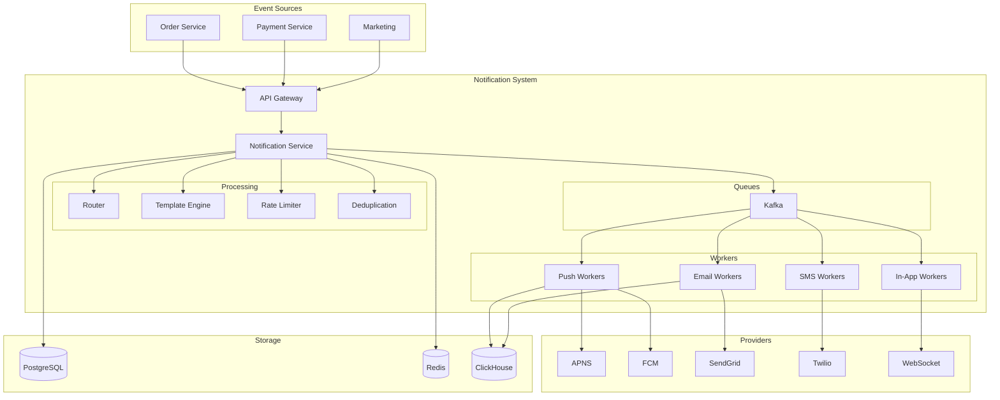
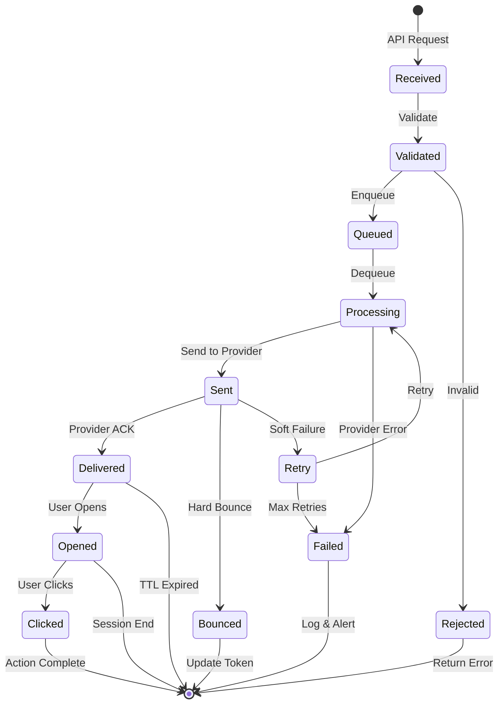

# Notification System - Data Model & Architecture

## 1. High-Level Architecture

### System Overview

```
┌─────────────────────────────────────────────────────────────────────────────────┐
│                        Notification System Architecture                          │
├─────────────────────────────────────────────────────────────────────────────────┤
│                                                                                   │
│  Event Sources                                                                    │
│  ┌──────────┐  ┌──────────┐  ┌──────────┐  ┌──────────┐                         │
│  │ Order    │  │ Payment  │  │ Marketing│  │ Security │                         │
│  │ Service  │  │ Service  │  │ Platform │  │ Service  │                         │
│  └────┬─────┘  └────┬─────┘  └────┬─────┘  └────┬─────┘                         │
│       │             │             │             │                                │
│       └─────────────┴─────────────┴─────────────┘                                │
│                           │                                                      │
│                    ┌──────▼──────┐                                               │
│                    │  API Gateway │                                              │
│                    └──────┬──────┘                                               │
│                           │                                                      │
│              ┌────────────┴────────────┐                                        │
│              │                         │                                        │
│       ┌──────▼──────┐          ┌───────▼───────┐                                │
│       │ Notification│          │    Kafka      │                                │
│       │   Service   │◄────────►│   Cluster     │                                │
│       └──────┬──────┘          └───────────────┘                                │
│              │                                                                   │
│    ┌─────────┼─────────┬─────────────┬─────────────┐                           │
│    │         │         │             │             │                            │
│ ┌──▼───┐ ┌───▼───┐ ┌───▼───┐   ┌─────▼─────┐ ┌─────▼─────┐                     │
│ │Router│ │Template│ │Prefrnc│   │Rate Limit │ │Dedup     │                     │
│ │      │ │Engine  │ │Service│   │Service    │ │Service   │                     │
│ └──┬───┘ └───────┘ └───────┘   └───────────┘ └───────────┘                     │
│    │                                                                            │
│    ├───────────────────┬────────────────┬────────────────┐                     │
│    │                   │                │                │                      │
│ ┌──▼──────┐      ┌─────▼────┐     ┌─────▼────┐    ┌──────▼─────┐               │
│ │  Push   │      │  Email   │     │   SMS    │    │   In-App   │               │
│ │ Workers │      │ Workers  │     │ Workers  │    │  Workers   │               │
│ └────┬────┘      └────┬─────┘     └────┬─────┘    └──────┬─────┘               │
│      │                │                │                 │                      │
│      │                │                │                 │                      │
│ ┌────▼────┐      ┌────▼────┐     ┌────▼────┐      ┌─────▼─────┐                │
│ │APNS/FCM │      │SendGrid │     │ Twilio  │      │ WebSocket │                │
│ └─────────┘      └─────────┘     └─────────┘      │  Servers  │                │
│                                                   └───────────┘                 │
│                                                                                   │
└─────────────────────────────────────────────────────────────────────────────────┘
```

---

## Consistency Model

**CAP Theorem Tradeoff:**

We choose **Availability + Partition Tolerance (AP)**:
- **Availability**: Notifications must be delivered (even if delayed)
- **Partition Tolerance**: System continues operating during network partitions
- **Consistency**: Sacrificed (notifications may be delivered out of order or duplicated)

**Why AP over CP?**
- Notifications don't need strict ordering (acceptable delay/duplication)
- Better to deliver notifications eventually than fail completely
- System must always operate (high availability requirement)
- During partitions, we prefer delayed/duplicate notifications over losing them

**ACID vs BASE:**

**ACID (Strong Consistency) for:**
- Notification preferences (PostgreSQL, must be immediately applied)
- User authentication (PostgreSQL, security requirement)
- Template management (PostgreSQL, prevent duplicate templates)

**BASE (Eventual Consistency) for:**
- Notification delivery (at-least-once, may be duplicated)
- Delivery status (updated asynchronously)
- Rate limiting (eventual synchronization across workers)
- Notification history (eventual synchronization)

**Per-Operation Consistency Guarantees:**

| Operation | Consistency Level | Guarantee |
|-----------|------------------|-----------|
| Send notification | Eventual (at-least-once) | Delivered at least once, may be duplicated |
| Update preferences | Strong | Immediately applied to new notifications |
| Check delivery status | Eventual | Status updated within seconds |
| Rate limiting | Eventual | Limits enforced eventually (may allow bursts) |
| Notification history | Eventual | Synchronized within minutes |

**Eventual Consistency Boundaries:**
- Delivery staleness: Notifications may be delayed by seconds/minutes (acceptable)
- Duplicate delivery: At-least-once semantics (deduplication on client)
- Rate limiting: May allow bursts during synchronization (acceptable)
- Delivery status: Updated within seconds (acceptable delay)

---

## 2. Component Details

### 2.1 API Gateway

```
Purpose: Entry point for notification requests
Responsibilities:
├── Authentication (API key validation)
├── Rate limiting (per client)
├── Request validation
├── Idempotency handling
└── Request routing

Technology: Kong / AWS API Gateway
Throughput: 1.2M requests/sec peak
Latency: < 10ms added
```

### 2.2 Notification Service

```
Purpose: Core orchestration of notification processing
Responsibilities:
├── Accept notification requests
├── Validate templates and data
├── Check user preferences
├── Route to appropriate channels
├── Handle scheduling
└── Track notification status

Key Operations:
1. Receive request
2. Validate template exists
3. Check user preferences
4. Apply rate limiting
5. Check deduplication
6. Enqueue to channel queues
7. Return notification ID
```

### 2.3 Router Service

```
Purpose: Determine which channels to use for each notification
Responsibilities:
├── Apply channel selection logic
├── Check user channel preferences
├── Apply fallback rules
├── Handle priority routing
└── Apply quiet hours logic

Routing Logic:
```java
public List<Channel> route(NotificationRequest request, UserPreferences prefs) {
    List<Channel> channels = new ArrayList<>();
    
    for (Channel requested : request.getChannels()) {
        // Check if channel enabled for user
        if (!prefs.isChannelEnabled(requested)) {
            continue;
        }
        
        // Check category preference
        if (!prefs.isCategoryEnabled(requested, request.getCategory())) {
            continue;
        }
        
        // Check quiet hours (except for urgent)
        if (prefs.isQuietHours() && !request.isUrgent()) {
            if (requested == Channel.PUSH || requested == Channel.SMS) {
                continue;
            }
        }
        
        channels.add(requested);
    }
    
    // Apply fallback if primary channel unavailable
    if (channels.isEmpty() && request.hasFallback()) {
        channels.add(request.getFallbackChannel());
    }
    
    return channels;
}
```

### 2.4 Template Engine

```
Purpose: Render notification content from templates
Responsibilities:
├── Load templates
├── Variable substitution
├── Localization
├── Rich content rendering
└── Template caching

Implementation:
```java
public RenderedNotification render(String templateId, Map<String, Object> data, String locale) {
    // Get template (from cache or DB)
    Template template = templateCache.get(templateId);
    if (template == null) {
        template = templateRepository.findById(templateId);
        templateCache.put(templateId, template);
    }
    
    // Get localized version
    LocalizedTemplate localized = template.getLocalized(locale);
    
    // Render each channel
    RenderedNotification rendered = new RenderedNotification();
    
    if (localized.hasPush()) {
        rendered.setPush(renderPush(localized.getPush(), data));
    }
    if (localized.hasEmail()) {
        rendered.setEmail(renderEmail(localized.getEmail(), data));
    }
    if (localized.hasSms()) {
        rendered.setSms(renderSms(localized.getSms(), data));
    }
    
    return rendered;
}
```

### 2.5 Rate Limiter

```
Purpose: Prevent notification spam
Responsibilities:
├── Per-user rate limiting
├── Per-channel rate limiting
├── Per-template rate limiting
├── Global rate limiting
└── Burst handling

Limits:
├── Per user: 100 notifications/hour
├── Per user per channel: 50/hour
├── Per template: 10/hour per user
├── Global: 1M/second
```

### 2.6 Deduplication Service

```
Purpose: Prevent duplicate notifications
Responsibilities:
├── Check idempotency keys
├── Content-based deduplication
├── Time-window deduplication
└── Cross-channel deduplication

Implementation:
```java
public boolean isDuplicate(NotificationRequest request) {
    // Check idempotency key
    if (request.getIdempotencyKey() != null) {
        String key = "idem:" + request.getIdempotencyKey();
        if (redis.exists(key)) {
            return true;
        }
        redis.setex(key, 3600, "1"); // 1 hour TTL
    }
    
    // Check content hash (same user, same content, within 1 hour)
    String contentHash = hash(
        request.getUserId(),
        request.getTemplateId(),
        request.getData()
    );
    String key = "dedup:" + contentHash;
    if (redis.exists(key)) {
        return true;
    }
    redis.setex(key, 3600, "1");
    
    return false;
}
```

---

## 3. Channel Workers

### 3.1 Push Worker

```
Purpose: Deliver push notifications via APNS/FCM
Responsibilities:
├── Batch notifications by provider
├── Manage provider connections
├── Handle token invalidation
├── Retry failed deliveries
└── Track delivery status

APNS Connection Pool:
├── Connections: 100 per app
├── Throughput: 10K/sec per connection
├── Total: 1M/sec capacity

FCM:
├── HTTP/2 multiplexing
├── Batch up to 500 messages
├── Retry with exponential backoff
```

```java
@Service
public class PushWorker {
    
    private final ApnsClient apnsClient;
    private final FirebaseMessaging fcm;
    
    @KafkaListener(topics = "push-queue", concurrency = "50")
    public void processPush(PushNotification notification) {
        try {
            if (notification.getPlatform() == Platform.IOS) {
                sendApns(notification);
            } else {
                sendFcm(notification);
            }
        } catch (InvalidTokenException e) {
            // Mark token as invalid
            deviceTokenService.invalidate(notification.getDeviceToken());
        } catch (Exception e) {
            // Retry with backoff
            retryQueue.enqueue(notification, getBackoffDelay(notification.getAttempts()));
        }
    }
    
    private void sendApns(PushNotification notification) {
        ApnsPayloadBuilder payload = new ApnsPayloadBuilder()
            .setAlertTitle(notification.getTitle())
            .setAlertBody(notification.getBody())
            .setSound("default")
            .addCustomProperty("data", notification.getData());
        
        SimpleApnsPushNotification apns = new SimpleApnsPushNotification(
            notification.getDeviceToken(),
            notification.getBundleId(),
            payload.build()
        );
        
        PushNotificationResponse<SimpleApnsPushNotification> response = 
            apnsClient.sendNotification(apns).get();
        
        if (response.isAccepted()) {
            recordDelivery(notification, DeliveryStatus.SENT);
        } else {
            handleApnsError(notification, response);
        }
    }
}
```

### 3.2 Email Worker

```
Purpose: Deliver emails via SendGrid/SES
Responsibilities:
├── Render HTML templates
├── Handle attachments
├── Manage sender reputation
├── Track opens/clicks
└── Handle bounces

Implementation:
```java
@Service
public class EmailWorker {
    
    private final SendGrid sendGrid;
    private final EmailTemplateRenderer renderer;
    
    @KafkaListener(topics = "email-queue", concurrency = "100")
    public void processEmail(EmailNotification notification) {
        try {
            // Render email content
            String html = renderer.render(
                notification.getTemplateId(),
                notification.getData()
            );
            
            // Build email
            Email from = new Email(notification.getFromEmail(), notification.getFromName());
            Email to = new Email(notification.getToEmail());
            Content content = new Content("text/html", html);
            Mail mail = new Mail(from, notification.getSubject(), to, content);
            
            // Add tracking
            mail.setTrackingSettings(buildTrackingSettings());
            
            // Send
            Request request = new Request();
            request.setMethod(Method.POST);
            request.setEndpoint("mail/send");
            request.setBody(mail.build());
            
            Response response = sendGrid.api(request);
            
            if (response.getStatusCode() == 202) {
                recordDelivery(notification, DeliveryStatus.SENT);
            } else {
                handleSendGridError(notification, response);
            }
        } catch (Exception e) {
            retryQueue.enqueue(notification, getBackoffDelay(notification.getAttempts()));
        }
    }
}
```

### 3.3 SMS Worker

```
Purpose: Deliver SMS via Twilio
Responsibilities:
├── Format messages for SMS
├── Handle character limits
├── Manage phone number pool
├── Track delivery receipts
└── Handle carrier errors
```

### 3.4 In-App Worker

```
Purpose: Deliver real-time in-app notifications
Responsibilities:
├── Route to WebSocket servers
├── Store for offline users
├── Handle presence
└── Track read status
```

---

## 4. Data Flow Diagrams

### 4.1 Send Notification Flow

```
┌──────────────────────────────────────────────────────────────────────────────┐
│                        Send Notification Flow                                 │
├──────────────────────────────────────────────────────────────────────────────┤
│                                                                               │
│  Client          API GW         Notif Svc        Kafka         Workers       │
│    │               │               │               │               │          │
│    │  POST /notif  │               │               │               │          │
│    │──────────────>│               │               │               │          │
│    │               │               │               │               │          │
│    │               │  Validate     │               │               │          │
│    │               │──────────────>│               │               │          │
│    │               │               │               │               │          │
│    │               │               │  Check prefs  │               │          │
│    │               │               │  Rate limit   │               │          │
│    │               │               │  Dedup        │               │          │
│    │               │               │               │               │          │
│    │               │               │  Enqueue      │               │          │
│    │               │               │──────────────>│               │          │
│    │               │               │               │               │          │
│    │  202 Accepted │               │               │               │          │
│    │<──────────────│<──────────────│               │               │          │
│    │               │               │               │               │          │
│    │               │               │               │  Consume      │          │
│    │               │               │               │──────────────>│          │
│    │               │               │               │               │          │
│    │               │               │               │               │ Send to  │
│    │               │               │               │               │ provider │
│    │               │               │               │               │          │
│    │               │               │               │  Status event │          │
│    │               │               │               │<──────────────│          │
│    │               │               │               │               │          │
└──────────────────────────────────────────────────────────────────────────────┘
```

### 4.2 Multi-Channel Delivery

```
┌──────────────────────────────────────────────────────────────────────────────┐
│                      Multi-Channel Delivery Flow                              │
├──────────────────────────────────────────────────────────────────────────────┤
│                                                                               │
│  Notification Request: channels = [push, email]                              │
│                                                                               │
│                    ┌─────────────────┐                                       │
│                    │ Notification    │                                       │
│                    │ Service         │                                       │
│                    └────────┬────────┘                                       │
│                             │                                                │
│              ┌──────────────┼──────────────┐                                │
│              │              │              │                                 │
│              ▼              ▼              ▼                                 │
│       ┌──────────┐   ┌──────────┐   ┌──────────┐                            │
│       │push-queue│   │email-queue│  │inapp-queue│                           │
│       └────┬─────┘   └────┬─────┘   └────┬─────┘                            │
│            │              │              │                                   │
│            ▼              ▼              ▼                                   │
│       ┌──────────┐   ┌──────────┐   ┌──────────┐                            │
│       │  Push    │   │  Email   │   │  In-App  │                            │
│       │  Worker  │   │  Worker  │   │  Worker  │                            │
│       └────┬─────┘   └────┬─────┘   └────┬─────┘                            │
│            │              │              │                                   │
│       ┌────┴────┐    ┌────┴────┐    ┌────┴─────┐                            │
│       │         │    │         │    │          │                            │
│       ▼         ▼    ▼         ▼    ▼          ▼                            │
│    ┌─────┐  ┌─────┐ ┌────────┐   ┌──────────────┐                           │
│    │APNS │  │ FCM │ │SendGrid│   │WebSocket Srv │                           │
│    └─────┘  └─────┘ └────────┘   └──────────────┘                           │
│                                                                               │
│  Each channel processed independently and in parallel                        │
│                                                                               │
└──────────────────────────────────────────────────────────────────────────────┘
```

---

## 5. Queue Architecture

### Kafka Topic Design

```
┌──────────────────────────────────────────────────────────────────────────────┐
│                         Kafka Topic Design                                    │
├──────────────────────────────────────────────────────────────────────────────┤
│                                                                               │
│  Topic: notification-requests                                                 │
│  ├── Partitions: 100                                                         │
│  ├── Key: user_id (for ordering per user)                                   │
│  ├── Retention: 24 hours                                                     │
│  └── Consumers: Notification Service                                         │
│                                                                               │
│  Topic: push-queue                                                            │
│  ├── Partitions: 200                                                         │
│  ├── Key: device_token_hash                                                  │
│  ├── Retention: 24 hours                                                     │
│  └── Consumers: Push Workers (200 instances)                                 │
│                                                                               │
│  Topic: email-queue                                                           │
│  ├── Partitions: 100                                                         │
│  ├── Key: email_hash                                                         │
│  ├── Retention: 72 hours                                                     │
│  └── Consumers: Email Workers (200 instances)                                │
│                                                                               │
│  Topic: sms-queue                                                             │
│  ├── Partitions: 50                                                          │
│  ├── Key: phone_hash                                                         │
│  ├── Retention: 24 hours                                                     │
│  └── Consumers: SMS Workers (100 instances)                                  │
│                                                                               │
│  Topic: delivery-events                                                       │
│  ├── Partitions: 100                                                         │
│  ├── Key: notification_id                                                    │
│  ├── Retention: 7 days                                                       │
│  └── Consumers: Analytics, Webhooks                                          │
│                                                                               │
│  Priority Queues:                                                             │
│  ├── push-queue-high: For urgent notifications                              │
│  ├── push-queue-normal: Standard priority                                    │
│  └── push-queue-low: Marketing, bulk                                        │
│                                                                               │
└──────────────────────────────────────────────────────────────────────────────┘
```

### Priority Queue Implementation

```java
@Service
public class PriorityQueueRouter {
    
    private final KafkaTemplate<String, Notification> kafka;
    
    public void enqueue(Notification notification) {
        String topic = getTopicForPriority(
            notification.getChannel(),
            notification.getPriority()
        );
        
        kafka.send(topic, notification.getUserId(), notification);
    }
    
    private String getTopicForPriority(Channel channel, Priority priority) {
        return switch (priority) {
            case URGENT -> channel.name().toLowerCase() + "-queue-high";
            case NORMAL -> channel.name().toLowerCase() + "-queue-normal";
            case LOW -> channel.name().toLowerCase() + "-queue-low";
        };
    }
}

// Consumer with priority
@Service
public class PushWorkerWithPriority {
    
    // High priority - more consumers, lower batch size
    @KafkaListener(
        topics = "push-queue-high",
        concurrency = "100",
        properties = {"max.poll.records=10"}
    )
    public void processHighPriority(PushNotification notification) {
        processPush(notification);
    }
    
    // Normal priority
    @KafkaListener(
        topics = "push-queue-normal",
        concurrency = "50",
        properties = {"max.poll.records=100"}
    )
    public void processNormalPriority(PushNotification notification) {
        processPush(notification);
    }
    
    // Low priority - fewer consumers, larger batches
    @KafkaListener(
        topics = "push-queue-low",
        concurrency = "20",
        properties = {"max.poll.records=500"}
    )
    public void processLowPriority(List<PushNotification> notifications) {
        // Batch process
        processPushBatch(notifications);
    }
}
```

---

## 6. Mermaid Diagrams

### System Architecture



### Notification Lifecycle



