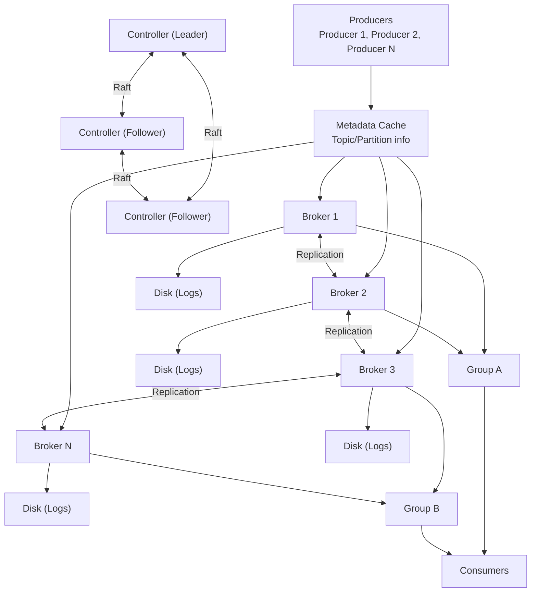
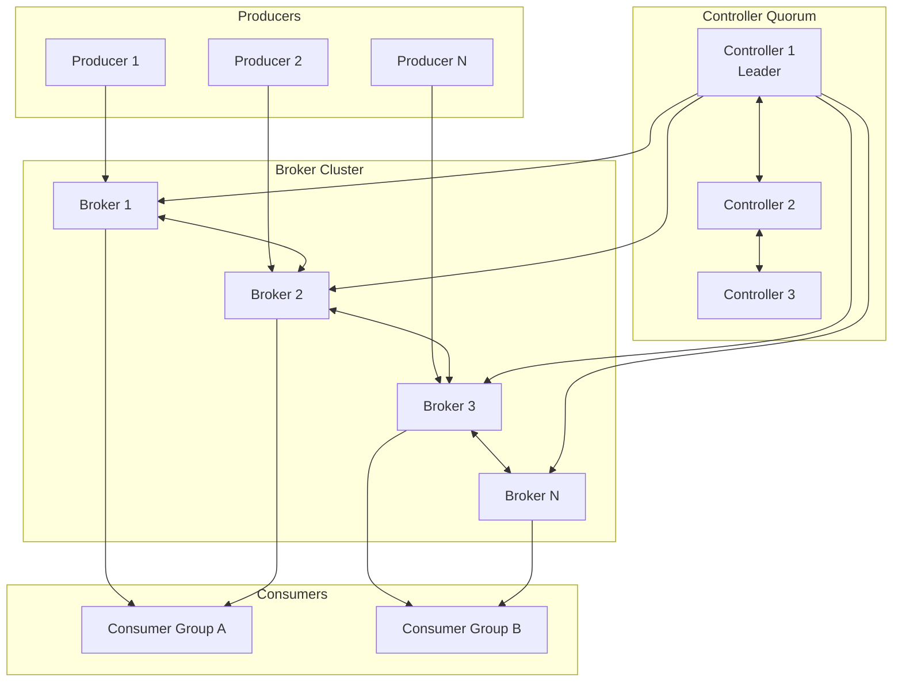
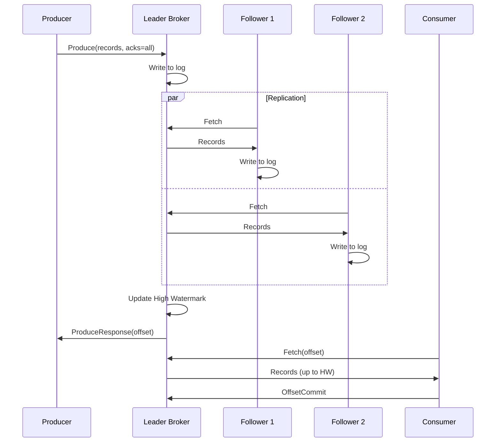
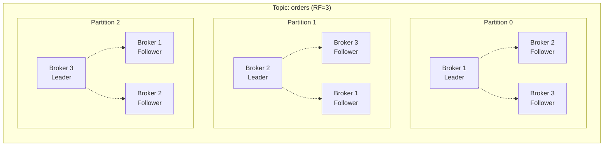

# Distributed Message Queue - Data Model & Architecture

## 1. High-Level Architecture

### System Overview



<details>
<summary>ASCII diagram (reference)</summary>

```text
┌─────────────────────────────────────────────────────────────────────────────────┐
│                    Distributed Message Queue Architecture                        │
├─────────────────────────────────────────────────────────────────────────────────┤
│                                                                                   │
│  Producers                                                                        │
│  ┌──────────┐  ┌──────────┐  ┌──────────┐                                       │
│  │Producer 1│  │Producer 2│  │Producer N│                                       │
│  └────┬─────┘  └────┬─────┘  └────┬─────┘                                       │
│       │             │             │                                              │
│       └─────────────┴─────────────┘                                              │
│                     │                                                            │
│              ┌──────▼──────┐                                                     │
│              │   Metadata  │ ◄─── Topic/Partition info                          │
│              │   Cache     │                                                     │
│              └──────┬──────┘                                                     │
│                     │                                                            │
│    ┌────────────────┼────────────────┬────────────────┐                         │
│    │                │                │                │                          │
│    ▼                ▼                ▼                ▼                          │
│ ┌──────┐        ┌──────┐        ┌──────┐        ┌──────┐                        │
│ │Broker│        │Broker│        │Broker│        │Broker│                        │
│ │  1   │◄──────►│  2   │◄──────►│  3   │◄──────►│  N   │                        │
│ └──┬───┘        └──┬───┘        └──┬───┘        └──┬───┘                        │
│    │               │               │               │                            │
│    │  Replication  │               │               │                            │
│    │               │               │               │                            │
│ ┌──┴───┐        ┌──┴───┐        ┌──┴───┐        ┌──┴───┐                        │
│ │ Disk │        │ Disk │        │ Disk │        │ Disk │                        │
│ │(Logs)│        │(Logs)│        │(Logs)│        │(Logs)│                        │
│ └──────┘        └──────┘        └──────┘        └──────┘                        │
│                                                                                   │
│                     │                                                            │
│       ┌─────────────┴─────────────┐                                             │
│       │                           │                                              │
│    ┌──▼───┐                    ┌──▼───┐                                         │
│    │Group │                    │Group │                                         │
│    │  A   │                    │  B   │                                         │
│    └──────┘                    └──────┘                                         │
│  Consumers                                                                       │
│                                                                                   │
│  Controller Cluster (Raft-based)                                                 │
│  ┌────────────┐  ┌────────────┐  ┌────────────┐                                 │
│  │ Controller │  │ Controller │  │ Controller │                                 │
│  │   (Leader) │  │ (Follower) │  │ (Follower) │                                 │
│  └────────────┘  └────────────┘  └────────────┘                                 │
│                                                                                   │
└─────────────────────────────────────────────────────────────────────────────────┘
```

</details>
```

---

## 2. Core Components

### 2.1 Broker

```
Purpose: Store and serve messages
Responsibilities:
├── Accept produce requests
├── Store messages to disk
├── Serve fetch requests
├── Replicate to followers
├── Participate in leader election
└── Report metrics

Key Subsystems:
├── Network Layer (Acceptor, Processor threads)
├── Request Handler (API processing)
├── Log Manager (Segment management)
├── Replica Manager (Replication)
├── Group Coordinator (Consumer groups)
└── Transaction Coordinator (Exactly-once)
```

### 2.2 Controller

```
Purpose: Cluster metadata management
Responsibilities:
├── Topic/partition management
├── Broker registration
├── Leader election
├── Partition reassignment
├── Configuration management
└── ACL management

Implementation:
├── Raft consensus (KRaft mode)
├── Replicated state machine
├── Metadata log
└── Snapshot for recovery
```

### 2.3 Log Manager

```
Purpose: Manage on-disk message storage
Responsibilities:
├── Segment management
├── Index maintenance
├── Log cleaning/compaction
├── Retention enforcement
└── Recovery after crash

Structure:
├── Active segment (current writes)
├── Closed segments (read-only)
├── Offset index (sparse)
├── Time index
└── Transaction index
```

---

## 3. Data Flow Diagrams

### 3.1 Produce Flow

```
┌──────────────────────────────────────────────────────────────────────────────┐
│                            Produce Flow                                       │
├──────────────────────────────────────────────────────────────────────────────┤
│                                                                               │
│  Producer          Broker (Leader)        Broker (Follower)     Broker (F2) │
│     │                    │                      │                    │       │
│     │  1. Produce        │                      │                    │       │
│     │  (acks=all)        │                      │                    │       │
│     │───────────────────>│                      │                    │       │
│     │                    │                      │                    │       │
│     │                    │  2. Write to log     │                    │       │
│     │                    │  (append to segment) │                    │       │
│     │                    │                      │                    │       │
│     │                    │  3. Wait for ISR     │                    │       │
│     │                    │  replication         │                    │       │
│     │                    │                      │                    │       │
│     │                    │  4. Fetch request    │                    │       │
│     │                    │<─────────────────────│                    │       │
│     │                    │                      │                    │       │
│     │                    │  5. Send records     │                    │       │
│     │                    │─────────────────────>│                    │       │
│     │                    │                      │                    │       │
│     │                    │  6. Fetch request    │                    │       │
│     │                    │<──────────────────────────────────────────│       │
│     │                    │                      │                    │       │
│     │                    │  7. Send records     │                    │       │
│     │                    │──────────────────────────────────────────>│       │
│     │                    │                      │                    │       │
│     │                    │  8. All ISR acked    │                    │       │
│     │                    │                      │                    │       │
│     │  9. Produce ACK    │                      │                    │       │
│     │  (offset assigned) │                      │                    │       │
│     │<───────────────────│                      │                    │       │
│     │                    │                      │                    │       │
└──────────────────────────────────────────────────────────────────────────────┘
```

### 3.2 Consume Flow

```
┌──────────────────────────────────────────────────────────────────────────────┐
│                            Consume Flow                                       │
├──────────────────────────────────────────────────────────────────────────────┤
│                                                                               │
│  Consumer              Coordinator              Broker (Leader)              │
│     │                       │                        │                       │
│     │  1. FindCoordinator   │                        │                       │
│     │──────────────────────>│                        │                       │
│     │                       │                        │                       │
│     │  2. Coordinator info  │                        │                       │
│     │<──────────────────────│                        │                       │
│     │                       │                        │                       │
│     │  3. JoinGroup         │                        │                       │
│     │──────────────────────>│                        │                       │
│     │                       │                        │                       │
│     │  4. JoinGroup response│                        │                       │
│     │  (assignment if leader)                        │                       │
│     │<──────────────────────│                        │                       │
│     │                       │                        │                       │
│     │  5. SyncGroup         │                        │                       │
│     │  (leader sends assign)│                        │                       │
│     │──────────────────────>│                        │                       │
│     │                       │                        │                       │
│     │  6. SyncGroup response│                        │                       │
│     │  (partition assignment)                        │                       │
│     │<──────────────────────│                        │                       │
│     │                       │                        │                       │
│     │  7. Fetch             │                        │                       │
│     │─────────────────────────────────────────────-->│                       │
│     │                       │                        │                       │
│     │  8. Records           │                        │                       │
│     │<─────────────────────────────────────────────────│                     │
│     │                       │                        │                       │
│     │  9. OffsetCommit      │                        │                       │
│     │──────────────────────>│                        │                       │
│     │                       │                        │                       │
│     │  10. Heartbeat (periodic)                      │                       │
│     │──────────────────────>│                        │                       │
│     │                       │                        │                       │
└──────────────────────────────────────────────────────────────────────────────┘
```

### 3.3 Replication Flow

```
┌──────────────────────────────────────────────────────────────────────────────┐
│                          Replication Flow                                     │
├──────────────────────────────────────────────────────────────────────────────┤
│                                                                               │
│  Leader                  Follower 1               Follower 2                 │
│    │                         │                        │                       │
│    │  High Watermark: 100    │  LEO: 95              │  LEO: 90              │
│    │  LEO: 105               │                        │                       │
│    │                         │                        │                       │
│    │                         │  Fetch(offset=95)     │                       │
│    │<────────────────────────│                        │                       │
│    │                         │                        │                       │
│    │  Records [95-105]       │                        │                       │
│    │  HW: 100                │                        │                       │
│    │────────────────────────>│                        │                       │
│    │                         │                        │                       │
│    │                         │  Write to log         │                       │
│    │                         │  LEO: 105             │                       │
│    │                         │                        │                       │
│    │                         │                        │  Fetch(offset=90)    │
│    │<────────────────────────────────────────────────│                       │
│    │                         │                        │                       │
│    │  Records [90-105]       │                        │                       │
│    │  HW: 100                │                        │                       │
│    │────────────────────────────────────────────────>│                       │
│    │                         │                        │                       │
│    │                         │                        │  Write to log        │
│    │                         │                        │  LEO: 105            │
│    │                         │                        │                       │
│    │  All ISR at LEO 105     │                        │                       │
│    │  Advance HW to 105      │                        │                       │
│    │                         │                        │                       │
│    │  Next fetch includes    │                        │                       │
│    │  HW: 105                │                        │                       │
│    │                         │                        │                       │
└──────────────────────────────────────────────────────────────────────────────┘

Key Concepts:
├── LEO (Log End Offset): Last offset written to log
├── HW (High Watermark): Last offset replicated to all ISR
├── ISR (In-Sync Replicas): Replicas within lag threshold
└── Consumers only see up to HW (committed messages)
```

---

## 4. Log Storage Architecture

### Segment Structure

```
┌──────────────────────────────────────────────────────────────────────────────┐
│                         Log Segment Structure                                 │
├──────────────────────────────────────────────────────────────────────────────┤
│                                                                               │
│  Partition Directory: /data/kafka-logs/orders-0/                             │
│                                                                               │
│  ┌─────────────────────────────────────────────────────────────────────┐     │
│  │ Segment 0 (base offset: 0)                                          │     │
│  │ ├── 00000000000000000000.log      (1 GB, closed)                   │     │
│  │ ├── 00000000000000000000.index    (10 MB)                          │     │
│  │ └── 00000000000000000000.timeindex (10 MB)                         │     │
│  └─────────────────────────────────────────────────────────────────────┘     │
│                                                                               │
│  ┌─────────────────────────────────────────────────────────────────────┐     │
│  │ Segment 1 (base offset: 1000000)                                    │     │
│  │ ├── 00000000000001000000.log      (1 GB, closed)                   │     │
│  │ ├── 00000000000001000000.index                                     │     │
│  │ └── 00000000000001000000.timeindex                                 │     │
│  └─────────────────────────────────────────────────────────────────────┘     │
│                                                                               │
│  ┌─────────────────────────────────────────────────────────────────────┐     │
│  │ Segment 2 (base offset: 2000000) - ACTIVE                          │     │
│  │ ├── 00000000000002000000.log      (500 MB, active)                 │     │
│  │ ├── 00000000000002000000.index                                     │     │
│  │ └── 00000000000002000000.timeindex                                 │     │
│  └─────────────────────────────────────────────────────────────────────┘     │
│                                                                               │
│  Offset Lookup:                                                               │
│  1. Binary search in index files to find segment                             │
│  2. Binary search in segment's index for position                            │
│  3. Sequential scan from position to find exact offset                       │
│                                                                               │
└──────────────────────────────────────────────────────────────────────────────┘
```

### Log Compaction

```
┌──────────────────────────────────────────────────────────────────────────────┐
│                          Log Compaction                                       │
├──────────────────────────────────────────────────────────────────────────────┤
│                                                                               │
│  Before Compaction (cleanup.policy=compact):                                  │
│  ┌─────────────────────────────────────────────────────────────────────┐     │
│  │ Offset │ Key  │ Value                                               │     │
│  ├────────┼──────┼──────────────────────────────────────────────────────│     │
│  │   0    │  A   │ v1                                                  │     │
│  │   1    │  B   │ v1                                                  │     │
│  │   2    │  A   │ v2    ← Newer value for key A                      │     │
│  │   3    │  C   │ v1                                                  │     │
│  │   4    │  B   │ v2    ← Newer value for key B                      │     │
│  │   5    │  A   │ v3    ← Newest value for key A                     │     │
│  │   6    │  B   │ null  ← Tombstone (delete key B)                   │     │
│  └─────────────────────────────────────────────────────────────────────┘     │
│                                                                               │
│  After Compaction:                                                            │
│  ┌─────────────────────────────────────────────────────────────────────┐     │
│  │ Offset │ Key  │ Value                                               │     │
│  ├────────┼──────┼──────────────────────────────────────────────────────│     │
│  │   3    │  C   │ v1    ← Only value for key C                       │     │
│  │   5    │  A   │ v3    ← Latest value for key A                     │     │
│  │   6    │  B   │ null  ← Tombstone retained for delete.retention.ms │     │
│  └─────────────────────────────────────────────────────────────────────┘     │
│                                                                               │
│  Use Cases:                                                                   │
│  ├── Changelog topics (database CDC)                                         │
│  ├── State stores (Kafka Streams)                                            │
│  └── Configuration topics                                                    │
│                                                                               │
└──────────────────────────────────────────────────────────────────────────────┘
```

---

## 5. Controller Architecture

### KRaft Mode (No ZooKeeper)

```
┌──────────────────────────────────────────────────────────────────────────────┐
│                      Controller Architecture (KRaft)                          │
├──────────────────────────────────────────────────────────────────────────────┤
│                                                                               │
│  Controller Quorum (Raft Consensus)                                           │
│  ┌─────────────────────────────────────────────────────────────────────┐     │
│  │                                                                      │     │
│  │  ┌────────────┐    ┌────────────┐    ┌────────────┐                │     │
│  │  │ Controller │    │ Controller │    │ Controller │                │     │
│  │  │  1 (Leader)│───>│ 2 (Follower)│───>│ 3 (Follower)│               │     │
│  │  └─────┬──────┘    └────────────┘    └────────────┘                │     │
│  │        │                                                            │     │
│  │        │ Raft Log (Metadata)                                       │     │
│  │        │ ┌────────────────────────────────────────┐                │     │
│  │        │ │ [Topic Created] [Partition Assigned]   │                │     │
│  │        │ │ [Broker Registered] [Leader Elected]   │                │     │
│  │        │ └────────────────────────────────────────┘                │     │
│  │        │                                                            │     │
│  └────────┼────────────────────────────────────────────────────────────┘     │
│           │                                                                   │
│           │ Metadata Updates                                                  │
│           ▼                                                                   │
│  ┌─────────────────────────────────────────────────────────────────────┐     │
│  │                        Brokers                                       │     │
│  │  ┌────────┐  ┌────────┐  ┌────────┐  ┌────────┐                    │     │
│  │  │Broker 1│  │Broker 2│  │Broker 3│  │Broker N│                    │     │
│  │  │        │  │        │  │        │  │        │                    │     │
│  │  │Metadata│  │Metadata│  │Metadata│  │Metadata│                    │     │
│  │  │ Cache  │  │ Cache  │  │ Cache  │  │ Cache  │                    │     │
│  │  └────────┘  └────────┘  └────────┘  └────────┘                    │     │
│  └─────────────────────────────────────────────────────────────────────┘     │
│                                                                               │
│  Metadata Records:                                                            │
│  ├── TopicRecord: Topic creation/deletion                                    │
│  ├── PartitionRecord: Partition configuration                                │
│  ├── PartitionChangeRecord: Leader/ISR changes                              │
│  ├── BrokerRegistrationRecord: Broker join/leave                            │
│  └── ConfigRecord: Configuration changes                                     │
│                                                                               │
└──────────────────────────────────────────────────────────────────────────────┘
```

### Leader Election

```java
// Leader Election Process
public class LeaderElection {
    
    /**
     * Triggered when:
     * - Broker fails (detected via heartbeat timeout)
     * - Broker shuts down (controlled shutdown)
     * - Partition reassignment
     */
    public void electLeader(String topic, int partition) {
        // Get current partition state
        PartitionState state = metadataCache.getPartition(topic, partition);
        List<Integer> isr = state.getIsr();
        List<Integer> replicas = state.getReplicas();
        
        // Preferred leader election (if enabled)
        int preferredLeader = replicas.get(0);
        if (isr.contains(preferredLeader) && isAlive(preferredLeader)) {
            setLeader(topic, partition, preferredLeader);
            return;
        }
        
        // Elect from ISR (maintains consistency)
        for (int replica : isr) {
            if (isAlive(replica)) {
                setLeader(topic, partition, replica);
                return;
            }
        }
        
        // Unclean leader election (if enabled, may lose data)
        if (uncleanLeaderElectionEnabled) {
            for (int replica : replicas) {
                if (isAlive(replica)) {
                    log.warn("Unclean leader election for {}-{}", topic, partition);
                    setLeader(topic, partition, replica);
                    return;
                }
            }
        }
        
        // No leader available
        setLeader(topic, partition, -1);
        log.error("No leader available for {}-{}", topic, partition);
    }
}
```

---

## 6. Mermaid Diagrams

### System Architecture



### Message Flow Sequence



### Partition Distribution



