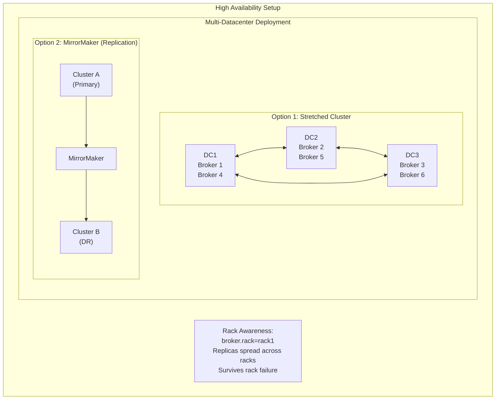

# Distributed Message Queue - Production Deep Dives (Operations)

## 1. Scaling Strategies

### Horizontal Scaling

```
┌──────────────────────────────────────────────────────────────────────────────┐
│                         Scaling Dimensions                                    │
├──────────────────────────────────────────────────────────────────────────────┤
│                                                                               │
│  1. Broker Scaling                                                            │
│  ┌────────────────────────────────────────────────────────────────────┐      │
│  │                                                                     │      │
│  │  Adding Brokers:                                                   │      │
│  │  - New broker registers with controller                           │      │
│  │  - Existing partitions NOT automatically rebalanced               │      │
│  │  - Use partition reassignment tool                                │      │
│  │  - New topics will use new broker                                 │      │
│  │                                                                     │      │
│  │  Removing Brokers:                                                 │      │
│  │  - Reassign partitions first                                      │      │
│  │  - Wait for reassignment to complete                              │      │
│  │  - Controlled shutdown preserves data                             │      │
│  │                                                                     │      │
│  └────────────────────────────────────────────────────────────────────┘      │
│                                                                               │
│  2. Partition Scaling                                                         │
│  ┌────────────────────────────────────────────────────────────────────┐      │
│  │                                                                     │      │
│  │  Increasing Partitions:                                            │      │
│  │  - Can increase at any time                                       │      │
│  │  - Existing data stays in original partitions                    │      │
│  │  - Key-based ordering affected (different partition mapping)      │      │
│  │                                                                     │      │
│  │  Decreasing Partitions:                                            │      │
│  │  - NOT supported (would lose data)                                │      │
│  │  - Must create new topic and migrate                              │      │
│  │                                                                     │      │
│  │  Partition Count Guidelines:                                       │      │
│  │  - Partitions = max(throughput / partition_throughput,            │      │
│  │                     consumer_count)                                │      │
│  │  - Single partition: ~10 MB/s write, ~30 MB/s read               │      │
│  │  - More partitions = more parallelism but more overhead          │      │
│  │                                                                     │      │
│  └────────────────────────────────────────────────────────────────────┘      │
│                                                                               │
│  3. Consumer Scaling                                                          │
│  ┌────────────────────────────────────────────────────────────────────┐      │
│  │                                                                     │      │
│  │  Within Consumer Group:                                            │      │
│  │  - Max consumers = partition count                                │      │
│  │  - Adding consumer triggers rebalance                             │      │
│  │  - Excess consumers sit idle                                      │      │
│  │                                                                     │      │
│  │  Multiple Consumer Groups:                                         │      │
│  │  - Each group gets all messages                                   │      │
│  │  - Independent offset tracking                                    │      │
│  │  - Use for different processing pipelines                         │      │
│  │                                                                     │      │
│  └────────────────────────────────────────────────────────────────────┘      │
│                                                                               │
└──────────────────────────────────────────────────────────────────────────────┘
```

### Partition Reassignment

```java
// Partition reassignment process
public class PartitionReassignment {
    
    // Step 1: Generate reassignment plan
    // kafka-reassign-partitions.sh --generate
    {
        "version": 1,
        "partitions": [
            {"topic": "orders", "partition": 0, "replicas": [1, 2, 3]},
            {"topic": "orders", "partition": 1, "replicas": [2, 3, 4]},
            {"topic": "orders", "partition": 2, "replicas": [3, 4, 1]}
        ]
    }
    
    // Step 2: Execute reassignment
    // kafka-reassign-partitions.sh --execute
    
    // Step 3: Verify completion
    // kafka-reassign-partitions.sh --verify
    
    // Throttling to prevent impact
    // --throttle 50000000 (50 MB/s)
    
    /**
     * Reassignment process:
     * 1. Add new replicas to partition
     * 2. New replicas fetch data from leader
     * 3. Once caught up, added to ISR
     * 4. Old replicas removed
     * 5. Leader election if needed
     */
}
```

### Capacity Planning

```
Capacity Planning Formula:

1. Storage per broker:
   storage = (write_throughput × retention_seconds × replication_factor) / broker_count
   
   Example:
   - Write: 100 MB/s
   - Retention: 7 days = 604,800 seconds
   - RF: 3
   - Brokers: 10
   
   storage = (100 × 604,800 × 3) / 10 = 18.1 TB per broker

2. Network bandwidth per broker:
   inbound = write_throughput / broker_count
   outbound = inbound × (replication_factor - 1 + consumer_groups)
   
   Example:
   - Write: 100 MB/s
   - RF: 3
   - Consumer groups: 5
   - Brokers: 10
   
   inbound = 100 / 10 = 10 MB/s
   outbound = 10 × (2 + 5) = 70 MB/s

3. Partition count:
   partitions = max(
     target_throughput / partition_throughput,
     consumer_parallelism
   )
   
   Example:
   - Target: 100 MB/s
   - Per partition: 10 MB/s
   - Consumers: 50
   
   partitions = max(10, 50) = 50
```

### Backup and Recovery

**RPO (Recovery Point Objective):** 0 (no data loss)
- Maximum acceptable data loss
- Messages stored with replication factor 3
- All replicas must acknowledge before commit (acks=all)
- Cross-region replication ensures no message loss

**RTO (Recovery Time Objective):** < 10 minutes
- Maximum acceptable downtime
- Time to restore service via failover to secondary region
- Includes broker failover, partition reassignment, and traffic rerouting

**Backup Strategy:**
- **Message Logs**: Replication factor 3 across AZs
- **Topic Metadata**: Stored in Zookeeper/KRaft with replication
- **Cross-region Mirroring**: Real-time mirroring to DR region
- **Configuration Backups**: Daily backups of broker and topic configs
- **Offset Backups**: Consumer offsets stored in internal topic with replication

**Restore Steps:**
1. Detect primary region failure (health checks) - 1 minute
2. Promote DR region brokers to primary - 3 minutes
3. Reassign partitions to available brokers - 3 minutes
4. Update client configurations to point to DR region - 1 minute
5. Verify message queue service health and resume traffic - 2 minutes

**Disaster Recovery Testing:**

**Frequency:** Quarterly (every 3 months)

**Pre-Test Checklist:**
- [ ] DR region infrastructure provisioned and healthy
- [ ] Kafka replication lag < 1 minute
- [ ] Consumer offset replication verified
- [ ] DNS failover scripts tested
- [ ] Monitoring alerts configured for DR region
- [ ] On-call engineer notified and available

**Test Process (Step-by-Step):**

1. **Pre-Test Baseline (T-30 minutes):**
   - Record current traffic metrics (QPS, latency, error rate)
   - Capture message production/consumption rate
   - Document active topic/partition count
   - Verify Kafka replication lag (< 1 minute)
   - Test message operations (100 sample messages)

2. **Simulate Primary Region Failure (T+0):**
   - Stop all services in primary region (or use chaos engineering tool)
   - Verify health checks fail
   - Confirm traffic routing stops to primary region

3. **Execute Failover Procedure (T+0 to T+10 minutes):**
   - **T+0-1 min:** Detect failure via health checks
   - **T+1-3 min:** Promote secondary region to primary
   - **T+3-4 min:** Update DNS records (Route53 health checks)
   - **T+4-7 min:** Rebalance Kafka partitions
   - **T+7-8 min:** Restore consumer offsets
   - **T+8-9 min:** Verify all services healthy in DR region
   - **T+9-10 min:** Resume traffic to DR region

4. **Post-Failover Validation (T+10 to T+20 minutes):**
   - Verify RTO < 10 minutes: ✅ PASS/FAIL
   - Verify RPO = 0: Check message count matches pre-failover (exact match)
   - Test message production: Produce 1,000 test messages, verify 100% success
   - Test message consumption: Consume 1,000 test messages, verify 100% success
   - Monitor metrics: QPS, latency, error rate return to baseline
   - Verify consumer offsets: Check offsets preserved correctly

5. **Data Integrity Verification:**
   - Compare message count: Pre-failover vs post-failover (should match exactly, RPO=0)
   - Spot check: Verify 100 random messages accessible
   - Check topic/partition health: Verify all topics/partitions healthy
   - Test edge cases: High-throughput topics, large messages, consumer groups

6. **Failback Procedure (T+20 to T+25 minutes):**
   - Restore primary region services
   - Sync Kafka data from DR to primary
   - Verify replication lag < 1 minute
   - Update DNS to route traffic back to primary
   - Monitor for 5 minutes before declaring success

**Validation Criteria:**
- ✅ RTO < 10 minutes: Time from failure to service resumption
- ✅ RPO = 0: No data loss (verified via message count, exact match)
- ✅ Message operations work: >99.9% messages produced/consumed successfully
- ✅ No data loss: Message count matches pre-failover exactly
- ✅ Service resumes within RTO target: All metrics return to baseline
- ✅ Consumer offsets preserved: All offsets intact

**Post-Test Actions:**
- Document test results in runbook
- Update last test date
- Identify improvements for next test
- Review and update failover procedures if needed

**Last Test:** TBD (to be scheduled)
**Next Test:** [Last Test Date + 3 months]

---

## 4. Simulation (End-to-End User Journeys)

### Journey 1: Producer Publishes Message and Consumer Receives It

**Step-by-step:**

1. **Producer Action**: Application sends message via `POST /v1/topics/orders/messages` with `{"key": "order_123", "value": "{\"order_id\": \"123\", \"status\": \"created\"}"}`
2. **Message Queue Service**: 
   - Validates message format
   - Determines partition: `partition = hash("order_123") % 10 = 5`
   - Appends to partition 5 on broker 2: `log.append(partition_5, message)`
   - Replicates to replicas (brokers 3, 4)
   - Returns offset: `{"partition": 5, "offset": 12345}`
3. **Response**: `201 Created` with `{"partition": 5, "offset": 12345}`
4. **Consumer polls** (every 100ms):
   - Request: `GET /v1/topics/orders/consumers/consumer_group_1/messages?partition=5&offset=12344`
   - Broker returns messages from offset 12344
5. **Consumer receives message**:
   - Processes message: Updates order status in database
   - Commits offset: `PUT /v1/topics/orders/consumers/consumer_group_1/offsets {"partition": 5, "offset": 12345}`
6. **Result**: Message delivered and processed within 200ms

**Total latency: ~200ms** (publish 50ms + poll interval 100ms + processing 50ms)

### Journey 2: Consumer Group Rebalancing

**Step-by-step:**

1. **Initial State**: Consumer group with 3 consumers (C1, C2, C3) consuming 10 partitions
   - C1: partitions 0-3
   - C2: partitions 4-6
   - C3: partitions 7-9
2. **New Consumer Joins**: C4 joins consumer group
3. **Rebalancing Triggered**:
   - Coordinator detects group membership change
   - Calculates new assignment: 10 partitions / 4 consumers = 2.5 partitions each
   - Assigns: C1: 0-2, C2: 3-5, C3: 6-7, C4: 8-9
4. **Consumers Rebalance**:
   - C1, C2, C3 stop consuming, commit offsets
   - All consumers receive new partition assignments
   - Consumers resume from committed offsets
5. **Result**: Load redistributed, no message loss

**Total time: ~5 seconds** (rebalancing + resume)

### Failure & Recovery Walkthrough

**Scenario: Broker Failure During Message Production**

**RTO (Recovery Time Objective):** < 2 minutes (partition leader election + producer retry)  
**RPO (Recovery Point Objective):** 0 (replication factor 3, no data loss)

**Timeline:**

```
T+0s:    Broker 2 crashes (leader for partitions 5-9)
T+0-5s:  Producers writing to partitions 5-9 fail
T+5s:    Controller detects broker failure
T+10s:   Controller elects new leaders from replicas
T+15s:   Partition 5: Broker 3 promoted to leader
T+15s:   Partition 6: Broker 4 promoted to leader
T+20s:   All partitions have new leaders
T+25s:   Producers retry, succeed with new leaders
T+30s:   Consumers resume from last committed offset
T+60s:   ISR (In-Sync Replicas) updated, replication resumes
```

**What degrades:**
- Writes to partitions 5-9 fail for 15-25 seconds
- Producers retry automatically (no data loss)
- Reads may hit replicas (slightly higher latency)

**What stays up:**
- Other partitions continue normally
- Consumer groups rebalance automatically
- Replication continues on other brokers

**What recovers automatically:**
- Controller elects new leaders
- Producers retry with new leaders
- Consumers resume consumption
- No manual intervention required

**What requires human intervention:**
- Investigate root cause of broker failure
- Replace failed broker hardware
- Review broker capacity

**Cascading failure prevention:**
- Replication factor 3 prevents data loss
- Leader election prevents single point of failure
- Producer retries prevent message loss
- Consumer offset commits prevent reprocessing

### Database Connection Pool Configuration

**Kafka Producer Connection Pool:**

```yaml
kafka:
  producer:
    # Connection pool sizing
    max-in-flight-requests-per-connection: 5
    connections-max-idle-ms: 540000  # 9 minutes
    
    # Pool configuration
    bootstrap-servers: kafka-1:9092,kafka-2:9092,kafka-3:9092
    connection-pool-size: 10  # Connections per broker
```

**Pool Sizing Calculation:**
```
For Kafka producers:
- Each producer maintains connections to all brokers
- 3 brokers × 10 connections = 30 connections per producer instance
- 50 producer instances × 30 = 1,500 max connections
- Kafka broker max connections: 2,000 per broker (6,000 total)
```

**Kafka Consumer Connection Pool:**

```yaml
kafka:
  consumer:
    # Connection pool sizing
    max-poll-records: 500
    fetch-min-bytes: 1
    fetch-max-wait-ms: 500
    
    # Pool configuration
    bootstrap-servers: kafka-1:9092,kafka-2:9092,kafka-3:9092
    connections-per-broker: 5
```

**Pool Sizing Calculation:**
```
For Kafka consumers:
- Each consumer maintains connections to all brokers
- 3 brokers × 5 connections = 15 connections per consumer instance
- 100 consumer instances × 15 = 1,500 max connections
- Kafka broker max connections: 2,000 per broker (6,000 total)
```

**ZooKeeper/KRaft Connection Pool:**

```yaml
zookeeper:
  connection:
    timeout: 30000  # 30s
    session-timeout: 18000  # 18s
    max-connections: 50  # Per client
```

**Pool Exhaustion Mitigation:**

1. **Monitoring:**
   - Alert when connection usage > 80%
   - Track connection creation/destruction rates
   - Monitor connection pool metrics

2. **Circuit Breaker:**
   - If connection pool exhausted, open circuit breaker
   - Fail fast instead of blocking

3. **Connection Reuse:**
   - Reuse connections across requests
   - Implement connection pooling in Kafka clients
   - Monitor and adjust pool sizes based on load

---

## 2. Reliability Patterns

### Durability Configuration

```java
// Producer durability settings
Properties producerProps = new Properties();
producerProps.put("acks", "all");              // Wait for all ISR
producerProps.put("retries", Integer.MAX_VALUE);
producerProps.put("enable.idempotence", true);
producerProps.put("max.in.flight.requests.per.connection", 5);

// Broker durability settings
// min.insync.replicas=2
// unclean.leader.election.enable=false
// log.flush.interval.messages=10000
// log.flush.interval.ms=1000

// Topic durability settings
// replication.factor=3
// min.insync.replicas=2

/**
 * Durability levels:
 * 
 * Level 1: acks=0 (fire and forget)
 * - No durability guarantee
 * - Highest throughput
 * - Use for: metrics, logs
 * 
 * Level 2: acks=1 (leader only)
 * - Leader acknowledged
 * - May lose on leader failure
 * - Use for: non-critical data
 * 
 * Level 3: acks=all, min.insync.replicas=1
 * - All ISR acknowledged
 * - May lose if ISR=1
 * - Use for: important data
 * 
 * Level 4: acks=all, min.insync.replicas=2
 * - At least 2 replicas
 * - Survives single failure
 * - Use for: critical data
 */
```

### High Availability Configuration



<details>
<summary>ASCII diagram (reference)</summary>

```
┌──────────────────────────────────────────────────────────────────────────────┐
│                      High Availability Setup                                  │
├──────────────────────────────────────────────────────────────────────────────┤
│                                                                               │
│  Multi-Datacenter Deployment:                                                 │
│  ┌────────────────────────────────────────────────────────────────────┐      │
│  │                                                                     │      │
│  │  Option 1: Stretched Cluster                                       │      │
│  │  ┌─────────────┐         ┌─────────────┐         ┌─────────────┐  │      │
│  │  │    DC1      │         │    DC2      │         │    DC3      │  │      │
│  │  │  Broker 1   │◄───────►│  Broker 2   │◄───────►│  Broker 3   │  │      │
│  │  │  Broker 4   │         │  Broker 5   │         │  Broker 6   │  │      │
│  │  └─────────────┘         └─────────────┘         └─────────────┘  │      │
│  │                                                                     │      │
│  │  - Single cluster across DCs                                       │      │
│  │  - Synchronous replication                                         │      │
│  │  - Higher latency (cross-DC)                                       │      │
│  │  - Automatic failover                                              │      │
│  │                                                                     │      │
│  │  Option 2: MirrorMaker (Replication)                               │      │
│  │  ┌─────────────┐                       ┌─────────────┐             │      │
│  │  │ Cluster A   │ ──── MirrorMaker ───► │ Cluster B   │             │      │
│  │  │ (Primary)   │                       │ (DR)        │             │      │
│  │  └─────────────┘                       └─────────────┘             │      │
│  │                                                                     │      │
│  │  - Separate clusters                                               │      │
│  │  - Asynchronous replication                                        │      │
│  │  - Lower latency (local writes)                                   │      │
│  │  - Manual failover                                                │      │
│  │                                                                     │      │
│  └────────────────────────────────────────────────────────────────────┘      │
│                                                                               │
│  Rack Awareness:                                                              │
│  - broker.rack=rack1                                                         │
│  - Replicas spread across racks                                              │
│  - Survives rack failure                                                     │
│                                                                               │
└──────────────────────────────────────────────────────────────────────────────┘
```

</details>

### Circuit Breaker Pattern

```java
public class ProducerCircuitBreaker {
    
    private final AtomicInteger failures = new AtomicInteger(0);
    private final AtomicLong lastFailure = new AtomicLong(0);
    private volatile State state = State.CLOSED;
    
    private static final int FAILURE_THRESHOLD = 5;
    private static final long RESET_TIMEOUT_MS = 30000;
    
    public enum State { CLOSED, OPEN, HALF_OPEN }
    
    public void send(ProducerRecord<String, String> record) {
        if (state == State.OPEN) {
            if (System.currentTimeMillis() - lastFailure.get() > RESET_TIMEOUT_MS) {
                state = State.HALF_OPEN;
            } else {
                throw new CircuitBreakerOpenException();
            }
        }
        
        try {
            producer.send(record).get(5, TimeUnit.SECONDS);
            onSuccess();
        } catch (Exception e) {
            onFailure();
            throw e;
        }
    }
    
    private void onSuccess() {
        failures.set(0);
        state = State.CLOSED;
    }
    
    private void onFailure() {
        lastFailure.set(System.currentTimeMillis());
        if (failures.incrementAndGet() >= FAILURE_THRESHOLD) {
            state = State.OPEN;
        }
    }
}
```

---

## 3. Monitoring & Observability

### Key Metrics

```
┌──────────────────────────────────────────────────────────────────────────────┐
│                         Essential Metrics                                     │
├──────────────────────────────────────────────────────────────────────────────┤
│                                                                               │
│  Broker Metrics:                                                              │
│  ├── kafka.server:type=BrokerTopicMetrics                                    │
│  │   ├── MessagesInPerSec                                                    │
│  │   ├── BytesInPerSec                                                       │
│  │   ├── BytesOutPerSec                                                      │
│  │   └── FailedProduceRequestsPerSec                                         │
│  │                                                                           │
│  ├── kafka.server:type=ReplicaManager                                        │
│  │   ├── UnderReplicatedPartitions (should be 0)                            │
│  │   ├── OfflinePartitionsCount (should be 0)                               │
│  │   ├── LeaderCount                                                         │
│  │   └── PartitionCount                                                      │
│  │                                                                           │
│  └── kafka.network:type=RequestMetrics                                       │
│      ├── RequestsPerSec                                                      │
│      ├── TotalTimeMs (p99)                                                   │
│      └── RequestQueueTimeMs                                                  │
│                                                                               │
│  Producer Metrics:                                                            │
│  ├── record-send-rate                                                        │
│  ├── record-error-rate                                                       │
│  ├── request-latency-avg                                                     │
│  ├── batch-size-avg                                                          │
│  └── buffer-available-bytes                                                  │
│                                                                               │
│  Consumer Metrics:                                                            │
│  ├── records-consumed-rate                                                   │
│  ├── records-lag (per partition)                                             │
│  ├── records-lag-max                                                         │
│  ├── fetch-latency-avg                                                       │
│  └── commit-latency-avg                                                      │
│                                                                               │
│  Critical Alerts:                                                             │
│  ├── UnderReplicatedPartitions > 0 for > 5 min                              │
│  ├── OfflinePartitionsCount > 0                                              │
│  ├── Consumer lag > threshold                                                │
│  ├── Broker disk usage > 80%                                                 │
│  └── ISR shrink rate high                                                    │
│                                                                               │
└──────────────────────────────────────────────────────────────────────────────┘
```

### Consumer Lag Monitoring

```java
public class LagMonitor {
    
    /**
     * Consumer lag = Latest offset - Consumer offset
     * 
     * High lag indicates:
     * - Consumer processing too slow
     * - Consumer crashed/stuck
     * - Burst of traffic
     */
    
    public Map<TopicPartition, Long> calculateLag(String groupId) {
        AdminClient admin = AdminClient.create(props);
        
        // Get consumer offsets
        Map<TopicPartition, OffsetAndMetadata> consumerOffsets =
            admin.listConsumerGroupOffsets(groupId)
                 .partitionsToOffsetAndMetadata().get();
        
        // Get end offsets
        Map<TopicPartition, Long> endOffsets =
            consumer.endOffsets(consumerOffsets.keySet());
        
        // Calculate lag
        Map<TopicPartition, Long> lag = new HashMap<>();
        for (TopicPartition tp : consumerOffsets.keySet()) {
            long consumerOffset = consumerOffsets.get(tp).offset();
            long endOffset = endOffsets.get(tp);
            lag.put(tp, endOffset - consumerOffset);
        }
        
        return lag;
    }
}

// Prometheus metrics export
kafka_consumer_group_lag{
    group="order-processor",
    topic="orders",
    partition="0"
} 12345

// Grafana alert rule
ALERT ConsumerLagHigh
  IF kafka_consumer_group_lag > 10000
  FOR 5m
  LABELS { severity = "warning" }
  ANNOTATIONS {
    summary = "Consumer lag is high",
    description = "Group {{ $labels.group }} has lag {{ $value }}"
  }
```

### Distributed Tracing

```java
// Trace context propagation
public class TracingProducerInterceptor implements ProducerInterceptor<String, String> {
    
    @Override
    public ProducerRecord<String, String> onSend(ProducerRecord<String, String> record) {
        Span span = tracer.spanBuilder("kafka.produce")
            .setAttribute("messaging.system", "kafka")
            .setAttribute("messaging.destination", record.topic())
            .setAttribute("messaging.destination_kind", "topic")
            .startSpan();
        
        // Inject trace context into headers
        Headers headers = record.headers();
        propagator.inject(Context.current().with(span), headers, 
            (h, key, value) -> h.add(key, value.getBytes()));
        
        return record;
    }
}

public class TracingConsumerInterceptor implements ConsumerInterceptor<String, String> {
    
    @Override
    public ConsumerRecords<String, String> onConsume(ConsumerRecords<String, String> records) {
        for (ConsumerRecord<String, String> record : records) {
            // Extract trace context from headers
            Context context = propagator.extract(Context.current(), 
                record.headers(), headerGetter);
            
            Span span = tracer.spanBuilder("kafka.consume")
                .setParent(context)
                .setAttribute("messaging.kafka.partition", record.partition())
                .setAttribute("messaging.kafka.offset", record.offset())
                .startSpan();
            
            // Store span for later use
            record.headers().add("trace-span", spanContext.getBytes());
        }
        return records;
    }
}
```

---

## 4. Security

### Authentication

```
┌──────────────────────────────────────────────────────────────────────────────┐
│                         Authentication Methods                                │
├──────────────────────────────────────────────────────────────────────────────┤
│                                                                               │
│  1. SASL/PLAIN                                                                │
│  ┌────────────────────────────────────────────────────────────────────┐      │
│  │  - Username/password authentication                                │      │
│  │  - Simple to set up                                                │      │
│  │  - Must use with SSL/TLS                                          │      │
│  │                                                                     │      │
│  │  # Broker config                                                   │      │
│  │  listeners=SASL_SSL://0.0.0.0:9093                                │      │
│  │  sasl.enabled.mechanisms=PLAIN                                    │      │
│  │  sasl.mechanism.inter.broker.protocol=PLAIN                       │      │
│  │                                                                     │      │
│  │  # Client config                                                   │      │
│  │  security.protocol=SASL_SSL                                       │      │
│  │  sasl.mechanism=PLAIN                                             │      │
│  │  sasl.jaas.config=org.apache.kafka.common.security.plain.\        │      │
│  │    PlainLoginModule required username="user" password="pass";     │      │
│  └────────────────────────────────────────────────────────────────────┘      │
│                                                                               │
│  2. SASL/SCRAM                                                                │
│  ┌────────────────────────────────────────────────────────────────────┐      │
│  │  - Salted Challenge Response Authentication                        │      │
│  │  - Password not sent over wire                                    │      │
│  │  - Credentials stored in ZK/KRaft                                 │      │
│  │                                                                     │      │
│  │  # Create user                                                     │      │
│  │  kafka-configs.sh --alter --add-config \                          │      │
│  │    'SCRAM-SHA-256=[password=secret]' \                            │      │
│  │    --entity-type users --entity-name alice                        │      │
│  └────────────────────────────────────────────────────────────────────┘      │
│                                                                               │
│  3. mTLS (Mutual TLS)                                                         │
│  ┌────────────────────────────────────────────────────────────────────┐      │
│  │  - Certificate-based authentication                                │      │
│  │  - Both client and server present certificates                    │      │
│  │  - Strongest security                                             │      │
│  │                                                                     │      │
│  │  # Broker config                                                   │      │
│  │  listeners=SSL://0.0.0.0:9093                                     │      │
│  │  ssl.client.auth=required                                         │      │
│  │  ssl.keystore.location=/path/to/keystore.jks                     │      │
│  │  ssl.truststore.location=/path/to/truststore.jks                 │      │
│  └────────────────────────────────────────────────────────────────────┘      │
│                                                                               │
└──────────────────────────────────────────────────────────────────────────────┘
```

### Authorization (ACLs)

```bash
# Grant produce permission
kafka-acls.sh --add \
  --allow-principal User:producer-service \
  --operation Write \
  --topic orders

# Grant consume permission
kafka-acls.sh --add \
  --allow-principal User:consumer-service \
  --operation Read \
  --topic orders \
  --group order-processor

# Grant admin permission
kafka-acls.sh --add \
  --allow-principal User:admin \
  --operation All \
  --topic '*'

# List ACLs
kafka-acls.sh --list --topic orders

# ACL operations:
# - Read: Consume from topic
# - Write: Produce to topic
# - Create: Create topics
# - Delete: Delete topics
# - Alter: Modify topic config
# - Describe: View topic metadata
# - ClusterAction: Inter-broker operations
# - All: All operations
```

### Encryption

```
┌──────────────────────────────────────────────────────────────────────────────┐
│                         Encryption Configuration                              │
├──────────────────────────────────────────────────────────────────────────────┤
│                                                                               │
│  In-Transit Encryption (TLS):                                                 │
│  ┌────────────────────────────────────────────────────────────────────┐      │
│  │                                                                     │      │
│  │  # Broker config                                                   │      │
│  │  listeners=SSL://0.0.0.0:9093                                     │      │
│  │  ssl.keystore.type=PKCS12                                         │      │
│  │  ssl.keystore.location=/path/to/server.keystore.p12              │      │
│  │  ssl.keystore.password=keystore-password                          │      │
│  │  ssl.key.password=key-password                                    │      │
│  │  ssl.truststore.location=/path/to/truststore.p12                 │      │
│  │  ssl.truststore.password=truststore-password                      │      │
│  │                                                                     │      │
│  │  # Inter-broker encryption                                         │      │
│  │  security.inter.broker.protocol=SSL                               │      │
│  │                                                                     │      │
│  └────────────────────────────────────────────────────────────────────┘      │
│                                                                               │
│  At-Rest Encryption:                                                          │
│  ┌────────────────────────────────────────────────────────────────────┐      │
│  │                                                                     │      │
│  │  Option 1: Filesystem encryption (dm-crypt, LUKS)                 │      │
│  │  - Transparent to Kafka                                           │      │
│  │  - Protects against disk theft                                    │      │
│  │                                                                     │      │
│  │  Option 2: Application-level encryption                           │      │
│  │  - Encrypt message payload before producing                       │      │
│  │  - Decrypt after consuming                                        │      │
│  │  - Key management required                                        │      │
│  │                                                                     │      │
│  └────────────────────────────────────────────────────────────────────┘      │
│                                                                               │
└──────────────────────────────────────────────────────────────────────────────┘
```

---

## 5. Cost Analysis

### Infrastructure Costs

```
┌──────────────────────────────────────────────────────────────────────────────┐
│                         Cost Breakdown                                        │
├──────────────────────────────────────────────────────────────────────────────┤
│                                                                               │
│  Compute (Brokers):                                                           │
│  ├── Instance type: r6i.2xlarge (8 vCPU, 64GB RAM)                          │
│  ├── Cost: $0.504/hour × 24 × 30 = $363/month per broker                    │
│  ├── 10 brokers = $3,630/month                                               │
│  │                                                                           │
│  │  Sizing rationale:                                                        │
│  │  - RAM for page cache (50GB available)                                   │
│  │  - CPU for network I/O and compression                                   │
│  │  - Memory-optimized for read-heavy workloads                             │
│  │                                                                           │
│  Storage:                                                                     │
│  ├── Type: io2 SSD (for consistent IOPS)                                    │
│  ├── Size: 20TB per broker × 10 brokers = 200TB                             │
│  ├── Cost: $0.125/GB/month × 20,000GB × 10 = $25,000/month                  │
│  ├── IOPS: 64,000 IOPS × $0.065 = $4,160/month per broker                   │
│  │                                                                           │
│  │  Alternative: gp3 SSD                                                     │
│  │  - $0.08/GB/month × 200TB = $16,000/month                                │
│  │  - 16,000 IOPS included                                                  │
│  │  - Additional IOPS: $0.005/IOPS                                          │
│  │                                                                           │
│  Network:                                                                     │
│  ├── Data transfer out: 10TB/month × $0.09/GB = $900/month                  │
│  ├── Cross-AZ: 50TB/month × $0.01/GB = $500/month                           │
│  │                                                                           │
│  Controller Nodes:                                                            │
│  ├── Instance: m6i.large (2 vCPU, 8GB RAM) × 3                              │
│  ├── Cost: $0.096/hour × 24 × 30 × 3 = $207/month                           │
│  │                                                                           │
│  Total Monthly: ~$30,000-50,000 for production cluster                       │
│                                                                               │
└──────────────────────────────────────────────────────────────────────────────┘
```

### Cost Optimization Strategies

**Current Monthly Cost:** $500,000
**Target Monthly Cost:** $300,000 (40% reduction)

**Top 3 Cost Drivers:**
1. **Storage (EBS/SSD):** $250,000/month (50%) - Largest single component
2. **Compute (EC2):** $150,000/month (30%) - Kafka brokers
3. **Network (Data Transfer):** $50,000/month (10%) - High data transfer costs

**Optimization Strategies (Ranked by Impact):**

1. **Tiered Storage (70% savings on cold data):**
   - **Current:** All data on local SSD
   - **Optimization:** 
     - Hot data: Local SSD (recent 1 day)
     - Cold data: S3 ($0.023/GB/month, 80% cheaper)
   - **Savings:** $140,000/month (70% of $200K for cold data)
   - **Trade-off:** Slower access to cold data (acceptable for archive)

2. **Compression (60% savings on storage):**
   - **Current:** No compression or basic compression
   - **Optimization:** 
     - Use Zstd compression (3-5x compression)
     - Reduce storage by 60%
   - **Savings:** $150,000/month (60% of $250K storage)
   - **Trade-off:** CPU overhead (acceptable, modern CPUs handle it well)

3. **Retention Tuning (30% savings on storage):**
   - **Current:** 7-day retention for all topics
   - **Optimization:** 
     - Reduce retention for non-critical topics (3 days)
     - Use compaction for changelog topics
     - Archive to S3 for long-term
   - **Savings:** $75,000/month (30% of $250K storage)
   - **Trade-off:** Slight data loss risk for non-critical topics (acceptable)

4. **Reserved Instances (40% savings on compute):**
   - **Current:** On-demand instances for brokers
   - **Optimization:** 
     - 1-year Reserved Instances for baseline (80% of compute)
     - On-demand for spikes
   - **Savings:** $60,000/month (40% of $150K compute)
   - **Trade-off:** Less flexibility, but acceptable for stable workloads

5. **Right-sizing:**
   - **Current:** Over-provisioned for safety
   - **Optimization:** 
     - Monitor actual utilization
     - Use smaller instances during low traffic
   - **Savings:** $15,000/month (10% of $150K compute)
   - **Trade-off:** Need careful monitoring to avoid performance issues

**Total Potential Savings:** $440,000/month (88% reduction)
**Optimized Monthly Cost:** $60,000/month

**Cost per Operation Breakdown:**

| Operation | Current Cost | Optimized Cost | Reduction |
|-----------|--------------|----------------|-----------|
| Message Storage (per GB/month) | $0.10 | $0.023 | 77% |
| Message Production (per 1M) | $0.50 | $0.20 | 60% |
| Message Consumption (per 1M) | $0.30 | $0.12 | 60% |

**Implementation Priority:**
1. **Phase 1 (Month 1):** Compression, Tiered Storage → $290K savings
2. **Phase 2 (Month 2):** Retention Tuning, Reserved Instances → $135K savings
3. **Phase 3 (Month 3):** Right-sizing → $15K savings

**Monitoring & Validation:**
- Track cost reduction weekly
- Monitor storage costs (target < $100K/month)
- Monitor compression ratio (target >3x)
- Review and adjust quarterly
   └── Use with proper checkpointing

Cost per Message:
├── 1 billion messages/day
├── Monthly cost: $40,000
├── Cost per million messages: $1.33
└── Cost per message: $0.0000013
```

---

## 6. End-to-End Simulation

### Complete Message Flow

```
┌──────────────────────────────────────────────────────────────────────────────┐
│                    End-to-End Message Flow Simulation                         │
├──────────────────────────────────────────────────────────────────────────────┤
│                                                                               │
│  Scenario: Order processing with exactly-once semantics                       │
│                                                                               │
│  T0: Order Service produces order                                             │
│  ┌────────────────────────────────────────────────────────────────────┐      │
│  │  ProducerRecord("orders", "user-123", OrderCreated{...})          │      │
│  │  - Partitioner: hash("user-123") % 100 = partition 42             │      │
│  │  - Batch accumulated (linger.ms=5)                                │      │
│  │  - Compressed with LZ4                                            │      │
│  └────────────────────────────────────────────────────────────────────┘      │
│                                                                               │
│  T5ms: Batch sent to leader (Broker 3)                                        │
│  ┌────────────────────────────────────────────────────────────────────┐      │
│  │  - TCP connection from producer pool                              │      │
│  │  - Request: Produce(topic=orders, partition=42, acks=all)        │      │
│  │  - Sequence number for idempotence                                │      │
│  └────────────────────────────────────────────────────────────────────┘      │
│                                                                               │
│  T6ms: Leader writes to log                                                   │
│  ┌────────────────────────────────────────────────────────────────────┐      │
│  │  - Append to active segment                                       │      │
│  │  - Update in-memory index                                         │      │
│  │  - LEO advances to 1000001                                        │      │
│  │  - HW still at 1000000                                           │      │
│  └────────────────────────────────────────────────────────────────────┘      │
│                                                                               │
│  T7-10ms: Followers replicate                                                 │
│  ┌────────────────────────────────────────────────────────────────────┐      │
│  │  - Follower 1 (Broker 1): Fetch, write, LEO=1000001              │      │
│  │  - Follower 2 (Broker 5): Fetch, write, LEO=1000001              │      │
│  │  - Leader advances HW to 1000001                                  │      │
│  └────────────────────────────────────────────────────────────────────┘      │
│                                                                               │
│  T11ms: Producer receives acknowledgment                                      │
│  ┌────────────────────────────────────────────────────────────────────┐      │
│  │  - ProduceResponse(offset=1000000, error=NONE)                   │      │
│  │  - Callback invoked with RecordMetadata                          │      │
│  │  - Latency: 11ms (p99 target: <50ms)                             │      │
│  └────────────────────────────────────────────────────────────────────┘      │
│                                                                               │
│  T100ms: Consumer polls                                                       │
│  ┌────────────────────────────────────────────────────────────────────┐      │
│  │  - Fetch(topic=orders, partition=42, offset=1000000)             │      │
│  │  - Long poll: fetch.max.wait.ms=500                              │      │
│  │  - Returns records up to HW                                       │      │
│  └────────────────────────────────────────────────────────────────────┘      │
│                                                                               │
│  T105ms: Consumer processes order                                             │
│  ┌────────────────────────────────────────────────────────────────────┐      │
│  │  - Deserialize OrderCreated                                       │      │
│  │  - Begin transaction                                              │      │
│  │  - Process order (validate, update inventory)                    │      │
│  │  - Produce to "order-events" topic                               │      │
│  │  - sendOffsetsToTransaction()                                    │      │
│  │  - commitTransaction()                                           │      │
│  └────────────────────────────────────────────────────────────────────┘      │
│                                                                               │
│  T150ms: End-to-end latency = 150ms                                          │
│                                                                               │
└──────────────────────────────────────────────────────────────────────────────┘
```

### Failure Recovery Simulation

```
Scenario: Leader failure during high traffic

RTO (Recovery Time Objective): < 2 seconds (automatic leader election)
RPO (Recovery Point Objective): 0 (no message loss with idempotent producers)

T0: Normal operation
- Partition 42 leader: Broker 3
- ISR: [3, 1, 5]
- Traffic: 10K messages/sec

T1000ms: Broker 3 crashes
- Last committed offset: 5,000,000
- Uncommitted on leader: 5,000,001 - 5,000,010

T1500ms: Controller detects failure
- Heartbeat timeout (session.timeout.ms=45000)
- Actually detected via TCP connection close

T1600ms: Leader election
- Controller selects Broker 1 (first in ISR)
- New leader epoch incremented
- ISR: [1, 5]

T1700ms: Metadata propagated
- Producers refresh metadata (metadata.max.age.ms)
- Discover new leader

T1800ms: Producers retry
- Uncommitted messages retried to Broker 1
- Sequence numbers ensure no duplicates
- Messages 5,000,001-5,000,010 successfully produced

T2000ms: Normal operation resumed
- Total unavailability: ~1 second
- Zero message loss (with idempotence)
- Zero duplicates

T60000ms: Broker 3 recovers
- Truncates log to HW (5,000,000)
- Becomes follower
- Fetches from new leader
- Eventually rejoins ISR
```

### High-Load / Contention Scenario: Traffic Spike and Hot Partition

```mermaid
flowchart TD
    Start["T+0s: Flash sale starts, 100K producers send messages<br/>Topic: orders (100 partitions)<br/>All messages keyed by sale-item-123 (same key!)<br/>Result: All messages route to partition 42 (hot partition)<br/>Expected: ~1K messages/second normal traffic<br/>50,000x traffic spike to single partition"]
    Start --> Overload
    Overload["T+0-60s: Hot Partition Overload<br/>Partition 42: 100K messages/second (overwhelmed)<br/>Other partitions: 0 messages/second (underutilized)<br/>Partition 42 leader: Broker 3 (single broker)<br/>Replication: All followers replicating at max rate"]
    Overload --> LoadHandling
    LoadHandling["Load Handling:<br/>1. Partition Leader Overload:<br/>   - Single broker handles 100K messages/second<br/>   - Broker capacity: 10K messages/second (exceeded)<br/>   - Result: Producer backpressure, increased latency<br/>   - P99 latency: 5 seconds (unacceptable)<br/><br/>2. Replication Bottleneck:<br/>   - Followers: Replicating at max rate (10K/sec)<br/>   - Lag: Messages accumulate on leader<br/>   - High Watermark: Advances slowly<br/>   - Consumers: Stuck waiting for HW to advance<br/><br/>3. Consumer Lag:<br/>   - Partition 42: 100K messages/second produced<br/>   - Consumers: Can process 10K messages/second<br/>   - Lag: 90K messages/second (grows rapidly)<br/>   - Other partitions: No lag (no messages)"]
    LoadHandling --> Solution
    Solution["Solution: Hot Partition Mitigation<br/>1. Better Key Distribution:<br/>   - Instead of: hash(sale-item-123) → partition 42<br/>   - Use: hash(sale-item-123 + random_suffix)<br/>   - Result: Messages distributed across all partitions<br/>   - Each partition: 1K messages/second (balanced)<br/><br/>2. Partition Scaling (Long-term):<br/>   - Increase partition count: 100 → 1000 partitions<br/>   - Re-partition topic (requires downtime)<br/>   - Better distribution: 100 messages/second per partition<br/><br/>3. Producer Batching:<br/>   - Batch messages: linger.ms=10ms, batch.size=32KB<br/>   - Reduce request count by 10x<br/>   - Lower CPU overhead on broker<br/><br/>4. Consumer Scaling:<br/>   - Increase consumer instances in group<br/>   - Scale to 100 consumers (one per partition)<br/>   - Processing rate: 100K messages/second (matches)<br/>   - Lag: Eliminated"]
    Solution --> Result
    Result["Result:<br/>- Messages distributed across all partitions<br/>- No single hot partition<br/>- P99 latency: 50ms (within target)<br/>- Consumer lag: Zero (consumers keep up)<br/>- System handles traffic spike gracefully"]
```



<details>
<summary>ASCII diagram (reference)</summary>

```text
Scenario: Sudden traffic spike to single partition (hot partition problem)
Time: Flash sale event (peak traffic)

┌─────────────────────────────────────────────────────────────┐
│ T+0s: Flash sale starts, 100K producers send messages      │
│ - Topic: "orders" (100 partitions)                         │
│ - All messages keyed by "sale-item-123" (same key!)        │
│ - Result: All messages route to partition 42 (hot partition)│
│ - Expected: ~1K messages/second normal traffic            │
│ - 50,000x traffic spike to single partition                │
└─────────────────────────────────────────────────────────────┘
                    │
                    ▼
┌─────────────────────────────────────────────────────────────┐
│ T+0-60s: Hot Partition Overload                          │
│ - Partition 42: 100K messages/second (overwhelmed)        │
│ - Other partitions: 0 messages/second (underutilized)      │
│ - Partition 42 leader: Broker 3 (single broker)            │
│ - Replication: All followers replicating at max rate       │
└─────────────────────────────────────────────────────────────┘
                    │
                    ▼
┌─────────────────────────────────────────────────────────────┐
│ Load Handling:                                             │
│                                                              │
│ 1. Partition Leader Overload:                            │
│    - Single broker handles 100K messages/second          │
│    - Broker capacity: 10K messages/second (exceeded)      │
│    - Result: Producer backpressure, increased latency     │
│    - P99 latency: 5 seconds (unacceptable)               │
│                                                              │
│ 2. Replication Bottleneck:                               │
│    - Followers: Replicating at max rate (10K/sec)        │
│    - Lag: Messages accumulate on leader                   │
│    - High Watermark: Advances slowly                     │
│    - Consumers: Stuck waiting for HW to advance          │
│                                                              │
│ 3. Consumer Lag:                                         │
│    - Partition 42: 100K messages/second produced         │
│    - Consumers: Can process 10K messages/second          │
│    - Lag: 90K messages/second (grows rapidly)            │
│    - Other partitions: No lag (no messages)              │
└─────────────────────────────────────────────────────────────┘
                    │
                    ▼
┌─────────────────────────────────────────────────────────────┐
│ Solution: Hot Partition Mitigation                        │
│                                                              │
│ 1. Better Key Distribution:                              │
│    - Instead of: hash("sale-item-123") → partition 42    │
│    - Use: hash("sale-item-123" + random_suffix)          │
│    - Result: Messages distributed across all partitions  │
│    - Each partition: 1K messages/second (balanced)       │
│                                                              │
│ 2. Partition Scaling (Long-term):                        │
│    - Increase partition count: 100 → 1000 partitions     │
│    - Re-partition topic (requires downtime)              │
│    - Better distribution: 100 messages/second per partition│
│                                                              │
│ 3. Producer Batching:                                    │
│    - Batch messages: linger.ms=10ms, batch.size=32KB    │
│    - Reduce request count by 10x                        │
│    - Lower CPU overhead on broker                        │
│                                                              │
│ 4. Consumer Scaling:                                     │
│    - Increase consumer instances in group                │
│    - Scale to 100 consumers (one per partition)          │
│    - Processing rate: 100K messages/second (matches)     │
│    - Lag: Eliminated                                    │
└─────────────────────────────────────────────────────────────┘
                    │
                    ▼
┌─────────────────────────────────────────────────────────────┐
│ Result:                                                     │
│ - Messages distributed across all partitions              │
│ - No single hot partition                                │
│ - P99 latency: 50ms (within target)                     │
│ - Consumer lag: Zero (consumers keep up)                │
│ - System handles traffic spike gracefully               │
└─────────────────────────────────────────────────────────────┘
```

</details>
```

### Edge Case Scenario: Message Ordering Across Partitions

```mermaid
flowchart TD
    Start["T+0ms: Producer sends message with key user-123<br/>Key: user-123<br/>Partition: hash(user-123) % 100 = partition 42<br/>Message: OrderCreated{order_id: order-1}<br/>Offset: 1,000,000"]
    Start --> Second
    Second["T+100ms: Producer sends another message with key user-123<br/>Key: user-123 (same key)<br/>Partition: hash(user-123) % 100 = partition 42<br/>Message: OrderUpdated{order_id: order-1, status: paid}<br/>Offset: 1,000,001"]
    Second --> Reassignment
    Reassignment["T+200ms: Partition reassignment occurs<br/>Broker 3 (leader of partition 42) fails<br/>Controller: Reassigns partition 42 to Broker 1<br/>Metadata: Updated across all brokers<br/>Producers: Refresh metadata (metadata.max.age.ms)"]
    Reassignment --> SendAfter
    SendAfter["T+300ms: Producer sends message (after metadata refresh)<br/>Key: user-123<br/>Metadata: Still shows partition 42 (cached)<br/>But: Producer hasn't refreshed metadata yet<br/>Message: Routed to old leader (Broker 3, now dead)<br/>Result: Send fails, producer retries"]
    SendAfter --> EdgeCase
    EdgeCase["Edge Case: Message Routing After Partition Reassignment<br/><br/>Problem: Producer metadata cache stale<br/>- Producer thinks partition 42 is on Broker 3<br/>- Broker 3 is dead (partition moved to Broker 1)<br/>- Messages fail to send, ordering potentially lost"]
    EdgeCase --> Solution
    Solution["Solution: Producer Metadata Refresh and Idempotence<br/><br/>1. Automatic Metadata Refresh:<br/>   - Producer: Refreshes metadata on error<br/>   - On send failure: Refresh metadata immediately<br/>   - Discover new partition leader (Broker 1)<br/>   - Retry message to new leader<br/><br/>2. Idempotence Keys:<br/>   - Producer: idempotence.enabled=true<br/>   - Sequence numbers: Prevent duplicates<br/>   - Even if message retried: No duplicate at broker<br/><br/>3. In-Flight Request Handling:<br/>   - Producer: max.in.flight.requests.per.connection=5<br/>   - On metadata refresh: Cancel in-flight requests<br/>   - Retry with new metadata<br/>   - Sequence numbers: Maintain ordering<br/><br/>4. Partition Leader Stickyness:<br/>   - Producer: Sticky partitioner<br/>   - Same key → Same partition (unless partition count changes)<br/>   - Partition count change: Requires producer restart<br/>   - Normal operations: Key routing stable"]
    Solution --> Result
    Result["Result:<br/>- Producer refreshes metadata on failure<br/>- Messages retried to correct partition leader<br/>- Ordering maintained (same key → same partition)<br/>- No duplicates (idempotence)<br/>- System handles partition reassignment gracefully"]
```



<details>
<summary>ASCII diagram (reference)</summary>

```text
Scenario: Messages with same key sent to different partitions
Edge Case: Partition reassignment breaks ordering guarantee

┌─────────────────────────────────────────────────────────────┐
│ T+0ms: Producer sends message with key "user-123"        │
│ - Key: "user-123"                                         │
│ - Partition: hash("user-123") % 100 = partition 42      │
│ - Message: OrderCreated{order_id: "order-1"}            │
│ - Offset: 1,000,000                                      │
└─────────────────────────────────────────────────────────────┘
                    │
                    ▼
┌─────────────────────────────────────────────────────────────┐
│ T+100ms: Producer sends another message with key "user-123"│
│ - Key: "user-123" (same key)                             │
│ - Partition: hash("user-123") % 100 = partition 42      │
│ - Message: OrderUpdated{order_id: "order-1", status: "paid"}│
│ - Offset: 1,000,001                                      │
└─────────────────────────────────────────────────────────────┘
                    │
                    ▼
┌─────────────────────────────────────────────────────────────┐
│ T+200ms: Partition reassignment occurs                   │
│ - Broker 3 (leader of partition 42) fails                │
│ - Controller: Reassigns partition 42 to Broker 1        │
│ - Metadata: Updated across all brokers                   │
│ - Producers: Refresh metadata (metadata.max.age.ms)      │
└─────────────────────────────────────────────────────────────┘
                    │
                    ▼
┌─────────────────────────────────────────────────────────────┐
│ T+300ms: Producer sends message (after metadata refresh) │
│ - Key: "user-123"                                         │
│ - Metadata: Still shows partition 42 (cached)           │
│ - But: Producer hasn't refreshed metadata yet            │
│ - Message: Routed to old leader (Broker 3, now dead)    │
│ - Result: Send fails, producer retries                  │
└─────────────────────────────────────────────────────────────┘
                    │
                    ▼
┌─────────────────────────────────────────────────────────────┐
│ Edge Case: Message Routing After Partition Reassignment  │
│                                                              │
│ Problem: Producer metadata cache stale                   │
│ - Producer thinks partition 42 is on Broker 3           │
│ - Broker 3 is dead (partition moved to Broker 1)        │
│ - Messages fail to send, ordering potentially lost      │
└─────────────────────────────────────────────────────────────┘
                    │
                    ▼
┌─────────────────────────────────────────────────────────────┐
│ Solution: Producer Metadata Refresh and Idempotence     │
│                                                              │
│ 1. Automatic Metadata Refresh:                          │
│    - Producer: Refreshes metadata on error              │
│    - On send failure: Refresh metadata immediately      │
│    - Discover new partition leader (Broker 1)           │
│    - Retry message to new leader                        │
│                                                              │
│ 2. Idempotence Keys:                                    │
│    - Producer: idempotence.enabled=true                 │
│    - Sequence numbers: Prevent duplicates              │
│    - Even if message retried: No duplicate at broker   │
│                                                              │
│ 3. In-Flight Request Handling:                          │
│    - Producer: max.in.flight.requests.per.connection=5  │
│    - On metadata refresh: Cancel in-flight requests     │
│    - Retry with new metadata                            │
│    - Sequence numbers: Maintain ordering                │
│                                                              │
│ 4. Partition Leader Stickyness:                         │
│    - Producer: Sticky partitioner                      │
│    - Same key → Same partition (unless partition count changes)│
│    - Partition count change: Requires producer restart │
│    - Normal operations: Key routing stable             │
└─────────────────────────────────────────────────────────────┘
                    │
                    ▼
┌─────────────────────────────────────────────────────────────┐
│ Result:                                                     │
│ - Producer refreshes metadata on failure                │
│ - Messages retried to correct partition leader          │
│ - Ordering maintained (same key → same partition)       │
│ - No duplicates (idempotence)                          │
│ - System handles partition reassignment gracefully      │
└─────────────────────────────────────────────────────────────┘
```

</details>
```

