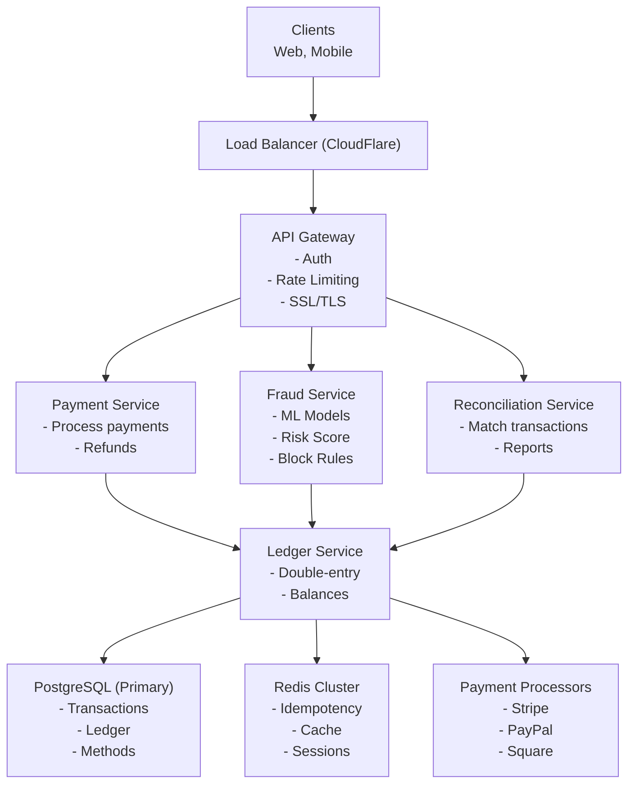

# Payment System - Data Model & Architecture

## Component Overview

Before looking at diagrams, let's understand each component and why it exists.

### Components Explained

| Component | Purpose | Why It Exists |
|-----------|---------|---------------|
| **API Gateway** | Entry point for all requests | Centralized auth, rate limiting, routing |
| **Payment Service** | Process payments | Core payment processing logic |
| **Fraud Service** | Detect fraudulent transactions | Prevent chargebacks and losses |
| **Ledger Service** | Double-entry bookkeeping | Financial accuracy and compliance |
| **Reconciliation Service** | Match transactions with processor | Detect discrepancies |
| **Idempotency Service** | Prevent duplicate charges | Handle retries safely |
| **Payment Processor Gateway** | Interface to external processors | Abstract processor differences |

---

## Database Choices

| Data Type | Database | Rationale |
|-----------|----------|-----------|
| Transactions | PostgreSQL | ACID transactions, financial accuracy |
| Ledger Entries | PostgreSQL | Strong consistency, audit trail |
| Payment Methods | PostgreSQL | Secure storage, encryption |
| Idempotency Keys | Redis | Fast lookups, TTL support |
| Fraud Check Cache | Redis | Fast ML model results |
| Transaction Cache | Redis | Hot transaction data |

---

## Consistency Model

**CAP Theorem Tradeoff:**

We choose **Consistency + Partition Tolerance (CP)**:
- **Consistency**: Financial data must be 100% accurate
- **Partition Tolerance**: System continues during network partitions
- **Availability**: Sacrificed (better to fail than serve incorrect data)

**Why CP over AP?**
- Financial accuracy is non-negotiable
- Regulatory compliance requires consistency
- Better to reject transactions than process incorrectly
- Audit trail must be accurate

**ACID vs BASE:**

**ACID (Strong Consistency) for:**
- All financial transactions (payments, refunds)
- Ledger entries (double-entry bookkeeping)
- Account balances (must be accurate)
- Payment method updates (security critical)

**BASE (Eventual Consistency) for:**
- Fraud check results (acceptable slight delay)
- Analytics data (can be eventually consistent)
- Reporting (can tolerate staleness)

**Per-Operation Consistency Guarantees:**

| Operation | Consistency Level | Guarantee |
|-----------|------------------|-----------|
| Payment processing | Strong | Transaction recorded accurately |
| Ledger write | Strong | Double-entry balanced |
| Refund processing | Strong | Refund recorded accurately |
| Fraud check | Eventual | Slight delay acceptable |
| Idempotency check | Strong | No duplicate charges |
| Reconciliation | Strong | Accurate matching |

**Read-After-Write Consistency:**
- Payment status: Strong (immediate read after write)
- Transaction history: Strong (always accurate)
- Account balance: Strong (real-time balance)

---

## High-Level Architecture



<details>
<summary>ASCII diagram (reference)</summary>

```text
┌─────────────────────────────────────────────────────────────────────────────────────┐
│                           PAYMENT SYSTEM ARCHITECTURE                                 │
└─────────────────────────────────────────────────────────────────────────────────────┘

                    ┌───────────────────┐
                    │   Clients         │
                    │   (Web, Mobile)   │
                    └────────┬──────────┘
                             │
                             ▼
                    ┌───────────────────┐
                    │   Load Balancer    │
                    │   (CloudFlare)     │
                    └────────┬──────────┘
                             │
                             ▼
                    ┌───────────────────┐
                    │   API Gateway     │
                    │  - Auth           │
                    │  - Rate Limiting  │
                    │  - SSL/TLS        │
                    └────────┬──────────┘
                             │
        ┌────────────────────┼────────────────────┐
        │                    │                    │
        ▼                    ▼                    ▼
┌───────────────┐   ┌───────────────┐   ┌───────────────┐
│   Payment     │   │    Fraud      │   │ Reconciliation│
│   Service     │   │   Service     │   │   Service     │
│               │   │               │   │               │
│ - Process     │   │ - ML Models   │   │ - Match       │
│   payments    │   │ - Risk Score  │   │   transactions│
│ - Refunds     │   │ - Block Rules │   │ - Reports     │
└───────┬───────┘   └───────┬───────┘   └───────┬───────┘
        │                    │                    │
        └────────────────────┼────────────────────┘
                             │
                    ┌────────▼────────┐
                    │  Ledger Service │
                    │  - Double-entry │
                    │  - Balances     │
                    └────────┬────────┘
                             │
        ┌────────────────────┼────────────────────┐
        │                    │                    │
        ▼                    ▼                    ▼
┌───────────────┐   ┌───────────────┐   ┌───────────────┐
│ PostgreSQL    │   │     Redis     │   │  Payment      │
│ (Primary)     │   │   Cluster      │   │  Processors   │
│               │   │               │   │               │
│ - Transactions│   │ - Idempotency │   │ - Stripe      │
│ - Ledger      │   │ - Cache       │   │ - PayPal      │
│ - Methods     │   │ - Sessions    │   │ - Square      │
└───────────────┘   └───────────────┘   └───────────────┘
```

</details>
```

---

## Detailed Component Architecture

### Payment Service Architecture

```
┌─────────────────────────────────────────────────────────────────────────────────────┐
│                            PAYMENT SERVICE DETAIL                                     │
└─────────────────────────────────────────────────────────────────────────────────────┘

                    ┌───────────────────┐
                    │  Payment Request  │
                    │  Amount, Method   │
                    └────────┬──────────┘
                             │
                             ▼
                    ┌───────────────────┐
                    │  Check Idempotency│
                    │  (Redis)           │
                    └────────┬──────────┘
                             │
                    ┌────────┴────────┐
                    │                 │
                    ▼                 ▼
        ┌──────────────────┐  ┌──────────────────┐
        │  Idempotent?      │  │  New Request     │
        │  Return Cached    │  │  Continue        │
        └──────────────────┘  └────────┬─────────┘
                                        │
                                        ▼
                    ┌───────────────────┐
                    │  Validate Request │
                    │  - Amount > 0     │
                    │  - Valid currency │
                    │  - Method exists  │
                    └────────┬──────────┘
                             │
                             ▼
                    ┌───────────────────┐
                    │  Fraud Check      │
                    │  (Async)          │
                    └────────┬──────────┘
                             │
                    ┌────────┴────────┐
                    │                 │
                    ▼                 ▼
        ┌──────────────────┐  ┌──────────────────┐
        │  Fraud Score     │  │  Fraud Score     │
        │  < Threshold     │  │  >= Threshold    │
        │  Continue        │  │  Block           │
        └────────┬─────────┘  └──────────────────┘
                 │
                 ▼
        ┌───────────────────┐
        │  Charge Payment   │
        │  Method           │
        │  (Processor API)  │
        └────────┬──────────┘
                 │
        ┌────────┴────────┐
        │                 │
        ▼                 ▼
┌───────────────┐  ┌───────────────┐
│  Success      │  │  Failure      │
│  Record in DB │  │  Record Error│
│  Update Ledger│  │  Update Ledger│
│  Cache Result │  │  Cache Result │
└───────────────┘  └───────────────┘
```

---

### Ledger Service Architecture

```
┌─────────────────────────────────────────────────────────────────────────────────────┐
│                            LEDGER SERVICE DETAIL                                      │
└─────────────────────────────────────────────────────────────────────────────────────┘

                    ┌───────────────────┐
                    │  Transaction      │
                    │  Record           │
                    └────────┬──────────┘
                             │
                             ▼
                    ┌───────────────────┐
                    │  Begin Transaction│
                    │  (ACID)           │
                    └────────┬──────────┘
                             │
                             ▼
                    ┌───────────────────┐
                    │  Create Debit     │
                    │  Entry            │
                    │  - Account:      │
                    │    Customer      │
                    │  - Amount:       │
                    │    Transaction   │
                    │  - Balance:      │
                    │    Update        │
                    └────────┬──────────┘
                             │
                             ▼
                    ┌───────────────────┐
                    │  Create Credit    │
                    │  Entry            │
                    │  - Account:      │
                    │    Revenue       │
                    │  - Amount:       │
                    │    Transaction   │
                    │  - Balance:      │
                    │    Update        │
                    └────────┬──────────┘
                             │
                             ▼
                    ┌───────────────────┐
                    │  Verify Balance   │
                    │  Debits = Credits │
                    └────────┬──────────┘
                             │
                             ▼
                    ┌───────────────────┐
                    │  Commit           │
                    │  Transaction     │
                    └───────────────────┘
```

---

## Double-Entry Bookkeeping

### Concept

Double-entry bookkeeping ensures every transaction has equal debits and credits, maintaining the accounting equation:

```
Assets = Liabilities + Equity + Revenue - Expenses
```

**Rules:**
- Every transaction affects at least 2 accounts
- Total debits = Total credits
- Accounts must balance

### Implementation

**Example: Customer Payment of $100**

```java
@Service
public class LedgerService {
    
    @Transactional
    public void recordPayment(Transaction transaction) {
        // Debit: Increase customer account (asset)
        createLedgerEntry(
            transaction.getTransactionId(),
            "customer_account_" + transaction.getCustomerId(),
            transaction.getAmount(),
            null,
            EntryType.DEBIT
        );
        
        // Credit: Increase revenue account
        createLedgerEntry(
            transaction.getTransactionId(),
            "revenue_account",
            null,
            transaction.getAmount(),
            EntryType.CREDIT
        );
        
        // Verify balance
        verifyBalance(transaction.getTransactionId());
    }
    
    private void verifyBalance(String transactionId) {
        List<LedgerEntry> entries = ledgerRepository.findByTransactionId(transactionId);
        
        BigDecimal totalDebits = entries.stream()
            .filter(e -> e.getDebit() != null)
            .map(LedgerEntry::getDebit)
            .reduce(BigDecimal.ZERO, BigDecimal::add);
        
        BigDecimal totalCredits = entries.stream()
            .filter(e -> e.getCredit() != null)
            .map(LedgerEntry::getCredit)
            .reduce(BigDecimal.ZERO, BigDecimal::add);
        
        if (!totalDebits.equals(totalCredits)) {
            throw new LedgerImbalanceException("Debits and credits do not match");
        }
    }
}
```

---

## Sharding Strategy

### Transaction ID-Based Sharding

**Shard by Transaction ID:**
```
Shard = hash(transaction_id) % num_shards
```

**Benefits:**
- Even distribution
- No cross-shard transactions
- Simple to implement

**Challenges:**
- User queries span multiple shards
- Account balance aggregation requires cross-shard queries

**Alternative: User-Based Sharding**

```
Shard = hash(user_id) % num_shards
```

**Benefits:**
- User transactions in same shard
- Faster user queries
- Easier account balance calculation

**Challenges:**
- Uneven distribution (some users have more transactions)
- Cross-user transactions (marketplace payments) require coordination

**Our Choice:** Transaction ID-based sharding for even distribution, with user-based indexes for fast user queries.

---

## Replication Strategy

### Database Replication

**Configuration:**
- Primary: 1 per shard (writes)
- Replicas: 2-3 per shard (reads)

**Replication Mode:**
- **Synchronous**: For critical financial data (transactions, ledger)
- **Asynchronous**: For non-critical data (analytics, logs)

**Failover:**
- Automatic failover to replica
- RTO: < 30 seconds
- RPO: 0 (synchronous replication)

---

## Failure Handling

### Payment Processor Failure

**Scenario:** Payment processor (Stripe) is down

**Recovery:**
1. Retry with exponential backoff
2. Failover to backup processor (PayPal)
3. Queue failed transactions for retry
4. Alert operations team

**Impact:**
- Some transactions delayed
- System continues operating
- No data loss

### Database Primary Failure

**Scenario:** PostgreSQL primary fails

**Recovery:**
1. Automatic failover to synchronous replica
2. Replica promoted to primary
3. Update connection strings
4. Resume operations

**RTO:** < 30 seconds
**RPO:** 0 (synchronous replication)

---

## Summary

| Aspect | Decision | Rationale |
|--------|----------|-----------|
| Consistency | Strong (ACID) | Financial accuracy critical |
| Database | PostgreSQL | ACID transactions, reliability |
| Sharding | Transaction ID-based | Even distribution |
| Replication | Synchronous | Zero data loss |
| Architecture | Microservices | Separation of concerns |
| Ledger | Double-entry | Financial compliance |
