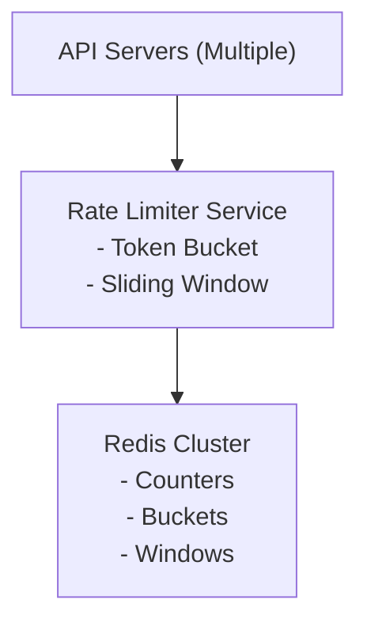
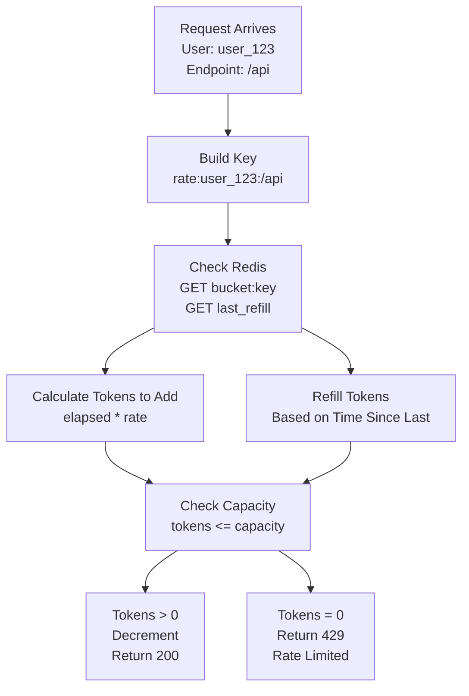
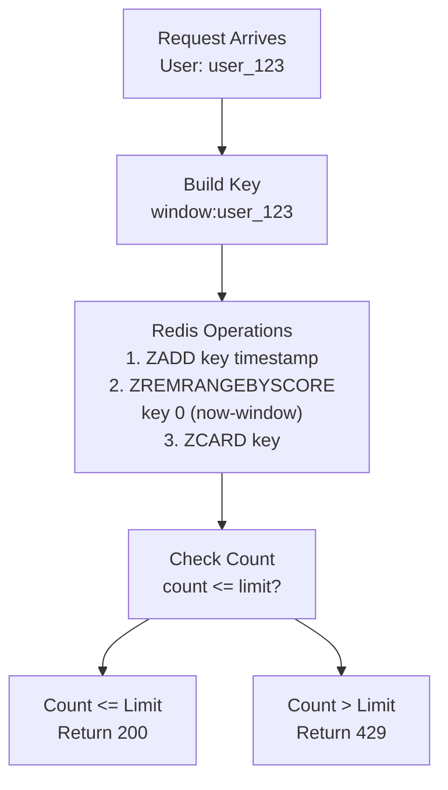

# Distributed Rate Limiter - Data Model & Architecture

## Component Overview

Before looking at diagrams, let's understand each component and why it exists.

### Components Explained

| Component | Purpose | Why It Exists |
|-----------|---------|---------------|
| **Rate Limiter Service** | Enforce rate limits | Prevent abuse, ensure fair usage |
| **Redis Cluster** | Distributed state storage | Shared state across servers |
| **Token Bucket** | Rate limiting algorithm | Handles bursts, smooth rate limiting |
| **Sliding Window** | Alternative algorithm | More accurate rate limiting |

---

## Database Choices

| Data Type | Database | Rationale |
|-----------|----------|-----------|
| Rate Limit Counters | Redis | Fast increments, TTL support |
| Rate Limit Config | PostgreSQL | Persistent configuration |
| Rate Limit Logs | PostgreSQL | Audit trail |

---

## Consistency Model

**CAP Theorem Tradeoff:**

We choose **Availability + Partition Tolerance (AP)**:
- **Availability**: Rate limiter must always respond (fail open)
- **Partition Tolerance**: System continues during network partitions
- **Consistency**: Eventual consistency acceptable (slight over-counting OK)

**Why AP over CP?**
- Better to allow some extra requests than block all requests
- Slight over-counting is acceptable (better than under-counting)
- System must always be available

**Per-Operation Consistency:**

| Operation | Consistency Level | Guarantee |
|-----------|------------------|-----------|
| Rate limit check | Eventual | May allow slightly more than limit during partitions |
| Counter increment | Eventual | Counters may be slightly inconsistent |
| Config updates | Strong | Configuration must be consistent |

---

## High-Level Architecture



<details>
<summary>ASCII diagram (reference)</summary>

```text
┌─────────────────────────────────────────────────────────────────────────────────────┐
│                        DISTRIBUTED RATE LIMITER SYSTEM                                │
└─────────────────────────────────────────────────────────────────────────────────────┘

                    ┌───────────────────┐
                    │   API Servers     │
                    │   (Multiple)      │
                    └────────┬──────────┘
                             │
                             ▼
                    ┌───────────────────┐
                    │  Rate Limiter    │
                    │    Service       │
                    │                  │
                    │  - Token Bucket  │
                    │  - Sliding Window│
                    └────────┬──────────┘
                             │
                             ▼
                    ┌───────────────────┐
                    │  Redis Cluster    │
                    │                  │
                    │  - Counters      │
                    │  - Buckets       │
                    │  - Windows       │
                    └───────────────────┘
```

</details>
```

---

## Token Bucket Architecture



<details>
<summary>ASCII diagram (reference)</summary>

```text
┌─────────────────────────────────────────────────────────────────────────────────────┐
│                              TOKEN BUCKET DETAIL                                      │
└─────────────────────────────────────────────────────────────────────────────────────┘

                    ┌───────────────────┐
                    │  Request Arrives  │
                    │  User: user_123   │
                    │  Endpoint: /api   │
                    └────────┬──────────┘
                             │
                             ▼
                    ┌───────────────────┐
                    │  Build Key        │
                    │  rate:user_123:/api│
                    └────────┬──────────┘
                             │
                             ▼
                    ┌───────────────────┐
                    │  Check Redis      │
                    │  GET bucket:key   │
                    │  GET last_refill  │
                    └────────┬──────────┘
                             │
                    ┌────────┴────────┐
                    │                 │
                    ▼                 ▼
        ┌──────────────────┐  ┌──────────────────┐
        │  Calculate      │  │  Refill Tokens   │
        │  Tokens to Add   │  │  Based on Time   │
        │  elapsed * rate  │  │  Since Last      │
        └────────┬─────────┘  └────────┬─────────┘
                 │                     │
                 └──────────┬──────────┘
                            │
                            ▼
                    ┌───────────────────┐
                    │  Check Capacity   │
                    │  tokens <= capacity│
                    └────────┬──────────┘
                             │
                    ┌────────┴────────┐
                    │                 │
                    ▼                 ▼
        ┌──────────────────┐  ┌──────────────────┐
        │  Tokens > 0      │  │  Tokens = 0      │
        │  Decrement       │  │  Return 429      │
        │  Return 200      │  │  Rate Limited    │
        └──────────────────┘  └──────────────────┘
```

</details>
```

---

## Sliding Window Architecture



<details>
<summary>ASCII diagram (reference)</summary>

```text
┌─────────────────────────────────────────────────────────────────────────────────────┐
│                            SLIDING WINDOW DETAIL                                     │
└─────────────────────────────────────────────────────────────────────────────────────┘

                    ┌───────────────────┐
                    │  Request Arrives  │
                    │  User: user_123   │
                    └────────┬──────────┘
                             │
                             ▼
                    ┌───────────────────┐
                    │  Build Key        │
                    │  window:user_123  │
                    └────────┬──────────┘
                             │
                             ▼
                    ┌───────────────────┐
                    │  Redis Operations │
                    │  1. ZADD key timestamp│
                    │  2. ZREMRANGEBYSCORE│
                    │     key 0 (now-window)│
                    │  3. ZCARD key     │
                    └────────┬──────────┘
                             │
                             ▼
                    ┌───────────────────┐
                    │  Check Count      │
                    │  count <= limit?  │
                    └────────┬──────────┘
                             │
                    ┌────────┴────────┐
                    │                 │
                    ▼                 ▼
        ┌──────────────────┐  ┌──────────────────┐
        │  Count <= Limit  │  │  Count > Limit   │
        │  Return 200      │  │  Return 429      │
        └──────────────────┘  └──────────────────┘
```

</details>
```

---

## Redis Data Structures

### Token Bucket Storage

```
Key: bucket:{user_id}:{endpoint}
Value: current_tokens (integer)
TTL: Window duration

Key: bucket:{user_id}:{endpoint}:last_refill
Value: timestamp (milliseconds)
TTL: Window duration
```

### Sliding Window Storage

```
Key: window:{user_id}:{endpoint}
Type: Sorted Set (ZSET)
Score: Timestamp (milliseconds)
Member: Request ID (UUID)
TTL: Window duration

Operations:
- ZADD: Add request timestamp
- ZREMRANGEBYSCORE: Remove old requests
- ZCARD: Count requests in window
```

---

## Sharding Strategy

### User-Based Sharding

**Shard by User ID:**
```
Shard = hash(user_id) % num_redis_nodes
```

**Benefits:**
- All requests for same user hit same Redis node
- Consistent rate limiting per user
- No cross-node coordination needed

**Challenges:**
- Uneven distribution (some users have more requests)
- Hot keys (popular users)

**Mitigation:**
- Consistent hashing for rebalancing
- Monitor hot keys
- Add more Redis nodes if needed

---

## Replication Strategy

**Redis Replication:**
- Primary: 1 per shard (writes)
- Replicas: 1-2 per shard (reads for monitoring)

**Failover:**
- Automatic failover to replica
- RTO: < 30 seconds
- RPO: 0 (synchronous replication for critical data)

---

## Failure Handling

### Redis Node Failure

**Scenario:** Redis node fails

**Recovery:**
1. Automatic failover to replica
2. Update connection strings
3. Resume operations

**Impact:**
- Temporary rate limit inconsistencies
- Some requests may be allowed that shouldn't (fail open)
- System continues operating

### Network Partition

**Scenario:** Network partition between API servers and Redis

**Behavior:**
- Fail open: Allow requests (better than blocking all)
- Log warnings
- Resume normal operation when partition heals

---

## Summary

| Aspect | Decision | Rationale |
|--------|----------|-----------|
| Algorithm | Token bucket + Sliding window | Handles bursts, accurate |
| Storage | Redis | Fast increments, TTL support |
| Consistency | Eventual | Fail open preferred |
| Sharding | User-based | Consistent per-user limits |
| Failover | Automatic | High availability |

