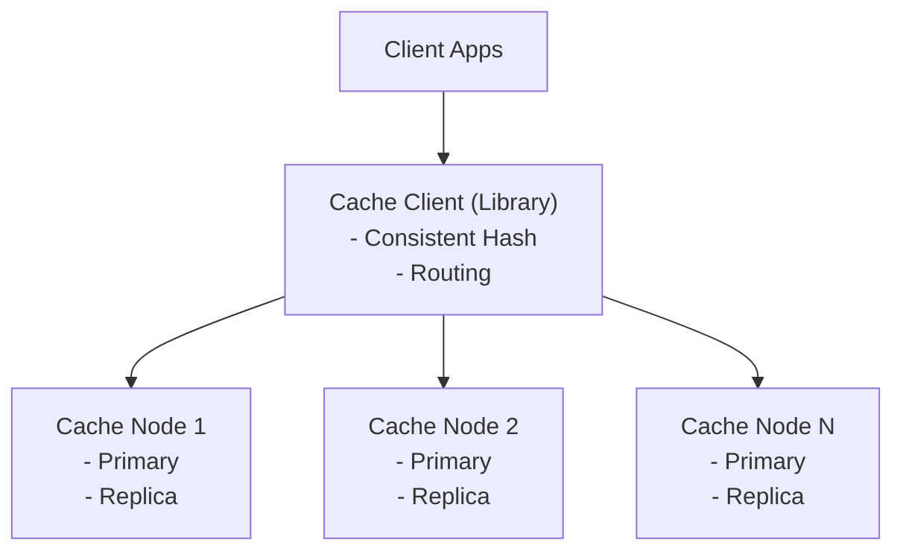

# Distributed Cache - Data Model & Architecture

## Component Overview

### Components Explained

| Component | Purpose | Why It Exists |
|-----------|---------|---------------|
| **Cache Node** | Store cached data | Fast in-memory access |
| **Consistent Hashing** | Key distribution | Even load distribution |
| **Replication** | Data redundancy | High availability |
| **Coordinator** | Cluster management | Handle failures, rebalancing |

---

## Consistent Hashing

### Concept

Consistent hashing maps keys to nodes using a hash ring. When nodes are added/removed, only a fraction of keys need to be remapped.

**Implementation:**
```java
public class ConsistentHash {
    
    private final TreeMap<Long, String> ring = new TreeMap<>();
    private final int replicas = 150;  // Virtual nodes per physical node
    
    public void addNode(String node) {
        for (int i = 0; i < replicas; i++) {
            long hash = hash(node + ":" + i);
            ring.put(hash, node);
        }
    }
    
    public String getNode(String key) {
        if (ring.isEmpty()) {
            return null;
        }
        
        long hash = hash(key);
        Map.Entry<Long, String> entry = ring.ceilingEntry(hash);
        
        if (entry == null) {
            entry = ring.firstEntry();
        }
        
        return entry.getValue();
    }
    
    private long hash(String input) {
        return Hashing.murmur3_128().hashString(input, StandardCharsets.UTF_8).asLong();
    }
}
```

---

## Architecture



<details>
<summary>ASCII diagram (reference)</summary>

```text
┌─────────────────────────────────────────────────────────────────────────────────────┐
│                        DISTRIBUTED CACHE CLUSTER                                     │
└─────────────────────────────────────────────────────────────────────────────────────┘

                    ┌───────────────────┐
                    │   Client Apps     │
                    └────────┬──────────┘
                             │
                             ▼
                    ┌───────────────────┐
                    │  Cache Client     │
                    │  (Library)        │
                    │  - Consistent Hash│
                    │  - Routing        │
                    └────────┬──────────┘
                             │
        ┌────────────────────┼────────────────────┐
        │                    │                    │
        ▼                    ▼                    ▼
┌───────────────┐   ┌───────────────┐   ┌───────────────┐
│  Cache Node 1 │   │  Cache Node 2 │   │  Cache Node N │
│               │   │               │   │               │
│ - Primary     │   │ - Primary     │   │ - Primary     │
│ - Replica     │   │ - Replica     │   │ - Replica     │
└───────────────┘   └───────────────┘   └───────────────┘
```

</details>
```

---

## Replication Strategy

**Configuration:**
- Replication factor: 2-3
- Primary: 1 per shard
- Replicas: 1-2 per shard

**Write Path:**
1. Write to primary
2. Replicate to replicas (synchronous for critical data)
3. Confirm write

**Read Path:**
1. Read from primary (strong consistency)
2. Or read from replica (eventual consistency, lower latency)

---

## Summary

| Aspect | Decision |
|--------|----------|
| Hashing | Consistent hashing with virtual nodes |
| Replication | 2-3 replicas per shard |
| Consistency | Configurable (strong or eventual) |

