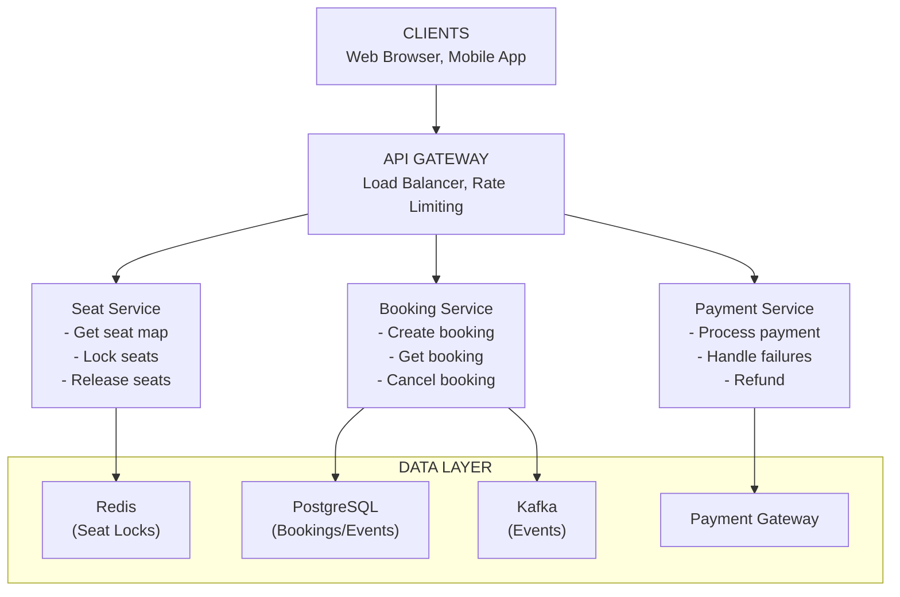
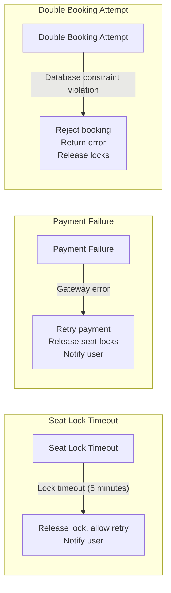

# Ticket Booking System - Data Model & Architecture

## Component Overview

| Component | Purpose | Why It Exists |
|-----------|---------|---------------|
| **Event Service** | Manages events and shows | Event information and scheduling |
| **Seat Service** | Manages seat availability | Real-time seat locking and availability |
| **Booking Service** | Creates and manages bookings | Booking lifecycle management |
| **Payment Service** | Processes payments | Secure payment handling |
| **Ticket Service** | Generates tickets | Ticket creation and delivery |

---

## Database Choices

| Data Type | Database | Rationale |
|-----------|----------|-----------|
| Bookings | PostgreSQL | ACID transactions, complex queries |
| Seat Locks | Redis + PostgreSQL | Fast locking, persistence |
| Seat Availability | Redis (cache) + PostgreSQL | Real-time updates, source of truth |
| Payments | PostgreSQL | ACID, audit trail, compliance |
| Events/Shows | PostgreSQL | Structured data, relationships |

---

## Consistency Model

**CAP Theorem Tradeoff:**

We choose **Consistency + Partition Tolerance (CP)** for critical operations:
- **Consistency**: Seat availability must be consistent (cannot double-book)
- **Partition Tolerance**: System continues operating during network partitions
- **Availability**: Sacrificed (prefer consistency over availability for seat locking)

**Why CP over AP?**
- Cannot double-book seats (consistency critical)
- Seat locking must be atomic (consistency critical)
- Better to reject booking than create inconsistent state

**ACID (Strong Consistency) for:**
- Seat locking (PostgreSQL, prevents double booking)
- Booking creation (PostgreSQL, atomic transaction)
- Payment processing (PostgreSQL, prevents duplicate charges)

**BASE (Eventual Consistency) for:**
- Seat map cache (may be stale briefly, verified before locking)
- Event recommendations (acceptable staleness)

---

## Seat Locking Architecture

### Distributed Locking Strategy

```java
@Service
public class SeatLockService {
    
    private final RedisTemplate<String, String> redis;
    private final DistributedLock distributedLock;
    
    public LockResult lockSeats(String showId, List<String> seatIds, String userId) {
        String lockKey = "lock:seats:" + showId;
        
        // Acquire distributed lock for all seats
        Lock lock = distributedLock.acquire(lockKey, Duration.ofSeconds(5));
        
        try {
            List<String> availableSeats = new ArrayList<>();
            List<String> unavailableSeats = new ArrayList<>();
            
            for (String seatId : seatIds) {
                String seatLockKey = "seat_lock:" + showId + ":" + seatId;
                
                // Try to acquire seat lock
                Boolean acquired = redis.opsForValue().setIfAbsent(
                    seatLockKey, 
                    userId, 
                    Duration.ofSeconds(300)  // 5 minutes
                );
                
                if (acquired) {
                    availableSeats.add(seatId);
                } else {
                    unavailableSeats.add(seatId);
                }
            }
            
            if (unavailableSeats.isEmpty()) {
                // All seats locked successfully
                String lockId = UUID.randomUUID().toString();
                storeLockRecord(lockId, showId, availableSeats, userId);
                return LockResult.success(lockId, availableSeats);
            } else {
                // Release acquired locks
                releaseSeats(showId, availableSeats);
                return LockResult.failed("Some seats unavailable", unavailableSeats);
            }
            
        } finally {
            lock.release();
        }
    }
}
```

---

## High-Level Architecture



<details>
<summary>ASCII diagram (reference)</summary>

```text
┌─────────────────────────────────────────────────────────────────────────────────────┐
│                                    CLIENTS                                           │
│                    (Web Browser, Mobile App)                                        │
└─────────────────────────────────────────────────────────────────────────────────────┘
                                        │
                                        ▼
┌─────────────────────────────────────────────────────────────────────────────────────┐
│                                 API GATEWAY                                          │
│                          (Load Balancer, Rate Limiting)                             │
└─────────────────────────────────────────────────────────────────────────────────────┘
                                        │
                    ┌───────────────────┼───────────────────┐
                    │                   │                   │
                    ▼                   ▼                   ▼
┌──────────────────────────┐  ┌──────────────────┐  ┌──────────────────┐
│    Seat Service          │  │  Booking Service │  │  Payment Service │
│  - Get seat map          │  │  - Create booking│  │  - Process payment│
│  - Lock seats            │  │  - Get booking   │  │  - Handle failures│
│  - Release seats         │  │  - Cancel booking│  │  - Refund         │
└──────────────────────────┘  └──────────────────┘  └──────────────────┘
         │                              │                      │
         │                              │                      │
         └──────────────┬───────────────┼──────────────────────┘
                        │               │                      │
                        ▼               ▼                      ▼
┌─────────────────────────────────────────────────────────────────────────────────────┐
│                                  DATA LAYER                                         │
│                                                                                     │
│  ┌──────────────┐  ┌──────────────┐  ┌──────────────┐  ┌──────────────┐          │
│  │   Redis      │  │  PostgreSQL  │  │     Kafka    │  │  Payment     │          │
│  │  (Seat Locks)│  │  (Bookings/   │  │  (Events)    │  │  Gateway     │          │
│  │              │  │   Events)     │  │              │  │              │          │
│  └──────────────┘  └──────────────┘  └──────────────┘  └──────────────┘          │
└─────────────────────────────────────────────────────────────────────────────────────┘
```

</details>
```

---

## Seat Locking Flow

```
Step 1: User Selects Seats
User → Seat Service: Lock seats [seat_1, seat_2, seat_3]
  │
  ▼
Step 2: Acquire Distributed Lock
Seat Service → Redis: Acquire lock for show_123
  │
  ▼
Step 3: Check and Lock Each Seat
For each seat:
  - Check if available (not locked, not booked)
  - Lock seat (SET seat_lock:show_123:seat_1 user_789 EX 300)
  │
  ▼
Step 4: Store Lock Record
Seat Service → PostgreSQL: INSERT INTO seat_locks
  │
  ▼
Step 5: Return Lock ID
User receives lock_id and 5-minute timer
```

---

## Booking Creation Flow

```
Step 1: User Creates Booking
User → Booking Service: Create booking with lock_id
  │
  ▼
Step 2: Validate Lock
Booking Service → Redis: Check lock exists and not expired
  │
  ▼
Step 3: Process Payment
Booking Service → Payment Service: Process payment
  │
  ▼
Step 4: Create Booking
Booking Service → PostgreSQL: INSERT INTO bookings
  │
  ▼
Step 5: Confirm Seats
Booking Service → PostgreSQL: INSERT INTO booking_seats
Booking Service → Redis: Remove seat locks
  │
  ▼
Step 6: Generate Ticket
Booking Service → Ticket Service: Generate ticket
  │
  ▼
Success: Booking Confirmed
```

---

## Failure Handling



<details>
<summary>ASCII diagram (reference)</summary>

```text
Failure Type           Detection              Recovery
─────────────────────────────────────────────────────────────────────────────────────

┌─────────────────┐
│ Seat Lock       │ ─── Lock timeout ─────── Release lock, allow retry
│ Timeout         │     (5 minutes)          Notify user
└─────────────────┘

┌─────────────────┐
│ Payment         │ ─── Gateway error ─────── Retry payment
│ Failure         │                          Release seat locks
│                 │                          Notify user
└─────────────────┘

┌─────────────────┐
│ Double Booking  │ ─── Database ──────────── Reject booking
│ Attempt         │     constraint           Return error
│                 │     violation            Release locks
└─────────────────┘
```

</details>
```

---

## Summary

| Aspect | Decision | Rationale |
|--------|----------|-----------|
| Seat Locking | Redis (fast) + PostgreSQL (persistence) | Real-time locking with durability |
| Booking Storage | PostgreSQL | ACID transactions |
| Consistency | Strong for seat availability | Cannot double-book |
| Locking Strategy | Distributed locking | Prevent race conditions |
| Lock Timeout | 5 minutes | Prevent seat hoarding |

