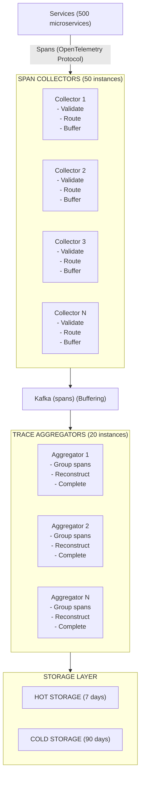

# Distributed Tracing System - Data Model & Architecture

## Component Overview

Before looking at diagrams, let's understand each component and why it exists.

### Components Explained

| Component | Purpose | Why It Exists |
|-----------|---------|---------------|
| **Span Collector** | Receives spans from services | High-throughput ingestion endpoint |
| **Trace Aggregator** | Groups spans by trace ID | Reconstructs complete traces from spans |
| **Storage Layer** | Stores traces and indexes | Persistence for querying |
| **Query Service** | Search and retrieve traces | API for UI and integrations |
| **Sampling Service** | Decides which traces to keep | Cost optimization at scale |
| **Visualization UI** | Display traces to users | Human-readable trace views |

---

## Database Choices

| Data Type | Database | Rationale |
|-----------|----------|-----------|
| Hot Traces (7 days) | Elasticsearch/Cassandra | Fast queries, time-based partitioning |
| Cold Traces (90 days) | S3 + Index in Elasticsearch | Cheap storage, metadata for search |
| Service Index | Elasticsearch | Fast search by service/operation |
| Trace ID Index | Redis + Elasticsearch | Fast lookup by trace ID |
| Sampling State | Redis | In-memory sampling decisions |
| Metrics Aggregation | Time-series DB (Prometheus) | Pre-computed latency/error metrics |

---

## Consistency Model

**CAP Theorem Tradeoff:**

We choose **Availability + Partition Tolerance (AP)**:
- **Availability**: Tracing system must continue operating (even with partial data)
- **Partition Tolerance**: System continues operating during network partitions
- **Consistency**: Sacrificed (spans may arrive out of order, traces may be incomplete temporarily)

**Why AP over CP?**
- Tracing is observational (doesn't need strict consistency)
- Better to collect partial traces than fail completely
- System must always operate (high availability requirement)
- During partitions, we prefer partial traces over stopping collection

**ACID vs BASE:**

**ACID (Strong Consistency) for:**
- Trace ID uniqueness (prevent duplicate traces)
- Sampling state (consistent sampling decisions)

**BASE (Eventual Consistency) for:**
- Trace reconstruction (spans arrive out of order)
- Service indexes (eventually consistent)
- Metrics aggregation (batch updates)

**Per-Operation Consistency Guarantees:**

| Operation | Consistency Level | Guarantee |
|-----------|------------------|-----------|
| Span ingestion | Eventual | Spans may be stored before trace is complete |
| Trace query | Eventual | May return incomplete traces (spans still arriving) |
| Service index | Eventual | New services appear after delay |
| Metrics | Eventual | Aggregated metrics updated in batches |

**Eventual Consistency Boundaries:**
- Trace completeness: Spans may arrive out of order (handled by aggregator)
- Service index: New services appear within minutes
- Metrics: Aggregated metrics updated every 1 minute

---

## Span Storage Schema

### Elasticsearch Document (Span)

```json
{
  "trace_id": "abc123def45678901234567890123456",
  "span_id": "def789abc1234567",
  "parent_span_id": "abc456def7890123",
  "operation_name": "getOrder",
  "service_name": "order-service",
  "start_time": 1705312245000000,
  "duration": 350000000,
  "tags": {
    "http.method": "GET",
    "http.status_code": "200",
    "db.type": "postgresql",
    "db.statement": "SELECT * FROM orders"
  },
  "logs": [
    {
      "timestamp": 1705312245100000,
      "fields": {
        "event": "database.query",
        "query": "SELECT * FROM orders WHERE id = $1"
      }
    }
  ],
  "status": "OK",
  "kind": "SERVER",
  "@timestamp": "2024-01-15T10:30:45Z"
}
```

**Index Mapping:**

```json
{
  "mappings": {
    "properties": {
      "trace_id": { "type": "keyword" },
      "span_id": { "type": "keyword" },
      "parent_span_id": { "type": "keyword" },
      "operation_name": { "type": "keyword" },
      "service_name": { "type": "keyword" },
      "start_time": { "type": "long" },
      "duration": { "type": "long" },
      "tags": { "type": "object" },
      "logs": { "type": "nested" },
      "status": { "type": "keyword" },
      "@timestamp": { "type": "date" }
    }
  }
}
```

**Index Strategy:**

- **Time-based indices**: `traces-2024-01-15`, `traces-2024-01-16`
- **Daily rotation**: New index per day
- **Index alias**: `traces-hot` points to last 7 days
- **Cold storage**: Older indices moved to S3

---

## Trace Aggregation Schema

### Trace Document (Reconstructed)

```json
{
  "trace_id": "abc123def45678901234567890123456",
  "spans": [
    {
      "span_id": "def789abc1234567",
      "parent_span_id": null,
      "operation_name": "GET /orders",
      "service_name": "api-gateway",
      "start_time": 1705312245000000,
      "duration": 500000000,
      "tags": { "http.method": "GET" },
      "status": "OK"
    },
    {
      "span_id": "abc456def7890123",
      "parent_span_id": "def789abc1234567",
      "operation_name": "getOrder",
      "service_name": "order-service",
      "start_time": 1705312245100000,
      "duration": 350000000,
      "tags": { "db.type": "postgresql" },
      "status": "OK"
    }
  ],
  "start_time": 1705312245000000,
  "duration": 500000000,
  "span_count": 2,
  "service_count": 2,
  "has_error": false,
  "@timestamp": "2024-01-15T10:30:45Z"
}
```

---

## Service Index Schema

### Service Metadata

```json
{
  "service_name": "order-service",
  "operations": [
    "createOrder",
    "getOrder",
    "updateOrder",
    "cancelOrder"
  ],
  "last_seen": "2024-01-15T10:30:45Z",
  "trace_count_24h": 1000000,
  "error_rate_24h": 0.01,
  "p99_latency_24h": 500000000
}
```

---

## High-Level Architecture



<details>
<summary>ASCII diagram (reference)</summary>

```text
┌─────────────────────────────────────────────────────────────────────────────────────┐
│                         DISTRIBUTED TRACING SYSTEM                                   │
└─────────────────────────────────────────────────────────────────────────────────────┘

Services (500 microservices)
    │
    │ Spans (OpenTelemetry Protocol)
    │
    ▼
┌─────────────────────────────────────────────────────────────────────────────────────┐
│                         SPAN COLLECTORS (50 instances)                               │
│                                                                                      │
│  ┌──────────────┐  ┌──────────────┐  ┌──────────────┐  ┌──────────────┐          │
│  │  Collector 1 │  │  Collector 2 │  │  Collector 3 │  │  Collector N │          │
│  │              │  │              │  │              │  │              │          │
│  │ - Validate   │  │ - Validate   │  │ - Validate   │  │ - Validate   │          │
│  │ - Route      │  │ - Route      │  │ - Route      │  │ - Route      │          │
│  │ - Buffer     │  │ - Buffer     │  │ - Buffer     │  │ - Buffer     │          │
│  └──────┬───────┘  └──────┬───────┘  └──────┬───────┘  └──────┬───────┘          │
└─────────┼──────────────────┼──────────────────┼──────────────────┼──────────────────┘
          │                  │                  │                  │
          └──────────────────┼──────────────────┼──────────────────┘
                             │
                             ▼
                    ┌─────────────────┐
                    │  Kafka (spans)  │
                    │  (Buffering)    │
                    └────────┬────────┘
                             │
                             ▼
┌─────────────────────────────────────────────────────────────────────────────────────┐
│                    TRACE AGGREGATORS (20 instances)                                  │
│                                                                                      │
│  ┌──────────────┐  ┌──────────────┐  ┌──────────────┐                             │
│  │ Aggregator 1 │  │ Aggregator 2 │  │ Aggregator N │                             │
│  │              │  │              │  │              │                             │
│  │ - Group spans│  │ - Group spans│  │ - Group spans│                             │
│  │ - Reconstruct│  │ - Reconstruct│  │ - Reconstruct│                             │
│  │ - Complete   │  │ - Complete   │  │ - Complete   │                             │
│  └──────┬───────┘  └──────┬───────┘  └──────┬───────┘                             │
└─────────┼──────────────────┼──────────────────┼──────────────────────────────────────┘
          │                  │                  │
          └──────────────────┼──────────────────┘
                             │
                             ▼
┌─────────────────────────────────────────────────────────────────────────────────────┐
│                         STORAGE LAYER                                                 │
│                                                                                      │
│  ┌─────────────────────────────────────────────────────────────────────────────┐    │
│  │                         HOT STORAGE (7 days)                                 │    │
```

</details>
```
│  │                                                                              │    │
│  │  ┌──────────────┐  ┌──────────────┐  ┌──────────────┐                      │    │
│  │  │ Elasticsearch│  │ Elasticsearch│  │ Elasticsearch│                      │    │
│  │  │  Cluster     │  │  Cluster     │  │  Cluster     │                      │    │
│  │  │  (Spans)     │  │  (Traces)    │  │  (Indexes)   │                      │    │
│  │  └──────────────┘  └──────────────┘  └──────────────┘                      │    │
│  └─────────────────────────────────────────────────────────────────────────────┘    │
│                                                                                      │
│  ┌─────────────────────────────────────────────────────────────────────────────┐    │
│  │                         COLD STORAGE (90 days)                               │    │
│  │                                                                              │    │
│  │  ┌──────────────┐  ┌──────────────┐                                        │    │
│  │  │  S3 (Traces) │  │ Elasticsearch│                                        │    │
│  │  │  (Compressed)│  │  (Metadata)  │                                        │    │
│  │  └──────────────┘  └──────────────┘                                        │    │
│  └─────────────────────────────────────────────────────────────────────────────┘    │
└─────────────────────────────────────────────────────────────────────────────────────┘
                             │
                             ▼
┌─────────────────────────────────────────────────────────────────────────────────────┐
│                         QUERY SERVICE (10 instances)                                 │
│                                                                                      │
│  ┌──────────────┐  ┌──────────────┐  ┌──────────────┐                             │
│  │ Query Svc 1  │  │ Query Svc 2  │  │ Query Svc N  │                             │
│  │              │  │              │  │              │                             │
│  │ - Search     │  │ - Search     │  │ - Search     │                             │
│  │ - Retrieve   │  │ - Retrieve   │  │ - Retrieve   │                             │
│  │ - Cache      │  │ - Cache      │  │ - Cache      │                             │
│  └──────┬───────┘  └──────┬───────┘  └──────┬───────┘                             │
└─────────┼──────────────────┼──────────────────┼──────────────────────────────────────┘
          │                  │                  │
          └──────────────────┼──────────────────┘
                             │
                             ▼
                    ┌─────────────────┐
                    │  Visualization  │
                    │      UI         │
                    └─────────────────┘
```

---

## Request Flow: Span Ingestion

```
Step 1: Service Creates Span
┌─────────────────────────────────────────────────────────────┐
│ Order Service:                                              │
│ - Creates span with trace_id, span_id, parent_span_id      │
│ - Adds tags, logs, timing                                   │
│ - Exports span to collector                                 │
└─────────────────────────────────────────────────────────────┘
                    │
                    ▼
Step 2: Collector Receives Span
┌─────────────────────────────────────────────────────────────┐
│ Collector:                                                  │
│ - Validates span (trace_id, span_id format)                 │
│ - Checks sampling decision (Redis)                          │
│ - Routes to aggregator (by trace_id hash)                   │
│ - Buffers spans (10-second window)                          │
└─────────────────────────────────────────────────────────────┘
                    │
                    ▼
Step 3: Kafka Buffering
┌─────────────────────────────────────────────────────────────┐
│ Kafka Topic: spans                                          │
│ Partition: hash(trace_id) % 20                              │
│ - Buffers spans for aggregator processing                   │
│ - 7-day retention for replay                                │
└─────────────────────────────────────────────────────────────┘
                    │
                    ▼
Step 4: Aggregator Processes
┌─────────────────────────────────────────────────────────────┐
│ Aggregator:                                                 │
│ - Consumes spans from Kafka                                 │
│ - Groups spans by trace_id                                  │
│ - Reconstructs trace (handles out-of-order)                 │
│ - Marks trace as complete (timeout-based)                   │
│ - Writes to storage                                         │
└─────────────────────────────────────────────────────────────┘
                    │
                    ▼
Step 5: Storage
┌─────────────────────────────────────────────────────────────┐
│ Elasticsearch:                                              │
│ - Stores spans (indexed by trace_id, service, time)         │
│ - Stores reconstructed traces (for fast retrieval)          │
│ - Updates service index                                     │
└─────────────────────────────────────────────────────────────┘
```

---

## Request Flow: Trace Query

```
Step 1: User Requests Trace
┌─────────────────────────────────────────────────────────────┐
│ UI: GET /v1/traces/{trace_id}                               │
└─────────────────────────────────────────────────────────────┘
                    │
                    ▼
Step 2: Query Service
┌─────────────────────────────────────────────────────────────┐
│ Query Service:                                              │
│ - Checks cache (Redis) for trace                            │
│ - If cache miss, queries Elasticsearch                      │
│ - Retrieves trace document or reconstructs from spans       │
│ - Caches result (5-minute TTL)                              │
└─────────────────────────────────────────────────────────────┘
                    │
                    ▼
Step 3: Elasticsearch Query
┌─────────────────────────────────────────────────────────────┐
│ Elasticsearch:                                              │
│ - Query by trace_id (fast lookup)                           │
│ - If trace document exists, return it                       │
│ - Otherwise, query all spans for trace_id                   │
│ - Aggregate into trace structure                            │
└─────────────────────────────────────────────────────────────┘
                    │
                    ▼
Step 4: Response
┌─────────────────────────────────────────────────────────────┐
│ Response:                                                   │
│ - Complete trace with all spans                             │
│ - Sorted by start_time                                      │
│ - Includes timing, tags, logs                               │
└─────────────────────────────────────────────────────────────┘
```

---

## Sampling Architecture

```
┌─────────────────────────────────────────────────────────────────────────────────────┐
│                         SAMPLING DECISION FLOW                                       │
└─────────────────────────────────────────────────────────────────────────────────────┘

Service sends span
    │
    ▼
┌─────────────────────────────────────────────────────────────┐
│ Collector checks sampling:                                  │
│ 1. Head-based sampling (at trace start)                    │
│    - Check Redis: sampled:{trace_id}                       │
│    - If not exists, decide: random(1%) or always (errors)  │
│    - Store decision in Redis (1-hour TTL)                  │
│                                                             │
│ 2. Tail-based sampling (after trace completes)             │
│    - Buffer all spans in aggregator                        │
│    - When trace completes, evaluate: errors? slow?         │
│    - If important, keep; otherwise discard                 │
└─────────────────────────────────────────────────────────────┘
```

---

## Sharding Strategy

**Trace ID-Based Sharding:**

- **Collectors**: Round-robin load balancing (stateless)
- **Kafka Partitions**: `hash(trace_id) % partitions` (ensures same trace to same partition)
- **Aggregators**: Consumer group assignment (Kafka assigns partitions)
- **Elasticsearch**: `hash(trace_id) % shards` (distributes traces across shards)

**Benefits:**
- Same trace ID always goes to same partition/aggregator
- Efficient trace reconstruction (all spans for trace in one place)
- Parallel processing across traces

---

## Replication Strategy

**Storage Replication:**

- **Elasticsearch**: 3 replicas per shard (default)
- **S3**: Cross-region replication (for disaster recovery)
- **Redis**: Master-replica (for sampling state)

**Failover:**
- Elasticsearch: Automatic failover to replica
- S3: Read from replica region if primary fails
- Redis: Failover to replica (sampling decisions may be lost, acceptable)

---

## Summary

| Aspect | Decision | Rationale |
|--------|----------|-----------|
| Storage | Elasticsearch (hot), S3 (cold) | Fast queries + cheap archival |
| Sharding | Trace ID hash | Efficient trace reconstruction |
| Replication | 3x (Elasticsearch), cross-region (S3) | High availability |
| Consistency | Eventual | Observational data, out-of-order spans |
| Indexing | Time-based indices | Efficient querying and archival |

