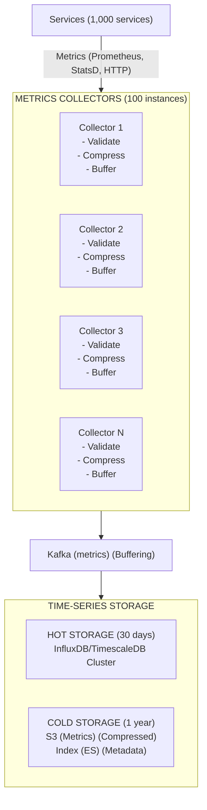

# Monitoring & Alerting System - Data Model & Architecture

## Component Overview

Before looking at diagrams, let's understand each component and why it exists.

### Components Explained

| Component | Purpose | Why It Exists |
|-----------|---------|---------------|
| **Metrics Collector** | Receives metrics from services | High-throughput ingestion endpoint |
| **Time-Series Storage** | Stores metrics with timestamps | Persistence for querying and analysis |
| **Query Engine** | Executes metric queries | Fast retrieval and aggregation |
| **Alerting Engine** | Evaluates alert rules | Proactive issue detection |
| **Notification Service** | Sends alerts via channels | Multi-channel alert delivery |
| **Dashboard Service** | Renders dashboards | Visualization for users |

---

## Database Choices

| Data Type | Database | Rationale |
|-----------|----------|-----------|
| Time-Series Metrics | Time-Series DB (InfluxDB/TimescaleDB) | Optimized for time-series data |
| Cold Metrics | S3 + Index | Cheap storage for historical data |
| Alert Rules | PostgreSQL | Structured data, complex queries |
| Alert State | Redis | Fast lookups, TTL support |
| Dashboard Definitions | PostgreSQL | User-created dashboards |

---

## Consistency Model

**CAP Theorem Tradeoff:**

We choose **Availability + Partition Tolerance (AP)**:
- **Availability**: Monitoring system must always operate
- **Partition Tolerance**: System continues operating during network partitions
- **Consistency**: Sacrificed (metrics may be slightly stale)

**Why AP over CP?**
- Monitoring is observational (doesn't need strict consistency)
- Better to serve slightly stale metrics than fail
- System must always operate (high availability requirement)
- During partitions, we prefer stale data over no data

**ACID vs BASE:**

**ACID (Strong Consistency) for:**
- Alert rule definitions (must be consistent)
- Dashboard definitions (must be consistent)

**BASE (Eventual Consistency) for:**
- Metric storage (may be replicated asynchronously)
- Alert state (may be inconsistent across instances)

---

## High-Level Architecture



<details>
<summary>ASCII diagram (reference)</summary>

```text
┌─────────────────────────────────────────────────────────────────────────────────────┐
│                         MONITORING & ALERTING SYSTEM                                │
└─────────────────────────────────────────────────────────────────────────────────────┘

Services (1,000 services)
    │
    │ Metrics (Prometheus, StatsD, HTTP)
    │
    ▼
┌─────────────────────────────────────────────────────────────────────────────────────┐
│                    METRICS COLLECTORS (100 instances)                               │
│                                                                                      │
│  ┌──────────────┐  ┌──────────────┐  ┌──────────────┐  ┌──────────────┐          │
│  │  Collector 1 │  │  Collector 2 │  │  Collector 3 │  │  Collector N │          │
│  │              │  │              │  │              │  │              │          │
│  │ - Validate   │  │ - Validate   │  │ - Validate   │  │ - Validate   │          │
│  │ - Compress   │  │ - Compress   │  │ - Compress   │  │ - Compress   │          │
│  │ - Buffer     │  │ - Buffer     │  │ - Buffer     │  │ - Buffer     │          │
│  └──────┬───────┘  └──────┬───────┘  └──────┬───────┘  └──────┬───────┘          │
└─────────┼──────────────────┼──────────────────┼──────────────────┼──────────────────┘
          │                  │                  │                  │
          └──────────────────┼──────────────────┼──────────────────┘
                             │
                             ▼
                    ┌─────────────────┐
                    │  Kafka (metrics)│
                    │  (Buffering)    │
                    └────────┬────────┘
                             │
                             ▼
┌─────────────────────────────────────────────────────────────────────────────────────┐
│                         TIME-SERIES STORAGE                                         │
│                                                                                      │
│  ┌─────────────────────────────────────────────────────────────────────────────┐    │
│  │                         HOT STORAGE (30 days)                               │    │
│  │                                                                              │    │
│  │  ┌──────────────┐  ┌──────────────┐  ┌──────────────┐                      │    │
│  │  │ InfluxDB/    │  │ InfluxDB/    │  │ InfluxDB/    │                      │    │
│  │  │ TimescaleDB  │  │ TimescaleDB  │  │ TimescaleDB  │                      │    │
│  │  │  Cluster     │  │  Cluster     │  │  Cluster     │                      │    │
│  │  └──────────────┘  └──────────────┘  └──────────────┘                      │    │
│  └─────────────────────────────────────────────────────────────────────────────┘    │
│                                                                                      │
│  ┌─────────────────────────────────────────────────────────────────────────────┐    │
│  │                         COLD STORAGE (1 year)                               │    │
│  │                                                                              │    │
│  │  ┌──────────────┐  ┌──────────────┐                                        │    │
│  │  │  S3 (Metrics)│  │  Index (ES)  │                                        │    │
│  │  │  (Compressed)│  │  (Metadata)  │                                        │    │
│  │  └──────────────┘  └──────────────┘                                        │    │
```

</details>
```
│  └─────────────────────────────────────────────────────────────────────────────┘    │
└─────────────────────────────────────────────────────────────────────────────────────┘
                             │
                             ▼
┌─────────────────────────────────────────────────────────────────────────────────────┐
│                    QUERY ENGINE (50 instances)                                      │
│  ┌──────────────┐  ┌──────────────┐  ┌──────────────┐                             │
│  │ Query Engine1│  │ Query Engine2│  │ Query EngineN│                             │
│  │              │  │              │  │              │                             │
│  │ - Execute    │  │ - Execute    │  │ - Execute    │                             │
│  │ - Aggregate  │  │ - Aggregate  │  │ - Aggregate  │                             │
│  │ - Cache      │  │ - Cache      │  │ - Cache      │                             │
│  └──────┬───────┘  └──────┬───────┘  └──────┬───────┘                             │
└─────────┼──────────────────┼──────────────────┼──────────────────────────────────────┘
          │                  │                  │
          └──────────────────┼──────────────────┘
                             │
                    ┌────────┴────────┐
                    ▼                 ▼
        ┌──────────────────┐  ┌──────────────────┐
        │  Alerting Engine │  │  Dashboard Svc   │
        │  (20 instances)  │  │  (10 instances)  │
        └────────┬─────────┘  └────────┬─────────┘
                 │                     │
                 ▼                     ▼
        ┌──────────────────┐  ┌──────────────────┐
        │  Notification    │  │  Visualization   │
        │  Service         │  │  UI (Grafana)    │
        └──────────────────┘  └──────────────────┘
```

---

## Request Flow: Metric Ingestion

```
Step 1: Service Emits Metric
┌─────────────────────────────────────────────────────────────┐
│ Order Service:                                              │
│ - Increments counter: http_requests_total{status="200"}    │
│ - Exposes /metrics endpoint (Prometheus)                    │
└─────────────────────────────────────────────────────────────┘
                    │
                    ▼
Step 2: Collector Scrapes Metrics
┌─────────────────────────────────────────────────────────────┐
│ Collector:                                                  │
│ - Scrapes /metrics endpoint (every 15 seconds)             │
│ - Validates metric format                                   │
│ - Adds labels (service, environment)                        │
│ - Compresses metric data                                    │
│ - Buffers metrics (batch for 10ms)                          │
└─────────────────────────────────────────────────────────────┘
                    │
                    ▼
Step 3: Kafka Buffering
┌─────────────────────────────────────────────────────────────┐
│ Kafka Topic: metrics                                        │
│ Partition: hash(metric_name) % 100                          │
│ - Buffers metrics before storage                            │
│ - 1-day retention for replay                                │
└─────────────────────────────────────────────────────────────┘
                    │
                    ▼
Step 4: Storage
┌─────────────────────────────────────────────────────────────┐
│ Time-Series DB:                                             │
│ - Stores metrics with timestamps                            │
│ - Indexes by metric name, labels                            │
│ - Supports efficient time-range queries                     │
└─────────────────────────────────────────────────────────────┘
```

---

## Request Flow: Query Execution

```
Step 1: User Queries Metrics
┌─────────────────────────────────────────────────────────────┐
│ Dashboard: Query rate(http_requests_total[5m])             │
└─────────────────────────────────────────────────────────────┘
                    │
                    ▼
Step 2: Query Engine
┌─────────────────────────────────────────────────────────────┐
│ Query Engine:                                               │
│ - Parses PromQL query                                       │
│ - Checks cache (Redis) - MISS                               │
│ - Executes query against time-series DB                     │
│ - Aggregates results (rate calculation)                     │
│ - Caches result (1-minute TTL)                              │
└─────────────────────────────────────────────────────────────┘
                    │
                    ▼
Step 3: Response
┌─────────────────────────────────────────────────────────────┐
│ Response:                                                   │
│ - Time series data points                                   │
│ - Rendered as graph in dashboard                            │
└─────────────────────────────────────────────────────────────┘
```

---

## Request Flow: Alert Evaluation

```
Step 1: Alert Rule Evaluation
┌─────────────────────────────────────────────────────────────┐
│ Alerting Engine (every 15 seconds):                        │
│ - Evaluates alert rule: rate(http_requests_total{status=~'5..'}[5m]) > 0.01
│ - Queries metrics from time-series DB                      │
│ - Checks if condition is met                                │
└─────────────────────────────────────────────────────────────┘
                    │
                    ▼
Step 2: Alert Triggered
┌─────────────────────────────────────────────────────────────┐
│ Alert State:                                                │
│ - Condition met for 5 minutes (for duration)                │
│ - Alert transitions to "firing" state                       │
│ - Stores alert in Redis (active alerts)                     │
└─────────────────────────────────────────────────────────────┘
                    │
                    ▼
Step 3: Notification
┌─────────────────────────────────────────────────────────────┐
│ Notification Service:                                       │
│ - Sends alert via PagerDuty (critical)                      │
│ - Sends alert via Slack (notify team)                       │
│ - Sends alert via Email (backup)                            │
└─────────────────────────────────────────────────────────────┘
```

---

## Sharding Strategy

**Metric Name-Based Sharding:**

- **Kafka Partitions**: `hash(metric_name) % partitions` (distributes metrics across partitions)
- **Time-Series DB**: Time-based sharding + metric name hash (distributes across nodes)
- **Query Engine**: Stateless, queries all shards in parallel

**Benefits:**
- Even distribution of metrics
- Parallel query execution
- Efficient storage

---

## Replication Strategy

**Storage Replication:**

- **Time-Series DB**: 3 replicas per shard (high availability)
- **S3**: Cross-region replication (disaster recovery)
- **Redis**: Master-replica (for alert state)

**Failover:**
- Time-Series DB: Automatic failover to replica
- S3: Read from replica region if primary fails
- Redis: Failover to replica (alert state may be lost temporarily)

---

## Summary

| Aspect | Decision | Rationale |
|--------|----------|-----------|
| Storage | Time-Series DB (hot), S3 (cold) | Optimized for time-series queries + cheap archival |
| Sharding | Metric name hash + time-based | Even distribution + efficient queries |
| Replication | 3x (Time-Series DB), cross-region (S3) | High availability |
| Consistency | Eventual | Observational data, slight staleness acceptable |

