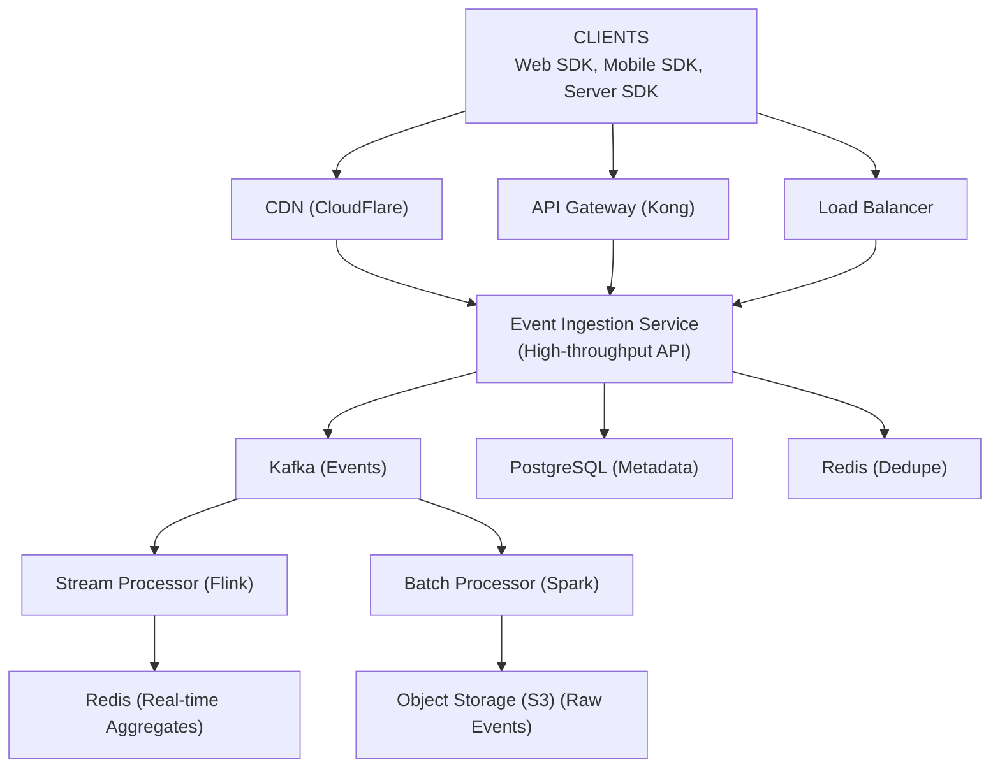
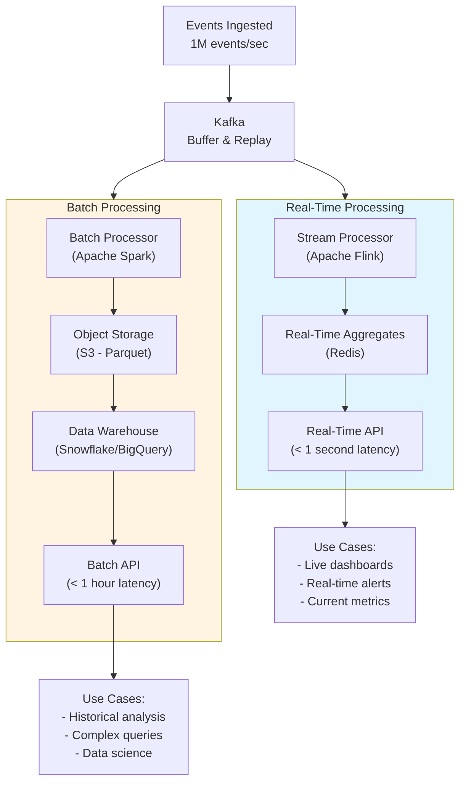
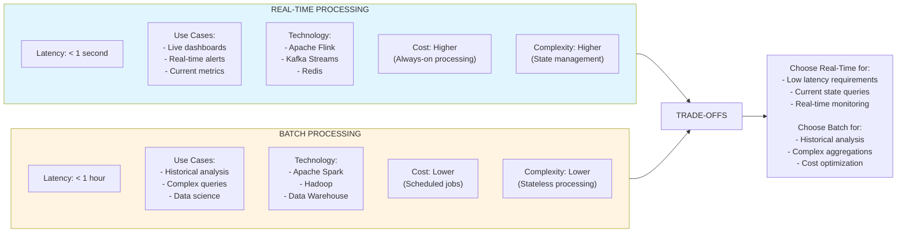
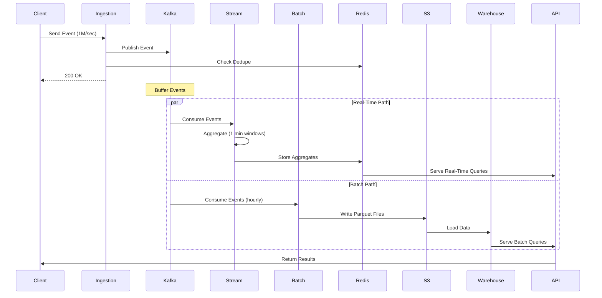

# Analytics System - Data Model & Architecture

## Database Choices

| Data Type | Database | Rationale |
|-----------|----------|-----------|
| Raw Events | Object Storage (S3) + Kafka | High-throughput ingestion, cost-effective storage |
| Event Metadata | PostgreSQL | ACID transactions, complex queries |
| Real-time Aggregates | Redis | Fast in-memory aggregations |
| Data Warehouse | Snowflake/BigQuery | Columnar storage, SQL queries, petabyte scale |
| Event Schemas | PostgreSQL | Schema registry, versioning |
| Query Results Cache | Redis | Fast query result caching |

---

## Consistency Model

**CAP Theorem Tradeoff:**

We choose **Availability + Partition Tolerance (AP)**:
- **Availability**: Analytics system must always accept events (even if queries are slow)
- **Partition Tolerance**: System continues operating during network partitions
- **Consistency**: Sacrificed (analytics can be eventually consistent)

**Why AP over CP?**
- Event ingestion must never fail (high availability)
- Analytics queries can tolerate slight delays (eventual consistency acceptable)
- Better to accept events and process later than reject events
- During partitions, we prefer accepting events over failing

**ACID vs BASE:**

**ACID (Strong Consistency) for:**
- Event schema registration (PostgreSQL, prevent conflicts)
- User permissions (PostgreSQL, security requirement)
- Query result deduplication (PostgreSQL, prevent duplicate results)

**BASE (Eventual Consistency) for:**
- Event ingestion (events may be processed out of order)
- Real-time aggregations (updated within seconds)
- Batch aggregations (updated daily)
- Query results (may reflect slightly stale data)

**Per-Operation Consistency Guarantees:**

| Operation | Consistency Level | Guarantee |
|-----------|------------------|-----------|
| Ingest event | Eventual | Event accepted, processed within seconds |
| Real-time query | Eventual | Data updated within 5 seconds |
| Batch query | Eventual | Data updated within 1 hour |
| Schema registration | Strong | Immediately visible, no conflicts |

**Eventual Consistency Boundaries:**
- Event processing delay: Up to 5 seconds (acceptable for analytics)
- Real-time aggregations: Updated within 5 seconds
- Batch aggregations: Updated within 1 hour
- Query results: May reflect data from 5 seconds ago

---

## Raw Events Storage

### Object Storage (S3-like)

**Storage Format:**
- Partitioned by date: `events/year=2024/month=01/day=15/hour=10/`
- Format: Parquet (columnar, compressed)
- Compression: Snappy (fast, good compression)

**File Structure:**
```
s3://analytics-events/
  year=2024/
    month=01/
      day=15/
        hour=10/
          part-00000.parquet
          part-00001.parquet
          ...
```

**Partitioning Strategy:**
- Partition by: year, month, day, hour
- Benefits: Fast time-range queries, efficient pruning
- File size: 128 MB - 1 GB per file (optimal for query performance)

**Schema Evolution:**
- Parquet supports schema evolution
- New fields added as optional
- Old fields deprecated but retained
- Schema registry tracks versions

---

## Event Metadata (PostgreSQL)

### Events Table

```sql
CREATE TABLE events_metadata (
    id BIGSERIAL PRIMARY KEY,
    event_id VARCHAR(36) UNIQUE NOT NULL,
    user_id VARCHAR(50),
    event_type VARCHAR(100) NOT NULL,
    project_id VARCHAR(50) NOT NULL,
    timestamp TIMESTAMP WITH TIME ZONE NOT NULL,
    ingested_at TIMESTAMP WITH TIME ZONE DEFAULT NOW(),
    storage_path TEXT NOT NULL,  -- S3 path
    file_partition VARCHAR(50) NOT NULL,  -- year=2024/month=01/day=15
    properties_hash VARCHAR(64),  -- SHA-256 of properties JSON
    status VARCHAR(20) DEFAULT 'processed',  -- processed, failed, pending
    created_at TIMESTAMP WITH TIME ZONE DEFAULT NOW()
);

CREATE INDEX idx_events_user_id ON events_metadata(user_id);
CREATE INDEX idx_events_event_type ON events_metadata(event_type);
CREATE INDEX idx_events_timestamp ON events_metadata(timestamp);
CREATE INDEX idx_events_project_id ON events_metadata(project_id);
CREATE INDEX idx_events_ingested_at ON events_metadata(ingested_at);
```

**Why This Schema:**
- `event_id`: Unique identifier for deduplication
- `storage_path`: Points to actual event data in S3
- `file_partition`: Enables partition pruning in queries
- `properties_hash`: For duplicate detection
- Indexes: Optimize common query patterns

### Event Schemas Table

```sql
CREATE TABLE event_schemas (
    id BIGSERIAL PRIMARY KEY,
    project_id VARCHAR(50) NOT NULL,
    event_type VARCHAR(100) NOT NULL,
    schema_version INTEGER NOT NULL,
    schema_definition JSONB NOT NULL,  -- JSON schema
    created_at TIMESTAMP WITH TIME ZONE DEFAULT NOW(),
    updated_at TIMESTAMP WITH TIME ZONE DEFAULT NOW(),
    UNIQUE(project_id, event_type, schema_version)
);

CREATE INDEX idx_schemas_project_event ON event_schemas(project_id, event_type);
```

**Schema Definition Example:**
```json
{
  "type": "object",
  "properties": {
    "productId": {
      "type": "string",
      "required": true
    },
    "amount": {
      "type": "number",
      "required": true
    },
    "currency": {
      "type": "string",
      "enum": ["USD", "EUR"],
      "required": true
    }
  }
}
```

---

## Real-Time Aggregates (Redis)

### Metric Aggregations

**Time-Windowed Aggregates:**
```
# 1-minute window
Key: metric:{metric_name}:1m:{timestamp}
Value: {count: 1000, sum: 50000, ...}
TTL: 2 minutes

# 5-minute window
Key: metric:{metric_name}:5m:{timestamp}
Value: {count: 5000, sum: 250000, ...}
TTL: 10 minutes

# 1-hour window
Key: metric:{metric_name}:1h:{timestamp}
Value: {count: 60000, sum: 3000000, ...}
TTL: 2 hours
```

**Example:**
```
# Daily active users (1-minute window)
SET metric:daily_active_users:1m:2024-01-15T10:30:00Z '{"count": 1250, "unique_users": 850}'
EXPIRE metric:daily_active_users:1m:2024-01-15T10:30:00Z 120

# Revenue (5-minute window)
SET metric:revenue:5m:2024-01-15T10:30:00Z '{"sum": 50000, "count": 1000}'
EXPIRE metric:revenue:5m:2024-01-15T10:30:00Z 600
```

**Dimension-Based Aggregates:**
```
# Grouped by country
Key: metric:{metric_name}:1m:{timestamp}:country:{country_code}
Value: {count: 100, sum: 5000}

# Grouped by device
Key: metric:{metric_name}:1m:{timestamp}:device:{device_type}
Value: {count: 50, sum: 2500}
```

---

## Data Warehouse Schema

### Events Fact Table (Columnar)

**Parquet Schema:**
```json
{
  "type": "struct",
  "fields": [
    {"name": "event_id", "type": "string"},
    {"name": "user_id", "type": "string"},
    {"name": "event_type", "type": "string"},
    {"name": "project_id", "type": "string"},
    {"name": "timestamp", "type": "timestamp"},
    {"name": "properties", "type": "map<string,string>"},
    {"name": "context", "type": "struct<ip:string,userAgent:string>"}
  ]
}
```

**Partitioning:**
- Partitioned by: `year`, `month`, `day`, `hour`
- Enables partition pruning
- Reduces data scanned per query

### Aggregated Metrics Table

```sql
CREATE TABLE metric_aggregates (
    metric_name VARCHAR(100) NOT NULL,
    metric_type VARCHAR(20) NOT NULL,  -- count, sum, avg, unique
    time_granularity VARCHAR(10) NOT NULL,  -- minute, hour, day
    timestamp TIMESTAMP WITH TIME ZONE NOT NULL,
    value DECIMAL(20,2),
    dimensions JSONB,  -- {country: "US", device: "mobile"}
    created_at TIMESTAMP WITH TIME ZONE DEFAULT NOW(),
    PRIMARY KEY (metric_name, time_granularity, timestamp, dimensions)
);

CREATE INDEX idx_aggregates_metric_time ON metric_aggregates(metric_name, timestamp);
```

**Example Rows:**
```
metric_name: daily_active_users
time_granularity: day
timestamp: 2024-01-15T00:00:00Z
value: 1250000
dimensions: {}

metric_name: revenue
time_granularity: hour
timestamp: 2024-01-15T10:00:00Z
value: 50000
dimensions: {"country": "US", "device": "mobile"}
```

---

## Sharding Strategy

### Event Metadata Sharding

**Shard Key: `project_id`**

**Rationale:**
- Events are queried by project
- Projects are isolated (no cross-project queries)
- Even distribution across projects
- Easy to scale per project

**Sharding Function:**
```java
int shardNumber = Math.abs(projectId.hashCode()) % numShards;
```

**Shard Count:**
- Start: 10 shards
- Scale: Add shards as needed
- Rebalancing: Use consistent hashing

### Data Warehouse Sharding

**No Sharding (Managed Service):**
- Snowflake/BigQuery handle sharding internally
- Partitioning by time is sufficient
- Automatic scaling

---

## Replication Strategy

### PostgreSQL Replication

**Leader-Follower (Primary-Replica):**
- 1 primary, 2 replicas
- Async replication
- Reads from replicas
- Writes to primary

**Replication Lag:**
- Acceptable: < 100ms
- Monitoring: Track replication lag
- Failover: Automatic (within 30 seconds)

### Redis Replication

**Redis Cluster:**
- 3 masters, 3 replicas
- Automatic failover
- Data sharded across masters
- Replicas for read scaling

### Object Storage Replication

**S3 Replication:**
- Cross-region replication (3 regions)
- 11 nines durability
- Automatic replication
- No manual intervention

---

## Data Retention & Archival

### Retention Policy

| Data Type | Retention | Archival |
|-----------|-----------|----------|
| Raw events (hot) | 30 days | Move to cold storage |
| Raw events (cold) | 2 years | Glacier/Deep Archive |
| Aggregated metrics | 5 years | Keep in data warehouse |
| Real-time aggregates | 24 hours | Discard after aggregation |

### Archival Process

1. **Daily Archival Job:**
   - Move events older than 30 days to cold storage
   - Compress and archive
   - Update metadata

2. **Query Handling:**
   - Hot queries: Query hot storage (30 days)
   - Cold queries: Query cold storage (slower, cheaper)
   - Transparent to users

---

## Backup & Recovery Strategy

### Backup Strategy

**RPO (Recovery Point Objective):** 1 hour
**RTO (Recovery Time Objective):** 4 hours

**Backup Schedule:**
- PostgreSQL: Hourly snapshots, daily full backups
- Object Storage: Continuous replication (no backup needed)
- Data Warehouse: Managed service handles backups

**Backup Storage:**
- 3x replication across regions
- Encrypted backups
- Tested restore procedures

### Recovery Procedures

1. **Point-in-Time Recovery:**
   - Restore from backup
   - Replay transactions from WAL
   - Verify data integrity

2. **Disaster Recovery:**
   - Failover to secondary region
   - Restore from backups
   - Resume operations

---

## High-Level Architecture



<details>
<summary>ASCII diagram (reference)</summary>

```text
┌─────────────────────────────────────────────────────────────────────────────────────┐
│                                    CLIENTS                                           │
│                    (Web SDK, Mobile SDK, Server SDK)                                │
└─────────────────────────────────────────────────────────────────────────────────────┘
                                        │
                    ┌───────────────────┼───────────────────┐
                    │                   │                   │
                    ▼                   ▼                   ▼
            ┌─────────────┐     ┌─────────────┐     ┌─────────────┐
            │    CDN      │     │ API Gateway │     │  Load       │
            │  (CloudFlare)│     │  (Kong)     │     │  Balancer   │
            └──────┬──────┘     └──────┬──────┘     └──────┬──────┘
                   │                   │                   │
                   └───────────────────┴───────────────────┘
                                        │
                          ┌─────────────▼─────────────┐
                          │   Event Ingestion Service │
                          │   (High-throughput API)   │
                          └─────────────┬─────────────┘
                                        │
                    ┌───────────────────┼───────────────────┐
                    │                   │                   │
                    ▼                   ▼                   ▼
            ┌─────────────┐     ┌─────────────┐     ┌─────────────┐
            │    Kafka    │     │  PostgreSQL │     │    Redis    │
            │  (Events)   │     │ (Metadata)  │     │ (Dedupe)    │
            └──────┬──────┘     └─────────────┘     └─────────────┘
                   │
                   │
        ┌──────────┴──────────┐
        │                     │
        ▼                     ▼
┌───────────────┐     ┌───────────────┐
│   Stream     │     │   Batch       │
│  Processor   │     │  Processor    │
│  (Flink)     │     │  (Spark)      │
└──────┬───────┘     └───────┬───────┘
       │                     │
       │                     │
       ▼                     ▼
┌───────────────┐     ┌───────────────┐
│    Redis     │     │  Object       │
│ (Real-time   │     │  Storage (S3) │
│ Aggregates)  │     │  (Raw Events)  │
└──────┬───────┘     └───────┬───────┘
       │                     │
       │                     │
       └──────────┬──────────┘
                  │
                  ▼
```

</details>
```
         ┌─────────────────┐
         │  Data Warehouse │
         │ (Snowflake/     │
         │  BigQuery)      │
         └─────────┬───────┘
                   │
                   │
         ┌─────────▼───────┐
         │  Query Service  │
         │  (Analytics API)│
         └─────────┬───────┘
                   │
         ┌─────────▼───────┐
         │  Dashboards &   │
         │  BI Tools       │
         └─────────────────┘
```

### Data Pipeline Flow: Real-Time vs Batch Processing



<details>
<summary>ASCII diagram (reference)</summary>

```text
┌─────────────────────────────────────────────────────────────────────────┐
│                    DATA PIPELINE FLOW                                    │
│                                                                          │
│  Events Ingested (1M events/sec)                                        │
│       │                                                                  │
│       ▼                                                                  │
│  ┌─────────┐                                                            │
│  │  Kafka  │  Buffer & Replay                                           │
│  └────┬────┘                                                            │
│       │                                                                  │
│       ├──────────────────────┬──────────────────────┐                  │
│       │                      │                      │                  │
│       ▼                      ▼                      ▼                  │
│  ┌─────────────┐    ┌─────────────┐    ┌─────────────┐               │
│  │   REAL-TIME │    │    BATCH    │    │   HYBRID    │               │
│  │    PATH     │    │    PATH     │    │    PATH     │               │
│  └─────────────┘    └─────────────┘    └─────────────┘               │
│       │                      │                      │                  │
│       ▼                      ▼                      ▼                  │
│  Stream Processor      Batch Processor      Hybrid Processor          │
│  (Apache Flink)        (Apache Spark)        (Kafka Streams)          │
│       │                      │                      │                  │
│       ▼                      ▼                      ▼                  │
│  Redis Aggregates      S3 (Parquet)         Redis + S3                │
│       │                      │                      │                  │
│       ▼                      ▼                      ▼                  │
│  Real-Time API         Data Warehouse       Multi-tier API            │
│  (< 1 sec)             (< 1 hour)            (Variable latency)       │
│       │                      │                      │                  │
│       ▼                      ▼                      ▼                  │
│  Live Dashboards       Historical Analysis   Flexible Queries         │
│  Real-time Alerts      Complex Queries                                 │
│  Current Metrics       Data Science                                    │
└─────────────────────────────────────────────────────────────────────────┘
```
</details>

### Real-Time vs Batch Processing Trade-offs



<details>
<summary>ASCII diagram (reference)</summary>

```text
┌─────────────────────────────────────────────────────────────────────────┐
│              REAL-TIME vs BATCH PROCESSING TRADE-OFFS                  │
│                                                                          │
│  ┌──────────────────────┐      ┌──────────────────────┐                │
│  │  REAL-TIME PROCESSING │      │  BATCH PROCESSING   │                │
│  ├──────────────────────┤      ├──────────────────────┤                │
│  │ Latency: < 1 second  │      │ Latency: < 1 hour    │                │
│  │                      │      │                      │                │
│  │ Use Cases:           │      │ Use Cases:           │                │
│  │ - Live dashboards    │      │ - Historical analysis│                │
│  │ - Real-time alerts   │      │ - Complex queries    │                │
│  │ - Current metrics    │      │ - Data science       │                │
│  │                      │      │                      │                │
│  │ Technology:          │      │ Technology:          │                │
│  │ - Apache Flink       │      │ - Apache Spark       │                │
│  │ - Kafka Streams      │      │ - Hadoop             │                │
│  │ - Redis              │      │ - Data Warehouse     │                │
│  │                      │      │                      │                │
│  │ Cost: Higher         │      │ Cost: Lower          │                │
│  │ (Always-on)          │      │ (Scheduled jobs)     │                │
│  │                      │      │                      │                │
│  │ Complexity: Higher   │      │ Complexity: Lower     │                │
│  │ (State management)   │      │ (Stateless)           │                │
│  └──────────┬───────────┘      └──────────┬───────────┘                │
│             │                              │                            │
│             └──────────────┬───────────────┘                            │
│                            ▼                                            │
│                    ┌───────────────┐                                    │
│                    │   TRADE-OFFS  │                                    │
│                    └───────┬───────┘                                    │
│                            ▼                                            │
│          Choose Real-Time for:        Choose Batch for:                │
│          - Low latency requirements   - Historical analysis            │
│          - Current state queries      - Complex aggregations           │
│          - Real-time monitoring       - Cost optimization              │
└─────────────────────────────────────────────────────────────────────────┘
```
</details>

### Event Processing Flow Diagram



<details>
<summary>ASCII diagram (reference)</summary>

```text
┌─────────────────────────────────────────────────────────────────────────┐
│                    EVENT PROCESSING FLOW                                │
│                                                                          │
│  Client → Ingestion → Kafka → [Stream | Batch] → [Redis | S3] → API    │
│                                                                          │
│  Step 1: Client sends event (1M/sec)                                    │
│  Step 2: Ingestion validates and publishes to Kafka                     │
│  Step 3: Ingestion checks Redis for duplicates                          │
│  Step 4: Ingestion returns 200 OK                                       │
│                                                                          │
│  Step 5a (Real-Time):                                                   │
│    - Kafka → Stream Processor (Flink)                                   │
│    - Stream aggregates in 1-minute windows                             │
│    - Stream stores aggregates in Redis                                 │
│    - API serves real-time queries from Redis                           │
│                                                                          │
│  Step 5b (Batch):                                                       │
│    - Kafka → Batch Processor (Spark) - hourly                          │
│    - Batch writes Parquet files to S3                                   │
│    - Data Warehouse loads from S3                                      │
│    - API serves batch queries from Warehouse                           │
│                                                                          │
│  Step 6: API returns results to client                                  │
└─────────────────────────────────────────────────────────────────────────┘
```
</details>
```

---

## Component Details

### Event Ingestion Service

**Purpose:** High-throughput API for event ingestion

**Responsibilities:**
- Accept events from clients
- Validate event schema
- Deduplicate events (eventId)
- Write to Kafka
- Update metadata in PostgreSQL
- Return acknowledgment

**Technology:** Java Spring Boot, Netty for async I/O

**Scaling:**
- Horizontal scaling (stateless)
- Load balanced across instances
- Each instance handles 50K events/second

### Kafka (Event Stream)

**Purpose:** Buffer and distribute events

**Configuration:**
- Topics: `events.{project_id}`
- Partitions: 100 per topic (for parallelism)
- Replication: 3x
- Retention: 7 days (for reprocessing)

**Partition Strategy:**
- Partition key: `eventId` (for ordering)
- Ensures same event processed once
- Enables parallel processing

### Stream Processor (Flink)

**Purpose:** Real-time event processing and aggregation

**Responsibilities:**
- Read events from Kafka
- Aggregate metrics in time windows
- Update Redis with real-time aggregates
- Handle late-arriving events

**Processing Windows:**
- 1-minute tumbling windows
- 5-minute tumbling windows
- 1-hour tumbling windows

### Batch Processor (Spark)

**Purpose:** Daily batch processing and ETL

**Responsibilities:**
- Read events from object storage
- Transform and enrich events
- Load into data warehouse
- Generate daily aggregates

**Schedule:**
- Runs daily at 2 AM UTC
- Processes previous day's events
- Completes within 4 hours

### Query Service

**Purpose:** Execute analytics queries

**Responsibilities:**
- Accept SQL-like queries
- Route to appropriate storage (Redis, data warehouse)
- Cache query results
- Return formatted results

**Query Types:**
- Real-time queries: Query Redis aggregates
- Historical queries: Query data warehouse
- Ad-hoc queries: Query raw events (limited)

---

## Request Flow: Event Ingestion

**Step-by-Step Flow:**

1. **Client sends event** to Event Ingestion Service
   ```
   POST /v1/events
   {
     "eventId": "evt_123",
     "eventType": "page_view",
     "userId": "user_123",
     "properties": {...}
   }
   ```

2. **Ingestion Service validates:**
   - Check API key
   - Validate event schema
   - Check rate limits
   - Deduplicate (check Redis for eventId)

3. **Write to Kafka:**
   - Partition by eventId
   - Topic: `events.{project_id}`
   - Async write (non-blocking)

4. **Update metadata:**
   - Insert into PostgreSQL (event metadata)
   - Store eventId in Redis (24-hour TTL for deduplication)

5. **Return response:**
   ```
   202 Accepted
   {
     "status": "accepted",
     "eventId": "evt_123"
   }
   ```

6. **Background processing:**
   - Stream processor reads from Kafka
   - Aggregates metrics
   - Updates Redis
   - Writes to object storage (batched)

---

## Request Flow: Query Execution

**Step-by-Step Flow:**

1. **Client sends query:**
   ```
   GET /v1/metrics/daily_active_users?startTime=2024-01-01&endTime=2024-01-31
   ```

2. **Query Service:**
   - Parse query parameters
   - Check cache (Redis)
   - If cache hit: Return cached result
   - If cache miss: Continue

3. **Route query:**
   - Real-time query (< 24 hours): Query Redis aggregates
   - Historical query (> 24 hours): Query data warehouse

4. **Execute query:**
   - Real-time: Aggregate from Redis time windows
   - Historical: SQL query on data warehouse

5. **Format and return:**
   - Format result as JSON
   - Cache result (1-hour TTL)
   - Return to client

---

## Data Flow: Event Processing Pipeline

**End-to-End Data Flow:**

1. **Event Ingestion:**
   ```
   Client → Ingestion Service → Kafka → Object Storage
   ```

2. **Real-Time Processing:**
   ```
   Kafka → Stream Processor → Redis (Aggregates)
   ```

3. **Batch Processing:**
   ```
   Object Storage → Batch Processor → Data Warehouse
   ```

4. **Query:**
   ```
   Client → Query Service → Redis/Data Warehouse → Response
   ```

---

## Failure Points & Degradation

### Single Points of Failure

1. **Kafka Cluster:**
   - Failure: Events cannot be ingested
   - Mitigation: 3x replication, automatic failover
   - Degradation: Queue events in client SDK

2. **PostgreSQL Primary:**
   - Failure: Metadata writes fail
   - Mitigation: Automatic failover to replica (< 30 seconds)
   - Degradation: Events still ingested to Kafka, metadata updated later

3. **Redis Cluster:**
   - Failure: Real-time queries fail
   - Mitigation: 3x replication, automatic failover
   - Degradation: Query data warehouse instead (slower)

4. **Data Warehouse:**
   - Failure: Historical queries fail
   - Mitigation: Managed service with high availability
   - Degradation: Return cached results, queue queries

### Graceful Degradation

- **Event ingestion overload:** Return 503, client retries with backoff
- **Query overload:** Queue queries, return 503 for non-critical queries
- **Cache miss:** Query data warehouse (slower but works)
- **Stream processor lag:** Real-time queries may be slightly stale

---

## Next Steps

After data model and architecture, we'll design:
1. Async messaging and event processing (Kafka, Flink)
2. Caching strategy (Redis)
3. Search capabilities (if needed)
4. Scaling and reliability
5. Monitoring and observability


