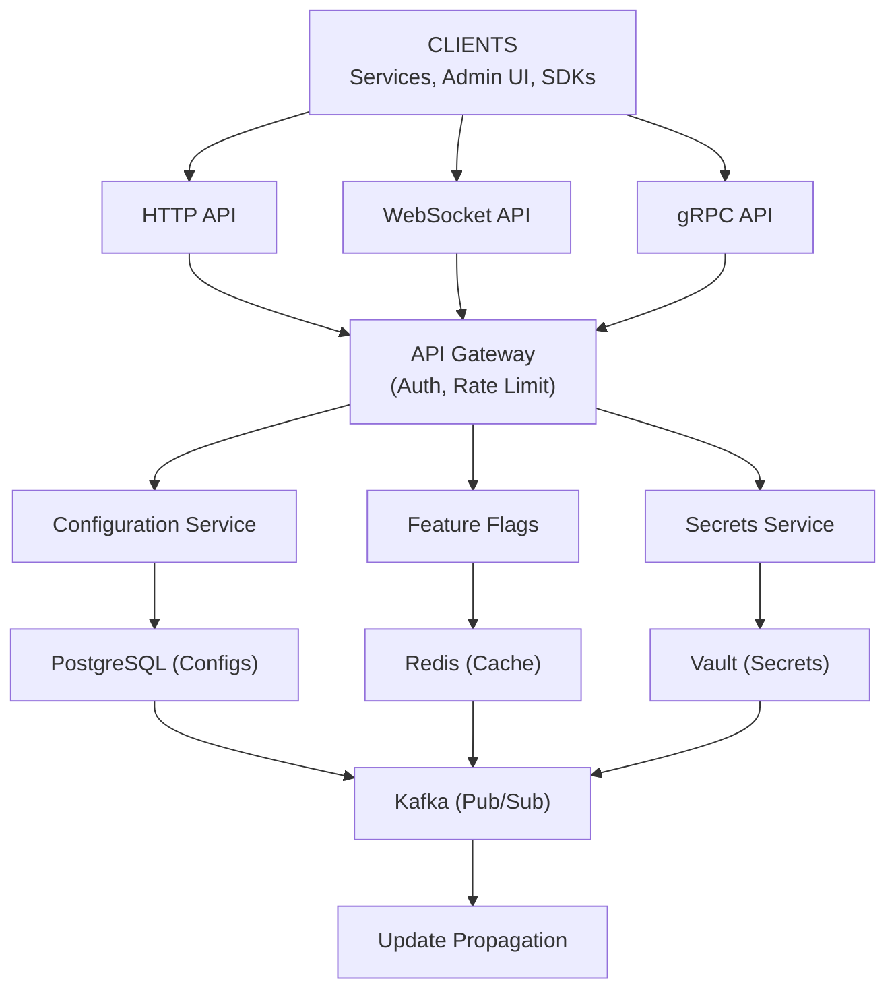

# Distributed Configuration Management - Data Model & Architecture

## Database Choices

| Data Type | Database | Rationale |
|-----------|----------|-----------|
| Configurations | PostgreSQL | ACID, versioning, complex queries |
| Cache | Redis | Fast reads, pub/sub for updates |
| Secrets | Vault/KMS | Encryption, key management |

---

## Consistency Model

**CAP Theorem: Strong Consistency (CP)**

- **Consistency**: Writes must be immediately visible
- **Partition Tolerance**: System continues during partitions
- **Availability**: Sacrificed (better to fail than serve stale config)

**Why CP over AP:**
- Configuration changes must be consistent
- Stale configuration can cause service failures
- Better to fail than serve wrong configuration

**ACID for:**
- Configuration writes (must be atomic)
- Version updates (must be consistent)
- Rollback operations (must be transactional)

---

## Configuration Schema

### Configurations Table

```sql
CREATE TABLE configurations (
    id BIGSERIAL PRIMARY KEY,
    key VARCHAR(256) NOT NULL,
    value TEXT NOT NULL,
    version INTEGER NOT NULL,
    environment VARCHAR(50) NOT NULL,
    value_type VARCHAR(20) DEFAULT 'string',  -- string, json, number, boolean
    schema_definition JSONB,  -- JSON Schema for validation
    created_at TIMESTAMP WITH TIME ZONE DEFAULT NOW(),
    updated_at TIMESTAMP WITH TIME ZONE DEFAULT NOW(),
    updated_by VARCHAR(100),
    change_log TEXT,
    UNIQUE(key, environment, version)
);

CREATE INDEX idx_configs_key_env ON configurations(key, environment);
CREATE INDEX idx_configs_key_env_version ON configurations(key, environment, version DESC);
CREATE INDEX idx_configs_updated_at ON configurations(updated_at);
```

### Configuration History Table

```sql
CREATE TABLE configuration_history (
    id BIGSERIAL PRIMARY KEY,
    key VARCHAR(256) NOT NULL,
    environment VARCHAR(50) NOT NULL,
    version INTEGER NOT NULL,
    value TEXT NOT NULL,
    value_type VARCHAR(20),
    updated_at TIMESTAMP WITH TIME ZONE NOT NULL,
    updated_by VARCHAR(100),
    change_log TEXT,
    UNIQUE(key, environment, version)
);

CREATE INDEX idx_history_key_env_version ON configuration_history(key, environment, version DESC);
```

### Feature Flags Table

```sql
CREATE TABLE feature_flags (
    id BIGSERIAL PRIMARY KEY,
    flag_name VARCHAR(100) NOT NULL,
    enabled BOOLEAN DEFAULT FALSE,
    percentage INTEGER DEFAULT 0,  -- 0-100
    target_users TEXT[],  -- Array of user IDs
    environment VARCHAR(50) NOT NULL,
    version INTEGER NOT NULL,
    updated_at TIMESTAMP WITH TIME ZONE DEFAULT NOW(),
    updated_by VARCHAR(100),
    UNIQUE(flag_name, environment, version)
);

CREATE INDEX idx_flags_name_env ON feature_flags(flag_name, environment);
```

---

## High-Level Architecture



<details>
<summary>ASCII diagram (reference)</summary>

```text
┌─────────────────────────────────────────────────────────────┐
│                        CLIENTS                               │
│              (Services, Admin UI, SDKs)                      │
└─────────────────────────────────────────────────────────────┘
                            │
                ┌───────────┼───────────┐
                │           │           │
                ▼           ▼           ▼
        ┌───────────┐ ┌──────────┐ ┌──────────┐
        │   HTTP    │ │ WebSocket│ │   gRPC    │
        │   API     │ │   API    │ │   API     │
        └─────┬─────┘ └─────┬────┘ └─────┬────┘
              │             │             │
              └─────────────┴─────────────┘
                            │
              ┌─────────────▼─────────────┐
              │    API Gateway            │
              │  (Auth, Rate Limit)      │
              └─────────────┬─────────────┘
                            │
        ┌───────────────────┼───────────────────┐
        │                   │                   │
        ▼                   ▼                   ▼
┌───────────────┐   ┌──────────────┐   ┌──────────────┐
│ Configuration │   │   Feature    │   │   Secrets    │
│    Service     │   │   Flags     │   │   Service    │
└───────┬───────┘   └──────┬───────┘   └──────┬───────┘
        │                   │                   │
        └───────────────────┴───────────────────┘
                            │
        ┌───────────────────┼───────────────────┐
        │                   │                   │
        ▼                   ▼                   ▼
┌───────────────┐   ┌──────────────┐   ┌──────────────┐
│  PostgreSQL   │   │    Redis     │   │    Vault      │
│  (Configs)    │   │   (Cache)    │   │  (Secrets)    │
└───────────────┘   └──────┬───────┘   └──────────────┘
                            │
                            ▼
                    ┌──────────────┐
                    │   Kafka      │
                    │ (Pub/Sub)    │
                    └──────┬───────┘
                           │
                           ▼
                    ┌──────────────┐
                    │  Update      │
                    │ Propagation  │
                    └──────┬───────┘
                           │
```

</details>
```
                           ▼
                    ┌──────────────┐
                    │  WebSocket    │
                    │   Clients     │
                    └──────────────┘
```

---

## Component Details

### Configuration Service

**Purpose:** CRUD operations for configurations

**Responsibilities:**
- Create, read, update, delete configurations
- Version management
- Validation
- Access control

**Technology:** Java Spring Boot

### Update Propagation Service

**Purpose:** Push configuration updates to services

**Responsibilities:**
- Publish updates to Kafka
- Manage WebSocket connections
- Track subscription state

**Technology:** Java Spring Boot, Kafka

### Redis Cache

**Purpose:** Fast configuration reads

**Cache Keys:**
```
config:{key}:{environment} → {value, version}
config:version:{key}:{environment} → {version}
```

**TTL:** 1 hour (configs don't change frequently)

**Pub/Sub:** Notify on updates
```
Channel: config:updates:{key}
Message: {key, value, version, timestamp}
```

---

## Request Flow: Configuration Read

1. **Service requests config:**
   ```
   GET /v1/config/services.payment.database_url
   ```

2. **API Gateway:**
   - Authenticate request
   - Check rate limits
   - Route to Configuration Service

3. **Configuration Service:**
   - Check Redis cache (HIT/MISS)
   - If HIT: Return from cache
   - If MISS: Query PostgreSQL, cache result, return

4. **Response:**
   ```json
   {
     "key": "services.payment.database_url",
     "value": "postgres://...",
     "version": 42
   }
   ```

**Latency:**
- Cache HIT: < 5ms
- Cache MISS: < 50ms (database query)

---

## Request Flow: Configuration Update

1. **Admin updates config:**
   ```
   PUT /v1/config/services.payment.database_url
   {
     "value": "postgres://new-db.example.com:5432/payment"
   }
   ```

2. **Configuration Service:**
   - Validate request
   - Check permissions
   - Begin transaction

3. **PostgreSQL:**
   - Insert new version
   - Update current version pointer
   - Commit transaction

4. **Cache Invalidation:**
   - Delete Redis cache key
   - Publish update to Kafka

5. **Update Propagation:**
   - Kafka consumers notify WebSocket clients
   - Services receive update within 5 seconds

**Latency:**
- Write: < 100ms
- Propagation: < 5 seconds

---

## Sharding Strategy

**Shard Key: `key` (hash of key)**

**Rationale:**
- Even distribution
- Configs accessed by key
- No cross-key queries

**Shard Count:**
- Start: 10 shards
- Scale: Add shards as needed

---

## Replication Strategy

**PostgreSQL:**
- Primary + 2 replicas
- Async replication
- Reads from replicas
- Writes to primary

**Redis:**
- Redis Cluster: 3 masters, 3 replicas
- Automatic failover

---

## Next Steps

After data model and architecture, we'll design:
1. Async messaging for update propagation
2. Caching strategy
3. Scaling and reliability
4. Monitoring and security

