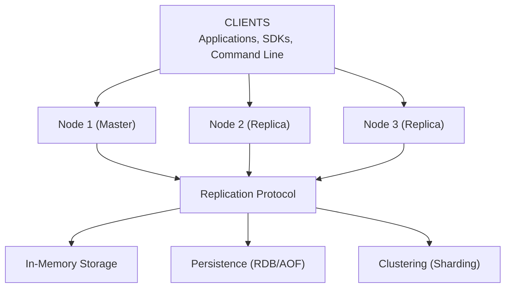

# Key-Value Store - Data Model & Architecture

## Data Structures Implementation

### Strings

**Storage:**
- Simple key-value mapping
- Hash table: O(1) lookup
- Memory: key + value + metadata

**Implementation:**
```java
class StringEntry {
    String key;
    byte[] value;
    long expiration;  // -1 if no expiration
    long lastAccessed;
}
```

### Hashes

**Storage:**
- Nested hash table
- Field-value pairs
- Memory: key + hash table overhead

**Implementation:**
```java
class HashEntry {
    String key;
    Map<String, byte[]> fields;
    long expiration;
}
```

### Lists

**Storage:**
- Doubly-linked list or array
- O(1) push/pop, O(n) range
- Memory: key + list overhead

**Implementation:**
```java
class ListEntry {
    String key;
    LinkedList<byte[]> values;
    long expiration;
}
```

### Sets

**Storage:**
- Hash set
- O(1) add/remove/contains
- Memory: key + hash set overhead

**Implementation:**
```java
class SetEntry {
    String key;
    Set<byte[]> members;
    long expiration;
}
```

### Sorted Sets

**Storage:**
- Skip list + hash map
- O(log n) insert, O(1) score lookup
- Memory: key + skip list + hash map

**Implementation:**
```java
class SortedSetEntry {
    String key;
    SkipList<Member> members;  // Sorted by score
    Map<String, Double> scores;  // Score lookup
    long expiration;
}
```

---

## High-Level Architecture



<details>
<summary>ASCII diagram (reference)</summary>

```text
┌─────────────────────────────────────────────────────────┐
│                      CLIENTS                             │
│         (Applications, SDKs, Command Line)               │
└─────────────────────────────────────────────────────────┘
                            │
                ┌───────────┼───────────┐
                │           │           │
                ▼           ▼           ▼
        ┌───────────┐ ┌──────────┐ ┌──────────┐
        │   Node 1   │ │  Node 2  │ │  Node 3  │
        │ (Master)   │ │(Replica)  │ │(Replica) │
        └─────┬─────┘ └─────┬────┘ └─────┬────┘
              │             │             │
              └─────────────┴─────────────┘
                            │
                    ┌───────▼───────┐
                    │  Replication  │
                    │   Protocol    │
                    └───────┬───────┘
                            │
        ┌───────────────────┼───────────────────┐
        │                   │                   │
        ▼                   ▼                   ▼
┌───────────────┐   ┌──────────────┐   ┌──────────────┐
│  In-Memory    │   │  Persistence  │   │  Clustering  │
│   Storage     │   │  (RDB/AOF)    │   │  (Sharding)  │
└───────────────┘   └───────────────┘   └──────────────┘
```

</details>
```

---

## Persistence Mechanisms

### RDB (Redis Database)

**How It Works:**
1. Fork process
2. Child process writes snapshot to disk
3. Parent continues serving requests
4. Snapshot contains all data at point in time

**Configuration:**
```
save 900 1      # Save if 1 key changed in 900 seconds
save 300 10     # Save if 10 keys changed in 300 seconds
save 60 10000   # Save if 10000 keys changed in 60 seconds
```

**Pros:**
- Fast recovery
- Compact file size
- Point-in-time backup

**Cons:**
- May lose data since last snapshot
- Fork overhead

### AOF (Append-Only File)

**How It Works:**
1. Write every write command to AOF file
2. Periodically rewrite AOF (compact)
3. Replay AOF on startup

**Configuration:**
```
appendonly yes
appendfsync everysec  # everysec, always, no
auto-aof-rewrite-percentage 100
auto-aof-rewrite-min-size 64mb
```

**Pros:**
- Better durability
- No data loss (with fsync)
- Human-readable

**Cons:**
- Larger file size
- Slower recovery
- More disk I/O

---

## Replication Strategy

### Master-Replica

**How It Works:**
1. Replica connects to master
2. Master sends RDB snapshot
3. Master streams write commands
4. Replica applies commands

**Replication Flow:**
```
Replica → Master: SYNC
Master → Replica: RDB snapshot
Master → Replica: Stream write commands
Replica: Applies commands, stays in sync
```

**Failover:**
- Sentinel detects master failure
- Promotes replica to master
- Clients reconnect to new master

---

## Clustering (Sharding)

### Consistent Hashing

**How It Works:**
1. Hash key to get hash value
2. Map hash value to node using consistent hashing ring
3. Each node handles range of hash values

**Hash Slot Distribution:**
```
16384 hash slots
Node 1: 0-5460
Node 2: 5461-10922
Node 3: 10923-16383
```

**Rebalancing:**
- Add node: Migrate slots from existing nodes
- Remove node: Migrate slots to other nodes
- Automatic or manual rebalancing

---

## Memory Management

### Eviction Policies

**LRU (Least Recently Used):**
- Evict least recently accessed keys
- Track access time
- Good for caching

**LFU (Least Frequently Used):**
- Evict least frequently accessed keys
- Track access frequency
- Good for long-term caching

**Random:**
- Evict random keys
- Simple, fast
- Less optimal

**TTL:**
- Evict expired keys
- Background process
- Automatic cleanup

### Memory Optimization

**Key Encoding:**
- Small integers: Use integer encoding
- Short strings: Use embstr encoding
- Long strings: Use raw encoding

**Data Structure Optimization:**
- Small lists: Use ziplist
- Small hashes: Use ziplist
- Small sorted sets: Use ziplist

---

## Request Flow: GET Operation

1. **Client sends GET:**
   ```
   GET user:123
   ```

2. **Server receives:**
   - Parse command
   - Hash key to find node (if clustered)
   - Lookup in hash table

3. **Check expiration:**
   - If expired: Delete key, return null
   - If not expired: Return value

4. **Update LRU:**
   - Update last accessed time

5. **Return response:**
   ```
   $8
   John Doe
   ```

**Latency:** < 1ms (in-memory lookup)

---

## Request Flow: SET Operation

1. **Client sends SET:**
   ```
   SET user:123 "John Doe" EX 3600
   ```

2. **Server receives:**
   - Parse command
   - Validate arguments

3. **Write to memory:**
   - Store key-value in hash table
   - Set expiration if provided

4. **Write to AOF (if enabled):**
   - Append command to AOF file
   - Sync to disk (based on appendfsync)

5. **Replicate to replicas:**
   - Send command to all replicas
   - Replicas apply command

6. **Return response:**
   ```
   +OK
   ```

**Latency:** < 1ms (memory write)

---

## Consistency Model

**CAP Theorem: AP (Availability + Partition Tolerance)**

- **Availability**: System must always respond
- **Partition Tolerance**: System continues during partitions
- **Consistency**: Sacrificed (eventual consistency)

**Why AP:**
- Key-value store prioritizes availability
- Eventual consistency acceptable for most use cases
- Replication provides eventual consistency

**Consistency Guarantees:**
- Single node: Strong consistency
- Replication: Eventual consistency (async)
- Transactions: Strong consistency (within transaction)

---

## Sharding Strategy

**Shard Key: Hash of key**

**Sharding Function:**
```java
int slot = CRC16(key) % 16384;
int node = findNodeForSlot(slot);
```

**Rebalancing:**
- Migrate slots when nodes added/removed
- Use consistent hashing for minimal migration
- Background migration process

---

## Next Steps

After data model and architecture, we'll design:
1. Async operations (if needed)
2. Caching (internal optimizations)
3. Scaling and reliability
4. Monitoring and security

