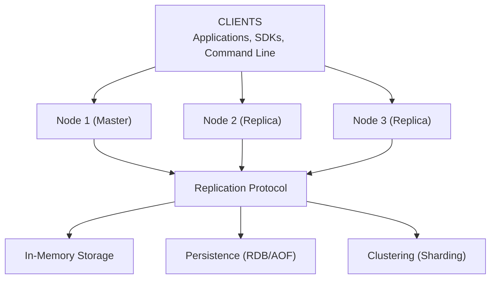

# Key-Value Store - Data Model & Architecture

## Data Structures Implementation

### Strings

**Storage:**
- Simple key-value mapping
- Hash table: O(1) lookup
- Memory: key + value + metadata

**Implementation:**
```java
class StringEntry {
    String key;
    byte[] value;
    long expiration;  // -1 if no expiration
    long lastAccessed;
}
```

### Hashes

**Storage:**
- Nested hash table
- Field-value pairs
- Memory: key + hash table overhead

**Implementation:**
```java
class HashEntry {
    String key;
    Map<String, byte[]> fields;
    long expiration;
}
```

### Lists

**Storage:**
- Doubly-linked list or array
- O(1) push/pop, O(n) range
- Memory: key + list overhead

**Implementation:**
```java
class ListEntry {
    String key;
    LinkedList<byte[]> values;
    long expiration;
}
```

### Sets

**Storage:**
- Hash set
- O(1) add/remove/contains
- Memory: key + hash set overhead

**Implementation:**
```java
class SetEntry {
    String key;
    Set<byte[]> members;
    long expiration;
}
```

### Sorted Sets

**Storage:**
- Skip list + hash map
- O(log n) insert, O(1) score lookup
- Memory: key + skip list + hash map

**Implementation:**
```java
class SortedSetEntry {
    String key;
    SkipList<Member> members;  // Sorted by score
    Map<String, Double> scores;  // Score lookup
    long expiration;
}
```

---

## High-Level Architecture



<details>
<summary>ASCII diagram (reference)</summary>

```text
┌─────────────────────────────────────────────────────────┐
│                      CLIENTS                             │
│         (Applications, SDKs, Command Line)               │
└─────────────────────────────────────────────────────────┘
                            │
                ┌───────────┼───────────┐
                │           │           │
                ▼           ▼           ▼
        ┌───────────┐ ┌──────────┐ ┌──────────┐
        │   Node 1   │ │  Node 2  │ │  Node 3  │
        │ (Master)   │ │(Replica)  │ │(Replica) │
        └─────┬─────┘ └─────┬────┘ └─────┬────┘
              │             │             │
              └─────────────┴─────────────┘
                            │
                    ┌───────▼───────┐
                    │  Replication  │
                    │   Protocol    │
                    └───────┬───────┘
                            │
        ┌───────────────────┼───────────────────┐
        │                   │                   │
        ▼                   ▼                   ▼
┌───────────────┐   ┌──────────────┐   ┌──────────────┐
│  In-Memory    │   │  Persistence  │   │  Clustering  │
│   Storage     │   │  (RDB/AOF)    │   │  (Sharding)  │
└───────────────┘   └───────────────┘   └──────────────┘
```

</details>
```

---

## Persistence Mechanisms

### RDB (Redis Database)

**How It Works:**
1. Fork process
2. Child process writes snapshot to disk
3. Parent continues serving requests
4. Snapshot contains all data at point in time

**Configuration:**
```
save 900 1      # Save if 1 key changed in 900 seconds
save 300 10     # Save if 10 keys changed in 300 seconds
save 60 10000   # Save if 10000 keys changed in 60 seconds
```

**Pros:**
- Fast recovery
- Compact file size
- Point-in-time backup

**Cons:**
- May lose data since last snapshot
- Fork overhead

### AOF (Append-Only File)

**How It Works:**
1. Write every write command to AOF file
2. Periodically rewrite AOF (compact)
3. Replay AOF on startup

**Configuration:**
```
appendonly yes
appendfsync everysec  # everysec, always, no
auto-aof-rewrite-percentage 100
auto-aof-rewrite-min-size 64mb
```

**Pros:**
- Better durability
- No data loss (with fsync)
- Human-readable

**Cons:**
- Larger file size
- Slower recovery
- More disk I/O

---

## Replication Strategy

### Master-Replica

**How It Works:**
1. Replica connects to master
2. Master sends RDB snapshot
3. Master streams write commands
4. Replica applies commands

**Replication Flow:**
```
Replica → Master: SYNC
Master → Replica: RDB snapshot
Master → Replica: Stream write commands
Replica: Applies commands, stays in sync
```

**Failover:**
- Sentinel detects master failure
- Promotes replica to master
- Clients reconnect to new master

---

## Clustering (Sharding)

### Consistent Hashing

**How It Works:**
1. Hash key to get hash value
2. Map hash value to node using consistent hashing ring
3. Each node handles range of hash values

**Hash Slot Distribution:**
```
16384 hash slots
Node 1: 0-5460
Node 2: 5461-10922
Node 3: 10923-16383
```

**Rebalancing:**
- Add node: Migrate slots from existing nodes
- Remove node: Migrate slots to other nodes
- Automatic or manual rebalancing

---

## Memory Management

### Eviction Policies

**LRU (Least Recently Used):**
- Evict least recently accessed keys
- Track access time
- Good for caching

**LFU (Least Frequently Used):**
- Evict least frequently accessed keys
- Track access frequency
- Good for long-term caching

**Random:**
- Evict random keys
- Simple, fast
- Less optimal

**TTL:**
- Evict expired keys
- Background process
- Automatic cleanup

### Memory Optimization

**Key Encoding:**
- Small integers: Use integer encoding
- Short strings: Use embstr encoding
- Long strings: Use raw encoding

**Data Structure Optimization:**
- Small lists: Use ziplist
- Small hashes: Use ziplist
- Small sorted sets: Use ziplist

---

## Request Flow: GET Operation

1. **Client sends GET:**
   ```
   GET user:123
   ```

2. **Server receives:**
   - Parse command
   - Hash key to find node (if clustered)
   - Lookup in hash table

3. **Check expiration:**
   - If expired: Delete key, return null
   - If not expired: Return value

4. **Update LRU:**
   - Update last accessed time

5. **Return response:**
   ```
   $8
   John Doe
   ```

**Latency:** < 1ms (in-memory lookup)

---

## Request Flow: SET Operation

1. **Client sends SET:**
   ```
   SET user:123 "John Doe" EX 3600
   ```

2. **Server receives:**
   - Parse command
   - Validate arguments

3. **Write to memory:**
   - Store key-value in hash table
   - Set expiration if provided

4. **Write to AOF (if enabled):**
   - Append command to AOF file
   - Sync to disk (based on appendfsync)

5. **Replicate to replicas:**
   - Send command to all replicas
   - Replicas apply command

6. **Return response:**
   ```
   +OK
   ```

**Latency:** < 1ms (memory write)

---

## Consistency Model

**CAP Theorem: AP (Availability + Partition Tolerance)**

- **Availability**: System must always respond
- **Partition Tolerance**: System continues during partitions
- **Consistency**: Sacrificed (eventual consistency)

**Why AP:**
- Key-value store prioritizes availability
- Eventual consistency acceptable for most use cases
- Replication provides eventual consistency

**Consistency Guarantees:**
- Single node: Strong consistency
- Replication: Eventual consistency (async)
- Transactions: Strong consistency (within transaction)

---

## Strong vs Eventual Consistency: Detailed Trade-offs

### Strong Consistency

**Definition:** All nodes see the same data at the same time. After a write completes, all subsequent reads (from any node) return the updated value.

**How It Works:**
```java
// Strong consistency implementation
public class StrongConsistentKVStore {
    
    public void set(String key, String value) {
        // 1. Write to master
        master.write(key, value);
        
        // 2. Wait for all replicas to acknowledge
        for (Replica replica : replicas) {
            replica.write(key, value);
            replica.waitForAck();  // BLOCKING
        }
        
        // 3. Only return after all replicas updated
        return;
    }
    
    public String get(String key) {
        // Read from any node (all have same data)
        return master.read(key);
    }
}
```

**Characteristics:**
- **Linearizability**: All operations appear to execute atomically
- **Synchronous Replication**: Writes wait for all replicas
- **Low Availability**: System unavailable if any replica fails
- **High Latency**: Write latency = slowest replica response time

**Use Cases:**
1. **Financial Transactions**: Account balances must be accurate
   ```java
   // Wrong: Eventual consistency could show wrong balance
   set("account:123", "1000");  // Should be immediately visible
   ```

2. **Inventory Management**: Stock counts must be accurate
   ```java
   // Wrong: Eventual consistency could allow overselling
   if (get("stock:item1") > 0) {
       decrement("stock:item1");  // Must be atomic
   }
   ```

3. **Configuration Management**: Critical configs must be consistent
   ```java
   // Wrong: Eventual consistency could cause service misconfiguration
   set("config:feature-flag", "enabled");
   // All services must see this immediately
   ```

**Pros:**
- ✅ Data always accurate
- ✅ No stale reads
- ✅ Simpler application logic (no conflict resolution)
- ✅ Predictable behavior

**Cons:**
- ❌ Lower availability (fails if any replica down)
- ❌ Higher write latency (waits for all replicas)
- ❌ Lower throughput (synchronous replication bottleneck)
- ❌ More complex failure handling

### Eventual Consistency

**Definition:** System will become consistent eventually, but not immediately. Different nodes may temporarily have different values.

**How It Works:**
```java
// Eventual consistency implementation
public class EventuallyConsistentKVStore {
    
    public void set(String key, String value) {
        // 1. Write to master
        master.write(key, value);
        
        // 2. Replicate asynchronously (don't wait)
        for (Replica replica : replicas) {
            replica.writeAsync(key, value);  // NON-BLOCKING
        }
        
        // 3. Return immediately
        return;
    }
    
    public String get(String key) {
        // Read from nearest node (may have stale data)
        Node node = findNearestNode();
        return node.read(key);  // May return stale value
    }
}
```

**Characteristics:**
- **Asynchronous Replication**: Writes don't wait for replicas
- **High Availability**: System available even if replicas fail
- **Low Latency**: Write latency = master response time only
- **Stale Reads Possible**: May read outdated values

**Use Cases:**
1. **Caching**: Stale data acceptable for performance
   ```java
   // OK: Stale cache data is acceptable
   set("cache:user:123", userData);
   // Replicas will eventually have this data
   ```

2. **Session Storage**: Slight delay acceptable
   ```java
   // OK: Session data can be eventually consistent
   set("session:abc123", sessionData);
   // User may see slight delay, but acceptable
   ```

3. **Analytics Data**: Real-time accuracy not critical
   ```java
   // OK: Analytics can be eventually consistent
   increment("analytics:page-views");
   // Slight delay in reporting is acceptable
   ```

4. **Social Media Feeds**: Stale posts acceptable
   ```java
   // OK: Feed updates can be eventually consistent
   addToFeed("user:123", "post:456");
   // User may see post slightly later, acceptable
   ```

**Pros:**
- ✅ High availability (works even if replicas fail)
- ✅ Low write latency (no waiting for replicas)
- ✅ High throughput (asynchronous replication)
- ✅ Better partition tolerance

**Cons:**
- ❌ Stale reads possible
- ❌ Complex conflict resolution
- ❌ Harder to reason about
- ❌ May need application-level consistency checks

### Consistency Levels Comparison

| Consistency Level | Read Behavior | Write Behavior | Use Case |
|-------------------|---------------|----------------|----------|
| **Strong** | Always latest | Waits for all replicas | Financial, inventory |
| **Eventual** | May be stale | Returns immediately | Caching, analytics |
| **Causal** | Respects causality | Tracks dependencies | Social feeds, comments |
| **Session** | Consistent within session | Per-session guarantees | User sessions |
| **Monotonic** | Never goes backwards | Tracks read history | User preferences |

### Hybrid Approach: Tunable Consistency

**Allow clients to choose consistency level:**

```java
public class TunableConsistentKVStore {
    
    public void set(String key, String value, ConsistencyLevel level) {
        switch (level) {
            case STRONG:
                // Wait for all replicas
                setWithStrongConsistency(key, value);
                break;
            case EVENTUAL:
                // Return immediately
                setWithEventualConsistency(key, value);
                break;
            case QUORUM:
                // Wait for majority
                setWithQuorum(key, value);
                break;
        }
    }
    
    public String get(String key, ConsistencyLevel level) {
        switch (level) {
            case STRONG:
                // Read from master or wait for quorum
                return getWithStrongConsistency(key);
            case EVENTUAL:
                // Read from any node
                return getWithEventualConsistency(key);
            case QUORUM:
                // Read from majority
                return getWithQuorum(key);
        }
    }
}
```

**Example Usage:**
```java
// Critical data: Use strong consistency
kvStore.set("account:123", "1000", ConsistencyLevel.STRONG);

// Cache data: Use eventual consistency
kvStore.set("cache:user:123", userData, ConsistencyLevel.EVENTUAL);

// Read critical data: Use strong consistency
String balance = kvStore.get("account:123", ConsistencyLevel.STRONG);

// Read cache: Use eventual consistency (faster)
String userData = kvStore.get("cache:user:123", ConsistencyLevel.EVENTUAL);
```

### Conflict Resolution Strategies

**When replicas have different values (eventual consistency):**

1. **Last-Write-Wins (LWW)**
   ```java
   // Use timestamp to resolve conflicts
   if (value1.timestamp > value2.timestamp) {
       return value1;  // Newer value wins
   }
   ```
   - **Pros**: Simple, deterministic
   - **Cons**: May lose updates

2. **Vector Clocks**
   ```java
   // Track causality with vector clocks
   if (value1.vectorClock.happensBefore(value2.vectorClock)) {
       return value2;  // More recent
   }
   ```
   - **Pros**: Preserves causality
   - **Cons**: Complex, requires metadata

3. **CRDTs (Conflict-Free Replicated Data Types)**
   ```java
   // Use CRDTs for automatic conflict resolution
   Counter counter1 = new GCounter();
   Counter counter2 = new GCounter();
   Counter merged = counter1.merge(counter2);  // Always converges
   ```
   - **Pros**: Automatic, no conflicts
   - **Cons**: Limited data types

### Real-World Examples

**Redis (Default: Eventual Consistency)**
```java
// Redis uses eventual consistency by default
redis.set("key", "value");  // Returns immediately
// Replicas updated asynchronously
```

**Redis with WAIT (Strong Consistency)**
```java
// Redis WAIT command for strong consistency
redis.set("key", "value");
redis.wait(1, 1000);  // Wait for 1 replica, timeout 1000ms
// Now at least 1 replica has the value
```

**DynamoDB (Tunable Consistency)**
```java
// DynamoDB allows consistency level selection
dynamoDB.putItem("key", "value");  // Eventually consistent (default)
dynamoDB.putItem("key", "value", ConsistencyLevel.STRONG);  // Strong consistency
```

### Decision Matrix: When to Use Which?

| Requirement | Strong Consistency | Eventual Consistency |
|-------------|-------------------|----------------------|
| **Data Accuracy Critical** | ✅ Yes | ❌ No |
| **Low Latency Required** | ❌ No | ✅ Yes |
| **High Availability Required** | ❌ No | ✅ Yes |
| **High Throughput Required** | ❌ No | ✅ Yes |
| **Stale Data Acceptable** | ❌ No | ✅ Yes |
| **Financial/Inventory** | ✅ Yes | ❌ No |
| **Caching/Analytics** | ❌ No | ✅ Yes |

### Best Practices

1. **Use Strong Consistency For:**
   - Financial transactions
   - Inventory management
   - Critical configuration
   - User authentication data

2. **Use Eventual Consistency For:**
   - Caching layers
   - Analytics data
   - Social media feeds
   - Session storage (with TTL)

3. **Hybrid Approach:**
   - Use strong consistency for critical operations
   - Use eventual consistency for non-critical operations
   - Allow clients to choose consistency level

4. **Monitor Consistency:**
   - Track replication lag
   - Alert on high lag
   - Monitor stale read rates
   - Measure consistency violations

---

## Sharding Strategy

**Shard Key: Hash of key**

**Sharding Function:**
```java
int slot = CRC16(key) % 16384;
int node = findNodeForSlot(slot);
```

**Rebalancing:**
- Migrate slots when nodes added/removed
- Use consistent hashing for minimal migration
- Background migration process

---

## Next Steps

After data model and architecture, we'll design:
1. Async operations (if needed)
2. Caching (internal optimizations)
3. Scaling and reliability
4. Monitoring and security

