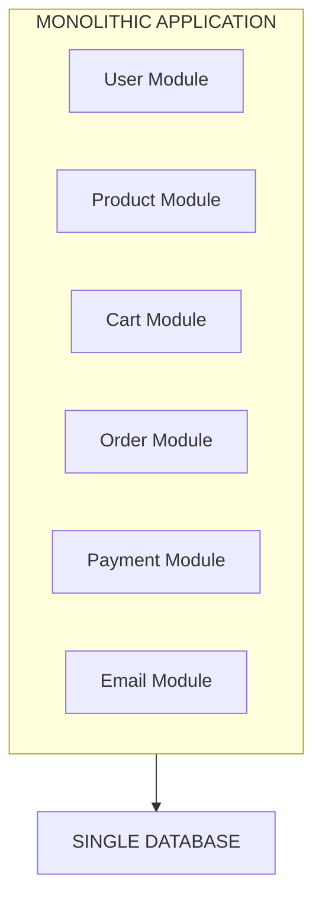
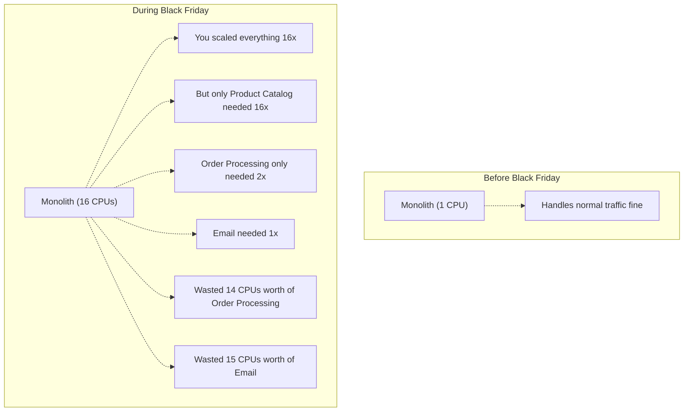
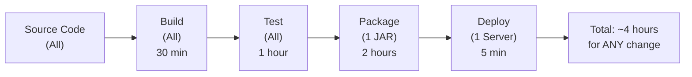
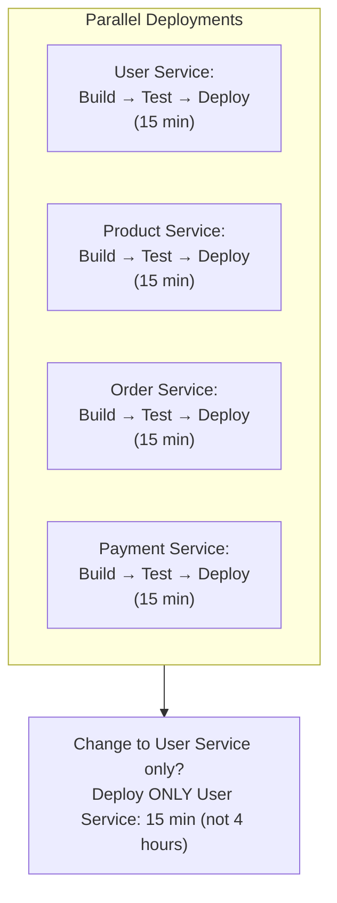
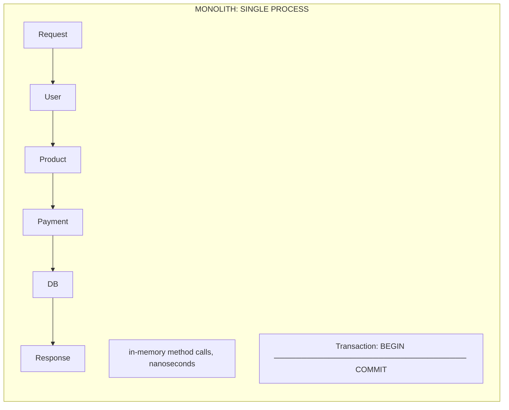
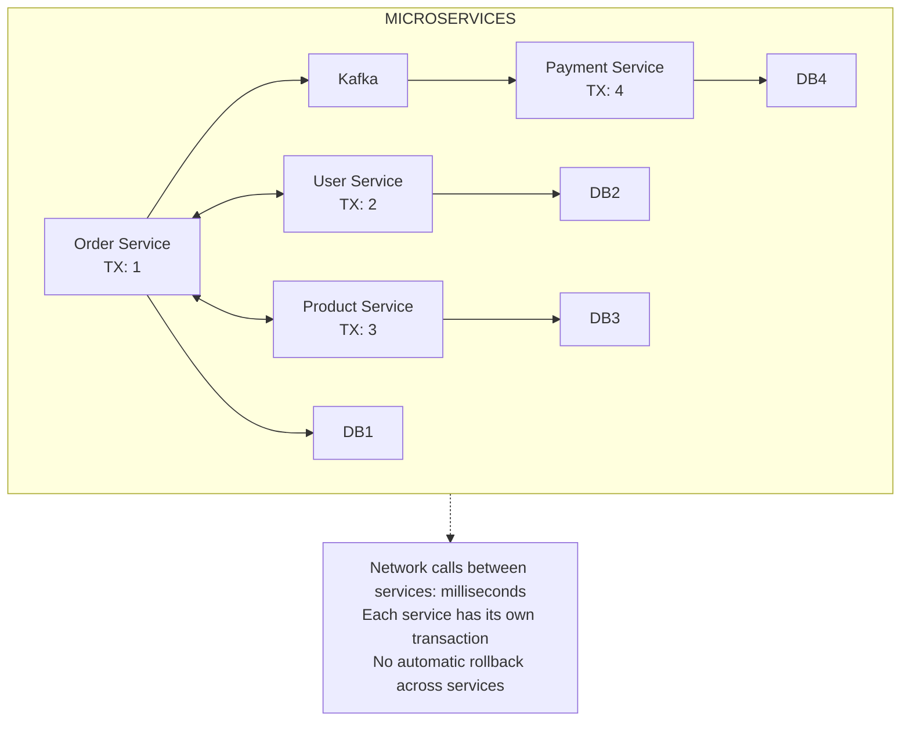
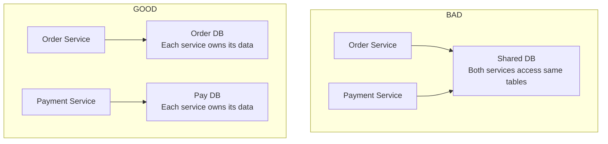
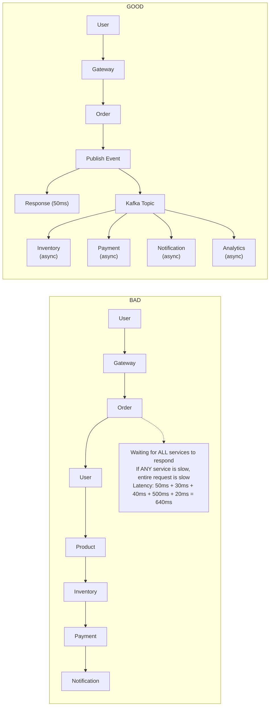
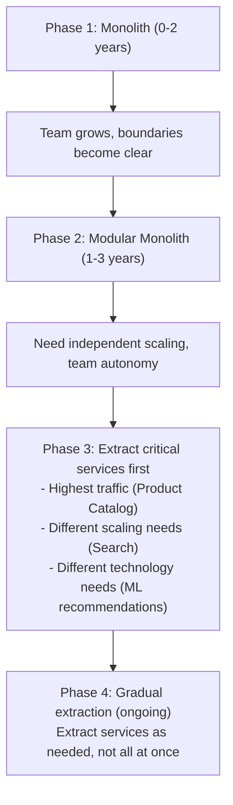

# Monolith vs Microservices

## 0️⃣ Prerequisites

Before diving into this topic, you need to understand:

- **Distributed Systems Basics**: How multiple computers communicate over a network (covered in Phase 1, Topic 1)
- **Load Balancers**: How traffic is distributed across multiple server instances (Phase 2, Topic 6)
- **Database Fundamentals**: SQL vs NoSQL, replication, and basic scaling concepts (Phase 3)
- **Message Queues**: Asynchronous communication between services (Phase 6)

**Quick refresher**: A distributed system is a collection of independent computers that appear to users as a single coherent system. When you break an application into multiple services, you're creating a distributed system with all its inherent challenges.

---

## 1️⃣ What Problem Does This Exist to Solve?

### The Specific Pain Point

Imagine you're building a simple e-commerce application. You start with everything in one codebase:

- User authentication
- Product catalog
- Shopping cart
- Order processing
- Payment handling
- Email notifications
- Inventory management

This is a **monolith**, a single deployable unit containing all your application's functionality.

### What Systems Looked Like Before Microservices

In the early days of web development (and still today for many applications), everything lived together:



<details>
<summary>ASCII diagram (reference)</summary>

```text
┌─────────────────────────────────────────────────────────────┐
│                     MONOLITHIC APPLICATION                  │
├─────────────────────────────────────────────────────────────┤
│  ┌─────────────┐ ┌─────────────┐ ┌─────────────┐           │
│  │    User     │ │   Product   │ │    Cart     │           │
│  │   Module    │ │   Module    │ │   Module    │           │
│  └─────────────┘ └─────────────┘ └─────────────┘           │
│  ┌─────────────┐ ┌─────────────┐ ┌─────────────┐           │
│  │   Order     │ │   Payment   │ │   Email     │           │
│  │   Module    │ │   Module    │ │   Module    │           │
│  └─────────────┘ └─────────────┘ └─────────────┘           │
├─────────────────────────────────────────────────────────────┤
│                    SINGLE DATABASE                          │
└─────────────────────────────────────────────────────────────┘
```
</details>

This approach worked fine until companies started experiencing these problems:

### What Breaks, Fails, or Becomes Painful

**Problem 1: Scaling Bottlenecks**

Your product catalog gets 10x more traffic than your order processing. With a monolith, you must scale the entire application, even though only one module needs more resources.



<details>
<summary>ASCII diagram (reference)</summary>

```text
Before Black Friday:
┌────────────────────┐
│   Monolith (1 CPU) │  ← Handles normal traffic fine
└────────────────────┘

During Black Friday:
┌────────────────────┐
│  Monolith (16 CPUs)│  ← You scaled everything 16x
└────────────────────┘
                      ← But only Product Catalog needed 16x
                      ← Order Processing only needed 2x
                      ← Email needed 1x
                      ← Wasted 14 CPUs worth of Order Processing
                      ← Wasted 15 CPUs worth of Email
```
</details>

**Problem 2: Deployment Coupling**

You fix a typo in the email template. To deploy this one-line change, you must:

1. Stop the entire application
2. Deploy the new version
3. Restart everything
4. Risk breaking product catalog, orders, payments, all because of an email typo

At scale, this becomes terrifying. Netflix once had a 16-hour deployment window because one small change required redeploying their entire monolith.

**Problem 3: Technology Lock-in**

Your monolith is written in Java 8. You want to use a new machine learning library that only works with Python. In a monolith, you're stuck. You'd have to rewrite significant portions of the application.

**Problem 4: Team Bottlenecks**

With 200 engineers working on one codebase:

- Merge conflicts become daily battles
- One team's changes break another team's features
- Everyone waits for everyone else
- Coordination overhead grows exponentially

Amazon discovered that as their monolith grew, the time to deploy a single feature went from days to weeks to months.

### Real Examples of the Problem

**Amazon (2002)**: Their retail website was a massive C++ monolith. A single deployment took hours. Engineers spent more time coordinating than coding. CEO Jeff Bezos mandated that all teams must communicate only through service interfaces, the birth of Amazon's service-oriented architecture.

**Netflix (2008)**: A database corruption in their monolith brought down the entire streaming service for 3 days. They couldn't isolate the problem because everything was interconnected.

**Twitter (2012)**: The "Fail Whale" became famous because Twitter's Ruby on Rails monolith couldn't handle traffic spikes. A single slow database query could cascade and crash the entire site.

---

## 2️⃣ Intuition and Mental Model

### The Restaurant Analogy

Think of a **monolith** as a small family restaurant where one person does everything:

- Takes orders
- Cooks the food
- Serves the tables
- Washes dishes
- Handles payments

This works great when you have 5 customers. The cook knows exactly what's happening everywhere. Communication is instant (it's all in one brain). Changes are easy (one person decides and executes).

But what happens when you have 500 customers?

- One person can't scale
- If the cook gets sick, everything stops
- You can't hire a specialist chef because they'd need to also take orders and wash dishes
- Upgrading the stove means closing the entire restaurant

Now imagine **microservices** as a large hotel restaurant:

- Host/hostess handles seating (Gateway Service)
- Waiters take orders (Order Service)
- Different chefs specialize in different cuisines (Product Services)
- Dishwashers handle cleanup (Background Workers)
- Cashiers handle payments (Payment Service)
- A manager coordinates everything (Orchestration)

Each person is independent but communicates through clear protocols (tickets, verbal calls, etc.). If the dessert chef is sick, the main course still goes out. You can hire more waiters during busy hours without hiring more chefs. You can upgrade the grill without touching the salad station.

### The Key Mental Model

**Monolith**: One brain, one body, everything connected.

**Microservices**: Many specialists, each with their own brain, communicating through messages.

This analogy will help us understand why microservices introduce complexity (communication overhead) but enable scale (independent specialists).

---

## 3️⃣ How It Works Internally

### Monolith Architecture Deep Dive

A monolith is a single deployable artifact (JAR, WAR, or executable) that contains all application functionality.

**Internal Structure:**

```
my-ecommerce-app/
├── src/main/java/com/company/
│   ├── user/
│   │   ├── UserController.java
│   │   ├── UserService.java
│   │   └── UserRepository.java
│   ├── product/
│   │   ├── ProductController.java
│   │   ├── ProductService.java
│   │   └── ProductRepository.java
│   ├── order/
│   │   ├── OrderController.java
│   │   ├── OrderService.java
│   │   └── OrderRepository.java
│   └── payment/
│       ├── PaymentController.java
│       ├── PaymentService.java
│       └── PaymentRepository.java
├── src/main/resources/
│   └── application.yml
└── pom.xml                    ← One build file for everything
```

**How Modules Communicate:**

In a monolith, modules communicate through direct method calls within the same JVM:

```java
// OrderService.java
@Service
public class OrderService {
    
    @Autowired
    private ProductService productService;  // Direct reference
    
    @Autowired
    private PaymentService paymentService;  // Direct reference
    
    @Autowired
    private UserService userService;        // Direct reference
    
    public Order createOrder(Long userId, List<Long> productIds) {
        // All calls happen in the same JVM, same memory space
        User user = userService.getUser(userId);           // ~1 nanosecond
        List<Product> products = productService.getProducts(productIds);  // ~1 nanosecond
        
        Order order = new Order(user, products);
        
        paymentService.processPayment(order);              // ~1 nanosecond
        
        return orderRepository.save(order);
    }
}
```

**Deployment Flow:**



### Microservices Architecture Deep Dive

Microservices decompose the application into independently deployable services, each running in its own process.

**Internal Structure:**

```
e-commerce-platform/
├── user-service/
│   ├── src/main/java/com/company/user/
│   │   ├── UserController.java
│   │   ├── UserService.java
│   │   └── UserRepository.java
│   ├── src/main/resources/application.yml
│   ├── Dockerfile
│   └── pom.xml                    ← Own build file
│
├── product-service/
│   ├── src/main/java/com/company/product/
│   │   ├── ProductController.java
│   │   ├── ProductService.java
│   │   └── ProductRepository.java
│   ├── src/main/resources/application.yml
│   ├── Dockerfile
│   └── pom.xml                    ← Own build file
│
├── order-service/
│   ├── src/main/java/com/company/order/
│   │   ├── OrderController.java
│   │   ├── OrderService.java
│   │   └── OrderRepository.java
│   ├── src/main/resources/application.yml
│   ├── Dockerfile
│   └── pom.xml                    ← Own build file
│
└── payment-service/
    ├── src/main/java/com/company/payment/
    │   ├── PaymentController.java
    │   ├── PaymentService.java
    │   └── PaymentRepository.java
    ├── src/main/resources/application.yml
    ├── Dockerfile
    └── pom.xml                    ← Own build file
```

**How Services Communicate:**

Services communicate over the network using HTTP/REST, gRPC, or message queues:

```java
// OrderService.java (in order-service)
@Service
public class OrderService {
    
    @Autowired
    private RestTemplate restTemplate;  // HTTP client
    
    @Autowired
    private KafkaTemplate<String, OrderEvent> kafkaTemplate;  // Message queue
    
    public Order createOrder(Long userId, List<Long> productIds) {
        // Network call to User Service (~1-10 milliseconds)
        User user = restTemplate.getForObject(
            "http://user-service/users/" + userId, 
            User.class
        );
        
        // Network call to Product Service (~1-10 milliseconds)
        List<Product> products = restTemplate.postForObject(
            "http://product-service/products/batch",
            productIds,
            List.class
        );
        
        Order order = new Order(user, products);
        order = orderRepository.save(order);
        
        // Async message to Payment Service
        kafkaTemplate.send("payment-requests", new PaymentEvent(order));
        
        return order;
    }
}
```

**Notice the difference**: Method calls that took nanoseconds in a monolith now take milliseconds over the network. This is 1,000,000x slower. This is the fundamental trade-off of microservices.

**Deployment Flow:**



### The Modular Monolith: A Middle Ground

Before we move on, let's understand a third option that many companies are now choosing:

**Modular Monolith**: A single deployable unit, but with strict module boundaries enforced at compile time.

```
my-ecommerce-app/
├── user-module/
│   ├── api/           ← Public interfaces only
│   │   └── UserApi.java
│   └── internal/      ← Implementation details
│       ├── UserService.java
│       └── UserRepository.java
│
├── product-module/
│   ├── api/
│   │   └── ProductApi.java
│   └── internal/
│       ├── ProductService.java
│       └── ProductRepository.java
│
├── order-module/
│   ├── api/
│   │   └── OrderApi.java
│   └── internal/
│       ├── OrderService.java
│       └── OrderRepository.java
│
└── main-app/
    └── Application.java   ← Composes all modules
```

The key rule: Modules can only depend on each other's `api` packages, never on `internal` packages. This is enforced using tools like ArchUnit or Java's module system (JPMS).

```java
// OrderService.java
@Service
public class OrderService {
    
    @Autowired
    private UserApi userApi;        // Interface, not implementation
    
    @Autowired
    private ProductApi productApi;  // Interface, not implementation
    
    // If you try to import UserService directly, the build fails
}
```

**Benefits of Modular Monolith:**

- Same-process performance (nanosecond calls)
- Clear boundaries (can extract to microservices later)
- Simpler deployment (one artifact)
- Easier debugging (one process)
- No network failures between modules

---

## 4️⃣ Simulation: Step-by-Step Walkthrough

Let's trace a single request through both architectures to understand the real differences.

### Scenario: User Places an Order

**Request**: User ID 123 wants to order Product IDs [456, 789]

### Monolith Execution

```
Timeline (in nanoseconds):

T=0ns     Request arrives at OrderController
          │
T=100ns   OrderController calls orderService.createOrder(123, [456, 789])
          │
T=200ns   OrderService calls userService.getUser(123)
          │
T=300ns   UserService queries database: SELECT * FROM users WHERE id=123
          │
T=5ms     Database returns User object (network I/O to DB)
          │
T=5.001ms OrderService calls productService.getProducts([456, 789])
          │
T=5.002ms ProductService queries database: SELECT * FROM products WHERE id IN (456, 789)
          │
T=10ms    Database returns Product list
          │
T=10.001ms OrderService creates Order object in memory
          │
T=10.002ms OrderService calls paymentService.processPayment(order)
          │
T=10.003ms PaymentService calls external payment gateway (Stripe API)
          │
T=510ms   Stripe returns success (external API call)
          │
T=510.001ms OrderService saves order to database
          │
T=515ms   Database confirms write
          │
T=515.001ms Response sent to user

TOTAL: ~515ms
```

**Key observations:**

- Internal method calls are essentially free (nanoseconds)
- All time is spent on database I/O and external API calls
- Single transaction spans entire operation
- If anything fails, everything rolls back automatically

### Microservices Execution

```
Timeline (in milliseconds):

T=0ms     Request arrives at API Gateway
          │
T=1ms     Gateway routes to Order Service
          │
T=2ms     Order Service receives request
          │
T=3ms     Order Service makes HTTP call to User Service
          │         ┌─────────────────────────────────┐
          │         │ Network: DNS lookup, TCP handshake, │
          │         │ TLS negotiation, HTTP request/response │
          │         │ Latency: 5-10ms                       │
          │         └─────────────────────────────────┘
          │
T=8ms     User Service receives request
          │
T=9ms     User Service queries its database
          │
T=14ms    User Service returns response over network
          │
T=19ms    Order Service receives User data
          │
T=20ms    Order Service makes HTTP call to Product Service
          │         ┌─────────────────────────────────┐
          │         │ Another network round trip: 5-10ms   │
          │         └─────────────────────────────────┘
          │
T=25ms    Product Service receives request
          │
T=26ms    Product Service queries its database
          │
T=31ms    Product Service returns response
          │
T=36ms    Order Service receives Product data
          │
T=37ms    Order Service publishes PaymentRequested event to Kafka
          │
T=38ms    Order Service saves order with status=PENDING
          │
T=43ms    Order Service returns response to user (order created, payment pending)
          │
          │    ═══════════════════════════════════════════
          │    ASYNCHRONOUS PROCESSING CONTINUES
          │    ═══════════════════════════════════════════
          │
T=50ms    Payment Service consumes PaymentRequested event from Kafka
          │
T=51ms    Payment Service calls Stripe API
          │
T=551ms   Stripe returns success
          │
T=552ms   Payment Service publishes PaymentCompleted event
          │
T=560ms   Order Service consumes PaymentCompleted event
          │
T=561ms   Order Service updates order status to COMPLETED

USER RESPONSE TIME: ~43ms (faster! but order not complete)
TOTAL PROCESSING TIME: ~561ms (slower due to network overhead)
```

**Key observations:**

- User gets a response faster (async processing)
- But the order isn't actually complete when user gets response
- Network overhead adds ~30-40ms compared to monolith
- No single transaction, each service has its own
- If Payment Service fails, Order Service doesn't automatically know
- Need explicit retry logic, dead letter queues, saga patterns

### Visual Comparison





<details>
<summary>ASCII diagram (reference)</summary>

```text
MONOLITH:
┌─────────────────────────────────────────────────────────────────┐
│                         SINGLE PROCESS                           │
│  Request → User → Product → Payment → DB → Response             │
│            ↓        ↓          ↓                                 │
│         [in-memory method calls, nanoseconds]                   │
│                                                                  │
│  Transaction: BEGIN ─────────────────────────────────── COMMIT  │
└─────────────────────────────────────────────────────────────────┘

MICROSERVICES:
┌──────────┐    ┌──────────┐    ┌──────────┐    ┌──────────┐
│  Order   │───▶│   User   │    │ Product  │    │ Payment  │
│ Service  │◀───│ Service  │    │ Service  │    │ Service  │
│          │───────────────────▶│          │    │          │
│          │◀───────────────────│          │    │          │
│          │─────────────────────────────────────▶ Kafka ──▶│
│          │                                                │
│  TX: 1   │    │  TX: 2   │    │  TX: 3   │    │  TX: 4   │
└──────────┘    └──────────┘    └──────────┘    └──────────┘
     ▲               │               │               │
     │               ▼               ▼               ▼
   ┌───┐          ┌───┐          ┌───┐          ┌───┐
   │DB1│          │DB2│          │DB3│          │DB4│
   └───┘          └───┘          └───┘          └───┘

[Network calls between services: milliseconds]
[Each service has its own transaction]
[No automatic rollback across services]
```
</details>

---

## 5️⃣ How Engineers Actually Use This in Production

### Real-World Implementations

**Amazon (Pioneer of Microservices)**

Amazon runs thousands of microservices. Their famous "two-pizza team" rule came from microservices: each service should be owned by a team small enough to be fed by two pizzas (6-8 people).

Key practices:
- Each service has a single owner team
- Services communicate only through APIs (no shared databases)
- Teams can choose their own technology stack
- Deployment happens 136,000 times per day (2022 data)

**Netflix (Microservices at Scale)**

Netflix runs 700+ microservices handling 200+ billion requests daily.

Their architecture:
- Zuul (API Gateway) handles all incoming traffic
- Eureka (Service Discovery) tracks all service instances
- Hystrix (Circuit Breaker) prevents cascade failures
- Chaos Monkey randomly kills services to test resilience

Engineering blog: https://netflixtechblog.com/

**Uber (Hybrid Approach)**

Uber started with a Python monolith, migrated to microservices, then realized they had too many (2,200+ services). They're now consolidating into "macro-services", larger services that encompass related functionality.

Lesson: You can have too many microservices. The overhead of managing 2,200 services was crushing their engineering velocity.

**Shopify (Modular Monolith)**

Shopify handles Black Friday traffic (millions of requests per second) with a modular monolith. They use strict code boundaries and can extract services when needed, but prefer the simplicity of a single deployment.

Quote from Shopify engineering: "We've found that a well-structured monolith can scale further than most people think."

### Real Workflows and Tooling

**Service Creation at a Typical Company:**

1. **Cookiecutter/Yeoman Template**: Generate new service from template
   ```bash
   cookiecutter https://github.com/company/service-template
   # Generates: Dockerfile, CI/CD config, health checks, metrics, logging
   ```

2. **Service Registry**: Register service in Consul/Eureka/Kubernetes
   ```yaml
   # kubernetes deployment.yaml
   apiVersion: apps/v1
   kind: Deployment
   metadata:
     name: order-service
   spec:
     replicas: 3
     selector:
       matchLabels:
         app: order-service
   ```

3. **CI/CD Pipeline**: Automated build, test, deploy
   ```yaml
   # .github/workflows/deploy.yml
   on:
     push:
       branches: [main]
   jobs:
     deploy:
       runs-on: ubuntu-latest
       steps:
         - uses: actions/checkout@v2
         - run: ./gradlew build
         - run: docker build -t order-service .
         - run: kubectl apply -f k8s/
   ```

### What is Automated vs Manually Configured

**Automated:**
- Service deployment (CI/CD)
- Scaling (Kubernetes HPA)
- Health checks and restarts
- Log aggregation
- Metrics collection
- Alert triggering

**Manually Configured:**
- Service boundaries (architecture decisions)
- API contracts
- Database schema
- Retry policies
- Circuit breaker thresholds
- SLA definitions

### Production War Stories

**Story 1: The Cascade Failure (Netflix, 2012)**

A single slow service caused all downstream services to exhaust their thread pools waiting for responses. The entire system became unresponsive.

Solution: Netflix invented Hystrix (circuit breaker pattern). When a service is slow, stop calling it and return a fallback response.

**Story 2: The Database Shared Secret (Uber, 2016)**

Two teams accidentally shared a database table. One team changed the schema, breaking the other team's service. Neither team knew they were coupled.

Solution: Strict database-per-service rule. No exceptions.

**Story 3: The Deployment Avalanche (Airbnb, 2018)**

Deploying one service triggered cascading deployments of dependent services. A small change took 6 hours to fully deploy.

Solution: Consumer-driven contract testing. Services only redeploy when their contracts actually change.

---

## 6️⃣ How to Implement: Code Examples

### Simple Monolith in Spring Boot

**pom.xml:**

```xml
<?xml version="1.0" encoding="UTF-8"?>
<project xmlns="http://maven.apache.org/POM/4.0.0"
         xmlns:xsi="http://www.w3.org/2001/XMLSchema-instance"
         xsi:schemaLocation="http://maven.apache.org/POM/4.0.0 
         http://maven.apache.org/xsd/maven-4.0.0.xsd">
    <modelVersion>4.0.0</modelVersion>
    
    <parent>
        <groupId>org.springframework.boot</groupId>
        <artifactId>spring-boot-starter-parent</artifactId>
        <version>3.2.0</version>
    </parent>
    
    <groupId>com.company</groupId>
    <artifactId>ecommerce-monolith</artifactId>
    <version>1.0.0</version>
    
    <properties>
        <java.version>17</java.version>
    </properties>
    
    <dependencies>
        <!-- Web -->
        <dependency>
            <groupId>org.springframework.boot</groupId>
            <artifactId>spring-boot-starter-web</artifactId>
        </dependency>
        
        <!-- Database -->
        <dependency>
            <groupId>org.springframework.boot</groupId>
            <artifactId>spring-boot-starter-data-jpa</artifactId>
        </dependency>
        <dependency>
            <groupId>org.postgresql</groupId>
            <artifactId>postgresql</artifactId>
        </dependency>
        
        <!-- Validation -->
        <dependency>
            <groupId>org.springframework.boot</groupId>
            <artifactId>spring-boot-starter-validation</artifactId>
        </dependency>
    </dependencies>
</project>
```

**User Module:**

```java
// User.java - Entity
package com.company.user;

import jakarta.persistence.*;

@Entity
@Table(name = "users")
public class User {
    
    @Id
    @GeneratedValue(strategy = GenerationType.IDENTITY)
    private Long id;
    
    @Column(nullable = false)
    private String name;
    
    @Column(nullable = false, unique = true)
    private String email;
    
    // In a monolith, we can have direct relationships
    // This creates tight coupling but enables powerful queries
    @OneToMany(mappedBy = "user", cascade = CascadeType.ALL)
    private List<Order> orders;
    
    // Constructors, getters, setters
    public User() {}
    
    public User(String name, String email) {
        this.name = name;
        this.email = email;
    }
    
    public Long getId() { return id; }
    public void setId(Long id) { this.id = id; }
    public String getName() { return name; }
    public void setName(String name) { this.name = name; }
    public String getEmail() { return email; }
    public void setEmail(String email) { this.email = email; }
    public List<Order> getOrders() { return orders; }
    public void setOrders(List<Order> orders) { this.orders = orders; }
}
```

```java
// UserRepository.java
package com.company.user;

import org.springframework.data.jpa.repository.JpaRepository;
import java.util.Optional;

public interface UserRepository extends JpaRepository<User, Long> {
    Optional<User> findByEmail(String email);
}
```

```java
// UserService.java
package com.company.user;

import org.springframework.beans.factory.annotation.Autowired;
import org.springframework.stereotype.Service;
import org.springframework.transaction.annotation.Transactional;

@Service
public class UserService {
    
    @Autowired
    private UserRepository userRepository;
    
    @Transactional(readOnly = true)
    public User getUser(Long id) {
        return userRepository.findById(id)
            .orElseThrow(() -> new UserNotFoundException("User not found: " + id));
    }
    
    @Transactional
    public User createUser(String name, String email) {
        // Direct validation, no network call needed
        if (userRepository.findByEmail(email).isPresent()) {
            throw new DuplicateEmailException("Email already exists: " + email);
        }
        return userRepository.save(new User(name, email));
    }
}
```

**Order Module (showing tight coupling in monolith):**

```java
// OrderService.java
package com.company.order;

import com.company.user.User;
import com.company.user.UserService;
import com.company.product.Product;
import com.company.product.ProductService;
import com.company.payment.PaymentService;
import com.company.payment.PaymentResult;
import org.springframework.beans.factory.annotation.Autowired;
import org.springframework.stereotype.Service;
import org.springframework.transaction.annotation.Transactional;

import java.util.List;

@Service
public class OrderService {
    
    // Direct injection of other services - tight coupling
    @Autowired
    private UserService userService;
    
    @Autowired
    private ProductService productService;
    
    @Autowired
    private PaymentService paymentService;
    
    @Autowired
    private OrderRepository orderRepository;
    
    // Single transaction spans ALL operations
    // If payment fails, user lookup and product reservation roll back too
    @Transactional
    public Order createOrder(Long userId, List<Long> productIds) {
        // Step 1: Get user (in-memory call, ~1 nanosecond)
        User user = userService.getUser(userId);
        
        // Step 2: Get and reserve products (in-memory call, ~1 nanosecond)
        List<Product> products = productService.reserveProducts(productIds);
        
        // Step 3: Calculate total
        double total = products.stream()
            .mapToDouble(Product::getPrice)
            .sum();
        
        // Step 4: Create order
        Order order = new Order(user, products, total);
        order = orderRepository.save(order);
        
        // Step 5: Process payment (external API call, ~500ms)
        // If this fails, the ENTIRE transaction rolls back
        PaymentResult result = paymentService.processPayment(
            user.getId(), 
            order.getId(), 
            total
        );
        
        if (!result.isSuccessful()) {
            // This exception will roll back everything
            throw new PaymentFailedException(result.getErrorMessage());
        }
        
        order.setStatus(OrderStatus.PAID);
        return orderRepository.save(order);
    }
}
```

### Simple Microservices in Spring Boot

Now let's see the same functionality split into microservices:

**User Service (Standalone Application):**

```java
// UserServiceApplication.java
package com.company.userservice;

import org.springframework.boot.SpringApplication;
import org.springframework.boot.autoconfigure.SpringBootApplication;
import org.springframework.cloud.client.discovery.EnableDiscoveryClient;

@SpringBootApplication
@EnableDiscoveryClient  // Register with service discovery
public class UserServiceApplication {
    public static void main(String[] args) {
        SpringApplication.run(UserServiceApplication.class, args);
    }
}
```

```java
// UserController.java
package com.company.userservice;

import org.springframework.beans.factory.annotation.Autowired;
import org.springframework.http.ResponseEntity;
import org.springframework.web.bind.annotation.*;

@RestController
@RequestMapping("/users")
public class UserController {
    
    @Autowired
    private UserService userService;
    
    // Exposed as HTTP API for other services to call
    @GetMapping("/{id}")
    public ResponseEntity<UserDto> getUser(@PathVariable Long id) {
        User user = userService.getUser(id);
        return ResponseEntity.ok(toDto(user));
    }
    
    // Health check endpoint for load balancer
    @GetMapping("/health")
    public ResponseEntity<String> health() {
        return ResponseEntity.ok("OK");
    }
    
    private UserDto toDto(User user) {
        return new UserDto(user.getId(), user.getName(), user.getEmail());
    }
}
```

```java
// UserDto.java - Data Transfer Object for network communication
package com.company.userservice;

// DTOs are serialized to JSON for network transfer
// They decouple internal entities from external API
public record UserDto(Long id, String name, String email) {}
```

**Order Service (Calls Other Services Over Network):**

```java
// OrderServiceApplication.java
package com.company.orderservice;

import org.springframework.boot.SpringApplication;
import org.springframework.boot.autoconfigure.SpringBootApplication;
import org.springframework.cloud.client.discovery.EnableDiscoveryClient;
import org.springframework.cloud.openfeign.EnableFeignClients;

@SpringBootApplication
@EnableDiscoveryClient
@EnableFeignClients  // Enable declarative HTTP clients
public class OrderServiceApplication {
    public static void main(String[] args) {
        SpringApplication.run(OrderServiceApplication.class, args);
    }
}
```

```java
// UserServiceClient.java - Feign client for User Service
package com.company.orderservice.clients;

import org.springframework.cloud.openfeign.FeignClient;
import org.springframework.web.bind.annotation.GetMapping;
import org.springframework.web.bind.annotation.PathVariable;

// Declarative HTTP client - Feign generates the implementation
// "user-service" is the service name in service discovery
@FeignClient(name = "user-service", fallback = UserServiceFallback.class)
public interface UserServiceClient {
    
    @GetMapping("/users/{id}")
    UserDto getUser(@PathVariable("id") Long id);
}
```

```java
// UserServiceFallback.java - What to do when User Service is down
package com.company.orderservice.clients;

import org.springframework.stereotype.Component;

@Component
public class UserServiceFallback implements UserServiceClient {
    
    @Override
    public UserDto getUser(Long id) {
        // Return cached data or a default response
        // This prevents cascade failures
        return new UserDto(id, "Unknown User", "unknown@example.com");
    }
}
```

```java
// OrderService.java - Orchestrates calls to other services
package com.company.orderservice;

import com.company.orderservice.clients.UserServiceClient;
import com.company.orderservice.clients.ProductServiceClient;
import com.company.orderservice.events.OrderCreatedEvent;
import org.springframework.beans.factory.annotation.Autowired;
import org.springframework.kafka.core.KafkaTemplate;
import org.springframework.stereotype.Service;
import org.springframework.transaction.annotation.Transactional;

import java.util.List;

@Service
public class OrderService {
    
    @Autowired
    private UserServiceClient userServiceClient;  // HTTP client
    
    @Autowired
    private ProductServiceClient productServiceClient;  // HTTP client
    
    @Autowired
    private KafkaTemplate<String, OrderCreatedEvent> kafkaTemplate;
    
    @Autowired
    private OrderRepository orderRepository;
    
    // Transaction only covers THIS service's database
    // Other services have their own transactions
    @Transactional
    public Order createOrder(Long userId, List<Long> productIds) {
        // Step 1: Get user (NETWORK CALL - ~5-10ms)
        // This can fail due to network issues, timeouts, service down
        UserDto user;
        try {
            user = userServiceClient.getUser(userId);
        } catch (Exception e) {
            // Fallback kicks in, or we handle the error
            throw new ServiceUnavailableException("User service unavailable", e);
        }
        
        // Step 2: Get products (NETWORK CALL - ~5-10ms)
        List<ProductDto> products;
        try {
            products = productServiceClient.getProducts(productIds);
        } catch (Exception e) {
            throw new ServiceUnavailableException("Product service unavailable", e);
        }
        
        // Step 3: Calculate total
        double total = products.stream()
            .mapToDouble(ProductDto::price)
            .sum();
        
        // Step 4: Create order in OUR database only
        Order order = new Order(userId, productIds, total, OrderStatus.PENDING);
        order = orderRepository.save(order);
        
        // Step 5: Publish event for async processing
        // Payment service will pick this up
        // If Kafka is down, we need retry logic or outbox pattern
        OrderCreatedEvent event = new OrderCreatedEvent(
            order.getId(),
            userId,
            total
        );
        kafkaTemplate.send("order-created", event);
        
        // Return immediately - payment happens asynchronously
        // User sees "Order Pending" status
        return order;
    }
    
    // Called when payment service publishes PaymentCompleted event
    @Transactional
    public void handlePaymentCompleted(Long orderId) {
        Order order = orderRepository.findById(orderId)
            .orElseThrow(() -> new OrderNotFoundException(orderId));
        order.setStatus(OrderStatus.PAID);
        orderRepository.save(order);
    }
    
    // Called when payment service publishes PaymentFailed event
    @Transactional
    public void handlePaymentFailed(Long orderId, String reason) {
        Order order = orderRepository.findById(orderId)
            .orElseThrow(() -> new OrderNotFoundException(orderId));
        order.setStatus(OrderStatus.PAYMENT_FAILED);
        order.setFailureReason(reason);
        orderRepository.save(order);
        
        // Trigger compensating actions
        // e.g., release reserved inventory
        kafkaTemplate.send("order-cancelled", new OrderCancelledEvent(orderId));
    }
}
```

**application.yml for Order Service:**

```yaml
spring:
  application:
    name: order-service
  
  datasource:
    url: jdbc:postgresql://order-db:5432/orders
    username: ${DB_USERNAME}
    password: ${DB_PASSWORD}
  
  kafka:
    bootstrap-servers: kafka:9092
    producer:
      key-serializer: org.apache.kafka.common.serialization.StringSerializer
      value-serializer: org.springframework.kafka.support.serializer.JsonSerializer

eureka:
  client:
    service-url:
      defaultZone: http://eureka-server:8761/eureka/
  instance:
    prefer-ip-address: true

# Circuit breaker configuration
resilience4j:
  circuitbreaker:
    instances:
      user-service:
        sliding-window-size: 10
        failure-rate-threshold: 50
        wait-duration-in-open-state: 10s
```

**docker-compose.yml for Local Development:**

```yaml
version: '3.8'

services:
  # Service Discovery
  eureka-server:
    image: company/eureka-server:latest
    ports:
      - "8761:8761"
  
  # User Service
  user-service:
    build: ./user-service
    ports:
      - "8081:8080"
    environment:
      - SPRING_PROFILES_ACTIVE=docker
      - DB_HOST=user-db
    depends_on:
      - eureka-server
      - user-db
  
  user-db:
    image: postgres:15
    environment:
      - POSTGRES_DB=users
      - POSTGRES_USER=user
      - POSTGRES_PASSWORD=password
    volumes:
      - user-data:/var/lib/postgresql/data
  
  # Order Service
  order-service:
    build: ./order-service
    ports:
      - "8082:8080"
    environment:
      - SPRING_PROFILES_ACTIVE=docker
      - DB_HOST=order-db
    depends_on:
      - eureka-server
      - order-db
      - kafka
  
  order-db:
    image: postgres:15
    environment:
      - POSTGRES_DB=orders
      - POSTGRES_USER=order
      - POSTGRES_PASSWORD=password
    volumes:
      - order-data:/var/lib/postgresql/data
  
  # Message Broker
  kafka:
    image: confluentinc/cp-kafka:7.5.0
    ports:
      - "9092:9092"
    environment:
      - KAFKA_ZOOKEEPER_CONNECT=zookeeper:2181
      - KAFKA_ADVERTISED_LISTENERS=PLAINTEXT://kafka:9092
    depends_on:
      - zookeeper
  
  zookeeper:
    image: confluentinc/cp-zookeeper:7.5.0
    environment:
      - ZOOKEEPER_CLIENT_PORT=2181

volumes:
  user-data:
  order-data:
```

---

## 7️⃣ Tradeoffs, Pitfalls, and Common Mistakes

### Why Not Always Use Microservices?

**Tradeoff 1: Latency vs Modularity**

| Aspect | Monolith | Microservices |
|--------|----------|---------------|
| Method call | ~1 nanosecond | ~1-10 milliseconds (1,000,000x slower) |
| Failure modes | Process crash | Network timeout, service down, serialization error |
| Debugging | Single stack trace | Distributed tracing across services |

**Tradeoff 2: Consistency vs Availability**

Monolith: Single database transaction ensures consistency

```java
@Transactional
public void transferMoney(Long from, Long to, double amount) {
    accountRepository.debit(from, amount);   // If this fails...
    accountRepository.credit(to, amount);    // ...this doesn't happen
}  // Automatic rollback on any failure
```

Microservices: Eventual consistency, complex compensation logic

```java
public void transferMoney(Long from, Long to, double amount) {
    // Step 1: Debit from Account Service
    accountServiceClient.debit(from, amount);
    
    // Step 2: Credit to Account Service
    try {
        accountServiceClient.credit(to, amount);
    } catch (Exception e) {
        // MUST manually compensate!
        accountServiceClient.credit(from, amount);  // Refund
        throw e;
    }
}
// What if the refund also fails? Need saga pattern, dead letter queues, etc.
```

**Tradeoff 3: Team Autonomy vs System Complexity**

| Team Size | Recommended Architecture |
|-----------|-------------------------|
| 1-5 engineers | Monolith |
| 5-20 engineers | Modular monolith |
| 20-100 engineers | Microservices (5-15 services) |
| 100+ engineers | Microservices (many services) |

### What Breaks at Scale

**Problem 1: Service Explosion**

You start with 5 services. Three years later, you have 500. Each service needs:
- CI/CD pipeline
- Monitoring dashboards
- On-call rotation
- Documentation
- Security review

At 500 services, you need a team just to manage the infrastructure.

**Problem 2: Distributed Debugging**

User reports: "My order failed"

Monolith debugging:
```
grep "order-123" /var/log/app.log
# Find the stack trace, done
```

Microservices debugging:
```
# Which service failed?
# Check API Gateway logs
# Check Order Service logs
# Check User Service logs
# Check Product Service logs
# Check Payment Service logs
# Check Kafka consumer logs
# Correlate by trace ID across all services
# Hope someone didn't forget to propagate the trace ID
```

**Problem 3: Data Consistency Nightmares**

Order Service says: Order is PAID
Payment Service says: Payment is PENDING

Which one is correct? How did they get out of sync? How do you fix it?

### Common Misconfigurations

**Mistake 1: Shared Database**



<details>
<summary>ASCII diagram (reference)</summary>

```text
BAD:
┌──────────┐     ┌──────────┐
│  Order   │     │ Payment  │
│ Service  │     │ Service  │
└────┬─────┘     └────┬─────┘
     │                │
     └───────┬────────┘
             ▼
      ┌────────────┐
      │  Shared DB │  ← Both services access same tables
      └────────────┘

GOOD:
┌──────────┐     ┌──────────┐
│  Order   │     │ Payment  │
│ Service  │     │ Service  │
└────┬─────┘     └────┬─────┘
     │                │
     ▼                ▼
┌────────┐      ┌────────┐
│Order DB│      │Pay DB  │  ← Each service owns its data
└────────┘      └────────┘
```
</details>

**Mistake 2: Synchronous Chain Calls**



<details>
<summary>ASCII diagram (reference)</summary>

```text
BAD:
User → Gateway → Order → User → Product → Inventory → Payment → Notification
                  ↑___________________________________|
                  Waiting for ALL services to respond
                  If ANY service is slow, entire request is slow
                  Latency: 50ms + 30ms + 40ms + 500ms + 20ms = 640ms

GOOD:
User → Gateway → Order → [Publish Event] → Response (50ms)
                              ↓
                         Kafka Topic
                              ↓
        ┌──────────┬──────────┬──────────┐
        ▼          ▼          ▼          ▼
    Inventory  Payment  Notification  Analytics
    (async)    (async)    (async)      (async)
```
</details>

**Mistake 3: No Circuit Breakers**

```java
// BAD: If User Service is down, Order Service keeps trying and exhausts threads
public Order createOrder(Long userId, List<Long> productIds) {
    UserDto user = userServiceClient.getUser(userId);  // Hangs for 30 seconds
    // Thread is blocked, can't serve other requests
    // 100 requests = 100 blocked threads = server crash
}

// GOOD: Circuit breaker stops calling failing service
@CircuitBreaker(name = "user-service", fallbackMethod = "getUserFallback")
public Order createOrder(Long userId, List<Long> productIds) {
    UserDto user = userServiceClient.getUser(userId);
    // ...
}

public Order getUserFallback(Long userId, Exception e) {
    // Return cached user or gracefully degrade
    return cachedUserService.getUser(userId);
}
```

### Performance Gotchas

**Gotcha 1: N+1 Service Calls**

```java
// BAD: 1 call to get orders + N calls to get users
public List<OrderWithUser> getOrdersWithUsers() {
    List<Order> orders = orderRepository.findAll();  // 1 call
    
    return orders.stream()
        .map(order -> {
            // N network calls!
            UserDto user = userServiceClient.getUser(order.getUserId());
            return new OrderWithUser(order, user);
        })
        .toList();
}
// 100 orders = 101 network calls = 1000ms latency

// GOOD: Batch the user lookups
public List<OrderWithUser> getOrdersWithUsers() {
    List<Order> orders = orderRepository.findAll();
    
    List<Long> userIds = orders.stream()
        .map(Order::getUserId)
        .distinct()
        .toList();
    
    // 1 batch call instead of N calls
    Map<Long, UserDto> users = userServiceClient.getUsersByIds(userIds);
    
    return orders.stream()
        .map(order -> new OrderWithUser(order, users.get(order.getUserId())))
        .toList();
}
// 100 orders = 2 network calls = 20ms latency
```

**Gotcha 2: Missing Timeouts**

```java
// BAD: No timeout, request can hang forever
RestTemplate restTemplate = new RestTemplate();

// GOOD: Always set timeouts
@Bean
public RestTemplate restTemplate() {
    HttpComponentsClientHttpRequestFactory factory = 
        new HttpComponentsClientHttpRequestFactory();
    factory.setConnectTimeout(1000);   // 1 second to connect
    factory.setReadTimeout(3000);      // 3 seconds to read response
    return new RestTemplate(factory);
}
```

### Security Considerations

**Service-to-Service Authentication:**

```java
// Every service call should be authenticated
@FeignClient(name = "user-service", configuration = FeignAuthConfig.class)
public interface UserServiceClient {
    @GetMapping("/users/{id}")
    UserDto getUser(@PathVariable("id") Long id);
}

@Configuration
public class FeignAuthConfig {
    @Bean
    public RequestInterceptor requestInterceptor() {
        return template -> {
            // Add service identity token
            template.header("X-Service-Name", "order-service");
            template.header("Authorization", "Bearer " + getServiceToken());
        };
    }
}
```

**Network Policies:**

```yaml
# Kubernetes NetworkPolicy - Order Service can only talk to specific services
apiVersion: networking.k8s.io/v1
kind: NetworkPolicy
metadata:
  name: order-service-policy
spec:
  podSelector:
    matchLabels:
      app: order-service
  policyTypes:
    - Egress
  egress:
    - to:
        - podSelector:
            matchLabels:
              app: user-service
        - podSelector:
            matchLabels:
              app: product-service
        - podSelector:
            matchLabels:
              app: kafka
```

---

## 8️⃣ When NOT to Use Microservices

### Anti-Patterns and Misuse Cases

**Anti-Pattern 1: Microservices for a Startup**

You have 3 engineers and 100 users. You don't need:
- Service discovery
- Distributed tracing
- Multiple databases
- Kubernetes cluster

You need to ship features fast. A monolith lets you do that.

**Anti-Pattern 2: Microservices Without DevOps Maturity**

If you don't have:
- Automated CI/CD
- Container orchestration (Kubernetes)
- Centralized logging
- Distributed tracing
- On-call rotation

Then microservices will be painful. You'll spend more time debugging infrastructure than building features.

**Anti-Pattern 3: Nano-Services**

Breaking down too far:

```
BAD:
- UserNameService
- UserEmailService
- UserPasswordService
- UserAddressService
- UserPreferencesService

GOOD:
- UserService (handles all user-related operations)
```

### Situations Where Microservices Are Overkill

| Situation | Better Alternative |
|-----------|-------------------|
| < 10 engineers | Monolith |
| Prototype/MVP | Monolith |
| Tight deadline | Monolith |
| Low traffic (< 1000 req/sec) | Monolith |
| Strong consistency required | Monolith |
| Team lacks distributed systems experience | Modular monolith |

### Signs You've Chosen the Wrong Architecture

**Signs you should have stayed with monolith:**
- Deploying one service requires deploying others
- Most bugs are "service X didn't call service Y correctly"
- Engineers spend more time on infrastructure than features
- Simple features take weeks because they span multiple services

**Signs you need to move to microservices:**
- Deployment takes hours and requires coordination across teams
- One team's changes frequently break another team's features
- You can't scale one part of the system without scaling everything
- Different parts of the system need different technology stacks

---

## 9️⃣ Comparison with Alternatives

### Monolith vs Microservices vs Modular Monolith

| Aspect | Monolith | Modular Monolith | Microservices |
|--------|----------|------------------|---------------|
| Deployment | Single artifact | Single artifact | Multiple artifacts |
| Scaling | All or nothing | All or nothing | Per-service |
| Communication | In-process | In-process | Network |
| Transaction | Single DB | Single DB | Distributed |
| Team autonomy | Low | Medium | High |
| Complexity | Low | Medium | High |
| Latency | Lowest | Lowest | Higher |
| Fault isolation | None | Partial | Full |

### When to Choose Each

**Choose Monolith when:**
- Starting a new project
- Small team (< 10 engineers)
- Unclear domain boundaries
- Need strong consistency
- Tight deadlines

**Choose Modular Monolith when:**
- Growing team (10-50 engineers)
- Clear domain boundaries emerging
- Want to prepare for future extraction
- Need monolith performance with better organization

**Choose Microservices when:**
- Large team (50+ engineers)
- Well-understood domain boundaries
- Different scaling requirements per component
- Need technology flexibility
- Have mature DevOps practices

### Migration Path



<details>
<summary>ASCII diagram (reference)</summary>

```text
Phase 1: Monolith (0-2 years)
    │
    ▼ Team grows, boundaries become clear
    │
Phase 2: Modular Monolith (1-3 years)
    │
    ▼ Need independent scaling, team autonomy
    │
Phase 3: Extract critical services first
    │    - Highest traffic (Product Catalog)
    │    - Different scaling needs (Search)
    │    - Different technology needs (ML recommendations)
    │
    ▼
Phase 4: Gradual extraction (ongoing)
         Extract services as needed, not all at once
```
</details>

### Real-World Examples

**Shopify**: Stayed with modular monolith, handles millions of requests per second

**Amazon**: Started monolith, moved to services when team grew to hundreds

**Segment**: Moved to microservices, then back to monolith when complexity became unmanageable

**Netflix**: Full microservices, but they have 2000+ engineers and custom tooling

---

## 🔟 Interview Follow-Up Questions with Answers

### L4 (Junior/Mid) Level Questions

**Q1: What is the main difference between a monolith and microservices?**

**A:** A monolith is a single deployable unit where all functionality runs in one process. Microservices split the application into multiple independently deployable services, each running in its own process and communicating over the network.

The key differences are:
- Deployment: Monolith deploys everything together; microservices deploy independently
- Scaling: Monolith scales as a whole; microservices scale per-service
- Communication: Monolith uses in-process method calls; microservices use network calls
- Data: Monolith typically has one database; microservices have database-per-service

**Q2: What are the main challenges of microservices?**

**A:** The main challenges are:

1. **Network reliability**: Network calls can fail, timeout, or be slow. You need retries, circuit breakers, and fallbacks.

2. **Data consistency**: Without a single database transaction, you need patterns like Saga for distributed transactions.

3. **Debugging**: A single request may span multiple services. You need distributed tracing to follow the request.

4. **Operational complexity**: Each service needs its own CI/CD, monitoring, and on-call rotation.

5. **Service discovery**: Services need to find each other dynamically as instances come and go.

### L5 (Senior) Level Questions

**Q3: How would you decide whether to use a monolith or microservices for a new project?**

**A:** I'd consider several factors:

**Team size and structure:**
- < 10 engineers → Monolith
- 10-50 engineers → Modular monolith
- 50+ engineers with clear team boundaries → Consider microservices

**Domain clarity:**
- Unclear boundaries → Monolith (easier to refactor)
- Well-understood, stable boundaries → Microservices possible

**Scaling requirements:**
- Uniform scaling → Monolith is fine
- Different components need different scaling → Microservices

**DevOps maturity:**
- No Kubernetes, no CI/CD automation → Monolith
- Mature DevOps practices → Microservices possible

**Consistency requirements:**
- Strong consistency critical → Monolith (single transaction)
- Eventual consistency acceptable → Microservices possible

For most new projects, I'd start with a modular monolith. This gives us the performance and simplicity of a monolith with the option to extract services later when we understand the domain better.

**Q4: How do you handle transactions that span multiple microservices?**

**A:** Since we can't use a single database transaction across services, we use the **Saga pattern**:

**Choreography-based Saga:**
- Each service publishes events
- Other services react to events
- Compensating transactions handle failures

Example for order creation:
1. Order Service creates order, publishes `OrderCreated`
2. Payment Service processes payment, publishes `PaymentCompleted` or `PaymentFailed`
3. If `PaymentFailed`, Order Service marks order as failed
4. Inventory Service reserves stock on `OrderCreated`, releases on `OrderCancelled`

**Orchestration-based Saga:**
- A central coordinator (Saga Orchestrator) manages the flow
- Orchestrator calls each service in sequence
- On failure, orchestrator calls compensating actions

I prefer choreography for simple flows and orchestration for complex flows with many steps or conditional logic.

Key considerations:
- Design compensating actions for every action
- Handle idempotency (same message processed twice)
- Use dead letter queues for failed messages
- Implement monitoring for incomplete sagas

### L6 (Staff+) Level Questions

**Q5: You're leading a migration from a monolith to microservices. What's your strategy?**

**A:** I'd use the **Strangler Fig pattern** for incremental migration:

**Phase 1: Preparation (1-2 months)**
- Add API Gateway in front of monolith
- Implement distributed tracing in monolith
- Set up Kubernetes cluster and CI/CD
- Identify service boundaries using Domain-Driven Design

**Phase 2: First Extraction (2-3 months)**
- Choose a service that's:
  - Well-bounded (clear inputs/outputs)
  - Low-risk (not critical path)
  - High-value (frequently changing or scaling bottleneck)
- Extract to separate service behind API Gateway
- Route traffic gradually (10% → 50% → 100%)
- Keep monolith code but deprecated

**Phase 3: Iterate (ongoing)**
- Extract next service based on learnings
- Build shared libraries for common patterns
- Improve tooling based on pain points

**Key principles:**
- Never rewrite, always strangle
- One service at a time
- Rollback capability at every step
- Measure success (deploy frequency, incident rate)

**Q6: How would you design a system that needs both strong consistency and high availability?**

**A:** This is fundamentally constrained by the CAP theorem, but we can make smart tradeoffs:

**Approach 1: Consistency within, eventual consistency across**
- Strong consistency within each service (single database)
- Eventual consistency between services (events)
- Example: Payment must be consistent internally, but order status can be eventually consistent

**Approach 2: Tiered consistency**
- Critical operations: Synchronous, strongly consistent
- Non-critical operations: Asynchronous, eventually consistent
- Example: Debit account synchronously, send notification asynchronously

**Approach 3: Consensus protocols for critical data**
- Use Raft/Paxos for data that must be consistent across nodes
- Accept the latency cost for critical operations
- Example: Leader election for a distributed lock

**Approach 4: CRDTs for specific use cases**
- Conflict-free Replicated Data Types
- Eventually consistent but mathematically guaranteed to converge
- Example: Counters, sets, shopping carts

For an e-commerce system, I'd:
- Keep payment processing in a single, consistent service
- Use sagas for order flow with clear compensating actions
- Accept that order status might be slightly stale (1-2 seconds)
- Use event sourcing for audit trail and debugging

---

## 1️⃣1️⃣ One Clean Mental Summary

**Monolith**: All code in one deployable unit. Simple to develop, test, and deploy. Limited scaling flexibility. Best for small teams and new projects.

**Microservices**: Independent services communicating over network. Enables team autonomy, independent scaling, and technology flexibility. Adds complexity in debugging, data consistency, and operations. Best for large teams with mature DevOps.

**The decision isn't binary**: Start with a well-structured monolith, evolve to modular monolith as you grow, extract services when you have clear boundaries and genuine need. Most companies that succeeded with microservices started with a monolith.

**The key question isn't "monolith or microservices?" but "what organizational and technical problems are we trying to solve, and what's the simplest architecture that solves them?"**

