# Service Discovery in Microservices

## 0️⃣ Prerequisites

Before diving into this topic, you need to understand:

- **Service Discovery Basics**: Client-side vs server-side discovery, service registries (Phase 2, Topic 13)
- **Microservices Architecture**: Understanding of service independence and communication (Phase 10, Topic 1)
- **Load Balancing**: How traffic is distributed across instances (Phase 2, Topic 6)
- **Health Checks**: How services report their health status
- **DNS Fundamentals**: Basic understanding of DNS resolution

**Quick refresher**: Service discovery allows services to find each other dynamically. In microservices, this is critical because instances are created and destroyed frequently, and IP addresses change constantly. This topic focuses on service discovery patterns specific to microservices architecture.

---

## 1️⃣ What Problem Does This Exist to Solve?

### The Specific Pain Point

In a microservices architecture, you have many services that need to communicate:

```
Order Service needs to call:
  - Payment Service
  - Inventory Service
  - Shipping Service

Payment Service needs to call:
  - Order Service (for order details)
  - Billing Service
  - Notification Service
```

Each service runs on multiple instances for scalability and reliability:

```
Payment Service Instances:
  - payment-service-1: 192.168.1.10:8080
  - payment-service-2: 192.168.1.11:8080
  - payment-service-3: 192.168.1.12:8080 (just started)
  - payment-service-4: 192.168.1.13:8080 (just died)
```

**The Problem**: How does Order Service find Payment Service instances when:
- Instances are added/removed dynamically (auto-scaling)
- IP addresses change (containers restart, pods reschedule)
- Instances fail and need to be avoided
- New versions are deployed (blue-green, canary)

### What Systems Looked Like Before Service Discovery in Microservices

**Hardcoded Configuration (Doesn't Scale):**

```java
// Order Service Configuration
@Configuration
public class ServiceConfig {
    @Value("${payment.service.url}")
    private String paymentServiceUrl;  // http://192.168.1.10:8080
    
    @Value("${inventory.service.url}")
    private String inventoryServiceUrl;  // http://192.168.1.11:8080
}
```

**Problems:**
1. Payment Service scales to 5 instances → Can't use them all
2. Payment Service instance dies → Requests fail until config updated
3. New Payment Service instance starts → Not used until config updated
4. Payment Service moves to new host → All services need config update
5. With 50 services, managing configs becomes impossible

### What Breaks Without Service Discovery

**At Microservices Scale:**

```
50 services × 3 instances each = 150 endpoints
Each service calls 5 other services on average
= 250 hardcoded URLs to manage
× 3 environments (dev, staging, prod)
= 750 configuration values
× Changes every deployment
= Operational nightmare
```

**Real-World Failures:**

- **Instance Failure**: One Payment Service instance dies. Order Service still sends 25% of traffic to dead instance. 25% of payment requests fail.

- **Auto-Scaling**: Payment Service scales from 3 to 10 instances during Black Friday. Order Service only knows about 3 instances, can't use the new 7 instances. Underutilization.

- **Deployment**: Payment Service deploys new version. Old instances shut down, new instances start with different IPs. Order Service has stale IPs. Downtime.

### Real Examples of the Problem

**Netflix (Pre-Eureka)**: 
- Hundreds of services with hardcoded IPs
- Deployments required coordination across teams
- Instance failures caused cascading failures
- Created Eureka to solve this (now open-source)

**Uber (Early Days)**:
- Services hardcoded service locations
- Scaling required manual config updates across services
- Multi-region deployments were complex
- Adopted Consul for service discovery

**Amazon (Pre-AWS)**: 
- Internal services used hardcoded endpoints
- Service changes required cross-team coordination
- Created internal service discovery (precursor to AWS Service Discovery)

---

## 2️⃣ Intuition and Mental Model

### The Restaurant Reservation System Analogy

Think of **service discovery** like a restaurant reservation system.

**Without Service Discovery (Direct Calls):**

```
You want to eat at "Pizza Place"
You call the phone number you memorized: 555-0100
- Phone busy → Try again later
- Restaurant moved → Number doesn't work
- New location opened → You don't know about it
```

**With Service Discovery (Reservation System):**

```
You want to eat at "Pizza Place"
You call the reservation system: "Where is Pizza Place?"
System tells you:
  - Location 1: Downtown, 3 tables available
  - Location 2: Uptown, 5 tables available (just opened)
  - Location 3: Closed (kitchen issue)

You pick Location 2 (most availability)
You make reservation directly with Location 2
```

**Service Discovery Components:**

- **Service Registry**: The reservation system (knows all locations)
- **Service Registration**: Restaurants register their locations and availability
- **Service Discovery**: You query the system to find locations
- **Health Checks**: System knows which locations are open/closed
- **Load Balancing**: System tells you which location has availability

### The Key Mental Model

**Service discovery is like a dynamic phone book that updates in real-time:**

- Services register themselves (like restaurants registering locations)
- Registry tracks all instances and their health (like tracking which locations are open)
- Clients query registry to find services (like calling reservation system)
- Registry provides multiple instances for load balancing (like multiple restaurant locations)
- Registry removes dead instances automatically (like removing closed locations)

This analogy helps us understand:
- Why registration is needed (restaurants must register)
- Why health checks matter (system tracks which are open)
- Why multiple instances help (multiple locations for capacity)
- Why it's dynamic (locations open/close, services start/stop)

---

## 3️⃣ How It Works Internally

Service discovery in microservices follows these patterns (see Phase 2, Topic 13 for detailed basics). Here we focus on microservices-specific aspects:

### Pattern 1: Client-Side Discovery (Eureka, Consul)

```mermaid
flowchart TD
    subgraph Reg["1. Service Registration"]
        PaymentStart["Payment Service Instance starts"]
        Register["Registers with Eureka:<br/>'I'm payment-service, at 192.168.1.10:8080'"]
        Heartbeat["Sends heartbeat every 30 seconds"]
        PaymentStart --> Register
        Register --> Heartbeat
    end
    
    subgraph Disc["2. Service Discovery"]
        OrderNeeds["Order Service needs Payment Service"]
        Query["Queries Eureka:<br/>'Give me payment-service instances'"]
        EurekaResp["Eureka returns:<br/>[192.168.1.10:8080, 192.168.1.11:8080, 192.168.1.12:8080]"]
        Cache["Order Service caches list"]
        Pick["Order Service picks instance<br/>(round-robin, random, etc.)"]
        Call["Order Service calls instance directly"]
        OrderNeeds --> Query
        Query --> EurekaResp
        EurekaResp --> Cache
        Cache --> Pick
        Pick --> Call
    end
    
    subgraph Health["3. Health Monitoring"]
        Dies["Payment Service instance dies"]
        StopHeartbeat["Stops sending heartbeat"]
        Remove["After 90 seconds, Eureka removes from registry"]
        Refresh["Order Service refreshes cache"]
        NoRoute["No longer routes to dead instance"]
        Dies --> StopHeartbeat
        StopHeartbeat --> Remove
        Remove --> Refresh
        Refresh --> NoRoute
    end
```



<details>
<summary>ASCII diagram (reference)</summary>

```text
┌─────────────────────────────────────────────────────────┐
│              CLIENT-SIDE DISCOVERY                       │
└─────────────────────────────────────────────────────────┘

1. Service Registration:
   Payment Service Instance starts
   → Registers with Eureka: "I'm payment-service, at 192.168.1.10:8080"
   → Sends heartbeat every 30 seconds

2. Service Discovery:
   Order Service needs Payment Service
   → Queries Eureka: "Give me payment-service instances"
   → Eureka returns: [192.168.1.10:8080, 192.168.1.11:8080, 192.168.1.12:8080]
   → Order Service caches list
   → Order Service picks instance (round-robin, random, etc.)
   → Order Service calls instance directly

3. Health Monitoring:
   Payment Service instance dies
   → Stops sending heartbeat
   → After 90 seconds, Eureka removes from registry
   → Order Service refreshes cache
   → No longer routes to dead instance
```
</details>

**Key Characteristics:**
- Client queries registry and caches results
- Client does load balancing
- Client calls service directly (no extra hop)
- Requires client-side library (Eureka client, Consul client)

### Pattern 2: Server-Side Discovery (Kubernetes Services)

```mermaid
flowchart TD
    subgraph Reg["1. Service Registration"]
        PodStart["Payment Service Pod starts"]
        Track["Kubernetes tracks pod IP automatically"]
        Select["Kubernetes Service (payment-service)<br/>selects pods by labels"]
        DNS["Service has stable DNS name:<br/>payment-service.namespace.svc.cluster.local"]
        PodStart --> Track
        Track --> Select
        Select --> DNS
    end
    
    subgraph Disc["2. Service Discovery"]
        OrderNeeds["Order Service needs Payment Service"]
        Call["Calls: http://payment-service/api/payments"]
        Resolve["DNS resolves to Service IP (virtual IP)"]
        Route["Kubernetes kube-proxy routes to healthy pod"]
        NoAware["Order Service doesn't know about individual pods"]
        OrderNeeds --> Call
        Call --> Resolve
        Resolve --> Route
        Route --> NoAware
    end
    
    subgraph Health["3. Health Monitoring"]
        PodDies["Payment Service Pod dies"]
        Remove["Kubernetes removes from Service endpoint list"]
        StopRoute["kube-proxy stops routing to dead pod"]
        NoChange["Order Service sees no change<br/>(still calls payment-service DNS)"]
        PodDies --> Remove
        Remove --> StopRoute
        StopRoute --> NoChange
    end
```



<details>
<summary>ASCII diagram (reference)</summary>

```text
┌─────────────────────────────────────────────────────────┐
│              SERVER-SIDE DISCOVERY                       │
└─────────────────────────────────────────────────────────┘

1. Service Registration:
   Payment Service Pod starts
   → Kubernetes tracks pod IP automatically
   → Kubernetes Service (payment-service) selects pods by labels
   → Service has stable DNS name: payment-service.namespace.svc.cluster.local

2. Service Discovery:
   Order Service needs Payment Service
   → Calls: http://payment-service/api/payments
   → DNS resolves to Service IP (virtual IP)
   → Kubernetes kube-proxy routes to healthy pod
   → Order Service doesn't know about individual pods

3. Health Monitoring:
   Payment Service Pod dies
   → Kubernetes removes from Service endpoint list
   → kube-proxy stops routing to dead pod
   → Order Service sees no change (still calls payment-service DNS)
```
</details>

**Key Characteristics:**
- Client calls stable DNS name
- Platform (Kubernetes) handles discovery and load balancing
- Client is simpler (no library needed)
- Extra hop through service proxy

### Pattern 3: Service Mesh Discovery (Istio, Linkerd)

```mermaid
flowchart TD
    subgraph OrderPod["Order Service Pod"]
        OrderSvc["Order Service"]
        Sidecar["Sidecar Proxy (Envoy)"]
        Registry["Service Registry (Pilot/Control Plane)<br/>Tracks all service instances"]
        OrderSvc --> Sidecar
        Sidecar --> Registry
    end
    
    subgraph Reg["1. Service Registration"]
        PaymentStart["Payment Service Pod starts"]
        RegSidecar["Sidecar proxy registers with control plane"]
        Update["Control plane updates service registry"]
        PaymentStart --> RegSidecar
        RegSidecar --> Update
    end
    
    subgraph Disc["2. Service Discovery"]
        Call["Order Service calls Payment Service"]
        Intercept["Request intercepted by sidecar proxy"]
        Query["Sidecar queries control plane<br/>for Payment Service instances"]
        Route["Sidecar routes to healthy instance"]
        NoAware["Order Service code doesn't know about discovery"]
        Call --> Intercept
        Intercept --> Query
        Query --> Route
        Route --> NoAware
    end
    
    subgraph Health["3. Health Monitoring"]
        Track["Control plane tracks health<br/>via sidecar health reports"]
        Remove["Dead instances removed from routing"]
        Update2["Sidecar proxies updated automatically"]
        Track --> Remove
        Remove --> Update2
    end
```



<details>
<summary>ASCII diagram (reference)</summary>

```text
┌─────────────────────────────────────────────────────────┐
│              SERVICE MESH DISCOVERY                      │
└─────────────────────────────────────────────────────────┘

Order Service Pod
  └── Sidecar Proxy (Envoy)
      └── Service Registry (Pilot/Control Plane)
          └── Tracks all service instances

1. Service Registration:
   Payment Service Pod starts
   → Sidecar proxy registers with control plane
   → Control plane updates service registry

2. Service Discovery:
   Order Service calls Payment Service
   → Request intercepted by sidecar proxy
   → Sidecar queries control plane for Payment Service instances
   → Sidecar routes to healthy instance
   → Order Service code doesn't know about discovery

3. Health Monitoring:
   Control plane tracks health via sidecar health reports
   → Dead instances removed from routing
   → Sidecar proxies updated automatically
```
</details>

**Key Characteristics:**
- Discovery handled by sidecar proxy
- Application code unchanged
- Advanced features (circuit breaking, retries, metrics)
- Requires service mesh infrastructure

---

## 4️⃣ Simulation-First Explanation

Let's trace a request through service discovery in a microservices setup:

### Scenario: Order Service Calls Payment Service

**Setup:**
- Order Service: 2 instances
- Payment Service: 3 instances
- Eureka Service Registry

**Step 1: Service Registration**

```java
// Payment Service Instance 1 starts
@SpringBootApplication
@EnableEurekaClient
public class PaymentServiceApplication {
    public static void main(String[] args) {
        SpringApplication.run(PaymentServiceApplication.class, args);
        // Eureka client automatically registers:
        // Service: payment-service
        // Instance: payment-service-1
        // IP: 192.168.1.10
        // Port: 8080
        // Status: UP
    }
}
```

Eureka Registry state:
```
payment-service:
  - instance-1: 192.168.1.10:8080 (UP, last heartbeat: now)
  - instance-2: 192.168.1.11:8080 (UP, last heartbeat: now)
  - instance-3: 192.168.1.12:8080 (UP, last heartbeat: now)
```

**Step 2: Service Discovery**

```java
// Order Service needs to call Payment Service
@Service
public class OrderService {
    @Autowired
    private RestTemplate restTemplate;  // Configured with Eureka
    
    public PaymentResult processPayment(Order order) {
        // RestTemplate configured with Eureka client
        // Automatically resolves "payment-service" to actual instances
        PaymentResult result = restTemplate.postForObject(
            "http://payment-service/api/payments",  // Service name, not IP
            order,
            PaymentResult.class
        );
        return result;
    }
}
```

**What happens internally:**

1. RestTemplate calls Eureka client library
2. Eureka client queries Eureka: "Give me payment-service instances"
3. Eureka returns: `[192.168.1.10:8080, 192.168.1.11:8080, 192.168.1.12:8080]`
4. Eureka client caches list (refreshes every 30 seconds)
5. Eureka client picks instance using Ribbon (round-robin): `192.168.1.11:8080`
6. RestTemplate calls: `http://192.168.1.11:8080/api/payments`

**Step 3: Instance Failure**

```
Payment Service Instance 2 dies (192.168.1.11:8080)
  → Stops sending heartbeat to Eureka
  → After 90 seconds, Eureka marks as DOWN
  → Eureka removes from registry

Eureka Registry state:
payment-service:
  - instance-1: 192.168.1.10:8080 (UP)
  - instance-3: 192.168.1.12:8080 (UP)
  // instance-2 removed

Order Service makes another call:
  → Eureka client cache expires (30 seconds)
  → Queries Eureka again
  → Gets updated list: [192.168.1.10:8080, 192.168.1.12:8080]
  → Picks instance: 192.168.1.10:8080
  → Dead instance no longer used
```

**Step 4: New Instance Added**

```
Payment Service Instance 4 starts (192.168.1.13:8080)
  → Registers with Eureka
  → Eureka adds to registry

Eureka Registry state:
payment-service:
  - instance-1: 192.168.1.10:8080 (UP)
  - instance-3: 192.168.1.12:8080 (UP)
  - instance-4: 192.168.1.13:8080 (UP)  ← New

Order Service makes call:
  → After cache refresh
  → Gets all 3 instances
  → New instance available for load balancing
```

---

## 5️⃣ How Engineers Actually Use This in Production

### Real-World Implementation: Spring Cloud Eureka

**Architecture:**

```
Eureka Server (Service Registry)
  ├── payment-service instances
  ├── order-service instances
  ├── inventory-service instances
  └── shipping-service instances
```

**Eureka Server:**

```java
// Eureka Server Application
@SpringBootApplication
@EnableEurekaServer
public class EurekaServerApplication {
    public static void main(String[] args) {
        SpringApplication.run(EurekaServerApplication.class, args);
    }
}
```

```yaml
# application.yml
server:
  port: 8761

eureka:
  instance:
    hostname: eureka-server
  client:
    register-with-eureka: false  # Server doesn't register itself
    fetch-registry: false
```

**Service Client (Payment Service):**

```java
// Payment Service
@SpringBootApplication
@EnableEurekaClient
public class PaymentServiceApplication {
    public static void main(String[] args) {
        SpringApplication.run(PaymentServiceApplication.class, args);
    }
}
```

```yaml
# application.yml
spring:
  application:
    name: payment-service  # Service name in registry

eureka:
  client:
    service-url:
      defaultZone: http://eureka-server:8761/eureka/
  instance:
    prefer-ip-address: true
    lease-renewal-interval-in-seconds: 30
    lease-expiration-duration-in-seconds: 90
```

**Service Consumer (Order Service):**

```java
// Order Service - Using RestTemplate with Eureka
@Configuration
public class RestTemplateConfig {
    @Bean
    @LoadBalanced  // Enables Eureka service discovery
    public RestTemplate restTemplate() {
        return new RestTemplate();
    }
}

@Service
public class OrderService {
    @Autowired
    private RestTemplate restTemplate;
    
    public PaymentResult processPayment(Order order) {
        // "payment-service" is resolved by Eureka + Ribbon
        return restTemplate.postForObject(
            "http://payment-service/api/payments",
            order,
            PaymentResult.class
        );
    }
}
```

**Service Consumer (Using Feign Client):**

```java
// Feign Client (declarative REST client)
@FeignClient(name = "payment-service")
public interface PaymentServiceClient {
    @PostMapping("/api/payments")
    PaymentResult processPayment(@RequestBody Order order);
}

@Service
public class OrderService {
    @Autowired
    private PaymentServiceClient paymentClient;
    
    public PaymentResult processPayment(Order order) {
        return paymentClient.processPayment(order);
    }
}
```

### Kubernetes Service Discovery

**Service Definition:**

```yaml
# payment-service.yaml
apiVersion: v1
kind: Service
metadata:
  name: payment-service
spec:
  selector:
    app: payment-service  # Selects pods with this label
  ports:
  - port: 80
    targetPort: 8080
  type: ClusterIP  # Internal service (DNS name: payment-service)
```

**Pod Definition:**

```yaml
# payment-service-deployment.yaml
apiVersion: apps/v1
kind: Deployment
metadata:
  name: payment-service
spec:
  replicas: 3
  selector:
    matchLabels:
      app: payment-service
  template:
    metadata:
      labels:
        app: payment-service
    spec:
      containers:
      - name: payment-service
        image: payment-service:1.0.0
        ports:
        - containerPort: 8080
```

**Client Service:**

```java
// Order Service calls Payment Service
@Service
public class OrderService {
    @Autowired
    private RestTemplate restTemplate;
    
    public PaymentResult processPayment(Order order) {
        // Kubernetes DNS resolves payment-service
        // kube-proxy handles load balancing
        return restTemplate.postForObject(
            "http://payment-service/api/payments",  // Service name
            order,
            PaymentResult.class
        );
    }
}
```

**How it works:**
- Kubernetes DNS resolves `payment-service` to Service IP
- Service IP is virtual (handled by kube-proxy)
- kube-proxy routes to healthy pod endpoints
- Pods are selected by labels

### Netflix Implementation

Netflix uses Eureka for service discovery across 1000+ microservices:

1. **Eureka Clusters**: Multiple Eureka servers for high availability
2. **Zone Awareness**: Prefer instances in same availability zone
3. **Health Checks**: Custom health check endpoints
4. **Client-Side Load Balancing**: Ribbon for intelligent routing

### Uber Implementation

Uber uses Consul for service discovery:

1. **Multi-Datacenter**: Consul clusters per region, federated
2. **Health Checks**: HTTP, TCP, and script-based checks
3. **Service Mesh Integration**: Consul Connect for secure service-to-service communication
4. **Key-Value Store**: Also used for configuration

---

## 6️⃣ How to Implement or Apply It

### Step-by-Step: Setting Up Eureka Service Discovery

**Step 1: Create Eureka Server**

```xml
<!-- pom.xml -->
<dependencies>
    <dependency>
        <groupId>org.springframework.cloud</groupId>
        <artifactId>spring-cloud-starter-netflix-eureka-server</artifactId>
    </dependency>
</dependencies>
```

```java
// EurekaServerApplication.java
@SpringBootApplication
@EnableEurekaServer
public class EurekaServerApplication {
    public static void main(String[] args) {
        SpringApplication.run(EurekaServerApplication.class, args);
    }
}
```

```yaml
# application.yml
server:
  port: 8761

eureka:
  instance:
    hostname: localhost
  client:
    register-with-eureka: false
    fetch-registry: false
```

**Step 2: Configure Service as Eureka Client**

```xml
<!-- payment-service/pom.xml -->
<dependencies>
    <dependency>
        <groupId>org.springframework.cloud</groupId>
        <artifactId>spring-cloud-starter-netflix-eureka-client</artifactId>
    </dependency>
</dependencies>
```

```java
// PaymentServiceApplication.java
@SpringBootApplication
@EnableEurekaClient
public class PaymentServiceApplication {
    public static void main(String[] args) {
        SpringApplication.run(PaymentServiceApplication.class, args);
    }
}
```

```yaml
# application.yml
spring:
  application:
    name: payment-service

eureka:
  client:
    service-url:
      defaultZone: http://localhost:8761/eureka/
```

**Step 3: Configure Service Consumer**

```java
// OrderServiceApplication.java
@SpringBootApplication
@EnableEurekaClient
public class OrderServiceApplication {
    public static void main(String[] args) {
        SpringApplication.run(OrderServiceApplication.class, args);
    }
    
    @Bean
    @LoadBalanced
    public RestTemplate restTemplate() {
        return new RestTemplate();
    }
}
```

```java
// OrderService.java
@Service
public class OrderService {
    @Autowired
    private RestTemplate restTemplate;
    
    public PaymentResult processPayment(Order order) {
        return restTemplate.postForObject(
            "http://payment-service/api/payments",
            order,
            PaymentResult.class
        );
    }
}
```

**Step 4: Verify Registration**

Access Eureka dashboard: `http://localhost:8761`

You should see:
- payment-service instances
- order-service instances

### Using Feign Client (Declarative)

```xml
<dependency>
    <groupId>org.springframework.cloud</groupId>
    <artifactId>spring-cloud-starter-openfeign</artifactId>
</dependency>
```

```java
@SpringBootApplication
@EnableEurekaClient
@EnableFeignClients
public class OrderServiceApplication {
    public static void main(String[] args) {
        SpringApplication.run(OrderServiceApplication.class, args);
    }
}

@FeignClient(name = "payment-service")
public interface PaymentServiceClient {
    @PostMapping("/api/payments")
    PaymentResult processPayment(@RequestBody Order order);
    
    @GetMapping("/api/payments/{paymentId}")
    PaymentResult getPayment(@PathVariable String paymentId);
}
```

### Health Checks

```java
// Payment Service Health Check
@Component
public class PaymentServiceHealthIndicator implements HealthIndicator {
    @Override
    public Health health() {
        // Check if service can process payments
        if (canProcessPayments()) {
            return Health.up()
                .withDetail("paymentGateway", "connected")
                .build();
        } else {
            return Health.down()
                .withDetail("paymentGateway", "disconnected")
                .build();
        }
    }
}
```

---

### Manual Service Discovery Client Implementation

For scenarios where you can't use Spring Cloud abstractions (e.g., non-Spring applications, custom requirements), here's how to implement a service discovery client manually:

#### Manual Eureka Client Implementation

```java
// Manual Eureka Client - Direct HTTP API calls
@Service
public class ManualEurekaClient {
    
    private final String eurekaServerUrl;
    private final RestTemplate restTemplate;
    private final Map<String, List<ServiceInstance>> serviceCache = new ConcurrentHashMap<>();
    private final ScheduledExecutorService scheduler = Executors.newScheduledThreadPool(1);
    
    public ManualEurekaClient(@Value("${eureka.server.url}") String eurekaServerUrl) {
        this.eurekaServerUrl = eurekaServerUrl;
        this.restTemplate = new RestTemplate();
        
        // Refresh cache every 30 seconds
        scheduler.scheduleAtFixedRate(this::refreshAllServices, 0, 30, TimeUnit.SECONDS);
    }
    
    /**
     * Get all instances of a service
     */
    public List<ServiceInstance> getInstances(String serviceName) {
        // Return cached instances if available
        List<ServiceInstance> cached = serviceCache.get(serviceName);
        if (cached != null && !cached.isEmpty()) {
            return cached;
        }
        
        // If cache miss, fetch immediately
        return fetchInstances(serviceName);
    }
    
    /**
     * Fetch instances from Eureka REST API
     */
    private List<ServiceInstance> fetchInstances(String serviceName) {
        try {
            // Eureka REST API: GET /eureka/apps/{serviceName}
            String url = eurekaServerUrl + "/eureka/apps/" + serviceName.toUpperCase();
            
            ResponseEntity<EurekaApplicationResponse> response = restTemplate.getForEntity(
                url,
                EurekaApplicationResponse.class
            );
            
            if (response.getStatusCode().is2xxSuccessful() && response.getBody() != null) {
                List<ServiceInstance> instances = parseInstances(response.getBody());
                
                // Filter only UP instances
                List<ServiceInstance> healthyInstances = instances.stream()
                    .filter(instance -> "UP".equals(instance.getStatus()))
                    .collect(Collectors.toList());
                
                // Update cache
                serviceCache.put(serviceName, healthyInstances);
                
                return healthyInstances;
            }
        } catch (Exception e) {
            log.error("Failed to fetch instances from Eureka", e);
            // Return stale cache if available
            return serviceCache.getOrDefault(serviceName, Collections.emptyList());
        }
        
        return Collections.emptyList();
    }
    
    /**
     * Parse Eureka response to ServiceInstance objects
     */
    private List<ServiceInstance> parseInstances(EurekaApplicationResponse response) {
        List<ServiceInstance> instances = new ArrayList<>();
        
        if (response.getApplication() != null) {
            for (EurekaInstance instance : response.getApplication().getInstance()) {
                ServiceInstance serviceInstance = new ServiceInstance(
                    instance.getInstanceId(),
                    instance.getHostName(),
                    instance.getPort().get("$"),
                    instance.getStatus(),
                    instance.getMetadata()
                );
                instances.add(serviceInstance);
            }
        }
        
        return instances;
    }
    
    /**
     * Refresh all cached services
     */
    private void refreshAllServices() {
        for (String serviceName : new ArrayList<>(serviceCache.keySet())) {
            fetchInstances(serviceName);
        }
    }
    
    /**
     * Get a single instance using load balancing strategy
     */
    public ServiceInstance getInstance(String serviceName, LoadBalanceStrategy strategy) {
        List<ServiceInstance> instances = getInstances(serviceName);
        
        if (instances.isEmpty()) {
            throw new ServiceNotFoundException("No instances found for service: " + serviceName);
        }
        
        return strategy.select(instances);
    }
}

// Service Instance POJO
@Data
class ServiceInstance {
    private final String instanceId;
    private final String host;
    private final int port;
    private final String status;
    private final Map<String, String> metadata;
    
    public String getUrl() {
        return "http://" + host + ":" + port;
    }
}

// Load Balancing Strategies
interface LoadBalanceStrategy {
    ServiceInstance select(List<ServiceInstance> instances);
}

class RoundRobinStrategy implements LoadBalanceStrategy {
    private final Map<String, AtomicInteger> counters = new ConcurrentHashMap<>();
    
    @Override
    public ServiceInstance select(List<ServiceInstance> instances) {
        AtomicInteger counter = counters.computeIfAbsent(
            instances.get(0).getUrl(),
            k -> new AtomicInteger(0)
        );
        int index = counter.getAndIncrement() % instances.size();
        return instances.get(index);
    }
}

class RandomStrategy implements LoadBalanceStrategy {
    private final Random random = new Random();
    
    @Override
    public ServiceInstance select(List<ServiceInstance> instances) {
        return instances.get(random.nextInt(instances.size()));
    }
}

class ZoneAwareStrategy implements LoadBalanceStrategy {
    private final String currentZone;
    
    public ZoneAwareStrategy(String currentZone) {
        this.currentZone = currentZone;
    }
    
    @Override
    public ServiceInstance select(List<ServiceInstance> instances) {
        // Prefer instances in same zone
        List<ServiceInstance> sameZone = instances.stream()
            .filter(instance -> currentZone.equals(instance.getMetadata().get("zone")))
            .collect(Collectors.toList());
        
        if (!sameZone.isEmpty()) {
            return sameZone.get(new Random().nextInt(sameZone.size()));
        }
        
        // Fallback to any instance
        return instances.get(new Random().nextInt(instances.size()));
    }
}

// Usage Example
@Service
public class PaymentServiceClient {
    
    @Autowired
    private ManualEurekaClient eurekaClient;
    
    private final LoadBalanceStrategy loadBalancer = new RoundRobinStrategy();
    
    public PaymentResult processPayment(Order order) {
        // Get service instance
        ServiceInstance instance = eurekaClient.getInstance(
            "payment-service",
            loadBalancer
        );
        
        // Make HTTP call
        RestTemplate restTemplate = new RestTemplate();
        return restTemplate.postForObject(
            instance.getUrl() + "/api/payments",
            order,
            PaymentResult.class
        );
    }
}
```

#### Manual Consul Client Implementation

```java
// Manual Consul Client - Direct HTTP API calls
@Service
public class ManualConsulClient {
    
    private final String consulServerUrl;
    private final RestTemplate restTemplate;
    private final Map<String, List<ServiceInstance>> serviceCache = new ConcurrentHashMap<>();
    private final ScheduledExecutorService scheduler = Executors.newScheduledThreadPool(1);
    
    public ManualConsulClient(@Value("${consul.server.url}") String consulServerUrl) {
        this.consulServerUrl = consulServerUrl;
        this.restTemplate = new RestTemplate();
        
        // Refresh cache every 10 seconds (Consul supports faster updates)
        scheduler.scheduleAtFixedRate(this::refreshAllServices, 0, 10, TimeUnit.SECONDS);
    }
    
    /**
     * Get healthy instances from Consul
     */
    public List<ServiceInstance> getInstances(String serviceName) {
        List<ServiceInstance> cached = serviceCache.get(serviceName);
        if (cached != null && !cached.isEmpty()) {
            return cached;
        }
        
        return fetchInstances(serviceName);
    }
    
    /**
     * Fetch instances from Consul Health API
     */
    private List<ServiceInstance> fetchInstances(String serviceName) {
        try {
            // Consul Health API: GET /v1/health/service/{serviceName}?passing=true
            String url = consulServerUrl + "/v1/health/service/" + serviceName + "?passing=true";
            
            ResponseEntity<ConsulServiceResponse[]> response = restTemplate.getForEntity(
                url,
                ConsulServiceResponse[].class
            );
            
            if (response.getStatusCode().is2xxSuccessful() && response.getBody() != null) {
                List<ServiceInstance> instances = Arrays.stream(response.getBody())
                    .map(this::parseConsulResponse)
                    .collect(Collectors.toList());
                
                serviceCache.put(serviceName, instances);
                return instances;
            }
        } catch (Exception e) {
            log.error("Failed to fetch instances from Consul", e);
            return serviceCache.getOrDefault(serviceName, Collections.emptyList());
        }
        
        return Collections.emptyList();
    }
    
    /**
     * Parse Consul response to ServiceInstance
     */
    private ServiceInstance parseConsulResponse(ConsulServiceResponse response) {
        ConsulService service = response.getService();
        return new ServiceInstance(
            service.getId(),
            service.getAddress(),
            service.getPort(),
            "passing",  // Only passing health checks are returned
            service.getMeta()
        );
    }
    
    private void refreshAllServices() {
        for (String serviceName : new ArrayList<>(serviceCache.keySet())) {
            fetchInstances(serviceName);
        }
    }
}

// Consul Response DTOs
@Data
class ConsulServiceResponse {
    private ConsulService Service;
    private List<ConsulCheck> Checks;
}

@Data
class ConsulService {
    private String ID;
    private String Service;
    private String Address;
    private Integer Port;
    private Map<String, String> Meta;
}

@Data
class ConsulCheck {
    private String Status;  // "passing", "warning", "critical"
}
```

#### Advanced: Service Discovery with Circuit Breaker

```java
// Service Discovery with Circuit Breaker pattern
@Service
public class ResilientServiceDiscoveryClient {
    
    @Autowired
    private ManualEurekaClient eurekaClient;
    
    private final Map<String, CircuitBreaker> circuitBreakers = new ConcurrentHashMap<>();
    
    public ServiceInstance getInstanceWithCircuitBreaker(String serviceName) {
        CircuitBreaker circuitBreaker = circuitBreakers.computeIfAbsent(
            serviceName,
            k -> new CircuitBreaker(5, 60000)  // 5 failures, 60s timeout
        );
        
        if (circuitBreaker.isOpen()) {
            // Circuit is open, return cached instance or throw exception
            throw new CircuitBreakerOpenException("Service discovery circuit breaker is open for: " + serviceName);
        }
        
        try {
            List<ServiceInstance> instances = eurekaClient.getInstances(serviceName);
            
            if (instances.isEmpty()) {
                circuitBreaker.recordFailure();
                throw new ServiceNotFoundException("No instances available");
            }
            
            circuitBreaker.recordSuccess();
            return instances.get(0);
            
        } catch (Exception e) {
            circuitBreaker.recordFailure();
            throw e;
        }
    }
}

// Simple Circuit Breaker Implementation
class CircuitBreaker {
    private final int failureThreshold;
    private final long timeoutMs;
    private int failureCount = 0;
    private long lastFailureTime = 0;
    private State state = State.CLOSED;
    
    enum State { CLOSED, OPEN, HALF_OPEN }
    
    public CircuitBreaker(int failureThreshold, long timeoutMs) {
        this.failureThreshold = failureThreshold;
        this.timeoutMs = timeoutMs;
    }
    
    public boolean isOpen() {
        if (state == State.OPEN) {
            if (System.currentTimeMillis() - lastFailureTime > timeoutMs) {
                state = State.HALF_OPEN;  // Try again
                return false;
            }
            return true;
        }
        return false;
    }
    
    public void recordSuccess() {
        failureCount = 0;
        state = State.CLOSED;
    }
    
    public void recordFailure() {
        failureCount++;
        lastFailureTime = System.currentTimeMillis();
        
        if (failureCount >= failureThreshold) {
            state = State.OPEN;
        }
    }
}
```

---

## 7️⃣ Tradeoffs, Pitfalls, and Common Mistakes

### Tradeoffs: Client-Side vs Server-Side Discovery

The choice between client-side and server-side discovery is one of the most important architectural decisions in microservices. Each approach has significant trade-offs that impact performance, complexity, and operational overhead.

#### Detailed Comparison

| Aspect | Client-Side Discovery | Server-Side Discovery |
|--------|----------------------|----------------------|
| **Performance** | Direct connection (lower latency) | Extra hop through proxy (higher latency) |
| **Client Complexity** | High (library, caching, load balancing) | Low (just DNS resolution) |
| **Language Support** | Requires library per language | Works with any language (DNS) |
| **Load Balancing Control** | Full control (custom algorithms) | Limited (platform-provided) |
| **Registry Load** | High (every client queries) | Low (proxy queries, clients don't) |
| **Operational Overhead** | Manage client libraries, updates | Platform-managed, transparent |
| **Failure Isolation** | Client handles failures | Platform handles failures |
| **Advanced Features** | Easy to add (zone awareness, etc.) | Limited by platform capabilities |
| **Vendor Lock-in** | Low (can switch registries) | High (platform-specific) |
| **Debugging** | More complex (client-side logic) | Simpler (platform handles it) |

#### Client-Side Discovery: Deep Dive

**When to Choose Client-Side Discovery:**

1. **Performance-Critical Systems**
   - Latency-sensitive applications (trading systems, real-time gaming)
   - Direct connection eliminates proxy overhead (typically 1-5ms saved per request)
   - Example: High-frequency trading where every millisecond matters

2. **Multi-Language Environments**
   - When you need fine-grained control across different languages
   - Can implement language-specific optimizations
   - Example: Java services using Eureka, Python services using Consul

3. **Advanced Routing Requirements**
   - Zone-aware routing (prefer same availability zone)
   - Custom load balancing algorithms (weighted, least connections)
   - A/B testing and canary deployments
   - Example: Route 80% traffic to v1, 20% to v2 based on user attributes

4. **Legacy System Integration**
   - When you can't modify the platform
   - Need to integrate with existing infrastructure
   - Example: Integrating microservices with existing Eureka infrastructure

**Trade-offs in Detail:**

**Performance Advantage:**
```
Client-Side: Client → Service (1 hop, ~2ms latency)
Server-Side: Client → Proxy → Service (2 hops, ~4ms latency)

At 100,000 QPS:
- Client-side: 200 seconds of latency per second
- Server-side: 400 seconds of latency per second
- Difference: 200 seconds = 20% more latency overhead
```

**Complexity Cost:**
- Client must implement: caching, refresh logic, load balancing, health checking
- Each language needs a library (Java, Python, Go, Node.js, etc.)
- Library updates require application deployments
- Example: Eureka client library update requires redeploying all services

**Registry Load:**
```
100 services × 10 instances = 1,000 service instances
1,000 client applications × 30-second refresh = 33 queries/second per service
Total: 33,000 queries/second to registry

Mitigation: Client-side caching reduces to ~100 queries/second
```

#### Server-Side Discovery: Deep Dive

**When to Choose Server-Side Discovery:**

1. **Kubernetes/Container Platforms**
   - Native platform support (Kubernetes Services)
   - No additional infrastructure needed
   - Example: All services running in Kubernetes

2. **Polyglot Teams**
   - Teams using many different languages
   - Don't want to maintain libraries for each
   - Example: Startup with Java, Python, Go, and Node.js services

3. **Simplified Operations**
   - Platform team manages discovery
   - Application teams focus on business logic
   - Example: Platform team manages Kubernetes, app teams just deploy

4. **Rapid Development**
   - Faster onboarding (no library setup)
   - Less code to maintain
   - Example: New team members can start immediately

**Trade-offs in Detail:**

**Latency Overhead:**
```
Server-Side: Client → kube-proxy → Service Pod
- kube-proxy adds ~1-2ms latency
- For high-throughput systems, this accumulates
- Example: 1M QPS × 2ms = 2,000 seconds of latency overhead
```

**Limited Control:**
- Can't implement custom load balancing (stuck with round-robin, least connections)
- Can't do zone-aware routing easily
- Can't implement advanced features (circuit breaking, retries) at discovery level
- Example: Need to route to same-AZ instances, but kube-proxy doesn't support it

**Platform Lock-in:**
- Tied to Kubernetes (or AWS ECS, etc.)
- Harder to migrate to different platform
- Example: Moving from Kubernetes to bare metal requires rewriting discovery

#### Decision Framework

**Choose Client-Side Discovery if:**
- ✅ Latency is critical (< 10ms p99 requirement)
- ✅ You need advanced routing (zone awareness, custom algorithms)
- ✅ You have a homogeneous language stack (mostly Java, mostly Go, etc.)
- ✅ You have platform team to manage registry infrastructure
- ✅ You need fine-grained control over service-to-service communication

**Choose Server-Side Discovery if:**
- ✅ You're on Kubernetes/container platform
- ✅ You have polyglot services (many languages)
- ✅ You want minimal client complexity
- ✅ You want platform-managed discovery
- ✅ You're okay with slightly higher latency
- ✅ You want faster development velocity

#### Hybrid Approach

Many organizations use both:

```
External Services (Client-Side):
- Service mesh (Istio) with client-side discovery
- Advanced routing and observability

Internal Services (Server-Side):
- Kubernetes Services for simplicity
- DNS-based discovery

Example:
- Payment service (critical, low latency) → Client-side with Istio
- Analytics service (less critical) → Server-side with Kubernetes DNS
```

#### Real-World Examples

**Netflix (Client-Side):**
- Uses Eureka for client-side discovery
- 1000+ microservices
- Needs zone awareness (prefer same AWS region)
- Custom load balancing (weighted by instance health)
- Trade-off: Complex client libraries, but performance and control worth it

**Uber (Client-Side):**
- Uses Consul for client-side discovery
- Multi-datacenter setup
- Needs datacenter-aware routing
- Custom health checking logic
- Trade-off: Operational complexity, but needed for global scale

**Startup on Kubernetes (Server-Side):**
- Uses Kubernetes Services
- Small team, many languages
- Wants simplicity over performance
- Trade-off: Slightly higher latency, but much simpler operations

#### Migration Considerations

**From Server-Side to Client-Side:**
- Add client libraries to all services
- Deploy and configure registry (Eureka, Consul)
- Update service code to use discovery client
- Test thoroughly (different failure modes)
- Timeline: 2-3 months for 50 services

**From Client-Side to Server-Side:**
- Move to Kubernetes or similar platform
- Remove client libraries
- Update service code to use DNS
- Simpler migration, but platform lock-in
- Timeline: 1-2 months for 50 services

### Common Pitfalls

**Pitfall 1: Stale Caches**

```java
// BAD: Cache never expires
private List<ServiceInstance> cachedInstances;
public ServiceInstance getInstance() {
    if (cachedInstances == null) {
        cachedInstances = discoveryClient.getInstances("payment-service");
    }
    return cachedInstances.get(0);  // Always uses first instance
}
```

**Solution**: Implement cache expiration and refresh.

**Pitfall 2: No Health Checks**

Service registers but is unhealthy. Registry still routes traffic to it.

**Solution**: Implement health checks. Eureka uses health endpoint, mark unhealthy instances as DOWN.

**Pitfall 3: Registry Single Point of Failure**

If Eureka server goes down, new discoveries fail.

**Solution**: Run Eureka in cluster mode (peer replication).

**Pitfall 4: Service Name Mismatches**

```java
// Order Service
restTemplate.getForObject("http://payment-service/...", ...);

// Payment Service registered as "paymentService" (camelCase)
// DNS/Registry lookup fails
```

**Solution**: Standardize service names (kebab-case recommended).

**Pitfall 5: Ignoring Network Partitions**

In network partition, service thinks registry is down, stops registering.

**Solution**: Implement circuit breakers, fallback mechanisms.

### Performance Considerations

**Registry Query Frequency:**

Querying registry on every request is slow. Use caching with TTL:

```java
@Cacheable(value = "serviceInstances", ttl = 30)
public List<ServiceInstance> getInstances(String serviceName) {
    return discoveryClient.getInstances(serviceName);
}
```

**Registry Load:**

With 1000 services × 10 instances = 10,000 registrations. Registry must scale.

**Solution**: Registry clustering, read replicas.

---

## 8️⃣ When NOT to Use This

### Anti-Patterns and Misuse Cases

**Don't use service discovery for:**

**1. External Services**

External APIs (payment gateways, third-party APIs) don't register with your registry. Use API Gateway or direct URLs.

**2. Static Services**

Services that never change (legacy systems, external databases). Hardcode or use DNS.

**3. Serverless Functions**

Lambda functions don't need service discovery (API Gateway routes to them).

### Situations Where This is Overkill

**Small Number of Services:**

With 2-3 services, hardcoded URLs might be simpler. Service discovery adds complexity.

**Single Instance Per Service:**

If each service runs on one instance, service discovery provides little value.

### Better Alternatives for Specific Scenarios

**API Gateway Pattern:**

For external-facing services, use API Gateway that handles discovery internally. Clients call gateway, gateway routes to services.

**Service Mesh:**

For advanced requirements (mTLS, observability, traffic management), service mesh handles discovery automatically.

---

## 9️⃣ Comparison with Alternatives

### Eureka vs Consul vs Kubernetes DNS

| Feature | Eureka | Consul | Kubernetes DNS |
|---------|--------|--------|----------------|
| **Pattern** | Client-side | Client-side/Server-side | Server-side |
| **Health Checks** | HTTP endpoint | Multiple types | Liveness/Readiness probes |
| **Language Support** | Java (Spring Cloud) | Multi-language | Any (DNS) |
| **Configuration** | Key-value store | Key-value store | ConfigMaps |
| **Service Mesh** | No | Consul Connect | Istio/Linkerd |
| **Use Case** | Spring Cloud apps | Multi-language, multi-DC | Kubernetes |

### Service Discovery vs API Gateway

**Service Discovery:**
- Service-to-service communication
- Internal network
- Direct service calls

**API Gateway:**
- Client-to-service communication
- External/internal
- Single entry point

**Use both**: API Gateway for external, Service Discovery for internal.

---

## 🔟 Interview Follow-up Questions WITH Answers

### L4 Level Questions

**Q1: What is service discovery in microservices?**

**Answer**: Service discovery is a mechanism that allows microservices to find and communicate with each other dynamically. Instead of hardcoding service URLs, services register themselves with a service registry, and clients query the registry to discover service instances. This is essential in microservices because instances are created/destroyed frequently, IP addresses change, and services need to scale dynamically.

**Q2: What's the difference between client-side and server-side service discovery?**

**Answer**:
- **Client-side**: Client queries registry, gets list of instances, picks one and calls directly. Client does load balancing. Example: Eureka + Ribbon. Advantage: Direct communication, client control. Disadvantage: Requires client library.

- **Server-side**: Client calls stable endpoint (DNS name), platform (load balancer/service proxy) queries registry and routes. Example: Kubernetes Services. Advantage: Simple client, works with any language. Disadvantage: Extra hop.

### L5 Level Questions

**Q3: How do you handle service discovery in a multi-region microservices deployment?**

**Answer**: 
1. **Registry per region**: Each region has its own service registry cluster (Eureka cluster per region)
2. **Federation**: Registries sync across regions (Consul federation, Eureka zones)
3. **Zone awareness**: Prefer instances in same region/zone for lower latency
4. **Failover**: If local registry unavailable, fallback to remote region
5. **Service mesh**: Service mesh (Istio) handles multi-region discovery automatically

Example: Eureka zones where each zone has its own Eureka cluster, and clients prefer same-zone instances.

**Q4: What happens when a service instance fails in a service discovery setup?**

**Answer**:
1. **Health check fails**: Instance stops responding to health checks
2. **Registry removes**: After timeout (e.g., 90 seconds for Eureka), registry marks instance as DOWN and removes from registry
3. **Client cache refresh**: Clients refresh their cache (typically every 30 seconds)
4. **Traffic stops**: Dead instance no longer receives traffic
5. **New instance**: New instance can start and register, automatically receiving traffic

**Q5: How does service discovery work with blue-green deployments?**

**Answer**:
1. **Blue deployment**: Current version (blue) registered in service registry
2. **Green deployment**: New version (green) deployed, registers with same service name
3. **Traffic split**: Service discovery returns both blue and green instances
4. **Gradual migration**: Load balancer routes percentage of traffic to green (canary)
5. **Blue removal**: After verification, blue instances deregister and shut down
6. **Green only**: All traffic goes to green

Service discovery automatically handles the transition - clients don't need code changes.

### L6 Level Questions

**Q6: You're designing service discovery for a microservices system with 1000 services. How do you ensure the registry doesn't become a bottleneck?**

**Answer**:
1. **Registry Clustering**: Run registry in cluster mode (Eureka cluster, Consul cluster) for high availability and load distribution
2. **Client-side Caching**: Clients cache service instances, refresh periodically (e.g., every 30 seconds) rather than querying on every request
3. **Read Replicas**: Use read replicas for discovery queries, write to primary for registration
4. **Zone/Region Partitioning**: Partition registry by zone/region, clients query local registry
5. **Service Mesh**: Use service mesh (Istio) which distributes service information to sidecars, reducing central registry load
6. **DNS-based**: For Kubernetes, use DNS which is highly scalable and cached
7. **Rate Limiting**: Implement rate limiting on registry to prevent abuse
8. **Monitoring**: Monitor registry load, scale horizontally as needed

**Q7: How do you handle service discovery during network partitions (split-brain scenario)?**

**Answer**:
Network partition splits cluster into two groups that can't communicate:

1. **Registry Partitioning**: Each partition has its own view of services
   - Partition A: Services 1-500 visible
   - Partition B: Services 501-1000 visible

2. **Client Behavior**:
   - Clients in Partition A can only discover services in Partition A
   - Clients in Partition B can only discover services in Partition B
   - Cross-partition calls fail

3. **Mitigation Strategies**:
   - **Last Known Good**: Clients cache last known instances, use cache if registry unreachable
   - **Circuit Breakers**: Fail fast if registry unavailable, prevent cascade failures
   - **Fallback Services**: Maintain static list of critical services as fallback
   - **Multi-Region**: Design for eventual consistency, accept temporary unavailability

4. **Prevention**:
   - Registry clustering across availability zones
   - Network redundancy
   - Health checks that detect partitions

5. **Recovery**: When partition heals, registries sync, clients refresh, normal operation resumes.

**Q8: Compare service discovery approaches for a microservices migration from monolith. What factors would influence your choice?**

**Answer**: 

Factors to consider:
- **Current Infrastructure**: Kubernetes → Use Kubernetes Services. AWS → Use AWS Cloud Map or ECS Service Discovery.
- **Team Expertise**: Java/Spring team → Eureka. Multi-language → Consul.
- **Scale**: < 100 services → Simpler solution. > 1000 services → Need clustering, caching.
- **Network Complexity**: Single region → Simple. Multi-region → Need federation.
- **Future Plans**: Planning service mesh → Choose compatible solution (Consul Connect, Istio).

**Recommendation for Migration:**

1. **Phase 1 (Initial)**: API Gateway pattern
   - Monolith exposes APIs
   - New microservices register with gateway
   - Gateway routes to services
   - Minimal changes to monolith

2. **Phase 2 (Growing)**: Client-side discovery (Eureka/Consul)
   - Services discover each other
   - Remove gateway dependency for service-to-service
   - More control, better performance

3. **Phase 3 (Mature)**: Service Mesh (Istio)
   - Advanced features (mTLS, observability, traffic management)
   - Discovery handled by mesh
   - Less application code

Migration path allows incremental adoption, reduces risk.

---

## 1️⃣1️⃣ One Clean Mental Summary

Service discovery in microservices is like a dynamic phone book that updates in real-time. Services register themselves with a registry (like restaurants registering locations), the registry tracks all instances and their health (like tracking which locations are open), and clients query the registry to find services (like calling a reservation system). Two main patterns: client-side discovery (client queries registry and calls directly, like Eureka) and server-side discovery (client calls stable endpoint, platform routes, like Kubernetes Services). Service discovery is essential because microservice instances are created/destroyed frequently, IP addresses change, and services need to scale dynamically. Without it, you'd need to hardcode hundreds of URLs and update them constantly. With it, services automatically find each other, dead instances are removed, and new instances are discovered automatically. Choose based on your infrastructure (Kubernetes → DNS, Spring Cloud → Eureka, multi-language → Consul) and requirements (simple → DNS, advanced → Service Mesh).


