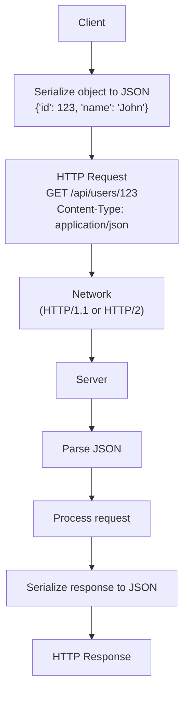
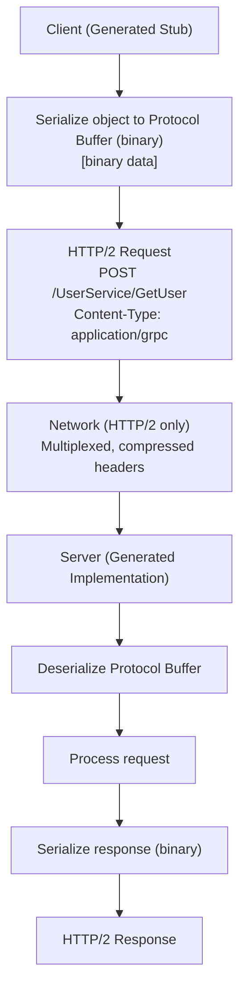

# REST vs gRPC in Microservices

## 0️⃣ Prerequisites

Before diving into this topic, you need to understand:

- **REST API Basics**: HTTP methods (GET, POST, PUT, DELETE), JSON, status codes (Phase 2)
- **gRPC Basics**: Protocol Buffers, RPC concepts, HTTP/2 (Phase 2, Topic 5)
- **Microservices Communication**: How services communicate with each other (Phase 10, Topic 6)
- **Serialization**: JSON vs binary formats
- **HTTP/2**: Multiplexing, header compression, streaming

**Quick refresher**: REST uses HTTP with JSON, gRPC uses HTTP/2 with Protocol Buffers. Both are used for microservices communication, but they have different strengths. This topic helps you choose the right one for your microservices.

---

## 1️⃣ What Problem Does This Exist to Solve?

### The Specific Pain Point

When building microservices, you need to choose how services communicate. Two main options:

**Option 1: REST + JSON**
```http
GET /api/users/123
Content-Type: application/json

Response:
{
  "id": 123,
  "name": "John Doe",
  "email": "john@example.com",
  "age": 30
}
```

**Option 2: gRPC + Protocol Buffers**
```protobuf
service UserService {
  rpc GetUser(GetUserRequest) returns (User);
}

// Binary protocol buffer message
```

**The Question**: Which one should you use? When does REST make sense? When does gRPC make sense?

### The Trade-off

**REST Advantages:**
- Human-readable (JSON)
- Easy to debug
- Works with browsers
- Simple to understand
- Mature tooling

**REST Disadvantages:**
- Slower (text parsing)
- Larger payloads
- No strong typing
- Limited streaming support

**gRPC Advantages:**
- Faster (binary)
- Smaller payloads
- Strong typing
- Native streaming
- Code generation

**gRPC Disadvantages:**
- Not human-readable
- Harder to debug
- Browser support limited
- Requires code generation
- Steeper learning curve

### Real Examples of the Choice

**Netflix**: Uses gRPC for internal microservices (high performance), REST for external APIs (browser compatibility).

**Google**: Uses gRPC internally (created it), REST for public APIs.

**Stripe**: Uses REST for public API (developer-friendly), gRPC internally.

---

## 2️⃣ Intuition and Mental Model

### The Mail Service Analogy

**REST** is like sending a **letter**:
- Write in human language (JSON)
- Anyone can read it (universal)
- Easy to understand
- Takes time to write/read (parsing overhead)
- Can be large (verbose)

**gRPC** is like sending a **telegram**:
- Uses code (binary Protocol Buffers)
- Fast to send/receive
- Compact (efficient)
- Need codebook to read (generated code)
- Not human-readable

### When to Use Each

**Use REST when:**
- Building public APIs (browser clients)
- Need human-readable debugging
- Simple CRUD operations
- Team familiarity with REST

**Use gRPC when:**
- Internal microservices (high performance)
- Need streaming
- Strong typing important
- Polyglot services (code generation)

---

## 3️⃣ How It Works Internally

### REST Request Flow



<details>
<summary>ASCII diagram (reference)</summary>

```text
Client
  │
  ├─> Serialize object to JSON
  │   {"id": 123, "name": "John"}
  │
  ├─> HTTP Request
  │   GET /api/users/123
  │   Content-Type: application/json
  │
  ├─> Network (HTTP/1.1 or HTTP/2)
  │
  └─> Server
      ├─> Parse JSON
      ├─> Process request
      ├─> Serialize response to JSON
      └─> HTTP Response
```
</details>

**Overhead:**
- JSON serialization/deserialization
- Text parsing
- HTTP headers
- Multiple round trips for related data

### gRPC Request Flow



<details>
<summary>ASCII diagram (reference)</summary>

```text
Client (Generated Stub)
  │
  ├─> Serialize object to Protocol Buffer (binary)
  │   [binary data]
  │
  ├─> HTTP/2 Request
  │   POST /UserService/GetUser
  │   Content-Type: application/grpc
  │
  ├─> Network (HTTP/2 only)
  │   Multiplexed, compressed headers
  │
  └─> Server (Generated Implementation)
      ├─> Deserialize Protocol Buffer
      ├─> Process request
      ├─> Serialize response (binary)
      └─> HTTP/2 Response
```
</details>

**Overhead:**
- Binary serialization (faster)
- HTTP/2 multiplexing
- Header compression
- Single connection for multiple requests

### Performance Comparison

**Latency (same data, 1000 requests):**
- REST + JSON: ~50ms per request
- gRPC + Protobuf: ~10ms per request
- **5x faster** with gRPC

**Payload Size (same data):**
- REST + JSON: ~200 bytes
- gRPC + Protobuf: ~80 bytes
- **2.5x smaller** with gRPC

**CPU Usage:**
- REST: High (JSON parsing)
- gRPC: Low (binary parsing)

---

## 4️⃣ Simulation-First Explanation

### Scenario: User Service Calls Order Service

**REST Approach:**

```java
// Order Service (REST)
@RestController
@RequestMapping("/api/orders")
public class OrderController {
    @GetMapping("/{orderId}")
    public Order getOrder(@PathVariable String orderId) {
        return orderService.getOrder(orderId);
    }
}

// User Service calls Order Service (REST)
@Service
public class UserService {
    @Autowired
    private RestTemplate restTemplate;
    
    public Order getLatestOrder(String userId) {
        // HTTP GET request
        ResponseEntity<Order> response = restTemplate.getForEntity(
            "http://order-service/api/orders/user/" + userId + "/latest",
            Order.class
        );
        return response.getBody();
    }
}
```

**Request/Response:**
```http
GET /api/orders/user/123/latest HTTP/1.1
Host: order-service
Accept: application/json

HTTP/1.1 200 OK
Content-Type: application/json
Content-Length: 245

{
  "orderId": "order-456",
  "userId": "123",
  "items": [
    {"productId": "prod-1", "quantity": 2, "price": 29.99}
  ],
  "total": 59.98,
  "status": "CONFIRMED",
  "createdAt": "2024-01-15T10:30:00Z"
}
```

**gRPC Approach:**

```protobuf
// order.proto
syntax = "proto3";

service OrderService {
  rpc GetLatestOrder(GetLatestOrderRequest) returns (Order);
}

message GetLatestOrderRequest {
  string userId = 1;
}

message Order {
  string orderId = 1;
  string userId = 2;
  repeated OrderItem items = 3;
  double total = 4;
  string status = 5;
  string createdAt = 6;
}

message OrderItem {
  string productId = 1;
  int32 quantity = 2;
  double price = 3;
}
```

```java
// Order Service (gRPC)
@GrpcService
public class OrderServiceImpl extends OrderServiceGrpc.OrderServiceImplBase {
    @Override
    public void getLatestOrder(
        GetLatestOrderRequest request,
        StreamObserver<Order> responseObserver
    ) {
        Order order = orderService.getLatestOrder(request.getUserId());
        responseObserver.onNext(order);
        responseObserver.onCompleted();
    }
}

// User Service calls Order Service (gRPC)
@Service
public class UserService {
    @Autowired
    private OrderServiceGrpc.OrderServiceBlockingStub orderStub;
    
    public Order getLatestOrder(String userId) {
        GetLatestOrderRequest request = GetLatestOrderRequest.newBuilder()
            .setUserId(userId)
            .build();
        return orderStub.getLatestOrder(request);
    }
}
```

**Request/Response (binary, simplified):**
```
HTTP/2 POST /OrderService/GetLatestOrder
Content-Type: application/grpc
[Binary Protocol Buffer: userId="123"]

HTTP/2 200 OK
Content-Type: application/grpc
[Binary Protocol Buffer: orderId="order-456", userId="123", ...]
```

---

## 5️⃣ How Engineers Actually Use This in Production

### Hybrid Approach (Common Pattern)

**Netflix Pattern:**
- **Internal services**: gRPC (high performance)
- **External APIs**: REST (browser compatibility)
- **API Gateway**: Translates REST → gRPC

```
Browser Client
  ↓ (REST)
API Gateway
  ↓ (gRPC)
Internal Microservices
```

### Real-World Implementation

**Spring Boot REST:**

```java
// Order Service REST API
@RestController
@RequestMapping("/api/v1/orders")
public class OrderController {
    @GetMapping("/{orderId}")
    public ResponseEntity<OrderDTO> getOrder(@PathVariable String orderId) {
        Order order = orderService.getOrder(orderId);
        return ResponseEntity.ok(toDTO(order));
    }
}
```

**Spring Boot gRPC:**

```java
// Order Service gRPC API
@GrpcService
public class OrderServiceImpl extends OrderServiceGrpc.OrderServiceImplBase {
    @Override
    public void getOrder(
        GetOrderRequest request,
        StreamObserver<Order> responseObserver
    ) {
        Order order = orderService.getOrder(request.getOrderId());
        responseObserver.onNext(order);
        responseObserver.onCompleted();
    }
}
```

### Versioning Strategies

**REST Versioning:**

```java
// URL versioning
@GetMapping("/api/v1/orders/{orderId}")
@GetMapping("/api/v2/orders/{orderId}")

// Header versioning
@GetMapping(value = "/api/orders/{orderId}", headers = "API-Version=1")
```

**gRPC Versioning:**

```protobuf
// Package versioning
package order.v1;
service OrderService { ... }

package order.v2;
service OrderService { ... }

// Service versioning
service OrderServiceV1 { ... }
service OrderServiceV2 { ... }
```

### Error Handling

**REST Errors:**

```java
@ExceptionHandler(OrderNotFoundException.class)
public ResponseEntity<ErrorResponse> handleNotFound(OrderNotFoundException e) {
    return ResponseEntity
        .status(HttpStatus.NOT_FOUND)
        .body(new ErrorResponse("ORDER_NOT_FOUND", e.getMessage()));
}
```

**gRPC Errors:**

```java
if (order == null) {
    responseObserver.onError(Status.NOT_FOUND
        .withDescription("Order not found")
        .asRuntimeException());
    return;
}
```

---

## 6️⃣ How to Implement or Apply It

### Decision Framework

**Choose REST when:**
1. Public APIs (browser clients)
2. Simple CRUD operations
3. Team unfamiliar with gRPC
4. Need human-readable debugging
5. Integration with third-party systems

**Choose gRPC when:**
1. Internal microservices
2. High performance requirements
3. Streaming needed
4. Strong typing important
5. Polyglot environment (code generation)

### Implementation Example

**REST with Spring Boot:**

```xml
<dependency>
    <groupId>org.springframework.boot</groupId>
    <artifactId>spring-boot-starter-web</artifactId>
</dependency>
```

```java
@RestController
public class UserController {
    @GetMapping("/api/users/{id}")
    public User getUser(@PathVariable String id) {
        return userService.getUser(id);
    }
}
```

**gRPC with Spring Boot:**

```xml
<dependency>
    <groupId>net.devh</groupId>
    <artifactId>grpc-spring-boot-starter</artifactId>
</dependency>
```

```protobuf
// user.proto
syntax = "proto3";
package com.example;

service UserService {
  rpc GetUser(GetUserRequest) returns (User);
}

message GetUserRequest {
  string id = 1;
}

message User {
  string id = 1;
  string name = 2;
  string email = 3;
}
```

---

## 7️⃣ Tradeoffs, Pitfalls, and Common Mistakes

### Common Pitfalls

**Pitfall 1: Using REST for Everything**

All internal services use REST → Slower, larger payloads, more CPU usage.

**Solution**: Use gRPC for internal services, REST for external.

**Pitfall 2: Using gRPC for Public APIs**

gRPC for browser clients → Requires gRPC-Web proxy, adds complexity.

**Solution**: Use REST for public APIs, gRPC internally.

**Pitfall 3: No Versioning Strategy**

Breaking changes → Clients break.

**Solution**: Plan versioning from start (URL versioning for REST, package versioning for gRPC).

### Performance Tradeoffs

| Aspect | REST | gRPC |
|--------|------|------|
| Latency | Higher | Lower (5x) |
| Payload Size | Larger | Smaller (2.5x) |
| CPU Usage | Higher | Lower |
| Memory Usage | Higher | Lower |
| Network Efficiency | Lower | Higher (HTTP/2) |

---

## 8️⃣ When NOT to Use This

### When REST is Wrong Choice

- Internal microservices with high performance needs → Use gRPC
- Real-time streaming → Use gRPC
- Mobile apps (bandwidth sensitive) → Consider gRPC

### When gRPC is Wrong Choice

- Public APIs (browser clients) → Use REST
- Simple CRUD, low traffic → REST is simpler
- Team unfamiliar with gRPC → REST has lower learning curve

---

## 9️⃣ Comparison with Alternatives

### REST vs gRPC vs GraphQL

| Feature | REST | gRPC | GraphQL |
|---------|------|------|---------|
| Protocol | HTTP/1.1 or HTTP/2 | HTTP/2 | HTTP |
| Payload | JSON (text) | Protobuf (binary) | JSON (text) |
| Schema | OpenAPI (optional) | .proto (required) | GraphQL schema |
| Streaming | Limited | Native | Subscriptions |
| Browser | Native | gRPC-Web needed | Native |
| Best For | Public APIs | Internal services | Flexible queries |

---

## 🔟 Interview Follow-up Questions WITH Answers

### L4 Level Questions

**Q1: When would you choose REST over gRPC?**

**Answer**: Choose REST when:
1. Building public APIs (browser clients need native support)
2. Simple CRUD operations (REST is simpler)
3. Team unfamiliar with gRPC (REST has lower learning curve)
4. Need human-readable debugging (JSON is easier to inspect)
5. Integration with third-party systems (REST is more universal)

**Q2: When would you choose gRPC over REST?**

**Answer**: Choose gRPC when:
1. Internal microservices (high performance, smaller payloads)
2. Streaming needed (native streaming support)
3. Strong typing important (Protocol Buffers enforce schema)
4. Polyglot environment (code generation for multiple languages)
5. High throughput requirements (binary is faster, HTTP/2 multiplexing)

### L5 Level Questions

**Q3: How do you handle versioning in REST vs gRPC?**

**Answer**:

**REST Versioning:**
1. **URL versioning**: `/api/v1/users`, `/api/v2/users` (common, explicit)
2. **Header versioning**: `Accept: application/vnd.api+json;version=1`
3. **Query parameter**: `/api/users?version=1`

**gRPC Versioning:**
1. **Package versioning**: `package user.v1;`, `package user.v2;`
2. **Service versioning**: `UserServiceV1`, `UserServiceV2`
3. **Field versioning**: Add new fields, mark old as deprecated

**Best Practice**: Plan versioning from start. REST: URL versioning is clearest. gRPC: Package versioning allows running multiple versions.

**Q4: How do error handling differ between REST and gRPC?**

**Answer**:

**REST Errors:**
- Use HTTP status codes (200, 400, 404, 500)
- Error body in JSON: `{"error": "NOT_FOUND", "message": "User not found"}`
- Standard status codes are well-understood

**gRPC Errors:**
- Use Status codes (OK, NOT_FOUND, INVALID_ARGUMENT, INTERNAL)
- Status details in metadata
- 16 standard status codes
- Can include additional error details

**Example:**
- REST: `HTTP 404` + `{"error": "NOT_FOUND"}`
- gRPC: `Status.NOT_FOUND` + description

### L6 Level Questions

**Q5: You're designing a microservices system. How do you decide between REST and gRPC for each service?**

**Answer**: Decision framework:

1. **Service Type**:
   - **External-facing services**: REST (browser compatibility, easier debugging)
   - **Internal services**: gRPC (performance, typing)

2. **Communication Pattern**:
   - **Request-response (CRUD)**: REST is simpler
   - **Streaming, real-time**: gRPC native support
   - **Batch operations**: gRPC (smaller payloads)

3. **Performance Requirements**:
   - **High throughput (>10k req/s)**: gRPC
   - **Low latency critical**: gRPC
   - **Moderate load**: REST is acceptable

4. **Team & Ecosystem**:
   - **Java/Spring team**: Both work, REST might be faster to adopt
   - **Polyglot (Java, Go, Python)**: gRPC (code generation)
   - **Existing REST APIs**: Consider REST for consistency

5. **Hybrid Approach** (Recommended):
   - API Gateway: REST (external)
   - Internal services: gRPC (performance)
   - Gateway translates REST → gRPC

**Q6: How would you migrate from REST to gRPC in a microservices system?**

**Answer**: Migration strategy:

1. **Parallel Implementation**:
   - Implement gRPC service alongside REST
   - Both serve same functionality
   - Use feature flag to route traffic

2. **Gradual Migration**:
   - Start with internal services (no external clients)
   - Migrate service-to-service calls first
   - Keep REST for external APIs

3. **API Gateway Translation**:
   - Gateway accepts REST
   - Translates to gRPC internally
   - Clients don't need changes

4. **Versioning**:
   - Run both versions during migration
   - Deprecate REST version
   - Remove after migration complete

5. **Monitoring**:
   - Monitor performance improvements
   - Track error rates
   - Rollback plan if issues

**Example Migration Path:**
```
Phase 1: Add gRPC alongside REST (parallel)
Phase 2: Route internal traffic to gRPC
Phase 3: Keep REST for external, gRPC for internal
Phase 4: (Optional) Gateway translates REST → gRPC
```

---

## 1️⃣1️⃣ One Clean Mental Summary

REST and gRPC are both used for microservices communication, but serve different purposes. REST uses HTTP with JSON (human-readable, browser-friendly, simple). gRPC uses HTTP/2 with Protocol Buffers (binary, fast, strongly-typed, streaming). Choose REST for public APIs, simple CRUD, and when you need human-readable debugging. Choose gRPC for internal microservices, high performance requirements, streaming, and when strong typing matters. Common pattern: Use REST for external APIs (browser clients), gRPC for internal services (performance). Performance: gRPC is ~5x faster and ~2.5x smaller payloads than REST for the same data. The choice depends on your requirements: browser compatibility → REST, performance → gRPC, or use both (hybrid approach with API Gateway).


