# Database per Service

## 0️⃣ Prerequisites

Before diving into this topic, you need to understand:

- **Microservices Fundamentals**: What microservices are, why they exist (Phase 10, Topic 1)
- **ACID Properties**: Transactions, consistency, isolation (Phase 1, Database Fundamentals)
- **Eventual Consistency**: CAP theorem, BASE properties (Phase 1)
- **Service Communication**: How services talk to each other (Phase 10, Topic 6)
- **Database Basics**: SQL vs NoSQL, transactions, joins (Phase 1)

**Quick refresher**: In a monolith, all features share one database. In microservices, each service should own its data. This creates independence but introduces new challenges around data consistency and queries.

---

## 1️⃣ What Problem Does This Exist to Solve?

### The Specific Pain Point

In a traditional monolith, all features share one database:


<details>
<summary>ASCII diagram (reference)</summary>

```text
Monolith Application
├── User Service (uses users table)
├── Order Service (uses orders table)
├── Payment Service (uses payments table)
└── Inventory Service (uses products table)
         ↓
    Single Database (PostgreSQL)
```
</details>

**Problems with Shared Database:**

1. **Tight Coupling**: Services can't change their schema without affecting others
2. **Deployment Coupling**: Can't deploy services independently
3. **Technology Lock-in**: All services must use the same database type
4. **Scaling Issues**: Can't scale databases independently
5. **Failure Domains**: One database failure affects all services
6. **Team Ownership**: Multiple teams fight over schema changes

### Real-World Example: E-commerce Monolith

**Before (Shared Database):**
```
Order Service needs to add "order_priority" column
  → Must coordinate with Payment Service (uses orders table for refunds)
  → Must coordinate with Shipping Service (uses orders table for tracking)
  → Must coordinate with Analytics Service (uses orders table for reports)
  → One schema change requires 4 teams to coordinate
  → Deployment blocked until all teams approve
```

**After (Database per Service):**
```
Order Service adds "order_priority" column to its own database
  → No coordination needed
  → Deploys independently
  → Other services get order data via API or events
```

### What Breaks Without This Pattern

**Shared Database Anti-Pattern:**
- Services can't evolve independently
- Database becomes a bottleneck
- Schema changes require coordination across teams
- Can't use different database types (SQL vs NoSQL) per service
- Violates microservices principle: "Independent deployability"

**Example Failure:**
```
Payment Service needs to add "payment_method_details" JSON column
  → Order Service team says: "We query that table, this breaks our queries"
  → Shipping Service team says: "We have a view on that table, this breaks our view"
  → Analytics Service team says: "Our ETL process reads that table, this breaks our pipeline"
  → Change blocked for 2 weeks while teams coordinate
  → Payment Service can't ship new feature
```

---

## 2️⃣ Intuition and Mental Model

### The Apartment Building Analogy

**Shared Database (Monolith)** is like a shared apartment building:
- All tenants share one mailbox system
- If one tenant changes their mailbox, it affects everyone
- Can't upgrade one apartment's plumbing without affecting others
- One broken pipe affects all tenants
- Everyone must agree on building rules

**Database per Service** is like separate houses:
- Each house has its own mailbox, plumbing, electricity
- You can renovate your house without asking neighbors
- One house's problems don't affect others
- Each house can have different features (one has solar panels, another has gas heating)
- But: If you need something from a neighbor, you must call them (API call)

**The Trade-off:**
- **Independence**: Each service owns its data completely
- **Complexity**: Getting data from other services requires API calls or events
- **Consistency**: No more ACID transactions across services (eventual consistency)

---

## 3️⃣ How It Works Internally

### Architecture Overview


<details>
<summary>ASCII diagram (reference)</summary>

```text
┌─────────────────┐     ┌─────────────────┐     ┌─────────────────┐
│  Order Service  │     │ Payment Service │     │ Inventory Service│
│                 │     │                 │     │                 │
│  Order Database │     │ Payment Database│     │ Product Database│
│   (PostgreSQL)  │     │   (MongoDB)     │     │   (Cassandra)   │
└─────────────────┘     └─────────────────┘     └─────────────────┘
        │                       │                       │
        └───────────────────────┴───────────────────────┘
                          │
                   API Gateway / Events
```
</details>

### Key Principles

1. **Service Owns Its Data**
   - Only the service can directly access its database
   - Other services access data via the service's API
   - Database is an implementation detail, hidden from other services

2. **No Shared Tables**
   - Each service has its own tables/collections
   - No foreign keys across service databases
   - No direct joins across services

3. **Data Duplication is OK**
   - Services can cache/copy data they need
   - Example: Order Service might cache product names (read-only copy)
   - Updated via events or API calls

### Data Flow Example: Creating an Order

```
1. Client → Order Service: "Create order for product X"
2. Order Service → Inventory Service API: "Reserve 1 unit of product X"
3. Inventory Service: Updates its database (reserves stock)
4. Inventory Service → Order Service: "Reserved successfully"
5. Order Service: Creates order in its database
6. Order Service → Payment Service API: "Charge $100"
7. Payment Service: Updates its database (records payment)
8. Payment Service → Order Service: "Payment successful"
9. Order Service: Updates order status in its database
```

**Notice:**
- Each service updates only its own database
- Services communicate via APIs
- No shared database access

---

## 4️⃣ Simulation-First Explanation

### Simple Example: Two Services

**Setup:**
- **User Service**: Manages user accounts (PostgreSQL)
- **Order Service**: Manages orders (PostgreSQL)

**Scenario: Create an order for user ID 123**

**Step 1: Order Service needs user information**
```
Order Service cannot do:
  SELECT * FROM users WHERE id = 123  ❌ (users table is in User Service database)

Order Service must do:
  GET /api/users/123  ✅ (call User Service API)
```

**Step 2: User Service responds**
```json
{
  "id": 123,
  "name": "John Doe",
  "email": "john@example.com",
  "address": "123 Main St"
}
```

**Step 3: Order Service creates order**
```sql
-- Order Service's own database
INSERT INTO orders (user_id, user_name, total, status)
VALUES (123, 'John Doe', 100.00, 'PENDING');
```

**Step 4: Order Service needs to update user's order count**
```
Order Service cannot do:
  UPDATE users SET order_count = order_count + 1 WHERE id = 123  ❌

Order Service must do:
  POST /api/users/123/orders/increment  ✅ (call User Service API)
```

### What About Data Duplication?

**Order Service stores user name in orders table:**
```sql
CREATE TABLE orders (
  id BIGSERIAL PRIMARY KEY,
  user_id BIGINT,           -- Reference to user (not a foreign key)
  user_name VARCHAR(255),    -- Duplicated from User Service
  total DECIMAL(10,2),
  status VARCHAR(50)
);
```

**Why duplicate?**
- Order Service needs user name for display
- Can't query User Service every time (too slow)
- User name rarely changes, acceptable to duplicate

**How to keep it updated?**
- Option 1: User Service publishes "UserUpdated" event
- Option 2: Order Service periodically syncs (for critical data)
- Option 3: Accept eventual consistency (user name might be slightly stale)

---

## 5️⃣ How Engineers Actually Use This in Production

### Netflix: Microservices with Database per Service

**Architecture:**
- **User Service**: MySQL (user accounts, profiles)
- **Content Service**: Cassandra (video metadata, huge scale)
- **Recommendation Service**: Redis + PostgreSQL (caching + ML models)
- **Billing Service**: PostgreSQL (transactions, ACID needed)
- **Analytics Service**: ClickHouse (time-series, fast queries)

**Why Different Databases?**
- Content Service: Billions of videos, needs horizontal scaling → Cassandra
- Recommendation Service: Needs fast lookups → Redis cache
- Billing Service: Needs transactions → PostgreSQL
- Analytics Service: Needs fast aggregations → ClickHouse

**Data Flow:**
```
User watches video
  → Content Service: Records view (Cassandra)
  → Recommendation Service: Updates user preferences (Redis)
  → Analytics Service: Aggregates view data (ClickHouse)
  → All services update their own databases independently
```

### Amazon: Order Processing

**Services:**
- **Order Service**: DynamoDB (high throughput, low latency)
- **Inventory Service**: DynamoDB (real-time stock levels)
- **Payment Service**: RDS PostgreSQL (ACID transactions)
- **Shipping Service**: DynamoDB (tracking information)

**Pattern:**
- Each service chooses database based on access patterns
- Services communicate via events (SQS, SNS)
- No shared database access

### Uber: Real-Time Location

**Services:**
- **Driver Service**: PostgreSQL (driver profiles, ACID needed)
- **Location Service**: Redis (real-time locations, fast updates)
- **Trip Service**: PostgreSQL (trip history, queries needed)
- **Pricing Service**: Redis (dynamic pricing, fast lookups)

**Key Insight:**
- Location data changes every second → Redis (in-memory, fast)
- Trip history needs complex queries → PostgreSQL
- Each service optimizes for its use case

---

## 6️⃣ How to Implement This

### Example: E-commerce System

**Services:**
1. **User Service** (PostgreSQL)
2. **Product Service** (MongoDB)
3. **Order Service** (PostgreSQL)

### Step 1: User Service Setup

**pom.xml:**
```xml
<dependencies>
    <dependency>
        <groupId>org.springframework.boot</groupId>
        <artifactId>spring-boot-starter-web</artifactId>
    </dependency>
    <dependency>
        <groupId>org.springframework.boot</groupId>
        <artifactId>spring-boot-starter-data-jpa</artifactId>
    </dependency>
    <dependency>
        <groupId>org.postgresql</groupId>
        <artifactId>postgresql</artifactId>
    </dependency>
</dependencies>
```

**application.yml:**
```yaml
spring:
  datasource:
    url: jdbc:postgresql://localhost:5432/user_service_db
    username: user_service
    password: password
  jpa:
    hibernate:
      ddl-auto: update
    show-sql: true
```

**User Entity:**
```java
@Entity
@Table(name = "users")
public class User {
    @Id
    @GeneratedValue(strategy = GenerationType.IDENTITY)
    private Long id;
    
    private String name;
    private String email;
    private String address;
    
    // No reference to orders (orders are in Order Service)
    // This is the key: no foreign keys to other services
    
    // Getters and setters
}
```

**User Repository:**
```java
@Repository
public interface UserRepository extends JpaRepository<User, Long> {
    // Only queries on User Service's own data
    Optional<User> findByEmail(String email);
}
```

**User Controller:**
```java
@RestController
@RequestMapping("/api/users")
public class UserController {
    
    @Autowired
    private UserService userService;
    
    @GetMapping("/{id}")
    public ResponseEntity<User> getUser(@PathVariable Long id) {
        // Other services call this API to get user data
        return ResponseEntity.ok(userService.getUser(id));
    }
    
    @PostMapping
    public ResponseEntity<User> createUser(@RequestBody User user) {
        return ResponseEntity.ok(userService.createUser(user));
    }
}
```

### Step 2: Product Service Setup

**pom.xml:**
```xml
<dependencies>
    <dependency>
        <groupId>org.springframework.boot</groupId>
        <artifactId>spring-boot-starter-web</artifactId>
    </dependency>
    <dependency>
        <groupId>org.springframework.boot</groupId>
        <artifactId>spring-boot-starter-data-mongodb</artifactId>
    </dependency>
</dependencies>
```

**application.yml:**
```yaml
spring:
  data:
    mongodb:
      uri: mongodb://localhost:27017/product_service_db
```

**Product Document:**
```java
@Document(collection = "products")
public class Product {
    @Id
    private String id;
    
    private String name;
    private BigDecimal price;
    private Integer stock;
    
    // No reference to orders (orders are in Order Service)
    // This service only manages product data
}
```

**Product Controller:**
```java
@RestController
@RequestMapping("/api/products")
public class ProductController {
    
    @Autowired
    private ProductService productService;
    
    @GetMapping("/{id}")
    public ResponseEntity<Product> getProduct(@PathVariable String id) {
        // Order Service calls this to get product details
        return ResponseEntity.ok(productService.getProduct(id));
    }
    
    @PostMapping("/{id}/reserve")
    public ResponseEntity<Boolean> reserveStock(
            @PathVariable String id,
            @RequestParam Integer quantity) {
        // Order Service calls this to reserve stock
        return ResponseEntity.ok(productService.reserveStock(id, quantity));
    }
}
```

### Step 3: Order Service Setup

**Order Entity:**
```java
@Entity
@Table(name = "orders")
public class Order {
    @Id
    @GeneratedValue(strategy = GenerationType.IDENTITY)
    private Long id;
    
    private Long userId;        // Reference, not foreign key
    private String userName;    // Duplicated from User Service
    private String productId;   // Reference, not foreign key
    private String productName; // Duplicated from Product Service
    private BigDecimal total;
    private String status;
    
    // Notice: No @ManyToOne or @OneToMany relationships
    // These are just IDs and duplicated data
}
```

**Order Service (calls other services):**
```java
@Service
public class OrderService {
    
    @Autowired
    private OrderRepository orderRepository;
    
    // RestTemplate or Feign Client to call other services
    @Autowired
    private RestTemplate restTemplate;
    
    public Order createOrder(CreateOrderRequest request) {
        // Step 1: Get user from User Service
        User user = restTemplate.getForObject(
            "http://user-service/api/users/" + request.getUserId(),
            User.class
        );
        
        // Step 2: Get product from Product Service
        Product product = restTemplate.getForObject(
            "http://product-service/api/products/" + request.getProductId(),
            Product.class
        );
        
        // Step 3: Reserve stock
        Boolean reserved = restTemplate.postForObject(
            "http://product-service/api/products/" + request.getProductId() + "/reserve",
            null,
            Boolean.class,
            Map.of("quantity", 1)
        );
        
        if (!reserved) {
            throw new InsufficientStockException();
        }
        
        // Step 4: Create order in Order Service's database
        Order order = new Order();
        order.setUserId(user.getId());
        order.setUserName(user.getName());  // Duplicated data
        order.setProductId(product.getId());
        order.setProductName(product.getName());  // Duplicated data
        order.setTotal(product.getPrice());
        order.setStatus("PENDING");
        
        return orderRepository.save(order);
    }
}
```

### Step 4: Docker Compose for Multiple Databases

**docker-compose.yml:**
```yaml
version: '3.8'

services:
  user-db:
    image: postgres:15
    environment:
      POSTGRES_DB: user_service_db
      POSTGRES_USER: user_service
      POSTGRES_PASSWORD: password
    ports:
      - "5432:5432"
    volumes:
      - user_db_data:/var/lib/postgresql/data

  product-db:
    image: mongo:6
    ports:
      - "27017:27017"
    volumes:
      - product_db_data:/data/db

  order-db:
    image: postgres:15
    environment:
      POSTGRES_DB: order_service_db
      POSTGRES_USER: order_service
      POSTGRES_PASSWORD: password
    ports:
      - "5433:5432"  # Different port
    volumes:
      - order_db_data:/var/lib/postgresql/data

volumes:
  user_db_data:
  product_db_data:
  order_db_data:
```

**Key Points:**
- Each service has its own database instance
- Different ports for multiple PostgreSQL instances
- Each service connects only to its own database

---

## 7️⃣ Tradeoffs, Pitfalls, and Common Mistakes

### Tradeoffs

**Pros:**
1. **Independent Deployment**: Change schema without coordinating with other teams
2. **Technology Choice**: Each service can use the best database for its needs
3. **Scaling**: Scale databases independently based on load
4. **Failure Isolation**: One database failure doesn't affect all services
5. **Team Autonomy**: Teams own their data completely

**Cons:**
1. **No ACID Transactions Across Services**: Can't guarantee atomicity across services
2. **Data Duplication**: Must duplicate data that multiple services need
3. **Eventual Consistency**: Data might be slightly stale
4. **Complex Queries**: Can't do joins across services (must use API calls or events)
5. **More Infrastructure**: Need to manage multiple databases

### Common Pitfalls

**Pitfall 1: Trying to Maintain ACID Across Services**

❌ **Wrong:**
```java
// Trying to do transaction across services
@Transactional
public void createOrder() {
    orderRepository.save(order);           // Order Service DB
    userService.incrementOrderCount();     // User Service DB
    productService.decreaseStock();        // Product Service DB
    // If any fails, can't rollback all - different databases!
}
```

✅ **Right:**
```java
// Use Saga pattern or eventual consistency
public void createOrder() {
    orderRepository.save(order);
    // Publish event: OrderCreated
    eventPublisher.publish(new OrderCreatedEvent(order));
    // Other services update eventually via events
}
```

**Pitfall 2: Too Much Data Duplication**

❌ **Wrong:**
```java
// Duplicating entire user object in every order
class Order {
    private User fullUserObject;  // 50+ fields duplicated
    // If user updates email, 1000 orders have stale email
}
```

✅ **Right:**
```java
// Duplicate only what you need, keep it minimal
class Order {
    private Long userId;           // Reference
    private String userName;      // Only duplicate display name
    // If user updates email, orders don't need it
}
```

**Pitfall 3: Synchronous Calls for Everything**

❌ **Wrong:**
```java
// Every order display makes 5 API calls
public OrderDTO getOrder(Long id) {
    Order order = orderRepository.findById(id);
    User user = userService.getUser(order.getUserId());      // API call
    Product product = productService.getProduct(...);        // API call
    Payment payment = paymentService.getPayment(...);        // API call
    Shipping shipping = shippingService.getShipping(...);    // API call
    // Slow, fragile, cascading failures
}
```

✅ **Right:**
```java
// Cache or duplicate data you need frequently
public OrderDTO getOrder(Long id) {
    Order order = orderRepository.findById(id);
    // userName and productName already in order (duplicated)
    // Only call other services for data that changes frequently
    Payment payment = paymentService.getPayment(...);  // Only if needed
}
```

**Pitfall 4: Not Handling Stale Data**

❌ **Wrong:**
```java
// Assuming duplicated data is always fresh
if (order.getUserName().equals("Old Name")) {
    // User might have changed name, this is stale
}
```

✅ **Right:**
```java
// Accept eventual consistency or refresh when needed
if (needsFreshData) {
    User user = userService.getUser(order.getUserId());  // Get fresh data
} else {
    // Use cached/duplicated data, accept it might be slightly stale
}
```

### Performance Gotchas

**Gotcha 1: N+1 Query Problem Across Services**

```java
// Getting 100 orders, each makes API call for user
List<Order> orders = orderRepository.findAll();
for (Order order : orders) {
    User user = userService.getUser(order.getUserId());  // 100 API calls!
}
```

**Solution: Batch API or cache**
```java
// Batch request
List<Long> userIds = orders.stream()
    .map(Order::getUserId)
    .distinct()
    .collect(Collectors.toList());
Map<Long, User> users = userService.getUsers(userIds);  // 1 API call
```

**Gotcha 2: Database Connection Pool Exhaustion**

Each service has its own connection pool. If you have 10 services each with 20 connections, that's 200 connections total (vs 20 in monolith).

**Solution:** Monitor connection pools, use connection pooling wisely.

### Security Considerations

1. **Database Access**: Each service should only access its own database
2. **API Authentication**: Services calling each other need authentication
3. **Data Privacy**: Sensitive data (PII) should be in specific services only
4. **Network Security**: Databases should not be publicly accessible

---

## 8️⃣ When NOT to Use This Pattern

### Anti-Patterns and Misuse Cases

**Don't Use When:**

1. **Small Team, Simple System**
   - Overhead of managing multiple databases > benefits
   - Monolith with shared database is simpler

2. **Strong ACID Requirements Across Entities**
   - If you need transactions across user, order, payment
   - Consider monolith or distributed transactions (with caution)

3. **Frequent Cross-Service Queries**
   - If you constantly need to join data from multiple services
   - Consider if services should be merged

4. **Tight Budget**
   - Multiple databases = more infrastructure costs
   - More monitoring, backup, maintenance

### Signs You've Chosen Wrong

**Red Flags:**
- Services constantly calling each other for data (tight coupling)
- Data duplication causing consistency issues
- Can't deploy services independently (still coupled)
- Queries require data from 5+ services (maybe wrong boundaries)

### Better Alternatives for Specific Scenarios

**Scenario 1: Need Strong Consistency**
- **Alternative**: Use distributed transactions (2PC, Saga pattern)
- **Or**: Keep related entities in same service

**Scenario 2: Complex Reporting Queries**
- **Alternative**: Read replicas, data warehouse, CQRS
- **Or**: Separate read model that aggregates from multiple services

**Scenario 3: Just Starting Out**
- **Alternative**: Start with monolith, extract services later
- **Or**: Modular monolith (separate schemas, same database)

---

## 9️⃣ Comparison with Alternatives

### Database per Service vs Shared Database

| Aspect | Database per Service | Shared Database |
|--------|---------------------|-----------------|
| **Deployment** | Independent | Coupled |
| **Technology** | Can mix SQL/NoSQL | One database type |
| **Scaling** | Scale independently | Scale together |
| **Transactions** | No ACID across services | ACID across all |
| **Queries** | API calls or events | Direct SQL joins |
| **Complexity** | Higher | Lower |
| **Team Autonomy** | High | Low |

**When to Choose Each:**
- **Database per Service**: Large team, need independence, different access patterns
- **Shared Database**: Small team, need strong consistency, simple queries

### Database per Service vs Database per Schema

**Database per Schema:**
- Same database server, different schemas
- Middle ground between shared and separate
- Still some coupling (shared connection pool, shared server)

**Example:**
```sql
-- Same PostgreSQL instance
CREATE SCHEMA user_service;
CREATE SCHEMA order_service;
CREATE SCHEMA product_service;
```

**When to Use:**
- Want some isolation but lower infrastructure cost
- Can't afford separate database servers
- Good stepping stone from monolith to microservices

### Migration Path from Shared Database

**Step 1: Identify Service Boundaries**

```mermaid
flowchart TD
    SharedDB["Shared Database"]
    Users["users table → User Service"]
    Orders["orders table → Order Service"]
    Products["products table → Product Service"]
    
    SharedDB --> Users
    SharedDB --> Orders
    SharedDB --> Products
```


<details>
<summary>ASCII diagram (reference)</summary>

```text
Shared Database
├── users table → User Service
├── orders table → Order Service
└── products table → Product Service
```
</details>

**Step 2: Create Separate Databases**
```
User Service DB: users table
Order Service DB: orders table
Product Service DB: products table
```

**Step 3: Update Services**
- Remove foreign keys across services
- Add API calls to get data from other services
- Duplicate data where needed

**Step 4: Migrate Data**
- Copy data to new databases
- Run both systems in parallel
- Gradually route traffic to new system

**Step 5: Remove Old Database**
- Once confident, remove shared database

---

## 🔟 Interview Follow-up Questions WITH Answers

### Question 1: How do you handle transactions across services?

**Answer:**

You can't use traditional ACID transactions across services (different databases). Instead:

**Option 1: Saga Pattern**
- Break transaction into steps
- Each step in different service
- If step fails, compensate (undo previous steps)
- Example: Order → Payment → Shipping. If shipping fails, refund payment, cancel order.

**Option 2: Two-Phase Commit (2PC)**
- Coordinator coordinates commit across services
- Rarely used (blocking, complex, doesn't scale)
- Only for critical, low-volume operations

**Option 3: Eventual Consistency**
- Accept that data might be temporarily inconsistent
- Use events to eventually sync
- Example: Order created, payment processed later via event

**Option 4: Keep Related Entities in Same Service**
- If you need transactions, maybe they shouldn't be separate services
- Example: Order and OrderItem should be in same service

**Trade-off:** Independence vs Consistency. Choose based on business requirements.

---

### Question 2: How do you query data that spans multiple services?

**Answer:**

**Option 1: API Composition (BFF Pattern)**
- Backend for Frontend service calls multiple services
- Aggregates results
- Example: Order details page calls Order Service, User Service, Product Service

**Option 2: CQRS with Read Model**
- Services publish events
- Read service subscribes, builds aggregated read model
- Example: Order Read Service has denormalized data from multiple services

**Option 3: Data Warehouse**
- Services publish events to data warehouse
- Analytics/reporting queries data warehouse
- Example: Business intelligence queries aggregated data

**Option 4: GraphQL BFF**
- Single GraphQL endpoint
- Resolvers call multiple services
- Client gets exactly what it needs in one query

**Trade-off:** Real-time vs Eventually Consistent. Choose based on query requirements.

---

### Question 3: What if two services need the same data? How do you avoid duplication?

**Answer:**

**You can't avoid duplication completely, but you can manage it:**

**Strategy 1: Single Source of Truth**
- One service owns the data (source of truth)
- Other services cache/duplicate for performance
- Updates flow from source of truth via events

**Example:**
- User Service owns user data (source of truth)
- Order Service caches user name for display
- When user updates name, User Service publishes event
- Order Service updates cached name

**Strategy 2: Read-Only Replicas**
- Source service has write database
- Other services have read replicas
- Replication keeps data in sync

**Strategy 3: Accept Eventual Consistency**
- Duplicate data, accept it might be slightly stale
- Refresh when needed (user clicks "refresh")
- Good for non-critical data (display names, descriptions)

**Strategy 4: API Calls (No Duplication)**
- Always call source service for data
- No duplication, but slower
- Use for data that changes frequently

**Key Insight:** Duplication is a trade-off. Duplicate for performance, accept eventual consistency.

---

### Question 4: How do you handle referential integrity without foreign keys?

**Answer:**

**You lose database-level referential integrity. Handle it in application:**

**Option 1: Validate in Application**
- Before creating order, validate user exists (call User Service)
- If user doesn't exist, reject order
- Application enforces integrity, not database

**Option 2: Soft References**
- Store user_id even if user deleted
- Handle "orphaned" references gracefully
- Example: "User [deleted]" instead of crashing

**Option 3: Eventual Cleanup**
- Services publish deletion events
- Other services clean up references eventually
- Example: User deleted → Order Service marks orders as "user deleted"

**Option 4: Saga Pattern for Deletions**
- Coordinate deletion across services
- If any service can't delete, rollback
- Example: Delete user → Delete orders → Delete payments (all or nothing)

**Key Insight:** Referential integrity becomes eventual, not immediate. Design for this.

---

### Question 5: How do you choose which database for each service?

**Answer:**

**Choose based on access patterns and requirements:**

**PostgreSQL (SQL):**
- Need ACID transactions
- Complex queries, joins
- Relational data
- Example: Payment Service (transactions), Order Service (queries)

**MongoDB (NoSQL Document):**
- Flexible schema
- Document-based data
- Horizontal scaling
- Example: Product Catalog (various product types), User Profiles

**Cassandra (NoSQL Wide-Column):**
- Write-heavy, time-series
- Need horizontal scaling
- Eventually consistent
- Example: Event Logging, Metrics, Content Metadata

**Redis (In-Memory):**
- Need sub-millisecond latency
- Caching, sessions
- Real-time data
- Example: Shopping Cart, Real-time Leaderboards

**Elasticsearch (Search):**
- Full-text search
- Analytics, aggregations
- Example: Product Search, Log Analytics

**Key Factors:**
1. **Access Pattern**: Read-heavy vs Write-heavy
2. **Consistency**: Need ACID vs Eventually consistent OK
3. **Scale**: Millions of records vs billions
4. **Query Type**: Simple lookups vs Complex joins
5. **Latency**: Sub-millisecond vs Seconds OK

---

### Question 6: What happens if a service's database goes down?

**Answer:**

**Failure Isolation (Benefit of Database per Service):**

**Scenario: Order Service database down**
- Order Service is unavailable
- User Service still works (its database is up)
- Product Service still works (its database is up)
- Only order-related features fail

**Compare to Monolith:**
- If shared database down, entire system down
- All features fail together

**Handling Failures:**

**Option 1: Circuit Breaker**
- If Order Service down, don't keep calling it
- Return cached data or error gracefully
- Example: Show "Orders temporarily unavailable"

**Option 2: Retry with Backoff**
- Retry failed calls with exponential backoff
- Eventually service recovers

**Option 3: Degraded Mode**
- Show partial data
- Example: Show orders but "Payment status unavailable"

**Option 4: Read Replicas**
- If primary database down, failover to replica
- Minimize downtime

**Key Insight:** Failure isolation is a major benefit. One service failure doesn't cascade.

---

### Question 7: How do you migrate from shared database to database per service?

**Answer:**

**Strangler Pattern (Incremental Migration):**

**Phase 1: Identify Boundaries**
- Analyze which tables belong to which service
- Identify dependencies (foreign keys, joins)

**Phase 2: Create New Databases**
- Set up separate databases for each service
- Keep old shared database running

**Phase 3: Dual Write**
- Services write to both old and new databases
- Old system still serves reads
- Validate new system works correctly

**Phase 4: Migrate Reads**
- Gradually route reads to new databases
- Start with non-critical features
- Monitor for issues

**Phase 5: Migrate Writes**
- Route writes to new databases
- Old database becomes read-only

**Phase 6: Data Sync**
- Sync any data written to old database during migration
- Ensure consistency

**Phase 7: Decommission**
- Once confident, remove old database
- Services only use new databases

**Key Challenges:**
- Data migration (copying data, handling ongoing writes)
- Zero downtime (can't stop system)
- Rollback plan (if something goes wrong)

**Timeframe:** Typically 3-6 months for large systems.

---

## 1️⃣1️⃣ One Clean Mental Summary

Database per Service means each microservice owns and manages its own database. No service can directly access another service's database. Services get data from each other via APIs or events. This gives independence (deploy, scale, choose technology separately) but loses ACID transactions across services. You trade immediate consistency for eventual consistency. Data duplication is acceptable and often necessary for performance. The pattern is essential for true microservices independence but adds complexity in queries and consistency management. Think of it like separate houses instead of shared apartments: more independence, but you must call neighbors when you need something from them.

