# Saga Pattern

## 0️⃣ Prerequisites

Before diving into this topic, you need to understand:

- **Database per Service**: Why services have separate databases (Phase 10, Topic 7)
- **ACID Transactions**: Atomicity, consistency, isolation, durability (Phase 1)
- **Event-Driven Architecture**: Events, event publishing, event handling (Phase 6, Topic 14)
- **Microservices Communication**: How services communicate (Phase 10, Topic 6)
- **Distributed Systems**: CAP theorem, eventual consistency (Phase 1)

**Quick refresher**: In a monolith, you use database transactions to ensure all-or-nothing operations. In microservices, each service has its own database, so you can't use traditional ACID transactions across services. The Saga pattern provides a way to manage distributed transactions by breaking them into local transactions with compensating actions.

---

## 1️⃣ What Problem Does This Exist to Solve?

### The Specific Pain Point

In a monolith with a single database, you can use ACID transactions:

```sql
BEGIN TRANSACTION;
  INSERT INTO orders (user_id, total) VALUES (123, 100.00);
  UPDATE inventory SET stock = stock - 1 WHERE product_id = 'P1';
  INSERT INTO payments (order_id, amount) VALUES (1, 100.00);
COMMIT;
-- Either all succeed or all fail (atomicity)
```

**In Microservices, Each Service Has Its Own Database:**

```
Order Service (PostgreSQL)
  └── orders table

Inventory Service (MongoDB)
  └── products collection

Payment Service (PostgreSQL)
  └── payments table
```

**The Problem: No Cross-Service Transactions**

You can't do:
```sql
BEGIN TRANSACTION;
  -- Order Service database
  INSERT INTO orders ...;
  
  -- Inventory Service database (different database!)
  UPDATE products ...;  ❌ Can't do this in same transaction
  
  -- Payment Service database (different database!)
  INSERT INTO payments ...;  ❌ Can't do this in same transaction
COMMIT;
```

**What Happens Without Saga Pattern:**

**Scenario: Create Order Flow**
```
1. Order Service: Create order ✅
2. Inventory Service: Reserve stock ✅
3. Payment Service: Charge customer ❌ FAILS (insufficient funds)
```

**Result:**
- Order created (but shouldn't exist)
- Stock reserved (but order failed)
- Payment failed
- **Inconsistent state!**

**Without Saga:**
- Order exists but payment failed (inconsistent)
- Stock reserved but no payment (inconsistent)
- Need manual cleanup (error-prone)

**With Saga:**
- Order created
- Stock reserved
- Payment fails
- **Saga compensates**: Cancel order, release stock (consistent state)

### Real-World Example: E-commerce Order

**Traditional Monolith (ACID Transaction):**
```java
@Transactional
public void createOrder(OrderRequest request) {
    Order order = orderRepository.save(new Order(...));      // Step 1
    inventoryService.reserveStock(...);                       // Step 2
    paymentService.chargeCustomer(...);                       // Step 3
    shippingService.createShipment(...);                      // Step 4
    // If any step fails, all rollback automatically
}
```

**Microservices (No Cross-Service Transactions):**
```java
// Order Service
public void createOrder(OrderRequest request) {
    Order order = orderRepository.save(new Order(...));      // Step 1 ✅
    // Call other services
    inventoryService.reserveStock(...);                       // Step 2 ✅
    paymentService.chargeCustomer(...);                      // Step 3 ❌ FAILS
    // Now what? Order exists, stock reserved, but payment failed!
}
```

**The Saga Solution:**
```java
// Saga orchestrates the flow
public void createOrder(OrderRequest request) {
    try {
        Order order = orderService.createOrder(...);         // Step 1 ✅
        inventoryService.reserveStock(...);                   // Step 2 ✅
        paymentService.chargeCustomer(...);                   // Step 3 ❌ FAILS
    } catch (PaymentFailedException e) {
        // Compensate: undo previous steps
        inventoryService.releaseStock(...);                   // Compensate Step 2
        orderService.cancelOrder(...);                        // Compensate Step 1
        throw e;
    }
}
```

### What Breaks Without Saga Pattern

**Problem 1: Partial Failures**
- Some steps succeed, some fail
- System left in inconsistent state
- Manual intervention required

**Problem 2: No Rollback Mechanism**
- Can't use database rollback (different databases)
- Need application-level compensation

**Problem 3: Data Integrity Issues**
- Orders without payments
- Reserved stock without orders
- Payments without orders

**Real Examples:**

**Uber Ride:**
- Without Saga: Driver assigned, payment processed, but ride cancelled → Driver paid for nothing
- With Saga: If ride cancelled, compensate: unassign driver, refund payment

**Amazon Order:**
- Without Saga: Order created, inventory reserved, payment failed → Inventory stuck
- With Saga: If payment fails, compensate: cancel order, release inventory

---

## 2️⃣ Intuition and Mental Model

### The Travel Booking Analogy

**Traditional Transaction (Monolith)** is like booking a package deal:
- You book flight + hotel + car together
- Travel agency handles everything
- If flight booking fails, hotel and car automatically cancelled (atomic)
- All-or-nothing: either everything booked or nothing

**Saga Pattern (Microservices)** is like booking separately:
- You book flight (Flight Service) ✅
- You book hotel (Hotel Service) ✅
- You book car (Car Service) ❌ FAILS (no cars available)
- **Compensation**: Cancel flight, cancel hotel (undo previous steps)
- Not atomic, but eventually consistent

**The Flow:**
1. Book flight → Success
2. Book hotel → Success
3. Book car → Fails
4. **Compensate**: Cancel hotel reservation
5. **Compensate**: Cancel flight reservation
6. System back to initial state (consistent)

### The Restaurant Order Analogy

**Saga Pattern** is like ordering at a restaurant:
1. Waiter takes order (Order Service) ✅
2. Kitchen prepares food (Kitchen Service) ✅
3. Payment processed (Payment Service) ❌ FAILS (card declined)
4. **Compensate**: Kitchen stops preparing (if possible)
5. **Compensate**: Cancel order
6. Customer leaves, system consistent

**Key Insight:** Each step can be undone with a compensating action.

---

## 3️⃣ How It Works Internally

### Architecture Overview

**Two Approaches:**

**1. Orchestration (Centralized)**


<details>
<summary>ASCII diagram (reference)</summary>

```text
Saga Orchestrator
    │
    ├─→ Step 1: Create Order
    │       │
    │       └─→ Order Service
    │
    ├─→ Step 2: Reserve Stock
    │       │
    │       └─→ Inventory Service
    │
    ├─→ Step 3: Charge Payment
    │       │
    │       └─→ Payment Service ❌ FAILS
    │
    └─→ Compensate: Release Stock
            │
            └─→ Inventory Service
        Compensate: Cancel Order
            │
            └─→ Order Service
```
</details>

**2. Choreography (Distributed)**

```mermaid
flowchart TD
    OrderSvc["Order Service"]
    OrderEvent["Publishes: OrderCreated event"]
    
    InventorySvc1["Inventory Service (listens)"]
    Reserve["Reserves stock"]
    StockEvent["Publishes: StockReserved event"]
    
    PaymentSvc["Payment Service (listens)"]
    Charge["Charges customer ❌ FAILS"]
    PaymentFailed["Publishes: PaymentFailed event"]
    
    InventorySvc2["Inventory Service (listens)"]
    Release["Compensates: Releases stock"]
    
    OrderSvc2["Order Service (listens)"]
    Cancel["Compensates: Cancels order"]
    
    OrderSvc --> OrderEvent
    OrderEvent --> InventorySvc1
    InventorySvc1 --> Reserve
    Reserve --> StockEvent
    StockEvent --> PaymentSvc
    PaymentSvc --> Charge
    Charge --> PaymentFailed
    PaymentFailed --> InventorySvc2
    InventorySvc2 --> Release
    PaymentFailed --> OrderSvc2
    OrderSvc2 --> Cancel
```


<details>
<summary>ASCII diagram (reference)</summary>

```text
Order Service
    │
    ├─→ Publishes: OrderCreated event
    │
Inventory Service (listens)
    │
    ├─→ Reserves stock
    │
    ├─→ Publishes: StockReserved event
    │
Payment Service (listens)
    │
    ├─→ Charges customer ❌ FAILS
    │
    ├─→ Publishes: PaymentFailed event
    │
Inventory Service (listens)
    │
    ├─→ Compensates: Releases stock
    │
Order Service (listens)
    │
    └─→ Compensates: Cancels order
```
</details>

### Key Components

**1. Saga Steps**
- Each step is a local transaction (within one service)
- Either succeeds or fails
- If fails, previous steps must be compensated

**2. Compensating Actions**
- Undo operation for each step
- Example: "Create Order" → Compensate: "Cancel Order"
- Example: "Reserve Stock" → Compensate: "Release Stock"

**3. Saga Coordinator (Orchestration)**
- Central component that orchestrates the flow
- Knows the order of steps
- Handles failures and triggers compensation

**4. Events (Choreography)**
- Services publish events
- Other services react to events
- No central coordinator

### Saga Execution Flow

**Successful Saga:**
```
Step 1: Create Order
  → Order Service: INSERT INTO orders
  → Status: SUCCESS

Step 2: Reserve Stock
  → Inventory Service: UPDATE products SET stock = stock - 1
  → Status: SUCCESS

Step 3: Charge Payment
  → Payment Service: INSERT INTO payments
  → Status: SUCCESS

Saga Status: COMPLETED
```

**Failed Saga (with Compensation):**
```
Step 1: Create Order
  → Order Service: INSERT INTO orders
  → Status: SUCCESS
  → Compensation: cancelOrder(orderId)

Step 2: Reserve Stock
  → Inventory Service: UPDATE products SET stock = stock - 1
  → Status: SUCCESS
  → Compensation: releaseStock(productId, quantity)

Step 3: Charge Payment
  → Payment Service: INSERT INTO payments
  → Status: FAILED (insufficient funds)
  
Compensation Phase:
  → Execute: releaseStock(productId, quantity) ✅
  → Execute: cancelOrder(orderId) ✅

Saga Status: COMPENSATED (rolled back)
```

### Compensation Rules

**Important Rules:**

1. **Compensate in Reverse Order**
   - Last step that succeeded is compensated first
   - Example: Step 3 fails → Compensate Step 2, then Step 1

2. **Compensating Actions Must Be Idempotent**
   - Can be called multiple times safely
   - Example: "Cancel Order" should check if already cancelled

3. **Compensation Can Fail**
   - Need retry mechanism
   - Or manual intervention

4. **Not All Operations Are Reversible**
   - Some operations can't be undone
   - Example: Email sent, physical item shipped
   - Need business logic to handle

---

## 4️⃣ Simulation-First Explanation

### Simple Example: Create Order Saga

**Services:**
- **Order Service**: Creates orders
- **Inventory Service**: Manages stock
- **Payment Service**: Processes payments

**Scenario: User creates order for product P1, quantity 2, total $100**

### Orchestration Approach

**Step 1: Saga Orchestrator Receives Request**
```
POST /api/orders
{
  "userId": 123,
  "productId": "P1",
  "quantity": 2,
  "total": 100.00
}
```

**Step 2: Orchestrator Executes Step 1 (Create Order)**
```java
// Saga Orchestrator
public void executeCreateOrderSaga(CreateOrderRequest request) {
    SagaContext context = new SagaContext();
    
    try {
        // Step 1: Create Order
        Order order = orderService.createOrder(request);
        context.setOrderId(order.getId());
        context.addCompletedStep("CREATE_ORDER", order.getId());
        
        // Step 2: Reserve Stock
        inventoryService.reserveStock(request.getProductId(), request.getQuantity());
        context.addCompletedStep("RESERVE_STOCK", request.getProductId());
        
        // Step 3: Charge Payment
        paymentService.chargeCustomer(request.getUserId(), request.getTotal());
        context.addCompletedStep("CHARGE_PAYMENT", request.getTotal());
        
        // All steps succeeded
        context.setStatus(SagaStatus.COMPLETED);
        
    } catch (Exception e) {
        // Step failed, compensate
        compensate(context);
        throw e;
    }
}
```

**Step 3: Order Service Creates Order**
```java
// Order Service
@Transactional
public Order createOrder(CreateOrderRequest request) {
    Order order = new Order();
    order.setUserId(request.getUserId());
    order.setProductId(request.getProductId());
    order.setQuantity(request.getQuantity());
    order.setTotal(request.getTotal());
    order.setStatus("PENDING");
    return orderRepository.save(order);
}
```

**Database State:**
```sql
-- Order Service database
orders table:
  id: 1
  user_id: 123
  product_id: 'P1'
  quantity: 2
  total: 100.00
  status: 'PENDING'
```

**Step 4: Inventory Service Reserves Stock**
```java
// Inventory Service
@Transactional
public void reserveStock(String productId, Integer quantity) {
    Product product = productRepository.findById(productId);
    if (product.getStock() < quantity) {
        throw new InsufficientStockException();
    }
    product.setStock(product.getStock() - quantity);
    productRepository.save(product);
}
```

**Database State:**
```sql
-- Inventory Service database
products collection:
  {
    id: 'P1',
    name: 'Product 1',
    stock: 8  // Was 10, now 8 (reserved 2)
  }
```

**Step 5: Payment Service Charges Customer (FAILS)**
```java
// Payment Service
@Transactional
public void chargeCustomer(Long userId, BigDecimal amount) {
    Account account = accountRepository.findByUserId(userId);
    if (account.getBalance() < amount) {
        throw new InsufficientFundsException("Insufficient funds");
    }
    // This never executes because exception thrown
}
```

**Exception Thrown:**
```
InsufficientFundsException: Insufficient funds
```

**Step 6: Compensation Phase**
```java
// Saga Orchestrator
private void compensate(SagaContext context) {
    // Compensate in reverse order
    
    // Compensate Step 2: Release Stock
    if (context.hasCompletedStep("RESERVE_STOCK")) {
        try {
            inventoryService.releaseStock(
                context.getProductId(),
                context.getQuantity()
            );
        } catch (Exception e) {
            log.error("Failed to release stock", e);
            // Retry or alert
        }
    }
    
    // Compensate Step 1: Cancel Order
    if (context.hasCompletedStep("CREATE_ORDER")) {
        try {
            orderService.cancelOrder(context.getOrderId());
        } catch (Exception e) {
            log.error("Failed to cancel order", e);
            // Retry or alert
        }
    }
    
    context.setStatus(SagaStatus.COMPENSATED);
}
```

**Step 7: Inventory Service Releases Stock**
```java
// Inventory Service
@Transactional
public void releaseStock(String productId, Integer quantity) {
    Product product = productRepository.findById(productId);
    product.setStock(product.getStock() + quantity);  // Restore stock
    productRepository.save(product);
}
```

**Database State:**
```sql
-- Inventory Service database
products collection:
  {
    id: 'P1',
    stock: 10  // Back to 10 (released 2)
  }
```

**Step 8: Order Service Cancels Order**
```java
// Order Service
@Transactional
public void cancelOrder(Long orderId) {
    Order order = orderRepository.findById(orderId);
    order.setStatus("CANCELLED");
    orderRepository.save(order);
}
```

**Database State:**
```sql
-- Order Service database
orders table:
  id: 1
  status: 'CANCELLED'  // Order cancelled
```

**Final State:**
- Order: CANCELLED ✅
- Stock: Released (back to 10) ✅
- Payment: Never charged ✅
- **System consistent!**

### Choreography Approach

**Same scenario, but using events:**

**Step 1: Order Service Creates Order and Publishes Event**
```java
// Order Service
public Order createOrder(CreateOrderRequest request) {
    Order order = orderRepository.save(new Order(...));
    
    // Publish event
    eventPublisher.publish(new OrderCreatedEvent(
        order.getId(),
        request.getProductId(),
        request.getQuantity(),
        request.getUserId(),
        request.getTotal()
    ));
    
    return order;
}
```

**Event Published:**
```json
{
  "type": "OrderCreated",
  "orderId": 1,
  "productId": "P1",
  "quantity": 2,
  "userId": 123,
  "total": 100.00
}
```

**Step 2: Inventory Service Listens and Reserves Stock**
```java
// Inventory Service
@EventListener
public void handle(OrderCreatedEvent event) {
    try {
        reserveStock(event.getProductId(), event.getQuantity());
        
        // Publish success event
        eventPublisher.publish(new StockReservedEvent(
            event.getOrderId(),
            event.getProductId(),
            event.getQuantity()
        ));
    } catch (Exception e) {
        // Publish failure event
        eventPublisher.publish(new StockReservationFailedEvent(
            event.getOrderId(),
            e.getMessage()
        ));
    }
}
```

**Step 3: Payment Service Listens and Charges (FAILS)**
```java
// Payment Service
@EventListener
public void handle(StockReservedEvent event) {
    try {
        chargeCustomer(event.getUserId(), event.getTotal());
        
        // Publish success event
        eventPublisher.publish(new PaymentChargedEvent(event.getOrderId()));
    } catch (InsufficientFundsException e) {
        // Publish failure event
        eventPublisher.publish(new PaymentFailedEvent(
            event.getOrderId(),
            "Insufficient funds"
        ));
    }
}
```

**Step 4: Compensation via Events**

**Inventory Service Listens to Payment Failure:**
```java
// Inventory Service
@EventListener
public void handle(PaymentFailedEvent event) {
    // Compensate: Release stock
    releaseStockForOrder(event.getOrderId());
}
```

**Order Service Listens to Payment Failure:**
```java
// Order Service
@EventListener
public void handle(PaymentFailedEvent event) {
    // Compensate: Cancel order
    cancelOrder(event.getOrderId());
}
```

**Result:** Same as orchestration, but services react to events instead of being orchestrated.

---

## 5️⃣ How Engineers Actually Use This in Production

### Uber: Ride Booking Saga

**Services:**
- **Ride Service**: Creates ride request
- **Driver Service**: Assigns driver
- **Payment Service**: Processes payment
- **Notification Service**: Sends notifications

**Saga Flow:**
```
1. Create Ride Request (Ride Service) ✅
2. Assign Driver (Driver Service) ✅
3. Charge Customer (Payment Service) ❌ FAILS (card declined)
4. Compensate: Unassign Driver
5. Compensate: Cancel Ride Request
```

**Why Saga:**
- Can't use transaction across services
- Need to ensure consistency
- If payment fails, ride shouldn't exist

### Amazon: Order Processing Saga

**Services:**
- **Order Service**: Creates order
- **Inventory Service**: Reserves stock
- **Payment Service**: Charges customer
- **Shipping Service**: Creates shipment

**Saga Flow:**
```
1. Create Order ✅
2. Reserve Inventory ✅
3. Charge Payment ✅
4. Create Shipment ❌ FAILS (shipping address invalid)
5. Compensate: Refund Payment
6. Compensate: Release Inventory
7. Compensate: Cancel Order
```

**Why Saga:**
- Order processing spans multiple services
- Need atomic-like behavior
- If any step fails, undo all

### Netflix: Content Delivery Saga

**Services:**
- **Content Service**: Selects content
- **Encoding Service**: Encodes video
- **CDN Service**: Distributes to CDN
- **Metadata Service**: Updates metadata

**Saga Flow:**
```
1. Select Content ✅
2. Encode Video ✅
3. Distribute to CDN ❌ FAILS (CDN full)
4. Compensate: Delete Encoded Video
5. Compensate: Release Content
```

**Why Saga:**
- Content delivery is multi-step
- If CDN fails, don't waste encoding resources
- Need to clean up on failure

---

## 6️⃣ How to Implement This

### Example: Order Processing Saga (Orchestration)

### Step 1: Project Structure

```
order-saga-service/
├── src/main/java/
│   ├── saga/
│   │   ├── SagaOrchestrator.java
│   │   ├── SagaContext.java
│   │   ├── SagaStep.java
│   │   └── SagaStatus.java
│   ├── order/
│   │   ├── OrderService.java
│   │   └── OrderRepository.java
│   └── compensation/
│       └── CompensationHandler.java
```

### Step 2: Dependencies (pom.xml)

```xml
<dependencies>
    <dependency>
        <groupId>org.springframework.boot</groupId>
        <artifactId>spring-boot-starter-web</artifactId>
    </dependency>
    <dependency>
        <groupId>org.springframework.boot</groupId>
        <artifactId>spring-boot-starter-data-jpa</artifactId>
    </dependency>
    <dependency>
        <groupId>org.postgresql</groupId>
        <artifactId>postgresql</artifactId>
    </dependency>
    <dependency>
        <groupId>org.springframework.kafka</groupId>
        <artifactId>spring-kafka</artifactId>
    </dependency>
</dependencies>
```

### Step 3: Saga Context

**SagaContext.java:**
```java
public class SagaContext {
    private String sagaId;
    private SagaStatus status;
    private List<SagaStep> completedSteps;
    private Map<String, Object> data;
    
    public SagaContext() {
        this.sagaId = UUID.randomUUID().toString();
        this.status = SagaStatus.IN_PROGRESS;
        this.completedSteps = new ArrayList<>();
        this.data = new HashMap<>();
    }
    
    public void addCompletedStep(String stepName, Object result) {
        completedSteps.add(new SagaStep(stepName, result));
    }
    
    public boolean hasCompletedStep(String stepName) {
        return completedSteps.stream()
            .anyMatch(step -> step.getName().equals(stepName));
    }
    
    // Getters and setters
}
```

**SagaStatus.java:**
```java
public enum SagaStatus {
    IN_PROGRESS,
    COMPLETED,
    COMPENSATING,
    COMPENSATED,
    FAILED
}
```

**SagaStep.java:**
```java
public class SagaStep {
    private String name;
    private Object result;
    private LocalDateTime completedAt;
    
    public SagaStep(String name, Object result) {
        this.name = name;
        this.result = result;
        this.completedAt = LocalDateTime.now();
    }
    
    // Getters and setters
}
```

### Step 4: Saga Orchestrator

**SagaOrchestrator.java:**
```java
@Service
public class SagaOrchestrator {
    
    @Autowired
    private OrderService orderService;
    
    @Autowired
    private InventoryServiceClient inventoryService;
    
    @Autowired
    private PaymentServiceClient paymentService;
    
    @Autowired
    private CompensationHandler compensationHandler;
    
    public Long executeCreateOrderSaga(CreateOrderRequest request) {
        SagaContext context = new SagaContext();
        context.setData("request", request);
        
        try {
            // Step 1: Create Order
            Order order = orderService.createOrder(request);
            context.setData("orderId", order.getId());
            context.addCompletedStep("CREATE_ORDER", order.getId());
            log.info("Saga {}: Step CREATE_ORDER completed", context.getSagaId());
            
            // Step 2: Reserve Stock
            inventoryService.reserveStock(
                request.getProductId(),
                request.getQuantity()
            );
            context.setData("productId", request.getProductId());
            context.setData("quantity", request.getQuantity());
            context.addCompletedStep("RESERVE_STOCK", request.getProductId());
            log.info("Saga {}: Step RESERVE_STOCK completed", context.getSagaId());
            
            // Step 3: Charge Payment
            paymentService.chargeCustomer(
                request.getUserId(),
                request.getTotal()
            );
            context.addCompletedStep("CHARGE_PAYMENT", request.getTotal());
            log.info("Saga {}: Step CHARGE_PAYMENT completed", context.getSagaId());
            
            // All steps succeeded
            context.setStatus(SagaStatus.COMPLETED);
            log.info("Saga {}: COMPLETED", context.getSagaId());
            
            return order.getId();
            
        } catch (Exception e) {
            log.error("Saga {}: Step failed, starting compensation", context.getSagaId(), e);
            context.setStatus(SagaStatus.COMPENSATING);
            
            // Compensate in reverse order
            compensationHandler.compensate(context);
            
            context.setStatus(SagaStatus.COMPENSATED);
            throw new SagaExecutionException("Saga execution failed and was compensated", e);
        }
    }
}
```

### Step 5: Compensation Handler

**CompensationHandler.java:**
```java
@Service
public class CompensationHandler {
    
    @Autowired
    private OrderService orderService;
    
    @Autowired
    private InventoryServiceClient inventoryService;
    
    @Autowired
    private PaymentServiceClient paymentService;
    
    public void compensate(SagaContext context) {
        log.info("Starting compensation for saga {}", context.getSagaId());
        
        // Compensate in reverse order
        List<SagaStep> steps = new ArrayList<>(context.getCompletedSteps());
        Collections.reverse(steps);
        
        for (SagaStep step : steps) {
            try {
                compensateStep(step, context);
            } catch (Exception e) {
                log.error("Compensation failed for step {} in saga {}", 
                    step.getName(), context.getSagaId(), e);
                // Continue with other compensations
                // Or retry, or alert
            }
        }
    }
    
    private void compensateStep(SagaStep step, SagaContext context) {
        switch (step.getName()) {
            case "CHARGE_PAYMENT":
                // Compensate: Refund payment
                BigDecimal amount = (BigDecimal) step.getResult();
                Long userId = (Long) context.getData("userId");
                paymentService.refund(userId, amount);
                log.info("Compensated: Refunded payment {}", amount);
                break;
                
            case "RESERVE_STOCK":
                // Compensate: Release stock
                String productId = (String) context.getData("productId");
                Integer quantity = (Integer) context.getData("quantity");
                inventoryService.releaseStock(productId, quantity);
                log.info("Compensated: Released stock for product {}", productId);
                break;
                
            case "CREATE_ORDER":
                // Compensate: Cancel order
                Long orderId = (Long) context.getData("orderId");
                orderService.cancelOrder(orderId);
                log.info("Compensated: Cancelled order {}", orderId);
                break;
        }
    }
}
```

### Step 6: Service Implementations

**OrderService.java:**
```java
@Service
public class OrderService {
    
    @Autowired
    private OrderRepository orderRepository;
    
    @Transactional
    public Order createOrder(CreateOrderRequest request) {
        Order order = new Order();
        order.setUserId(request.getUserId());
        order.setProductId(request.getProductId());
        order.setQuantity(request.getQuantity());
        order.setTotal(request.getTotal());
        order.setStatus("PENDING");
        return orderRepository.save(order);
    }
    
    @Transactional
    public void cancelOrder(Long orderId) {
        Order order = orderRepository.findById(orderId)
            .orElseThrow(() -> new OrderNotFoundException());
        
        if (order.getStatus().equals("CANCELLED")) {
            // Idempotent: already cancelled
            return;
        }
        
        order.setStatus("CANCELLED");
        orderRepository.save(order);
    }
}
```

**InventoryServiceClient.java:**
```java
@Service
public class InventoryServiceClient {
    
    @Autowired
    private RestTemplate restTemplate;
    
    public void reserveStock(String productId, Integer quantity) {
        String url = "http://inventory-service/api/products/{productId}/reserve";
        Map<String, Object> params = Map.of(
            "productId", productId,
            "quantity", quantity
        );
        
        try {
            restTemplate.postForObject(url, params, Void.class, productId, quantity);
        } catch (HttpClientErrorException e) {
            if (e.getStatusCode() == HttpStatus.BAD_REQUEST) {
                throw new InsufficientStockException("Insufficient stock");
            }
            throw e;
        }
    }
    
    public void releaseStock(String productId, Integer quantity) {
        String url = "http://inventory-service/api/products/{productId}/release";
        restTemplate.postForObject(url, Map.of("quantity", quantity), Void.class, productId);
    }
}
```

**PaymentServiceClient.java:**
```java
@Service
public class PaymentServiceClient {
    
    @Autowired
    private RestTemplate restTemplate;
    
    public void chargeCustomer(Long userId, BigDecimal amount) {
        String url = "http://payment-service/api/payments/charge";
        ChargeRequest request = new ChargeRequest(userId, amount);
        
        try {
            restTemplate.postForObject(url, request, ChargeResponse.class);
        } catch (HttpClientErrorException e) {
            if (e.getStatusCode() == HttpStatus.BAD_REQUEST) {
                throw new PaymentFailedException("Payment failed: " + e.getMessage());
            }
            throw e;
        }
    }
    
    public void refund(Long userId, BigDecimal amount) {
        String url = "http://payment-service/api/payments/refund";
        RefundRequest request = new RefundRequest(userId, amount);
        restTemplate.postForObject(url, request, RefundResponse.class);
    }
}
```

### Step 7: Controller

**OrderController.java:**
```java
@RestController
@RequestMapping("/api/orders")
public class OrderController {
    
    @Autowired
    private SagaOrchestrator sagaOrchestrator;
    
    @PostMapping
    public ResponseEntity<Long> createOrder(@RequestBody CreateOrderRequest request) {
        try {
            Long orderId = sagaOrchestrator.executeCreateOrderSaga(request);
            return ResponseEntity.ok(orderId);
        } catch (SagaExecutionException e) {
            return ResponseEntity.status(HttpStatus.INTERNAL_SERVER_ERROR)
                .body(null);
        }
    }
}
```

### Step 8: Saga Persistence (Optional but Recommended)

**SagaExecution Entity:**
```java
@Entity
@Table(name = "saga_executions")
public class SagaExecution {
    @Id
    private String sagaId;
    
    private SagaStatus status;
    
    @OneToMany(cascade = CascadeType.ALL)
    private List<SagaStepExecution> steps;
    
    private LocalDateTime startedAt;
    private LocalDateTime completedAt;
    
    // Getters and setters
}
```

**Why Persist:**
- Can resume saga if orchestrator crashes
- Audit trail
- Debugging

---

## 7️⃣ Tradeoffs, Pitfalls, and Common Mistakes

### Tradeoffs

**Pros:**
1. **Distributed Transactions**: Manage transactions across services
2. **Consistency**: Eventually consistent (better than no consistency)
3. **Flexibility**: Can handle complex workflows
4. **No Distributed Locking**: Each step is local transaction

**Cons:**
1. **Eventual Consistency**: Not immediately consistent (like ACID)
2. **Complexity**: More complex than local transactions
3. **Compensation Logic**: Need to write compensation for each step
4. **Not All Operations Reversible**: Some can't be undone
5. **Debugging**: Harder to debug distributed flows

### Common Pitfalls

**Pitfall 1: Forgetting to Make Compensating Actions Idempotent**

❌ **Wrong:**
```java
public void cancelOrder(Long orderId) {
    Order order = orderRepository.findById(orderId);
    order.setStatus("CANCELLED");  // If called twice, might fail
    orderRepository.save(order);
}
```

✅ **Right:**
```java
public void cancelOrder(Long orderId) {
    Order order = orderRepository.findById(orderId);
    if (order.getStatus().equals("CANCELLED")) {
        return;  // Idempotent: already cancelled
    }
    order.setStatus("CANCELLED");
    orderRepository.save(order);
}
```

**Pitfall 2: Not Handling Compensation Failures**

❌ **Wrong:**
```java
public void compensate(SagaContext context) {
    for (SagaStep step : context.getCompletedSteps()) {
        compensateStep(step);  // If this fails, other compensations don't run
    }
}
```

✅ **Right:**
```java
public void compensate(SagaContext context) {
    for (SagaStep step : context.getCompletedSteps()) {
        try {
            compensateStep(step);
        } catch (Exception e) {
            log.error("Compensation failed for step {}", step.getName(), e);
            // Continue with other compensations
            // Or retry, or alert for manual intervention
        }
    }
}
```

**Pitfall 3: Compensating in Wrong Order**

❌ **Wrong:**
```java
// Compensate in same order (wrong!)
for (SagaStep step : context.getCompletedSteps()) {
    compensateStep(step);  // Wrong order
}
```

✅ **Right:**
```java
// Compensate in reverse order
List<SagaStep> steps = new ArrayList<>(context.getCompletedSteps());
Collections.reverse(steps);
for (SagaStep step : steps) {
    compensateStep(step);  // Correct order
}
```

**Pitfall 4: Not Handling Non-Reversible Operations**

❌ **Wrong:**
```java
// Step: Send email
emailService.sendWelcomeEmail(userId);

// Compensation: Can't unsend email!
// What to do?
```

✅ **Right:**
```java
// Option 1: Accept that some operations can't be reversed
// Document it, handle in business logic

// Option 2: Make operation reversible
emailService.sendWelcomeEmail(userId);
// Compensation: Send cancellation email explaining mistake

// Option 3: Don't include in saga if can't be reversed
// Do it after saga completes successfully
```

### Performance Considerations

**1. Saga Execution Time**
- Multiple service calls (sequential)
- Can be slow
- Consider parallel steps where possible

**2. Compensation Overhead**
- Compensation also makes service calls
- Adds latency
- Consider async compensation for non-critical cases

**3. Saga State Management**
- Persisting saga state adds overhead
- But needed for reliability

---

## 8️⃣ When NOT to Use Saga Pattern

### Anti-Patterns and Misuse Cases

**Don't Use When:**

1. **Simple Local Transactions**
   - If all operations are in one service
   - Use database transactions instead

2. **Operations Can't Be Reversed**
   - If you can't write compensating actions
   - Example: Physical item shipped, email sent

3. **Need Immediate ACID Consistency**
   - If you need true ACID transactions
   - Saga provides eventual consistency, not immediate

4. **Low Failure Rate**
   - If failures are rare, complexity not worth it
   - Consider simpler error handling

### Signs You've Chosen Wrong

**Red Flags:**
- Most compensating actions are "do nothing" (not really reversible)
- Saga takes too long (many sequential steps)
- Compensation failures are common
- Team struggles with complexity

### Better Alternatives for Specific Scenarios

**Scenario 1: Need Strong Consistency**
- **Alternative**: Keep related operations in same service
- **Or**: Use distributed transactions (2PC) for critical cases

**Scenario 2: Simple Workflow**
- **Alternative**: Simple try-catch with manual rollback
- **Or**: Event-driven with simple compensation

**Scenario 3: High Failure Rate**
- **Alternative**: Fix underlying issues first
- **Or**: Use circuit breakers to prevent failures

---

## 9️⃣ Comparison with Alternatives

### Saga vs Two-Phase Commit (2PC)

| Aspect | Saga | 2PC |
|--------|------|-----|
| **Consistency** | Eventual | Immediate (ACID-like) |
| **Blocking** | Non-blocking | Blocking |
| **Performance** | Better | Worse (locks) |
| **Scalability** | Better | Worse |
| **Complexity** | Medium | High |
| **Failure Handling** | Compensation | Rollback |

**When to Choose Each:**
- **Saga**: Most cases, need scalability, OK with eventual consistency
- **2PC**: Critical operations, need immediate consistency, low volume

### Saga vs Eventual Consistency (No Saga)

**Eventual Consistency (No Saga):**
- Let inconsistencies happen
- Fix manually or via background jobs
- Simpler, but inconsistent state possible

**Saga:**
- Actively maintain consistency via compensation
- More complex, but more consistent

**When to Choose Each:**
- **No Saga**: Non-critical operations, inconsistencies acceptable
- **Saga**: Critical operations, need consistency

### Orchestration vs Choreography

| Aspect | Orchestration | Choreography |
|--------|---------------|--------------|
| **Control** | Centralized | Distributed |
| **Complexity** | Higher (orchestrator) | Lower (no orchestrator) |
| **Visibility** | Better (centralized) | Worse (distributed) |
| **Coupling** | Services coupled to orchestrator | Services coupled to events |
| **Testing** | Easier (centralized) | Harder (distributed) |

**When to Choose Each:**
- **Orchestration**: Complex workflows, need visibility, centralized control
- **Choreography**: Simple workflows, want loose coupling, distributed control

---

## 🔟 Interview Follow-up Questions WITH Answers

### Question 1: What's the difference between Saga and distributed transactions (2PC)?

**Answer:**

**2PC (Two-Phase Commit):**
- **Immediate Consistency**: All-or-nothing, ACID-like
- **Blocking**: Locks resources until commit/abort
- **Performance**: Slower (coordination overhead, locks)
- **Scalability**: Worse (locks prevent parallel operations)
- **Failure**: If coordinator fails, resources locked
- **Use Case**: Critical, low-volume operations

**Saga:**
- **Eventual Consistency**: Compensates on failure, not immediate
- **Non-Blocking**: Each step is local transaction, no distributed locks
- **Performance**: Better (no distributed locks)
- **Scalability**: Better (no blocking)
- **Failure**: Compensation handles failures gracefully
- **Use Case**: Most distributed transaction scenarios

**Example:**

**2PC:**
```
Coordinator: "Prepare to commit" (all services lock resources)
  → Service 1: Lock order ✅
  → Service 2: Lock inventory ✅
  → Service 3: Lock payment ✅
Coordinator: "Commit" (all services commit)
  → Service 1: Commit ✅
  → Service 2: Commit ✅
  → Service 3: Commit ✅
If any fails, all rollback (blocking)
```

**Saga:**
```
Step 1: Create order (local transaction) ✅
Step 2: Reserve stock (local transaction) ✅
Step 3: Charge payment (local transaction) ❌ FAILS
Compensate: Release stock ✅
Compensate: Cancel order ✅
No blocking, eventual consistency
```

**Key Insight:** Saga trades immediate consistency for better performance and scalability.

---

### Question 2: What happens if compensation itself fails?

**Answer:**

**Problem:** Compensation is a service call, can also fail.

**Solutions:**

**1. Retry Mechanism**
```java
public void compensate(SagaContext context) {
    for (SagaStep step : context.getCompletedSteps()) {
        int maxRetries = 3;
        for (int i = 0; i < maxRetries; i++) {
            try {
                compensateStep(step);
                break;  // Success, exit retry loop
            } catch (Exception e) {
                if (i == maxRetries - 1) {
                    // All retries failed
                    alertForManualIntervention(step, context);
                } else {
                    Thread.sleep(1000 * (i + 1));  // Exponential backoff
                }
            }
        }
    }
}
```

**2. Dead Letter Queue (DLQ)**
- Failed compensations go to DLQ
- Manual or automated processing later
- Can replay compensation

**3. Manual Intervention**
- Alert operations team
- Manual cleanup required
- Document the inconsistency

**4. Compensating Compensation (Rare)**
- If compensation fails, might need to redo original operation
- Example: Release stock fails → Try to reserve again, then release
- Complex, rarely used

**5. Saga State Machine**
- Track compensation state
- Can resume compensation later
- Example: "COMPENSATING" → "COMPENSATION_FAILED" → "MANUAL_INTERVENTION"

**Example:**
```java
public void compensate(SagaContext context) {
    context.setStatus(SagaStatus.COMPENSATING);
    
    try {
        // Try compensation
        doCompensate(context);
        context.setStatus(SagaStatus.COMPENSATED);
    } catch (Exception e) {
        // Compensation failed
        context.setStatus(SagaStatus.COMPENSATION_FAILED);
        context.setFailureReason(e.getMessage());
        
        // Persist for later retry
        sagaRepository.save(context);
        
        // Alert
        alertService.sendAlert("Compensation failed for saga " + context.getSagaId());
    }
}

// Background job retries failed compensations
@Scheduled(fixedDelay = 60000)
public void retryFailedCompensations() {
    List<SagaContext> failed = sagaRepository.findByStatus(
        SagaStatus.COMPENSATION_FAILED
    );
    for (SagaContext context : failed) {
        try {
            doCompensate(context);
            context.setStatus(SagaStatus.COMPENSATED);
        } catch (Exception e) {
            // Still failing, alert again if too many retries
        }
    }
}
```

**Key Insight:** Compensation can fail, need retry mechanism and manual intervention plan.

---

### Question 3: How do you handle long-running sagas?

**Answer:**

**Problem:** Saga might take hours/days (e.g., order processing with shipping).

**Challenges:**
- Orchestrator might crash (need persistence)
- Services might be unavailable (need retry)
- User might cancel (need to handle cancellation)

**Solutions:**

**1. Persist Saga State**
```java
@Entity
public class SagaExecution {
    @Id
    private String sagaId;
    private SagaStatus status;
    private List<SagaStep> completedSteps;
    private LocalDateTime startedAt;
    private LocalDateTime lastUpdatedAt;
    
    // Persist after each step
}
```

**2. Resume on Restart**
```java
@PostConstruct
public void resumeIncompleteSagas() {
    List<SagaExecution> incomplete = sagaRepository.findByStatus(
        SagaStatus.IN_PROGRESS
    );
    for (SagaExecution saga : incomplete) {
        resumeSaga(saga);
    }
}
```

**3. Timeout Handling**
```java
public void executeSaga(CreateOrderRequest request) {
    SagaContext context = new SagaContext();
    context.setTimeout(Duration.ofHours(24));
    
    // Check timeout before each step
    if (context.isTimedOut()) {
        compensate(context);
        throw new SagaTimeoutException();
    }
}
```

**4. Checkpointing**
- Save state after each step
- Can resume from last checkpoint
- Example: After step 2, save state; if crash, resume from step 3

**5. Async Steps**
- Some steps can be async (don't block)
- Example: Send notification (async, don't wait)
- Saga continues, notification happens in background

**Example:**
```java
public void executeLongRunningSaga(OrderRequest request) {
    SagaContext context = new SagaContext();
    sagaRepository.save(context);  // Persist
    
    try {
        // Step 1: Create order (fast)
        Order order = orderService.createOrder(request);
        context.addCompletedStep("CREATE_ORDER", order.getId());
        sagaRepository.save(context);  // Checkpoint
        
        // Step 2: Reserve inventory (fast)
        inventoryService.reserveStock(...);
        context.addCompletedStep("RESERVE_STOCK", ...);
        sagaRepository.save(context);  // Checkpoint
        
        // Step 3: Process payment (fast)
        paymentService.charge(...);
        context.addCompletedStep("CHARGE_PAYMENT", ...);
        sagaRepository.save(context);  // Checkpoint
        
        // Step 4: Create shipment (slow, might take hours)
        // Don't block, make it async or poll for status
        String shipmentId = shippingService.createShipmentAsync(...);
        context.addCompletedStep("CREATE_SHIPMENT", shipmentId);
        sagaRepository.save(context);  // Checkpoint
        
        // Poll for shipment status
        while (!shippingService.isShipmentReady(shipmentId)) {
            Thread.sleep(60000);  // Check every minute
            if (context.isTimedOut()) {
                compensate(context);
                throw new SagaTimeoutException();
            }
        }
        
        context.setStatus(SagaStatus.COMPLETED);
        sagaRepository.save(context);
        
    } catch (Exception e) {
        compensate(context);
        throw e;
    }
}
```

**Key Insight:** Long-running sagas need persistence, checkpointing, and timeout handling.

---

### Question 4: Can you have parallel steps in a saga?

**Answer:**

**Yes! Steps that don't depend on each other can run in parallel.**

**Example: Order Processing**

**Sequential (Slower):**
```
Step 1: Create Order (100ms)
Step 2: Reserve Inventory (150ms)
Step 3: Charge Payment (200ms)
Step 4: Send Notification (50ms)
Total: 500ms
```

**Parallel (Faster):**
```
Step 1: Create Order (100ms)
    ↓
Step 2: Reserve Inventory ┐
Step 3: Charge Payment   ├─→ Parallel (max 200ms)
Step 4: Send Notification ┘
Total: 300ms (100ms + 200ms)
```

**Implementation:**
```java
public void executeSaga(CreateOrderRequest request) {
    SagaContext context = new SagaContext();
    
    try {
        // Step 1: Sequential (needed first)
        Order order = orderService.createOrder(request);
        context.addCompletedStep("CREATE_ORDER", order.getId());
        
        // Steps 2, 3, 4: Parallel (independent)
        CompletableFuture<Void> inventoryFuture = CompletableFuture.runAsync(() -> {
            inventoryService.reserveStock(...);
            context.addCompletedStep("RESERVE_STOCK", ...);
        });
        
        CompletableFuture<Void> paymentFuture = CompletableFuture.runAsync(() -> {
            paymentService.chargeCustomer(...);
            context.addCompletedStep("CHARGE_PAYMENT", ...);
        });
        
        CompletableFuture<Void> notificationFuture = CompletableFuture.runAsync(() -> {
            notificationService.sendOrderConfirmation(...);
            context.addCompletedStep("SEND_NOTIFICATION", ...);
        });
        
        // Wait for all to complete
        CompletableFuture.allOf(inventoryFuture, paymentFuture, notificationFuture).join();
        
        context.setStatus(SagaStatus.COMPLETED);
        
    } catch (Exception e) {
        // If any parallel step fails, compensate all
        compensate(context);
        throw e;
    }
}
```

**Compensation with Parallel Steps:**
```java
public void compensate(SagaContext context) {
    // Compensate all completed steps (in reverse order if needed)
    // For parallel steps, order doesn't matter
    
    if (context.hasCompletedStep("CHARGE_PAYMENT")) {
        paymentService.refund(...);
    }
    
    if (context.hasCompletedStep("RESERVE_STOCK")) {
        inventoryService.releaseStock(...);
    }
    
    if (context.hasCompletedStep("CREATE_ORDER")) {
        orderService.cancelOrder(...);
    }
    
    // Notification doesn't need compensation (can't unsend)
}
```

**Key Insight:** Parallel steps improve performance, but need to handle failures for all parallel steps.

---

### Question 5: How does Saga relate to Event Sourcing?

**Answer:**

**They're complementary patterns:**

**Saga:**
- Manages distributed transactions
- Coordinates steps across services
- Handles compensation

**Event Sourcing:**
- Store all changes as events
- Rebuild state from events
- Full audit trail

**Saga + Event Sourcing:**

**Architecture:**

```mermaid
flowchart TD
    Orchestrator["Saga Orchestrator"]
    Step1["Step 1: Create Order"]
    OrderEvent["Order Service: Append 'OrderCreated' event"]
    Step2["Step 2: Reserve Stock"]
    StockEvent["Inventory Service: Append 'StockReserved' event"]
    Step3["Step 3: Charge Payment ❌ FAILS"]
    PaymentEvent["Payment Service: Append 'PaymentFailed' event"]
    
    Comp1["Compensation:<br/>Inventory Service: Append 'StockReleased' event"]
    Comp2["Order Service: Append 'OrderCancelled' event"]
    
    Orchestrator --> Step1
    Step1 --> OrderEvent
    Orchestrator --> Step2
    Step2 --> StockEvent
    Orchestrator --> Step3
    Step3 --> PaymentEvent
    PaymentEvent --> Comp1
    PaymentEvent --> Comp2
```


<details>
<summary>ASCII diagram (reference)</summary>

```text
Saga Orchestrator
    │
    ├─→ Step 1: Create Order
    │       └─→ Order Service: Append "OrderCreated" event
    │
    ├─→ Step 2: Reserve Stock
    │       └─→ Inventory Service: Append "StockReserved" event
    │
    └─→ Step 3: Charge Payment ❌ FAILS
            └─→ Payment Service: Append "PaymentFailed" event
            
Compensation:
    └─→ Inventory Service: Append "StockReleased" event (compensation)
    └─→ Order Service: Append "OrderCancelled" event (compensation)
```
</details>

**Benefits:**
1. **Audit Trail**: All saga steps and compensations are events
2. **Replay**: Can replay events to rebuild state
3. **Debugging**: Full history of what happened
4. **Compensation**: Events make compensation easier (just append compensation event)

**Example:**
```java
// Saga step with event sourcing
public void createOrder(CreateOrderRequest request) {
    // Append event (event sourcing)
    eventStore.append(new OrderCreatedEvent(
        orderId,
        request.getUserId(),
        request.getTotal()
    ));
    
    // Rebuild state from events (if needed)
    // Or update read model directly
}
```

**Key Insight:** Saga and Event Sourcing work well together: Saga coordinates, Event Sourcing provides audit trail and replay capability.

---

### Question 6: How do you test sagas?

**Answer:**

**Testing Challenges:**
- Multiple services involved
- Async compensation
- Eventual consistency

**Testing Strategies:**

**1. Unit Tests (Individual Steps)**
```java
@Test
public void testCreateOrderStep() {
    CreateOrderRequest request = new CreateOrderRequest(...);
    Order order = orderService.createOrder(request);
    
    assertNotNull(order);
    assertEquals("PENDING", order.getStatus());
}
```

**2. Integration Tests (Full Saga)**
```java
@Test
public void testSuccessfulSaga() {
    CreateOrderRequest request = new CreateOrderRequest(...);
    
    // Mock services
    when(inventoryService.reserveStock(...)).thenReturn(success);
    when(paymentService.chargeCustomer(...)).thenReturn(success);
    
    Long orderId = sagaOrchestrator.executeCreateOrderSaga(request);
    
    assertNotNull(orderId);
    verify(orderService).createOrder(...);
    verify(inventoryService).reserveStock(...);
    verify(paymentService).chargeCustomer(...);
}
```

**3. Test Compensation**
```java
@Test
public void testSagaCompensation() {
    CreateOrderRequest request = new CreateOrderRequest(...);
    
    // Mock: Payment fails
    when(paymentService.chargeCustomer(...))
        .thenThrow(new PaymentFailedException());
    
    // Execute saga (should fail and compensate)
    assertThrows(SagaExecutionException.class, () -> {
        sagaOrchestrator.executeCreateOrderSaga(request);
    });
    
    // Verify compensation
    verify(inventoryService).releaseStock(...);
    verify(orderService).cancelOrder(...);
}
```

**4. Test Saga State Persistence**
```java
@Test
public void testSagaResume() {
    // Create saga, execute step 1
    SagaContext context = new SagaContext();
    context.addCompletedStep("CREATE_ORDER", 1L);
    sagaRepository.save(context);
    
    // Simulate crash and restart
    sagaOrchestrator.resumeIncompleteSagas();
    
    // Verify saga continues from step 2
    verify(inventoryService).reserveStock(...);
}
```

**5. Test Parallel Steps**
```java
@Test
public void testParallelSteps() {
    // Mock parallel services
    when(inventoryService.reserveStock(...)).thenAnswer(invocation -> {
        Thread.sleep(100);  // Simulate delay
        return success;
    });
    
    when(paymentService.chargeCustomer(...)).thenAnswer(invocation -> {
        Thread.sleep(150);  // Simulate delay
        return success;
    });
    
    long startTime = System.currentTimeMillis();
    sagaOrchestrator.executeCreateOrderSaga(request);
    long duration = System.currentTimeMillis() - startTime;
    
    // Should be ~max(100, 150)ms, not 250ms (sequential)
    assertTrue(duration < 200);
}
```

**Key Testing Principles:**
- Test each step independently
- Test full saga flow
- Test compensation scenarios
- Test failure cases
- Mock external services

---

### Question 7: What's the difference between orchestration and choreography in sagas?

**Answer:**

**Orchestration (Centralized):**
- Central orchestrator coordinates all steps
- Orchestrator knows the full workflow
- Services are called by orchestrator
- Like a conductor in an orchestra

**Choreography (Distributed):**
- No central coordinator
- Services react to events
- Each service knows what to do next
- Like dancers following music

**Example: Order Processing**

**Orchestration:**
```java
// Saga Orchestrator (centralized)
public void executeCreateOrderSaga(request) {
    Order order = orderService.createOrder(request);      // Orchestrator calls
    inventoryService.reserveStock(...);                    // Orchestrator calls
    paymentService.chargeCustomer(...);                    // Orchestrator calls
    // Orchestrator knows the full flow
}
```

**Choreography:**
```java
// Order Service
public Order createOrder(request) {
    Order order = orderRepository.save(...);
    eventPublisher.publish(new OrderCreatedEvent(...));   // Publish event
    return order;
}

// Inventory Service (listens)
@EventListener
public void handle(OrderCreatedEvent event) {
    reserveStock(...);
    eventPublisher.publish(new StockReservedEvent(...));  // Publish next event
}

// Payment Service (listens)
@EventListener
public void handle(StockReservedEvent event) {
    chargeCustomer(...);
    eventPublisher.publish(new PaymentChargedEvent(...));
}
```

**Comparison:**

| Aspect | Orchestration | Choreography |
|--------|---------------|--------------|
| **Control** | Centralized | Distributed |
| **Complexity** | Higher (orchestrator) | Lower (no orchestrator) |
| **Visibility** | Better (centralized) | Worse (distributed) |
| **Coupling** | Services coupled to orchestrator | Services coupled to events |
| **Testing** | Easier (centralized) | Harder (distributed) |
| **Failure Handling** | Easier (centralized) | Harder (distributed) |

**When to Choose Each:**
- **Orchestration**: Complex workflows, need visibility, centralized control
- **Choreography**: Simple workflows, want loose coupling, distributed control

**Key Insight:** Orchestration gives more control and visibility, choreography gives more flexibility and loose coupling.

---

## 1️⃣1️⃣ One Clean Mental Summary

The Saga pattern manages distributed transactions across microservices by breaking them into local transactions with compensating actions. When a step fails, previous steps are undone through compensation (like a refund or cancellation). This provides eventual consistency instead of immediate ACID consistency. There are two approaches: orchestration (central coordinator manages the flow) and choreography (services react to events). The pattern is essential for maintaining data consistency in microservices but adds complexity in compensation logic and failure handling. Think of it like booking a trip: if the car rental fails, you cancel the hotel and flight reservations to keep everything consistent, even though each booking was done separately.

