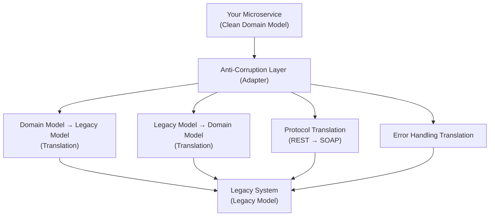
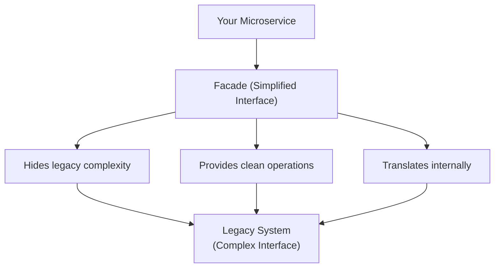
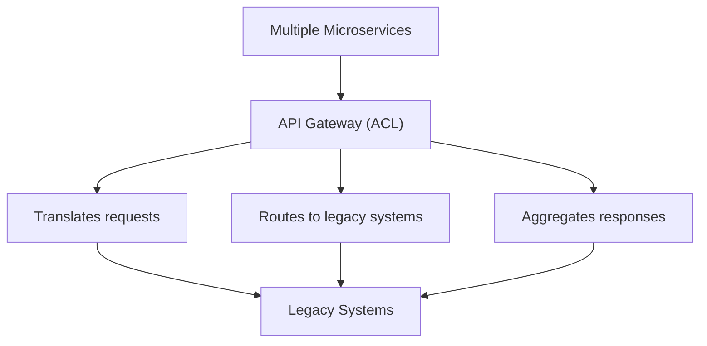

# Anti-Corruption Layer in Microservices

## 0️⃣ Prerequisites

Before diving into this topic, you need to understand:

- **Domain-Driven Design (DDD)**: Bounded contexts, domain models, and ubiquitous language (Phase 10, Topic 3)
- **Microservices Architecture**: Service independence and communication patterns (Phase 10, Topic 1)
- **API Design**: REST, gRPC, and service contracts (Phase 10, Topic 5)
- **Legacy System Integration**: Understanding of legacy systems and their constraints
- **Adapter Pattern**: Basic understanding of design patterns for translation

**Quick refresher**: In Domain-Driven Design, a bounded context defines the boundary within which a domain model is valid. Different bounded contexts can have different models for the same concept. The Anti-Corruption Layer (ACL) is a pattern that protects your domain model from being corrupted by external systems, especially legacy systems with incompatible models or APIs.

---

## 1️⃣ What Problem Does This Exist to Solve?

### The Specific Pain Point

When building microservices, you often need to integrate with:
- Legacy systems (monoliths, old databases, mainframes)
- Third-party services (payment gateways, shipping providers)
- External APIs with different data models
- Systems using different protocols or data formats

**The Problem**: These external systems have their own domain models, data structures, and APIs that don't match your microservice's domain model. Directly using their models corrupts your clean domain model.

### Real-World Example

**E-commerce System Integration:**

```
Your Order Service (Clean Domain Model):
  - Order: { orderId, customerId, items[], total, status }
  - Item: { productId, quantity, price }
  - Status: PENDING, CONFIRMED, SHIPPED, DELIVERED

Legacy Inventory System (Old Model):
  - OrderRecord: { order_num, cust_id, line_items[], order_total, state_code }
  - LineItem: { prod_code, qty, unit_price }
  - State: "P", "C", "S", "D" (single character codes)
```

**Without Anti-Corruption Layer:**

```java
// Order Service directly uses legacy model
public class OrderService {
    public void createOrder(Order order) {
        // Convert to legacy format
        LegacyOrderRecord legacyOrder = new LegacyOrderRecord();
        legacyOrder.order_num = order.getOrderId();
        legacyOrder.cust_id = order.getCustomerId();
        legacyOrder.state_code = mapStatus(order.getStatus());  // "P", "C", "S", "D"
        
        // Call legacy system
        legacyInventoryService.createOrder(legacyOrder);
        
        // Problem: Your domain model is now polluted with legacy concepts
        // Problem: Changes to legacy system break your code
        // Problem: Hard to test (depends on legacy system)
    }
}
```

**Problems:**
1. **Model Corruption**: Your clean domain model gets mixed with legacy concepts
2. **Tight Coupling**: Changes to legacy system break your microservice
3. **Testing Difficulty**: Can't test without legacy system
4. **Maintenance Burden**: Legacy quirks leak into your codebase
5. **Migration Risk**: Hard to replace legacy system later

### What Systems Looked Like Before Anti-Corruption Layer

**Direct Integration (Tight Coupling):**

```java
// Order Service directly depends on legacy model
@Service
public class OrderService {
    @Autowired
    private LegacyInventoryClient legacyClient;
    
    public void processOrder(Order order) {
        // Directly using legacy types
        LegacyOrder legacyOrder = convertToLegacy(order);
        LegacyResponse response = legacyClient.createOrder(legacyOrder);
        
        // Problem: Order Service knows about legacy structure
        // Problem: Legacy changes require Order Service changes
        // Problem: Can't evolve Order Service independently
    }
}
```

**Issues:**
- Microservice depends on legacy system's model
- Legacy system changes break microservice
- Can't test microservice in isolation
- Legacy system's quirks become your problem

### What Breaks Without Anti-Corruption Layer

**At Scale:**

```
10 microservices × 3 legacy systems each = 30 integration points
Each integration point has:
  - Legacy model knowledge
  - Legacy API quirks
  - Legacy error handling
  - Legacy retry logic
= 30 points of failure and maintenance burden
```

**Real-World Failures:**

- **Legacy System Change**: Legacy inventory system changes field name from `order_num` to `order_number`. All 10 microservices break. Need to update all services.

- **Legacy System Downtime**: Legacy system goes down. All microservices fail because they directly depend on it. No way to mock or test.

- **Model Mismatch**: Legacy system uses `customer_id` as string, your system uses UUID. Direct integration causes type errors, data corruption.

- **Protocol Mismatch**: Legacy system uses SOAP, your microservices use REST. Direct integration requires SOAP clients in every microservice.

### Real Examples of the Problem

**Netflix (Pre-Microservices)**:
- Monolithic system integrated with multiple legacy systems
- Legacy models leaked into core domain
- Hard to evolve and test
- Created Anti-Corruption Layer pattern during microservices migration

**Amazon (Early Days)**:
- Multiple legacy systems (warehouse, shipping, billing)
- Each had different models and protocols
- Created adapter layers to isolate legacy systems
- Enabled independent evolution of services

**Uber (Legacy Integration)**:
- Integrated with legacy payment processors
- Payment processor models didn't match Uber's domain
- Created Anti-Corruption Layer to isolate payment domain
- Enabled migration to new payment systems

---

## 2️⃣ Intuition and Mental Model

### The Translation Service Analogy

Think of **Anti-Corruption Layer** like a professional translation service at an international business meeting.

**Without Anti-Corruption Layer (Direct Communication):**

```
You (English speaker) need to work with:
  - Japanese partner (speaks only Japanese)
  - German partner (speaks only German)
  - French partner (speaks only French)

You try to communicate directly:
  - Learn Japanese, German, French yourself
  - Mix languages in your head
  - Confuse concepts from different languages
  - Can't think clearly in your native language anymore
```

**With Anti-Corruption Layer (Translation Service):**

```
You (English speaker) work with translation service:
  - You speak only English (your clean domain model)
  - Translation service handles:
    - Japanese partner → Translates to/from English
    - German partner → Translates to/from English
    - French partner → Translates to/from English
  - You never learn other languages
  - Your thinking stays in English
  - Translation service isolates you from language differences
```

**Anti-Corruption Layer Components:**

- **Your Domain Model**: Your native language (English)
- **External System**: Foreign language (Japanese, German, French)
- **Translation Layer**: Professional translator (Anti-Corruption Layer)
- **Isolation**: You never need to know foreign languages

### The Key Mental Model

**Anti-Corruption Layer is like a protective membrane:**

- **Your microservice** lives in its clean domain model (like speaking your native language)
- **External systems** have their own models (like speaking different languages)
- **Anti-Corruption Layer** translates between models (like a translator)
- **Isolation** means your domain model never gets corrupted (you never mix languages)

This analogy helps us understand:
- Why isolation matters (keep your model clean)
- Why translation is needed (different models)
- Why it's a separate layer (dedicated translator)
- Why it protects your domain (you stay in your language)

---

## 3️⃣ How It Works Internally

Anti-Corruption Layer follows these patterns:

### Pattern 1: Adapter-Based ACL



<details>
<summary>ASCII diagram (reference)</summary>

```text
┌─────────────────────────────────────────────────────────┐
│              ADAPTER-BASED ACL                          │
└─────────────────────────────────────────────────────────┘

Your Microservice (Clean Domain Model)
  ↓
Anti-Corruption Layer (Adapter)
  ├── Domain Model → Legacy Model (Translation)
  ├── Legacy Model → Domain Model (Translation)
  ├── Protocol Translation (REST → SOAP)
  └── Error Handling Translation
  ↓
Legacy System (Legacy Model)
```
</details>

**Components:**

1. **Domain Model**: Your clean microservice model
2. **Adapter Interface**: Defines operations your service needs
3. **Legacy Adapter**: Implements interface, translates to legacy
4. **Translation Layer**: Converts between models
5. **Legacy Client**: Communicates with legacy system

### Pattern 2: Facade-Based ACL



<details>
<summary>ASCII diagram (reference)</summary>

```text
┌─────────────────────────────────────────────────────────┐
│              FACADE-BASED ACL                            │
└─────────────────────────────────────────────────────────┘

Your Microservice
  ↓
Facade (Simplified Interface)
  ├── Hides legacy complexity
  ├── Provides clean operations
  └── Translates internally
  ↓
Legacy System (Complex Interface)
```
</details>

**Components:**

1. **Facade**: Simple interface hiding legacy complexity
2. **Translation**: Converts between models internally
3. **Legacy System**: Complex, legacy interface

### Pattern 3: Gateway-Based ACL



<details>
<summary>ASCII diagram (reference)</summary>

```text
┌─────────────────────────────────────────────────────────┐
│              GATEWAY-BASED ACL                           │
└─────────────────────────────────────────────────────────┘

Multiple Microservices
  ↓
API Gateway (ACL)
  ├── Translates requests
  ├── Routes to legacy systems
  └── Aggregates responses
  ↓
Legacy Systems
```
</details>

**Components:**

1. **API Gateway**: Central ACL for multiple services
2. **Translation**: Handles all legacy translations
3. **Routing**: Routes to appropriate legacy system
4. **Aggregation**: Combines legacy responses

---

## 4️⃣ Simulation-First Explanation

Let's trace a request through Anti-Corruption Layer:

### Scenario: Order Service Integrates with Legacy Inventory System

**Setup:**
- Order Service: Clean domain model
- Legacy Inventory System: Old model, SOAP API
- Anti-Corruption Layer: Adapter between them

**Step 1: Order Service Creates Order**

```java
// Order Service (Clean Domain Model)
public class Order {
    private UUID orderId;
    private UUID customerId;
    private List<OrderItem> items;
    private BigDecimal total;
    private OrderStatus status;  // Enum: PENDING, CONFIRMED, SHIPPED, DELIVERED
}

public class OrderItem {
    private UUID productId;
    private Integer quantity;
    private BigDecimal price;
}

// Order Service uses clean model
@Service
public class OrderService {
    @Autowired
    private InventoryServiceAdapter inventoryAdapter;  // ACL
    
    public Order createOrder(CreateOrderRequest request) {
        Order order = new Order();
        order.setOrderId(UUID.randomUUID());
        order.setCustomerId(request.getCustomerId());
        order.setItems(request.getItems());
        order.setStatus(OrderStatus.PENDING);
        
        // Call ACL, not legacy system directly
        inventoryAdapter.reserveInventory(order);
        
        return order;
    }
}
```

**Step 2: Anti-Corruption Layer Translates**

```java
// Anti-Corruption Layer Interface (Your Domain)
public interface InventoryServiceAdapter {
    void reserveInventory(Order order);
    InventoryStatus checkAvailability(UUID productId, Integer quantity);
}

// Anti-Corruption Layer Implementation (Translates to Legacy)
@Component
public class LegacyInventoryAdapter implements InventoryServiceAdapter {
    @Autowired
    private LegacyInventoryClient legacyClient;  // SOAP client
    
    @Override
    public void reserveInventory(Order order) {
        // Translate from your domain model to legacy model
        LegacyOrderRequest legacyRequest = translateToLegacy(order);
        
        // Call legacy system
        LegacyOrderResponse legacyResponse = legacyClient.reserveInventory(legacyRequest);
        
        // Translate response back to your domain model
        if (!legacyResponse.isSuccess()) {
            throw new InventoryException("Failed to reserve inventory: " + legacyResponse.getErrorCode());
        }
    }
    
    private LegacyOrderRequest translateToLegacy(Order order) {
        LegacyOrderRequest legacy = new LegacyOrderRequest();
        
        // Translate order ID: UUID → String
        legacy.setOrderNum(order.getOrderId().toString());
        
        // Translate customer ID: UUID → String
        legacy.setCustId(order.getCustomerId().toString());
        
        // Translate items
        List<LegacyLineItem> legacyItems = order.getItems().stream()
            .map(this::translateItem)
            .collect(Collectors.toList());
        legacy.setLineItems(legacyItems);
        
        // Translate status: Enum → String code
        legacy.setStateCode(translateStatus(order.getStatus()));
        
        return legacy;
    }
    
    private LegacyLineItem translateItem(OrderItem item) {
        LegacyLineItem legacy = new LegacyLineItem();
        legacy.setProdCode(item.getProductId().toString());  // UUID → String
        legacy.setQty(item.getQuantity());
        legacy.setUnitPrice(item.getPrice().doubleValue());  // BigDecimal → double
        return legacy;
    }
    
    private String translateStatus(OrderStatus status) {
        // Translate enum to legacy code
        switch (status) {
            case PENDING: return "P";
            case CONFIRMED: return "C";
            case SHIPPED: return "S";
            case DELIVERED: return "D";
            default: throw new IllegalArgumentException("Unknown status: " + status);
        }
    }
}
```

**Step 3: Legacy System Processes Request**

```java
// Legacy System (SOAP Service)
// This is what the legacy system expects
public class LegacyOrderRequest {
    private String orderNum;      // String, not UUID
    private String custId;        // String, not UUID
    private List<LegacyLineItem> lineItems;
    private String stateCode;      // "P", "C", "S", "D"
}

public class LegacyLineItem {
    private String prodCode;      // String, not UUID
    private Integer qty;
    private Double unitPrice;     // Double, not BigDecimal
}

// Legacy SOAP Client (handles protocol translation)
@Component
public class LegacyInventoryClient {
    private SoapClient soapClient;
    
    public LegacyOrderResponse reserveInventory(LegacyOrderRequest request) {
        // Convert to SOAP message
        SoapMessage soapMessage = convertToSoap(request);
        
        // Call legacy SOAP endpoint
        SoapResponse soapResponse = soapClient.call("http://legacy-inventory/soap", soapMessage);
        
        // Convert SOAP response to object
        return convertFromSoap(soapResponse);
    }
}
```

**Step 4: Response Translation**

```java
// Legacy System returns response
LegacyOrderResponse {
    success: true
    errorCode: null
    reservationId: "RES-12345"
}

// ACL translates back to domain model
@Override
public void reserveInventory(Order order) {
    LegacyOrderRequest legacyRequest = translateToLegacy(order);
    LegacyOrderResponse legacyResponse = legacyClient.reserveInventory(legacyRequest);
    
    // Translate response
    if (legacyResponse.isSuccess()) {
        // Update order with reservation ID (if needed)
        order.setReservationId(legacyResponse.getReservationId());
    } else {
        // Translate legacy error to domain exception
        throw translateError(legacyResponse.getErrorCode());
    }
}

private InventoryException translateError(String legacyErrorCode) {
    // Translate legacy error codes to domain exceptions
    switch (legacyErrorCode) {
        case "INV-001": return new OutOfStockException("Product out of stock");
        case "INV-002": return new InvalidProductException("Invalid product");
        default: return new InventoryException("Inventory error: " + legacyErrorCode);
    }
}
```

**Key Points:**
- Order Service never sees legacy model
- ACL handles all translation
- Order Service stays clean
- Legacy changes only affect ACL

---

## 5️⃣ How Engineers Actually Use This in Production

### Real-World Implementation: Spring Boot ACL

**Architecture:**

```
Order Service (Clean Domain)
  ↓
Inventory Service Adapter (ACL)
  ├── Domain Model Translation
  ├── Protocol Translation (REST → SOAP)
  └── Error Translation
  ↓
Legacy Inventory System (SOAP)
```

**Domain Model (Order Service):**

```java
// Clean domain model
public class Order {
    private UUID orderId;
    private UUID customerId;
    private List<OrderItem> items;
    private OrderStatus status;
}

public enum OrderStatus {
    PENDING, CONFIRMED, SHIPPED, DELIVERED
}
```

**ACL Interface:**

```java
// Interface in your domain language
public interface InventoryService {
    ReservationResult reserveInventory(Order order);
    AvailabilityStatus checkAvailability(UUID productId, Integer quantity);
    void releaseReservation(UUID reservationId);
}
```

**ACL Implementation:**

```java
// Adapter implementation
@Component
public class LegacyInventoryAdapter implements InventoryService {
    private final LegacyInventorySoapClient legacyClient;
    private final ModelTranslator translator;
    
    @Autowired
    public LegacyInventoryAdapter(
            LegacyInventorySoapClient legacyClient,
            ModelTranslator translator) {
        this.legacyClient = legacyClient;
        this.translator = translator;
    }
    
    @Override
    public ReservationResult reserveInventory(Order order) {
        try {
            // Translate domain model to legacy model
            LegacyReservationRequest legacyRequest = 
                translator.toLegacyReservationRequest(order);
            
            // Call legacy system
            LegacyReservationResponse legacyResponse = 
                legacyClient.reserve(legacyRequest);
            
            // Translate legacy response to domain model
            return translator.toReservationResult(legacyResponse);
            
        } catch (LegacySystemException e) {
            // Translate legacy exceptions to domain exceptions
            throw translateException(e);
        }
    }
    
    private InventoryException translateException(LegacySystemException e) {
        // Map legacy error codes to domain exceptions
        String errorCode = e.getErrorCode();
        if ("INV-001".equals(errorCode)) {
            return new OutOfStockException(e.getMessage());
        }
        return new InventoryException("Legacy system error: " + errorCode);
    }
}
```

**Translation Layer:**

```java
@Component
public class ModelTranslator {
    
    public LegacyReservationRequest toLegacyReservationRequest(Order order) {
        LegacyReservationRequest legacy = new LegacyReservationRequest();
        
        // Translate IDs: UUID → String
        legacy.setOrderNum(order.getOrderId().toString());
        legacy.setCustId(order.getCustomerId().toString());
        
        // Translate items
        List<LegacyLineItem> legacyItems = order.getItems().stream()
            .map(this::toLegacyLineItem)
            .collect(Collectors.toList());
        legacy.setLineItems(legacyItems);
        
        // Translate status: Enum → String code
        legacy.setStateCode(statusToCode(order.getStatus()));
        
        return legacy;
    }
    
    public ReservationResult toReservationResult(LegacyReservationResponse legacy) {
        ReservationResult result = new ReservationResult();
        result.setReservationId(UUID.fromString(legacy.getReservationId()));
        result.setSuccess(legacy.isSuccess());
        return result;
    }
    
    private LegacyLineItem toLegacyLineItem(OrderItem item) {
        LegacyLineItem legacy = new LegacyLineItem();
        legacy.setProdCode(item.getProductId().toString());
        legacy.setQty(item.getQuantity());
        legacy.setUnitPrice(item.getPrice().doubleValue());
        return legacy;
    }
    
    private String statusToCode(OrderStatus status) {
        return switch (status) {
            case PENDING -> "P";
            case CONFIRMED -> "C";
            case SHIPPED -> "S";
            case DELIVERED -> "D";
        };
    }
}
```

**Legacy Client (SOAP):**

```java
// SOAP client for legacy system
@Component
public class LegacyInventorySoapClient {
    private final JaxWsPortProxyFactoryBean soapFactory;
    
    public LegacyReservationResponse reserve(LegacyReservationRequest request) {
        InventoryServicePort port = (InventoryServicePort) soapFactory.getObject();
        return port.reserveInventory(request);
    }
}
```

**Order Service Usage:**

```java
// Order Service uses clean interface
@Service
public class OrderService {
    @Autowired
    private InventoryService inventoryService;  // ACL interface
    
    public Order createOrder(CreateOrderRequest request) {
        Order order = createOrderFromRequest(request);
        
        // Call ACL, not legacy system
        ReservationResult result = inventoryService.reserveInventory(order);
        
        if (!result.isSuccess()) {
            throw new OrderCreationException("Failed to reserve inventory");
        }
        
        order.setReservationId(result.getReservationId());
        return orderRepository.save(order);
    }
}
```

### Netflix Implementation

Netflix uses Anti-Corruption Layer extensively:

1. **Legacy Billing System**: ACL translates between Netflix domain model and legacy billing system
2. **Content Delivery**: ACL isolates content delivery from legacy CDN systems
3. **Payment Processing**: ACL translates between Netflix payment domain and multiple payment processors

### Amazon Implementation

Amazon uses ACL for:

1. **Warehouse Systems**: ACL translates between Amazon order domain and legacy warehouse systems
2. **Shipping Providers**: ACL isolates Amazon shipping logic from third-party shipping APIs
3. **Payment Gateways**: ACL translates between Amazon payment domain and multiple payment processors

---

## 6️⃣ How to Implement or Apply It

### Step-by-Step: Creating Anti-Corruption Layer

**Step 1: Define Domain Interface**

```java
// Define interface in your domain language
public interface ExternalInventoryService {
    ReservationResult reserveInventory(Order order);
    void releaseReservation(UUID reservationId);
    AvailabilityStatus checkAvailability(UUID productId, Integer quantity);
}
```

**Step 2: Create Translation Layer**

```java
@Component
public class LegacyModelTranslator {
    
    // Domain → Legacy
    public LegacyOrderRequest toLegacyRequest(Order order) {
        LegacyOrderRequest legacy = new LegacyOrderRequest();
        legacy.setOrderNum(order.getOrderId().toString());
        legacy.setCustId(order.getCustomerId().toString());
        legacy.setLineItems(translateItems(order.getItems()));
        legacy.setStateCode(translateStatus(order.getStatus()));
        return legacy;
    }
    
    // Legacy → Domain
    public ReservationResult toReservationResult(LegacyOrderResponse legacy) {
        ReservationResult result = new ReservationResult();
        result.setReservationId(UUID.fromString(legacy.getReservationId()));
        result.setSuccess(legacy.isSuccess());
        if (!legacy.isSuccess()) {
            result.setErrorMessage(translateError(legacy.getErrorCode()));
        }
        return result;
    }
    
    private List<LegacyLineItem> translateItems(List<OrderItem> items) {
        return items.stream()
            .map(item -> {
                LegacyLineItem legacy = new LegacyLineItem();
                legacy.setProdCode(item.getProductId().toString());
                legacy.setQty(item.getQuantity());
                legacy.setUnitPrice(item.getPrice().doubleValue());
                return legacy;
            })
            .collect(Collectors.toList());
    }
    
    private String translateStatus(OrderStatus status) {
        return switch (status) {
            case PENDING -> "P";
            case CONFIRMED -> "C";
            case SHIPPED -> "S";
            case DELIVERED -> "D";
        };
    }
    
    private String translateError(String legacyErrorCode) {
        return switch (legacyErrorCode) {
            case "INV-001" -> "Product out of stock";
            case "INV-002" -> "Invalid product ID";
            case "INV-003" -> "Insufficient quantity";
            default -> "Inventory error: " + legacyErrorCode;
        };
    }
}
```

**Step 3: Implement ACL Adapter**

```java
@Component
public class LegacyInventoryAdapter implements ExternalInventoryService {
    private final LegacyInventoryClient legacyClient;
    private final LegacyModelTranslator translator;
    
    @Autowired
    public LegacyInventoryAdapter(
            LegacyInventoryClient legacyClient,
            LegacyModelTranslator translator) {
        this.legacyClient = legacyClient;
        this.translator = translator;
    }
    
    @Override
    public ReservationResult reserveInventory(Order order) {
        try {
            // Translate to legacy model
            LegacyOrderRequest legacyRequest = translator.toLegacyRequest(order);
            
            // Call legacy system
            LegacyOrderResponse legacyResponse = legacyClient.reserve(legacyRequest);
            
            // Translate response
            return translator.toReservationResult(legacyResponse);
            
        } catch (LegacySystemException e) {
            // Translate legacy exceptions
            throw new InventoryException(
                "Failed to reserve inventory: " + e.getMessage(),
                e
            );
        }
    }
    
    @Override
    public void releaseReservation(UUID reservationId) {
        try {
            LegacyReleaseRequest legacyRequest = new LegacyReleaseRequest();
            legacyRequest.setReservationId(reservationId.toString());
            legacyClient.release(legacyRequest);
        } catch (LegacySystemException e) {
            throw new InventoryException("Failed to release reservation", e);
        }
    }
    
    @Override
    public AvailabilityStatus checkAvailability(UUID productId, Integer quantity) {
        try {
            LegacyAvailabilityRequest legacyRequest = new LegacyAvailabilityRequest();
            legacyRequest.setProdCode(productId.toString());
            legacyRequest.setQty(quantity);
            
            LegacyAvailabilityResponse legacyResponse = 
                legacyClient.checkAvailability(legacyRequest);
            
            AvailabilityStatus status = new AvailabilityStatus();
            status.setAvailable(legacyResponse.isAvailable());
            status.setAvailableQuantity(legacyResponse.getAvailableQty());
            return status;
        } catch (LegacySystemException e) {
            throw new InventoryException("Failed to check availability", e);
        }
    }
}
```

**Step 4: Configure Legacy Client**

```java
// Legacy SOAP client configuration
@Configuration
public class LegacyInventoryConfig {
    
    @Bean
    public LegacyInventoryClient legacyInventoryClient() {
        JaxWsPortProxyFactoryBean factory = new JaxWsPortProxyFactoryBean();
        factory.setServiceInterface(LegacyInventoryPort.class);
        factory.setWsdlDocumentUrl("http://legacy-inventory/wsdl");
        factory.setNamespaceUri("http://legacy-inventory/");
        factory.afterPropertiesSet();
        
        return new LegacyInventoryClient((LegacyInventoryPort) factory.getObject());
    }
}
```

**Step 5: Use ACL in Service**

```java
// Order Service uses ACL interface
@Service
public class OrderService {
    @Autowired
    private ExternalInventoryService inventoryService;  // ACL, not legacy client
    
    public Order createOrder(CreateOrderRequest request) {
        Order order = buildOrder(request);
        
        // Call ACL interface
        ReservationResult result = inventoryService.reserveInventory(order);
        
        if (!result.isSuccess()) {
            throw new OrderCreationException(result.getErrorMessage());
        }
        
        order.setReservationId(result.getReservationId());
        return orderRepository.save(order);
    }
}
```

**Step 6: Testing ACL**

```java
// Test ACL in isolation
@SpringBootTest
class LegacyInventoryAdapterTest {
    
    @MockBean
    private LegacyInventoryClient legacyClient;
    
    @Autowired
    private LegacyInventoryAdapter adapter;
    
    @Test
    void testReserveInventory() {
        // Given
        Order order = new Order();
        order.setOrderId(UUID.randomUUID());
        order.setCustomerId(UUID.randomUUID());
        order.setStatus(OrderStatus.PENDING);
        
        LegacyOrderResponse legacyResponse = new LegacyOrderResponse();
        legacyResponse.setSuccess(true);
        legacyResponse.setReservationId("RES-123");
        
        when(legacyClient.reserve(any())).thenReturn(legacyResponse);
        
        // When
        ReservationResult result = adapter.reserveInventory(order);
        
        // Then
        assertTrue(result.isSuccess());
        assertEquals("RES-123", result.getReservationId().toString());
        verify(legacyClient).reserve(any(LegacyOrderRequest.class));
    }
}
```

---

## 7️⃣ Tradeoffs, Pitfalls, and Common Mistakes

### Tradeoffs

**Advantages:**
- **Domain Model Protection**: Keeps your domain model clean
- **Isolation**: Changes to legacy system don't affect your service
- **Testability**: Can test service without legacy system
- **Evolution**: Can replace legacy system without changing service code
- **Maintainability**: Legacy quirks isolated in one place

**Disadvantages:**
- **Additional Layer**: Extra code to maintain
- **Translation Overhead**: Performance cost of translation
- **Complexity**: More moving parts
- **Duplication**: May duplicate some logic

### Common Pitfalls

**Pitfall 1: Leaking Legacy Concepts**

```java
// BAD: Legacy concepts leak into domain
public class Order {
    private String orderNum;  // Legacy field name
    private String stateCode;  // Legacy status format
}
```

**Solution**: Keep domain model clean, translate in ACL only.

**Pitfall 2: Direct Legacy Dependencies**

```java
// BAD: Service depends on legacy types
@Service
public class OrderService {
    @Autowired
    private LegacyInventoryClient legacyClient;  // Direct dependency
    
    public void createOrder(Order order) {
        LegacyOrderRequest request = new LegacyOrderRequest();  // Legacy type
        legacyClient.reserve(request);
    }
}
```

**Solution**: Use ACL interface, never expose legacy types.

**Pitfall 3: Incomplete Translation**

```java
// BAD: Missing error translation
@Override
public ReservationResult reserveInventory(Order order) {
    LegacyOrderResponse response = legacyClient.reserve(translate(order));
    return new ReservationResult(response.isSuccess());  // Lost error details
}
```

**Solution**: Translate all aspects, including errors.

**Pitfall 4: No Abstraction**

```java
// BAD: ACL is just a pass-through
@Override
public ReservationResult reserveInventory(Order order) {
    return legacyClient.reserve(order);  // No translation
}
```

**Solution**: ACL must translate models, not just pass through.

**Pitfall 5: Testing with Real Legacy System**

```java
// BAD: Tests depend on legacy system
@Test
void testReserveInventory() {
    LegacyInventoryAdapter adapter = new LegacyInventoryAdapter(realLegacyClient);
    // Test fails if legacy system is down
}
```

**Solution**: Mock legacy client in tests.

### Performance Considerations

**Translation Overhead:**
- Model translation adds CPU cost
- For high-throughput systems, consider caching translations
- Batch operations reduce translation overhead

**Network Calls:**
- ACL adds network hop if legacy system is remote
- Consider async operations for non-critical paths
- Implement circuit breakers for legacy system failures

---

## 8️⃣ When NOT to Use This

### Anti-Patterns and Misuse Cases

**Don't use Anti-Corruption Layer for:**

**1. Modern, Well-Designed APIs**

If external system has clean API matching your domain, ACL is overkill:

```java
// External system already uses your domain model
// No need for ACL
@Autowired
private ModernPaymentService paymentService;  // Clean API, no ACL needed
```

**2. Simple Data Transformation**

If transformation is trivial (just field mapping), consider if ACL is worth it:

```java
// Simple mapping, might not need full ACL
public PaymentRequest toPaymentRequest(Order order) {
    return PaymentRequest.builder()
        .orderId(order.getOrderId())
        .amount(order.getTotal())
        .build();
}
```

**3. Temporary Integrations**

If integration is temporary, ACL might be overkill. But consider future maintenance.

### Situations Where This is Overkill

**Single Field Mapping:**
- If only translating one field, full ACL might be excessive
- Consider simple mapper instead

**Read-Only Integration:**
- If only reading data, simpler translation might suffice
- But still consider isolation benefits

### Better Alternatives for Specific Scenarios

**API Gateway Pattern:**
- For multiple services integrating with same legacy system
- Centralize ACL in API Gateway
- Services call gateway, gateway handles legacy translation

**Event-Driven Integration:**
- Instead of direct calls, use events
- Legacy system publishes events in its format
- ACL subscribes, translates, publishes in your format
- Better decoupling

---

## 9️⃣ Comparison with Alternatives

### Anti-Corruption Layer vs Direct Integration

| Aspect | Direct Integration | Anti-Corruption Layer |
|--------|-------------------|----------------------|
| **Coupling** | Tight (depends on legacy model) | Loose (depends on interface) |
| **Testability** | Hard (needs legacy system) | Easy (mock interface) |
| **Maintainability** | Low (legacy changes break service) | High (legacy changes isolated) |
| **Complexity** | Low (no translation layer) | Medium (translation layer) |
| **Evolution** | Hard (can't replace legacy) | Easy (replace ACL implementation) |

### Anti-Corruption Layer vs API Gateway

**Anti-Corruption Layer:**
- Per-service translation
- Service-specific logic
- More granular control

**API Gateway:**
- Centralized translation
- Shared across services
- Single point of translation

**Use both**: API Gateway for external clients, ACL for service-to-legacy integration.

### Anti-Corruption Layer vs Adapter Pattern

**Adapter Pattern:**
- General design pattern
- Adapts interface to another interface
- Can be used for any interface mismatch

**Anti-Corruption Layer:**
- Specific DDD pattern
- Protects domain model from corruption
- Focuses on model translation, not just interface

**ACL uses Adapter Pattern** but with specific purpose: domain protection.

---

## 🔟 Interview Follow-up Questions WITH Answers

### L4 Level Questions

**Q1: What is Anti-Corruption Layer in microservices?**

**Answer**: Anti-Corruption Layer (ACL) is a pattern that protects your microservice's clean domain model from being corrupted by external systems, especially legacy systems. It acts as a translation layer between your domain model and external system's model. Instead of your service directly using legacy models, ACL translates between models, keeping your service clean and isolated from legacy system changes.

**Q2: When would you use Anti-Corruption Layer?**

**Answer**: Use ACL when:
1. Integrating with legacy systems that have incompatible models
2. Integrating with third-party services with different data structures
3. You want to protect your domain model from external system changes
4. You need to test your service without external system
5. You plan to replace external system in future

**Q3: What's the difference between Anti-Corruption Layer and Adapter Pattern?**

**Answer**: Adapter Pattern is a general design pattern for adapting one interface to another. Anti-Corruption Layer is a specific Domain-Driven Design pattern that uses Adapter Pattern but with specific purpose: protecting domain model from corruption. ACL focuses on model translation and domain isolation, while Adapter Pattern is more general interface adaptation.

### L5 Level Questions

**Q4: How do you implement Anti-Corruption Layer for a legacy SOAP service?**

**Answer**:
1. **Define Domain Interface**: Create interface in your domain language (e.g., `InventoryService`)
2. **Create Translation Layer**: Build translator that converts between domain model and legacy SOAP model
3. **Implement ACL Adapter**: Implement domain interface, translate models, call legacy SOAP client
4. **Configure Legacy Client**: Set up SOAP client for legacy system
5. **Use ACL in Service**: Service depends on domain interface, not legacy client

Example:
```java
// Domain interface
public interface InventoryService {
    ReservationResult reserveInventory(Order order);
}

// ACL implementation
@Component
public class LegacyInventoryAdapter implements InventoryService {
    private LegacySoapClient legacyClient;
    private ModelTranslator translator;
    
    public ReservationResult reserveInventory(Order order) {
        LegacyRequest legacyReq = translator.toLegacy(order);
        LegacyResponse legacyResp = legacyClient.reserve(legacyReq);
        return translator.toDomain(legacyResp);
    }
}
```

**Q5: How do you handle errors from legacy system in Anti-Corruption Layer?**

**Answer**:
1. **Translate Error Codes**: Map legacy error codes to domain exceptions
2. **Translate Error Messages**: Convert legacy error messages to domain language
3. **Wrap Exceptions**: Wrap legacy exceptions in domain exceptions
4. **Preserve Context**: Include relevant context in translated errors

Example:
```java
try {
    LegacyResponse response = legacyClient.reserve(request);
    return translateResponse(response);
} catch (LegacySystemException e) {
    // Translate legacy error to domain exception
    if ("INV-001".equals(e.getErrorCode())) {
        throw new OutOfStockException(e.getMessage());
    }
    throw new InventoryException("Legacy system error: " + e.getErrorCode(), e);
}
```

**Q6: How do you test Anti-Corruption Layer?**

**Answer**:
1. **Mock Legacy Client**: Mock the legacy system client
2. **Test Translation**: Test that domain model correctly translates to legacy model
3. **Test Response Translation**: Test that legacy response correctly translates to domain model
4. **Test Error Translation**: Test that legacy errors translate to domain exceptions
5. **Integration Tests**: Optional integration tests with real legacy system (in staging)

Example:
```java
@SpringBootTest
class LegacyInventoryAdapterTest {
    @MockBean
    private LegacyInventoryClient legacyClient;
    
    @Autowired
    private LegacyInventoryAdapter adapter;
    
    @Test
    void testReserveInventory() {
        Order order = createTestOrder();
        LegacyResponse mockResponse = createMockResponse();
        when(legacyClient.reserve(any())).thenReturn(mockResponse);
        
        ReservationResult result = adapter.reserveInventory(order);
        
        assertTrue(result.isSuccess());
        verify(legacyClient).reserve(argThat(req -> 
            req.getOrderNum().equals(order.getOrderId().toString())
        ));
    }
}
```

### L6 Level Questions

**Q7: You're integrating 10 microservices with a legacy mainframe system. How do you design Anti-Corruption Layer architecture?**

**Answer**:

**Option 1: Per-Service ACL (Recommended for Different Models)**
- Each service has its own ACL
- Each ACL translates to service-specific domain model
- Best when each service needs different translation

**Option 2: Shared ACL Service (Recommended for Common Translation)**
- Single ACL service handles all legacy integration
- Services call ACL service, ACL service calls legacy
- Best when translation logic is shared
- Reduces duplication

**Option 3: API Gateway ACL (Recommended for External Access)**
- API Gateway contains ACL
- Services call gateway, gateway translates and calls legacy
- Best for external-facing services
- Centralizes legacy integration

**Recommendation:**
- Start with per-service ACL for flexibility
- If translation logic is similar, extract to shared ACL service
- Use API Gateway ACL for external clients
- Consider event-driven integration for better decoupling

**Q8: How do you handle versioning when legacy system changes its API?**

**Answer**:
1. **Version ACL Implementation**: Create new ACL implementation for new legacy version
2. **Feature Flags**: Use feature flags to switch between old and new ACL
3. **Gradual Migration**: Migrate services one by one to new ACL
4. **Dual Support**: Support both versions during transition
5. **Deprecation**: Deprecate old ACL after migration

Example:
```java
@Component
public class LegacyInventoryAdapterFactory {
    @Value("${legacy.inventory.version}")
    private String legacyVersion;
    
    public InventoryService createAdapter() {
        if ("v2".equals(legacyVersion)) {
            return new LegacyInventoryAdapterV2();
        }
        return new LegacyInventoryAdapterV1();
    }
}
```

**Q9: Compare Anti-Corruption Layer with Strangler Pattern for legacy system migration.**

**Answer**:

**Anti-Corruption Layer:**
- **Purpose**: Isolate legacy system, protect domain model
- **Approach**: Translation layer between services and legacy
- **Use Case**: Long-term integration with legacy system
- **Benefit**: Clean domain model, isolated changes

**Strangler Pattern:**
- **Purpose**: Gradually replace legacy system
- **Approach**: Incrementally route traffic from legacy to new system
- **Use Case**: Migrating away from legacy system
- **Benefit**: Low-risk migration, gradual replacement

**Relationship:**
- Use ACL during strangler migration
- ACL translates between new system and legacy
- As you strangle legacy, ACL adapts
- Eventually, ACL becomes unnecessary when legacy is fully replaced

**Combined Approach:**
1. Start with ACL to isolate legacy
2. Build new system with clean domain
3. Use Strangler Pattern to migrate functionality
4. ACL handles translation during migration
5. Remove ACL when legacy is fully replaced

---

## 1️⃣1️⃣ One Clean Mental Summary

Anti-Corruption Layer is like a professional translation service that protects your microservice's clean domain model from being corrupted by external systems, especially legacy systems. Your microservice speaks its native language (clean domain model), external systems speak different languages (legacy models), and the ACL translates between them (like a translator). This isolation means your domain model stays clean, legacy system changes don't break your service, you can test without the legacy system, and you can replace the legacy system later by just changing the ACL implementation. The ACL consists of a domain interface (what your service needs), a translation layer (converts between models), and an adapter implementation (calls legacy system). Use ACL when integrating with legacy systems, third-party services with incompatible models, or when you need to protect your domain model. Don't use it for modern, well-designed APIs that already match your domain model. The key is isolation: your service never sees legacy models, only clean domain models.

