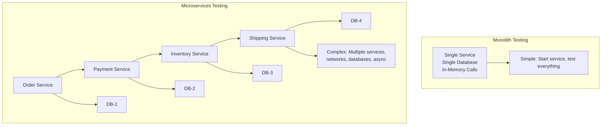
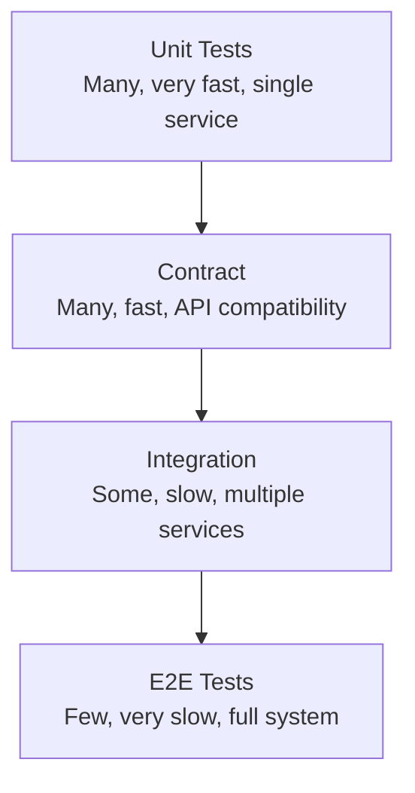
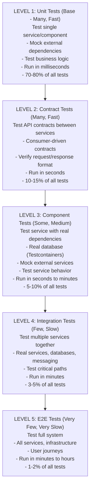

# Microservices Testing Strategies

## 0️⃣ Prerequisites

Before diving into this topic, you need to understand:

- **Testing Basics**: Unit tests, integration tests, mocking (Phase 7, Topic 17)
- **Microservices Fundamentals**: Service independence, communication patterns (Phase 10, Topic 1, Topic 6)
- **Contract Testing**: Consumer-driven contracts, Pact framework (Phase 10, Topic 19)
- **Service Communication**: REST, gRPC, messaging (Phase 10, Topic 5, Topic 6)
- **Database per Service**: Data isolation, eventual consistency (Phase 10, Topic 7)
- **Test Containers**: Docker-based testing (Phase 11, Topic 2)

**Quick refresher**: Testing microservices is more complex than testing monoliths. Services are deployed independently, communicate over networks, have separate databases, and evolve at different rates. This topic covers comprehensive testing strategies specifically for microservices architecture.

---

## 1️⃣ What Problem Does This Exist to Solve?

### The Specific Pain Point

In a microservices architecture, testing becomes exponentially more complex:



<details>
<summary>ASCII diagram (reference)</summary>

```text
Monolith Testing:
  ┌──────────────────┐
  │  Single Service  │
  │  Single Database │
  │  In-Memory Calls │
  └──────────────────┘
  → Simple: Start service, test everything

Microservices Testing:
  ┌──────┐    ┌──────┐    ┌──────┐    ┌──────┐
  │Order │───▶│Payment│───▶│Inventory│───▶│Shipping│
  │Service│    │Service│    │Service │    │Service │
  └──────┘    └──────┘    └──────┘    └──────┘
     │           │            │            │
     ▼           ▼            ▼            ▼
   DB-1        DB-2         DB-3         DB-4
  → Complex: Multiple services, networks, databases, async
```
</details>

**The Problems:**

1. **Too Many Integration Points**: Each service depends on multiple others
2. **Slow Tests**: Starting all services takes minutes/hours
3. **Flaky Tests**: Network issues, timing problems, service dependencies
4. **Test Data Management**: Each service has its own database
5. **Independent Deployments**: Services evolve at different rates
6. **Async Communication**: Events, message queues add complexity
7. **Environment Complexity**: Need service discovery, API gateways, message brokers

### What Systems Looked Like Before Microservices Testing Strategies

**Traditional Integration Testing (Monolith Style):**

```java
// ❌ BAD: Start all services for every test
@SpringBootTest
class OrderIntegrationTest {
    @Autowired
    private OrderService orderService;
    
    @Test
    void testCreateOrder() {
        // Requires:
        // - Payment Service running
        // - Inventory Service running
        // - Shipping Service running
        // - All databases running
        // - Message broker running
        // - Service discovery running
        // → Takes 5 minutes to start
        // → Test fails if any service is down
        // → Cannot run in parallel
    }
}
```

**Problems:**
- Tests are slow (minutes to start environment)
- Tests are brittle (fail if any service is down)
- Tests are expensive (requires full infrastructure)
- Tests don't scale (can't run many in parallel)
- Tests are hard to debug (which service failed?)
- Tests block development (waiting for environment)

### What Breaks Without Proper Testing Strategies

**Scenario 1: Slow Feedback Loop**

```
Developer makes change to Order Service
→ Runs tests
→ Tests start Payment Service (30 seconds)
→ Tests start Inventory Service (30 seconds)
→ Tests start Shipping Service (30 seconds)
→ Tests start databases (20 seconds)
→ Tests start Kafka (10 seconds)
→ Actual test runs (2 seconds)
→ Total: 2+ minutes per test run
→ Developer waits 2 minutes for feedback
→ Productivity killed ❌
```

**Scenario 2: Flaky Tests**

```
Test fails randomly:
  - Network timeout (Payment Service slow to respond)
  - Database connection pool exhausted
  - Message broker not ready
  - Service discovery cache stale
  - Timing issues (async operations)

Developer sees:
  - Test passed locally ✅
  - Test failed in CI ❌
  - Test passed on retry ✅
  - No confidence in tests ❌
```

**Scenario 3: Test Coupling**

```
Order Service test depends on:
  - Payment Service implementation
  - Inventory Service schema
  - Shipping Service API version

Payment Service changes internally:
  → Order Service tests break
  → Order Service team blocked
  → Coordination overhead
  → Slow development ❌
```

### Real Examples of the Problem

**Netflix (2015)**:
- Hundreds of microservices
- Integration tests took hours to run
- Tests were flaky due to service dependencies
- Adopted contract testing and test pyramid strategies
- Reduced test time from hours to minutes

**Amazon (2014)**:
- Thousands of services
- Full integration tests impossible
- Adopted unit tests + contract tests + selective integration tests
- Enabled independent service deployments

**Uber (2016)**:
- Services evolved rapidly
- Integration tests blocked deployments
- Created testing framework for microservices
- Focused on fast, isolated tests with selective integration

---

## 2️⃣ Intuition and Mental Model

### The Restaurant Quality Control Analogy

Think of **microservices testing** like quality control in a restaurant chain.

**Monolith Testing (Single Restaurant):**

```
One restaurant:
  - Test kitchen (unit tests)
  - Test full meal service (integration test)
  - Test customer experience (E2E test)
  → Simple: Everything in one place
```

**Microservices Testing (Restaurant Chain):**

```
Multiple restaurants (services):
  - Order-taking restaurant
  - Kitchen restaurant
  - Delivery restaurant
  - Payment restaurant

Quality Control Strategy:
  1. Test each restaurant independently (unit tests)
     - Order restaurant: Can take orders correctly?
     - Kitchen restaurant: Can cook correctly?
  
  2. Test contracts between restaurants (contract tests)
     - Order → Kitchen: Order format correct?
     - Kitchen → Delivery: Food ready format correct?
  
  3. Test integration (integration tests)
     - Order → Kitchen → Delivery: Full flow works?
     - Run occasionally (expensive)
  
  4. Test customer experience (E2E tests)
     - Full chain: Order → Cook → Deliver → Pay
     - Run rarely (very expensive)
```

### The Key Mental Model

**Microservices testing follows a pyramid with multiple layers:**



<details>
<summary>ASCII diagram (reference)</summary>

```text
                    ┌─────────────┐
                    │  E2E Tests  │  Few, very slow, full system
                    ├─────────────┤
                    │ Integration │  Some, slow, multiple services
                    ├─────────────┤
                    │  Contract   │  Many, fast, API compatibility
                    ├─────────────┤
                    │  Unit Tests │  Many, very fast, single service
                    └─────────────┘
```
</details>

**Key Principles:**

1. **Test in Isolation**: Each service tests itself independently
2. **Test Contracts**: Services agree on APIs via contract tests
3. **Test Integration Selectively**: Only test critical paths together
4. **Test End-to-End Rarely**: Full system tests are expensive
5. **Fast Feedback**: Most tests should run in seconds
6. **Parallel Execution**: Tests should run independently, in parallel

---

## 3️⃣ How It Works Internally

### The Test Pyramid for Microservices



<details>
<summary>ASCII diagram (reference)</summary>

```text
LEVEL 1: Unit Tests (Base - Many, Fast)
  ┌─────────────────────────────────────────┐
  │  Test single service/component          │
  │  - Mock external dependencies           │
  │  - Test business logic                  │
  │  - Run in milliseconds                  │
  │  - 70-80% of all tests                  │
  └─────────────────────────────────────────┘

LEVEL 2: Contract Tests (Many, Fast)
  ┌─────────────────────────────────────────┐
  │  Test API contracts between services    │
  │  - Consumer-driven contracts            │
  │  - Verify request/response format       │
  │  - Run in seconds                       │
  │  - 10-15% of all tests                  │
  └─────────────────────────────────────────┘

LEVEL 3: Component Tests (Some, Medium)
  ┌─────────────────────────────────────────┐
  │  Test service with real dependencies    │
  │  - Real database (Testcontainers)       │
  │  - Mock external services               │
  │  - Test service behavior                │
  │  - Run in seconds to minutes            │
  │  - 5-10% of all tests                   │
  └─────────────────────────────────────────┘

LEVEL 4: Integration Tests (Few, Slow)
  ┌─────────────────────────────────────────┐
  │  Test multiple services together        │
  │  - Real services, databases, messaging  │
  │  - Test critical paths                  │
  │  - Run in minutes                       │
  │  - 3-5% of all tests                    │
  └─────────────────────────────────────────┘

LEVEL 5: E2E Tests (Very Few, Very Slow)
  ┌─────────────────────────────────────────┐
  │  Test full system                       │
  │  - All services, infrastructure         │
  │  - User journeys                        │
  │  - Run in minutes to hours              │
  │  - 1-2% of all tests                    │
  └─────────────────────────────────────────┘
```
</details>

### Testing Strategy by Service Type

**1. Service with Database (e.g., Order Service)**

```
Unit Tests:
  - Test OrderService logic
  - Mock OrderRepository
  - Fast, isolated

Component Tests:
  - Test OrderService + OrderRepository
  - Real database (Testcontainers)
  - Test database interactions

Contract Tests:
  - Test OrderService API contract
  - Verify request/response format

Integration Tests:
  - Test OrderService + PaymentService
  - Real services, mocked others
  - Test critical flows
```

**2. Service with External API (e.g., Payment Service)**

```
Unit Tests:
  - Test PaymentService logic
  - Mock external payment gateway
  - Test error handling

Contract Tests:
  - Test PaymentService API contract
  - Verify consumers' expectations

Component Tests:
  - Test PaymentService + external gateway mock
  - Test retry logic, timeouts

Integration Tests:
  - Test with real external gateway (staging)
  - Test payment flows
```

**3. Event-Driven Service (e.g., Notification Service)**

```
Unit Tests:
  - Test event handlers
  - Mock message broker
  - Test event processing logic

Contract Tests:
  - Test event schema contracts
  - Verify event format

Component Tests:
  - Test service + Kafka (Testcontainers)
  - Test event consumption
  - Test event publishing

Integration Tests:
  - Test event flow across services
  - Test event ordering, idempotency
```

---

## 4️⃣ Simulation-First Explanation

Let's walk through testing an order creation flow:

### Scenario: Create Order Flow

**Services Involved:**
- Order Service (creates order)
- Payment Service (processes payment)
- Inventory Service (reserves inventory)
- Notification Service (sends email) - async

**Step 1: Unit Test - Order Service Logic**

```java
// Order Service - Unit Test
@ExtendWith(MockitoExtension.class)
class OrderServiceTest {
    
    @Mock
    private PaymentClient paymentClient;
    
    @Mock
    private InventoryClient inventoryClient;
    
    @Mock
    private OrderRepository orderRepository;
    
    @InjectMocks
    private OrderService orderService;
    
    @Test
    void shouldCreateOrder() {
        // Given
        CreateOrderRequest request = new CreateOrderRequest("user123", List.of("item1"));
        when(inventoryClient.reserve("item1", 1)).thenReturn(ReservationResponse.success());
        when(paymentClient.processPayment(any())).thenReturn(PaymentResponse.success("txn-123"));
        when(orderRepository.save(any())).thenAnswer(invocation -> invocation.getArgument(0));
        
        // When
        Order order = orderService.createOrder(request);
        
        // Then
        assertNotNull(order);
        assertEquals("user123", order.getUserId());
        assertEquals(OrderStatus.CREATED, order.getStatus());
        verify(paymentClient).processPayment(any());
        verify(inventoryClient).reserve("item1", 1);
    }
    
    @Test
    void shouldFailWhenInventoryUnavailable() {
        // Given
        CreateOrderRequest request = new CreateOrderRequest("user123", List.of("item1"));
        when(inventoryClient.reserve("item1", 1))
            .thenReturn(ReservationResponse.unavailable());
        
        // When/Then
        assertThrows(InventoryUnavailableException.class, 
            () -> orderService.createOrder(request));
        verify(paymentClient, never()).processPayment(any());
    }
}
```

**What This Tests:**
- OrderService business logic
- Error handling
- Service interactions (mocked)
- Fast: Runs in milliseconds
- Isolated: No external dependencies

**Step 2: Contract Test - Order Service API**

```java
// Order Service - Contract Test (Consumer: Frontend)
@ExtendWith(PactConsumerTestExt.class)
@PactTestFor(providerName = "OrderService", port = "8080")
class OrderServiceContractTest {
    
    @Pact(consumer = "Frontend")
    public RequestResponsePact createOrderPact(PactDslWithProvider builder) {
        return builder
            .given("user 123 exists")
            .uponReceiving("a request to create order")
                .method("POST")
                .path("/api/orders")
                .body(new PactDslJsonBody()
                    .stringType("userId", "123")
                    .array("items")
                        .stringType("item1")
                )
            .willRespondWith()
                .status(201)
                .body(new PactDslJsonBody()
                    .stringType("orderId", "order-123")
                    .stringType("status", "CREATED")
                )
            .toPact();
    }
    
    @Test
    @PactTestFor(pactMethod = "createOrderPact")
    void shouldCreateOrder(MockServer mockServer) {
        OrderClient client = new OrderClient(mockServer.getUrl());
        OrderResponse response = client.createOrder(new CreateOrderRequest("123", List.of("item1")));
        
        assertNotNull(response.getOrderId());
        assertEquals("CREATED", response.getStatus());
    }
}
```

**What This Tests:**
- API contract (request/response format)
- Frontend expectations
- Fast: Runs in seconds
- Isolated: Mock server, no real service

**Step 3: Component Test - Order Service + Database**

```java
// Order Service - Component Test
@SpringBootTest
@Testcontainers
class OrderServiceComponentTest {
    
    @Container
    static PostgreSQLContainer<?> postgres = new PostgreSQLContainer<>("postgres:15")
        .withDatabaseName("testdb");
    
    @DynamicPropertySource
    static void configureProperties(DynamicPropertyRegistry registry) {
        registry.add("spring.datasource.url", postgres::getJdbcUrl);
        registry.add("spring.datasource.username", postgres::getUsername);
        registry.add("spring.datasource.password", postgres::getPassword);
    }
    
    @Autowired
    private OrderService orderService;
    
    @MockBean
    private PaymentClient paymentClient;
    
    @MockBean
    private InventoryClient inventoryClient;
    
    @Test
    void shouldSaveOrderToDatabase() {
        // Given
        when(inventoryClient.reserve(any(), anyInt())).thenReturn(ReservationResponse.success());
        when(paymentClient.processPayment(any())).thenReturn(PaymentResponse.success("txn-123"));
        
        CreateOrderRequest request = new CreateOrderRequest("user123", List.of("item1"));
        
        // When
        Order order = orderService.createOrder(request);
        
        // Then
        assertNotNull(order.getId());  // ID generated by database
        assertNotNull(order.getCreatedAt());  // Timestamp from database
        
        // Verify in database
        Order saved = orderRepository.findById(order.getId()).orElseThrow();
        assertEquals("user123", saved.getUserId());
        assertEquals(OrderStatus.CREATED, saved.getStatus());
    }
}
```

**What This Tests:**
- OrderService + Database integration
- Database constraints, transactions
- Real database (Testcontainers)
- Fast: Runs in seconds (lightweight container)
- Isolated: Mock external services

**Step 4: Integration Test - Order + Payment Services**

```java
// Order Service - Integration Test
@SpringBootTest(webEnvironment = SpringBootTest.WebEnvironment.RANDOM_PORT)
@Testcontainers
class OrderPaymentIntegrationTest {
    
    @Container
    static PostgreSQLContainer<?> orderDb = new PostgreSQLContainer<>("postgres:15");
    
    @Container
    static PostgreSQLContainer<?> paymentDb = new PostgreSQLContainer<>("postgres:15");
    
    @Container
    static GenericContainer<?> paymentService = new GenericContainer<>("payment-service:test")
        .withNetworkAliases("payment-service")
        .dependsOn(paymentDb);
    
    @Autowired
    private TestRestTemplate restTemplate;
    
    @Test
    void shouldCreateOrderAndProcessPayment() {
        // Given
        CreateOrderRequest request = new CreateOrderRequest("user123", List.of("item1"));
        
        // When
        ResponseEntity<OrderResponse> response = restTemplate.postForEntity(
            "/api/orders",
            request,
            OrderResponse.class
        );
        
        // Then
        assertEquals(201, response.getStatusCodeValue());
        OrderResponse order = response.getBody();
        assertNotNull(order.getOrderId());
        
        // Verify payment processed
        PaymentResponse payment = paymentServiceClient.getPayment(order.getPaymentId());
        assertEquals("SUCCESS", payment.getStatus());
    }
}
```

**What This Tests:**
- Order Service + Payment Service integration
- Real services communicating
- Network calls, error handling
- Slow: Runs in minutes (multiple containers)
- Selective: Only critical paths

**Step 5: E2E Test - Full System**

```java
// E2E Test - Full System
@SpringBootTest
@Testcontainers
class OrderFlowE2ETest {
    
    @Container
    static DockerComposeContainer<?> environment = new DockerComposeContainer<>(
        new File("docker-compose.test.yml")
    );
    
    @Test
    void shouldCompleteOrderFlow() {
        // Given: User wants to order item
        String userId = "user123";
        String itemId = "item1";
        
        // When: User creates order
        OrderResponse order = orderServiceClient.createOrder(userId, itemId);
        
        // Then: Full flow completed
        // 1. Order created
        assertNotNull(order.getOrderId());
        
        // 2. Payment processed
        PaymentResponse payment = paymentServiceClient.getPayment(order.getPaymentId());
        assertEquals("SUCCESS", payment.getStatus());
        
        // 3. Inventory reserved
        InventoryResponse inventory = inventoryServiceClient.getReservation(order.getReservationId());
        assertTrue(inventory.isReserved());
        
        // 4. Email sent (async, wait a bit)
        await().atMost(5, SECONDS).until(() -> 
            emailServiceClient.hasEmail(userId, "order-confirmation")
        );
        
        // 5. Order status updated
        OrderResponse finalOrder = orderServiceClient.getOrder(order.getOrderId());
        assertEquals("COMPLETED", finalOrder.getStatus());
    }
}
```

**What This Tests:**
- Full system behavior
- All services working together
- User journey end-to-end
- Very slow: Runs in minutes/hours
- Rare: Run in staging/production-like environment

---

## 5️⃣ How Engineers Actually Use This in Production

### Real-World Testing Workflows

**1. Development Workflow**

```
Developer working on Order Service:

1. Write code
2. Run unit tests (fast, local)
   → 500 tests, 2 seconds ✅
   
3. Run contract tests (fast, local)
   → 20 tests, 5 seconds ✅
   
4. Commit code
5. CI pipeline runs:
   a. Unit tests ✅
   b. Contract tests ✅
   c. Component tests (with Testcontainers) ✅
   d. Integration tests (selected, nightly) ✅
   
6. Deploy to staging
7. E2E tests run (full system) ✅
8. Deploy to production
```

**2. CI/CD Pipeline Structure**

```yaml
# .github/workflows/test.yml
name: Test Pipeline

on: [push, pull_request]

jobs:
  unit-tests:
    runs-on: ubuntu-latest
    steps:
      - Run unit tests
      - Fast feedback (< 1 minute)
  
  contract-tests:
    runs-on: ubuntu-latest
    steps:
      - Generate contracts
      - Verify contracts
      - Fast feedback (< 2 minutes)
  
  component-tests:
    runs-on: ubuntu-latest
    services:
      postgres: ...
    steps:
      - Run component tests (Testcontainers)
      - Medium feedback (< 5 minutes)
  
  integration-tests:
    runs-on: ubuntu-latest
    if: github.event_name == 'push' && github.ref == 'refs/heads/main'
    steps:
      - Start test environment
      - Run integration tests
      - Slow feedback (< 15 minutes)
      - Run nightly only
  
  e2e-tests:
    runs-on: ubuntu-latest
    if: github.event_name == 'push' && github.ref == 'refs/heads/main'
    steps:
      - Deploy to staging
      - Run E2E tests
      - Very slow feedback (< 30 minutes)
      - Run before production deploy
```

**3. Test Environment Strategy**

```
Environment Types:

1. Local Development:
   - Unit tests (no infrastructure)
   - Contract tests (mock server)
   - Component tests (Testcontainers)
   → Fast, isolated

2. CI Environment:
   - All test types
   - Testcontainers for databases
   - Mock external services
   → Automated, fast feedback

3. Staging Environment:
   - Integration tests
   - E2E tests
   - Real services, mocked externals
   → Production-like, slower

4. Production:
   - Monitoring, observability
   - Canary deployments
   - Synthetic tests (smoke tests)
   → Real traffic, monitoring
```

### Testing Patterns by Company

**Netflix Approach:**

```
1. Unit Tests: 80% of tests
   - Fast, isolated
   - Test business logic
   
2. Contract Tests: 15% of tests
   - Pact framework
   - API compatibility
   
3. Integration Tests: 4% of tests
   - Critical paths only
   - Run in staging
   
4. E2E Tests: 1% of tests
   - User journeys
   - Run before releases
```

**Amazon Approach:**

```
1. Unit Tests: 70% of tests
   - Comprehensive coverage
   - Test edge cases
   
2. Contract Tests: 20% of tests
   - API contracts
   - Service boundaries
   
3. Integration Tests: 9% of tests
   - Service interactions
   - Run in test environments
   
4. E2E Tests: 1% of tests
   - Critical user flows
   - Production validation
```

**Uber Approach:**

```
1. Unit Tests: 75% of tests
   - Fast feedback
   - High coverage
   
2. Contract Tests: 15% of tests
   - Service contracts
   - Event schemas
   
3. Component Tests: 8% of tests
   - Service + database
   - Service + messaging
   
4. Integration Tests: 2% of tests
   - Critical paths
   - Run selectively
```

---

## 6️⃣ How to Implement or Apply It

### Implementation: Complete Testing Setup

**Step 1: Project Structure**

```
order-service/
├── src/
│   ├── main/
│   │   └── java/.../orderservice/
│   │       ├── OrderService.java
│   │       ├── OrderController.java
│   │       └── OrderRepository.java
│   └── test/
│       └── java/.../orderservice/
│           ├── unit/
│           │   └── OrderServiceTest.java
│           ├── contract/
│           │   └── OrderServiceContractTest.java
│           ├── component/
│           │   └── OrderServiceComponentTest.java
│           ├── integration/
│           │   └── OrderPaymentIntegrationTest.java
│           └── e2e/
│               └── OrderFlowE2ETest.java
└── pom.xml
```

**Step 2: Dependencies (pom.xml)**

```xml
<dependencies>
    <!-- Spring Boot -->
    <dependency>
        <groupId>org.springframework.boot</groupId>
        <artifactId>spring-boot-starter-web</artifactId>
    </dependency>
    
    <!-- Test Dependencies -->
    <dependency>
        <groupId>org.springframework.boot</groupId>
        <artifactId>spring-boot-starter-test</artifactId>
        <scope>test</scope>
    </dependency>
    
    <!-- Testcontainers -->
    <dependency>
        <groupId>org.testcontainers</groupId>
        <artifactId>testcontainers</artifactId>
        <version>1.19.3</version>
        <scope>test</scope>
    </dependency>
    <dependency>
        <groupId>org.testcontainers</groupId>
        <artifactId>postgresql</artifactId>
        <version>1.19.3</version>
        <scope>test</scope>
    </dependency>
    <dependency>
        <groupId>org.testcontainers</groupId>
        <artifactId>junit-jupiter</artifactId>
        <version>1.19.3</version>
        <scope>test</scope>
    </dependency>
    
    <!-- Pact (Contract Testing) -->
    <dependency>
        <groupId>au.com.dius.pact.consumer</groupId>
        <artifactId>junit5</artifactId>
        <version>4.6.3</version>
        <scope>test</scope>
    </dependency>
    <dependency>
        <groupId>au.com.dius.pact.provider</groupId>
        <artifactId>junit5</artifactId>
        <version>4.6.3</version>
        <scope>test</scope>
    </dependency>
    
    <!-- Mockito -->
    <dependency>
        <groupId>org.mockito</groupId>
        <artifactId>mockito-core</artifactId>
        <scope>test</scope>
    </dependency>
    <dependency>
        <groupId>org.mockito</groupId>
        <artifactId>mockito-junit-jupiter</artifactId>
        <scope>test</scope>
    </dependency>
</dependencies>
```

**Step 3: Unit Test Example**

```java
package com.example.orderservice.unit;

import com.example.orderservice.model.Order;
import com.example.orderservice.model.OrderStatus;
import com.example.orderservice.repository.OrderRepository;
import com.example.orderservice.service.OrderService;
import com.example.orderservice.client.PaymentClient;
import com.example.orderservice.client.PaymentResponse;
import com.example.orderservice.client.InventoryClient;
import com.example.orderservice.client.ReservationResponse;
import org.junit.jupiter.api.Test;
import org.junit.jupiter.api.extension.ExtendWith;
import org.mockito.InjectMocks;
import org.mockito.Mock;
import org.mockito.junit.jupiter.MockitoExtension;

import static org.junit.jupiter.api.Assertions.*;
import static org.mockito.ArgumentMatchers.any;
import static org.mockito.Mockito.*;

@ExtendWith(MockitoExtension.class)
class OrderServiceTest {
    
    @Mock
    private OrderRepository orderRepository;
    
    @Mock
    private PaymentClient paymentClient;
    
    @Mock
    private InventoryClient inventoryClient;
    
    @InjectMocks
    private OrderService orderService;
    
    @Test
    void shouldCreateOrderSuccessfully() {
        // Given
        String userId = "user123";
        String itemId = "item1";
        
        when(inventoryClient.reserve(itemId, 1))
            .thenReturn(ReservationResponse.success("reservation-123"));
        when(paymentClient.processPayment(any()))
            .thenReturn(PaymentResponse.success("txn-123"));
        when(orderRepository.save(any(Order.class)))
            .thenAnswer(invocation -> invocation.getArgument(0));
        
        // When
        Order order = orderService.createOrder(userId, itemId);
        
        // Then
        assertNotNull(order);
        assertEquals(userId, order.getUserId());
        assertEquals(OrderStatus.CREATED, order.getStatus());
        assertEquals("reservation-123", order.getReservationId());
        assertEquals("txn-123", order.getPaymentId());
        
        verify(inventoryClient).reserve(itemId, 1);
        verify(paymentClient).processPayment(any());
        verify(orderRepository).save(any(Order.class));
    }
    
    @Test
    void shouldFailWhenInventoryUnavailable() {
        // Given
        String userId = "user123";
        String itemId = "item1";
        
        when(inventoryClient.reserve(itemId, 1))
            .thenReturn(ReservationResponse.unavailable());
        
        // When/Then
        assertThrows(InventoryUnavailableException.class, 
            () -> orderService.createOrder(userId, itemId));
        
        verify(paymentClient, never()).processPayment(any());
        verify(orderRepository, never()).save(any());
    }
    
    @Test
    void shouldFailWhenPaymentFails() {
        // Given
        String userId = "user123";
        String itemId = "item1";
        
        when(inventoryClient.reserve(itemId, 1))
            .thenReturn(ReservationResponse.success("reservation-123"));
        when(paymentClient.processPayment(any()))
            .thenReturn(PaymentResponse.failed("Insufficient funds"));
        
        // When/Then
        assertThrows(PaymentFailedException.class,
            () -> orderService.createOrder(userId, itemId));
        
        verify(inventoryClient).reserve(itemId, 1);
        verify(paymentClient).processPayment(any());
        verify(orderRepository, never()).save(any());
    }
}
```

**Step 4: Component Test Example**

```java
package com.example.orderservice.component;

import com.example.orderservice.model.Order;
import com.example.orderservice.model.OrderStatus;
import com.example.orderservice.repository.OrderRepository;
import com.example.orderservice.service.OrderService;
import com.example.orderservice.client.PaymentClient;
import com.example.orderservice.client.PaymentResponse;
import com.example.orderservice.client.InventoryClient;
import com.example.orderservice.client.ReservationResponse;
import org.junit.jupiter.api.BeforeEach;
import org.junit.jupiter.api.Test;
import org.springframework.beans.factory.annotation.Autowired;
import org.springframework.boot.test.context.SpringBootTest;
import org.springframework.boot.test.mock.mockito.MockBean;
import org.springframework.test.context.DynamicPropertyRegistry;
import org.springframework.test.context.DynamicPropertySource;
import org.testcontainers.containers.PostgreSQLContainer;
import org.testcontainers.junit.jupiter.Container;
import org.testcontainers.junit.jupiter.Testcontainers;

import static org.junit.jupiter.api.Assertions.*;
import static org.mockito.ArgumentMatchers.any;
import static org.mockito.Mockito.when;

@SpringBootTest
@Testcontainers
class OrderServiceComponentTest {
    
    @Container
    static PostgreSQLContainer<?> postgres = new PostgreSQLContainer<>("postgres:15")
        .withDatabaseName("testdb")
        .withUsername("test")
        .withPassword("test");
    
    @DynamicPropertySource
    static void configureProperties(DynamicPropertyRegistry registry) {
        registry.add("spring.datasource.url", postgres::getJdbcUrl);
        registry.add("spring.datasource.username", postgres::getUsername);
        registry.add("spring.datasource.password", postgres::getPassword);
    }
    
    @Autowired
    private OrderService orderService;
    
    @Autowired
    private OrderRepository orderRepository;
    
    @MockBean
    private PaymentClient paymentClient;
    
    @MockBean
    private InventoryClient inventoryClient;
    
    @BeforeEach
    void setUp() {
        orderRepository.deleteAll();
    }
    
    @Test
    void shouldPersistOrderToDatabase() {
        // Given
        String userId = "user123";
        String itemId = "item1";
        
        when(inventoryClient.reserve(itemId, 1))
            .thenReturn(ReservationResponse.success("reservation-123"));
        when(paymentClient.processPayment(any()))
            .thenReturn(PaymentResponse.success("txn-123"));
        
        // When
        Order order = orderService.createOrder(userId, itemId);
        
        // Then
        assertNotNull(order.getId());  // ID generated by database
        assertNotNull(order.getCreatedAt());  // Timestamp from database
        
        // Verify in database
        Order saved = orderRepository.findById(order.getId()).orElseThrow();
        assertEquals(userId, saved.getUserId());
        assertEquals(OrderStatus.CREATED, saved.getStatus());
        assertEquals("reservation-123", saved.getReservationId());
        assertEquals("txn-123", saved.getPaymentId());
    }
    
    @Test
    void shouldHandleDatabaseConstraints() {
        // Given
        String userId = "user123";
        String itemId = "item1";
        
        when(inventoryClient.reserve(itemId, 1))
            .thenReturn(ReservationResponse.success("reservation-123"));
        when(paymentClient.processPayment(any()))
            .thenReturn(PaymentResponse.success("txn-123"));
        
        // Create order
        Order order1 = orderService.createOrder(userId, itemId);
        
        // Try to create duplicate (if constraint exists)
        // This tests database-level constraints
        // Implementation depends on your schema
    }
}
```

**Step 5: Test Configuration**

```yaml
# src/test/resources/application-test.yml
spring:
  datasource:
    url: ${TEST_DATABASE_URL}  # Set by Testcontainers
    username: ${TEST_DATABASE_USERNAME}
    password: ${TEST_DATABASE_PASSWORD}
  
  jpa:
    hibernate:
      ddl-auto: create-drop
    show-sql: true
    properties:
      hibernate:
        format_sql: true

logging:
  level:
    com.example.orderservice: DEBUG
    org.hibernate.SQL: DEBUG
```

**Step 6: Test Profiles**

```java
// Base test class for component tests
@SpringBootTest
@Testcontainers
@ActiveProfiles("test")
public abstract class ComponentTestBase {
    // Common setup for component tests
}
```

---

## 7️⃣ Tradeoffs, Pitfalls, and Common Mistakes

### Tradeoffs

**Pros:**
- Fast feedback (unit/contract tests run in seconds)
- Independent service testing
- Catch breaking changes early (contract tests)
- Real integration testing (component tests with Testcontainers)
- Enable independent deployments

**Cons:**
- More complex than monolith testing
- Requires additional tooling (Testcontainers, Pact Broker)
- Test maintenance overhead
- Learning curve for teams
- Infrastructure costs (test environments)

### Common Pitfalls

**1. Too Many Integration Tests**

```java
// ❌ BAD: Integration test for everything
@Test
void testEveryServiceCombination() {
    // Tests Order + Payment
    // Tests Order + Inventory
    // Tests Order + Shipping
    // Tests Payment + Billing
    // ... 50+ combinations
    // → Slow, flaky, expensive
}

// ✅ GOOD: Integration tests for critical paths only
@Test
void testCriticalOrderFlow() {
    // Only test: Order → Payment → Inventory
    // Most important user journey
}
```

**2. Mocking Everything in Unit Tests**

```java
// ❌ BAD: Over-mocking
@Test
void testOrderService() {
    when(repository.findById(any())).thenReturn(order);
    when(paymentClient.process(any())).thenReturn(response);
    when(inventoryClient.reserve(any())).thenReturn(reservation);
    when(notificationService.send(any())).thenReturn(success);
    // → Testing mocks, not real logic
}

// ✅ GOOD: Test real logic, mock external dependencies
@Test
void testOrderService() {
    // Mock external services (Payment, Inventory)
    when(paymentClient.process(any())).thenReturn(response);
    // But test real OrderService logic
    // Use real objects, not mocks for domain logic
}
```

**3. Flaky Tests (Timing Issues)**

```java
// ❌ BAD: Assumes timing
@Test
void testAsyncEvent() {
    service.publishEvent();
    // Immediately check
    assertTrue(eventReceived);  // ❌ Might fail if event not processed yet
}

// ✅ GOOD: Wait with timeout
@Test
void testAsyncEvent() {
    service.publishEvent();
    await().atMost(5, SECONDS).until(() -> eventReceived);  // ✅ Wait properly
}
```

**4. Not Isolating Tests**

```java
// ❌ BAD: Tests share state
@Test
void test1() {
    repository.save(order1);  // Shared database
}

@Test
void test2() {
    Order found = repository.findById(order1.getId());  // Depends on test1
    // ❌ Fails if test1 doesn't run or runs in different order
}

// ✅ GOOD: Isolated tests
@BeforeEach
void setUp() {
    repository.deleteAll();  // Clean state
}

@Test
void test1() {
    repository.save(order1);  // Isolated
}

@Test
void test2() {
    repository.save(order2);  // Independent
}
```

**5. Testing Implementation Details**

```java
// ❌ BAD: Testing implementation
@Test
void testOrderService() {
    verify(orderRepository, times(2)).save(any());  // Testing call count
    verify(orderRepository).save(argThat(order -> 
        order.getStatus().equals(OrderStatus.CREATED)  // Testing internal state
    ));
    // → Breaks when implementation changes (even if behavior same)
}

// ✅ GOOD: Testing behavior
@Test
void testOrderService() {
    Order order = orderService.createOrder(userId, itemId);
    assertEquals(OrderStatus.CREATED, order.getStatus());  // Test outcome
    assertNotNull(order.getId());  // Test result
    // → Tests what matters, not how it's done
}
```

### Performance Considerations

**Test Execution Time:**

```
Target Test Execution Times:

Unit Tests:
  - Individual test: < 10ms
  - Full suite: < 5 seconds
  - Run: Every commit

Contract Tests:
  - Individual test: < 100ms
  - Full suite: < 30 seconds
  - Run: Every commit

Component Tests:
  - Individual test: < 1 second
  - Full suite: < 2 minutes
  - Run: Every commit (CI)

Integration Tests:
  - Individual test: < 10 seconds
  - Full suite: < 15 minutes
  - Run: Selected builds (nightly)

E2E Tests:
  - Individual test: < 1 minute
  - Full suite: < 30 minutes
  - Run: Before production deploy
```

**Optimization Strategies:**

1. **Parallel Execution**: Run tests in parallel
2. **Test Categorization**: Tag tests (unit, integration, e2e)
3. **Selective Execution**: Run only relevant tests in CI
4. **Test Containers Reuse**: Reuse containers across tests
5. **Mock External Services**: Don't start real external services

---

## 8️⃣ When NOT to Use This

### Anti-Patterns and Misuse Cases

**1. Monolithic Applications**

```
❌ Don't use microservices testing strategies for:
  - Single deployment unit
  - All code in one repository
  - Internal method calls

✅ Use traditional testing:
  - Unit tests (test classes)
  - Integration tests (test modules)
  - E2E tests (test application)
```

**2. Over-Testing**

```
❌ Don't:
  - Write integration test for every service combination
  - Test implementation details
  - Write E2E tests for everything

✅ Do:
  - Focus on critical paths
  - Test behavior, not implementation
  - Use E2E tests sparingly
```

**3. Skipping Unit Tests**

```
❌ Don't:
  - Skip unit tests, only write integration tests
  - Rely only on E2E tests
  - Test everything through integration

✅ Do:
  - Write comprehensive unit tests (70-80%)
  - Use integration tests selectively (5-10%)
  - Use E2E tests for user journeys (1-2%)
```

**4. Testing External Services**

```
❌ Don't:
  - Test third-party APIs (Stripe, AWS, etc.)
  - Test external service behavior
  - Depend on external services in tests

✅ Do:
  - Mock external services in tests
  - Test your integration with external services (staging)
  - Use contract tests for your APIs, not external APIs
```

---

## 9️⃣ Comparison with Alternatives

### Microservices Testing vs Monolith Testing

| Aspect | Monolith Testing | Microservices Testing |
|--------|-----------------|----------------------|
| Test Scope | Single codebase | Multiple services |
| Dependencies | In-memory calls | Network calls |
| Database | Single database | Multiple databases |
| Test Speed | Fast | Varies by layer |
| Test Complexity | Simple | Complex |
| Test Types | Unit, Integration, E2E | Unit, Contract, Component, Integration, E2E |
| Isolation | Easy | Requires mocking/containers |
| Feedback Loop | Fast | Fast (unit/contract), slow (integration/E2E) |

### Contract Tests vs Integration Tests

| Aspect | Contract Tests | Integration Tests |
|--------|---------------|-------------------|
| Purpose | API compatibility | Behavior verification |
| Speed | Fast (seconds) | Slow (minutes) |
| Scope | API contract only | Full integration |
| When Run | Every build | Selected builds |
| Dependencies | Mock server | Real services |
| What They Catch | Breaking API changes | Integration bugs |

**Use Both:**
- Contract tests: Catch API breaks early
- Integration tests: Verify behavior works together

### Testcontainers vs Mock Services

| Aspect | Testcontainers | Mock Services |
|--------|---------------|---------------|
| Realism | Real service (database, etc.) | Simulated |
| Speed | Slower (starts container) | Faster (in-memory) |
| Accuracy | High (real behavior) | Lower (simulated behavior) |
| Use Case | Component tests | Unit tests |
| Maintenance | Container updates | Mock maintenance |

**Use Both:**
- Testcontainers: For component tests (real database)
- Mocks: For unit tests (fast, isolated)

---

## 🔟 Interview Follow-up Questions WITH Answers

### Question 1: How do you test services that communicate asynchronously (events, messaging)?

**Answer:**

Testing async communication requires special strategies:

**1. Unit Tests (Mock Message Broker):**

```java
@Test
void shouldPublishOrderCreatedEvent() {
    // Given
    Order order = new Order("user123", "item1");
    
    // When
    orderService.createOrder(order);
    
    // Then
    verify(messagePublisher).publish(eq("order.created"), any(OrderEvent.class));
}
```

**2. Component Tests (Testcontainers for Kafka):**

```java
@SpringBootTest
@Testcontainers
class OrderEventTest {
    
    @Container
    static KafkaContainer kafka = new KafkaContainer(DockerImageName.parse("confluentinc/cp-kafka:latest"));
    
    @Container
    static PostgreSQLContainer<?> postgres = new PostgreSQLContainer<>("postgres:15");
    
    @Test
    void shouldPublishAndConsumeEvent() {
        // Given
        Order order = new Order("user123", "item1");
        
        // When
        orderService.createOrder(order);
        
        // Then: Wait for event to be consumed
        await().atMost(5, SECONDS).until(() -> {
            // Check that notification service received event
            return notificationService.hasProcessedEvent("order.created");
        });
    }
}
```

**3. Integration Tests (Multiple Services + Kafka):**

```java
@SpringBootTest
@Testcontainers
class OrderNotificationIntegrationTest {
    
    @Container
    static KafkaContainer kafka = new KafkaContainer(...);
    
    @Container
    static GenericContainer<?> notificationService = ...;
    
    @Test
    void shouldSendEmailWhenOrderCreated() {
        // Create order
        OrderResponse order = orderServiceClient.createOrder("user123", "item1");
        
        // Wait for async processing
        await().atMost(10, SECONDS).until(() -> 
            emailServiceClient.hasEmail("user123", "order-confirmation")
        );
        
        // Verify email sent
        Email email = emailServiceClient.getEmail("user123", "order-confirmation");
        assertTrue(email.getSubject().contains("Order Confirmation"));
    }
}
```

**Key Strategies:**
- Use `await()` with timeout for async operations
- Test event publishing (unit/component tests)
- Test event consumption (component/integration tests)
- Use Testcontainers for real message broker
- Verify eventual consistency (events eventually processed)

### Question 2: How do you handle test data isolation in microservices?

**Answer:**

Test data isolation is critical for reliable tests:

**1. Database Isolation (Testcontainers):**

```java
@SpringBootTest
@Testcontainers
class OrderServiceTest {
    
    @Container
    static PostgreSQLContainer<?> postgres = new PostgreSQLContainer<>("postgres:15")
        .withDatabaseName("testdb");
    
    @BeforeEach
    void setUp() {
        // Clean database before each test
        orderRepository.deleteAll();
        paymentRepository.deleteAll();
    }
    
    @Test
    void test1() {
        // Isolated test data
    }
    
    @Test
    void test2() {
        // Independent test data
    }
}
```

**2. Service Isolation (Separate Containers):**

```java
@Testcontainers
class IntegrationTest {
    
    @Container
    static GenericContainer<?> orderService = new GenericContainer<>("order-service:test")
        .withNetworkAliases("order-service");
    
    @Container
    static GenericContainer<?> paymentService = new GenericContainer<>("payment-service:test")
        .withNetworkAliases("payment-service");
    
    // Each test gets fresh containers
}
```

**3. Transaction Isolation:**

```java
@SpringBootTest
@Transactional  // Rollback after test
class OrderServiceTest {
    
    @Test
    void testCreateOrder() {
        // Test runs in transaction
        // Automatically rolled back after test
    }
}
```

**4. Test Data Builders:**

```java
class OrderTestDataBuilder {
    static Order.OrderBuilder aOrder() {
        return Order.builder()
            .userId("user123")
            .itemId("item1")
            .status(OrderStatus.PENDING);
    }
    
    static Order aCompletedOrder() {
        return aOrder()
            .status(OrderStatus.COMPLETED)
            .build();
    }
}

@Test
void testOrder() {
    Order order = aCompletedOrder();
    // Clean, readable test data
}
```

**Best Practices:**
- Clean database before/after tests
- Use transactions for isolation
- Use test data builders
- Separate test databases per service
- Use unique identifiers (UUIDs) to avoid conflicts

### Question 3: How do you test services that depend on external APIs (Stripe, AWS, etc.)?

**Answer:**

Never test external services directly. Use these strategies:

**1. Mock External Services (Unit/Component Tests):**

```java
@SpringBootTest
class PaymentServiceTest {
    
    @MockBean
    private StripeClient stripeClient;
    
    @Test
    void shouldProcessPayment() {
        // Given
        when(stripeClient.charge(any()))
            .thenReturn(StripeResponse.success("charge_123"));
        
        // When
        PaymentResponse response = paymentService.processPayment(request);
        
        // Then
        assertEquals("SUCCESS", response.getStatus());
        verify(stripeClient).charge(any());
    }
    
    @Test
    void shouldHandleStripeFailure() {
        // Given
        when(stripeClient.charge(any()))
            .thenThrow(new StripeException("Card declined"));
        
        // When/Then
        assertThrows(PaymentFailedException.class,
            () -> paymentService.processPayment(request));
    }
}
```

**2. Contract Tests for External Service Integration:**

```java
// Test your integration code, not Stripe
@Test
void shouldHandleStripeResponseFormat() {
    // Given: Stripe response (simulated)
    StripeResponse stripeResponse = new StripeResponse("charge_123", "succeeded");
    
    // When: Your code processes it
    PaymentResponse response = paymentMapper.toPaymentResponse(stripeResponse);
    
    // Then: Verify mapping
    assertEquals("charge_123", response.getTransactionId());
    assertEquals("SUCCESS", response.getStatus());
}
```

**3. Integration Tests in Staging (Real External Service):**

```java
// Run only in staging environment
@SpringBootTest
@ActiveProfiles("staging")
class PaymentServiceIntegrationTest {
    
    @Autowired
    private PaymentService paymentService;
    
    @Test
    void shouldProcessPaymentWithStripe() {
        // Uses real Stripe test API key
        // Real network call to Stripe
        // Only run in staging, not CI
    }
}
```

**4. WireMock for External Service Simulation:**

```java
@SpringBootTest
@AutoConfigureWireMock(port = 0)
class PaymentServiceTest {
    
    @Test
    void shouldHandleStripeResponse() {
        // Given: WireMock simulates Stripe
        stubFor(post(urlEqualTo("/v1/charges"))
            .willReturn(aResponse()
                .withStatus(200)
                .withBody("{\"id\": \"charge_123\", \"status\": \"succeeded\"}")));
        
        // When
        PaymentResponse response = paymentService.processPayment(request);
        
        // Then
        assertEquals("SUCCESS", response.getStatus());
    }
}
```

**Best Practices:**
- Mock external services in unit/component tests
- Use WireMock for realistic simulation
- Test your integration code, not external APIs
- Test external service integration in staging only
- Use external service test environments (Stripe test mode)

### Question 4: How do you balance test speed vs test coverage in microservices?

**Answer:**

Follow the test pyramid to balance speed and coverage:

**Strategy:**

```
1. Fast Tests (Unit + Contract): 85-90% of tests
   - Run: Every commit
   - Speed: Seconds
   - Coverage: High (business logic, APIs)
   → Fast feedback, high coverage

2. Medium Tests (Component): 5-10% of tests
   - Run: Every commit (CI)
   - Speed: Minutes
   - Coverage: Medium (service + database)
   → Real dependencies, acceptable speed

3. Slow Tests (Integration + E2E): 5% of tests
   - Run: Selected builds (nightly, pre-deploy)
   - Speed: Minutes to hours
   - Coverage: Critical paths only
   → Full system, slow but necessary
```

**Optimization Techniques:**

1. **Parallel Execution:**
   ```java
   // Run tests in parallel
   @Test
   void test1() { ... }  // Runs in thread 1
   
   @Test
   void test2() { ... }  // Runs in thread 2
   ```

2. **Test Categorization:**
   ```java
   @Tag("unit")
   @Test
   void unitTest() { ... }
   
   @Tag("integration")
   @Test
   void integrationTest() { ... }
   ```
   ```bash
   # Run only unit tests
   mvn test -Dgroups=unit
   
   # Run only integration tests
   mvn test -Dgroups=integration
   ```

3. **Selective Test Execution:**
   ```yaml
   # CI pipeline
   unit-tests:
     run: always
     tests: @Tag("unit")
   
   integration-tests:
     run: on main branch
     tests: @Tag("integration")
   ```

4. **Test Containers Reuse:**
   ```java
   // Reuse container across tests
   @Container
   static PostgreSQLContainer<?> postgres = ...;
   // Container started once, reused for all tests
   ```

**Coverage Goals:**

```
Target Coverage:
  - Unit Tests: 70-80% code coverage
  - Contract Tests: 100% of public APIs
  - Component Tests: Critical database interactions
  - Integration Tests: Critical service interactions
  - E2E Tests: Critical user journeys

Total Coverage: 80-90% (not 100% - some code only testable via integration)
```

**Key Insight:**
- Speed matters for fast feedback (unit/contract tests)
- Coverage matters for confidence (all layers)
- Balance: Fast tests for frequent feedback, slow tests for confidence

### Question 5: How do you test services in a service mesh environment (Istio, Linkerd)?

**Answer:**

Service mesh adds complexity but testing principles remain the same:

**1. Unit Tests (Unaffected):**

```java
// Service mesh doesn't affect unit tests
@Test
void testOrderService() {
    // Test business logic
    // Mock dependencies
    // Service mesh is transparent to application code
}
```

**2. Component Tests (Test Service + Mesh):**

```java
@SpringBootTest
@Testcontainers
class OrderServiceMeshTest {
    
    @Container
    static GenericContainer<?> orderService = new GenericContainer<>("order-service:test")
        .withNetworkAliases("order-service");
    
    // Service mesh sidecar injected automatically (if configured)
    // Test service behavior with mesh features (retries, timeouts)
    
    @Test
    void shouldHandleRetries() {
        // Test that service mesh retries work
        // Configure retry policy in mesh
        // Verify retries happen on failure
    }
}
```

**3. Integration Tests (Test Mesh Features):**

```java
@SpringBootTest
@Testcontainers
class ServiceMeshIntegrationTest {
    
    // Test service mesh features:
    // - Circuit breaking
    // - Retries
    // - Timeouts
    // - Load balancing
    // - mTLS
    
    @Test
    void shouldBreakCircuitOnFailures() {
        // Given: Payment service failing
        paymentService.setFailureRate(100);
        
        // When: Make multiple requests
        // Then: Circuit opens after threshold
        // Service mesh handles circuit breaking
    }
}
```

**4. Test Mesh Configuration:**

```yaml
# Test mesh configuration
apiVersion: networking.istio.io/v1beta1
kind: VirtualService
metadata:
  name: payment-service
spec:
  hosts:
  - payment-service
  http:
  - match:
    - headers:
        test-scenario:
          exact: "failure"
    fault:
      abort:
        percentage:
          value: 100
        httpStatus: 500
```

**5. Mock Service Mesh (for Unit Tests):**

```java
// Service mesh is infrastructure, mock it in unit tests
@Test
void testOrderService() {
    // Service mesh features (retries, circuit breaking) are infrastructure
    // Test application logic, not mesh behavior
    // Mesh behavior tested in integration tests
}
```

**Key Strategies:**
- Unit tests: Unaffected (mesh is infrastructure)
- Component tests: Test service with mesh (if needed)
- Integration tests: Test mesh features (retries, circuit breaking)
- E2E tests: Test full system with mesh
- Mock mesh in unit tests, use real mesh in integration tests

---

## 1️⃣1️⃣ One Clean Mental Summary

Microservices testing requires a multi-layered strategy following the test pyramid. Most tests (70-80%) are fast unit tests that test service logic in isolation. Contract tests (10-15%) verify API compatibility between services, catching breaking changes early. Component tests (5-10%) test services with real databases using Testcontainers. Integration tests (3-5%) test multiple services together for critical paths. E2E tests (1-2%) test the full system for user journeys, run rarely due to cost.

The key insight is testing in isolation first (unit/contract tests for fast feedback), then testing integration selectively (component/integration/E2E tests for confidence). This enables independent service development while maintaining system reliability. Speed matters for frequent feedback, coverage matters for confidence, and the pyramid balances both.

