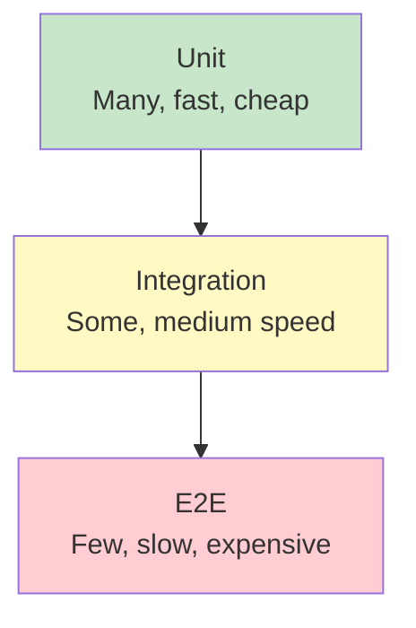
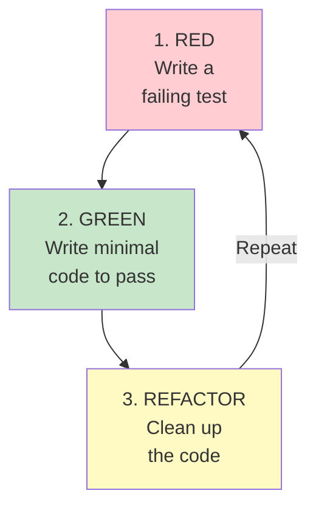
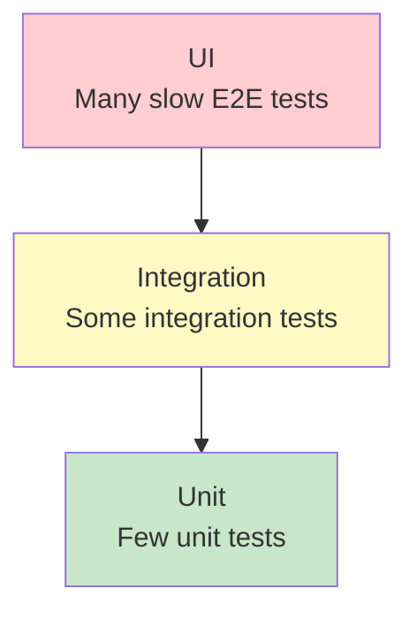

# 🧪 Testing Strategy

## 0️⃣ Prerequisites

Before diving into testing strategy, you should understand:

- **Basic Java Syntax**: Classes, methods, objects, and how to run Java programs
- **What a "Bug" Is**: Code that doesn't behave as expected
- **Build Tools Basics**: Maven or Gradle can compile and run code (covered in Topic 3)

Quick refresher on **assertions**: An assertion is a statement that checks if something is true. If false, it fails loudly. Example: "I assert that 2 + 2 equals 4."

---

## 1️⃣ What Problem Does This Exist to Solve?

### The Pain Before Automated Testing

Imagine you're building an e-commerce checkout system. Without automated tests:

**Problem 1: The "It Works on My Machine" Syndrome**

Developer Alice writes the checkout code. It works perfectly on her laptop. She ships it. In production, it crashes because:
- Her laptop has Java 17, production has Java 11
- She tested with 1 item, production has carts with 1000 items
- She tested with USD, production has customers using EUR, JPY, INR

Without tests, these differences are discovered by customers, not developers.

**Problem 2: The Regression Nightmare**

```
Week 1: Build login feature ✓
Week 2: Build payment feature ✓
Week 3: Build shipping feature ✓
Week 4: Customer reports login is broken

What happened? When did it break? Week 2? Week 3? Which commit?
```

Without tests, every new feature can silently break old features. You only find out when customers complain.

**Problem 3: Fear of Change**

```java
// This method is 500 lines long and handles:
// - Pricing
// - Discounts
// - Tax calculation
// - Inventory check
// - Payment processing
// 
// TODO: Refactor this
// 
// NOTE: Last person who tried to refactor this broke production for 3 days
// DO NOT TOUCH
```

Without tests, refactoring is terrifying. The code becomes a fragile artifact that nobody dares to improve.

**Problem 4: Manual Testing Doesn't Scale**

Manual testing checklist for a simple app:
```
□ Login with valid credentials
□ Login with invalid credentials
□ Login with empty username
□ Login with empty password
□ Login with SQL injection attempt
□ Login with XSS attempt
□ Login after password reset
□ Login with expired session
... (50 more cases)
```

Running this manually before every release takes hours. So people skip it. So bugs ship.

### What Breaks Without Testing

| Scenario | Without Tests | With Tests |
|----------|--------------|------------|
| New feature | Might break existing features | Regression tests catch breaks |
| Refactoring | Too risky, code rots | Refactor confidently |
| Onboarding | "Ask Bob, he knows how it works" | Tests document expected behavior |
| Deployment | "Let's hope it works" | CI blocks broken code |
| Bug fixing | Fix one bug, create two more | Tests prevent regressions |

---

## 2️⃣ Intuition and Mental Model

### The Safety Net Analogy

Think of tests as a **safety net under a trapeze artist**.

The trapeze artist (developer) performs daring moves (code changes). Without a net:
- Every move is terrifying
- One mistake means disaster
- Artists become conservative, avoid impressive moves

With a net:
- Artists can attempt bold moves
- Failures are caught safely
- Artists improve faster because they can experiment

Tests are your safety net. They catch you when you fall (introduce bugs), letting you move faster and more boldly.

### The Test Pyramid



<details>
<summary>ASCII diagram (reference)</summary>

```text
                    /\
                   /  \
                  / E2E\        ← Few, slow, expensive
                 /______\
                /        \
               /Integration\    ← Some, medium speed
              /____________\
             /              \
            /     Unit       \  ← Many, fast, cheap
           /__________________\
```

</details>

**Unit Tests** (Base): Test individual functions/methods in isolation
- Fast (milliseconds)
- Cheap to write and maintain
- Run thousands of them

**Integration Tests** (Middle): Test how components work together
- Medium speed (seconds)
- Test database queries, API calls, message queues
- Run hundreds of them

**End-to-End Tests** (Top): Test the entire system as a user would
- Slow (minutes)
- Expensive to maintain
- Run dozens of them

**The key insight**: Most of your tests should be unit tests. They're fast, reliable, and pinpoint exactly what's broken.

---

## 3️⃣ How It Works Internally

### Anatomy of a Test

Every test has three parts (Arrange-Act-Assert):

```java
@Test
void shouldCalculateTotalWithTax() {
    // ARRANGE: Set up the test scenario
    ShoppingCart cart = new ShoppingCart();
    cart.addItem(new Item("Book", 10.00));
    TaxCalculator calculator = new TaxCalculator(0.10); // 10% tax
    
    // ACT: Perform the action being tested
    double total = calculator.calculateTotal(cart);
    
    // ASSERT: Verify the result
    assertEquals(11.00, total, 0.01);
}
```

### How JUnit Works Internally

JUnit is the standard testing framework for Java. Here's what happens when you run tests:

```
1. JUnit scans for classes with @Test methods
2. For each test class:
   a. Create a new instance of the class
   b. Run @BeforeAll methods (once per class)
   c. For each @Test method:
      i.   Run @BeforeEach methods
      ii.  Run the test method
      iii. Run @AfterEach methods
      iv.  Record pass/fail
   d. Run @AfterAll methods (once per class)
3. Generate test report
```

**Key insight**: Each test gets a fresh instance of the test class. Tests are isolated from each other.

### Test Lifecycle Annotations

```java
public class UserServiceTest {
    
    private static DatabaseConnection dbConnection;
    private UserService userService;
    
    @BeforeAll
    static void setUpDatabase() {
        // Runs ONCE before all tests in this class
        // Use for expensive setup (database connections, containers)
        dbConnection = new DatabaseConnection("test-db");
    }
    
    @BeforeEach
    void setUp() {
        // Runs before EACH test
        // Use for per-test setup
        userService = new UserService(dbConnection);
        dbConnection.beginTransaction();
    }
    
    @Test
    void shouldCreateUser() {
        // The actual test
        User user = userService.create("alice@example.com");
        assertNotNull(user.getId());
    }
    
    @Test
    void shouldFindUserByEmail() {
        // Another test (gets fresh userService)
        userService.create("bob@example.com");
        User found = userService.findByEmail("bob@example.com");
        assertEquals("bob@example.com", found.getEmail());
    }
    
    @AfterEach
    void tearDown() {
        // Runs after EACH test
        // Clean up per-test resources
        dbConnection.rollbackTransaction();
    }
    
    @AfterAll
    static void tearDownDatabase() {
        // Runs ONCE after all tests
        // Clean up expensive resources
        dbConnection.close();
    }
}
```

---

## 4️⃣ Simulation: Building Tests Step by Step

Let's build a complete test suite for a simple `Calculator` class.

### The Class Under Test

```java
// src/main/java/com/example/Calculator.java
package com.example;

public class Calculator {
    
    public int add(int a, int b) {
        return a + b;
    }
    
    public int subtract(int a, int b) {
        return a - b;
    }
    
    public int multiply(int a, int b) {
        return a * b;
    }
    
    public int divide(int a, int b) {
        if (b == 0) {
            throw new IllegalArgumentException("Cannot divide by zero");
        }
        return a / b;
    }
    
    public double average(int... numbers) {
        if (numbers == null || numbers.length == 0) {
            throw new IllegalArgumentException("Cannot calculate average of empty array");
        }
        int sum = 0;
        for (int n : numbers) {
            sum += n;
        }
        return (double) sum / numbers.length;
    }
}
```

### Maven Dependencies

```xml
<!-- pom.xml -->
<dependencies>
    <!-- JUnit 5 -->
    <dependency>
        <groupId>org.junit.jupiter</groupId>
        <artifactId>junit-jupiter</artifactId>
        <version>5.10.1</version>
        <scope>test</scope>
    </dependency>
    
    <!-- AssertJ for fluent assertions (optional but recommended) -->
    <dependency>
        <groupId>org.assertj</groupId>
        <artifactId>assertj-core</artifactId>
        <version>3.24.2</version>
        <scope>test</scope>
    </dependency>
</dependencies>

<build>
    <plugins>
        <plugin>
            <groupId>org.apache.maven.plugins</groupId>
            <artifactId>maven-surefire-plugin</artifactId>
            <version>3.2.3</version>
        </plugin>
    </plugins>
</build>
```

### Unit Tests

```java
// src/test/java/com/example/CalculatorTest.java
package com.example;

import org.junit.jupiter.api.BeforeEach;
import org.junit.jupiter.api.DisplayName;
import org.junit.jupiter.api.Nested;
import org.junit.jupiter.api.Test;
import org.junit.jupiter.params.ParameterizedTest;
import org.junit.jupiter.params.provider.CsvSource;

import static org.junit.jupiter.api.Assertions.*;
import static org.assertj.core.api.Assertions.assertThat;
import static org.assertj.core.api.Assertions.assertThatThrownBy;

@DisplayName("Calculator")
class CalculatorTest {
    
    private Calculator calculator;
    
    @BeforeEach
    void setUp() {
        calculator = new Calculator();
    }
    
    @Nested
    @DisplayName("add()")
    class AddTests {
        
        @Test
        @DisplayName("should add two positive numbers")
        void shouldAddTwoPositiveNumbers() {
            // Arrange & Act
            int result = calculator.add(2, 3);
            
            // Assert
            assertEquals(5, result);
        }
        
        @Test
        @DisplayName("should add negative numbers")
        void shouldAddNegativeNumbers() {
            int result = calculator.add(-2, -3);
            assertEquals(-5, result);
        }
        
        @Test
        @DisplayName("should handle zero")
        void shouldHandleZero() {
            assertEquals(5, calculator.add(5, 0));
            assertEquals(5, calculator.add(0, 5));
        }
        
        // Parameterized test: run same test with different inputs
        @ParameterizedTest(name = "{0} + {1} = {2}")
        @CsvSource({
            "1, 1, 2",
            "2, 3, 5",
            "-1, 1, 0",
            "0, 0, 0",
            "100, 200, 300"
        })
        @DisplayName("should add various number combinations")
        void shouldAddVariousNumbers(int a, int b, int expected) {
            assertEquals(expected, calculator.add(a, b));
        }
    }
    
    @Nested
    @DisplayName("divide()")
    class DivideTests {
        
        @Test
        @DisplayName("should divide two numbers")
        void shouldDivideTwoNumbers() {
            assertEquals(5, calculator.divide(10, 2));
        }
        
        @Test
        @DisplayName("should perform integer division")
        void shouldPerformIntegerDivision() {
            // 7 / 2 = 3 (not 3.5, because integer division)
            assertEquals(3, calculator.divide(7, 2));
        }
        
        @Test
        @DisplayName("should throw exception when dividing by zero")
        void shouldThrowExceptionWhenDividingByZero() {
            // JUnit 5 style
            IllegalArgumentException exception = assertThrows(
                IllegalArgumentException.class,
                () -> calculator.divide(10, 0)
            );
            assertEquals("Cannot divide by zero", exception.getMessage());
        }
        
        @Test
        @DisplayName("should throw exception when dividing by zero (AssertJ style)")
        void shouldThrowExceptionWhenDividingByZeroAssertJ() {
            // AssertJ style (more fluent)
            assertThatThrownBy(() -> calculator.divide(10, 0))
                .isInstanceOf(IllegalArgumentException.class)
                .hasMessage("Cannot divide by zero");
        }
    }
    
    @Nested
    @DisplayName("average()")
    class AverageTests {
        
        @Test
        @DisplayName("should calculate average of numbers")
        void shouldCalculateAverage() {
            double result = calculator.average(2, 4, 6);
            assertEquals(4.0, result, 0.001); // delta for floating point comparison
        }
        
        @Test
        @DisplayName("should calculate average with AssertJ")
        void shouldCalculateAverageAssertJ() {
            double result = calculator.average(1, 2, 3, 4, 5);
            assertThat(result).isCloseTo(3.0, within(0.001));
        }
        
        @Test
        @DisplayName("should throw exception for empty array")
        void shouldThrowExceptionForEmptyArray() {
            assertThrows(
                IllegalArgumentException.class,
                () -> calculator.average()
            );
        }
        
        @Test
        @DisplayName("should throw exception for null")
        void shouldThrowExceptionForNull() {
            assertThrows(
                IllegalArgumentException.class,
                () -> calculator.average(null)
            );
        }
    }
}

// Need to import this for AssertJ's within()
import static org.assertj.core.api.Assertions.within;
```

### Running Tests

```bash
# Run all tests
mvn test

# Run specific test class
mvn test -Dtest=CalculatorTest

# Run specific test method
mvn test -Dtest=CalculatorTest#shouldAddTwoPositiveNumbers

# Run with verbose output
mvn test -X
```

Output:
```
[INFO] -------------------------------------------------------
[INFO]  T E S T S
[INFO] -------------------------------------------------------
[INFO] Running com.example.CalculatorTest
[INFO] Tests run: 15, Failures: 0, Errors: 0, Skipped: 0
[INFO] 
[INFO] Results:
[INFO] 
[INFO] Tests run: 15, Failures: 0, Errors: 0, Skipped: 0
[INFO] 
[INFO] BUILD SUCCESS
```

---

## 5️⃣ Mocking with Mockito

### Why Mocking?

When testing a class that depends on other classes, you don't want to test the dependencies, just the class itself.

```java
public class OrderService {
    private final PaymentGateway paymentGateway;  // External API
    private final InventoryService inventoryService;  // Database calls
    private final EmailService emailService;  // Sends real emails
    
    public Order placeOrder(Cart cart, PaymentInfo payment) {
        // This method calls all three dependencies
        // Testing it would:
        // - Charge a real credit card
        // - Modify real inventory
        // - Send real emails
    }
}
```

**Mocking** replaces real dependencies with fake ones that you control.

### Mockito Basics

```xml
<!-- Add to pom.xml -->
<dependency>
    <groupId>org.mockito</groupId>
    <artifactId>mockito-core</artifactId>
    <version>5.8.0</version>
    <scope>test</scope>
</dependency>
<dependency>
    <groupId>org.mockito</groupId>
    <artifactId>mockito-junit-jupiter</artifactId>
    <version>5.8.0</version>
    <scope>test</scope>
</dependency>
```

### Example: Testing OrderService

```java
// The service we're testing
public class OrderService {
    private final PaymentGateway paymentGateway;
    private final InventoryService inventoryService;
    private final EmailService emailService;
    
    public OrderService(PaymentGateway paymentGateway, 
                        InventoryService inventoryService,
                        EmailService emailService) {
        this.paymentGateway = paymentGateway;
        this.inventoryService = inventoryService;
        this.emailService = emailService;
    }
    
    public Order placeOrder(Cart cart, PaymentInfo payment) {
        // Check inventory
        for (Item item : cart.getItems()) {
            if (!inventoryService.isInStock(item.getId(), item.getQuantity())) {
                throw new OutOfStockException(item.getName());
            }
        }
        
        // Process payment
        PaymentResult result = paymentGateway.charge(payment, cart.getTotal());
        if (!result.isSuccessful()) {
            throw new PaymentFailedException(result.getErrorMessage());
        }
        
        // Reserve inventory
        for (Item item : cart.getItems()) {
            inventoryService.reserve(item.getId(), item.getQuantity());
        }
        
        // Create order
        Order order = new Order(cart, result.getTransactionId());
        
        // Send confirmation email
        emailService.sendOrderConfirmation(order);
        
        return order;
    }
}
```

```java
// The test
@ExtendWith(MockitoExtension.class)
class OrderServiceTest {
    
    @Mock
    private PaymentGateway paymentGateway;
    
    @Mock
    private InventoryService inventoryService;
    
    @Mock
    private EmailService emailService;
    
    @InjectMocks
    private OrderService orderService;
    
    private Cart cart;
    private PaymentInfo paymentInfo;
    
    @BeforeEach
    void setUp() {
        cart = new Cart();
        cart.addItem(new Item("item-1", "Book", 29.99, 2));
        
        paymentInfo = new PaymentInfo("4111111111111111", "12/25", "123");
    }
    
    @Test
    @DisplayName("should place order successfully when all conditions are met")
    void shouldPlaceOrderSuccessfully() {
        // Arrange: Configure mock behavior
        when(inventoryService.isInStock("item-1", 2)).thenReturn(true);
        when(paymentGateway.charge(any(PaymentInfo.class), anyDouble()))
            .thenReturn(new PaymentResult(true, "txn-123", null));
        
        // Act
        Order order = orderService.placeOrder(cart, paymentInfo);
        
        // Assert
        assertNotNull(order);
        assertEquals("txn-123", order.getTransactionId());
        
        // Verify interactions
        verify(inventoryService).isInStock("item-1", 2);
        verify(paymentGateway).charge(paymentInfo, 59.98);
        verify(inventoryService).reserve("item-1", 2);
        verify(emailService).sendOrderConfirmation(order);
    }
    
    @Test
    @DisplayName("should throw exception when item is out of stock")
    void shouldThrowExceptionWhenOutOfStock() {
        // Arrange
        when(inventoryService.isInStock("item-1", 2)).thenReturn(false);
        
        // Act & Assert
        assertThrows(OutOfStockException.class, 
            () -> orderService.placeOrder(cart, paymentInfo));
        
        // Verify payment was never attempted
        verify(paymentGateway, never()).charge(any(), anyDouble());
    }
    
    @Test
    @DisplayName("should throw exception when payment fails")
    void shouldThrowExceptionWhenPaymentFails() {
        // Arrange
        when(inventoryService.isInStock("item-1", 2)).thenReturn(true);
        when(paymentGateway.charge(any(), anyDouble()))
            .thenReturn(new PaymentResult(false, null, "Card declined"));
        
        // Act & Assert
        PaymentFailedException exception = assertThrows(
            PaymentFailedException.class,
            () -> orderService.placeOrder(cart, paymentInfo)
        );
        assertEquals("Card declined", exception.getMessage());
        
        // Verify inventory was not reserved
        verify(inventoryService, never()).reserve(anyString(), anyInt());
    }
    
    @Test
    @DisplayName("should not send email if payment fails")
    void shouldNotSendEmailIfPaymentFails() {
        // Arrange
        when(inventoryService.isInStock("item-1", 2)).thenReturn(true);
        when(paymentGateway.charge(any(), anyDouble()))
            .thenReturn(new PaymentResult(false, null, "Insufficient funds"));
        
        // Act
        try {
            orderService.placeOrder(cart, paymentInfo);
        } catch (PaymentFailedException ignored) {}
        
        // Assert: Email should never be sent
        verify(emailService, never()).sendOrderConfirmation(any());
    }
}
```

### Mockito Cheat Sheet

```java
// Creating mocks
@Mock private Service service;                    // Annotation
Service service = mock(Service.class);            // Programmatic

// Stubbing (defining behavior)
when(service.method()).thenReturn(value);         // Return value
when(service.method()).thenThrow(exception);      // Throw exception
when(service.method()).thenAnswer(invocation -> { // Custom logic
    String arg = invocation.getArgument(0);
    return arg.toUpperCase();
});

// Argument matchers
when(service.find(anyString())).thenReturn(result);
when(service.find(eq("specific"))).thenReturn(result);
when(service.find(argThat(s -> s.startsWith("test")))).thenReturn(result);

// Verification
verify(service).method();                         // Called once
verify(service, times(3)).method();               // Called 3 times
verify(service, never()).method();                // Never called
verify(service, atLeast(2)).method();             // At least 2 times
verify(service, atMost(5)).method();              // At most 5 times

// Argument capture
ArgumentCaptor<User> captor = ArgumentCaptor.forClass(User.class);
verify(service).save(captor.capture());
User savedUser = captor.getValue();
assertEquals("alice@example.com", savedUser.getEmail());

// Verify order of calls
InOrder inOrder = inOrder(service1, service2);
inOrder.verify(service1).first();
inOrder.verify(service2).second();
```

---

## 6️⃣ Integration Testing

### What Integration Tests Cover

Integration tests verify that components work together correctly:

- Database queries return expected results
- REST APIs handle requests properly
- Message queues deliver messages
- External services are called correctly

### Spring Boot Integration Testing

```java
// src/test/java/com/example/UserControllerIntegrationTest.java
@SpringBootTest(webEnvironment = SpringBootTest.WebEnvironment.RANDOM_PORT)
@AutoConfigureTestDatabase(replace = AutoConfigureTestDatabase.Replace.ANY)
class UserControllerIntegrationTest {
    
    @Autowired
    private TestRestTemplate restTemplate;
    
    @Autowired
    private UserRepository userRepository;
    
    @BeforeEach
    void setUp() {
        userRepository.deleteAll();
    }
    
    @Test
    @DisplayName("should create user via REST API")
    void shouldCreateUser() {
        // Arrange
        CreateUserRequest request = new CreateUserRequest(
            "alice@example.com", 
            "Alice Smith"
        );
        
        // Act
        ResponseEntity<User> response = restTemplate.postForEntity(
            "/api/users",
            request,
            User.class
        );
        
        // Assert
        assertEquals(HttpStatus.CREATED, response.getStatusCode());
        assertNotNull(response.getBody().getId());
        assertEquals("alice@example.com", response.getBody().getEmail());
        
        // Verify database
        Optional<User> saved = userRepository.findByEmail("alice@example.com");
        assertTrue(saved.isPresent());
    }
    
    @Test
    @DisplayName("should return 404 for non-existent user")
    void shouldReturn404ForNonExistentUser() {
        ResponseEntity<String> response = restTemplate.getForEntity(
            "/api/users/999",
            String.class
        );
        
        assertEquals(HttpStatus.NOT_FOUND, response.getStatusCode());
    }
}
```

### Database Integration Testing with Testcontainers

Testcontainers spins up real databases in Docker for testing:

```xml
<!-- pom.xml -->
<dependency>
    <groupId>org.testcontainers</groupId>
    <artifactId>testcontainers</artifactId>
    <version>1.19.3</version>
    <scope>test</scope>
</dependency>
<dependency>
    <groupId>org.testcontainers</groupId>
    <artifactId>postgresql</artifactId>
    <version>1.19.3</version>
    <scope>test</scope>
</dependency>
<dependency>
    <groupId>org.testcontainers</groupId>
    <artifactId>junit-jupiter</artifactId>
    <version>1.19.3</version>
    <scope>test</scope>
</dependency>
```

```java
@SpringBootTest
@Testcontainers
class UserRepositoryIntegrationTest {
    
    @Container
    static PostgreSQLContainer<?> postgres = new PostgreSQLContainer<>("postgres:15")
        .withDatabaseName("testdb")
        .withUsername("test")
        .withPassword("test");
    
    @DynamicPropertySource
    static void configureProperties(DynamicPropertyRegistry registry) {
        registry.add("spring.datasource.url", postgres::getJdbcUrl);
        registry.add("spring.datasource.username", postgres::getUsername);
        registry.add("spring.datasource.password", postgres::getPassword);
    }
    
    @Autowired
    private UserRepository userRepository;
    
    @Test
    void shouldSaveAndFindUser() {
        // This test runs against a real PostgreSQL database
        User user = new User("alice@example.com", "Alice");
        userRepository.save(user);
        
        Optional<User> found = userRepository.findByEmail("alice@example.com");
        
        assertTrue(found.isPresent());
        assertEquals("Alice", found.get().getName());
    }
}
```

---

## 7️⃣ Contract Testing with Pact

### The Problem Contract Testing Solves

```
┌─────────────┐         ┌─────────────┐
│   Frontend  │ ──────▶ │   Backend   │
│   (React)   │   API   │   (Java)    │
└─────────────┘         └─────────────┘
     Team A                  Team B
```

Team A expects the API to return:
```json
{ "userId": 123, "name": "Alice" }
```

Team B changes the API to return:
```json
{ "id": 123, "fullName": "Alice" }
```

Team B's tests pass (they test their own code). Team A's tests pass (they mock the API). But the integration is broken.

### How Contract Testing Works

```
1. Consumer (Frontend) writes a "contract":
   "When I call GET /users/123, I expect { userId: number, name: string }"

2. Contract is stored in a Pact Broker (shared registry)

3. Provider (Backend) runs contract tests:
   "Can I fulfill the contract the consumer expects?"

4. If provider can't fulfill contract, tests fail BEFORE deployment
```

### Pact Consumer Test (Java)

```java
@ExtendWith(PactConsumerTestExt.class)
@PactTestFor(providerName = "UserService", port = "8080")
class UserServiceConsumerTest {
    
    @Pact(consumer = "OrderService")
    public V4Pact createPact(PactDslWithProvider builder) {
        return builder
            .given("user 123 exists")
            .uponReceiving("a request for user 123")
                .path("/users/123")
                .method("GET")
            .willRespondWith()
                .status(200)
                .headers(Map.of("Content-Type", "application/json"))
                .body(new PactDslJsonBody()
                    .integerType("userId", 123)
                    .stringType("name", "Alice")
                    .stringType("email", "alice@example.com")
                )
            .toPact(V4Pact.class);
    }
    
    @Test
    @PactTestFor(pactMethod = "createPact")
    void shouldGetUser(MockServer mockServer) {
        // Configure client to use mock server
        UserClient client = new UserClient(mockServer.getUrl());
        
        // Call the API
        User user = client.getUser(123);
        
        // Verify response
        assertEquals(123, user.getUserId());
        assertEquals("Alice", user.getName());
    }
}
```

### Pact Provider Test

```java
@Provider("UserService")
@PactBroker(url = "https://pact-broker.example.com")
@SpringBootTest(webEnvironment = SpringBootTest.WebEnvironment.RANDOM_PORT)
class UserServiceProviderTest {
    
    @LocalServerPort
    private int port;
    
    @Autowired
    private UserRepository userRepository;
    
    @BeforeEach
    void setUp(PactVerificationContext context) {
        context.setTarget(new HttpTestTarget("localhost", port));
    }
    
    @TestTemplate
    @ExtendWith(PactVerificationInvocationContextProvider.class)
    void verifyPact(PactVerificationContext context) {
        context.verifyInteraction();
    }
    
    @State("user 123 exists")
    void setupUser123() {
        userRepository.save(new User(123L, "Alice", "alice@example.com"));
    }
}
```

---

## 8️⃣ Test Coverage

### What Coverage Measures

- **Line Coverage**: Percentage of lines executed by tests
- **Branch Coverage**: Percentage of if/else branches taken
- **Method Coverage**: Percentage of methods called
- **Class Coverage**: Percentage of classes tested

### Coverage Tools

```xml
<!-- pom.xml - JaCoCo plugin -->
<plugin>
    <groupId>org.jacoco</groupId>
    <artifactId>jacoco-maven-plugin</artifactId>
    <version>0.8.11</version>
    <executions>
        <execution>
            <goals>
                <goal>prepare-agent</goal>
            </goals>
        </execution>
        <execution>
            <id>report</id>
            <phase>test</phase>
            <goals>
                <goal>report</goal>
            </goals>
        </execution>
    </executions>
</plugin>
```

```bash
mvn test jacoco:report
# Report at target/site/jacoco/index.html
```

### What Coverage to Aim For

| Coverage Level | Interpretation |
|----------------|----------------|
| < 50% | Significant untested code, high risk |
| 50-70% | Acceptable for most projects |
| 70-80% | Good coverage, most critical paths tested |
| 80-90% | High coverage, suitable for critical systems |
| > 90% | Diminishing returns, may indicate over-testing |

**Important**: High coverage doesn't mean good tests. You can have 100% coverage with terrible tests:

```java
@Test
void badTest() {
    // This "test" covers the code but tests nothing
    calculator.add(2, 3);  // No assertion!
}
```

### Mutation Testing

Mutation testing checks if your tests actually catch bugs:

1. Tool modifies your code (introduces "mutants"):
   - Changes `+` to `-`
   - Changes `>` to `>=`
   - Returns `null` instead of real value

2. Runs your tests against each mutant

3. If tests pass with the mutant, your tests are weak

```xml
<!-- pom.xml - PIT mutation testing -->
<plugin>
    <groupId>org.pitest</groupId>
    <artifactId>pitest-maven</artifactId>
    <version>1.15.3</version>
    <dependencies>
        <dependency>
            <groupId>org.pitest</groupId>
            <artifactId>pitest-junit5-plugin</artifactId>
            <version>1.2.1</version>
        </dependency>
    </dependencies>
</plugin>
```

```bash
mvn org.pitest:pitest-maven:mutationCoverage
# Report at target/pit-reports/index.html
```

---

## 9️⃣ TDD (Test-Driven Development)

### The TDD Cycle



<details>
<summary>ASCII diagram (reference)</summary>

```text
        ┌─────────────────┐
        │   1. RED        │
        │   Write a       │
        │   failing test  │
        └────────┬────────┘
                 │
                 ▼
        ┌─────────────────┐
        │   2. GREEN      │
        │   Write minimal │
        │   code to pass  │
        └────────┬────────┘
                 │
                 ▼
        ┌─────────────────┐
        │   3. REFACTOR   │
        │   Clean up      │
        │   the code      │
        └────────┬────────┘
                 │
                 └──────────────▶ Repeat
```

</details>

### TDD Example: Building a Stack

**Step 1: RED - Write failing test**

```java
@Test
void newStackShouldBeEmpty() {
    Stack<Integer> stack = new Stack<>();
    assertTrue(stack.isEmpty());
}
```

Test fails because `Stack` class doesn't exist.

**Step 2: GREEN - Minimal code to pass**

```java
public class Stack<T> {
    public boolean isEmpty() {
        return true;  // Simplest thing that passes
    }
}
```

Test passes.

**Step 3: RED - Next test**

```java
@Test
void stackShouldNotBeEmptyAfterPush() {
    Stack<Integer> stack = new Stack<>();
    stack.push(1);
    assertFalse(stack.isEmpty());
}
```

Test fails because `push` doesn't exist and `isEmpty` always returns true.

**Step 4: GREEN - Make it pass**

```java
public class Stack<T> {
    private int size = 0;
    
    public void push(T item) {
        size++;
    }
    
    public boolean isEmpty() {
        return size == 0;
    }
}
```

**Step 5: RED - Next test**

```java
@Test
void popShouldReturnPushedItem() {
    Stack<Integer> stack = new Stack<>();
    stack.push(42);
    assertEquals(42, stack.pop());
}
```

**Step 6: GREEN**

```java
public class Stack<T> {
    private List<T> items = new ArrayList<>();
    
    public void push(T item) {
        items.add(item);
    }
    
    public T pop() {
        return items.remove(items.size() - 1);
    }
    
    public boolean isEmpty() {
        return items.isEmpty();
    }
}
```

**Step 7: REFACTOR** (if needed)

Continue cycle until Stack is complete.

### When TDD Works Well

- Building new functionality from scratch
- Complex business logic
- When requirements are clear
- When you want to ensure testable design

### When TDD Is Harder

- UI code
- Integration with external systems
- Exploratory coding (you don't know what you're building yet)
- Legacy code without tests

---

## 🔟 Tradeoffs and Pitfalls

### Testing Anti-Patterns

**1. Testing Implementation, Not Behavior**

```java
// BAD: Tests implementation details
@Test
void shouldCallDatabaseExactlyOnce() {
    service.getUser(123);
    verify(database, times(1)).query(any());  // Brittle!
}

// GOOD: Tests behavior
@Test
void shouldReturnUserById() {
    User user = service.getUser(123);
    assertEquals("Alice", user.getName());
}
```

**2. Flaky Tests**

Tests that sometimes pass and sometimes fail:
- Depend on timing (`Thread.sleep`)
- Depend on test order
- Depend on external systems
- Use random data without seeds

**3. Slow Tests**

- Tests that take minutes to run get skipped
- Use mocks instead of real databases for unit tests
- Use Testcontainers for integration tests, not production databases

**4. Over-Mocking**

```java
// BAD: Mock everything
@Test
void overMockedTest() {
    when(mock1.method()).thenReturn(mock2);
    when(mock2.method()).thenReturn(mock3);
    when(mock3.method()).thenReturn(result);
    // What are we even testing?
}
```

**5. Test Data Coupling**

```java
// BAD: Tests depend on shared data
@Test void test1() { userRepo.save(new User("alice")); }
@Test void test2() { userRepo.findByName("alice"); }  // Fails if test1 doesn't run first
```

### The Test Pyramid Violations

**Ice Cream Cone Anti-Pattern**:



<details>
<summary>ASCII diagram (reference)</summary>

```text
        /\
       /  \
      / UI \        ← Many slow E2E tests
     /______\
    /        \
   /Integration\    ← Some integration tests
  /____________\
 /              \
/     Unit       \  ← Few unit tests
\________________/
```

</details>

This is slow, flaky, and expensive. Flip it back to a pyramid.

---

## 1️⃣1️⃣ Interview Follow-Up Questions

### Q1: "What's the difference between unit tests and integration tests?"

**Answer**:
Unit tests test a single component in isolation, mocking all dependencies. They're fast (milliseconds), reliable, and pinpoint exactly what's broken. Integration tests verify that multiple components work together correctly, often involving real databases, APIs, or message queues. They're slower (seconds to minutes) but catch issues that unit tests miss, like incorrect SQL queries or serialization problems.

The test pyramid suggests having many unit tests, fewer integration tests, and even fewer end-to-end tests. This gives fast feedback while still catching integration issues.

### Q2: "How do you decide what to test?"

**Answer**:
I prioritize testing based on risk and complexity:

1. **Business-critical paths**: Payment processing, authentication, data integrity
2. **Complex logic**: Algorithms, state machines, calculations with edge cases
3. **Integration points**: Database queries, external API calls, message handling
4. **Bug-prone areas**: Code that has had bugs before

I don't test trivial code (getters/setters) or framework code (Spring's dependency injection). I focus on code I wrote that could break.

For coverage targets, I aim for 70-80% line coverage, but I care more about testing critical paths than hitting a number.

### Q3: "What is mocking and when would you use it?"

**Answer**:
Mocking replaces real dependencies with controlled fakes. I use mocks when:

1. **External services**: Don't want to call real payment APIs in tests
2. **Slow dependencies**: Database calls slow down unit tests
3. **Non-deterministic behavior**: Current time, random numbers
4. **Error scenarios**: Hard to trigger real errors (network failures)

I avoid mocking when:
1. Testing the integration itself (use real database with Testcontainers)
2. The mock is more complex than the real thing
3. I'm testing implementation details instead of behavior

### Q4: "How do you handle flaky tests?"

**Answer**:
Flaky tests are tests that sometimes pass and sometimes fail. I handle them by:

1. **Identifying the cause**: Timing issues, test order dependencies, shared state, external dependencies
2. **Fixing timing issues**: Replace `Thread.sleep` with proper waits (polling, CountDownLatch)
3. **Isolating tests**: Each test sets up and tears down its own data
4. **Controlling randomness**: Use seeded random generators
5. **Quarantining**: If I can't fix it immediately, move it to a separate suite that doesn't block deployments

Flaky tests are worse than no tests because they train developers to ignore test failures.

### Q5: "What is TDD and when would you use it?"

**Answer**:
TDD (Test-Driven Development) is writing tests before code in a red-green-refactor cycle:
1. Write a failing test
2. Write minimal code to pass
3. Refactor while keeping tests green

I use TDD when:
- Building new functionality with clear requirements
- Implementing complex business logic
- I want to ensure the code is testable by design

I don't use TDD when:
- Exploring or prototyping (don't know what I'm building yet)
- Working with UI code where visual feedback matters
- The overhead isn't worth it for trivial code

---

## 1️⃣2️⃣ One Clean Mental Summary

Testing is your safety net for code changes. The test pyramid guides you: many fast unit tests at the base, fewer integration tests in the middle, and few slow E2E tests at the top. Unit tests use mocking to isolate components. Integration tests use real dependencies (databases via Testcontainers) to verify components work together. Contract tests ensure services agree on API shapes.

Good tests are fast, reliable, and test behavior rather than implementation. TDD helps design testable code by writing tests first. Coverage metrics are a guide, not a goal. The real measure of test quality is whether you can refactor confidently and deploy without fear.

