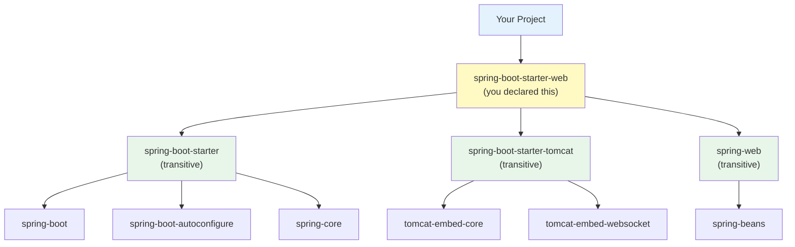
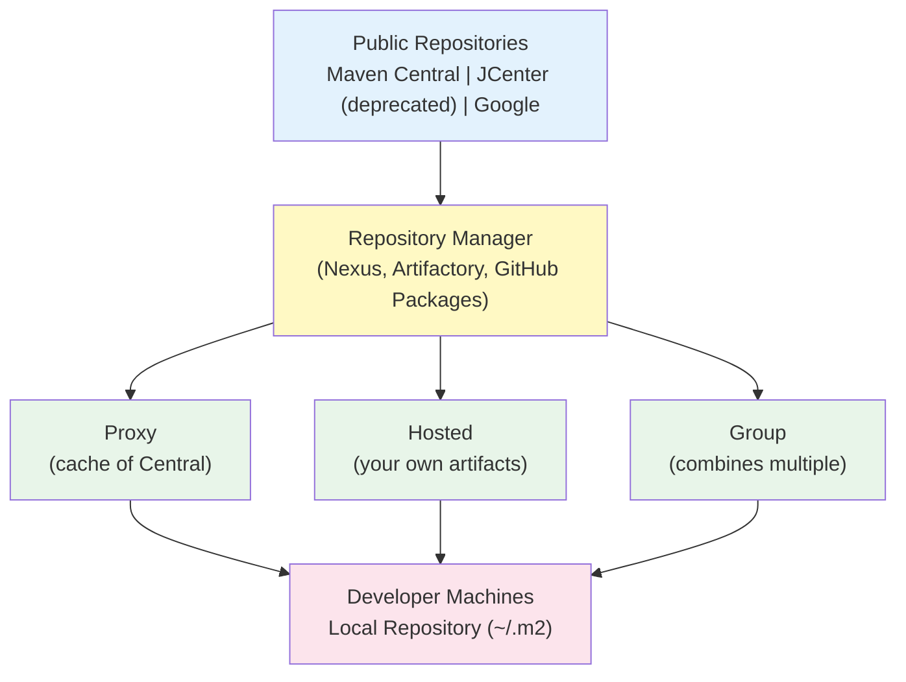

# 📦 Build & Packaging

## 0️⃣ Prerequisites

Before diving into build systems and packaging, you should understand:

- **Java Basics**: Classes, packages, and how to compile Java code with `javac`
- **What a JAR Is**: A Java Archive, essentially a ZIP file containing compiled `.class` files
- **Command Line Basics**: Running commands in a terminal
- **Dependencies**: External libraries your code uses (e.g., Spring, Jackson)

Quick refresher on **compilation**: Java source code (`.java` files) must be compiled into bytecode (`.class` files) before the JVM can run it. The `javac` compiler does this.

---

## 1️⃣ What Problem Does This Exist to Solve?

### The Pain Before Build Tools

Imagine building a Java project manually:

**Problem 1: Manual Compilation Hell**

```bash
# Your project structure
src/
├── com/example/
│   ├── Main.java
│   ├── service/
│   │   ├── UserService.java
│   │   └── OrderService.java
│   └── model/
│       ├── User.java
│       └── Order.java
```

To compile manually:
```bash
javac -d out src/com/example/model/User.java
javac -d out -cp out src/com/example/model/Order.java
javac -d out -cp out src/com/example/service/UserService.java
javac -d out -cp out src/com/example/service/OrderService.java
javac -d out -cp out src/com/example/Main.java
```

Order matters! If `UserService` depends on `User`, you must compile `User` first. With 100 files, this becomes impossible to manage.

**Problem 2: Dependency Management Nightmare**

Your project needs:
- Spring Boot 3.2.0
- Jackson 2.16.0
- Hibernate 6.4.0

Each of these has their own dependencies:
- Spring Boot needs Spring Core, Spring Context, Tomcat, etc.
- Jackson needs jackson-core, jackson-annotations, jackson-databind
- Hibernate needs JPA, JAXB, Byte Buddy, etc.

Without a build tool:
1. Go to Maven Central, download each JAR manually
2. Figure out which versions are compatible
3. Download transitive dependencies (dependencies of dependencies)
4. Put them all in the right folder
5. Update classpath to include all JARs
6. Repeat when any library updates

**Problem 3: "It Works on My Machine"**

Developer A has:
- Java 17
- Spring Boot 3.1.0
- Jackson 2.15.0

Developer B has:
- Java 11
- Spring Boot 3.2.0
- Jackson 2.16.0

Same code, different behavior. Bugs that appear only on some machines.

**Problem 4: Reproducibility**

```
Monday: Build works, deploy to production
Tuesday: Build fails
What changed? Did a dependency update? Did someone modify the build script?
```

Without version locking, builds are non-deterministic.

### What Breaks Without Build Tools

| Scenario | Without Build Tools | With Build Tools |
|----------|---------------------|------------------|
| Add new dependency | Manual download, classpath update | One line in config file |
| Update library version | Download new JAR, hope it's compatible | Change version number, tool resolves conflicts |
| New developer joins | "Here's a wiki page with 50 setup steps" | `mvn install` or `gradle build` |
| CI/CD pipeline | Custom scripts that break constantly | Standard commands that work everywhere |
| Reproducible builds | "Rebuild and pray" | Locked versions, deterministic output |

---

## 2️⃣ Intuition and Mental Model

### The Recipe Analogy

Think of a build tool as a **recipe book and sous chef** combined.

**Without a build tool** (cooking alone):
- You have to know every step by heart
- You manually gather all ingredients
- You figure out the right order to prepare things
- If you forget a step, dinner is ruined

**With a build tool** (having a recipe + sous chef):
- The recipe lists all ingredients (dependencies)
- The recipe specifies exact quantities (versions)
- The recipe defines the cooking order (build lifecycle)
- The sous chef follows the recipe exactly every time (reproducibility)

### Maven vs Gradle Mental Model

**Maven**: Like a strict recipe book
- "Follow these exact steps in this exact order"
- Convention over configuration
- XML configuration (verbose but explicit)
- Predictable, well-documented

**Gradle**: Like a programmable kitchen robot
- "Here are the steps, but you can customize anything"
- Configuration as code (Groovy or Kotlin)
- More flexible, steeper learning curve
- Faster builds with caching

---

## 3️⃣ How Maven Works Internally

### Maven's Core Concepts

#### 1. POM (Project Object Model)

The `pom.xml` file is the heart of Maven. It defines:
- Project coordinates (who am I?)
- Dependencies (what do I need?)
- Build configuration (how do I build?)
- Plugins (what tools do I use?)

```xml
<?xml version="1.0" encoding="UTF-8"?>
<project xmlns="http://maven.apache.org/POM/4.0.0"
         xmlns:xsi="http://www.w3.org/2001/XMLSchema-instance"
         xsi:schemaLocation="http://maven.apache.org/POM/4.0.0 
                             http://maven.apache.org/xsd/maven-4.0.0.xsd">
    <modelVersion>4.0.0</modelVersion>
    
    <!-- Project coordinates: uniquely identify this project -->
    <groupId>com.example</groupId>      <!-- Organization/company -->
    <artifactId>my-app</artifactId>     <!-- Project name -->
    <version>1.0.0-SNAPSHOT</version>   <!-- Version -->
    <packaging>jar</packaging>          <!-- Output type: jar, war, pom -->
    
    <!-- Project metadata -->
    <name>My Application</name>
    <description>A sample application</description>
    
    <!-- Java version -->
    <properties>
        <maven.compiler.source>17</maven.compiler.source>
        <maven.compiler.target>17</maven.compiler.target>
        <project.build.sourceEncoding>UTF-8</project.build.sourceEncoding>
    </properties>
    
    <!-- Dependencies -->
    <dependencies>
        <dependency>
            <groupId>org.springframework.boot</groupId>
            <artifactId>spring-boot-starter-web</artifactId>
            <version>3.2.0</version>
        </dependency>
    </dependencies>
</project>
```

#### 2. Coordinates (GAV)

Every Maven artifact is identified by three coordinates:

```
GroupId:    com.example          (organization, like a package name)
ArtifactId: my-app               (project name)
Version:    1.0.0-SNAPSHOT       (version number)
```

Together, these form a unique identifier in the Maven ecosystem.

#### 3. Repository System


<details>
<summary>ASCII diagram (reference)</summary>

```text
┌─────────────────┐     ┌─────────────────┐     ┌─────────────────┐
│  Your Project   │ ──▶ │  Local Repo     │ ──▶ │  Remote Repo    │
│                 │     │  (~/.m2/repo)   │     │  (Maven Central)│
└─────────────────┘     └─────────────────┘     └─────────────────┘
```

</details>

When you request a dependency:
1. Maven checks your local repository (`~/.m2/repository`)
2. If not found, downloads from remote repository (Maven Central by default)
3. Caches in local repository for future builds

### Maven Build Lifecycle

Maven has three built-in lifecycles:

**1. Default Lifecycle** (building and deploying):

```mermaid
flowchart LR
    V["validate<br/>Validate project structure"]
    C["compile<br/>Compile source code"]
    T["test<br/>Run unit tests"]
    P["package<br/>Create JAR/WAR"]
    VE["verify<br/>Run integration tests"]
    I["install<br/>Install to local repo"]
    D["deploy<br/>Upload to remote repo"]
    
    V --> C
    C --> T
    T --> P
    P --> VE
    VE --> I
    I --> D
    
    style V fill:#e1f5ff
    style C fill:#fff4e1
    style T fill:#fff4e1
    style P fill:#fff4e1
    style VE fill:#fff4e1
    style I fill:#fff4e1
    style D fill:#e8f5e9
```



<details>
<summary>ASCII diagram (reference)</summary>

```text
validate → compile → test → package → verify → install → deploy
    │         │        │        │         │         │        │
    │         │        │        │         │         │        └─ Upload to remote repo
    │         │        │        │         │         └─ Install to local repo
    │         │        │        │         └─ Run integration tests
    │         │        │        └─ Create JAR/WAR
    │         │        └─ Run unit tests
    │         └─ Compile source code
    └─ Validate project structure
```

</details>

**2. Clean Lifecycle**:
```
pre-clean → clean → post-clean
               │
               └─ Delete target/ directory
```

**3. Site Lifecycle**:
```
pre-site → site → post-site → site-deploy
              │
              └─ Generate documentation
```

**Key insight**: When you run a phase, all previous phases run first.

```bash
mvn package    # Runs: validate → compile → test → package
mvn install    # Runs: validate → compile → test → package → verify → install
```

### Dependency Resolution

Maven resolves dependencies transitively:



<details>
<summary>ASCII diagram (reference)</summary>

```text
Your Project
    └── spring-boot-starter-web (you declared this)
            ├── spring-boot-starter (transitive)
            │       ├── spring-boot
            │       ├── spring-boot-autoconfigure
            │       └── spring-core
            ├── spring-boot-starter-tomcat (transitive)
            │       ├── tomcat-embed-core
            │       └── tomcat-embed-websocket
            └── spring-web (transitive)
                    └── spring-beans
```

</details>

You declare one dependency, Maven downloads 20+.

### Dependency Scopes

```xml
<dependency>
    <groupId>org.junit.jupiter</groupId>
    <artifactId>junit-jupiter</artifactId>
    <version>5.10.1</version>
    <scope>test</scope>  <!-- Only available during testing -->
</dependency>
```

| Scope | Compile | Test | Runtime | Packaged |
|-------|---------|------|---------|----------|
| compile (default) | ✓ | ✓ | ✓ | ✓ |
| provided | ✓ | ✓ | ✗ | ✗ |
| runtime | ✗ | ✓ | ✓ | ✓ |
| test | ✗ | ✓ | ✗ | ✗ |
| system | ✓ | ✓ | ✗ | ✗ |

**Common use cases**:
- `compile`: Regular dependencies (Spring, Jackson)
- `provided`: Server provides it (Servlet API in Tomcat)
- `runtime`: Not needed for compilation (JDBC drivers)
- `test`: Testing only (JUnit, Mockito)

---

## 4️⃣ Simulation: Complete Maven Project

### Step 1: Create Project Structure

```bash
mkdir my-app
cd my-app
```

### Step 2: Create pom.xml

```xml
<?xml version="1.0" encoding="UTF-8"?>
<project xmlns="http://maven.apache.org/POM/4.0.0"
         xmlns:xsi="http://www.w3.org/2001/XMLSchema-instance"
         xsi:schemaLocation="http://maven.apache.org/POM/4.0.0 
                             http://maven.apache.org/xsd/maven-4.0.0.xsd">
    <modelVersion>4.0.0</modelVersion>
    
    <groupId>com.example</groupId>
    <artifactId>my-app</artifactId>
    <version>1.0.0-SNAPSHOT</version>
    <packaging>jar</packaging>
    
    <properties>
        <maven.compiler.source>17</maven.compiler.source>
        <maven.compiler.target>17</maven.compiler.target>
        <project.build.sourceEncoding>UTF-8</project.build.sourceEncoding>
    </properties>
    
    <dependencies>
        <!-- JSON processing -->
        <dependency>
            <groupId>com.fasterxml.jackson.core</groupId>
            <artifactId>jackson-databind</artifactId>
            <version>2.16.0</version>
        </dependency>
        
        <!-- Logging -->
        <dependency>
            <groupId>org.slf4j</groupId>
            <artifactId>slf4j-api</artifactId>
            <version>2.0.9</version>
        </dependency>
        <dependency>
            <groupId>ch.qos.logback</groupId>
            <artifactId>logback-classic</artifactId>
            <version>1.4.14</version>
        </dependency>
        
        <!-- Testing -->
        <dependency>
            <groupId>org.junit.jupiter</groupId>
            <artifactId>junit-jupiter</artifactId>
            <version>5.10.1</version>
            <scope>test</scope>
        </dependency>
    </dependencies>
    
    <build>
        <plugins>
            <!-- Compiler plugin -->
            <plugin>
                <groupId>org.apache.maven.plugins</groupId>
                <artifactId>maven-compiler-plugin</artifactId>
                <version>3.12.1</version>
                <configuration>
                    <source>17</source>
                    <target>17</target>
                </configuration>
            </plugin>
            
            <!-- Surefire plugin for running tests -->
            <plugin>
                <groupId>org.apache.maven.plugins</groupId>
                <artifactId>maven-surefire-plugin</artifactId>
                <version>3.2.3</version>
            </plugin>
            
            <!-- JAR plugin with main class -->
            <plugin>
                <groupId>org.apache.maven.plugins</groupId>
                <artifactId>maven-jar-plugin</artifactId>
                <version>3.3.0</version>
                <configuration>
                    <archive>
                        <manifest>
                            <mainClass>com.example.Main</mainClass>
                        </manifest>
                    </archive>
                </configuration>
            </plugin>
        </plugins>
    </build>
</project>
```

### Step 3: Create Source Files

```
my-app/
├── pom.xml
└── src/
    ├── main/
    │   ├── java/
    │   │   └── com/example/
    │   │       ├── Main.java
    │   │       └── model/
    │   │           └── User.java
    │   └── resources/
    │       └── logback.xml
    └── test/
        └── java/
            └── com/example/
                └── model/
                    └── UserTest.java
```

```java
// src/main/java/com/example/model/User.java
package com.example.model;

import com.fasterxml.jackson.annotation.JsonProperty;

public class User {
    
    @JsonProperty("user_id")
    private Long id;
    
    private String name;
    private String email;
    
    // Default constructor for Jackson
    public User() {}
    
    public User(Long id, String name, String email) {
        this.id = id;
        this.name = name;
        this.email = email;
    }
    
    // Getters and setters
    public Long getId() { return id; }
    public void setId(Long id) { this.id = id; }
    public String getName() { return name; }
    public void setName(String name) { this.name = name; }
    public String getEmail() { return email; }
    public void setEmail(String email) { this.email = email; }
    
    @Override
    public String toString() {
        return "User{id=" + id + ", name='" + name + "', email='" + email + "'}";
    }
}
```

```java
// src/main/java/com/example/Main.java
package com.example;

import com.example.model.User;
import com.fasterxml.jackson.databind.ObjectMapper;
import org.slf4j.Logger;
import org.slf4j.LoggerFactory;

public class Main {
    
    private static final Logger logger = LoggerFactory.getLogger(Main.class);
    
    public static void main(String[] args) throws Exception {
        logger.info("Application starting...");
        
        ObjectMapper mapper = new ObjectMapper();
        
        // Create user
        User user = new User(1L, "Alice", "alice@example.com");
        
        // Serialize to JSON
        String json = mapper.writeValueAsString(user);
        logger.info("Serialized: {}", json);
        
        // Deserialize from JSON
        String inputJson = "{\"user_id\": 2, \"name\": \"Bob\", \"email\": \"bob@example.com\"}";
        User parsedUser = mapper.readValue(inputJson, User.class);
        logger.info("Deserialized: {}", parsedUser);
        
        logger.info("Application finished.");
    }
}
```

```xml
<!-- src/main/resources/logback.xml -->
<configuration>
    <appender name="STDOUT" class="ch.qos.logback.core.ConsoleAppender">
        <encoder>
            <pattern>%d{HH:mm:ss.SSS} [%thread] %-5level %logger{36} - %msg%n</pattern>
        </encoder>
    </appender>
    
    <root level="INFO">
        <appender-ref ref="STDOUT" />
    </root>
</configuration>
```

```java
// src/test/java/com/example/model/UserTest.java
package com.example.model;

import com.fasterxml.jackson.databind.ObjectMapper;
import org.junit.jupiter.api.Test;

import static org.junit.jupiter.api.Assertions.*;

class UserTest {
    
    private final ObjectMapper mapper = new ObjectMapper();
    
    @Test
    void shouldSerializeToJson() throws Exception {
        User user = new User(1L, "Alice", "alice@example.com");
        
        String json = mapper.writeValueAsString(user);
        
        assertTrue(json.contains("\"user_id\":1"));
        assertTrue(json.contains("\"name\":\"Alice\""));
    }
    
    @Test
    void shouldDeserializeFromJson() throws Exception {
        String json = "{\"user_id\": 1, \"name\": \"Alice\", \"email\": \"alice@example.com\"}";
        
        User user = mapper.readValue(json, User.class);
        
        assertEquals(1L, user.getId());
        assertEquals("Alice", user.getName());
        assertEquals("alice@example.com", user.getEmail());
    }
}
```

### Step 4: Run Maven Commands

```bash
# Compile source code
mvn compile

# Output:
# [INFO] Compiling 2 source files to /path/to/my-app/target/classes

# Run tests
mvn test

# Output:
# [INFO] Tests run: 2, Failures: 0, Errors: 0, Skipped: 0

# Package into JAR
mvn package

# Output:
# [INFO] Building jar: /path/to/my-app/target/my-app-1.0.0-SNAPSHOT.jar

# Install to local repository
mvn install

# Output:
# [INFO] Installing /path/to/my-app/target/my-app-1.0.0-SNAPSHOT.jar 
#        to ~/.m2/repository/com/example/my-app/1.0.0-SNAPSHOT/my-app-1.0.0-SNAPSHOT.jar

# Clean build artifacts
mvn clean

# Run the application
java -jar target/my-app-1.0.0-SNAPSHOT.jar
# Error: no main manifest attribute (dependencies not included)
```

---

## 5️⃣ Fat JARs vs Thin JARs

### The Problem with Regular JARs

A regular JAR contains only your compiled code:

```bash
jar tf target/my-app-1.0.0-SNAPSHOT.jar
# META-INF/MANIFEST.MF
# com/example/Main.class
# com/example/model/User.class
# logback.xml
```

When you run it:
```bash
java -jar target/my-app-1.0.0-SNAPSHOT.jar
# Error: NoClassDefFoundError: com/fasterxml/jackson/databind/ObjectMapper
```

The dependencies aren't included!

### Solution 1: Fat JAR (Uber JAR)

A fat JAR includes all dependencies inside a single JAR file.

```xml
<!-- Add to pom.xml -->
<plugin>
    <groupId>org.apache.maven.plugins</groupId>
    <artifactId>maven-shade-plugin</artifactId>
    <version>3.5.1</version>
    <executions>
        <execution>
            <phase>package</phase>
            <goals>
                <goal>shade</goal>
            </goals>
            <configuration>
                <transformers>
                    <transformer implementation="org.apache.maven.plugins.shade.resource.ManifestResourceTransformer">
                        <mainClass>com.example.Main</mainClass>
                    </transformer>
                </transformers>
            </configuration>
        </execution>
    </executions>
</plugin>
```

```bash
mvn clean package
java -jar target/my-app-1.0.0-SNAPSHOT.jar
# Works! All dependencies are inside the JAR
```

Fat JAR contents:
```bash
jar tf target/my-app-1.0.0-SNAPSHOT.jar
# META-INF/MANIFEST.MF
# com/example/Main.class
# com/example/model/User.class
# com/fasterxml/jackson/databind/ObjectMapper.class
# com/fasterxml/jackson/core/JsonParser.class
# org/slf4j/Logger.class
# ch/qos/logback/classic/Logger.class
# ... hundreds more files from dependencies
```

### Solution 2: Spring Boot Executable JAR

Spring Boot has its own fat JAR format:

```xml
<parent>
    <groupId>org.springframework.boot</groupId>
    <artifactId>spring-boot-starter-parent</artifactId>
    <version>3.2.0</version>
</parent>

<build>
    <plugins>
        <plugin>
            <groupId>org.springframework.boot</groupId>
            <artifactId>spring-boot-maven-plugin</artifactId>
        </plugin>
    </plugins>
</build>
```

Spring Boot JAR structure:
```
my-app.jar
├── BOOT-INF/
│   ├── classes/          ← Your compiled code
│   │   └── com/example/
│   └── lib/              ← Dependencies as JARs (not extracted)
│       ├── jackson-databind-2.16.0.jar
│       └── spring-boot-3.2.0.jar
├── META-INF/
└── org/springframework/boot/loader/  ← Spring Boot's launcher
```

### Fat JAR vs Thin JAR Comparison

| Aspect | Fat JAR | Thin JAR |
|--------|---------|----------|
| Size | Large (50MB+) | Small (KB-MB) |
| Deployment | Single file | JAR + dependencies folder |
| Startup time | Slower (extract classes) | Faster |
| Docker layers | Poor caching | Better caching |
| Simplicity | Very simple | More complex |
| Use case | Standalone apps | Container deployments |

### Thin JAR Strategy for Docker

For Docker deployments, thin JARs are often better:

```dockerfile
# Fat JAR: Any code change rebuilds entire layer
FROM eclipse-temurin:17-jre
COPY target/my-app.jar /app/app.jar  # 50MB, changes every build
ENTRYPOINT ["java", "-jar", "/app/app.jar"]

# Thin JAR: Dependencies cached in separate layer
FROM eclipse-temurin:17-jre
COPY target/lib /app/lib             # 50MB, rarely changes
COPY target/my-app.jar /app/app.jar  # 100KB, changes often
ENTRYPOINT ["java", "-cp", "/app/lib/*:/app/app.jar", "com.example.Main"]
```

---

## 6️⃣ Gradle Basics

### Gradle vs Maven

| Aspect | Maven | Gradle |
|--------|-------|--------|
| Configuration | XML (pom.xml) | Groovy/Kotlin (build.gradle) |
| Build speed | Slower | Faster (incremental, caching) |
| Flexibility | Convention-based | Highly customizable |
| Learning curve | Gentler | Steeper |
| IDE support | Excellent | Excellent |
| Industry use | More common | Growing, Android default |

### Gradle Build File

```groovy
// build.gradle
plugins {
    id 'java'
    id 'application'
}

group = 'com.example'
version = '1.0.0-SNAPSHOT'

java {
    sourceCompatibility = JavaVersion.VERSION_17
    targetCompatibility = JavaVersion.VERSION_17
}

repositories {
    mavenCentral()
}

dependencies {
    implementation 'com.fasterxml.jackson.core:jackson-databind:2.16.0'
    implementation 'org.slf4j:slf4j-api:2.0.9'
    implementation 'ch.qos.logback:logback-classic:1.4.14'
    
    testImplementation 'org.junit.jupiter:junit-jupiter:5.10.1'
}

application {
    mainClass = 'com.example.Main'
}

test {
    useJUnitPlatform()
}
```

### Gradle Commands

```bash
# Compile
./gradlew compileJava

# Run tests
./gradlew test

# Build JAR
./gradlew build

# Run application
./gradlew run

# Clean
./gradlew clean

# List tasks
./gradlew tasks

# Show dependencies
./gradlew dependencies
```

### Gradle Wrapper

The Gradle Wrapper ensures everyone uses the same Gradle version:

```bash
# Generate wrapper (run once)
gradle wrapper --gradle-version 8.5

# This creates:
# gradlew        (Unix script)
# gradlew.bat    (Windows script)
# gradle/wrapper/gradle-wrapper.jar
# gradle/wrapper/gradle-wrapper.properties
```

Always commit the wrapper to version control. Always use `./gradlew` instead of `gradle`.

---

## 7️⃣ Semantic Versioning

### The Format

```
MAJOR.MINOR.PATCH

Examples:
1.0.0      First stable release
1.0.1      Bug fix
1.1.0      New feature (backward compatible)
2.0.0      Breaking change
```

### Version Meanings

| Change | Version Bump | Example |
|--------|--------------|---------|
| Bug fix (no API change) | PATCH | 1.0.0 → 1.0.1 |
| New feature (backward compatible) | MINOR | 1.0.1 → 1.1.0 |
| Breaking change | MAJOR | 1.1.0 → 2.0.0 |

### Pre-release Versions

```
1.0.0-SNAPSHOT    Development version (Maven convention)
1.0.0-alpha.1     Alpha release
1.0.0-beta.1      Beta release
1.0.0-rc.1        Release candidate
1.0.0             Stable release
```

### Version Ranges in Maven

```xml
<!-- Exact version -->
<version>1.2.3</version>

<!-- Version range (not recommended) -->
<version>[1.0.0,2.0.0)</version>  <!-- 1.0.0 <= v < 2.0.0 -->
<version>[1.0.0,)</version>       <!-- v >= 1.0.0 -->
<version>(,1.0.0]</version>       <!-- v <= 1.0.0 -->
```

**Best practice**: Use exact versions for reproducible builds.

---

## 8️⃣ Artifact Repositories

### What Are Artifact Repositories?

Artifact repositories store built artifacts (JARs, WARs, etc.) for:
- Sharing between projects
- CI/CD pipelines
- Version management
- Caching dependencies

### Repository Types



<details>
<summary>ASCII diagram (reference)</summary>

```text
┌─────────────────────────────────────────────────────────────────┐
│                        Public Repositories                       │
│  Maven Central    │    JCenter (deprecated)    │    Google       │
└─────────────────────────────────────────────────────────────────┘
                              │
                              ▼
┌─────────────────────────────────────────────────────────────────┐
│                     Repository Manager                           │
│         (Nexus, Artifactory, GitHub Packages)                   │
│  ┌─────────────┐  ┌─────────────┐  ┌─────────────┐             │
│  │   Proxy     │  │   Hosted    │  │   Group     │             │
│  │ (cache of   │  │ (your own   │  │ (combines   │             │
│  │  Central)   │  │  artifacts) │  │  multiple)  │             │
│  └─────────────┘  └─────────────┘  └─────────────┘             │
└─────────────────────────────────────────────────────────────────┘
                              │
                              ▼
┌─────────────────────────────────────────────────────────────────┐
│                       Developer Machines                         │
│                    Local Repository (~/.m2)                      │
└─────────────────────────────────────────────────────────────────┘
```

</details>

### Configuring Private Repositories

```xml
<!-- pom.xml -->
<repositories>
    <repository>
        <id>company-releases</id>
        <url>https://nexus.company.com/repository/maven-releases/</url>
    </repository>
    <repository>
        <id>company-snapshots</id>
        <url>https://nexus.company.com/repository/maven-snapshots/</url>
        <snapshots>
            <enabled>true</enabled>
        </snapshots>
    </repository>
</repositories>

<distributionManagement>
    <repository>
        <id>company-releases</id>
        <url>https://nexus.company.com/repository/maven-releases/</url>
    </repository>
    <snapshotRepository>
        <id>company-snapshots</id>
        <url>https://nexus.company.com/repository/maven-snapshots/</url>
    </snapshotRepository>
</distributionManagement>
```

```xml
<!-- ~/.m2/settings.xml -->
<settings>
    <servers>
        <server>
            <id>company-releases</id>
            <username>${env.NEXUS_USERNAME}</username>
            <password>${env.NEXUS_PASSWORD}</password>
        </server>
        <server>
            <id>company-snapshots</id>
            <username>${env.NEXUS_USERNAME}</username>
            <password>${env.NEXUS_PASSWORD}</password>
        </server>
    </servers>
</settings>
```

### Publishing Artifacts

```bash
# Deploy to remote repository
mvn deploy

# This uploads:
# - my-app-1.0.0.jar
# - my-app-1.0.0.pom
# - my-app-1.0.0-sources.jar (if configured)
# - my-app-1.0.0-javadoc.jar (if configured)
```

---

## 9️⃣ Build Optimization

### Maven Build Optimization

**1. Parallel Builds**
```bash
mvn -T 4 clean install      # Use 4 threads
mvn -T 1C clean install     # Use 1 thread per CPU core
```

**2. Skip Tests When Appropriate**
```bash
mvn package -DskipTests           # Skip running tests
mvn package -Dmaven.test.skip     # Skip compiling and running tests
```

**3. Offline Mode**
```bash
mvn -o package    # Don't check for updates
```

**4. Dependency Caching in CI**
```yaml
# GitHub Actions example
- name: Cache Maven dependencies
  uses: actions/cache@v3
  with:
    path: ~/.m2/repository
    key: ${{ runner.os }}-maven-${{ hashFiles('**/pom.xml') }}
    restore-keys: |
      ${{ runner.os }}-maven-
```

### Gradle Build Optimization

**1. Build Cache**
```properties
# gradle.properties
org.gradle.caching=true
```

**2. Parallel Execution**
```properties
# gradle.properties
org.gradle.parallel=true
```

**3. Daemon**
```properties
# gradle.properties
org.gradle.daemon=true
```

**4. Configuration Cache**
```properties
# gradle.properties
org.gradle.configuration-cache=true
```

### Build Time Comparison

Typical build times for a medium project (100 classes):

| Scenario | Maven | Gradle |
|----------|-------|--------|
| Clean build | 30s | 25s |
| Incremental (1 file changed) | 15s | 3s |
| No changes | 10s | 1s |

Gradle's incremental build and caching make it significantly faster for development.

---

## 🔟 Tradeoffs and Common Mistakes

### Common Maven Mistakes

**1. Not Locking Dependency Versions**
```xml
<!-- BAD: Version can change -->
<dependency>
    <groupId>com.google.guava</groupId>
    <artifactId>guava</artifactId>
    <version>[30.0,)</version>
</dependency>

<!-- GOOD: Exact version -->
<dependency>
    <groupId>com.google.guava</groupId>
    <artifactId>guava</artifactId>
    <version>32.1.3-jre</version>
</dependency>
```

**2. Dependency Conflicts**
```bash
# See dependency tree
mvn dependency:tree

# Find conflicts
mvn dependency:analyze
```

```xml
<!-- Exclude transitive dependency -->
<dependency>
    <groupId>org.springframework.boot</groupId>
    <artifactId>spring-boot-starter-web</artifactId>
    <exclusions>
        <exclusion>
            <groupId>org.springframework.boot</groupId>
            <artifactId>spring-boot-starter-tomcat</artifactId>
        </exclusion>
    </exclusions>
</dependency>
```

**3. SNAPSHOT Dependencies in Production**
```xml
<!-- BAD: Non-deterministic -->
<version>1.0.0-SNAPSHOT</version>

<!-- GOOD: Release version -->
<version>1.0.0</version>
```

**4. Not Using Dependency Management**
```xml
<!-- In parent POM -->
<dependencyManagement>
    <dependencies>
        <dependency>
            <groupId>com.fasterxml.jackson.core</groupId>
            <artifactId>jackson-databind</artifactId>
            <version>2.16.0</version>
        </dependency>
    </dependencies>
</dependencyManagement>

<!-- In child POM (version inherited) -->
<dependencies>
    <dependency>
        <groupId>com.fasterxml.jackson.core</groupId>
        <artifactId>jackson-databind</artifactId>
        <!-- Version comes from parent -->
    </dependency>
</dependencies>
```

### When NOT to Use Fat JARs

- **Microservices in Kubernetes**: Dependencies rarely change, use layered Docker images
- **Serverless (AWS Lambda)**: Layer dependencies separately for faster cold starts
- **Large applications**: 100MB+ JARs are slow to deploy and start

---

## 1️⃣1️⃣ Interview Follow-Up Questions

### Q1: "Explain the Maven build lifecycle."

**Answer**:
Maven has three built-in lifecycles: clean, default, and site. The default lifecycle is most important, with phases: validate, compile, test, package, verify, install, deploy.

When you run a phase, all previous phases execute first. So `mvn package` runs validate → compile → test → package. Each phase is bound to plugins that do the actual work. For example, the compile phase runs the maven-compiler-plugin.

This design ensures consistent builds. Everyone runs the same phases in the same order.

### Q2: "What's the difference between `compile` and `provided` scope?"

**Answer**:
Both scopes make dependencies available at compile time, but they differ at runtime:

- `compile` (default): Available everywhere. Packaged into the final artifact.
- `provided`: Available at compile time, but NOT packaged. Assumes the runtime environment provides it.

Use `provided` for things like the Servlet API when deploying to Tomcat. Tomcat provides these classes, so including them would cause conflicts.

### Q3: "How do you handle dependency conflicts?"

**Answer**:
First, I identify conflicts using `mvn dependency:tree` to visualize the dependency graph. Maven uses "nearest definition wins" for version conflicts, which can lead to unexpected versions.

To resolve:
1. Use `<dependencyManagement>` in a parent POM to enforce versions
2. Use `<exclusions>` to remove unwanted transitive dependencies
3. Explicitly declare the version you want in your POM

I also run `mvn dependency:analyze` to find unused dependencies and undeclared dependencies that should be explicit.

### Q4: "Fat JAR vs thin JAR, when would you use each?"

**Answer**:
Fat JARs bundle all dependencies into a single file. Simple to deploy, just copy one file. Use for standalone applications, CLI tools, or when deployment simplicity matters most.

Thin JARs keep dependencies separate. Better for Docker because dependencies (which rarely change) go in a cached layer, while your code (which changes often) goes in a small top layer. Use for containerized deployments and when build/deploy speed matters.

For Spring Boot in Kubernetes, I'd use a layered JAR approach where dependencies are extracted into separate Docker layers.

### Q5: "How would you speed up Maven builds in CI?"

**Answer**:
Several strategies:

1. **Cache dependencies**: Store `~/.m2/repository` between builds
2. **Parallel builds**: `mvn -T 1C` uses one thread per CPU core
3. **Skip unnecessary phases**: `-DskipTests` when tests run in a separate job
4. **Use a repository proxy**: Nexus/Artifactory cache downloads locally
5. **Incremental builds**: Only rebuild changed modules with `-pl` and `-am` flags
6. **Avoid SNAPSHOT dependencies**: They force re-downloads

For a multi-module project, I might also split the build into parallel jobs that build different modules.

---

## 1️⃣2️⃣ One Clean Mental Summary

Build tools (Maven/Gradle) solve dependency management, compilation orchestration, and reproducible builds. Maven uses XML configuration with a fixed lifecycle (validate → compile → test → package → install → deploy). Gradle uses Groovy/Kotlin with more flexibility and better incremental builds.

Dependencies are identified by coordinates (groupId:artifactId:version) and downloaded from repositories (Maven Central, private Nexus/Artifactory). Fat JARs bundle everything for simplicity. Thin JARs separate dependencies for better Docker layer caching. Use exact versions, not ranges. Use dependency management in parent POMs. Cache dependencies in CI for faster builds.

