# 🐳 Docker

## 0️⃣ Prerequisites

Before diving into Docker, you should understand:

- **Operating System Basics**: Processes, file systems, and how programs run on a computer
- **Command Line**: Navigating directories, running commands, environment variables
- **Build Tools**: How to package a Java application into a JAR (covered in Topic 3)
- **Networking Basics**: Ports, localhost, and how applications communicate

Quick refresher on **processes**: A process is a running program. Each process has its own memory space and can have multiple threads. The operating system manages processes and allocates resources.

---

## 1️⃣ What Problem Does This Exist to Solve?

### The Pain Before Containers

Imagine deploying a Java application to production:

**Problem 1: "It Works on My Machine"**

Developer's laptop:
```
- macOS Sonoma
- Java 17.0.9
- Maven 3.9.5
- Environment variable: DATABASE_URL=localhost:5432
```

Production server:
```
- Ubuntu 22.04
- Java 11.0.21
- Maven 3.6.3
- Environment variable: DATABASE_URL=prod-db.internal:5432
```

The application crashes in production because of Java version mismatch. Nobody noticed during development.

**Problem 2: Dependency Hell**

Server runs three applications:
```
App A: Requires Java 8, PostgreSQL driver 42.2.x
App B: Requires Java 11, PostgreSQL driver 42.3.x
App C: Requires Java 17, PostgreSQL driver 42.5.x
```

Installing all three on the same server creates conflicts. Different apps need different versions of the same libraries.

**Problem 3: Environment Setup is Painful**

New developer joins the team. Setup instructions:
```
1. Install Java 17 (not 18, not 11, exactly 17)
2. Install Maven 3.9.x
3. Install PostgreSQL 15
4. Install Redis 7.x
5. Install Elasticsearch 8.x
6. Configure environment variables (see wiki page)
7. Run database migrations
8. Import test data
9. Pray it works
```

This takes 1-2 days and often fails.

**Problem 4: Resource Isolation**

Two applications on the same server:
- App A has a memory leak, consumes all RAM
- App B crashes because no memory is available
- Both apps are down

No isolation between applications.

**Problem 5: Scaling is Manual**

Traffic spike hits your application. To scale:
1. Provision new server (minutes to hours)
2. Install OS, Java, dependencies
3. Configure networking
4. Deploy application
5. Add to load balancer

By the time you're done, the traffic spike is over.

### What Breaks Without Containers

| Scenario | Without Containers | With Containers |
|----------|-------------------|-----------------|
| Environment parity | "Works on my machine" | Identical everywhere |
| Dependency conflicts | Painful workarounds | Isolated environments |
| New developer setup | Days of configuration | `docker compose up` |
| Resource isolation | Apps affect each other | Isolated resources |
| Scaling | Manual, slow | Seconds with orchestration |
| Rollback | Risky, manual | Instant image swap |

---

## 2️⃣ Intuition and Mental Model

### The Shipping Container Analogy

Before standardized shipping containers, cargo was loaded individually:
- Different shapes and sizes
- Required different handling
- Loading a ship took weeks
- Goods were damaged or stolen

Then came the **shipping container**:
- Standard size (20ft or 40ft)
- Any cargo fits inside
- Cranes handle all containers the same way
- Loading takes hours, not weeks
- Contents are protected

Docker containers are the same idea for software:
- **Standard format**: Any application can be containerized
- **Portable**: Runs the same on any machine with Docker
- **Isolated**: Contents don't affect other containers
- **Fast**: Start in seconds, not minutes

### Containers vs Virtual Machines


<details>
<summary>ASCII diagram (reference)</summary>

```text
┌─────────────────────────────────────────────────────────────────┐
│                    VIRTUAL MACHINES                              │
├─────────────────────────────────────────────────────────────────┤
│  ┌─────────────┐  ┌─────────────┐  ┌─────────────┐             │
│  │    App A    │  │    App B    │  │    App C    │             │
│  ├─────────────┤  ├─────────────┤  ├─────────────┤             │
│  │   Bins/Libs │  │   Bins/Libs │  │   Bins/Libs │             │
│  ├─────────────┤  ├─────────────┤  ├─────────────┤             │
│  │  Guest OS   │  │  Guest OS   │  │  Guest OS   │   ← Full OS │
│  │  (Ubuntu)   │  │  (CentOS)   │  │  (Debian)   │     each    │
│  └─────────────┘  └─────────────┘  └─────────────┘             │
├─────────────────────────────────────────────────────────────────┤
│                      HYPERVISOR                                  │
├─────────────────────────────────────────────────────────────────┤
│                      HOST OS                                     │
├─────────────────────────────────────────────────────────────────┤
│                      HARDWARE                                    │
└─────────────────────────────────────────────────────────────────┘

┌─────────────────────────────────────────────────────────────────┐
│                      CONTAINERS                                  │
├─────────────────────────────────────────────────────────────────┤
│  ┌─────────────┐  ┌─────────────┐  ┌─────────────┐             │
│  │    App A    │  │    App B    │  │    App C    │             │
│  ├─────────────┤  ├─────────────┤  ├─────────────┤             │
│  │   Bins/Libs │  │   Bins/Libs │  │   Bins/Libs │   ← Shared  │
│  └─────────────┘  └─────────────┘  └─────────────┘     kernel  │
├─────────────────────────────────────────────────────────────────┤
│                    DOCKER ENGINE                                 │
├─────────────────────────────────────────────────────────────────┤
│                      HOST OS                                     │
├─────────────────────────────────────────────────────────────────┤
│                      HARDWARE                                    │
└─────────────────────────────────────────────────────────────────┘
```

</details>

**Key differences**:

| Aspect | Virtual Machine | Container |
|--------|-----------------|-----------|
| Isolation | Hardware-level | Process-level |
| OS | Full guest OS per VM | Shared host kernel |
| Size | GBs (includes OS) | MBs (just app + libs) |
| Startup | Minutes | Seconds |
| Resource overhead | High | Low |
| Density | 10-20 per host | 100s per host |

---

## 3️⃣ How Docker Works Internally

### Docker Architecture


<details>
<summary>ASCII diagram (reference)</summary>

```text
┌─────────────────────────────────────────────────────────────────┐
│                        DOCKER CLIENT                             │
│                     (docker CLI, APIs)                          │
└───────────────────────────┬─────────────────────────────────────┘
                            │ REST API
                            ▼
┌─────────────────────────────────────────────────────────────────┐
│                       DOCKER DAEMON                              │
│                        (dockerd)                                │
│  ┌─────────────┐  ┌─────────────┐  ┌─────────────┐             │
│  │   Images    │  │  Containers │  │  Networks   │             │
│  └─────────────┘  └─────────────┘  └─────────────┘             │
│  ┌─────────────┐  ┌─────────────┐                              │
│  │   Volumes   │  │   Plugins   │                              │
│  └─────────────┘  └─────────────┘                              │
└───────────────────────────┬─────────────────────────────────────┘
                            │
                            ▼
┌─────────────────────────────────────────────────────────────────┐
│                     CONTAINER RUNTIME                            │
│                      (containerd)                               │
└───────────────────────────┬─────────────────────────────────────┘
                            │
                            ▼
┌─────────────────────────────────────────────────────────────────┐
│                      LINUX KERNEL                                │
│  ┌─────────────┐  ┌─────────────┐  ┌─────────────┐             │
│  │ Namespaces  │  │  Cgroups    │  │  UnionFS    │             │
│  └─────────────┘  └─────────────┘  └─────────────┘             │
└─────────────────────────────────────────────────────────────────┘
```

</details>

### Linux Kernel Features Docker Uses

**1. Namespaces (Isolation)**

Namespaces isolate what a container can see:

| Namespace | Isolates |
|-----------|----------|
| PID | Process IDs (container sees only its processes) |
| NET | Network interfaces, ports, routing tables |
| MNT | Mount points (filesystem) |
| UTS | Hostname and domain name |
| IPC | Inter-process communication |
| USER | User and group IDs |

```bash
# Inside container, PID 1 is your app
# Outside container, it might be PID 12345
```

**2. Cgroups (Resource Limits)**

Control groups limit resource usage:

```bash
# Limit container to 512MB RAM and 1 CPU
docker run --memory=512m --cpus=1 myapp
```

**3. Union File System (Layered Storage)**

Docker images are built in layers:

```mermaid
flowchart TD
    L4["Layer 4: COPY app.jar<br/>(your code)<br/>← Changes often"]
    L3["Layer 3: RUN apt-get install curl<br/>← Changes rarely"]
    L2["Layer 2: ENV JAVA_HOME=/opt/java<br/>← Changes rarely"]
    L1["Layer 1: eclipse-temurin:17-jre<br/>← Base image"]
    
    L1 --> L2
    L2 --> L3
    L3 --> L4
    
    style L4 fill:#ffcdd2
    style L3 fill:#fff9c4
    style L2 fill:#fff9c4
    style L1 fill:#c8e6c9
```



<details>
<summary>ASCII diagram (reference)</summary>

```text
┌─────────────────────────────────────┐
│  Layer 4: COPY app.jar (your code) │  ← Changes often
├─────────────────────────────────────┤
│  Layer 3: RUN apt-get install curl │  ← Changes rarely
├─────────────────────────────────────┤
│  Layer 2: ENV JAVA_HOME=/opt/java  │  ← Changes rarely
├─────────────────────────────────────┤
│  Layer 1: eclipse-temurin:17-jre   │  ← Base image
└─────────────────────────────────────┘
```

</details>

Benefits:
- Layers are cached and reused
- Multiple images can share base layers
- Only changed layers are rebuilt

### Images vs Containers


<details>
<summary>ASCII diagram (reference)</summary>

```text
┌─────────────────┐                    ┌─────────────────┐
│     IMAGE       │                    │    CONTAINER    │
│  (Blueprint)    │  ───docker run───▶ │   (Instance)    │
│                 │                    │                 │
│  - Read-only    │                    │  - Running      │
│  - Immutable    │                    │  - Writable     │
│  - Shareable    │                    │  - Isolated     │
└─────────────────┘                    └─────────────────┘
        │
        │  One image can create
        │  many containers
        ▼
┌─────────────────┐  ┌─────────────────┐  ┌─────────────────┐
│  Container 1    │  │  Container 2    │  │  Container 3    │
│  (Production)   │  │  (Staging)      │  │  (Dev)          │
└─────────────────┘  └─────────────────┘  └─────────────────┘
```

</details>

**Analogy**: 
- Image = Class definition in Java
- Container = Object instance of that class

---

## 4️⃣ Simulation: Docker from Scratch

### Step 1: Verify Docker Installation

```bash
# Check Docker version
docker --version
# Docker version 24.0.7, build afdd53b

# Check Docker is running
docker info
# Displays system-wide information

# Run hello-world to verify
docker run hello-world
```

### Step 2: Basic Docker Commands

```bash
# Pull an image from Docker Hub
docker pull eclipse-temurin:17-jre

# List local images
docker images
# REPOSITORY          TAG       IMAGE ID       SIZE
# eclipse-temurin     17-jre    abc123def456   267MB

# Run a container
docker run -it eclipse-temurin:17-jre bash
# -i: Interactive (keep STDIN open)
# -t: Allocate a pseudo-TTY
# bash: Command to run inside container

# Inside the container
java --version
# openjdk 17.0.9 2023-10-17
exit

# List running containers
docker ps
# (empty if no containers running)

# List all containers (including stopped)
docker ps -a
# CONTAINER ID   IMAGE                  COMMAND   STATUS
# abc123         eclipse-temurin:17     "bash"    Exited (0)

# Remove container
docker rm abc123

# Remove image
docker rmi eclipse-temurin:17-jre
```

### Step 3: Create a Simple Java Application

```java
// src/main/java/com/example/App.java
package com.example;

public class App {
    public static void main(String[] args) {
        System.out.println("Hello from Docker!");
        System.out.println("Java version: " + System.getProperty("java.version"));
        System.out.println("OS: " + System.getProperty("os.name"));
        
        // Keep running to demonstrate container lifecycle
        try {
            while (true) {
                System.out.println("Heartbeat: " + java.time.Instant.now());
                Thread.sleep(5000);
            }
        } catch (InterruptedException e) {
            System.out.println("Shutting down...");
        }
    }
}
```

```xml
<!-- pom.xml -->
<?xml version="1.0" encoding="UTF-8"?>
<project>
    <modelVersion>4.0.0</modelVersion>
    <groupId>com.example</groupId>
    <artifactId>docker-demo</artifactId>
    <version>1.0.0</version>
    <packaging>jar</packaging>
    
    <properties>
        <maven.compiler.source>17</maven.compiler.source>
        <maven.compiler.target>17</maven.compiler.target>
    </properties>
    
    <build>
        <plugins>
            <plugin>
                <groupId>org.apache.maven.plugins</groupId>
                <artifactId>maven-jar-plugin</artifactId>
                <version>3.3.0</version>
                <configuration>
                    <archive>
                        <manifest>
                            <mainClass>com.example.App</mainClass>
                        </manifest>
                    </archive>
                </configuration>
            </plugin>
        </plugins>
    </build>
</project>
```

```bash
# Build the JAR
mvn clean package
# Creates target/docker-demo-1.0.0.jar
```

### Step 4: Create a Dockerfile

```dockerfile
# Dockerfile
# Start from a base image with Java 17
FROM eclipse-temurin:17-jre

# Set working directory inside container
WORKDIR /app

# Copy the JAR file into the container
COPY target/docker-demo-1.0.0.jar app.jar

# Command to run when container starts
CMD ["java", "-jar", "app.jar"]
```

### Step 5: Build and Run the Image

```bash
# Build the image
docker build -t docker-demo:1.0.0 .
# -t: Tag the image with a name:version
# .: Build context (current directory)

# Output:
# [+] Building 2.5s (8/8) FINISHED
#  => [1/3] FROM eclipse-temurin:17-jre
#  => [2/3] WORKDIR /app
#  => [3/3] COPY target/docker-demo-1.0.0.jar app.jar
#  => exporting to image

# List images
docker images
# REPOSITORY    TAG       IMAGE ID       SIZE
# docker-demo   1.0.0     xyz789         275MB

# Run the container
docker run docker-demo:1.0.0
# Hello from Docker!
# Java version: 17.0.9
# OS: Linux
# Heartbeat: 2024-12-23T10:00:00Z
# Heartbeat: 2024-12-23T10:00:05Z
# ...

# Press Ctrl+C to stop

# Run in background (detached mode)
docker run -d --name my-app docker-demo:1.0.0
# Returns container ID: abc123def456...

# View logs
docker logs my-app
docker logs -f my-app  # Follow logs (like tail -f)

# Stop container
docker stop my-app

# Start again
docker start my-app

# Remove container
docker rm -f my-app  # -f: Force remove even if running
```

---

## 5️⃣ Dockerfile Deep Dive

### Multi-Stage Builds

Multi-stage builds create smaller, more secure images:

```dockerfile
# Stage 1: Build stage
FROM maven:3.9-eclipse-temurin-17 AS builder

WORKDIR /build

# Copy only POM first (for dependency caching)
COPY pom.xml .
RUN mvn dependency:go-offline

# Copy source and build
COPY src ./src
RUN mvn clean package -DskipTests

# Stage 2: Runtime stage
FROM eclipse-temurin:17-jre

WORKDIR /app

# Copy only the JAR from build stage
COPY --from=builder /build/target/*.jar app.jar

# Create non-root user for security
RUN groupadd -r appgroup && useradd -r -g appgroup appuser
USER appuser

# Expose port (documentation, doesn't actually publish)
EXPOSE 8080

# Health check
HEALTHCHECK --interval=30s --timeout=3s --start-period=5s --retries=3 \
    CMD curl -f http://localhost:8080/actuator/health || exit 1

# Run the application
ENTRYPOINT ["java", "-jar", "app.jar"]
```

**Benefits of multi-stage**:
- Build tools (Maven, JDK) not in final image
- Final image is smaller (JRE only)
- No source code in final image
- Better security

### Dockerfile Instructions Reference

| Instruction | Purpose | Example |
|-------------|---------|---------|
| `FROM` | Base image | `FROM eclipse-temurin:17-jre` |
| `WORKDIR` | Set working directory | `WORKDIR /app` |
| `COPY` | Copy files from host | `COPY target/*.jar app.jar` |
| `ADD` | Copy + extract archives | `ADD app.tar.gz /app/` |
| `RUN` | Execute command during build | `RUN apt-get update` |
| `ENV` | Set environment variable | `ENV JAVA_OPTS="-Xmx512m"` |
| `EXPOSE` | Document port | `EXPOSE 8080` |
| `USER` | Switch to user | `USER appuser` |
| `CMD` | Default command (overridable) | `CMD ["java", "-jar", "app.jar"]` |
| `ENTRYPOINT` | Main command (not overridable) | `ENTRYPOINT ["java", "-jar"]` |
| `HEALTHCHECK` | Container health check | See example above |
| `ARG` | Build-time variable | `ARG VERSION=1.0.0` |
| `LABEL` | Metadata | `LABEL maintainer="team@example.com"` |

### CMD vs ENTRYPOINT

```dockerfile
# CMD: Default command, easily overridden
CMD ["java", "-jar", "app.jar"]
# docker run myimage                    → java -jar app.jar
# docker run myimage bash               → bash (CMD replaced)

# ENTRYPOINT: Main command, arguments appended
ENTRYPOINT ["java", "-jar", "app.jar"]
# docker run myimage                    → java -jar app.jar
# docker run myimage --debug            → java -jar app.jar --debug

# Combined: ENTRYPOINT + CMD for defaults
ENTRYPOINT ["java", "-jar"]
CMD ["app.jar"]
# docker run myimage                    → java -jar app.jar
# docker run myimage other.jar          → java -jar other.jar
```

### Layer Caching Best Practices

```dockerfile
# BAD: Any source change invalidates dependency cache
FROM maven:3.9-eclipse-temurin-17
COPY . .
RUN mvn package

# GOOD: Dependencies cached separately
FROM maven:3.9-eclipse-temurin-17
COPY pom.xml .
RUN mvn dependency:go-offline    # ← Cached if pom.xml unchanged
COPY src ./src
RUN mvn package -DskipTests      # ← Only this runs on source changes
```

**Layer caching rules**:
1. Each instruction creates a layer
2. If a layer changes, all subsequent layers rebuild
3. Order instructions from least to most frequently changing
4. Combine related commands to reduce layers

```dockerfile
# BAD: 3 layers
RUN apt-get update
RUN apt-get install -y curl
RUN apt-get clean

# GOOD: 1 layer
RUN apt-get update && \
    apt-get install -y curl && \
    apt-get clean && \
    rm -rf /var/lib/apt/lists/*
```

---

## 6️⃣ Docker Compose

### What is Docker Compose?

Docker Compose runs multi-container applications. Instead of running multiple `docker run` commands, you define everything in a YAML file.

### Example: Java App + PostgreSQL + Redis

```yaml
# docker-compose.yml
version: '3.8'

services:
  app:
    build:
      context: .
      dockerfile: Dockerfile
    ports:
      - "8080:8080"
    environment:
      - SPRING_DATASOURCE_URL=jdbc:postgresql://db:5432/myapp
      - SPRING_DATASOURCE_USERNAME=postgres
      - SPRING_DATASOURCE_PASSWORD=secret
      - SPRING_REDIS_HOST=redis
    depends_on:
      db:
        condition: service_healthy
      redis:
        condition: service_started
    networks:
      - app-network
    restart: unless-stopped

  db:
    image: postgres:15
    environment:
      - POSTGRES_DB=myapp
      - POSTGRES_USER=postgres
      - POSTGRES_PASSWORD=secret
    volumes:
      - postgres-data:/var/lib/postgresql/data
      - ./init.sql:/docker-entrypoint-initdb.d/init.sql
    ports:
      - "5432:5432"
    networks:
      - app-network
    healthcheck:
      test: ["CMD-SHELL", "pg_isready -U postgres"]
      interval: 10s
      timeout: 5s
      retries: 5

  redis:
    image: redis:7-alpine
    ports:
      - "6379:6379"
    volumes:
      - redis-data:/data
    networks:
      - app-network
    command: redis-server --appendonly yes

networks:
  app-network:
    driver: bridge

volumes:
  postgres-data:
  redis-data:
```

### Docker Compose Commands

```bash
# Start all services
docker compose up

# Start in background
docker compose up -d

# View logs
docker compose logs
docker compose logs -f app  # Follow specific service

# Stop all services
docker compose down

# Stop and remove volumes
docker compose down -v

# Rebuild images
docker compose build
docker compose up --build

# Scale a service
docker compose up -d --scale app=3

# Execute command in running container
docker compose exec app bash
docker compose exec db psql -U postgres

# View running services
docker compose ps
```

### Compose File Reference

```yaml
version: '3.8'

services:
  servicename:
    # Build from Dockerfile
    build:
      context: ./path
      dockerfile: Dockerfile
      args:
        - BUILD_ARG=value
    
    # Or use existing image
    image: nginx:latest
    
    # Container name (optional)
    container_name: my-container
    
    # Port mapping: host:container
    ports:
      - "8080:80"
      - "443:443"
    
    # Environment variables
    environment:
      - KEY=value
    env_file:
      - .env
    
    # Volume mounts
    volumes:
      - ./local:/container/path      # Bind mount
      - named-volume:/data           # Named volume
      - /host/path:/container:ro     # Read-only
    
    # Service dependencies
    depends_on:
      - db
      - redis
    
    # Network configuration
    networks:
      - frontend
      - backend
    
    # Restart policy
    restart: unless-stopped  # no, always, on-failure
    
    # Resource limits
    deploy:
      resources:
        limits:
          cpus: '0.5'
          memory: 512M
        reservations:
          cpus: '0.25'
          memory: 256M
    
    # Health check
    healthcheck:
      test: ["CMD", "curl", "-f", "http://localhost/health"]
      interval: 30s
      timeout: 10s
      retries: 3
      start_period: 40s

volumes:
  named-volume:

networks:
  frontend:
  backend:
```

---

## 7️⃣ Docker Networking

### Network Types

```bash
# List networks
docker network ls

# NETWORK ID     NAME      DRIVER    SCOPE
# abc123         bridge    bridge    local
# def456         host      host      local
# ghi789         none      null      local
```

**Bridge (default)**: Containers on same bridge can communicate via container name.

**Host**: Container shares host's network stack. No port mapping needed.

**None**: No networking. Complete isolation.

### Container Communication

```yaml
# docker-compose.yml
services:
  app:
    networks:
      - backend
  
  db:
    networks:
      - backend

networks:
  backend:
```

```java
// In your Java application
// Connect to "db" by container name, not IP
String jdbcUrl = "jdbc:postgresql://db:5432/myapp";
```

Docker's internal DNS resolves `db` to the container's IP address.

### Port Mapping

```bash
# -p host_port:container_port
docker run -p 8080:80 nginx

# Host port 8080 → Container port 80
# Access via http://localhost:8080
```


<details>
<summary>ASCII diagram (reference)</summary>

```text
┌─────────────────────────────────────────┐
│              HOST MACHINE               │
│                                         │
│    localhost:8080                       │
│         │                               │
│         ▼                               │
│    ┌─────────────────────────────┐     │
│    │        CONTAINER            │     │
│    │                             │     │
│    │    nginx listening on :80   │     │
│    │                             │     │
│    └─────────────────────────────┘     │
│                                         │
└─────────────────────────────────────────┘
```

</details>

---

## 8️⃣ Docker Volumes

### Why Volumes?

Containers are ephemeral. When a container is removed, its data is lost. Volumes persist data beyond container lifecycle.

### Volume Types

**1. Named Volumes** (Docker-managed):
```bash
# Create volume
docker volume create my-data

# Use in container
docker run -v my-data:/app/data myimage

# List volumes
docker volume ls

# Inspect volume
docker volume inspect my-data

# Remove volume
docker volume rm my-data
```

**2. Bind Mounts** (Host path):
```bash
# Mount host directory into container
docker run -v /host/path:/container/path myimage

# Mount current directory
docker run -v $(pwd):/app myimage

# Read-only mount
docker run -v $(pwd):/app:ro myimage
```

### Volume Use Cases

```yaml
# docker-compose.yml
services:
  db:
    image: postgres:15
    volumes:
      # Named volume for database data (persists)
      - postgres-data:/var/lib/postgresql/data
      
      # Bind mount for initialization scripts
      - ./init.sql:/docker-entrypoint-initdb.d/init.sql:ro

  app:
    build: .
    volumes:
      # Bind mount for development (hot reload)
      - ./src:/app/src
      
      # Named volume for logs
      - app-logs:/app/logs

volumes:
  postgres-data:
  app-logs:
```

---

## 9️⃣ Docker Security Best Practices

### 1. Don't Run as Root

```dockerfile
# Create non-root user
RUN groupadd -r appgroup && useradd -r -g appgroup appuser

# Switch to non-root user
USER appuser

# Or use numeric IDs (more portable)
USER 1000:1000
```

### 2. Use Minimal Base Images

```dockerfile
# BAD: Full Ubuntu (77MB + your app)
FROM ubuntu:22.04

# BETTER: Slim JRE (267MB total)
FROM eclipse-temurin:17-jre

# BEST: Alpine-based (smaller, ~180MB)
FROM eclipse-temurin:17-jre-alpine

# BEST for Go/Rust: Distroless (minimal attack surface)
FROM gcr.io/distroless/java17-debian11
```

### 3. Scan Images for Vulnerabilities

```bash
# Docker Scout (built-in)
docker scout cves myimage:latest

# Trivy (popular open source)
trivy image myimage:latest

# Snyk
snyk container test myimage:latest
```

### 4. Don't Store Secrets in Images

```dockerfile
# BAD: Secret in image layer
ENV DATABASE_PASSWORD=supersecret

# GOOD: Pass at runtime
# docker run -e DATABASE_PASSWORD=supersecret myimage

# BETTER: Use Docker secrets (Swarm) or external secret management
```

### 5. Use .dockerignore

```
# .dockerignore
.git
.gitignore
*.md
Dockerfile
docker-compose.yml
.env
target/
node_modules/
*.log
.idea/
*.iml
```

### 6. Pin Image Versions

```dockerfile
# BAD: Latest can change unexpectedly
FROM eclipse-temurin:latest

# GOOD: Pin to specific version
FROM eclipse-temurin:17.0.9_9-jre

# Also pin digest for maximum reproducibility
FROM eclipse-temurin:17.0.9_9-jre@sha256:abc123...
```

---

## 🔟 Image Optimization

### Reducing Image Size

**Before optimization**: 500MB
```dockerfile
FROM maven:3.9-eclipse-temurin-17
COPY . .
RUN mvn package
CMD ["java", "-jar", "target/app.jar"]
```

**After optimization**: 180MB
```dockerfile
# Build stage
FROM maven:3.9-eclipse-temurin-17 AS builder
WORKDIR /build
COPY pom.xml .
RUN mvn dependency:go-offline
COPY src ./src
RUN mvn package -DskipTests

# Runtime stage
FROM eclipse-temurin:17-jre-alpine
WORKDIR /app
COPY --from=builder /build/target/*.jar app.jar
RUN addgroup -S app && adduser -S app -G app
USER app
ENTRYPOINT ["java", "-jar", "app.jar"]
```

### Spring Boot Layered JARs

Spring Boot 2.3+ supports layered JARs for better Docker caching:

```dockerfile
FROM eclipse-temurin:17-jre as builder
WORKDIR /app
COPY target/*.jar app.jar
RUN java -Djarmode=layertools -jar app.jar extract

FROM eclipse-temurin:17-jre
WORKDIR /app
COPY --from=builder /app/dependencies/ ./
COPY --from=builder /app/spring-boot-loader/ ./
COPY --from=builder /app/snapshot-dependencies/ ./
COPY --from=builder /app/application/ ./
ENTRYPOINT ["java", "org.springframework.boot.loader.JarLauncher"]
```

Layers (from least to most frequently changing):
1. `dependencies/` - Third-party libraries
2. `spring-boot-loader/` - Spring Boot loader
3. `snapshot-dependencies/` - Snapshot dependencies
4. `application/` - Your code

### Image Size Comparison

| Base Image | Size |
|------------|------|
| ubuntu:22.04 + JDK 17 | ~500MB |
| eclipse-temurin:17-jdk | ~460MB |
| eclipse-temurin:17-jre | ~270MB |
| eclipse-temurin:17-jre-alpine | ~180MB |
| distroless/java17 | ~220MB |

---

## 1️⃣1️⃣ Local to Production Workflow

### Development Workflow

```yaml
# docker-compose.dev.yml
version: '3.8'

services:
  app:
    build:
      context: .
      dockerfile: Dockerfile.dev
    ports:
      - "8080:8080"
      - "5005:5005"  # Debug port
    volumes:
      - ./src:/app/src  # Hot reload
      - ./target:/app/target
    environment:
      - SPRING_PROFILES_ACTIVE=dev
      - JAVA_TOOL_OPTIONS=-agentlib:jdwp=transport=dt_socket,server=y,suspend=n,address=*:5005
    depends_on:
      - db
      - redis

  db:
    image: postgres:15
    environment:
      - POSTGRES_DB=myapp
      - POSTGRES_PASSWORD=dev
    ports:
      - "5432:5432"

  redis:
    image: redis:7-alpine
    ports:
      - "6379:6379"
```

```bash
# Start development environment
docker compose -f docker-compose.dev.yml up

# Your IDE connects to localhost:5005 for debugging
# Changes to src/ are reflected immediately
```

### Production Workflow

```yaml
# docker-compose.prod.yml
version: '3.8'

services:
  app:
    image: registry.company.com/myapp:${VERSION}
    ports:
      - "8080:8080"
    environment:
      - SPRING_PROFILES_ACTIVE=prod
      - SPRING_DATASOURCE_URL=${DATABASE_URL}
    deploy:
      replicas: 3
      resources:
        limits:
          cpus: '1'
          memory: 1G
      restart_policy:
        condition: on-failure
    healthcheck:
      test: ["CMD", "curl", "-f", "http://localhost:8080/actuator/health"]
      interval: 30s
      timeout: 10s
      retries: 3
```

### CI/CD Pipeline

```yaml
# .github/workflows/docker.yml
name: Build and Push Docker Image

on:
  push:
    branches: [main]
    tags: ['v*']

jobs:
  build:
    runs-on: ubuntu-latest
    
    steps:
      - uses: actions/checkout@v4
      
      - name: Set up JDK 17
        uses: actions/setup-java@v4
        with:
          java-version: '17'
          distribution: 'temurin'
      
      - name: Build with Maven
        run: mvn clean package -DskipTests
      
      - name: Set up Docker Buildx
        uses: docker/setup-buildx-action@v3
      
      - name: Login to Registry
        uses: docker/login-action@v3
        with:
          registry: ghcr.io
          username: ${{ github.actor }}
          password: ${{ secrets.GITHUB_TOKEN }}
      
      - name: Build and Push
        uses: docker/build-push-action@v5
        with:
          context: .
          push: true
          tags: |
            ghcr.io/${{ github.repository }}:${{ github.sha }}
            ghcr.io/${{ github.repository }}:latest
          cache-from: type=gha
          cache-to: type=gha,mode=max
```

---

## 1️⃣2️⃣ Interview Follow-Up Questions

### Q1: "What's the difference between a container and a VM?"

**Answer**:
Virtual machines virtualize hardware. Each VM runs a complete operating system with its own kernel. This provides strong isolation but with significant overhead (GBs of memory, minutes to start).

Containers virtualize the operating system. They share the host's kernel and isolate processes using Linux namespaces and cgroups. This is lightweight (MBs of memory, seconds to start) but provides weaker isolation since containers share the kernel.

Use VMs when you need strong isolation or different operating systems. Use containers for microservices, consistent environments, and rapid scaling.

### Q2: "Explain Docker layers and why they matter."

**Answer**:
Docker images are built in layers. Each Dockerfile instruction creates a layer. Layers are cached and reused across builds and across images.

This matters for:
1. **Build speed**: Unchanged layers are cached. If I only change my application code, dependency layers aren't rebuilt.
2. **Storage efficiency**: Multiple images sharing the same base image share those layers on disk.
3. **Network efficiency**: When pushing/pulling images, only changed layers transfer.

Best practice: Order Dockerfile instructions from least to most frequently changing. Put dependency installation before copying source code.

### Q3: "How would you debug a container that keeps crashing?"

**Answer**:
Step-by-step approach:

1. **Check logs**: `docker logs container-name` shows stdout/stderr
2. **Check exit code**: `docker inspect container-name | grep ExitCode`
3. **Run interactively**: `docker run -it image-name bash` to explore
4. **Override entrypoint**: `docker run -it --entrypoint bash image-name`
5. **Check resource limits**: Container might be OOM-killed
6. **Inspect events**: `docker events` shows container lifecycle events
7. **Health check status**: `docker inspect --format='{{.State.Health}}' container-name`

Common causes: missing environment variables, wrong permissions, resource exhaustion, dependency services not ready.

### Q4: "What security best practices do you follow with Docker?"

**Answer**:
Key practices:

1. **Run as non-root**: Create a dedicated user in Dockerfile
2. **Use minimal base images**: Alpine or distroless reduce attack surface
3. **Scan for vulnerabilities**: Trivy, Snyk, or Docker Scout in CI
4. **Don't store secrets in images**: Use environment variables or secret management
5. **Pin image versions**: Avoid `latest` tag for reproducibility
6. **Use read-only file systems**: `--read-only` flag where possible
7. **Limit resources**: Prevent DoS with memory/CPU limits
8. **Use .dockerignore**: Don't copy sensitive files into images

### Q5: "Explain multi-stage builds and when you'd use them."

**Answer**:
Multi-stage builds use multiple FROM statements. Each stage can copy artifacts from previous stages. The final image only contains what's in the last stage.

Use cases:
1. **Separate build and runtime**: Build with JDK, run with JRE
2. **Smaller images**: Build tools not in production image
3. **Security**: Source code not in final image
4. **Compile native code**: Build stage has compilers, runtime doesn't

Example: Maven builds the JAR in stage 1, stage 2 only copies the JAR into a slim JRE image. Final image is 180MB instead of 500MB.

---

## 1️⃣3️⃣ One Clean Mental Summary

Docker packages applications with their dependencies into portable containers. Containers share the host kernel but are isolated via Linux namespaces (what they see) and cgroups (what resources they use). Images are immutable blueprints built in layers. Containers are running instances of images.

Dockerfiles define how to build images. Multi-stage builds separate build and runtime for smaller, more secure images. Docker Compose orchestrates multi-container applications. Volumes persist data beyond container lifecycle. For production, run as non-root, use minimal base images, scan for vulnerabilities, and pin versions.

The key insight: containers provide consistency ("works on my machine" becomes "works everywhere") and isolation (applications don't interfere with each other) with minimal overhead compared to VMs.

