```mermaid
flowchart TD
    INTERNET["Internet"]
    INGRESS["Ingress Controller (nginx)<br/><br/>myapp.example.com/api/* → api-service<br/>myapp.example.com/* → web-service<br/>other.example.com/* → other-service"]
    API_SVC["api-service"]
    WEB_SVC["web-service"]
    OTHER_SVC["other-svc"]
    
    INTERNET --> INGRESS
    INGRESS --> API_SVC
    INGRESS --> WEB_SVC
    INGRESS --> OTHER_SVC
    
    style INTERNET fill:#e3f2fd
    style INGRESS fill:#ff9800
    style API_SVC fill:#c8e6c9
    style WEB_SVC fill:#c8e6c9
    style OTHER_SVC fill:#c8e6c9
```

# ☸️ Kubernetes

## 0️⃣ Prerequisites

Before diving into Kubernetes, you should understand:

- **Docker**: Containers, images, Dockerfiles, and Docker Compose (covered in Topic 4)
- **Networking Basics**: IP addresses, ports, DNS, load balancing (covered in Phase 2)
- **Cloud Concepts**: Virtual machines, managed services, regions (covered in Topic 5)
- **YAML**: Data serialization format used for Kubernetes configuration

Quick refresher on **containers**: A container packages an application with its dependencies into an isolated, portable unit. Docker creates and runs containers. Kubernetes orchestrates many containers across many machines.

---

## 1️⃣ What Problem Does This Exist to Solve?

### The Pain Before Container Orchestration

Imagine running a microservices application with Docker:

**Problem 1: Manual Container Management**

You have 20 microservices, each needing 3 instances for high availability:
```
60 containers to:
- Start in the right order
- Monitor for crashes
- Restart when they fail
- Update without downtime
- Scale up during traffic spikes
- Scale down at night
```

Manual `docker run` commands don't scale. Docker Compose helps locally but doesn't work across multiple machines.

**Problem 2: Multi-Host Networking**

Your containers run on 10 servers. How does:
- Container on Server 1 find Container on Server 5?
- Traffic get load balanced across containers?
- A new container get discovered automatically?

Docker's default networking is single-host only.

**Problem 3: No Self-Healing**

```
3:00 AM: Container crashes
3:00 AM: Application is down
7:00 AM: Engineer wakes up, sees alerts
7:15 AM: Engineer SSHs into server, restarts container
7:15 AM: Application is back up

Downtime: 4+ hours
```

Without orchestration, containers stay dead until someone manually restarts them.

**Problem 4: Deployment is Risky**

Deploying a new version:
1. Stop old container
2. Start new container
3. Hope it works

If the new version is broken:
- Users see errors during deployment
- Rolling back means repeating the process
- No gradual rollout to catch problems early

**Problem 5: Resource Waste**

```
Server 1: 90% CPU usage (overloaded)
Server 2: 10% CPU usage (underutilized)
Server 3: 50% CPU usage
```

Without intelligent scheduling, some servers are overloaded while others sit idle.

### What Breaks Without Orchestration

| Scenario | Without Orchestration | With Kubernetes |
|----------|----------------------|-----------------|
| Container crash | Manual restart | Auto-restart in seconds |
| Traffic spike | Manual scaling | Auto-scale based on metrics |
| New deployment | Downtime or risk | Zero-downtime rolling updates |
| Server failure | Containers gone | Containers rescheduled automatically |
| Resource allocation | Uneven distribution | Bin-packing optimization |
| Service discovery | Manual configuration | Automatic DNS and load balancing |

---

## 2️⃣ Intuition and Mental Model

### The Shipping Port Analogy

Think of Kubernetes as a **shipping port manager**.

**Without a port manager**:
- Ships (servers) arrive randomly
- Containers (application containers) are placed wherever there's space
- No one tracks which container is where
- If a container falls in the water, no one notices
- Loading/unloading is chaotic

**With a port manager (Kubernetes)**:
- Port manager knows all ships and their capacity
- Containers are placed optimally (bin-packing)
- Every container is tracked and monitored
- Fallen containers are immediately replaced
- Loading/unloading follows precise procedures

### The Kubernetes Mental Model


<details>
<summary>ASCII diagram (reference)</summary>

```text
┌─────────────────────────────────────────────────────────────────────────┐
│                              KUBERNETES CLUSTER                          │
│                                                                         │
│  ┌─────────────────────────────────────────────────────────────────┐   │
│  │                        CONTROL PLANE                             │   │
│  │                   (The "Brain" of the cluster)                   │   │
│  │                                                                  │   │
│  │  ┌──────────────┐  ┌──────────────┐  ┌──────────────┐          │   │
│  │  │  API Server  │  │  Scheduler   │  │  Controller  │          │   │
│  │  │              │  │              │  │   Manager    │          │   │
│  │  │  Entry point │  │  Places pods │  │  Maintains   │          │   │
│  │  │  for all     │  │  on nodes    │  │  desired     │          │   │
│  │  │  operations  │  │              │  │  state       │          │   │
│  │  └──────────────┘  └──────────────┘  └──────────────┘          │   │
│  │                                                                  │   │
│  │  ┌──────────────────────────────────────────────────────────┐   │   │
│  │  │                         etcd                              │   │   │
│  │  │         (Distributed key-value store for state)          │   │   │
│  │  └──────────────────────────────────────────────────────────┘   │   │
│  └─────────────────────────────────────────────────────────────────┘   │
│                                                                         │
│  ┌─────────────────────────────────────────────────────────────────┐   │
│  │                         WORKER NODES                             │   │
│  │                   (Where containers run)                        │   │
│  │                                                                  │   │
│  │  ┌──────────────────┐  ┌──────────────────┐  ┌──────────────┐   │   │
│  │  │     Node 1       │  │     Node 2       │  │    Node 3    │   │   │
│  │  │                  │  │                  │  │              │   │   │
│  │  │ ┌──────────────┐ │  │ ┌──────────────┐ │  │ ┌──────────┐ │   │   │
│  │  │ │    Pod       │ │  │ │    Pod       │ │  │ │   Pod    │ │   │   │
│  │  │ │ ┌──────────┐ │ │  │ │ ┌──────────┐ │ │  │ │┌────────┐│ │   │   │
│  │  │ │ │Container │ │ │  │ │ │Container │ │ │  │ ││Container││ │   │   │
│  │  │ │ └──────────┘ │ │  │ │ └──────────┘ │ │  │ │└────────┘│ │   │   │
│  │  │ └──────────────┘ │  │ └──────────────┘ │  │ └──────────┘ │   │   │
│  │  │                  │  │                  │  │              │   │   │
│  │  │ ┌────────────┐   │  │ ┌────────────┐   │  │              │   │   │
│  │  │ │  kubelet   │   │  │ │  kubelet   │   │  │  kubelet    │   │   │
│  │  │ │(node agent)│   │  │ │(node agent)│   │  │             │   │   │
│  │  │ └────────────┘   │  │ └────────────┘   │  │              │   │   │
│  │  └──────────────────┘  └──────────────────┘  └──────────────┘   │   │
│  └─────────────────────────────────────────────────────────────────┘   │
└─────────────────────────────────────────────────────────────────────────┘
```

</details>

### Declarative vs Imperative

**Imperative** (Docker): "Run this container, then that one, then connect them"
```bash
docker run nginx
docker run myapp
docker network connect mynetwork nginx
```

**Declarative** (Kubernetes): "I want 3 instances of my app, always running"
```yaml
apiVersion: apps/v1
kind: Deployment
metadata:
  name: myapp
spec:
  replicas: 3
  # ... Kubernetes figures out how to make it happen
```

Kubernetes continuously reconciles **actual state** with **desired state**.

---

## 3️⃣ How Kubernetes Works Internally

### Control Plane Components

**1. API Server (kube-apiserver)**
- Front door to the cluster
- All communication goes through it
- Validates and processes REST requests
- Updates etcd

**2. etcd**
- Distributed key-value store
- Stores all cluster state
- Source of truth for the cluster
- Highly available (usually 3-5 nodes)

**3. Scheduler (kube-scheduler)**
- Watches for unscheduled pods
- Selects best node based on:
  - Resource requirements
  - Affinity/anti-affinity rules
  - Taints and tolerations
  - Node capacity

**4. Controller Manager (kube-controller-manager)**
- Runs controller loops
- Each controller watches specific resources
- Examples:
  - Deployment controller: Manages ReplicaSets
  - ReplicaSet controller: Maintains pod count
  - Node controller: Monitors node health
  - Service controller: Creates load balancers

### Worker Node Components

**1. kubelet**
- Agent running on each node
- Ensures containers are running in pods
- Reports node and pod status to API server
- Executes pod lifecycle hooks

**2. kube-proxy**
- Network proxy on each node
- Implements Service networking
- Routes traffic to correct pods

**3. Container Runtime**
- Actually runs containers
- Docker, containerd, or CRI-O
- Kubernetes talks to it via CRI (Container Runtime Interface)

### The Reconciliation Loop


<details>
<summary>ASCII diagram (reference)</summary>

```text
┌─────────────────────────────────────────────────────────────────┐
│                    RECONCILIATION LOOP                           │
│                                                                  │
│  1. User submits desired state                                  │
│     kubectl apply -f deployment.yaml                            │
│                    │                                            │
│                    ▼                                            │
│  2. API Server stores in etcd                                   │
│     Desired: 3 replicas of myapp                               │
│                    │                                            │
│                    ▼                                            │
│  3. Controller observes                                         │
│     Desired: 3 replicas                                        │
│     Actual: 0 replicas                                         │
│     Action: Create 3 pods                                      │
│                    │                                            │
│                    ▼                                            │
│  4. Scheduler places pods                                       │
│     Pod 1 → Node A                                             │
│     Pod 2 → Node B                                             │
│     Pod 3 → Node A                                             │
│                    │                                            │
│                    ▼                                            │
│  5. kubelet starts containers                                   │
│     Node A: Starts Pod 1, Pod 3                                │
│     Node B: Starts Pod 2                                       │
│                    │                                            │
│                    ▼                                            │
│  6. Continuous monitoring                                       │
│     If Pod 2 crashes → Controller creates Pod 4                │
│     Scheduler places Pod 4 → kubelet starts it                 │
└─────────────────────────────────────────────────────────────────┘
```

</details>

---

## 4️⃣ Core Kubernetes Objects

### Pod

**What it is**: Smallest deployable unit. One or more containers that share network and storage.

```yaml
# pod.yaml
apiVersion: v1
kind: Pod
metadata:
  name: myapp-pod
  labels:
    app: myapp
spec:
  containers:
    - name: myapp
      image: myregistry/myapp:1.0.0
      ports:
        - containerPort: 8080
      resources:
        requests:
          memory: "256Mi"
          cpu: "250m"
        limits:
          memory: "512Mi"
          cpu: "500m"
      env:
        - name: DATABASE_URL
          valueFrom:
            secretKeyRef:
              name: db-secret
              key: url
      livenessProbe:
        httpGet:
          path: /health
          port: 8080
        initialDelaySeconds: 30
        periodSeconds: 10
      readinessProbe:
        httpGet:
          path: /ready
          port: 8080
        initialDelaySeconds: 5
        periodSeconds: 5
```

**Key concepts**:
- Pods are ephemeral (can be killed and recreated anytime)
- Containers in a pod share localhost network
- Containers in a pod share volumes
- Don't create pods directly, use Deployments

### Deployment

**What it is**: Manages ReplicaSets and provides declarative updates for pods.

```yaml
# deployment.yaml
apiVersion: apps/v1
kind: Deployment
metadata:
  name: myapp
  labels:
    app: myapp
spec:
  replicas: 3
  selector:
    matchLabels:
      app: myapp
  strategy:
    type: RollingUpdate
    rollingUpdate:
      maxSurge: 1        # Max pods over desired during update
      maxUnavailable: 0  # Max pods unavailable during update
  template:
    metadata:
      labels:
        app: myapp
    spec:
      containers:
        - name: myapp
          image: myregistry/myapp:1.0.0
          ports:
            - containerPort: 8080
          resources:
            requests:
              memory: "256Mi"
              cpu: "250m"
            limits:
              memory: "512Mi"
              cpu: "500m"
```

**Deployment manages**:
- Creating ReplicaSets
- Rolling updates
- Rollbacks
- Scaling

### Service

**What it is**: Stable network endpoint for a set of pods. Pods come and go, Services provide a consistent way to reach them.

```yaml
# service.yaml
apiVersion: v1
kind: Service
metadata:
  name: myapp-service
spec:
  selector:
    app: myapp  # Matches pods with this label
  ports:
    - protocol: TCP
      port: 80        # Service port
      targetPort: 8080  # Container port
  type: ClusterIP
```

**Service Types**:

| Type | Description | Use Case |
|------|-------------|----------|
| ClusterIP | Internal IP only | Service-to-service communication |
| NodePort | Exposes on each node's IP | Development, simple external access |
| LoadBalancer | Cloud provider load balancer | Production external access |
| ExternalName | DNS alias | Access external services |


<details>
<summary>ASCII diagram (reference)</summary>

```text
┌─────────────────────────────────────────────────────────────────┐
│                     SERVICE NETWORKING                           │
│                                                                  │
│  External Traffic                                               │
│        │                                                        │
│        ▼                                                        │
│  ┌──────────────┐                                               │
│  │ LoadBalancer │  (cloud provider LB)                         │
│  │  (external)  │                                               │
│  └──────────────┘                                               │
│        │                                                        │
│        ▼                                                        │
│  ┌──────────────┐                                               │
│  │   NodePort   │  (opens port on all nodes)                   │
│  │   30080      │                                               │
│  └──────────────┘                                               │
│        │                                                        │
│        ▼                                                        │
│  ┌──────────────┐                                               │
│  │  ClusterIP   │  (internal virtual IP)                       │
│  │ 10.96.0.100  │                                               │
│  └──────────────┘                                               │
│        │                                                        │
│        │ kube-proxy routes to pods                             │
│        │                                                        │
│   ┌────┴────┬────────────┐                                     │
│   ▼         ▼            ▼                                     │
│ ┌─────┐  ┌─────┐     ┌─────┐                                   │
│ │Pod 1│  │Pod 2│     │Pod 3│                                   │
│ │:8080│  │:8080│     │:8080│                                   │
│ └─────┘  └─────┘     └─────┘                                   │
└─────────────────────────────────────────────────────────────────┘
```

</details>

### Ingress

**What it is**: HTTP/HTTPS routing to services. Like a smart reverse proxy.

```yaml
# ingress.yaml
apiVersion: networking.k8s.io/v1
kind: Ingress
metadata:
  name: myapp-ingress
  annotations:
    nginx.ingress.kubernetes.io/rewrite-target: /
spec:
  ingressClassName: nginx
  tls:
    - hosts:
        - myapp.example.com
      secretName: myapp-tls
  rules:
    - host: myapp.example.com
      http:
        paths:
          - path: /api
            pathType: Prefix
            backend:
              service:
                name: api-service
                port:
                  number: 80
          - path: /
            pathType: Prefix
            backend:
              service:
                name: web-service
                port:
                  number: 80
```



<details>
<summary>ASCII diagram (reference)</summary>

```text
┌─────────────────────────────────────────────────────────────────┐
│                      INGRESS ROUTING                             │
│                                                                  │
│  Internet                                                       │
│     │                                                           │
│     ▼                                                           │
│  ┌──────────────────────────────────────────────────────────┐   │
│  │              Ingress Controller (nginx)                   │   │
│  │                                                           │   │
│  │  myapp.example.com/api/*  → api-service                  │   │
│  │  myapp.example.com/*      → web-service                  │   │
│  │  other.example.com/*      → other-service                │   │
│  └──────────────────────────────────────────────────────────┘   │
│              │                    │                    │        │
│              ▼                    ▼                    ▼        │
│       ┌──────────┐        ┌──────────┐        ┌──────────┐     │
│       │api-service│        │web-service│        │other-svc │     │
│       └──────────┘        └──────────┘        └──────────┘     │
└─────────────────────────────────────────────────────────────────┘
```

</details>

### ConfigMap and Secret

**ConfigMap**: Non-sensitive configuration data.

```yaml
# configmap.yaml
apiVersion: v1
kind: ConfigMap
metadata:
  name: myapp-config
data:
  DATABASE_HOST: "postgres.default.svc.cluster.local"
  LOG_LEVEL: "INFO"
  application.properties: |
    server.port=8080
    spring.profiles.active=production
```

**Secret**: Sensitive data (base64 encoded, not encrypted by default).

```yaml
# secret.yaml
apiVersion: v1
kind: Secret
metadata:
  name: myapp-secret
type: Opaque
data:
  # echo -n 'password123' | base64
  DATABASE_PASSWORD: cGFzc3dvcmQxMjM=
  API_KEY: c2VjcmV0LWFwaS1rZXk=
```

**Using in pods**:

```yaml
spec:
  containers:
    - name: myapp
      env:
        # From ConfigMap
        - name: DATABASE_HOST
          valueFrom:
            configMapKeyRef:
              name: myapp-config
              key: DATABASE_HOST
        # From Secret
        - name: DATABASE_PASSWORD
          valueFrom:
            secretKeyRef:
              name: myapp-secret
              key: DATABASE_PASSWORD
      volumeMounts:
        # Mount ConfigMap as file
        - name: config-volume
          mountPath: /app/config
  volumes:
    - name: config-volume
      configMap:
        name: myapp-config
```

---

## 5️⃣ Health Checks: Probes

### Types of Probes

**1. Liveness Probe**: Is the container alive?
- If fails → kubelet kills and restarts the container
- Use for: Detecting deadlocks, hung processes

**2. Readiness Probe**: Is the container ready to serve traffic?
- If fails → Pod removed from Service endpoints
- Use for: Waiting for dependencies, warm-up time

**3. Startup Probe**: Has the container started?
- Disables liveness/readiness until it succeeds
- Use for: Slow-starting applications

```yaml
spec:
  containers:
    - name: myapp
      livenessProbe:
        httpGet:
          path: /health/live
          port: 8080
        initialDelaySeconds: 30
        periodSeconds: 10
        failureThreshold: 3
      readinessProbe:
        httpGet:
          path: /health/ready
          port: 8080
        initialDelaySeconds: 5
        periodSeconds: 5
        failureThreshold: 3
      startupProbe:
        httpGet:
          path: /health/started
          port: 8080
        initialDelaySeconds: 0
        periodSeconds: 10
        failureThreshold: 30  # 30 * 10s = 5 minutes to start
```

### Probe Types

```yaml
# HTTP GET
livenessProbe:
  httpGet:
    path: /health
    port: 8080
    httpHeaders:
      - name: Custom-Header
        value: Awesome

# TCP Socket
livenessProbe:
  tcpSocket:
    port: 8080

# Command execution
livenessProbe:
  exec:
    command:
      - cat
      - /tmp/healthy
```

### Spring Boot Actuator Integration

```java
// application.yml
management:
  endpoints:
    web:
      exposure:
        include: health
  endpoint:
    health:
      probes:
        enabled: true
      show-details: always
  health:
    livenessState:
      enabled: true
    readinessState:
      enabled: true
```

```yaml
# Kubernetes deployment
livenessProbe:
  httpGet:
    path: /actuator/health/liveness
    port: 8080
readinessProbe:
  httpGet:
    path: /actuator/health/readiness
    port: 8080
```

---

## 6️⃣ Resource Management

### Requests and Limits

```yaml
resources:
  requests:
    memory: "256Mi"  # Guaranteed minimum
    cpu: "250m"      # 0.25 CPU cores
  limits:
    memory: "512Mi"  # Maximum allowed
    cpu: "500m"      # 0.5 CPU cores
```

**Requests**: Scheduler uses this to place pods. Guaranteed to be available.

**Limits**: Maximum resources. Container is throttled (CPU) or killed (memory) if exceeded.

**CPU units**:
- `1` = 1 vCPU/core
- `500m` = 0.5 CPU (500 millicores)
- `100m` = 0.1 CPU

**Memory units**:
- `128Mi` = 128 mebibytes
- `1Gi` = 1 gibibyte

### Quality of Service (QoS) Classes

| Class | Condition | Priority |
|-------|-----------|----------|
| Guaranteed | requests == limits for all containers | Highest |
| Burstable | requests < limits | Medium |
| BestEffort | No requests or limits | Lowest (evicted first) |

### Horizontal Pod Autoscaler (HPA)

```yaml
# hpa.yaml
apiVersion: autoscaling/v2
kind: HorizontalPodAutoscaler
metadata:
  name: myapp-hpa
spec:
  scaleTargetRef:
    apiVersion: apps/v1
    kind: Deployment
    name: myapp
  minReplicas: 2
  maxReplicas: 10
  metrics:
    - type: Resource
      resource:
        name: cpu
        target:
          type: Utilization
          averageUtilization: 70
    - type: Resource
      resource:
        name: memory
        target:
          type: Utilization
          averageUtilization: 80
  behavior:
    scaleDown:
      stabilizationWindowSeconds: 300  # Wait 5 min before scaling down
      policies:
        - type: Percent
          value: 10
          periodSeconds: 60
    scaleUp:
      stabilizationWindowSeconds: 0
      policies:
        - type: Percent
          value: 100
          periodSeconds: 15
```

### Vertical Pod Autoscaler (VPA)

Adjusts resource requests/limits based on actual usage:

```yaml
# vpa.yaml
apiVersion: autoscaling.k8s.io/v1
kind: VerticalPodAutoscaler
metadata:
  name: myapp-vpa
spec:
  targetRef:
    apiVersion: apps/v1
    kind: Deployment
    name: myapp
  updatePolicy:
    updateMode: "Auto"  # Off, Initial, Recreate, Auto
  resourcePolicy:
    containerPolicies:
      - containerName: myapp
        minAllowed:
          cpu: 100m
          memory: 128Mi
        maxAllowed:
          cpu: 2
          memory: 2Gi
```

---

## 7️⃣ Deployment Strategies

### Rolling Update (Default)

```yaml
strategy:
  type: RollingUpdate
  rollingUpdate:
    maxSurge: 25%       # Can have 25% extra pods during update
    maxUnavailable: 25%  # Can have 25% fewer pods during update
```

```
Time 0:  [v1] [v1] [v1] [v1]
Time 1:  [v1] [v1] [v1] [v1] [v2]  ← New pod starting
Time 2:  [v1] [v1] [v1] [v2]       ← Old pod terminated
Time 3:  [v1] [v1] [v1] [v2] [v2]
Time 4:  [v1] [v1] [v2] [v2]
...
Time N:  [v2] [v2] [v2] [v2]       ← Complete
```

### Blue-Green Deployment

Run two identical environments, switch traffic instantly:

```yaml
# blue-deployment.yaml
apiVersion: apps/v1
kind: Deployment
metadata:
  name: myapp-blue
spec:
  replicas: 3
  selector:
    matchLabels:
      app: myapp
      version: blue
  template:
    metadata:
      labels:
        app: myapp
        version: blue
    spec:
      containers:
        - name: myapp
          image: myapp:1.0.0
```

```yaml
# green-deployment.yaml (new version)
apiVersion: apps/v1
kind: Deployment
metadata:
  name: myapp-green
spec:
  replicas: 3
  selector:
    matchLabels:
      app: myapp
      version: green
  template:
    metadata:
      labels:
        app: myapp
        version: green
    spec:
      containers:
        - name: myapp
          image: myapp:2.0.0
```

```yaml
# service.yaml - switch by changing selector
apiVersion: v1
kind: Service
metadata:
  name: myapp-service
spec:
  selector:
    app: myapp
    version: blue  # Change to 'green' to switch
  ports:
    - port: 80
      targetPort: 8080
```

### Canary Deployment

Route a percentage of traffic to new version:

```yaml
# Using Ingress with nginx
apiVersion: networking.k8s.io/v1
kind: Ingress
metadata:
  name: myapp-canary
  annotations:
    nginx.ingress.kubernetes.io/canary: "true"
    nginx.ingress.kubernetes.io/canary-weight: "10"  # 10% to canary
spec:
  rules:
    - host: myapp.example.com
      http:
        paths:
          - path: /
            pathType: Prefix
            backend:
              service:
                name: myapp-canary  # New version
                port:
                  number: 80
```

---

## 8️⃣ Namespaces and RBAC

### Namespaces

**What it is**: Virtual clusters within a cluster. Isolation for teams, environments, or projects.

```yaml
# namespace.yaml
apiVersion: v1
kind: Namespace
metadata:
  name: production
  labels:
    environment: production
```

```bash
# Create resources in namespace
kubectl apply -f deployment.yaml -n production

# Set default namespace for context
kubectl config set-context --current --namespace=production

# List resources in namespace
kubectl get pods -n production

# List resources in all namespaces
kubectl get pods --all-namespaces
```

**Default namespaces**:
- `default`: Default for resources without namespace
- `kube-system`: Kubernetes system components
- `kube-public`: Publicly accessible resources
- `kube-node-lease`: Node heartbeats

### RBAC (Role-Based Access Control)

```yaml
# role.yaml - permissions within a namespace
apiVersion: rbac.authorization.k8s.io/v1
kind: Role
metadata:
  namespace: production
  name: pod-reader
rules:
  - apiGroups: [""]
    resources: ["pods"]
    verbs: ["get", "watch", "list"]
  - apiGroups: [""]
    resources: ["pods/log"]
    verbs: ["get"]
```

```yaml
# rolebinding.yaml - assign role to user/group
apiVersion: rbac.authorization.k8s.io/v1
kind: RoleBinding
metadata:
  name: read-pods
  namespace: production
subjects:
  - kind: User
    name: alice
    apiGroup: rbac.authorization.k8s.io
  - kind: Group
    name: developers
    apiGroup: rbac.authorization.k8s.io
  - kind: ServiceAccount
    name: myapp-sa
    namespace: production
roleRef:
  kind: Role
  name: pod-reader
  apiGroup: rbac.authorization.k8s.io
```

```yaml
# clusterrole.yaml - cluster-wide permissions
apiVersion: rbac.authorization.k8s.io/v1
kind: ClusterRole
metadata:
  name: node-reader
rules:
  - apiGroups: [""]
    resources: ["nodes"]
    verbs: ["get", "watch", "list"]
```

---

## 9️⃣ kubectl Commands Reference

### Basic Commands

```bash
# Cluster info
kubectl cluster-info
kubectl get nodes

# Create/update resources
kubectl apply -f manifest.yaml
kubectl create -f manifest.yaml  # Fails if exists

# Get resources
kubectl get pods
kubectl get pods -o wide  # More details
kubectl get pods -o yaml  # Full YAML
kubectl get all  # Pods, services, deployments, etc.

# Describe (detailed info)
kubectl describe pod myapp-pod
kubectl describe node node-1

# Delete resources
kubectl delete -f manifest.yaml
kubectl delete pod myapp-pod
kubectl delete pods --all

# Logs
kubectl logs myapp-pod
kubectl logs myapp-pod -c container-name  # Specific container
kubectl logs myapp-pod --previous  # Previous instance
kubectl logs -f myapp-pod  # Follow logs
kubectl logs -l app=myapp  # By label

# Execute commands
kubectl exec -it myapp-pod -- bash
kubectl exec myapp-pod -- ls /app

# Port forwarding
kubectl port-forward myapp-pod 8080:8080
kubectl port-forward service/myapp-service 8080:80

# Copy files
kubectl cp myapp-pod:/app/log.txt ./log.txt
kubectl cp ./config.yaml myapp-pod:/app/config.yaml
```

### Deployment Operations

```bash
# Scale
kubectl scale deployment myapp --replicas=5

# Update image
kubectl set image deployment/myapp myapp=myapp:2.0.0

# Rollout status
kubectl rollout status deployment/myapp

# Rollout history
kubectl rollout history deployment/myapp

# Rollback
kubectl rollout undo deployment/myapp
kubectl rollout undo deployment/myapp --to-revision=2

# Pause/resume rollout
kubectl rollout pause deployment/myapp
kubectl rollout resume deployment/myapp
```

### Debugging

```bash
# Get events
kubectl get events --sort-by='.lastTimestamp'

# Describe for troubleshooting
kubectl describe pod myapp-pod

# Check resource usage
kubectl top nodes
kubectl top pods

# Debug with ephemeral container
kubectl debug myapp-pod -it --image=busybox

# Run temporary pod
kubectl run debug --image=busybox -it --rm -- sh
```

---

## 🔟 Production Best Practices

### 1. Always Set Resource Requests and Limits

```yaml
resources:
  requests:
    memory: "256Mi"
    cpu: "100m"
  limits:
    memory: "512Mi"
    cpu: "500m"
```

### 2. Use Readiness and Liveness Probes

```yaml
readinessProbe:
  httpGet:
    path: /ready
    port: 8080
  initialDelaySeconds: 5
  periodSeconds: 5
livenessProbe:
  httpGet:
    path: /health
    port: 8080
  initialDelaySeconds: 30
  periodSeconds: 10
```

### 3. Run Multiple Replicas

```yaml
spec:
  replicas: 3  # At minimum 2 for high availability
```

### 4. Use Pod Disruption Budgets

```yaml
apiVersion: policy/v1
kind: PodDisruptionBudget
metadata:
  name: myapp-pdb
spec:
  minAvailable: 2  # Or maxUnavailable: 1
  selector:
    matchLabels:
      app: myapp
```

### 5. Spread Pods Across Nodes

```yaml
spec:
  topologySpreadConstraints:
    - maxSkew: 1
      topologyKey: kubernetes.io/hostname
      whenUnsatisfiable: DoNotSchedule
      labelSelector:
        matchLabels:
          app: myapp
```

### 6. Use Network Policies

```yaml
apiVersion: networking.k8s.io/v1
kind: NetworkPolicy
metadata:
  name: myapp-network-policy
spec:
  podSelector:
    matchLabels:
      app: myapp
  policyTypes:
    - Ingress
    - Egress
  ingress:
    - from:
        - podSelector:
            matchLabels:
              app: frontend
      ports:
        - protocol: TCP
          port: 8080
  egress:
    - to:
        - podSelector:
            matchLabels:
              app: database
      ports:
        - protocol: TCP
          port: 5432
```

### 7. Don't Run as Root

```yaml
spec:
  securityContext:
    runAsNonRoot: true
    runAsUser: 1000
    fsGroup: 1000
  containers:
    - name: myapp
      securityContext:
        allowPrivilegeEscalation: false
        readOnlyRootFilesystem: true
        capabilities:
          drop:
            - ALL
```

---

## 1️⃣1️⃣ Interview Follow-Up Questions

### Q1: "Explain the difference between a Deployment and a StatefulSet."

**Answer**:
**Deployment**: For stateless applications. Pods are interchangeable, can be created/destroyed in any order, get random names (myapp-abc123), and share the same PersistentVolumeClaim.

**StatefulSet**: For stateful applications like databases. Pods have stable identities (myapp-0, myapp-1), are created/destroyed in order, each gets its own PersistentVolumeClaim, and have stable network identities.

Use Deployment for web servers, APIs, workers. Use StatefulSet for databases, Kafka, ZooKeeper, anything needing stable identity or storage.

### Q2: "How does Kubernetes handle a node failure?"

**Answer**:
When a node fails:

1. **kubelet stops reporting**: Node controller notices (default 40s)
2. **Node marked NotReady**: After node-monitor-grace-period
3. **Pod eviction**: After pod-eviction-timeout (default 5m), pods are evicted
4. **Controller creates new pods**: Deployment/ReplicaSet controller creates replacement pods
5. **Scheduler places pods**: On healthy nodes
6. **New pods start**: Application restored

Total recovery time: ~5-7 minutes by default. Can be tuned for faster recovery.

### Q3: "What's the difference between a Service and an Ingress?"

**Answer**:
**Service**: Layer 4 (TCP/UDP) load balancing. Provides stable IP and DNS name for a set of pods. Types: ClusterIP (internal), NodePort (external via node ports), LoadBalancer (external via cloud LB).

**Ingress**: Layer 7 (HTTP/HTTPS) routing. Provides path-based and host-based routing, TLS termination, and more sophisticated routing rules. Requires an Ingress Controller (nginx, traefik, etc.).

Use Service for internal communication and simple external access. Use Ingress for HTTP routing, multiple services behind one load balancer, TLS termination.

### Q4: "How would you troubleshoot a pod that won't start?"

**Answer**:
Step-by-step approach:

1. **Check pod status**: `kubectl get pods` - look at STATUS and RESTARTS
2. **Describe pod**: `kubectl describe pod <name>` - look at Events section
3. **Check logs**: `kubectl logs <name>` or `kubectl logs <name> --previous`
4. **Common issues**:
   - `ImagePullBackOff`: Wrong image name or registry auth
   - `CrashLoopBackOff`: Application crashing, check logs
   - `Pending`: No node with enough resources, check `kubectl describe`
   - `ContainerCreating`: Volume mount issues, check events
5. **Check node resources**: `kubectl describe node` - look for resource pressure
6. **Check events**: `kubectl get events --sort-by='.lastTimestamp'`

### Q5: "Explain Horizontal Pod Autoscaler and when you'd use it."

**Answer**:
HPA automatically scales the number of pod replicas based on observed metrics (CPU, memory, custom metrics).

How it works:
1. HPA controller queries metrics every 15 seconds
2. Calculates desired replicas: `desiredReplicas = ceil(currentReplicas * (currentMetricValue / desiredMetricValue))`
3. Scales deployment up or down toward target

When to use:
- Variable traffic patterns (more pods during peak hours)
- Cost optimization (scale down during low traffic)
- Handle sudden traffic spikes

Configuration considerations:
- Set appropriate min/max replicas
- Use stabilization windows to prevent thrashing
- Ensure pods have resource requests set (required for CPU-based scaling)
- Consider using custom metrics for more accurate scaling

---

## 1️⃣2️⃣ One Clean Mental Summary

Kubernetes orchestrates containers across a cluster of machines. The control plane (API server, scheduler, controllers, etcd) manages desired state. Worker nodes run pods via kubelet. You declare what you want (3 replicas of my app), and Kubernetes continuously reconciles actual state with desired state.

Core objects: Pods (containers), Deployments (manage pods), Services (stable networking), Ingress (HTTP routing), ConfigMaps/Secrets (configuration). Health probes (liveness, readiness) ensure only healthy pods receive traffic.

Resource management via requests (guaranteed) and limits (maximum). HPA scales pods based on metrics. Namespaces provide isolation. RBAC controls access.

The key insight: Kubernetes is a declarative system. You describe the end state, not the steps to get there. Controllers continuously work to make reality match your declaration, handling failures automatically.

