# 🚩 Feature Flags

## 0️⃣ Prerequisites

Before diving into feature flags, you should understand:

- **Application Configuration**: How applications read configuration (environment variables, config files)
- **Deployment Basics**: How code is deployed to production (covered in Topic 7)
- **A/B Testing Concepts**: The idea of testing different versions with different user groups

Quick refresher on **configuration**: Applications often use configuration files or environment variables to change behavior without redeploying code. Feature flags are a special type of configuration that controls whether features are enabled.

---

## 1️⃣ What Problem Does This Exist to Solve?

### The Pain Before Feature Flags

Imagine deploying a new feature:

**Problem 1: The "Big Bang" Release**

```
Monday: Developer finishes feature
Tuesday: Code review
Wednesday: Merge to main
Thursday: Deploy to production
Friday 3 PM: Feature goes live to 100% of users
Friday 3:15 PM: Critical bug discovered
Friday 3:30 PM: Emergency rollback
Friday 4:00 PM: Entire deployment reverted, feature removed
```

All-or-nothing deployment. If something breaks, everyone is affected.

**Problem 2: The "Long-Lived Feature Branch"**

```
Week 1: Create feature branch
Week 2-4: Develop feature
Week 5: Merge conflicts with main (main moved forward)
Week 6: Fix conflicts, retest
Week 7: Finally merge
Week 8: Deploy (but feature isn't ready for users yet)
```

Feature is complete but hidden in code. Can't deploy incrementally. Merge conflicts accumulate.

**Problem 3: The "Can't Test in Production" Problem**

```
Staging environment:
- 1 database
- 10 test users
- No real traffic

Production:
- 10 databases (sharded)
- 10 million users
- 100,000 requests/second

Feature works in staging, breaks in production.
Why? Different scale, different data patterns, different user behavior.
```

**Problem 4: The "Emergency Rollback Takes Hours"**

```
3:00 PM: Deploy new version
3:15 PM: Bug discovered
3:20 PM: Start rollback process
3:30 PM: Build previous version
3:45 PM: Deploy previous version
4:00 PM: Service restored

Downtime: 45 minutes
```

Rollback requires code deployment, which takes time.

**Problem 5: The "Can't Disable Without Deploy"**

```
Feature is live, causing issues.
To disable:
1. Revert code change
2. Build new version
3. Deploy new version
4. Wait for deployment (15-30 minutes)

During this time, users experience the broken feature.
```

### What Breaks Without Feature Flags

| Scenario              | Without Feature Flags    | With Feature Flags         |
| --------------------- | ------------------------ | -------------------------- |
| Gradual rollout       | All-or-nothing           | 1% → 10% → 50% → 100%      |
| Instant rollback      | Requires code deployment | Toggle flag, instant       |
| A/B testing           | Separate deployments     | Same code, different flags |
| Feature development   | Long-lived branches      | Trunk-based development    |
| Production testing    | Can't test safely        | Test with small %          |
| Emergency kill switch | Slow rollback            | Instant disable            |

---

## 2️⃣ Intuition and Mental Model

### The Light Switch Analogy

Think of feature flags as **light switches for code**.

**Without light switches**:

- To turn off a light, you must rewire the house (redeploy code)
- All lights turn on/off together (all-or-nothing)
- Changing lighting requires an electrician (developer)

**With light switches**:

- Flip a switch to turn lights on/off instantly (toggle feature)
- Control individual lights (per-feature control)
- Non-technical people can operate switches (product managers can control)

### Feature Flag Mental Model


<details>
<summary>ASCII diagram (reference)</summary>

```text
┌─────────────────────────────────────────────────────────────────┐
│                    FEATURE FLAG SYSTEM                            │
│                                                                  │
│  ┌──────────────────────────────────────────────────────────┐   │
│  │              Feature Flag Service                        │   │
│  │              (LaunchDarkly, Unleash, etc.)               │   │
│  │                                                           │   │
│  │  Feature: "new-payment-processor"                        │   │
│  │  Status: ENABLED                                         │   │
│  │  Rollout: 25% of users                                   │   │
│  │  Targeting:                                             │   │
│  │    - User IDs: [1001, 1002, ...]                        │   │
│  │    - Countries: ["US", "CA"]                             │   │
│  │    - Beta testers: true                                 │   │
│  └──────────────────────────────────────────────────────────┘   │
│                              │                                   │
│                              │ API call                           │
│                              ▼                                   │
│  ┌──────────────────────────────────────────────────────────┐   │
│  │              Your Application                           │   │
│  │                                                           │   │
│  │  if (featureFlag.isEnabled("new-payment-processor")) {  │   │
│  │      newPaymentProcessor.process();                      │   │
│  │  } else {                                                │   │
│  │      oldPaymentProcessor.process();                     │   │
│  │  }                                                       │   │
│  └──────────────────────────────────────────────────────────┘   │
└─────────────────────────────────────────────────────────────────┘
```

</details>

**Key insight**: The same code is deployed to everyone. Feature flags control which code path executes.

---

## 3️⃣ How It Works Internally

### Feature Flag Evaluation Flow

```mermaid
flowchart TD
    STEP1["1. Application requests flag value<br/>flagService.isEnabled(new-feature, userId)"]
    STEP2["2. Flag service evaluates rules"]
    R1["Rule 1: Is user in beta testers list?<br/>→ YES: Return ENABLED<br/>→ NO: Continue"]
    R2["Rule 2: Is user ID in allowlist?<br/>→ YES: Return ENABLED<br/>→ NO: Continue"]
    R3["Rule 3: Percentage rollout (25%)<br/>→ Hash(userId + flagKey) % 100 < 25<br/>→ YES: Return ENABLED<br/>→ NO: Return DISABLED"]
    STEP3["3. Return boolean result<br/>true or false"]
    STEP4["4. Application uses result<br/>to choose code path"]
    
    STEP1 --> STEP2
    STEP2 --> R1
    R1 -->|NO| R2
    R2 -->|NO| R3
    R1 -->|YES| STEP3
    R2 -->|YES| STEP3
    R3 --> STEP3
    STEP3 --> STEP4
    
    style STEP1 fill:#e3f2fd
    style STEP2 fill:#fff9c4
    style R1 fill:#c8e6c9
    style R2 fill:#c8e6c9
    style R3 fill:#c8e6c9
    style STEP3 fill:#fce4ec
    style STEP4 fill:#fff9c4
```



<details>
<summary>ASCII diagram (reference)</summary>

```text
┌─────────────────────────────────────────────────────────────────┐
│              FEATURE FLAG EVALUATION                             │
│                                                                  │
│  1. Application requests flag value                             │
│     flagService.isEnabled("new-feature", userId)                │
│                                                                  │
│  2. Flag service evaluates rules:                               │
│                                                                  │
│     ┌─────────────────────────────────────────────────────┐     │
│     │  Rule 1: Is user in beta testers list?            │     │
│     │  → YES: Return ENABLED                             │     │
│     │  → NO: Continue                                     │     │
│     └─────────────────────────────────────────────────────┘     │
│                      │                                           │
│                      ▼                                           │
│     ┌─────────────────────────────────────────────────────┐     │
│     │  Rule 2: Is user ID in allowlist?                  │     │
│     │  → YES: Return ENABLED                             │     │
│     │  → NO: Continue                                     │     │
│     └─────────────────────────────────────────────────────┘     │
│                      │                                           │
│                      ▼                                           │
│     ┌─────────────────────────────────────────────────────┐     │
│     │  Rule 3: Percentage rollout (25%)                    │     │
│     │  → Hash(userId + flagKey) % 100 < 25                 │     │
│     │  → YES: Return ENABLED                             │     │
│     │  → NO: Return DISABLED                              │     │
│     └─────────────────────────────────────────────────────┘     │
│                                                                  │
│  3. Return boolean result                                        │
│     true or false                                                │
│                                                                  │
│  4. Application uses result to choose code path                  │
└─────────────────────────────────────────────────────────────────┘
```

</details>

### Consistent Hashing for Percentage Rollouts

```java
// Consistent hashing ensures same user always gets same result
public boolean isEnabled(String flagKey, String userId) {
    // Hash user ID + flag key for consistent assignment
    int hash = (userId + flagKey).hashCode();
    int bucket = Math.abs(hash) % 100;

    // If rollout is 25%, users in buckets 0-24 get the feature
    return bucket < rolloutPercentage;
}
```

**Why consistent hashing?**

- Same user always gets same result (no flickering)
- Deterministic (reproducible)
- Even distribution across 0-99 buckets

### Flag Types

**1. Release Flags**: Control feature visibility

```java
if (featureFlag.isEnabled("new-checkout-flow")) {
    return newCheckoutFlow();
} else {
    return oldCheckoutFlow();
}
```

**2. Experiment Flags**: A/B testing

```java
String variant = featureFlag.getVariant("button-color", userId);
// Returns: "red", "blue", or "control"
```

**3. Ops Flags**: Operational controls

```java
if (featureFlag.isEnabled("enable-caching")) {
    return cache.get(key);
} else {
    return database.query(key);
}
```

**4. Kill Switches**: Emergency disable

```java
if (featureFlag.isEnabled("payment-processing")) {
    processPayment();
} else {
    throw new ServiceUnavailableException("Payment temporarily disabled");
}
```

---

## 4️⃣ Simulation: Implementing Feature Flags

### Step 1: Simple In-Memory Feature Flag

```java
// Simple feature flag service
@Service
public class SimpleFeatureFlagService {

    private final Map<String, Boolean> flags = new ConcurrentHashMap<>();

    public boolean isEnabled(String flagKey) {
        return flags.getOrDefault(flagKey, false);
    }

    public void setFlag(String flagKey, boolean enabled) {
        flags.put(flagKey, enabled);
    }
}
```

```java
// Using the flag
@RestController
public class PaymentController {

    @Autowired
    private SimpleFeatureFlagService featureFlag;

    @PostMapping("/payments")
    public PaymentResponse processPayment(@RequestBody PaymentRequest request) {
        if (featureFlag.isEnabled("new-payment-processor")) {
            return newPaymentProcessor.process(request);
        } else {
            return oldPaymentProcessor.process(request);
        }
    }
}
```

**Limitation**: Only boolean, no user targeting, no percentage rollouts.

### Step 2: User-Based Feature Flags

```java
@Service
public class UserFeatureFlagService {

    private final Map<String, FeatureFlagConfig> flags = new ConcurrentHashMap<>();

    public boolean isEnabled(String flagKey, String userId) {
        FeatureFlagConfig config = flags.get(flagKey);
        if (config == null) {
            return false;
        }

        // Check allowlist
        if (config.getAllowlist().contains(userId)) {
            return true;
        }

        // Check blocklist
        if (config.getBlocklist().contains(userId)) {
            return false;
        }

        // Percentage rollout
        if (config.getRolloutPercentage() > 0) {
            int hash = (userId + flagKey).hashCode();
            int bucket = Math.abs(hash) % 100;
            return bucket < config.getRolloutPercentage();
        }

        return config.isDefaultEnabled();
    }

    public void updateFlag(String flagKey, FeatureFlagConfig config) {
        flags.put(flagKey, config);
    }
}

@Data
class FeatureFlagConfig {
    private boolean defaultEnabled;
    private int rolloutPercentage;
    private Set<String> allowlist = new HashSet<>();
    private Set<String> blocklist = new HashSet<>();
}
```

### Step 3: Integration with LaunchDarkly

```xml
<!-- pom.xml -->
<dependency>
    <groupId>com.launchdarkly</groupId>
    <artifactId>launchdarkly-java-server-sdk</artifactId>
    <version>6.2.0</version>
</dependency>
```

```java
// LaunchDarkly configuration
@Configuration
public class LaunchDarklyConfig {

    @Value("${launchdarkly.sdk-key}")
    private String sdkKey;

    @Bean
    public LDClient ldClient() {
        LDConfig config = new LDConfig.Builder()
            .http(Components.httpConfiguration()
                .connectTimeout(Duration.ofSeconds(5))
                .socketTimeout(Duration.ofSeconds(5)))
            .build();

        return new LDClient(sdkKey, config);
    }
}
```

```java
// Using LaunchDarkly
@Service
public class LaunchDarklyFeatureFlagService {

    @Autowired
    private LDClient ldClient;

    public boolean isEnabled(String flagKey, String userId) {
        LDUser user = new LDUser.Builder(userId).build();
        return ldClient.boolVariation(flagKey, user, false);
    }

    public String getVariant(String flagKey, String userId, String defaultValue) {
        LDUser user = new LDUser.Builder(userId).build();
        return ldClient.stringVariation(flagKey, user, defaultValue);
    }
}
```

```java
// Spring Boot integration
@RestController
public class PaymentController {

    @Autowired
    private LaunchDarklyFeatureFlagService featureFlag;

    @PostMapping("/payments")
    public PaymentResponse processPayment(@RequestBody PaymentRequest request) {
        String userId = request.getUserId();

        if (featureFlag.isEnabled("new-payment-processor", userId)) {
            return newPaymentProcessor.process(request);
        } else {
            return oldPaymentProcessor.process(request);
        }
    }
}
```

### Step 4: Feature Flag with Context

```java
// Rich context for targeting
@Service
public class ContextualFeatureFlagService {

    @Autowired
    private LDClient ldClient;

    public boolean isEnabled(String flagKey, UserContext context) {
        LDUser user = new LDUser.Builder(context.getUserId())
            .email(context.getEmail())
            .country(context.getCountry())
            .custom("subscriptionTier", context.getSubscriptionTier())
            .custom("accountAge", context.getAccountAgeDays())
            .build();

        return ldClient.boolVariation(flagKey, user, false);
    }
}

@Data
class UserContext {
    private String userId;
    private String email;
    private String country;
    private String subscriptionTier;
    private int accountAgeDays;
}
```

### Step 5: Advanced LaunchDarkly Java SDK Examples

#### Example 1: Flag Evaluation with Detailed Configuration

```java
@Configuration
public class LaunchDarklyAdvancedConfig {

    @Value("${launchdarkly.sdk-key}")
    private String sdkKey;

    @Bean
    public LDClient ldClient() {
        LDConfig config = new LDConfig.Builder()
            // HTTP configuration
            .http(Components.httpConfiguration()
                .connectTimeout(Duration.ofSeconds(5))
                .socketTimeout(Duration.ofSeconds(5))
                .proxyHost("proxy.example.com")
                .proxyPort(8080))
            
            // Event configuration
            .events(Components.sendEvents()
                .capacity(10000)  // Max events in queue
                .flushInterval(Duration.ofSeconds(5))
                .allAttributesPrivate(false))
            
            // Caching configuration
            .dataStore(Components.inMemoryDataStore()
                .cacheTime(Duration.ofMinutes(5)))
            
            // Logging
            .logging(Components.logging()
                .level(LogLevel.INFO)
                .slf4j())
            
            // Offline mode (for testing)
            .offline(false)
            
            .build();

        return new LDClient(sdkKey, config);
    }
}
```

#### Example 2: Local vs Remote Flag Evaluation

**Remote Evaluation (Default):**
```java
@Service
public class RemoteEvaluationService {
    
    @Autowired
    private LDClient ldClient;
    
    public boolean isEnabled(String flagKey, String userId) {
        // SDK calls LaunchDarkly API for flag value
        // Pros: Always up-to-date, supports complex targeting
        // Cons: Network latency, requires internet connection
        LDUser user = new LDUser.Builder(userId).build();
        return ldClient.boolVariation(flagKey, user, false);
    }
}
```

**Local Evaluation (Polling):**
```java
@Service
public class LocalEvaluationService {
    
    @Autowired
    private LDClient ldClient;
    
    public boolean isEnabled(String flagKey, String userId) {
        // SDK evaluates flag locally using cached rules
        // Pros: Fast (no network call), works offline
        // Cons: May be slightly stale (until next poll)
        
        // Enable local evaluation in config
        LDConfig config = new LDConfig.Builder()
            .usePolling()  // Poll for flag updates
            .pollInterval(Duration.ofSeconds(30))
            .build();
        
        LDUser user = new LDUser.Builder(userId).build();
        return ldClient.boolVariation(flagKey, user, false);
    }
}
```

**Streaming (Real-time updates):**
```java
@Configuration
public class StreamingConfig {
    
    @Bean
    public LDClient ldClient() {
        LDConfig config = new LDConfig.Builder()
            .stream()  // Use streaming (SSE) for real-time updates
            .build();
        
        return new LDClient(sdkKey, config);
    }
}
```

#### Example 3: Flag Evaluation Strategies

**Strategy 1: Percentage Rollout with Consistent Hashing**

```java
@Service
public class PercentageRolloutService {
    
    @Autowired
    private LDClient ldClient;
    
    public boolean isEnabled(String flagKey, String userId) {
        // LaunchDarkly automatically handles consistent hashing
        // Same user always gets same result
        LDUser user = new LDUser.Builder(userId).build();
        
        // Flag configured in LaunchDarkly dashboard:
        // - 25% of users: enabled
        // - Consistent hashing ensures same user always gets same result
        return ldClient.boolVariation(flagKey, user, false);
    }
}
```

**Strategy 2: User Targeting (Allowlist/Blocklist)**

```java
@Service
public class UserTargetingService {
    
    @Autowired
    private LDClient ldClient;
    
    public boolean isEnabled(String flagKey, String userId, String email) {
        LDUser user = new LDUser.Builder(userId)
            .email(email)
            .build();
        
        // Flag configured in LaunchDarkly:
        // - Individual targeting: userId in allowlist
        // - Email domain targeting: @company.com
        // - Custom attribute targeting: subscriptionTier = "premium"
        return ldClient.boolVariation(flagKey, user, false);
    }
}
```

**Strategy 3: A/B Testing with Variants**

```java
@Service
public class ABTestingService {
    
    @Autowired
    private LDClient ldClient;
    
    public String getButtonColor(String userId) {
        LDUser user = new LDUser.Builder(userId).build();
        
        // Flag configured with variants:
        // - "red": 50% of users
        // - "blue": 30% of users
        // - "green": 20% of users
        String variant = ldClient.stringVariation("button-color", user, "red");
        
        // Track which variant user got
        trackVariantAssignment(userId, "button-color", variant);
        
        return variant;
    }
    
    public void trackConversion(String userId, String flagKey) {
        // Track conversion for A/B test analysis
        LDUser user = new LDUser.Builder(userId).build();
        ldClient.track("button-clicked", user, null, null);
    }
}
```

**Strategy 4: Multi-Variate Testing**

```java
@Service
public class MultiVariateService {
    
    @Autowired
    private LDClient ldClient;
    
    public Map<String, String> getFeatureVariants(String userId) {
        LDUser user = new LDUser.Builder(userId).build();
        
        // Multiple flags evaluated together
        Map<String, String> variants = new HashMap<>();
        variants.put("button-color", ldClient.stringVariation("button-color", user, "red"));
        variants.put("layout", ldClient.stringVariation("layout", user, "standard"));
        variants.put("pricing", ldClient.stringVariation("pricing", user, "monthly"));
        
        return variants;
    }
}
```

**Strategy 5: Context-Based Evaluation**

```java
@Service
public class ContextBasedService {
    
    @Autowired
    private LDClient ldClient;
    
    public boolean isEnabled(String flagKey, HttpServletRequest request) {
        // Build user context from request
        LDUser user = new LDUser.Builder(getUserId(request))
            .email(getEmail(request))
            .country(getCountryFromIP(request))
            .custom("userAgent", request.getHeader("User-Agent"))
            .custom("deviceType", getDeviceType(request))
            .custom("subscriptionTier", getSubscriptionTier(request))
            .custom("accountAge", getAccountAgeDays(request))
            .build();
        
        // Flag rules can target based on any of these attributes
        return ldClient.boolVariation(flagKey, user, false);
    }
}
```

**Strategy 6: Prerequisite Flags**

```java
@Service
public class PrerequisiteFlagService {
    
    @Autowired
    private LDClient ldClient;
    
    public boolean isEnabled(String flagKey, String userId) {
        LDUser user = new LDUser.Builder(userId).build();
        
        // Flag configured with prerequisites:
        // - "new-checkout" requires "new-payment-processor" to be enabled
        // - If prerequisite is false, this flag is false
        return ldClient.boolVariation(flagKey, user, false);
    }
}
```

#### Example 4: Flag Evaluation with Fallback and Error Handling

```java
@Service
public class RobustFlagService {
    
    @Autowired
    private LDClient ldClient;
    
    private static final Logger logger = LoggerFactory.getLogger(RobustFlagService.class);
    
    public boolean isEnabled(String flagKey, String userId, boolean defaultValue) {
        try {
            LDUser user = new LDUser.Builder(userId).build();
            
            // Evaluate flag with default value
            boolean result = ldClient.boolVariation(flagKey, user, defaultValue);
            
            // Log for debugging
            logger.debug("Flag {} evaluated to {} for user {}", flagKey, result, userId);
            
            return result;
            
        } catch (Exception e) {
            // If flag service is down, use default value
            logger.error("Error evaluating flag {} for user {}, using default {}", 
                flagKey, userId, defaultValue, e);
            return defaultValue;
        }
    }
    
    public String getVariant(String flagKey, String userId, String defaultValue) {
        try {
            LDUser user = new LDUser.Builder(userId).build();
            String variant = ldClient.stringVariation(flagKey, user, defaultValue);
            
            // Track variant assignment
            trackVariantAssignment(userId, flagKey, variant);
            
            return variant;
        } catch (Exception e) {
            logger.error("Error getting variant for flag {} for user {}, using default {}", 
                flagKey, userId, defaultValue, e);
            return defaultValue;
        }
    }
}
```

#### Example 5: Flag Evaluation with Caching

```java
@Service
public class CachedFlagService {
    
    @Autowired
    private LDClient ldClient;
    
    // Local cache for flag values (reduce API calls)
    private final Cache<String, Boolean> flagCache = Caffeine.newBuilder()
        .maximumSize(10_000)
        .expireAfterWrite(30, TimeUnit.SECONDS)  // Cache for 30 seconds
        .build();
    
    public boolean isEnabled(String flagKey, String userId) {
        // Cache key includes flag and user
        String cacheKey = flagKey + ":" + userId;
        
        Boolean cached = flagCache.getIfPresent(cacheKey);
        if (cached != null) {
            return cached;
        }
        
        // Evaluate flag
        LDUser user = new LDUser.Builder(userId).build();
        boolean result = ldClient.boolVariation(flagKey, user, false);
        
        // Cache result
        flagCache.put(cacheKey, result);
        
        return result;
    }
}
```

#### Example 6: Flag Evaluation with Metrics

```java
@Service
public class InstrumentedFlagService {
    
    @Autowired
    private LDClient ldClient;
    
    @Autowired
    private MeterRegistry meterRegistry;
    
    public boolean isEnabled(String flagKey, String userId) {
        Timer.Sample sample = Timer.start(meterRegistry);
        
        try {
            LDUser user = new LDUser.Builder(userId).build();
            boolean result = ldClient.boolVariation(flagKey, user, false);
            
            // Track flag evaluation metrics
            meterRegistry.counter("feature_flag.evaluation", 
                "flag", flagKey,
                "result", String.valueOf(result))
                .increment();
            
            return result;
        } finally {
            sample.stop(meterRegistry.timer("feature_flag.evaluation.duration", 
                "flag", flagKey));
        }
    }
}
```

#### Example 7: Flag Evaluation Listeners

```java
@Component
public class FlagChangeListener implements ApplicationListener<ContextRefreshedEvent> {
    
    @Autowired
    private LDClient ldClient;
    
    @Override
    public void onApplicationEvent(ContextRefreshedEvent event) {
        // Listen for flag changes in real-time
        ldClient.getFlagTracker().addFlagValueChangeListener(
            "new-payment-processor",
            new LDUser.Builder("system").build(),
            new FlagValueChangeListener() {
                @Override
                public void onFlagValueChange(FlagChangeEvent event) {
                    logger.info("Flag {} changed from {} to {}", 
                        event.getKey(), 
                        event.getOldValue(), 
                        event.getNewValue());
                    
                    // React to flag change (e.g., reload configuration)
                    handleFlagChange(event);
                }
            }
        );
    }
}
```

#### Example 8: Testing with LaunchDarkly

```java
@SpringBootTest
public class FeatureFlagTest {
    
    @Autowired
    private LDClient ldClient;
    
    @Test
    void testFeatureFlagEnabled() {
        // Create test user
        LDUser user = new LDUser.Builder("test-user-123")
            .email("test@example.com")
            .custom("betaTester", true)
            .build();
        
        // Evaluate flag
        boolean enabled = ldClient.boolVariation("new-feature", user, false);
        
        // Assert based on flag configuration
        assertTrue(enabled, "Beta testers should have feature enabled");
    }
    
    @Test
    void testFeatureFlagWithMock() {
        // Mock LDClient for unit tests
        LDClient mockClient = mock(LDClient.class);
        when(mockClient.boolVariation(anyString(), any(LDUser.class), anyBoolean()))
            .thenReturn(true);
        
        // Test with mocked client
        FeatureFlagService service = new FeatureFlagService(mockClient);
        assertTrue(service.isEnabled("test-flag", "user-123"));
    }
}
```

### Flag Evaluation Strategy Comparison

| Strategy | Use Case | Pros | Cons |
|----------|----------|------|------|
| **Remote Evaluation** | Real-time updates needed | Always current, complex targeting | Network latency, requires connection |
| **Local Evaluation (Polling)** | Performance critical | Fast, works offline | May be stale (poll interval) |
| **Local Evaluation (Streaming)** | Real-time + performance | Fast + real-time updates | More complex setup |
| **Caching** | High-throughput systems | Reduces API calls | Staleness, memory usage |
| **Percentage Rollout** | Gradual feature release | Controlled rollout | Requires consistent hashing |
| **User Targeting** | Beta testing, canary | Precise control | Manual user management |
| **A/B Testing** | Experimentation | Statistical analysis | Requires tracking |

### Best Practices for Flag Evaluation

1. **Always Provide Default Values**
   ```java
   // GOOD: Safe default
   boolean enabled = ldClient.boolVariation(flagKey, user, false);
   
   // BAD: No default, may throw exception
   boolean enabled = ldClient.boolVariation(flagKey, user);
   ```

2. **Handle Errors Gracefully**
   ```java
   try {
       return ldClient.boolVariation(flagKey, user, false);
   } catch (Exception e) {
       logger.error("Flag evaluation failed", e);
       return false;  // Safe default
   }
   ```

3. **Use Consistent User Context**
   ```java
   // GOOD: Same user attributes every time
   LDUser user = new LDUser.Builder(userId)
       .email(email)
       .country(country)
       .build();
   
   // BAD: Inconsistent attributes
   // Sometimes includes email, sometimes doesn't
   ```

4. **Monitor Flag Evaluation Performance**
   ```java
   // Track evaluation time
   Timer.Sample sample = Timer.start();
   boolean result = ldClient.boolVariation(flagKey, user, false);
   sample.stop(timer);
   ```

5. **Cache Strategically**
   ```java
   // Cache for high-throughput paths
   // Don't cache for low-latency requirements
   ```

---

## 5️⃣ Feature Flag Lifecycle

### Lifecycle Stages

```mermaid
flowchart TD
    DEV["1. DEVELOPMENT<br/>Flag created, default: DISABLED<br/>Code written with flag check<br/>Flag tested in development environment"]
    TEST["2. TESTING<br/>Flag enabled for QA team<br/>Integration tests run with flag enabled"]
    STAGING["3. STAGING<br/>Flag enabled for staging environment<br/>E2E tests validate feature"]
    INTERNAL["4. PRODUCTION - INTERNAL<br/>Flag enabled for internal users only<br/>Dogfooding (team uses feature)"]
    BETA["5. PRODUCTION - BETA<br/>Flag enabled for beta testers (5-10% of users)<br/>Monitor metrics, collect feedback"]
    ROLLOUT["6. PRODUCTION - GRADUAL ROLLOUT<br/>10% → 25% → 50% → 75% → 100%<br/>Monitor at each stage"]
    FULLY["7. PRODUCTION - FULLY ENABLED<br/>Flag enabled for 100% of users<br/>Monitor for days/weeks"]
    CLEANUP["8. CLEANUP<br/>Remove flag check from code<br/>Delete flag from service<br/>Deploy code without flag"]
    
    DEV --> TEST
    TEST --> STAGING
    STAGING --> INTERNAL
    INTERNAL --> BETA
    BETA --> ROLLOUT
    ROLLOUT --> FULLY
    FULLY --> CLEANUP
    
    style DEV fill:#e3f2fd
    style TEST fill:#fff9c4
    style STAGING fill:#c8e6c9
    style INTERNAL fill:#fce4ec
    style BETA fill:#ffcdd2
    style ROLLOUT fill:#fff9c4
    style FULLY fill:#c8e6c9
    style CLEANUP fill:#fce4ec
```



<details>
<summary>ASCII diagram (reference)</summary>

```text
┌─────────────────────────────────────────────────────────────────┐
│                    FEATURE FLAG LIFECYCLE                         │
│                                                                  │
│  1. DEVELOPMENT                                                 │
│     Flag created, default: DISABLED                             │
│     Code written with flag check                               │
│     Flag tested in development environment                     │
│                                                                  │
│  2. TESTING                                                      │
│     Flag enabled for QA team (user targeting)                   │
│     Integration tests run with flag enabled                     │
│                                                                  │
│  3. STAGING                                                      │
│     Flag enabled for staging environment                        │
│     E2E tests validate feature                                  │
│                                                                  │
│  4. PRODUCTION - INTERNAL                                        │
│     Flag enabled for internal users only                       │
│     Dogfooding (team uses feature)                             │
│                                                                  │
│  5. PRODUCTION - BETA                                            │
│     Flag enabled for beta testers (5-10% of users)            │
│     Monitor metrics, collect feedback                           │
│                                                                  │
│  6. PRODUCTION - GRADUAL ROLLOUT                                │
│     10% → 25% → 50% → 75% → 100%                                │
│     Monitor at each stage                                       │
│                                                                  │
│  7. PRODUCTION - FULLY ENABLED                                  │
│     Flag enabled for 100% of users                             │
│     Monitor for days/weeks                                      │
│                                                                  │
│  8. CLEANUP                                                      │
│     Remove flag check from code                                 │
│     Delete flag from service                                    │
│     Deploy code without flag                                    │
└─────────────────────────────────────────────────────────────────┘
```

</details>

### Gradual Rollout Example

```java
// Monitoring during rollout
@Service
public class PaymentService {

    @Autowired
    private FeatureFlagService featureFlag;

    @Autowired
    private MetricsService metrics;

    public PaymentResponse processPayment(PaymentRequest request) {
        String userId = request.getUserId();
        boolean useNewProcessor = featureFlag.isEnabled("new-payment-processor", userId);

        try {
            PaymentResponse response;
            if (useNewProcessor) {
                response = newPaymentProcessor.process(request);
                metrics.increment("payment.new_processor.success");
            } else {
                response = oldPaymentProcessor.process(request);
                metrics.increment("payment.old_processor.success");
            }
            return response;
        } catch (Exception e) {
            if (useNewProcessor) {
                metrics.increment("payment.new_processor.error");
                // Fallback to old processor
                return oldPaymentProcessor.process(request);
            } else {
                metrics.increment("payment.old_processor.error");
                throw e;
            }
        }
    }
}
```

**Monitoring metrics**:

- Error rate: new vs old processor
- Latency: p50, p95, p99
- Success rate
- User complaints

**Rollout decision**:

- If metrics look good → increase percentage
- If metrics degrade → rollback (decrease percentage or disable)

---

## 6️⃣ Feature Flag Patterns

### Pattern 1: Strangler Fig Pattern

Gradually replace old system with new system:

```java
@Service
public class OrderService {

    @Autowired
    private FeatureFlagService featureFlag;

    public Order createOrder(OrderRequest request) {
        String userId = request.getUserId();

        // Gradually migrate users to new service
        if (featureFlag.isEnabled("new-order-service", userId)) {
            return newOrderService.create(request);
        } else {
            return oldOrderService.create(request);
        }
    }
}
```

### Pattern 2: Dark Launch

Deploy feature, keep it disabled, test infrastructure:

```java
@Service
public class RecommendationService {

    @Autowired
    private FeatureFlagService featureFlag;

    public List<Recommendation> getRecommendations(String userId) {
        // Always call new service (dark launch)
        List<Recommendation> newRecs = newRecommendationService.get(userId);

        // But only return if flag enabled
        if (featureFlag.isEnabled("new-recommendations", userId)) {
            return newRecs;
        } else {
            return oldRecommendationService.get(userId);
        }
    }
}
```

**Benefits**: Test new service under real load without affecting users.

### Pattern 3: Canary Release

```java
@Service
public class SearchService {

    @Autowired
    private FeatureFlagService featureFlag;

    public SearchResults search(String query, String userId) {
        // Canary: 5% get new algorithm
        String variant = featureFlag.getVariant("search-algorithm", userId);

        if ("new".equals(variant)) {
            return newSearchAlgorithm.search(query);
        } else {
            return oldSearchAlgorithm.search(query);
        }
    }
}
```

### Pattern 4: Kill Switch

```java
@Service
public class PaymentService {

    @Autowired
    private FeatureFlagService featureFlag;

    public PaymentResponse processPayment(PaymentRequest request) {
        // Kill switch: instant disable if issues detected
        if (!featureFlag.isEnabled("payment-processing")) {
            throw new ServiceUnavailableException(
                "Payment processing temporarily unavailable"
            );
        }

        return processPaymentInternal(request);
    }
}
```

---

## 7️⃣ Feature Flag Management

### Flag Naming Conventions

```
Good names:
- new-payment-processor
- enable-caching
- checkout-v2
- dark-mode-ui

Bad names:
- flag1
- test
- feature
- new-thing
```

**Convention**: `{feature-name}` or `{action}-{target}`

### Flag Documentation

```java
/**
 * Feature Flag: new-payment-processor
 *
 * Description: New payment processing service with improved fraud detection
 *
 * Lifecycle:
 * - Created: 2024-01-15
 * - Owner: Payment Team
 * - Status: Gradual rollout (25%)
 *
 * Targeting:
 * - Beta testers: Enabled
 * - US users: 25% rollout
 * - Other countries: Disabled
 *
 * Metrics to monitor:
 * - payment.new_processor.error_rate
 * - payment.new_processor.latency_p95
 * - payment.new_processor.success_rate
 *
 * Rollback plan:
 * - Disable flag if error rate > 1%
 * - Disable flag if latency p95 > 500ms
 *
 * Cleanup date: 2024-03-01 (remove flag after full rollout)
 */
```

### Flag Cleanup

**When to remove flags**:

- Feature is fully rolled out and stable (weeks/months)
- Feature is deprecated and removed
- Flag is no longer used

**Cleanup process**:

1. Verify flag is 100% enabled for all users
2. Remove flag check from code
3. Deploy code without flag
4. Delete flag from feature flag service
5. Update documentation

```java
// Before cleanup
if (featureFlag.isEnabled("new-payment-processor", userId)) {
    return newPaymentProcessor.process(request);
} else {
    return oldPaymentProcessor.process(request);
}

// After cleanup
return newPaymentProcessor.process(request);
```

---

## 8️⃣ Tradeoffs and Common Mistakes

### Common Mistakes

**1. Too Many Flags**

```java
// BAD: Flag explosion
if (flag1 && flag2 && !flag3 || flag4) {
    // What does this even do?
}
```

**Solution**: Limit flags per feature. Remove flags after rollout.

**2. Flags Never Cleaned Up**

```
Production code has 200 feature flags.
50 of them are always enabled.
50 of them are always disabled.
Only 100 are actually used.
```

**Solution**: Regular flag audits. Remove unused flags.

**3. Flags in Hot Paths**

```java
// BAD: Flag check in tight loop
for (int i = 0; i < 1_000_000; i++) {
    if (featureFlag.isEnabled("flag", userId)) {  // Network call!
        process(i);
    }
}
```

**Solution**: Cache flag values, use local flags for hot paths.

**4. Inconsistent Flag Evaluation**

```java
// BAD: Different evaluation in different places
if (featureFlag.isEnabled("flag", userId)) { ... }
if (featureFlag.isEnabled("flag", null)) { ... }  // Missing userId!
```

**Solution**: Always pass consistent context.

**5. Flags for Configuration**

```java
// BAD: Using flags for config
if (featureFlag.isEnabled("database-timeout-5000")) { ... }

// GOOD: Use config for config
int timeout = config.getInt("database.timeout", 5000);
```

**Solution**: Flags for features, config for parameters.

### Feature Flag Service Comparison

| Service      | Type             | Pros                    | Cons                 |
| ------------ | ---------------- | ----------------------- | -------------------- |
| LaunchDarkly | SaaS             | Full-featured, great UI | Expensive at scale   |
| Unleash      | Open source      | Free, self-hosted       | Requires maintenance |
| Flagsmith    | Open source/SaaS | Good balance            | Smaller ecosystem    |
| Split.io     | SaaS             | Good performance        | Pricing complexity   |
| Custom       | In-house         | Full control            | Development overhead |

---

## 9️⃣ Interview Follow-Up Questions

### Q1: "When would you use feature flags vs environment variables?"

**Answer**:
**Feature flags** are for:

- Runtime toggling (change without redeploy)
- User-level targeting (enable for specific users)
- Gradual rollouts (percentage-based)
- A/B testing
- Kill switches (instant disable)

**Environment variables** are for:

- Environment-specific config (dev vs prod)
- Infrastructure settings (database URLs, API keys)
- Static configuration that doesn't change at runtime
- Settings that are the same for all users

Example: Database connection string → environment variable. New payment processor → feature flag.

### Q2: "How do you handle feature flags in a distributed system?"

**Answer**:
Key challenges:

1. **Consistency**: Same user should get same flag value across services. Use consistent hashing based on user ID.

2. **Performance**: Don't call feature flag service on every request. Cache flag values with TTL (30-60 seconds).

3. **Propagation**: Flag changes should propagate quickly. Use webhooks or polling to update cache.

4. **Fallback**: If feature flag service is down, default to safe state (usually disabled).

5. **Context passing**: Pass user context (userId, attributes) through service calls so downstream services can evaluate flags correctly.

Example architecture: Feature flag service → Cache layer (Redis) → Application services. Services check cache first, fallback to service if cache miss.

### Q3: "How would you implement gradual rollout with feature flags?"

**Answer**:
Gradual rollout strategy:

1. **Start small**: Enable for 1% of users. Monitor for 24-48 hours.

2. **Monitor metrics**: Error rate, latency, business metrics (conversion, revenue).

3. **Increase gradually**: If metrics look good, increase to 5%, then 10%, 25%, 50%, 75%, 100%. Wait at each stage.

4. **Rollback criteria**: Define thresholds. If error rate > X% or latency > Y ms, automatically rollback.

5. **Targeting**: Use consistent hashing so same user always gets same variant. This prevents flickering.

6. **Canary users**: Start with internal users, then beta testers, then general population.

Implementation: Feature flag service calculates hash(userId + flagKey) % 100. If result < rolloutPercentage, enable feature. This ensures consistent assignment.

### Q4: "What's the difference between a feature flag and a configuration value?"

**Answer**:
**Feature flags** control whether code paths execute. Binary decision: enabled or disabled. Examples: "new-payment-processor", "dark-mode".

**Configuration values** are parameters that code uses. Can be strings, numbers, objects. Examples: database timeout (5000ms), API endpoint URL, retry count.

Sometimes the line blurs. Rule of thumb: If it's about "should this code run?", it's a feature flag. If it's about "how should this code run?", it's configuration.

Example: "enable-caching" → feature flag. "cache-ttl-seconds" → configuration.

### Q5: "How do you test code with feature flags?"

**Answer**:
Testing strategies:

1. **Unit tests**: Mock feature flag service. Test both enabled and disabled paths.

2. **Integration tests**: Use test feature flag service or override flags in test configuration.

3. **E2E tests**: Enable flags for test users or test environment.

4. **Flag combinations**: Test all combinations of related flags to ensure no conflicts.

5. **Flag removal tests**: Test that code works when flag is removed (cleanup scenario).

Example:

```java
@Test
void testWithFeatureEnabled() {
    when(featureFlag.isEnabled("new-feature", any())).thenReturn(true);
    // Test new code path
}

@Test
void testWithFeatureDisabled() {
    when(featureFlag.isEnabled("new-feature", any())).thenReturn(false);
    // Test old code path
}
```

---

## 🔟 One Clean Mental Summary

Feature flags are runtime toggles that control which code paths execute. They enable gradual rollouts (1% → 100%), instant rollbacks (toggle off), A/B testing, and trunk-based development. The same code is deployed to everyone; flags control behavior.

Feature flags have a lifecycle: development → testing → internal → beta → gradual rollout → fully enabled → cleanup. Monitor metrics at each stage. Use consistent hashing for percentage rollouts so users get consistent experiences.

The key insight: Feature flags separate deployment from release. You can deploy code without exposing features, test in production safely, and roll back instantly without code changes.
