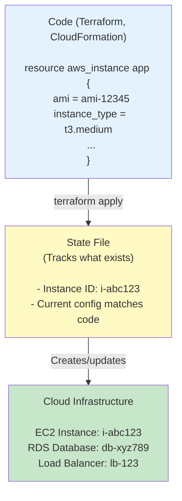
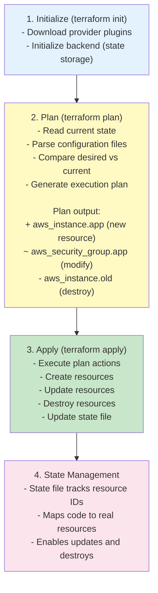
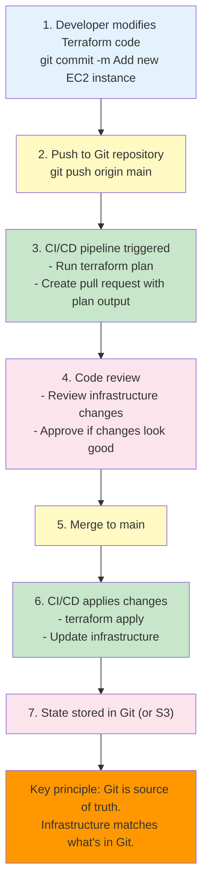

# 🏗️ Infrastructure as Code

## 0️⃣ Prerequisites

Before diving into Infrastructure as Code, you should understand:

- **Cloud Services**: Basic understanding of cloud resources (EC2, S3, VPC, etc. from Topic 5)
- **Version Control**: Git basics (covered in Topic 1)
- **YAML/JSON**: Configuration file formats
- **Command Line**: Running commands in terminal

Quick refresher on **infrastructure**: Infrastructure refers to the computing resources your application needs: servers, databases, networks, load balancers, etc. Traditionally, these were provisioned manually through web consoles or APIs.

---

## 1️⃣ What Problem Does This Exist to Solve?

### The Pain Before Infrastructure as Code

Imagine setting up a production environment:

**Problem 1: The "ClickOps" Nightmare**

```
Setting up production:
1. Log into AWS console
2. Create VPC (click, click, click...)
3. Create subnets (click, click...)
4. Create security groups (click, click...)
5. Launch EC2 instances (click, click...)
6. Configure load balancer (click, click...)
7. Set up RDS database (click, click...)
8. Configure Route 53 (click, click...)

Time: 4-6 hours
Mistakes: Inevitable (wrong subnet, wrong security group)
Documentation: None (what did I click?)
Reproducibility: Impossible
```

**Problem 2: The "Snowflake Server" Problem**

```
Production environment:
- 3 EC2 instances
- 1 RDS database
- 1 load balancer
- Custom configurations applied manually

Staging environment:
- 2 EC2 instances (different sizes)
- 1 RDS database (different version)
- 1 load balancer (different config)
- Slightly different security groups

Dev environment:
- 1 EC2 instance
- Local database
- No load balancer

All three environments are different.
Bugs appear in production that don't appear in staging.
Why? Different configurations.
```

**Problem 3: The "Who Changed What?" Mystery**

```
Monday: Production works fine
Tuesday: Production is broken
What changed?
- Did someone modify security groups?
- Did someone change instance types?
- Did someone update the database?
- Who did it? When? Why?

No audit trail. No way to know.
```

**Problem 4: Disaster Recovery is Manual**

```
Production datacenter fails.
To recover:
1. Remember all infrastructure components
2. Recreate everything manually
3. Hope you remember all configurations
4. Takes days/weeks

Or: Restore from backup (if you have one).
But backups are also manual, inconsistent.
```

**Problem 5: Scaling is Painful**

```
Traffic spike requires:
- 5 more EC2 instances
- Larger RDS instance
- Additional load balancer

Manual process:
1. Log into console
2. Create instances one by one
3. Configure each manually
4. Update load balancer
5. Update DNS

Time: Hours
Risk: Configuration drift, mistakes
```

### What Breaks Without Infrastructure as Code

| Scenario | Manual Infrastructure | Infrastructure as Code |
|----------|---------------------|----------------------|
| Reproducibility | Different each time | Identical every time |
| Version control | No history | Full Git history |
| Rollback | Manual recreation | `terraform apply` previous version |
| Documentation | Outdated wikis | Code is documentation |
| Disaster recovery | Days/weeks | Minutes/hours |
| Consistency | Environments differ | Environments identical |
| Collaboration | "Ask Bob" | Code review process |

---

## 2️⃣ Intuition and Mental Model

### The Recipe Analogy

Think of Infrastructure as Code as a **recipe for infrastructure**.

**Without a recipe** (manual setup):
- Cook remembers ingredients (sometimes forgets)
- Each time tastes slightly different
- Hard to share with others
- Can't scale (cook one dish at a time)

**With a recipe** (Infrastructure as Code):
- Recipe lists exact ingredients and steps
- Same result every time
- Easy to share (give someone the recipe)
- Can scale (multiple cooks follow same recipe)

### Infrastructure as Code Mental Model



<details>
<summary>ASCII diagram (reference)</summary>

```text
┌─────────────────────────────────────────────────────────────────┐
│              INFRASTRUCTURE AS CODE WORKFLOW                      │
│                                                                  │
│  ┌──────────────────────────────────────────────────────────┐   │
│  │              Code (Terraform, CloudFormation)            │   │
│  │                                                           │   │
│  │  resource "aws_instance" "app" {                          │   │
│  │    ami           = "ami-12345"                          │   │
│  │    instance_type = "t3.medium"                           │   │
│  │    ...                                                    │   │
│  │  }                                                        │   │
│  └──────────────────────────────────────────────────────────┘   │
│                              │                                   │
│                              │ terraform apply                   │
│                              ▼                                   │
│  ┌──────────────────────────────────────────────────────────┐   │
│  │              State File                                    │   │
│  │              (Tracks what exists)                         │   │
│  │                                                           │   │
│  │  - Instance ID: i-abc123                                  │   │
│  │  - Current config matches code                            │   │
│  └──────────────────────────────────────────────────────────┘   │
│                              │                                   │
│                              │ Creates/updates                   │
│                              ▼                                   │
│  ┌──────────────────────────────────────────────────────────┐   │
│  │              Cloud Infrastructure                         │   │
│  │                                                           │   │
│  │  EC2 Instance: i-abc123                                  │   │
│  │  RDS Database: db-xyz789                                 │   │
│  │  Load Balancer: lb-123                                   │   │
│  └──────────────────────────────────────────────────────────┘   │
└─────────────────────────────────────────────────────────────────┘
```

</details>

**Key insight**: Code describes desired state. Tool (Terraform, etc.) makes reality match code.

---

## 3️⃣ How It Works Internly

### Terraform Execution Model



<details>
<summary>ASCII diagram (reference)</summary>

```text
┌─────────────────────────────────────────────────────────────────┐
│                    TERRAFORM EXECUTION                            │
│                                                                  │
│  1. Initialize (terraform init)                                  │
│     - Download provider plugins                                  │
│     - Initialize backend (state storage)                        │
│                                                                  │
│  2. Plan (terraform plan)                                        │
│     - Read current state                                         │
│     - Parse configuration files                                 │
│     - Compare desired vs current                                 │
│     - Generate execution plan                                   │
│                                                                  │
│     Plan output:                                                 │
│     + aws_instance.app (new resource)                           │
│     ~ aws_security_group.app (modify)                          │
│     - aws_instance.old (destroy)                                │
│                                                                  │
│  3. Apply (terraform apply)                                     │
│     - Execute plan actions                                      │
│     - Create resources                                          │
│     - Update resources                                          │
│     - Destroy resources                                         │
│     - Update state file                                         │
│                                                                  │
│  4. State Management                                             │
│     - State file tracks resource IDs                            │
│     - Maps code to real resources                               │
│     - Enables updates and destroys                              │
└─────────────────────────────────────────────────────────────────┘
```

</details>

### State File Structure

```json
{
  "version": 4,
  "terraform_version": "1.6.0",
  "resources": [
    {
      "type": "aws_instance",
      "name": "app",
      "provider": "provider[\"registry.terraform.io/hashicorp/aws\"]",
      "instances": [
        {
          "attributes": {
            "id": "i-abc123def456",
            "ami": "ami-0123456789abcdef0",
            "instance_type": "t3.medium",
            "tags": {
              "Name": "app-server"
            }
          }
        }
      ]
    }
  ]
}
```

**State file purpose**:
- Maps code to real resources
- Tracks resource dependencies
- Enables updates (knows what to modify)
- Enables destroys (knows what to delete)

---

## 4️⃣ Simulation: Terraform from Scratch

### Step 1: Simple EC2 Instance

```hcl
# main.tf
terraform {
  required_version = ">= 1.0"
  
  required_providers {
    aws = {
      source  = "hashicorp/aws"
      version = "~> 5.0"
    }
  }
}

provider "aws" {
  region = "us-east-1"
}

resource "aws_instance" "app" {
  ami           = "ami-0c55b159cbfafe1f0"  # Amazon Linux 2023
  instance_type = "t3.medium"
  
  tags = {
    Name = "my-app-server"
    Environment = "production"
  }
}
```

```bash
# Initialize Terraform
terraform init

# Output:
# Initializing provider plugins...
# - Finding hashicorp/aws versions matching ~> 5.0...
# - Installing hashicorp/aws v5.45.0...
# Terraform has been successfully initialized!

# Plan what will be created
terraform plan

# Output:
# Plan: 1 to add, 0 to change, 0 to destroy.
# aws_instance.app will be created
#   + resource "aws_instance" "app" {
#       + ami           = "ami-0c55b159cbfafe1f0"
#       + instance_type = "t3.medium"
#       ...
#     }

# Apply changes
terraform apply

# Output:
# aws_instance.app: Creating...
# aws_instance.app: Creation complete after 30s
# Apply complete! Resources: 1 added, 0 changed, 0 destroyed.
```

### Step 2: Complete Application Stack

```hcl
# variables.tf
variable "environment" {
  description = "Environment name"
  type        = string
  default     = "production"
}

variable "instance_type" {
  description = "EC2 instance type"
  type        = string
  default     = "t3.medium"
}

variable "db_instance_class" {
  description = "RDS instance class"
  type        = string
  default     = "db.t3.micro"
}

# main.tf
terraform {
  required_version = ">= 1.0"
  
  required_providers {
    aws = {
      source  = "hashicorp/aws"
      version = "~> 5.0"
    }
  }
  
  backend "s3" {
    bucket = "my-terraform-state"
    key    = "production/terraform.tfstate"
    region = "us-east-1"
  }
}

provider "aws" {
  region = "us-east-1"
}

# VPC
resource "aws_vpc" "main" {
  cidr_block           = "10.0.0.0/16"
  enable_dns_hostnames = true
  enable_dns_support   = true
  
  tags = {
    Name = "${var.environment}-vpc"
  }
}

# Public Subnet
resource "aws_subnet" "public" {
  vpc_id                  = aws_vpc.main.id
  cidr_block              = "10.0.1.0/24"
  availability_zone       = "us-east-1a"
  map_public_ip_on_launch = true
  
  tags = {
    Name = "${var.environment}-public-subnet"
  }
}

# Internet Gateway
resource "aws_internet_gateway" "main" {
  vpc_id = aws_vpc.main.id
  
  tags = {
    Name = "${var.environment}-igw"
  }
}

# Route Table
resource "aws_route_table" "public" {
  vpc_id = aws_vpc.main.id
  
  route {
    cidr_block = "0.0.0.0/0"
    gateway_id = aws_internet_gateway.main.id
  }
  
  tags = {
    Name = "${var.environment}-public-rt"
  }
}

resource "aws_route_table_association" "public" {
  subnet_id      = aws_subnet.public.id
  route_table_id = aws_route_table.public.id
}

# Security Group
resource "aws_security_group" "app" {
  name        = "${var.environment}-app-sg"
  description = "Security group for application servers"
  vpc_id      = aws_vpc.main.id
  
  ingress {
    description = "HTTP"
    from_port   = 80
    to_port     = 80
    protocol    = "tcp"
    cidr_blocks = ["0.0.0.0/0"]
  }
  
  ingress {
    description = "HTTPS"
    from_port   = 443
    to_port     = 443
    protocol    = "tcp"
    cidr_blocks = ["0.0.0.0/0"]
  }
  
  ingress {
    description = "SSH"
    from_port   = 22
    to_port     = 22
    protocol    = "tcp"
    cidr_blocks = ["10.0.0.0/16"]  # Only from VPC
  }
  
  egress {
    from_port   = 0
    to_port     = 0
    protocol    = "-1"
    cidr_blocks = ["0.0.0.0/0"]
  }
  
  tags = {
    Name = "${var.environment}-app-sg"
  }
}

# EC2 Instance
resource "aws_instance" "app" {
  ami                    = "ami-0c55b159cbfafe1f0"
  instance_type          = var.instance_type
  subnet_id              = aws_subnet.public.id
  vpc_security_group_ids = [aws_security_group.app.id]
  
  user_data = <<-EOF
              #!/bin/bash
              yum update -y
              yum install -y docker
              systemctl start docker
              systemctl enable docker
              docker run -d -p 80:8080 myregistry/myapp:latest
              EOF
  
  tags = {
    Name        = "${var.environment}-app-server"
    Environment = var.environment
  }
}

# RDS Subnet Group
resource "aws_db_subnet_group" "main" {
  name       = "${var.environment}-db-subnet-group"
  subnet_ids = [aws_subnet.public.id]
  
  tags = {
    Name = "${var.environment}-db-subnet-group"
  }
}

# RDS Instance
resource "aws_db_instance" "main" {
  identifier             = "${var.environment}-db"
  engine                  = "postgres"
  engine_version          = "15.4"
  instance_class          = var.db_instance_class
  allocated_storage       = 20
  storage_type           = "gp3"
  db_name                = "myapp"
  username               = "admin"
  password               = var.db_password  # From variable or secret
  db_subnet_group_name   = aws_db_subnet_group.main.name
  vpc_security_group_ids  = [aws_security_group.db.id]
  skip_final_snapshot     = true
  
  tags = {
    Name        = "${var.environment}-database"
    Environment = var.environment
  }
}

# Security Group for RDS
resource "aws_security_group" "db" {
  name        = "${var.environment}-db-sg"
  description = "Security group for database"
  vpc_id      = aws_vpc.main.id
  
  ingress {
    description     = "PostgreSQL"
    from_port       = 5432
    to_port         = 5432
    protocol        = "tcp"
    security_groups = [aws_security_group.app.id]  # Only from app servers
  }
  
  tags = {
    Name = "${var.environment}-db-sg"
  }
}

# Outputs
output "instance_id" {
  description = "ID of the EC2 instance"
  value       = aws_instance.app.id
}

output "instance_public_ip" {
  description = "Public IP of the EC2 instance"
  value       = aws_instance.app.public_ip
}

output "db_endpoint" {
  description = "RDS endpoint"
  value       = aws_db_instance.main.endpoint
  sensitive   = true
}
```

```bash
# Initialize
terraform init

# Plan
terraform plan -var="db_password=secret123"

# Apply
terraform apply -var="db_password=secret123"

# Outputs
terraform output instance_public_ip
terraform output db_endpoint
```

### Step 3: Using Modules

```hcl
# modules/vpc/main.tf
variable "environment" {
  type = string
}

variable "vpc_cidr" {
  type    = string
  default = "10.0.0.0/16"
}

resource "aws_vpc" "main" {
  cidr_block           = var.vpc_cidr
  enable_dns_hostnames = true
  enable_dns_support   = true
  
  tags = {
    Name        = "${var.environment}-vpc"
    Environment = var.environment
  }
}

output "vpc_id" {
  value = aws_vpc.main.id
}

# main.tf (using module)
module "vpc" {
  source = "./modules/vpc"
  
  environment = var.environment
  vpc_cidr    = "10.0.0.0/16"
}

# Use module output
resource "aws_subnet" "public" {
  vpc_id = module.vpc.vpc_id
  # ...
}
```

---

## 5️⃣ State Management

### Local State (Default)

```bash
# State stored locally in terraform.tfstate
terraform apply
# Creates terraform.tfstate file
```

**Problems**:
- Not shared (each developer has own state)
- Not backed up
- Conflicts when multiple people run terraform

### Remote State (S3 Backend)

```hcl
# backend.tf
terraform {
  backend "s3" {
    bucket         = "my-terraform-state-bucket"
    key            = "production/terraform.tfstate"
    region         = "us-east-1"
    encrypt        = true
    dynamodb_table = "terraform-state-lock"  # State locking
  }
}
```

**Benefits**:
- Shared state (team uses same state)
- Backed up (S3 versioning)
- State locking (DynamoDB prevents concurrent modifications)

### State Locking

```
Developer A: terraform apply (locks state)
Developer B: terraform apply (waits for lock)
Developer A: Apply completes (unlocks state)
Developer B: Apply proceeds
```

Prevents state corruption from concurrent modifications.

---

## 6️⃣ Terraform vs CloudFormation

### Comparison

| Aspect | Terraform | CloudFormation |
|--------|-----------|----------------|
| Provider support | Multi-cloud (AWS, Azure, GCP) | AWS only |
| Language | HCL (more readable) | JSON/YAML (verbose) |
| State management | Explicit state file | Managed by AWS |
| Learning curve | Moderate | Steeper |
| Community | Large, open source | AWS-managed |
| Cost | Free | Free |
| Rollback | Manual (previous state) | Automatic (stack rollback) |

### CloudFormation Example

```yaml
# cloudformation.yaml
AWSTemplateFormatVersion: '2010-09-09'
Description: 'Application stack'

Resources:
  AppInstance:
    Type: AWS::EC2::Instance
    Properties:
      ImageId: ami-0c55b159cbfafe1f0
      InstanceType: t3.medium
      Tags:
        - Key: Name
          Value: my-app-server

Outputs:
  InstanceId:
    Description: Instance ID
    Value: !Ref AppInstance
```

```bash
# Deploy
aws cloudformation create-stack \
  --stack-name my-app \
  --template-body file://cloudformation.yaml

# Update
aws cloudformation update-stack \
  --stack-name my-app \
  --template-body file://cloudformation.yaml

# Delete
aws cloudformation delete-stack \
  --stack-name my-app
```

---

## 7️⃣ GitOps Principles

### What is GitOps?

**GitOps**: Use Git as the single source of truth for infrastructure. All infrastructure changes go through Git.



<details>
<summary>ASCII diagram (reference)</summary>

```text
┌─────────────────────────────────────────────────────────────────┐
│                      GITOPS WORKFLOW                             │
│                                                                  │
│  1. Developer modifies Terraform code                          │
│     git commit -m "Add new EC2 instance"                        │
│                                                                  │
│  2. Push to Git repository                                      │
│     git push origin main                                        │
│                                                                  │
│  3. CI/CD pipeline triggered                                     │
│     - Run terraform plan                                         │
│     - Create pull request with plan output                      │
│                                                                  │
│  4. Code review                                                 │
│     - Review infrastructure changes                             │
│     - Approve if changes look good                              │
│                                                                  │
│  5. Merge to main                                                │
│                                                                  │
│  6. CI/CD applies changes                                       │
│     - terraform apply                                            │
│     - Update infrastructure                                     │
│                                                                  │
│  7. State stored in Git (or S3)                                 │
│                                                                  │
│  Key principle: Git is source of truth.                         │
│  Infrastructure matches what's in Git.                          │
└─────────────────────────────────────────────────────────────────┘
```

</details>

### GitOps Benefits

1. **Audit trail**: All changes in Git history
2. **Code review**: Infrastructure changes reviewed like code
3. **Rollback**: Revert Git commit, reapply
4. **Collaboration**: Multiple people can work on infrastructure
5. **Documentation**: Code is documentation

---

## 8️⃣ Tradeoffs and Common Mistakes

### Common Mistakes

**1. Storing Secrets in Code**

```hcl
# BAD: Secrets in code
resource "aws_db_instance" "db" {
  password = "supersecret123"  # Committed to Git!
}
```

**Solution**: Use variables, secrets manager, or environment variables.

```hcl
# GOOD: Use variables
variable "db_password" {
  type      = string
  sensitive = true
}

resource "aws_db_instance" "db" {
  password = var.db_password
}
```

**2. Not Using Remote State**

**Problem**: Local state files cause conflicts.

**Solution**: Always use remote state (S3 backend).

**3. Hardcoding Values**

```hcl
# BAD: Hardcoded
resource "aws_instance" "app" {
  instance_type = "t3.medium"  # Hardcoded
}
```

**Solution**: Use variables.

```hcl
# GOOD: Variable
variable "instance_type" {
  type    = string
  default = "t3.medium"
}

resource "aws_instance" "app" {
  instance_type = var.instance_type
}
```

**4. Not Using Modules**

**Problem**: Code duplication across environments.

**Solution**: Create reusable modules.

**5. Manual Changes Outside Terraform**

```
Terraform manages: EC2 instance
Someone manually changes: Security group via console
Next terraform apply: Reverts manual change (or conflicts)
```

**Solution**: All changes through Terraform. Lock down console access.

---

## 9️⃣ Interview Follow-Up Questions

### Q1: "What's the difference between Terraform and Ansible?"

**Answer**:
**Terraform** is an infrastructure provisioning tool. It creates, updates, and destroys cloud resources. Declarative: you describe what you want, Terraform figures out how to create it. Stateful: tracks what exists.

**Ansible** is a configuration management tool. It configures existing servers (install software, update configs, run commands). Imperative: you describe steps to execute. Stateless: doesn't track state.

Often used together: Terraform creates infrastructure, Ansible configures it.

Example: Terraform creates EC2 instance. Ansible installs Docker and deploys application.

### Q2: "How do you handle secrets in Terraform?"

**Answer**:
Multiple approaches:

1. **Terraform variables** (sensitive): Mark variables as sensitive, pass via command line or environment variables.

2. **AWS Secrets Manager**: Store secrets in Secrets Manager, reference in Terraform.

3. **Environment variables**: Use TF_VAR_ prefix.

4. **Secret management tools**: HashiCorp Vault, AWS Parameter Store.

5. **CI/CD secrets**: Store in CI/CD system (GitHub Secrets, GitLab CI variables), pass to Terraform.

Best practice: Never commit secrets to Git. Use secret management services. Rotate secrets regularly.

### Q3: "How would you manage infrastructure for multiple environments?"

**Answer**:
Approaches:

1. **Separate workspaces**: Use Terraform workspaces or separate state files per environment.

2. **Modules**: Create reusable modules, instantiate per environment with different variables.

3. **Directory structure**:
```
infrastructure/
├── modules/
│   └── app/
├── environments/
│   ├── dev/
│   │   └── main.tf
│   ├── staging/
│   │   └── main.tf
│   └── production/
│       └── main.tf
```

4. **Variable files**: `terraform.tfvars` per environment.

5. **Backend configuration**: Separate state buckets per environment.

Example: Same module code, different variable values (instance sizes, database classes) per environment.

### Q4: "What happens if someone manually changes infrastructure that Terraform manages?"

**Answer**:
Terraform detects drift:

1. **Next terraform plan**: Shows differences between code and actual state.

2. **Options**:
   - **Revert**: `terraform apply` reverts manual changes to match code.
   - **Import**: `terraform import` to bring manual resource under Terraform management.
   - **Update code**: Update Terraform code to match manual changes (not recommended).

Best practice: Prevent manual changes. Use IAM policies to restrict console access. All changes through Terraform and code review.

### Q5: "How do you test Infrastructure as Code?"

**Answer**:
Testing strategies:

1. **terraform validate**: Syntax validation.

2. **terraform plan**: Review plan output before applying.

3. **terraform fmt**: Format code consistently.

4. **terraform lint**: Use tools like tflint.

5. **Unit tests**: Use Terratest (Go) to test modules.

6. **Integration tests**: Apply in test environment, verify resources created correctly.

7. **Policy as Code**: Use tools like OPA (Open Policy Agent) to enforce policies.

8. **Cost estimation**: Use tools like Infracost to estimate costs before applying.

Example workflow: Lint → Validate → Plan → Review → Apply to staging → Test → Apply to production.

---

## 🔟 One Clean Mental Summary

Infrastructure as Code (IaC) treats infrastructure like software: version controlled, reviewed, tested, and deployed. Terraform is a popular tool that uses declarative configuration (HCL) to describe desired infrastructure state. It maintains a state file that maps code to real resources, enabling updates and destroys.

Key benefits: reproducibility (same infrastructure every time), version control (full history), collaboration (code review), disaster recovery (recreate from code), and consistency (environments match).

The key insight: Infrastructure becomes code. Changes go through the same process as application code: write, test, review, deploy. This eliminates "snowflake servers" and manual configuration drift.


