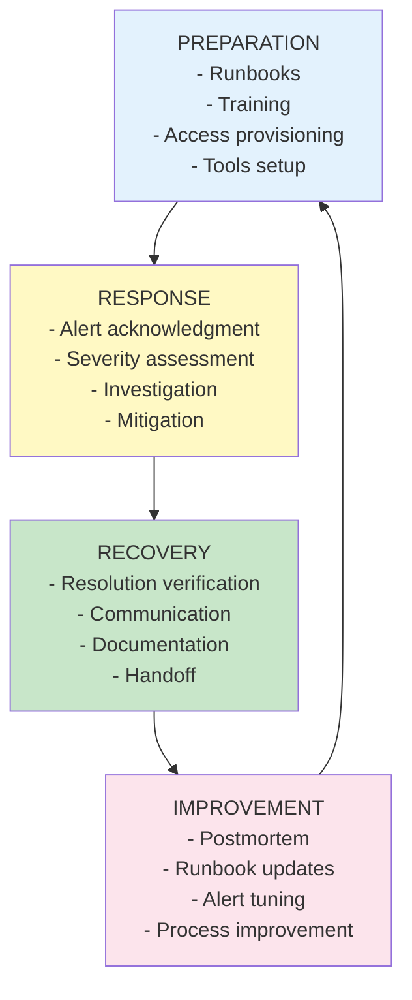
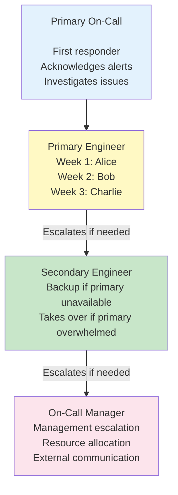
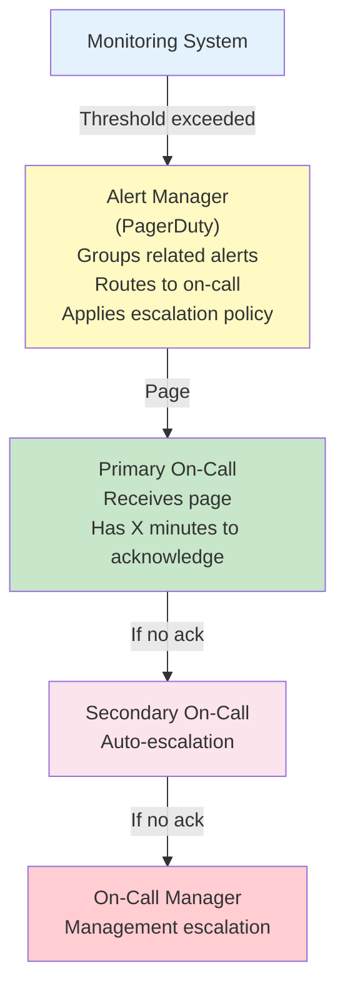

# 📟 On-Call Best Practices

## 0️⃣ Prerequisites

Before diving into on-call best practices, you should understand:

- **Debugging & Incident Response**: Basic incident handling (covered in Topic 12)
- **Observability**: Logs, metrics, traces (covered in Topic 10)
- **Alerting**: How alerts work and are configured (covered in Topic 11)

Quick refresher on **on-call**: On-call means being available to respond to production issues outside normal working hours. The on-call engineer is the first responder when alerts fire.

---

## 1️⃣ What Problem Does This Exist to Solve?

### The Pain of Poor On-Call Practices

**Problem 1: The "Burnout Engineer"**

```
Week 1: Alice on-call, 15 pages, 3 AM wakeups
Week 2: Alice on-call again (no backup)
Week 3: Alice on-call again
Week 4: Alice quits

No rotation. One person carries the burden.
Burnout is inevitable.
```

**Problem 2: The "Deer in Headlights" Response**

```
3:00 AM: Alert fires: "Database connection pool exhausted"
3:05 AM: New engineer Bob gets paged (first time on-call)
3:10 AM: Bob doesn't know what to do
3:15 AM: Bob searches for documentation (none exists)
3:30 AM: Bob tries random things
4:00 AM: Bob escalates to senior engineer
4:30 AM: Senior engineer fixes in 5 minutes

No runbooks. No training. Wasted time.
```

**Problem 3: The "Alert Storm"**

```
3:00 AM: Alert 1: High CPU
3:01 AM: Alert 2: High memory
3:02 AM: Alert 3: High latency
3:03 AM: Alert 4: Error rate high
3:04 AM: Alert 5: Database slow
3:05 AM: Alert 6: Cache miss rate high
...
3:30 AM: 50 alerts received

All alerts for the same root cause.
Engineer overwhelmed. Can't focus.
```

**Problem 4: The "Handoff Failure"**

```
Monday 5 PM: Alice finishes on-call
Monday 5 PM: Bob starts on-call
Monday 5:30 PM: Issue from Alice's shift resurfaces
Monday 6 PM: Bob has no context

Alice: "I thought it was fixed"
Bob: "I don't know what you did"

No handoff. Lost context.
```

**Problem 5: The "Repeat Incident"**

```
January: Payment service outage (database)
February: Payment service outage (database)
March: Payment service outage (database)

Same issue. Same fix. No permanent solution.
No learning from incidents.
```

### What Breaks Without Good On-Call Practices

| Scenario | Poor On-Call | Good On-Call |
|----------|-------------|--------------|
| Response time | Hours | Minutes |
| Engineer burnout | High | Managed |
| Knowledge sharing | Siloed | Documented |
| Incident resolution | Random | Systematic |
| Learning | None | Continuous |

---

## 2️⃣ Intuition and Mental Model

### The Fire Department Analogy

Think of on-call like a **fire department**.

**Bad fire department**:
- No training
- No equipment
- No communication
- Random response
- Everyone panics

**Good fire department**:
- Regular training
- Well-maintained equipment
- Clear communication protocols
- Systematic response
- Calm under pressure

### On-Call Mental Model



<details>
<summary>ASCII diagram (reference)</summary>

```text
┌─────────────────────────────────────────────────────────────────┐
│                    ON-CALL ECOSYSTEM                             │
│                                                                  │
│  ┌──────────────────────────────────────────────────────────┐   │
│  │                 PREPARATION                               │   │
│  │  - Runbooks                                               │   │
│  │  - Training                                               │   │
│  │  - Access provisioning                                    │   │
│  │  - Tools setup                                            │   │
│  └──────────────────────────────────────────────────────────┘   │
│                              │                                   │
│                              ▼                                   │
│  ┌──────────────────────────────────────────────────────────┐   │
│  │                 RESPONSE                                  │   │
│  │  - Alert acknowledgment                                   │   │
│  │  - Severity assessment                                    │   │
│  │  - Investigation                                          │   │
│  │  - Mitigation                                             │   │
│  └──────────────────────────────────────────────────────────┘   │
│                              │                                   │
│                              ▼                                   │
│  ┌──────────────────────────────────────────────────────────┐   │
│  │                 RECOVERY                                  │   │
│  │  - Resolution verification                                │   │
│  │  - Communication                                          │   │
│  │  - Documentation                                          │   │
│  │  - Handoff                                                │   │
│  └──────────────────────────────────────────────────────────┘   │
│                              │                                   │
│                              ▼                                   │
│  ┌──────────────────────────────────────────────────────────┐   │
│  │                 IMPROVEMENT                               │   │
│  │  - Postmortem                                             │   │
│  │  - Runbook updates                                        │   │
│  │  - Alert tuning                                           │   │
│  │  - Process improvement                                    │   │
│  └──────────────────────────────────────────────────────────┘   │
└─────────────────────────────────────────────────────────────────┘
```

</details>

---

## 3️⃣ How It Works Internally

### On-Call Rotation Structure



<details>
<summary>ASCII diagram (reference)</summary>

```text
┌─────────────────────────────────────────────────────────────────┐
│                    ROTATION STRUCTURE                            │
│                                                                  │
│  Primary On-Call                                                │
│       │                                                         │
│       │ First responder                                         │
│       │ Acknowledges alerts                                     │
│       │ Investigates issues                                     │
│       ▼                                                         │
│  ┌──────────────┐                                               │
│  │   Primary    │ ← Week 1: Alice                              │
│  │   Engineer   │ ← Week 2: Bob                                 │
│  └──────────────┘ ← Week 3: Charlie                            │
│       │                                                         │
│       │ Escalates if needed                                     │
│       ▼                                                         │
│  ┌──────────────┐                                               │
│  │  Secondary   │ ← Backup if primary unavailable              │
│  │   Engineer   │ ← Takes over if primary overwhelmed          │
│  └──────────────┘                                               │
│       │                                                         │
│       │ Escalates if needed                                     │
│       ▼                                                         │
│  ┌──────────────┐                                               │
│  │  On-Call     │ ← Management escalation                      │
│  │  Manager     │ ← Resource allocation                        │
│  └──────────────┘ ← External communication                     │
└─────────────────────────────────────────────────────────────────┘
```

</details>

### Alert Flow



<details>
<summary>ASCII diagram (reference)</summary>

```text
┌─────────────────────────────────────────────────────────────────┐
│                    ALERT FLOW                                    │
│                                                                  │
│  Monitoring System                                              │
│       │                                                         │
│       │ Threshold exceeded                                      │
│       ▼                                                         │
│  ┌──────────────┐                                               │
│  │   Alert      │                                               │
│  │   Manager    │ ← Groups related alerts                      │
│  │ (PagerDuty)  │ ← Routes to on-call                          │
│  └──────────────┘ ← Applies escalation policy                  │
│       │                                                         │
│       │ Page                                                    │
│       ▼                                                         │
│  ┌──────────────┐                                               │
│  │   Primary    │                                               │
│  │   On-Call    │ ← Receives page                              │
│  └──────────────┘ ← Has X minutes to acknowledge               │
│       │                                                         │
│       │ If no ack                                               │
│       ▼                                                         │
│  ┌──────────────┐                                               │
│  │  Secondary   │ ← Auto-escalation                            │
│  │   On-Call    │                                               │
│  └──────────────┘                                               │
│       │                                                         │
│       │ If no ack                                               │
│       ▼                                                         │
│  ┌──────────────┐                                               │
│  │  On-Call     │ ← Management escalation                      │
│  │  Manager     │                                               │
│  └──────────────┘                                               │
└─────────────────────────────────────────────────────────────────┘
```

</details>

---

## 4️⃣ Runbook Creation

### Runbook Structure

```markdown
# Runbook: [Alert Name]

## Overview
Brief description of what this alert means and why it matters.

## Severity
P0/P1/P2/P3 and expected response time.

## Symptoms
- What the alert looks like
- Related alerts that might fire
- User impact

## Quick Checks (< 5 minutes)
1. First thing to check
2. Second thing to check
3. Third thing to check

## Investigation Steps
### Scenario 1: [Common Cause]
**Symptoms**: Specific symptoms for this cause
**Steps**:
1. Step 1
2. Step 2
3. Step 3
**Fix**: How to resolve

### Scenario 2: [Another Cause]
**Symptoms**: Specific symptoms
**Steps**: ...
**Fix**: ...

## Mitigation
Quick actions to restore service while investigating root cause.

## Escalation
- When to escalate
- Who to escalate to
- How to escalate

## Related Links
- Dashboard: [link]
- Service documentation: [link]
- Previous incidents: [link]
```

### Example Runbook

```markdown
# Runbook: Payment Service High Error Rate

## Overview
This alert fires when the payment service error rate exceeds 1% over 5 minutes.
Payment failures directly impact revenue and user experience.

## Severity
P1 - Respond within 15 minutes during business hours, 30 minutes off-hours.

## Symptoms
- Alert: `PaymentErrorRateHigh`
- Users reporting payment failures
- Revenue dashboard showing decline
- Related alerts: `PaymentLatencyHigh`, `DatabaseConnectionPoolExhausted`

## Quick Checks (< 5 minutes)

1. **Check service health**
   ```bash
   kubectl get pods -n payment
   kubectl describe deployment payment-service -n payment
   ```

2. **Check recent deployments**
   ```bash
   kubectl rollout history deployment/payment-service -n payment
   ```

3. **Check error logs**
   ```bash
   kubectl logs -f deployment/payment-service -n payment | grep ERROR
   ```

4. **Check Grafana dashboard**
   [Payment Service Dashboard](https://grafana.example.com/d/payment)

## Investigation Steps

### Scenario 1: Database Connection Issues
**Symptoms**:
- Error logs show "Connection timeout" or "Connection refused"
- Database connection pool metrics at 100%

**Steps**:
1. Check database status:
   ```bash
   kubectl get pods -n database
   ```
2. Check connection pool metrics in Grafana
3. Check database CPU/memory

**Fix**:
- If database overloaded: Scale up database
- If connection leak: Restart payment service
- If database down: Follow database recovery runbook

### Scenario 2: External Payment Gateway Issues
**Symptoms**:
- Error logs show "Gateway timeout" or "503 Service Unavailable"
- Payment gateway latency spike

**Steps**:
1. Check payment gateway status page: [status.paymentgateway.com](https://status.paymentgateway.com)
2. Check payment gateway latency metrics
3. Check if specific payment methods affected

**Fix**:
- If gateway down: Enable fallback payment method (if available)
- If specific method: Disable that payment method temporarily
- Contact payment gateway support

### Scenario 3: Recent Deployment Bug
**Symptoms**:
- Errors started after recent deployment
- New error types in logs

**Steps**:
1. Check deployment time vs error start time
2. Review recent commits
3. Check if canary showed issues

**Fix**:
- Rollback deployment:
  ```bash
  kubectl rollout undo deployment/payment-service -n payment
  ```
- Verify error rate returns to normal

## Mitigation
If root cause unclear, take these steps to restore service:

1. **Scale up**: Add more replicas
   ```bash
   kubectl scale deployment payment-service --replicas=10 -n payment
   ```

2. **Restart service**: Clear any stuck state
   ```bash
   kubectl rollout restart deployment/payment-service -n payment
   ```

3. **Enable circuit breaker**: Fail fast instead of timeout
   Set feature flag: `payment-circuit-breaker=true`

## Escalation
- If not resolved in 15 minutes: Escalate to payment team lead
- If P0 (>50% error rate): Page on-call manager
- If external dependency: Contact vendor support

## Related Links
- [Payment Service Dashboard](https://grafana.example.com/d/payment)
- [Payment Service Documentation](https://wiki.example.com/payment-service)
- [Previous Payment Incidents](https://jira.example.com/issues/?jql=project=INCIDENT+AND+component=payment)
```

---

## 5️⃣ Alert Fatigue Prevention

### What is Alert Fatigue?

**Alert fatigue** occurs when on-call engineers receive so many alerts that they start ignoring them.

```
Symptoms of alert fatigue:
- Engineers don't respond to alerts
- "That alert always fires, ignore it"
- Real issues missed
- Burnout
```

### Strategies to Prevent Alert Fatigue

**1. Only Alert on Actionable Issues**

```yaml
# BAD: Informational alert (not actionable)
- alert: CPUUsageHigh
  expr: cpu_usage > 50  # Too low, fires constantly
  
# GOOD: Actionable alert
- alert: CPUUsageCritical
  expr: cpu_usage > 90
  for: 10m  # Sustained high CPU
  annotations:
    runbook: "https://wiki/runbooks/cpu-high"
```

**2. Use Appropriate Severity Levels**

```yaml
# Severity levels
P0: Critical - Service down, immediate response required
P1: High - Major degradation, respond within 15 minutes
P2: Medium - Minor issues, respond within 4 hours
P3: Low - Informational, review during business hours

# Only page for P0 and P1
# P2 and P3 go to Slack or email
```

**3. Group Related Alerts**

```yaml
# PagerDuty configuration
group_by: ['alertname', 'service']
group_wait: 30s      # Wait 30s before sending
group_interval: 5m   # Group alerts for 5 minutes
repeat_interval: 3h  # Don't repeat for 3 hours
```

**4. Implement Alert Deduplication**

```yaml
# Alertmanager configuration
inhibit_rules:
  - source_match:
      severity: 'critical'
    target_match:
      severity: 'warning'
    equal: ['alertname', 'service']
  # If critical alert fires, suppress warning
```

**5. Regular Alert Review**

```markdown
# Monthly Alert Review Checklist

1. Alerts that fired most frequently
   - Are they actionable?
   - Can thresholds be adjusted?
   - Should they be removed?

2. Alerts that were acknowledged but not resolved
   - Why weren't they resolved?
   - Are they false positives?

3. Alerts that were never acknowledged
   - Are they being ignored?
   - Should they be removed?

4. Missing alerts
   - Were there incidents without alerts?
   - What alerts should we add?
```

---

## 6️⃣ Escalation Policies

### Escalation Levels

```
┌─────────────────────────────────────────────────────────────────┐
│                    ESCALATION POLICY                             │
│                                                                  │
│  Level 1: Primary On-Call                                       │
│  - Notified immediately                                         │
│  - Has 5 minutes to acknowledge                                 │
│                                                                  │
│  Level 2: Secondary On-Call                                     │
│  - Notified after 5 minutes if no ack                          │
│  - Has 5 minutes to acknowledge                                 │
│                                                                  │
│  Level 3: On-Call Manager                                       │
│  - Notified after 10 minutes if no ack                         │
│  - Or immediately for P0                                        │
│                                                                  │
│  Level 4: Engineering Director                                  │
│  - Notified after 30 minutes for P0                            │
│  - Or if incident duration > 1 hour                            │
│                                                                  │
│  Level 5: VP Engineering                                        │
│  - Notified for P0 > 2 hours                                   │
│  - Or major business impact                                     │
└─────────────────────────────────────────────────────────────────┘
```

### PagerDuty Escalation Configuration

```yaml
# Escalation policy
escalation_policy:
  name: "Payment Service"
  rules:
    - escalation_delay_in_minutes: 5
      targets:
        - type: "user_reference"
          id: "primary_oncall"
    
    - escalation_delay_in_minutes: 5
      targets:
        - type: "user_reference"
          id: "secondary_oncall"
    
    - escalation_delay_in_minutes: 10
      targets:
        - type: "user_reference"
          id: "oncall_manager"
    
    - escalation_delay_in_minutes: 30
      targets:
        - type: "user_reference"
          id: "engineering_director"
```

### When to Escalate

**Escalate immediately if**:
- P0 incident (service completely down)
- Security breach suspected
- Data loss or corruption
- Need additional expertise
- Unable to make progress after 15 minutes

**Escalate to management if**:
- Customer-facing impact > 30 minutes
- Need to make business decisions
- External communication required
- Resource allocation needed

---

## 7️⃣ Handoff Procedures

### Handoff Checklist

```markdown
# On-Call Handoff Checklist

## Outgoing On-Call
1. [ ] Document any ongoing issues
2. [ ] Update incident tickets with current status
3. [ ] Note any scheduled maintenance
4. [ ] Share context on recent alerts
5. [ ] Highlight any known issues to watch

## Incoming On-Call
1. [ ] Verify access to all systems
2. [ ] Check PagerDuty/OpsGenie schedule
3. [ ] Review recent incidents
4. [ ] Check scheduled maintenance
5. [ ] Confirm contact information updated
```

### Handoff Meeting Template

```markdown
# On-Call Handoff Meeting

## Date: [Date]
## Outgoing: [Name]
## Incoming: [Name]

## Summary of Shift
- Total alerts: X
- Incidents: Y
- Pages: Z

## Ongoing Issues
1. [Issue 1]
   - Status: [In progress/Monitoring]
   - Next steps: [What needs to be done]
   - Contacts: [Who to reach out to]

2. [Issue 2]
   - Status: ...

## Known Issues to Watch
- [Issue that might resurface]
- [Scheduled maintenance]
- [Upcoming deployments]

## Learnings
- [Anything learned during shift]
- [Runbook updates needed]
- [Process improvements]

## Questions from Incoming
- [Questions and answers]
```

### Handoff Automation

```java
// Automated handoff notification
@Scheduled(cron = "0 0 9 * * MON")  // Every Monday 9 AM
public void sendHandoffReminder() {
    OnCallSchedule schedule = pagerDutyService.getCurrentSchedule();
    
    String outgoing = schedule.getCurrentOnCall();
    String incoming = schedule.getNextOnCall();
    
    // Get recent incidents
    List<Incident> recentIncidents = incidentService.getLastWeek();
    
    // Generate handoff report
    HandoffReport report = HandoffReport.builder()
        .outgoing(outgoing)
        .incoming(incoming)
        .incidents(recentIncidents)
        .ongoingIssues(getOngoingIssues())
        .scheduledMaintenance(getScheduledMaintenance())
        .build();
    
    // Send to Slack
    slackService.sendHandoffReport(report);
    
    // Schedule handoff meeting
    calendarService.scheduleHandoffMeeting(outgoing, incoming);
}
```

---

## 8️⃣ Documentation Standards

### Service Documentation

```markdown
# Service: Payment Service

## Overview
Processes all payment transactions for the platform.

## Architecture
[Architecture diagram]

## Dependencies
- Database: PostgreSQL (payment-db)
- Cache: Redis (payment-cache)
- External: Payment Gateway API
- Internal: User Service, Order Service

## Endpoints
- POST /api/payments - Create payment
- GET /api/payments/{id} - Get payment
- POST /api/payments/{id}/refund - Refund payment

## Metrics
- payment_requests_total
- payment_errors_total
- payment_duration_seconds

## Alerts
- PaymentErrorRateHigh
- PaymentLatencyHigh
- PaymentServiceDown

## Runbooks
- [Payment Error Rate High](runbooks/payment-error-rate.md)
- [Payment Latency High](runbooks/payment-latency.md)

## Contacts
- Team: Payment Team
- Slack: #payment-team
- On-call: PagerDuty "Payment Service"
```

### Incident Documentation

```markdown
# Incident: [INC-123]

## Summary
Brief description of what happened.

## Timeline
| Time | Event |
|------|-------|
| 14:30 | Alert fired |
| 14:35 | On-call acknowledged |
| 14:45 | Root cause identified |
| 15:00 | Fix deployed |
| 15:05 | Resolved |

## Impact
- Duration: 35 minutes
- Users affected: 5,000
- Revenue impact: $10,000

## Root Cause
What caused the incident.

## Resolution
What was done to fix it.

## Action Items
- [ ] Action 1 (Owner, Due date)
- [ ] Action 2 (Owner, Due date)
```

---

## 9️⃣ Interview Follow-Up Questions

### Q1: "How do you prevent on-call burnout?"

**Answer**:
Multiple strategies:

1. **Fair rotation**: Equal distribution of on-call shifts. No one person always on-call.

2. **Limit shift length**: 1 week maximum. Consider shorter shifts for high-volume services.

3. **Compensate**: On-call pay, time off after incidents, recognition.

4. **Reduce toil**: Fix recurring issues. Automate common tasks. Improve runbooks.

5. **Alert tuning**: Reduce noise. Only page for actionable issues.

6. **Support structure**: Always have backup. Don't leave anyone alone.

7. **Post-incident rest**: No meetings after major incidents. Time to recover.

8. **Track metrics**: Monitor pages per shift. If increasing, investigate why.

The goal is sustainable on-call. If engineers dread on-call, something is wrong.

### Q2: "How do you handle an incident when you don't know the system?"

**Answer**:
Approach for unfamiliar systems:

1. **Don't panic**: Acknowledge the alert, communicate you're investigating.

2. **Check runbook**: If runbook exists, follow it step by step.

3. **Check recent changes**: Deployments, config changes often cause issues.

4. **Check dashboards**: Look for obvious anomalies (CPU, memory, errors).

5. **Read error logs**: Search for ERROR level logs around alert time.

6. **Escalate early**: If stuck after 10-15 minutes, escalate. Don't waste time.

7. **Document as you go**: Note what you tried, what you found.

8. **Ask for help**: Reach out to secondary, team members, or subject matter experts.

Key insight: It's okay to not know everything. Good on-call is about systematic investigation and knowing when to escalate.

### Q3: "What makes a good runbook?"

**Answer**:
Good runbook characteristics:

1. **Actionable**: Clear steps, not just descriptions. Commands to run, buttons to click.

2. **Up-to-date**: Regularly reviewed and updated. Reflects current system.

3. **Scenario-based**: Covers common causes with specific symptoms and fixes.

4. **Quick checks first**: Start with fast diagnostic steps before deep investigation.

5. **Escalation guidance**: When to escalate, who to escalate to.

6. **Links to resources**: Dashboards, documentation, previous incidents.

7. **Tested**: Runbook should be tested during normal operations, not first time during incident.

8. **Accessible**: Easy to find, searchable, available during outages.

Bad runbook: "Check the logs and fix the issue."
Good runbook: "Run `kubectl logs -f deployment/payment | grep ERROR`. If you see 'Connection timeout', follow Scenario 2."

### Q4: "How do you reduce alert fatigue?"

**Answer**:
Strategies:

1. **Tune thresholds**: Only alert on significant deviations. Avoid low thresholds that fire constantly.

2. **Add duration**: `for: 5m` means alert only fires if condition persists for 5 minutes.

3. **Group alerts**: Related alerts should be grouped, not sent individually.

4. **Severity levels**: Only page for critical. Send warnings to Slack.

5. **Regular review**: Monthly review of alerts. Remove noisy ones, tune thresholds.

6. **Require runbooks**: Every alert must have a runbook. No runbook = alert might not be needed.

7. **Measure alert quality**: Track false positive rate. High rate means alerts need tuning.

8. **SLO-based alerting**: Alert on SLO violations, not every metric spike.

Goal: Every alert should be actionable and require human intervention.

### Q5: "How do you ensure knowledge transfer for on-call?"

**Answer**:
Knowledge transfer mechanisms:

1. **Runbooks**: Document common scenarios and fixes. Update after every incident.

2. **Handoff meetings**: Outgoing and incoming on-call meet to discuss ongoing issues.

3. **Incident reviews**: Weekly review of incidents. Share learnings with team.

4. **Shadow on-call**: New engineers shadow experienced on-call before taking primary.

5. **Postmortems**: Document root causes, contributing factors, and action items.

6. **Service documentation**: Architecture, dependencies, common issues documented.

7. **On-call training**: Formal training on tools, processes, and common scenarios.

8. **Slack channels**: Dedicated channels for on-call questions and discussions.

Key: Knowledge should be in systems (runbooks, documentation), not in people's heads.

---

## 🔟 One Clean Mental Summary

On-call best practices ensure sustainable, effective incident response. Key elements: fair rotation (prevent burnout), comprehensive runbooks (enable quick resolution), alert tuning (prevent fatigue), clear escalation policies (know when to get help), and proper handoffs (maintain context).

Good on-call is about preparation (runbooks, training, access), response (systematic investigation, clear communication), and improvement (postmortems, runbook updates). Every alert should be actionable with a runbook. Every incident should result in learning.

The key insight: On-call is a team sport. No one should be alone. Knowledge should be documented, not siloed. The goal is sustainable operations where incidents are handled efficiently and engineers don't burn out.

