# 📊 Load Testing & Performance

## 0️⃣ Prerequisites

Before diving into load testing and performance, you should understand:

- **HTTP Basics**: Request/response model, status codes (Phase 2)
- **Metrics**: Understanding latency, throughput, error rates (Topic 10)
- **Application Architecture**: How your services are structured (Phase 7)
- **Database Basics**: Queries, connections, indexing (Phase 3)

Quick refresher on **latency**: Latency is the time it takes for a request to complete, from when the client sends it to when the client receives the response. Usually measured in milliseconds (ms).

Quick refresher on **throughput**: Throughput is the number of requests a system can handle per unit of time, typically measured in requests per second (RPS).

---

## 1️⃣ What Problem Does This Exist to Solve?

### The Pain Before Load Testing

**Problem 1: The "It Works on My Machine" Scale**

```
Development:
- 1 developer
- 10 test requests
- Response time: 50ms
- "It's fast!"

Production:
- 100,000 users
- 10,000 requests/second
- Response time: 10 seconds
- "It's broken!"

No one tested at scale.
```

**Problem 2: The "Black Friday Surprise"**

```
Normal traffic: 1,000 requests/second
Black Friday: 50,000 requests/second

What happens:
- Database connections exhausted
- Memory exhausted
- Servers crash
- Revenue lost

No one knew the breaking point.
```

**Problem 3: The "Slow Creep"**

```
January: Average response time 100ms
February: Average response time 120ms
March: Average response time 150ms
...
December: Average response time 500ms

No one noticed until users complained.
No baseline. No monitoring.
```

**Problem 4: The "Optimization Guessing Game"**

```
Team: "The app is slow"
Developer A: "It's the database"
Developer B: "It's the API"
Developer C: "It's the frontend"

Everyone guesses. No one knows.
No profiling. No data.
```

**Problem 5: The "Capacity Mystery"**

```
Question: "How many users can our system handle?"
Answer: "We don't know"

Question: "Do we need more servers?"
Answer: "We don't know"

Question: "What's our cost per user?"
Answer: "We don't know"
```

### What Breaks Without Load Testing

| Scenario | Without Load Testing | With Load Testing |
|----------|---------------------|------------------|
| Capacity | Unknown | Known limits |
| Performance | Guessing | Data-driven |
| Scaling | Reactive | Proactive |
| Bottlenecks | Found in production | Found in testing |
| Cost planning | Impossible | Accurate |

---

## 2️⃣ Intuition and Mental Model

### The Highway Analogy

Think of your system as a **highway**.

**Without load testing**:
- Don't know how many cars it can handle
- Don't know where traffic jams form
- Don't know when to add lanes
- Surprised when it breaks down

**With load testing**:
- Know capacity (10,000 cars/hour)
- Know bottlenecks (exit ramps)
- Know when to expand (80% capacity)
- Plan for peak times (rush hour)

### Performance Mental Model

```mermaid
flowchart TD
    subgraph METRICS["PERFORMANCE METRICS"]
        LATENCY["LATENCY (How fast?)<br/>├─ p50 (median): 50% faster<br/>├─ p95: 95% faster<br/>├─ p99: 99% faster<br/>└─ p99.9: 99.9% faster"]
        THROUGHPUT["THROUGHPUT (How many?)<br/>└─ Requests per second (RPS)"]
        ERROR["ERROR RATE (How reliable?)<br/>└─ Percentage of failed requests"]
        RESOURCES["RESOURCE UTILIZATION (How efficient?)<br/>├─ CPU usage<br/>├─ Memory usage<br/>├─ Network I/O<br/>└─ Database connections"]
    end
    
    style METRICS fill:#e3f2fd
    style LATENCY fill:#fff9c4
    style THROUGHPUT fill:#c8e6c9
    style ERROR fill:#fce4ec
    style RESOURCES fill:#fff9c4
```



<details>
<summary>ASCII diagram (reference)</summary>

```text
┌─────────────────────────────────────────────────────────────────┐
│                    PERFORMANCE METRICS                           │
│                                                                  │
│  LATENCY (How fast?)                                            │
│  ├─ p50 (median): 50% of requests faster than this             │
│  ├─ p95: 95% of requests faster than this                      │
│  ├─ p99: 99% of requests faster than this                      │
│  └─ p99.9: 99.9% of requests faster than this                  │
│                                                                  │
│  THROUGHPUT (How many?)                                         │
│  └─ Requests per second (RPS)                                  │
│                                                                  │
│  ERROR RATE (How reliable?)                                     │
│  └─ Percentage of failed requests                              │
│                                                                  │
│  RESOURCE UTILIZATION (How efficient?)                          │
│  ├─ CPU usage                                                   │
│  ├─ Memory usage                                                │
│  ├─ Network I/O                                                 │
│  └─ Database connections                                        │
└─────────────────────────────────────────────────────────────────┘
```

</details>

### Types of Load Tests


<details>
<summary>ASCII diagram (reference)</summary>

```text
┌─────────────────────────────────────────────────────────────────┐
│                    LOAD TEST TYPES                               │
│                                                                  │
│  1. SMOKE TEST                                                  │
│     Purpose: Verify basic functionality                         │
│     Load: Minimal (1-5 users)                                   │
│     Duration: Short (1-5 minutes)                               │
│                                                                  │
│  2. LOAD TEST                                                   │
│     Purpose: Test expected load                                 │
│     Load: Normal production load                                │
│     Duration: Extended (30-60 minutes)                          │
│                                                                  │
│  3. STRESS TEST                                                 │
│     Purpose: Find breaking point                                │
│     Load: Beyond expected (2-10x normal)                        │
│     Duration: Until failure                                     │
│                                                                  │
│  4. SPIKE TEST                                                  │
│     Purpose: Test sudden traffic surge                          │
│     Load: Sudden increase (10x in seconds)                      │
│     Duration: Short burst                                       │
│                                                                  │
│  5. SOAK TEST (Endurance)                                       │
│     Purpose: Find memory leaks, degradation                     │
│     Load: Normal load                                           │
│     Duration: Extended (hours/days)                             │
└─────────────────────────────────────────────────────────────────┘
```

</details>

---

## 3️⃣ How It Works Internally

### Load Test Architecture

```mermaid
flowchart TD
    GEN["Load Generator<br/>(k6, JMeter, Gatling)<br/><br/>Virtual Users: 1000<br/>Requests/sec: 5000<br/>Duration: 30 minutes"]
    SUT["System Under Test<br/><br/>Load Balancer → App Servers → Database<br/>↓ Metrics ↓ Metrics ↓ Metrics"]
    MON["Monitoring<br/>(Prometheus, Grafana)<br/><br/>- Response times<br/>- Error rates<br/>- Resource utilization<br/>- Throughput"]
    
    GEN -->|HTTP Requests| SUT
    SUT -->|Metrics| MON
    
    style GEN fill:#e3f2fd
    style SUT fill:#fff9c4
    style MON fill:#c8e6c9
```



<details>
<summary>ASCII diagram (reference)</summary>

```text
┌─────────────────────────────────────────────────────────────────┐
│                    LOAD TEST ARCHITECTURE                        │
│                                                                  │
│  ┌──────────────────────────────────────────────────────────┐   │
│  │              Load Generator                               │   │
│  │              (k6, JMeter, Gatling)                       │   │
│  │                                                           │   │
│  │  Virtual Users: 1000                                     │   │
│  │  Requests/sec: 5000                                      │   │
│  │  Duration: 30 minutes                                    │   │
│  └──────────────────────────────────────────────────────────┘   │
│                              │                                   │
│                              │ HTTP Requests                     │
│                              ▼                                   │
│  ┌──────────────────────────────────────────────────────────┐   │
│  │              System Under Test                            │   │
│  │                                                           │   │
│  │  Load Balancer → App Servers → Database                  │   │
│  │       ↓              ↓            ↓                      │   │
│  │  Metrics        Metrics       Metrics                    │   │
│  └──────────────────────────────────────────────────────────┘   │
│                              │                                   │
│                              │ Metrics                           │
│                              ▼                                   │
│  ┌──────────────────────────────────────────────────────────┐   │
│  │              Monitoring                                   │   │
│  │              (Prometheus, Grafana)                       │   │
│  │                                                           │   │
│  │  - Response times                                        │   │
│  │  - Error rates                                           │   │
│  │  - Resource utilization                                  │   │
│  │  - Throughput                                            │   │
│  └──────────────────────────────────────────────────────────┘   │
└─────────────────────────────────────────────────────────────────┘
```

</details>

### Virtual Users Model


<details>
<summary>ASCII diagram (reference)</summary>

```text
┌─────────────────────────────────────────────────────────────────┐
│                    VIRTUAL USER LIFECYCLE                        │
│                                                                  │
│  1. INIT                                                        │
│     - Set up user data                                          │
│     - Initialize connections                                    │
│                                                                  │
│  2. SCENARIO EXECUTION                                          │
│     - Login                                                     │
│     - Browse products                                           │
│     - Add to cart                                               │
│     - Checkout                                                  │
│     - Logout                                                    │
│                                                                  │
│  3. THINK TIME                                                  │
│     - Pause between actions                                     │
│     - Simulates real user behavior                             │
│                                                                  │
│  4. ITERATION                                                   │
│     - Repeat scenario                                           │
│     - Until test duration ends                                  │
│                                                                  │
│  5. TEARDOWN                                                    │
│     - Clean up resources                                        │
│     - Close connections                                         │
└─────────────────────────────────────────────────────────────────┘
```

</details>

---

## 4️⃣ Simulation: Load Testing with k6

### Step 1: Simple Load Test

```javascript
// load-test.js
import http from 'k6/http';
import { check, sleep } from 'k6';

// Test configuration
export const options = {
  // Ramp up to 100 users over 1 minute
  // Stay at 100 users for 5 minutes
  // Ramp down over 1 minute
  stages: [
    { duration: '1m', target: 100 },
    { duration: '5m', target: 100 },
    { duration: '1m', target: 0 },
  ],
  thresholds: {
    // 95% of requests should be below 500ms
    http_req_duration: ['p(95)<500'],
    // Error rate should be below 1%
    http_req_failed: ['rate<0.01'],
  },
};

export default function () {
  // Make request
  const response = http.get('https://api.example.com/products');
  
  // Verify response
  check(response, {
    'status is 200': (r) => r.status === 200,
    'response time < 500ms': (r) => r.timings.duration < 500,
  });
  
  // Think time (simulates user behavior)
  sleep(1);
}
```

```bash
# Run the test
k6 run load-test.js

# Output:
# scenarios: (100.00%) 1 scenario, 100 max VUs, 7m30s max duration
#          exec: default
# 
#      ✓ status is 200
#      ✓ response time < 500ms
# 
#      checks.........................: 100.00% ✓ 30000 ✗ 0
#      http_req_duration..............: avg=45.2ms p(95)=120ms
#      http_req_failed................: 0.00%   ✓ 0     ✗ 30000
#      http_reqs......................: 30000   85.7/s
```

### Step 2: Realistic User Scenario

```javascript
// realistic-test.js
import http from 'k6/http';
import { check, sleep, group } from 'k6';
import { SharedArray } from 'k6/data';

// Load test data
const users = new SharedArray('users', function () {
  return JSON.parse(open('./users.json'));
});

export const options = {
  scenarios: {
    // Simulate browsing users
    browsers: {
      executor: 'ramping-vus',
      startVUs: 0,
      stages: [
        { duration: '2m', target: 500 },
        { duration: '5m', target: 500 },
        { duration: '2m', target: 0 },
      ],
      exec: 'browsingScenario',
    },
    // Simulate purchasing users
    purchasers: {
      executor: 'ramping-vus',
      startVUs: 0,
      stages: [
        { duration: '2m', target: 50 },
        { duration: '5m', target: 50 },
        { duration: '2m', target: 0 },
      ],
      exec: 'purchaseScenario',
    },
  },
  thresholds: {
    'http_req_duration{scenario:browsers}': ['p(95)<300'],
    'http_req_duration{scenario:purchasers}': ['p(95)<1000'],
    http_req_failed: ['rate<0.01'],
  },
};

const BASE_URL = 'https://api.example.com';

export function browsingScenario() {
  group('Browse Products', function () {
    // Get product list
    let response = http.get(`${BASE_URL}/products`);
    check(response, { 'products loaded': (r) => r.status === 200 });
    sleep(2);
    
    // View product details
    response = http.get(`${BASE_URL}/products/1`);
    check(response, { 'product details loaded': (r) => r.status === 200 });
    sleep(3);
    
    // Search products
    response = http.get(`${BASE_URL}/products?search=laptop`);
    check(response, { 'search results loaded': (r) => r.status === 200 });
    sleep(2);
  });
}

export function purchaseScenario() {
  const user = users[Math.floor(Math.random() * users.length)];
  
  group('Purchase Flow', function () {
    // Login
    let response = http.post(`${BASE_URL}/auth/login`, JSON.stringify({
      email: user.email,
      password: user.password,
    }), {
      headers: { 'Content-Type': 'application/json' },
    });
    check(response, { 'logged in': (r) => r.status === 200 });
    
    const token = response.json('token');
    const authHeaders = {
      'Content-Type': 'application/json',
      'Authorization': `Bearer ${token}`,
    };
    
    sleep(1);
    
    // Add to cart
    response = http.post(`${BASE_URL}/cart/items`, JSON.stringify({
      productId: 1,
      quantity: 1,
    }), { headers: authHeaders });
    check(response, { 'added to cart': (r) => r.status === 200 });
    
    sleep(2);
    
    // Checkout
    response = http.post(`${BASE_URL}/checkout`, JSON.stringify({
      paymentMethod: 'card',
    }), { headers: authHeaders });
    check(response, { 'checkout successful': (r) => r.status === 200 });
    
    sleep(1);
  });
}
```

### Step 3: Stress Test

```javascript
// stress-test.js
import http from 'k6/http';
import { check, sleep } from 'k6';

export const options = {
  // Gradually increase load until breaking point
  stages: [
    { duration: '2m', target: 100 },   // Warm up
    { duration: '5m', target: 100 },   // Stay at 100
    { duration: '2m', target: 200 },   // Increase to 200
    { duration: '5m', target: 200 },   // Stay at 200
    { duration: '2m', target: 300 },   // Increase to 300
    { duration: '5m', target: 300 },   // Stay at 300
    { duration: '2m', target: 400 },   // Increase to 400
    { duration: '5m', target: 400 },   // Stay at 400
    { duration: '10m', target: 0 },    // Ramp down
  ],
  thresholds: {
    http_req_duration: ['p(99)<1500'],  // 99% under 1.5s
    http_req_failed: ['rate<0.05'],      // 5% error rate acceptable in stress
  },
};

export default function () {
  const response = http.get('https://api.example.com/products');
  
  check(response, {
    'status is 200': (r) => r.status === 200,
  });
  
  sleep(1);
}
```

### Step 4: Spike Test

```javascript
// spike-test.js
import http from 'k6/http';
import { check, sleep } from 'k6';

export const options = {
  stages: [
    { duration: '1m', target: 100 },   // Normal load
    { duration: '10s', target: 1000 }, // Spike to 10x
    { duration: '3m', target: 1000 },  // Stay at spike
    { duration: '10s', target: 100 },  // Back to normal
    { duration: '3m', target: 100 },   // Recovery
    { duration: '1m', target: 0 },     // Ramp down
  ],
};

export default function () {
  const response = http.get('https://api.example.com/products');
  
  check(response, {
    'status is 200': (r) => r.status === 200,
  });
  
  sleep(0.5);
}
```

---

## 5️⃣ JMeter for Load Testing

### JMeter Test Plan Structure

```xml
<!-- test-plan.jmx -->
<?xml version="1.0" encoding="UTF-8"?>
<jmeterTestPlan version="1.2">
  <hashTree>
    <TestPlan guiclass="TestPlanGui" testclass="TestPlan" testname="Payment API Load Test">
      <elementProp name="TestPlan.user_defined_variables" elementType="Arguments">
        <collectionProp name="Arguments.arguments">
          <elementProp name="BASE_URL" elementType="Argument">
            <stringProp name="Argument.name">BASE_URL</stringProp>
            <stringProp name="Argument.value">https://api.example.com</stringProp>
          </elementProp>
        </collectionProp>
      </elementProp>
    </TestPlan>
    <hashTree>
      <!-- Thread Group: Virtual Users -->
      <ThreadGroup guiclass="ThreadGroupGui" testclass="ThreadGroup" testname="Users">
        <intProp name="ThreadGroup.num_threads">100</intProp>
        <intProp name="ThreadGroup.ramp_time">60</intProp>
        <boolProp name="ThreadGroup.scheduler">true</boolProp>
        <stringProp name="ThreadGroup.duration">300</stringProp>
      </ThreadGroup>
      <hashTree>
        <!-- HTTP Request -->
        <HTTPSamplerProxy guiclass="HttpTestSampleGui" testclass="HTTPSamplerProxy" testname="Get Products">
          <stringProp name="HTTPSampler.domain">${BASE_URL}</stringProp>
          <stringProp name="HTTPSampler.path">/products</stringProp>
          <stringProp name="HTTPSampler.method">GET</stringProp>
        </HTTPSamplerProxy>
        <hashTree>
          <!-- Response Assertion -->
          <ResponseAssertion guiclass="AssertionGui" testclass="ResponseAssertion" testname="Response Assertion">
            <collectionProp name="Asserion.test_strings">
              <stringProp>200</stringProp>
            </collectionProp>
            <intProp name="Assertion.test_field">Assertion.response_code</intProp>
          </ResponseAssertion>
        </hashTree>
      </hashTree>
    </hashTree>
  </hashTree>
</jmeterTestPlan>
```

### Running JMeter from Command Line

```bash
# Run test
jmeter -n -t test-plan.jmx -l results.jtl -e -o report/

# Parameters:
# -n: Non-GUI mode
# -t: Test plan file
# -l: Results file
# -e: Generate report
# -o: Report output directory
```

---

## 6️⃣ Gatling for Load Testing

### Gatling Simulation in Scala

```scala
// PaymentSimulation.scala
package simulations

import io.gatling.core.Predef._
import io.gatling.http.Predef._
import scala.concurrent.duration._

class PaymentSimulation extends Simulation {
  
  // HTTP Configuration
  val httpProtocol = http
    .baseUrl("https://api.example.com")
    .acceptHeader("application/json")
    .contentTypeHeader("application/json")
  
  // Feeder for test data
  val userFeeder = csv("users.csv").random
  
  // Scenarios
  val browseScenario = scenario("Browse Products")
    .exec(
      http("Get Products")
        .get("/products")
        .check(status.is(200))
    )
    .pause(2)
    .exec(
      http("Get Product Details")
        .get("/products/1")
        .check(status.is(200))
    )
    .pause(3)
  
  val purchaseScenario = scenario("Purchase Flow")
    .feed(userFeeder)
    .exec(
      http("Login")
        .post("/auth/login")
        .body(StringBody("""{"email": "${email}", "password": "${password}"}"""))
        .check(status.is(200))
        .check(jsonPath("$.token").saveAs("token"))
    )
    .pause(1)
    .exec(
      http("Add to Cart")
        .post("/cart/items")
        .header("Authorization", "Bearer ${token}")
        .body(StringBody("""{"productId": 1, "quantity": 1}"""))
        .check(status.is(200))
    )
    .pause(2)
    .exec(
      http("Checkout")
        .post("/checkout")
        .header("Authorization", "Bearer ${token}")
        .body(StringBody("""{"paymentMethod": "card"}"""))
        .check(status.is(200))
    )
  
  // Load Profile
  setUp(
    browseScenario.inject(
      rampUsers(500).during(2.minutes),
      constantUsersPerSec(50).during(5.minutes)
    ),
    purchaseScenario.inject(
      rampUsers(50).during(2.minutes),
      constantUsersPerSec(5).during(5.minutes)
    )
  ).protocols(httpProtocol)
    .assertions(
      global.responseTime.percentile3.lt(500),
      global.successfulRequests.percent.gt(99)
    )
}
```

---

## 7️⃣ Performance Benchmarking

### Identifying Bottlenecks

```
┌─────────────────────────────────────────────────────────────────┐
│                    BOTTLENECK IDENTIFICATION                     │
│                                                                  │
│  1. MEASURE BASELINE                                            │
│     - Current throughput                                        │
│     - Current latency (p50, p95, p99)                          │
│     - Resource utilization                                      │
│                                                                  │
│  2. IDENTIFY CONSTRAINTS                                        │
│     - CPU bound (high CPU, low I/O)                            │
│     - Memory bound (high memory, GC pauses)                    │
│     - I/O bound (low CPU, high I/O wait)                       │
│     - Network bound (high network, low CPU)                    │
│     - Database bound (high DB time, low app time)              │
│                                                                  │
│  3. PROFILE APPLICATION                                         │
│     - Use profiler (async-profiler, JFR)                       │
│     - Identify hot methods                                      │
│     - Find slow queries                                         │
│                                                                  │
│  4. OPTIMIZE                                                    │
│     - Fix the bottleneck                                        │
│     - Re-measure                                                │
│     - Repeat                                                    │
└─────────────────────────────────────────────────────────────────┘
```

### Java Profiling with async-profiler

```bash
# Profile CPU usage
./profiler.sh -d 30 -f cpu.html <pid>

# Profile memory allocations
./profiler.sh -d 30 -e alloc -f alloc.html <pid>

# Profile lock contention
./profiler.sh -d 30 -e lock -f lock.html <pid>
```

### Database Query Analysis

```sql
-- Find slow queries (PostgreSQL)
SELECT 
    query,
    calls,
    total_time / 1000 as total_seconds,
    mean_time / 1000 as mean_seconds,
    rows
FROM pg_stat_statements
ORDER BY total_time DESC
LIMIT 10;

-- Find missing indexes
SELECT 
    schemaname,
    relname,
    seq_scan,
    seq_tup_read,
    idx_scan,
    idx_tup_fetch
FROM pg_stat_user_tables
WHERE seq_scan > idx_scan
ORDER BY seq_tup_read DESC;
```

---

## 8️⃣ Performance Budgets

### What is a Performance Budget?

A **performance budget** is a set of limits on metrics that affect user experience.

```
┌─────────────────────────────────────────────────────────────────┐
│                    PERFORMANCE BUDGET                            │
│                                                                  │
│  API Endpoints                                                  │
│  ├─ p95 latency: < 200ms                                       │
│  ├─ p99 latency: < 500ms                                       │
│  └─ Error rate: < 0.1%                                         │
│                                                                  │
│  Page Load                                                      │
│  ├─ Time to First Byte: < 200ms                                │
│  ├─ First Contentful Paint: < 1.5s                             │
│  └─ Time to Interactive: < 3s                                  │
│                                                                  │
│  Resource Limits                                                │
│  ├─ JavaScript bundle: < 200KB                                 │
│  ├─ Total page weight: < 1MB                                   │
│  └─ Number of requests: < 50                                   │
└─────────────────────────────────────────────────────────────────┘
```

### Enforcing Performance Budgets in CI/CD

```yaml
# .github/workflows/performance.yml
name: Performance Tests

on:
  pull_request:
    branches: [main]

jobs:
  performance:
    runs-on: ubuntu-latest
    steps:
      - uses: actions/checkout@v4
      
      - name: Run k6 tests
        uses: grafana/k6-action@v0.3.0
        with:
          filename: load-tests/api-test.js
          flags: --out json=results.json
      
      - name: Check performance budget
        run: |
          # Extract p95 latency
          P95=$(jq '.metrics.http_req_duration.values["p(95)"]' results.json)
          
          # Check against budget (200ms)
          if (( $(echo "$P95 > 200" | bc -l) )); then
            echo "Performance budget exceeded: p95=${P95}ms > 200ms"
            exit 1
          fi
          
          echo "Performance within budget: p95=${P95}ms"
```

---

## 9️⃣ Interview Follow-Up Questions

### Q1: "What's the difference between load testing and stress testing?"

**Answer**:
**Load testing** verifies system behavior under expected load. You test with the traffic you expect in production to ensure the system meets performance requirements.

**Stress testing** finds the breaking point. You increase load beyond expected levels until the system fails. This tells you:
- Maximum capacity
- How the system fails (graceful vs crash)
- Recovery behavior

Example:
- Load test: 1,000 users (expected daily peak)
- Stress test: Increase from 1,000 to 10,000 until failure

Both are important: Load testing ensures normal operation, stress testing reveals limits.

### Q2: "What metrics would you measure in a load test?"

**Answer**:
Key metrics:

**Response Time (Latency)**:
- p50 (median): Typical user experience
- p95: Most users' experience
- p99: Worst case (excluding outliers)
- p99.9: Extreme outliers

**Throughput**:
- Requests per second (RPS)
- Transactions per second

**Error Rate**:
- Percentage of failed requests
- Types of errors (4xx, 5xx, timeouts)

**Resource Utilization**:
- CPU usage
- Memory usage
- Database connections
- Network I/O
- Disk I/O

**Saturation**:
- Queue lengths
- Thread pool utilization
- Connection pool utilization

I'd also track business metrics if relevant (successful checkouts, etc.).

### Q3: "How do you identify performance bottlenecks?"

**Answer**:
Systematic approach:

1. **Measure end-to-end latency**: Where is time spent?

2. **Check resource utilization**:
   - High CPU → CPU bound, optimize code
   - High memory/GC → Memory bound, reduce allocations
   - High I/O wait → I/O bound, optimize queries/caching
   - High network → Network bound, reduce payload size

3. **Profile the application**:
   - Use profiler (async-profiler, JFR)
   - Find hot methods
   - Identify slow code paths

4. **Analyze database**:
   - Slow query log
   - Missing indexes
   - N+1 queries
   - Connection pool exhaustion

5. **Check external dependencies**:
   - Third-party API latency
   - Cache hit rates
   - Message queue depth

6. **Fix and re-measure**: Optimize the bottleneck, then repeat.

Key: Don't guess. Use data to identify the actual bottleneck.

### Q4: "How do you set up continuous performance testing?"

**Answer**:
Integration points:

1. **PR checks**: Run smoke tests on every PR. Fail if performance degrades significantly.

2. **Nightly tests**: Run full load tests nightly against staging.

3. **Performance budgets**: Define acceptable limits (p95 < 200ms). Fail builds that exceed budgets.

4. **Trend analysis**: Track performance over time. Alert on gradual degradation.

5. **Production monitoring**: Continuous performance monitoring in production.

Implementation:
```yaml
# CI/CD pipeline
- Run unit tests
- Deploy to staging
- Run load tests
- Compare against baseline
- Fail if budget exceeded
- Deploy to production (if passed)
```

Benefits: Catch performance regressions early, before they reach production.

### Q5: "What tools would you use for load testing a Java application?"

**Answer**:
Tool selection depends on needs:

**k6** (recommended for most cases):
- Modern, developer-friendly
- JavaScript-based scripts
- Good for CI/CD integration
- Excellent reporting

**Gatling**:
- Scala-based
- Great for complex scenarios
- Detailed reports
- Good for Java teams

**JMeter**:
- Java-based, mature
- GUI for test creation
- Many plugins
- Heavy resource usage

**For Java-specific profiling**:
- async-profiler: CPU, allocation, lock profiling
- JFR (Java Flight Recorder): Built-in, low overhead
- VisualVM: GUI-based profiling

**For database**:
- pg_stat_statements (PostgreSQL)
- EXPLAIN ANALYZE for query analysis

I'd use k6 for load testing, async-profiler for profiling, and Prometheus/Grafana for monitoring.

---

## 🔟 One Clean Mental Summary

Load testing verifies system performance under expected and extreme conditions. Key metrics: latency (p50, p95, p99), throughput (RPS), error rate, and resource utilization. Test types: smoke (basic), load (expected), stress (breaking point), spike (sudden surge), and soak (endurance).

Tools like k6, Gatling, and JMeter generate virtual users that simulate real traffic. Performance budgets define acceptable limits (p95 < 200ms) and can be enforced in CI/CD. Bottleneck identification requires systematic measurement: profile the application, analyze database queries, and check resource utilization.

The key insight: You can't optimize what you don't measure. Load testing provides data to make informed decisions about capacity, scaling, and optimization.

