# 🔄 Disaster Recovery

## 0️⃣ Prerequisites

Before diving into disaster recovery, you should understand:

- **Database Basics**: Replication, backups (Phase 3)
- **Cloud Infrastructure**: Regions, availability zones (Topic 5)
- **High Availability**: Redundancy concepts (Phase 5)
- **Data Consistency**: CAP theorem, eventual consistency (Phase 5)

Quick refresher on **replication**: Replication means copying data to multiple servers. If one server fails, others have the data. This provides both redundancy and read scalability.

---

## 1️⃣ What Problem Does This Exist to Solve?

### The Pain Without Disaster Recovery

**Problem 1: The "Single Point of Failure" Disaster**

```
Company setup:
- 1 datacenter
- 1 database server
- All data on one machine

What happened:
- Datacenter power outage
- Database server down
- No backup power
- All data inaccessible

Result:
- 12 hours downtime
- $500,000 revenue lost
- Customer trust damaged
```

**Problem 2: The "Backup That Didn't Work"**

```
Company backup strategy:
- Nightly backups to tape
- Stored in same building

Disaster:
- Building fire
- Servers destroyed
- Backup tapes destroyed

Recovery attempt:
- No off-site backups
- 6 months of data lost
- Business nearly failed
```

**Problem 3: The "We Thought We Had a Plan"**

```
Disaster recovery plan:
- Written 3 years ago
- Never tested
- Contacts outdated
- Procedures obsolete

Actual disaster:
- Plan doesn't match current infrastructure
- Key people don't know their roles
- Recovery takes 5x longer than expected
```

**Problem 4: The "Slow Recovery"**

```
RTO (Recovery Time Objective): 1 hour
Actual recovery time: 24 hours

Why:
- Manual failover procedures
- No automation
- Dependencies not documented
- Team unfamiliar with process
```

**Problem 5: The "Data Loss Surprise"**

```
RPO (Recovery Point Objective): 0 (no data loss)
Actual data loss: 4 hours

Why:
- Backups only every 4 hours
- No real-time replication
- Transaction logs not preserved
```

### What Breaks Without Disaster Recovery

| Scenario | Without DR | With DR |
|----------|-----------|---------|
| Datacenter failure | Total outage | Automatic failover |
| Data corruption | Data lost | Restore from backup |
| Recovery time | Hours/days | Minutes/hours |
| Data loss | Significant | Minimal/none |
| Business continuity | Uncertain | Guaranteed |

---

## 2️⃣ Intuition and Mental Model

### The Insurance Analogy

Think of disaster recovery as **insurance for your systems**.

**Without insurance**:
- Hope nothing bad happens
- If disaster strikes, catastrophic loss
- No plan for recovery
- Business might not survive

**With insurance**:
- Prepared for disasters
- Limited loss when disaster strikes
- Clear recovery process
- Business continues

### Key Concepts

**RTO (Recovery Time Objective)**: How long can you be down?
- "We need to be back online within 1 hour"
- Lower RTO = more expensive

**RPO (Recovery Point Objective)**: How much data can you lose?
- "We can't lose more than 5 minutes of data"
- Lower RPO = more expensive


<details>
<summary>ASCII diagram (reference)</summary>

```text
┌─────────────────────────────────────────────────────────────────┐
│                    RTO AND RPO VISUALIZATION                     │
│                                                                  │
│  Timeline:                                                      │
│                                                                  │
│  ──────────────────────────────────────────────────────────────│
│  │                    │                    │                    │
│  Last Backup       Disaster            Recovery                │
│                                                                  │
│  │◄──── RPO ────────►│◄────── RTO ──────►│                     │
│  │  (Data at risk)   │  (Downtime)       │                     │
│                                                                  │
│  Example:                                                       │
│  - RPO: 1 hour (max 1 hour of data loss)                       │
│  - RTO: 4 hours (max 4 hours of downtime)                      │
└─────────────────────────────────────────────────────────────────┘
```

</details>

### DR Strategies

```mermaid
flowchart TD
    BACKUP["Backup & Restore<br/>Backups only, restore when needed<br/>RTO: Days, RPO: Hours"]
    PILOT["Pilot Light<br/>Minimal infrastructure in DR site<br/>RTO: Hours, RPO: Minutes"]
    WARM["Warm Standby<br/>Scaled-down copy in DR site<br/>RTO: Minutes-Hours, RPO: Minutes"]
    HOT["Hot Standby<br/>Full copy, ready to take traffic<br/>RTO: Minutes, RPO: Seconds"]
    ACTIVE["Active-Active<br/>Both sites active, traffic split<br/>RTO: Seconds, RPO: Zero"]
    SPECTRUM["Cost: Low → High<br/>RTO: Days → Minutes<br/>RPO: Hours → Seconds"]
    
    BACKUP --> PILOT
    PILOT --> WARM
    WARM --> HOT
    HOT --> ACTIVE
    SPECTRUM
    
    style BACKUP fill:#fff9c4
    style PILOT fill:#fff9c4
    style WARM fill:#c8e6c9
    style HOT fill:#c8e6c9
    style ACTIVE fill:#c8e6c9
    style SPECTRUM fill:#e3f2fd
```



<details>
<summary>ASCII diagram (reference)</summary>

```text
┌─────────────────────────────────────────────────────────────────┐
│                    DR STRATEGY SPECTRUM                          │
│                                                                  │
│  Cost: Low ──────────────────────────────────────────► High    │
│  RTO:  Days ─────────────────────────────────────────► Minutes │
│  RPO:  Hours ────────────────────────────────────────► Seconds │
│                                                                  │
│  ┌─────────────┐                                                │
│  │   Backup    │  Backups only, restore when needed            │
│  │   & Restore │  RTO: Days, RPO: Hours                        │
│  └─────────────┘                                                │
│         │                                                        │
│         ▼                                                        │
│  ┌─────────────┐                                                │
│  │   Pilot     │  Minimal infrastructure in DR site            │
│  │   Light     │  RTO: Hours, RPO: Minutes                     │
│  └─────────────┘                                                │
│         │                                                        │
│         ▼                                                        │
│  ┌─────────────┐                                                │
│  │   Warm      │  Scaled-down copy in DR site                  │
│  │   Standby   │  RTO: Minutes-Hours, RPO: Minutes             │
│  └─────────────┘                                                │
│         │                                                        │
│         ▼                                                        │
│  ┌─────────────┐                                                │
│  │   Hot       │  Full copy, ready to take traffic             │
│  │   Standby   │  RTO: Minutes, RPO: Seconds                   │
│  └─────────────┘                                                │
│         │                                                        │
│         ▼                                                        │
│  ┌─────────────┐                                                │
│  │   Active-   │  Both sites active, traffic split             │
│  │   Active    │  RTO: Seconds, RPO: Zero                      │
│  └─────────────┘                                                │
└─────────────────────────────────────────────────────────────────┘
```

</details>

---

## 3️⃣ How It Works Internally

### Backup Strategies

**1. Full Backup**


<details>
<summary>ASCII diagram (reference)</summary>

```text
┌─────────────────────────────────────────────────────────────────┐
│  Full Backup                                                     │
│                                                                  │
│  Day 1: Full backup (100 GB)                                    │
│  Day 2: Full backup (102 GB)                                    │
│  Day 3: Full backup (105 GB)                                    │
│                                                                  │
│  Pros: Simple restore (single backup)                           │
│  Cons: Slow, storage intensive                                  │
└─────────────────────────────────────────────────────────────────┘
```

</details>

**2. Incremental Backup**


<details>
<summary>ASCII diagram (reference)</summary>

```text
┌─────────────────────────────────────────────────────────────────┐
│  Incremental Backup                                              │
│                                                                  │
│  Day 1: Full backup (100 GB)                                    │
│  Day 2: Changes since Day 1 (2 GB)                              │
│  Day 3: Changes since Day 2 (3 GB)                              │
│  Day 4: Changes since Day 3 (2 GB)                              │
│                                                                  │
│  Restore: Need all increments since last full                   │
│                                                                  │
│  Pros: Fast, storage efficient                                  │
│  Cons: Complex restore (multiple files)                         │
└─────────────────────────────────────────────────────────────────┘
```

</details>

**3. Differential Backup**


<details>
<summary>ASCII diagram (reference)</summary>

```text
┌─────────────────────────────────────────────────────────────────┐
│  Differential Backup                                             │
│                                                                  │
│  Day 1: Full backup (100 GB)                                    │
│  Day 2: Changes since Day 1 (2 GB)                              │
│  Day 3: Changes since Day 1 (5 GB)                              │
│  Day 4: Changes since Day 1 (7 GB)                              │
│                                                                  │
│  Restore: Full + latest differential                            │
│                                                                  │
│  Pros: Simpler restore than incremental                         │
│  Cons: Differential grows over time                             │
└─────────────────────────────────────────────────────────────────┘
```

</details>

### Database Replication


<details>
<summary>ASCII diagram (reference)</summary>

```text
┌─────────────────────────────────────────────────────────────────┐
│                    DATABASE REPLICATION                          │
│                                                                  │
│  Synchronous Replication                                        │
│  ┌──────────────┐    Write    ┌──────────────┐                 │
│  │   Primary    │ ──────────► │   Replica    │                 │
│  └──────────────┘             └──────────────┘                 │
│         │                            │                          │
│         │◄────── Acknowledge ────────│                          │
│         │                                                        │
│         ▼                                                        │
│     Commit                                                      │
│                                                                  │
│  RPO: 0 (no data loss)                                         │
│  Latency: Higher (waits for replica)                           │
│                                                                  │
│  ────────────────────────────────────────────────────────────  │
│                                                                  │
│  Asynchronous Replication                                       │
│  ┌──────────────┐    Write    ┌──────────────┐                 │
│  │   Primary    │ ──────────► │   Replica    │                 │
│  └──────────────┘             └──────────────┘                 │
│         │                                                        │
│         ▼                                                        │
│     Commit (immediately)                                        │
│                                                                  │
│  RPO: Seconds-minutes (some data loss possible)                │
│  Latency: Lower (doesn't wait)                                 │
└─────────────────────────────────────────────────────────────────┘
```

</details>

---

## 4️⃣ Simulation: Implementing Disaster Recovery

### Step 1: Database Backup Strategy

```yaml
# PostgreSQL backup with pg_dump
# backup-script.sh
#!/bin/bash

# Variables
DB_HOST="primary-db.example.com"
DB_NAME="production"
DB_USER="backup_user"
BACKUP_DIR="/backups"
S3_BUCKET="s3://company-backups/postgres"
DATE=$(date +%Y-%m-%d_%H-%M-%S)

# Full backup
pg_dump -h $DB_HOST -U $DB_USER -d $DB_NAME -F c -f $BACKUP_DIR/full_$DATE.dump

# Upload to S3
aws s3 cp $BACKUP_DIR/full_$DATE.dump $S3_BUCKET/full_$DATE.dump

# Keep only last 7 days locally
find $BACKUP_DIR -name "*.dump" -mtime +7 -delete

# Verify backup
pg_restore --list $BACKUP_DIR/full_$DATE.dump > /dev/null
if [ $? -eq 0 ]; then
    echo "Backup verified successfully"
else
    echo "Backup verification failed!"
    # Send alert
    aws sns publish --topic-arn arn:aws:sns:us-east-1:123456789:alerts \
        --message "Database backup verification failed"
fi
```

```yaml
# Kubernetes CronJob for backups
apiVersion: batch/v1
kind: CronJob
metadata:
  name: postgres-backup
spec:
  schedule: "0 */6 * * *"  # Every 6 hours
  jobTemplate:
    spec:
      template:
        spec:
          containers:
          - name: backup
            image: postgres:15
            command:
            - /bin/bash
            - -c
            - |
              pg_dump -h $DB_HOST -U $DB_USER -d $DB_NAME -F c | \
              aws s3 cp - s3://backups/postgres/$(date +%Y-%m-%d_%H-%M-%S).dump
            env:
            - name: DB_HOST
              valueFrom:
                secretKeyRef:
                  name: db-credentials
                  key: host
            - name: DB_USER
              valueFrom:
                secretKeyRef:
                  name: db-credentials
                  key: username
            - name: PGPASSWORD
              valueFrom:
                secretKeyRef:
                  name: db-credentials
                  key: password
          restartPolicy: OnFailure
```

### Step 2: Multi-Region Setup (AWS)

```hcl
# terraform/multi-region.tf

# Primary region
provider "aws" {
  alias  = "primary"
  region = "us-east-1"
}

# DR region
provider "aws" {
  alias  = "dr"
  region = "us-west-2"
}

# Primary RDS
resource "aws_db_instance" "primary" {
  provider               = aws.primary
  identifier             = "production-primary"
  engine                 = "postgres"
  engine_version         = "15.4"
  instance_class         = "db.r6g.xlarge"
  allocated_storage      = 100
  storage_encrypted      = true
  multi_az               = true
  backup_retention_period = 7
  backup_window          = "03:00-04:00"
  
  # Enable automated backups
  copy_tags_to_snapshot  = true
  
  tags = {
    Environment = "production"
    Role        = "primary"
  }
}

# Cross-region read replica (DR)
resource "aws_db_instance" "dr_replica" {
  provider               = aws.dr
  identifier             = "production-dr"
  replicate_source_db    = aws_db_instance.primary.arn
  instance_class         = "db.r6g.large"  # Can be smaller
  storage_encrypted      = true
  
  tags = {
    Environment = "production"
    Role        = "dr-replica"
  }
}

# S3 bucket for backups (with cross-region replication)
resource "aws_s3_bucket" "backups_primary" {
  provider = aws.primary
  bucket   = "company-backups-primary"
}

resource "aws_s3_bucket" "backups_dr" {
  provider = aws.dr
  bucket   = "company-backups-dr"
}

resource "aws_s3_bucket_replication_configuration" "backup_replication" {
  provider = aws.primary
  bucket   = aws_s3_bucket.backups_primary.id
  role     = aws_iam_role.replication.arn
  
  rule {
    id     = "backup-replication"
    status = "Enabled"
    
    destination {
      bucket        = aws_s3_bucket.backups_dr.arn
      storage_class = "STANDARD_IA"
    }
  }
}
```

### Step 3: Failover Automation

```java
// Automated failover service
@Service
public class FailoverService {
    
    @Autowired
    private RdsClient rdsClient;
    
    @Autowired
    private Route53Client route53Client;
    
    @Autowired
    private AlertService alertService;
    
    public void initiateFailover(String primaryRegion, String drRegion) {
        log.info("Initiating failover from {} to {}", primaryRegion, drRegion);
        
        try {
            // Step 1: Promote DR replica to primary
            promoteDrReplica(drRegion);
            
            // Step 2: Update DNS to point to DR
            updateDns(drRegion);
            
            // Step 3: Update application configuration
            updateAppConfig(drRegion);
            
            // Step 4: Verify failover
            verifyFailover(drRegion);
            
            alertService.sendAlert("Failover completed successfully to " + drRegion);
            
        } catch (Exception e) {
            log.error("Failover failed", e);
            alertService.sendCriticalAlert("Failover failed: " + e.getMessage());
            throw e;
        }
    }
    
    private void promoteDrReplica(String drRegion) {
        // Promote read replica to standalone
        PromoteReadReplicaRequest request = PromoteReadReplicaRequest.builder()
            .dbInstanceIdentifier("production-dr")
            .build();
        
        rdsClient.promoteReadReplica(request);
        
        // Wait for promotion to complete
        waitForDbAvailable("production-dr");
    }
    
    private void updateDns(String drRegion) {
        // Update Route53 to point to DR endpoint
        ChangeBatch changeBatch = ChangeBatch.builder()
            .changes(Change.builder()
                .action(ChangeAction.UPSERT)
                .resourceRecordSet(ResourceRecordSet.builder()
                    .name("db.example.com")
                    .type(RRType.CNAME)
                    .ttl(60L)
                    .resourceRecords(ResourceRecord.builder()
                        .value("production-dr.us-west-2.rds.amazonaws.com")
                        .build())
                    .build())
                .build())
            .build();
        
        route53Client.changeResourceRecordSets(ChangeResourceRecordSetsRequest.builder()
            .hostedZoneId("Z1234567890")
            .changeBatch(changeBatch)
            .build());
    }
    
    private void verifyFailover(String drRegion) {
        // Verify database is accessible
        // Verify application can connect
        // Verify data integrity
    }
}
```

### Step 4: DR Testing Runbook

```markdown
# DR Testing Runbook

## Pre-Test Checklist
- [ ] Notify stakeholders
- [ ] Schedule maintenance window
- [ ] Verify backup integrity
- [ ] Confirm DR replica is in sync
- [ ] Prepare rollback plan

## Test Procedure

### Phase 1: Preparation (30 minutes)
1. Take snapshot of DR replica
2. Document current state
3. Set up monitoring for DR region

### Phase 2: Failover (15 minutes)
1. Stop writes to primary database
2. Verify replication lag is zero
3. Promote DR replica
4. Update DNS
5. Verify application connectivity

### Phase 3: Validation (30 minutes)
1. Run smoke tests
2. Verify data integrity
3. Check application functionality
4. Monitor error rates

### Phase 4: Failback (30 minutes)
1. Set up replication from DR to primary
2. Wait for sync
3. Failback to primary region
4. Verify functionality

## Post-Test
- [ ] Document results
- [ ] Update runbook with lessons learned
- [ ] Report to stakeholders
- [ ] Schedule next test
```

---

## 5️⃣ Failover Strategies

### Active-Passive (Hot Standby)

```
┌─────────────────────────────────────────────────────────────────┐
│                    ACTIVE-PASSIVE                                │
│                                                                  │
│  Normal Operation:                                              │
│                                                                  │
│  Users ────► Primary Site (Active)                              │
│                    │                                            │
│                    │ Replication                                │
│                    ▼                                            │
│              DR Site (Passive/Standby)                          │
│                                                                  │
│  ────────────────────────────────────────────────────────────  │
│                                                                  │
│  After Failover:                                                │
│                                                                  │
│  Users ────► DR Site (Now Active)                               │
│                                                                  │
│              Primary Site (Down/Recovering)                     │
│                                                                  │
│  Pros: Simpler, lower cost                                      │
│  Cons: DR site idle most of the time                           │
└─────────────────────────────────────────────────────────────────┘
```

### Active-Active

```
┌─────────────────────────────────────────────────────────────────┐
│                    ACTIVE-ACTIVE                                 │
│                                                                  │
│  Normal Operation:                                              │
│                                                                  │
│           ┌─────────────────┐                                   │
│  Users ──►│  Load Balancer  │                                   │
│           └─────────────────┘                                   │
│                    │                                            │
│           ┌───────┴───────┐                                    │
│           ▼               ▼                                    │
│     Site A (50%)    Site B (50%)                               │
│           │               │                                    │
│           └───────┬───────┘                                    │
│                   │                                            │
│              Bi-directional                                    │
│              Replication                                       │
│                                                                  │
│  ────────────────────────────────────────────────────────────  │
│                                                                  │
│  After Site A Failure:                                          │
│                                                                  │
│  Users ────► Site B (100%)                                      │
│                                                                  │
│  Pros: No idle resources, faster failover                      │
│  Cons: Complex, conflict resolution needed                     │
└─────────────────────────────────────────────────────────────────┘
```

### DNS-Based Failover

```yaml
# Route53 health check and failover
resource "aws_route53_health_check" "primary" {
  fqdn              = "primary.example.com"
  port              = 443
  type              = "HTTPS"
  resource_path     = "/health"
  failure_threshold = 3
  request_interval  = 30
}

resource "aws_route53_record" "app" {
  zone_id = aws_route53_zone.main.zone_id
  name    = "app.example.com"
  type    = "A"
  
  failover_routing_policy {
    type = "PRIMARY"
  }
  
  set_identifier  = "primary"
  health_check_id = aws_route53_health_check.primary.id
  
  alias {
    name                   = aws_lb.primary.dns_name
    zone_id                = aws_lb.primary.zone_id
    evaluate_target_health = true
  }
}

resource "aws_route53_record" "app_secondary" {
  zone_id = aws_route53_zone.main.zone_id
  name    = "app.example.com"
  type    = "A"
  
  failover_routing_policy {
    type = "SECONDARY"
  }
  
  set_identifier = "secondary"
  
  alias {
    name                   = aws_lb.dr.dns_name
    zone_id                = aws_lb.dr.zone_id
    evaluate_target_health = true
  }
}
```

---

## 6️⃣ DR Testing

### Types of DR Tests

**1. Tabletop Exercise**
- Walk through DR plan on paper
- No actual failover
- Identify gaps in documentation

**2. Component Test**
- Test individual components (backup restore, DNS failover)
- Limited scope
- Lower risk

**3. Full Failover Test**
- Actual failover to DR site
- Test everything
- Higher risk, but most valuable

### DR Test Schedule

```
┌─────────────────────────────────────────────────────────────────┐
│                    DR TEST SCHEDULE                              │
│                                                                  │
│  Monthly:                                                       │
│  - Backup verification                                          │
│  - Restore test (to non-production)                            │
│                                                                  │
│  Quarterly:                                                     │
│  - Tabletop exercise                                           │
│  - Component failover tests                                     │
│                                                                  │
│  Annually:                                                      │
│  - Full DR failover test                                        │
│  - Extended operation in DR site                               │
│  - Failback test                                               │
└─────────────────────────────────────────────────────────────────┘
```

---

## 7️⃣ Tradeoffs and Common Mistakes

### Common Mistakes

**1. Not Testing Backups**

```
"We have backups!"
"Have you tested restoring from them?"
"...no"

Backup without restore testing = no backup
```

**2. Backups in Same Location**

```
Primary: us-east-1
Backups: us-east-1

us-east-1 outage = lost primary AND backups
```

**3. RTO/RPO Not Defined**

```
"How long can we be down?"
"We don't know"

"How much data can we lose?"
"We don't know"

Can't plan DR without requirements
```

**4. DR Plan Never Updated**

```
DR plan written: 2020
Current infrastructure: Completely different
DR plan: Useless
```

**5. No Automation**

```
Manual failover steps:
1. SSH to server A
2. Run command X
3. Update config Y
4. Restart service Z
...50 more steps

Under pressure: Steps missed, errors made
```

### Cost vs Protection Tradeoffs

| Strategy | Cost | RTO | RPO | Use Case |
|----------|------|-----|-----|----------|
| Backup only | $ | Days | Hours | Non-critical |
| Pilot light | $$ | Hours | Minutes | Important |
| Warm standby | $$$ | Minutes | Minutes | Critical |
| Hot standby | $$$$ | Minutes | Seconds | Mission-critical |
| Active-active | $$$$$ | Seconds | Zero | Zero-downtime required |

---

## 8️⃣ Interview Follow-Up Questions

### Q1: "What's the difference between RTO and RPO?"

**Answer**:
**RTO (Recovery Time Objective)**: Maximum acceptable downtime. "How long can we be down?"
- Example: RTO of 4 hours means we must recover within 4 hours of failure.

**RPO (Recovery Point Objective)**: Maximum acceptable data loss. "How much data can we lose?"
- Example: RPO of 1 hour means we can lose up to 1 hour of data.

They're independent:
- You might have RTO of 1 hour (fast recovery) but RPO of 24 hours (daily backups)
- Or RTO of 24 hours (slow recovery) but RPO of 0 (synchronous replication)

Lower RTO/RPO = higher cost. The business defines acceptable values based on impact.

### Q2: "How would you design a disaster recovery strategy for a critical payment system?"

**Answer**:
For a critical payment system, I'd design for low RTO/RPO:

**Requirements**:
- RTO: < 15 minutes
- RPO: < 1 minute (near-zero data loss)

**Strategy**:
1. **Multi-region deployment**: Active-passive across regions
2. **Synchronous replication**: Database replication with synchronous mode for zero data loss
3. **Automated failover**: DNS-based failover with health checks
4. **Data backup**: Continuous backups to cross-region S3
5. **Application statelessness**: Stateless services for easy failover

**Implementation**:
- Primary in us-east-1, DR in us-west-2
- RDS Multi-AZ in primary, cross-region read replica in DR
- Route53 health checks with automatic failover
- Regular DR testing (quarterly full failover)

**Monitoring**:
- Replication lag monitoring
- Health check alerts
- Automated failover triggers

### Q3: "How do you test disaster recovery?"

**Answer**:
Multiple levels of testing:

**1. Backup Verification (Weekly)**:
- Verify backups complete successfully
- Test restore to non-production environment
- Validate data integrity

**2. Component Tests (Monthly)**:
- Test individual failover components
- DNS failover
- Database replica promotion
- Application reconnection

**3. Tabletop Exercise (Quarterly)**:
- Walk through DR plan with team
- Identify gaps in documentation
- Update contacts and procedures

**4. Full DR Test (Annually)**:
- Actual failover to DR site
- Run production traffic on DR
- Measure actual RTO/RPO
- Test failback

**Key principles**:
- Test in production-like conditions
- Document everything
- Update plan based on findings
- Involve all stakeholders

### Q4: "What's the difference between high availability and disaster recovery?"

**Answer**:
**High Availability (HA)**: Protect against component failures within a site
- Multi-AZ deployment
- Load balancing
- Auto-scaling
- Handles: Server crash, disk failure, network issue

**Disaster Recovery (DR)**: Protect against site-wide failures
- Multi-region deployment
- Cross-region replication
- Failover procedures
- Handles: Datacenter outage, regional disaster

They're complementary:
- HA keeps you running during small failures
- DR keeps you running during major disasters

Example: RDS Multi-AZ is HA (survives AZ failure). Cross-region replica is DR (survives region failure).

### Q5: "How do you handle data consistency during failover?"

**Answer**:
Data consistency challenges:

**Synchronous Replication**:
- Zero data loss
- Higher latency
- Use for critical data (financial transactions)

**Asynchronous Replication**:
- Possible data loss (replication lag)
- Lower latency
- Use for less critical data

**Conflict Resolution** (for active-active):
- Last-write-wins
- Application-level merge
- Conflict-free replicated data types (CRDTs)

**Best practices**:
1. Monitor replication lag continuously
2. Stop writes before failover if possible
3. Verify data integrity after failover
4. Have reconciliation process for conflicts
5. Document expected data loss (RPO)

For critical systems, I'd use synchronous replication despite latency cost.

---

## 9️⃣ One Clean Mental Summary

Disaster recovery ensures business continuity when major failures occur. Key concepts: RTO (maximum downtime) and RPO (maximum data loss). Strategies range from simple backups (high RTO/RPO, low cost) to active-active (zero RTO/RPO, high cost).

Implementation includes: regular backups to off-site storage, database replication across regions, automated failover with health checks, and documented procedures. Testing is critical: untested DR plans fail when needed most.

The key insight: DR is insurance. You pay for it hoping you never need it, but when disaster strikes, it's the difference between recovery and catastrophe. Test regularly, update continuously, and automate everything possible.

