# 📈 Capacity Planning

## 0️⃣ Prerequisites

Before diving into capacity planning, you should understand:

- **Back-of-Envelope Calculations**: Estimation techniques (Phase 1, Topic 11)
- **Metrics and Monitoring**: Understanding system metrics (Topic 10)
- **Load Testing**: How to measure system capacity (Topic 15)
- **Cloud Infrastructure**: Scaling options (Topic 5)

Quick refresher on **throughput**: Throughput is the rate at which a system processes requests, typically measured in requests per second (RPS) or transactions per second (TPS).

---

## 1️⃣ What Problem Does This Exist to Solve?

### The Pain Without Capacity Planning

**Problem 1: The "Black Friday Crash"**

```
Normal traffic: 10,000 requests/second
Black Friday: 100,000 requests/second

What happened:
- No one predicted the traffic
- Servers overloaded
- Database connections exhausted
- Site down for 4 hours
- $2 million revenue lost
```

**Problem 2: The "Over-Provisioned Waste"**

```
Provisioned capacity: 100 servers
Actual usage: 10 servers worth

Monthly cost: $50,000
Actual need: $5,000

$45,000/month wasted because "we might need it"
```

**Problem 3: The "Slow Creep to Failure"**

```
January: 50% CPU utilization
March: 60% CPU utilization
June: 75% CPU utilization
September: 90% CPU utilization
October: 100% CPU utilization → Outage

No one noticed the trend.
No one planned for growth.
```

**Problem 4: The "Scaling Panic"**

```
Monday: Traffic spike detected
Monday: "We need more servers!"
Monday: Procurement process started
Tuesday: Approval pending
Wednesday: Servers ordered
Friday: Servers delivered
Next Monday: Servers configured

Traffic spike was Monday.
Capacity available next Monday.
Week of degraded service.
```

**Problem 5: The "Unknown Limits"**

```
Question: "How many users can we support?"
Answer: "We don't know"

Question: "When do we need to scale?"
Answer: "When it breaks"

Question: "What's our cost per user?"
Answer: "No idea"
```

### What Breaks Without Capacity Planning

| Scenario | Without Planning | With Planning |
|----------|-----------------|---------------|
| Traffic spikes | Outages | Prepared |
| Cost management | Waste or shortage | Optimized |
| Growth | Reactive | Proactive |
| Scaling decisions | Guesswork | Data-driven |
| Budget forecasting | Impossible | Accurate |

---

## 2️⃣ Intuition and Mental Model

### The Restaurant Analogy

Think of capacity planning like **running a restaurant**.

**Without capacity planning**:
- Don't know how many customers to expect
- Sometimes too few staff (long waits)
- Sometimes too many staff (wasted wages)
- Run out of ingredients unexpectedly
- Can't plan for holidays

**With capacity planning**:
- Historical data predicts customer volume
- Staff scheduled based on expected demand
- Inventory ordered based on forecasts
- Extra capacity for holidays
- Know when to expand

### Capacity Planning Mental Model


<details>
<summary>ASCII diagram (reference)</summary>

```text
┌─────────────────────────────────────────────────────────────────┐
│                    CAPACITY PLANNING CYCLE                       │
│                                                                  │
│  1. MEASURE                                                     │
│     - Current utilization                                       │
│     - Traffic patterns                                          │
│     - Resource consumption                                      │
│                                                                  │
│  2. FORECAST                                                    │
│     - Growth rate                                               │
│     - Seasonal patterns                                         │
│     - Business events (launches, sales)                        │
│                                                                  │
│  3. PLAN                                                        │
│     - When will we hit limits?                                 │
│     - What resources are needed?                               │
│     - What's the cost?                                         │
│                                                                  │
│  4. PROVISION                                                   │
│     - Add capacity before needed                               │
│     - Auto-scaling policies                                    │
│     - Reserved instances                                       │
│                                                                  │
│  5. REVIEW                                                      │
│     - Compare forecast vs actual                               │
│     - Adjust models                                            │
│     - Repeat cycle                                             │
└─────────────────────────────────────────────────────────────────┘
```

</details>

### Key Metrics for Capacity Planning


<details>
<summary>ASCII diagram (reference)</summary>

```text
┌─────────────────────────────────────────────────────────────────┐
│                    CAPACITY METRICS                              │
│                                                                  │
│  UTILIZATION                                                    │
│  - CPU usage (%)                                                │
│  - Memory usage (%)                                             │
│  - Disk usage (%)                                               │
│  - Network bandwidth (%)                                        │
│                                                                  │
│  SATURATION                                                     │
│  - Request queue length                                         │
│  - Connection pool usage                                        │
│  - Thread pool usage                                            │
│                                                                  │
│  THROUGHPUT                                                     │
│  - Requests per second                                          │
│  - Transactions per second                                      │
│  - Data processed per second                                    │
│                                                                  │
│  HEADROOM                                                       │
│  - Available capacity = Max capacity - Current usage           │
│  - Buffer for spikes                                           │
└─────────────────────────────────────────────────────────────────┘
```

</details>

---

## 3️⃣ How It Works Internally

### Capacity Planning Process

```mermaid
flowchart TD
    STEP1["Step 1: Establish Baseline<br/>────────────────────<br/>- Measure current capacity<br/>- Identify resource limits<br/>- Document current utilization"]
    STEP2["Step 2: Understand Demand<br/>────────────────────<br/>- Analyze traffic patterns<br/>- Identify peak times<br/>- Understand seasonal variations"]
    STEP3["Step 3: Forecast Growth<br/>────────────────────<br/>- Historical growth rate<br/>- Business projections<br/>- Planned events (launches, marketing)"]
    STEP4["Step 4: Calculate Requirements<br/>────────────────────<br/>- When will we hit 70% utilization?<br/>- What resources needed for 2x growth?<br/>- What's the cost?"]
    STEP5["Step 5: Plan Scaling<br/>────────────────────<br/>- Auto-scaling policies<br/>- Reserved capacity<br/>- Timeline for scaling"]
    
    STEP1 --> STEP2
    STEP2 --> STEP3
    STEP3 --> STEP4
    STEP4 --> STEP5
    
    style STEP1 fill:#e3f2fd
    style STEP2 fill:#fff9c4
    style STEP3 fill:#c8e6c9
    style STEP4 fill:#fce4ec
    style STEP5 fill:#fff9c4
```



<details>
<summary>ASCII diagram (reference)</summary>

```text
┌─────────────────────────────────────────────────────────────────┐
│                    CAPACITY PLANNING PROCESS                     │
│                                                                  │
│  Step 1: Establish Baseline                                     │
│  ────────────────────────────────────────────────────────────  │
│  - Measure current capacity                                     │
│  - Identify resource limits                                     │
│  - Document current utilization                                 │
│                                                                  │
│  Step 2: Understand Demand                                      │
│  ────────────────────────────────────────────────────────────  │
│  - Analyze traffic patterns                                     │
│  - Identify peak times                                          │
│  - Understand seasonal variations                               │
│                                                                  │
│  Step 3: Forecast Growth                                        │
│  ────────────────────────────────────────────────────────────  │
│  - Historical growth rate                                       │
│  - Business projections                                         │
│  - Planned events (launches, marketing)                        │
│                                                                  │
│  Step 4: Calculate Requirements                                 │
│  ────────────────────────────────────────────────────────────  │
│  - When will we hit 70% utilization?                           │
│  - What resources needed for 2x growth?                        │
│  - What's the cost?                                            │
│                                                                  │
│  Step 5: Plan Scaling                                           │
│  ────────────────────────────────────────────────────────────  │
│  - Auto-scaling policies                                        │
│  - Reserved capacity                                            │
│  - Timeline for scaling                                         │
└─────────────────────────────────────────────────────────────────┘
```

</details>

### Utilization Thresholds


<details>
<summary>ASCII diagram (reference)</summary>

```text
┌─────────────────────────────────────────────────────────────────┐
│                    UTILIZATION ZONES                             │
│                                                                  │
│  0-50%: GREEN (Healthy)                                         │
│  - Plenty of headroom                                           │
│  - Can handle spikes                                            │
│  - Possibly over-provisioned                                    │
│                                                                  │
│  50-70%: YELLOW (Watch)                                         │
│  - Normal operating range                                       │
│  - Plan for growth                                              │
│  - Monitor trends                                               │
│                                                                  │
│  70-85%: ORANGE (Plan)                                          │
│  - Start scaling planning                                       │
│  - Limited spike capacity                                       │
│  - Provision more resources                                     │
│                                                                  │
│  85-100%: RED (Critical)                                        │
│  - Scale immediately                                            │
│  - At risk of overload                                          │
│  - Performance degradation likely                               │
└─────────────────────────────────────────────────────────────────┘
```

</details>

---

## 4️⃣ Simulation: Capacity Planning in Practice

### Step 1: Back-of-Envelope Calculation

```mermaid
flowchart TD
    SCENARIO["Scenario: E-commerce platform"]
    GIVEN["Given:<br/>- 10 million daily active users<br/>- Average 20 page views per user<br/>- Peak traffic: 3x average<br/>- Each page view = 5 API calls"]
    CALC1["Daily page views:<br/>10M users × 20 pages =<br/>200M page views/day"]
    CALC2["Daily API calls:<br/>200M × 5 = 1B API calls/day"]
    CALC3["Average RPS:<br/>1B / 86,400 seconds<br/>≈ 11,574 RPS"]
    CALC4["Peak RPS:<br/>11,574 × 3 = 34,722 RPS"]
    
    SCENARIO --> GIVEN
    GIVEN --> CALC1
    CALC1 --> CALC2
    CALC2 --> CALC3
    CALC3 --> CALC4
    
    style SCENARIO fill:#e3f2fd
    style GIVEN fill:#fff9c4
    style CALC1 fill:#c8e6c9
    style CALC2 fill:#c8e6c9
    style CALC3 fill:#fce4ec
    style CALC4 fill:#ffcdd2
```



<details>
<summary>ASCII diagram (reference)</summary>

```text
┌─────────────────────────────────────────────────────────────────┐
│                    CAPACITY ESTIMATION                           │
│                                                                  │
│  Scenario: E-commerce platform                                  │
│                                                                  │
│  Given:                                                         │
│  - 10 million daily active users                               │
│  - Average 20 page views per user                              │
│  - Peak traffic: 3x average                                    │
│  - Each page view = 5 API calls                                │
│                                                                  │
│  Calculations:                                                  │
│                                                                  │
│  Daily page views:                                              │
│  10M users × 20 pages = 200M page views/day                    │
│                                                                  │
│  Daily API calls:                                               │
│  200M × 5 = 1B API calls/day                                   │
│                                                                  │
│  Average RPS:                                                   │
│  1B / 86,400 seconds ≈ 11,574 RPS                              │
│                                                                  │
│  Peak RPS:                                                      │
│  11,574 × 3 = 34,722 RPS                                       │
│                                                                  │
│  If each server handles 1,000 RPS:                             │
│  Peak servers needed: 35 servers                               │
│  With 30% headroom: 35 × 1.3 = 46 servers                      │
└─────────────────────────────────────────────────────────────────┘
```

### Step 2: Growth Forecasting

#### Forecasting Methods

**1. Linear Growth Model**:
- Assumes constant growth rate
- Good for stable, predictable growth
- Formula: `Future = Current × (1 + growth_rate)^time`

**2. Exponential Growth Model**:
- Accounts for accelerating growth
- Good for viral products, rapid scaling
- Formula: `Future = Current × e^(growth_rate × time)`

**3. Seasonal Adjustment**:
- Accounts for periodic patterns (daily, weekly, monthly)
- Good for e-commerce (holidays), SaaS (month-end)
- Formula: `Adjusted = Base × Seasonal_Factor`

**4. Moving Average**:
- Smooths out short-term fluctuations
- Good for noisy data
- Formula: `MA = (Value1 + Value2 + ... + ValueN) / N`

**5. ARIMA (AutoRegressive Integrated Moving Average)**:
- Advanced time series forecasting
- Accounts for trends, seasonality, and noise
- Requires statistical expertise

```java
// Comprehensive capacity forecasting service
@Service
public class CapacityForecastService {
    
    @Autowired
    private MetricsRepository metricsRepository;
    
    @Autowired
    private BusinessEventRepository eventRepository;
    
    /**
     * Multi-method forecasting with confidence intervals.
     */
    public CapacityForecast forecast(String resourceType, int monthsAhead) {
        // Get historical data (at least 12 months for seasonality)
        List<MetricDataPoint> history = metricsRepository
            .getMonthlyMetrics(resourceType, 24);  // Last 24 months
        
        // Get planned business events
        List<BusinessEvent> events = eventRepository
            .getUpcomingEvents(monthsAhead);
        
        // Method 1: Linear growth forecast
        ForecastResult linearForecast = linearGrowthForecast(history, monthsAhead);
        
        // Method 2: Exponential growth forecast
        ForecastResult exponentialForecast = exponentialGrowthForecast(history, monthsAhead);
        
        // Method 3: Seasonal forecast
        ForecastResult seasonalForecast = seasonalForecast(history, monthsAhead);
        
        // Method 4: Moving average forecast
        ForecastResult movingAvgForecast = movingAverageForecast(history, monthsAhead);
        
        // Combine forecasts (ensemble method)
        ForecastResult combinedForecast = combineForecasts(
            linearForecast, exponentialForecast, seasonalForecast, movingAvgForecast
        );
        
        // Apply business event adjustments
        ForecastResult adjustedForecast = applyBusinessEvents(
            combinedForecast, events
        );
        
        // Calculate confidence intervals
        ConfidenceInterval confidence = calculateConfidenceInterval(
            adjustedForecast, history
        );
        
        // Find when we hit thresholds
        int monthsTo70Percent = findMonthsToThreshold(adjustedForecast, 70);
        int monthsTo85Percent = findMonthsToThreshold(adjustedForecast, 85);
        
        return CapacityForecast.builder()
            .resourceType(resourceType)
            .currentUtilization(history.get(history.size() - 1).getValue())
            .forecast(adjustedForecast)
            .confidenceInterval(confidence)
            .monthsTo70Percent(monthsTo70Percent)
            .monthsTo85Percent(monthsTo85Percent)
            .recommendation(generateRecommendation(monthsTo70Percent, monthsTo85Percent))
            .forecastAccuracy(calculateForecastAccuracy(history))
            .build();
    }
    
    /**
     * Linear growth forecast: assumes constant growth rate.
     */
    private ForecastResult linearGrowthForecast(
            List<MetricDataPoint> history, int monthsAhead) {
        
        // Calculate compound monthly growth rate (CMGR)
        double firstValue = history.get(0).getValue();
        double lastValue = history.get(history.size() - 1).getValue();
        int months = history.size();
        
        double cmgr = Math.pow(lastValue / firstValue, 1.0 / months) - 1;
        
        // Project forward
        List<ForecastPoint> projections = new ArrayList<>();
        double utilization = lastValue;
        
        for (int month = 1; month <= monthsAhead; month++) {
            utilization = utilization * (1 + cmgr);
            projections.add(new ForecastPoint(month, utilization));
        }
        
        return ForecastResult.builder()
            .method("Linear Growth")
            .growthRate(cmgr)
            .projections(projections)
            .build();
    }
    
    /**
     * Exponential growth forecast: accounts for accelerating growth.
     */
    private ForecastResult exponentialGrowthForecast(
            List<MetricDataPoint> history, int monthsAhead) {
        
        // Fit exponential curve: y = a * e^(b * x)
        // Using least squares regression
        ExponentialFit fit = fitExponentialCurve(history);
        
        List<ForecastPoint> projections = new ArrayList<>();
        double lastMonth = history.size();
        
        for (int month = 1; month <= monthsAhead; month++) {
            double utilization = fit.getA() * Math.exp(fit.getB() * (lastMonth + month));
            projections.add(new ForecastPoint(month, utilization));
        }
        
        return ForecastResult.builder()
            .method("Exponential Growth")
            .growthRate(fit.getB())
            .projections(projections)
            .build();
    }
    
    /**
     * Seasonal forecast: accounts for periodic patterns.
     */
    private ForecastResult seasonalForecast(
            List<MetricDataPoint> history, int monthsAhead) {
        
        // Detect seasonality (daily, weekly, monthly patterns)
        SeasonalityPattern pattern = detectSeasonality(history);
        
        // Calculate base trend (remove seasonality)
        List<Double> deseasonalized = removeSeasonality(history, pattern);
        
        // Forecast base trend
        double trendGrowthRate = calculateTrendGrowthRate(deseasonalized);
        
        // Apply seasonal factors to forecast
        List<ForecastPoint> projections = new ArrayList<>();
        double baseValue = history.get(history.size() - 1).getValue();
        
        for (int month = 1; month <= monthsAhead; month++) {
            // Base trend
            double trendValue = baseValue * Math.pow(1 + trendGrowthRate, month);
            
            // Apply seasonal factor
            double seasonalFactor = pattern.getFactorForMonth(month);
            double utilization = trendValue * seasonalFactor;
            
            projections.add(new ForecastPoint(month, utilization));
        }
        
        return ForecastResult.builder()
            .method("Seasonal Adjusted")
            .growthRate(trendGrowthRate)
            .projections(projections)
            .seasonality(pattern)
            .build();
    }
    
    /**
     * Moving average forecast: smooths out fluctuations.
     */
    private ForecastResult movingAverageForecast(
            List<MetricDataPoint> history, int monthsAhead) {
        
        int windowSize = 3; // 3-month moving average
        List<Double> movingAverages = calculateMovingAverage(history, windowSize);
        
        // Calculate average change
        double avgChange = calculateAverageChange(movingAverages);
        
        // Project forward
        List<ForecastPoint> projections = new ArrayList<>();
        double lastMA = movingAverages.get(movingAverages.size() - 1);
        
        for (int month = 1; month <= monthsAhead; month++) {
            double utilization = lastMA + (avgChange * month);
            projections.add(new ForecastPoint(month, utilization));
        }
        
        return ForecastResult.builder()
            .method("Moving Average")
            .growthRate(avgChange / lastMA)
            .projections(projections)
            .build();
    }
    
    /**
     * Combine multiple forecasts (ensemble method).
     * Weighted average based on historical accuracy.
     */
    private ForecastResult combineForecasts(
            ForecastResult... forecasts) {
        
        // Calculate weights based on historical accuracy
        Map<String, Double> weights = calculateForecastWeights(forecasts);
        
        // Weighted average of projections
        int maxMonths = Arrays.stream(forecasts)
            .mapToInt(f -> f.getProjections().size())
            .max()
            .orElse(12);
        
        List<ForecastPoint> combined = new ArrayList<>();
        
        for (int month = 1; month <= maxMonths; month++) {
            double weightedSum = 0.0;
            double totalWeight = 0.0;
            
            for (ForecastResult forecast : forecasts) {
                if (month <= forecast.getProjections().size()) {
                    double weight = weights.get(forecast.getMethod());
                    double value = forecast.getProjections().get(month - 1).getUtilization();
                    weightedSum += weight * value;
                    totalWeight += weight;
                }
            }
            
            double utilization = totalWeight > 0 ? weightedSum / totalWeight : 0;
            combined.add(new ForecastPoint(month, utilization));
        }
        
        return ForecastResult.builder()
            .method("Ensemble")
            .projections(combined)
            .build();
    }
    
    /**
     * Apply business events to forecast.
     * Events like product launches, marketing campaigns, holidays.
     */
    private ForecastResult applyBusinessEvents(
            ForecastResult forecast, List<BusinessEvent> events) {
        
        List<ForecastPoint> adjusted = new ArrayList<>(forecast.getProjections());
        
        for (BusinessEvent event : events) {
            int eventMonth = event.getMonthsFromNow();
            if (eventMonth > 0 && eventMonth <= adjusted.size()) {
                ForecastPoint point = adjusted.get(eventMonth - 1);
                
                // Apply event impact
                double impact = event.getExpectedTrafficIncrease();
                double newUtilization = point.getUtilization() * (1 + impact);
                
                adjusted.set(eventMonth - 1, 
                    new ForecastPoint(eventMonth, newUtilization));
                
                // Apply ripple effect to subsequent months
                for (int i = eventMonth; i < adjusted.size(); i++) {
                    ForecastPoint subsequent = adjusted.get(i);
                    double ripple = impact * Math.exp(-0.1 * (i - eventMonth)); // Decay
                    double adjustedUtil = subsequent.getUtilization() * (1 + ripple);
                    adjusted.set(i, new ForecastPoint(i + 1, adjustedUtil));
                }
            }
        }
        
        return ForecastResult.builder()
            .method(forecast.getMethod() + " (Event Adjusted)")
            .projections(adjusted)
            .build();
    }
    
    /**
     * Calculate confidence intervals using historical forecast errors.
     */
    private ConfidenceInterval calculateConfidenceInterval(
            ForecastResult forecast, List<MetricDataPoint> history) {
        
        // Calculate historical forecast errors
        List<Double> errors = calculateHistoricalErrors(history);
        
        // Calculate standard error
        double meanError = errors.stream().mapToDouble(Double::doubleValue).average().orElse(0);
        double variance = errors.stream()
            .mapToDouble(e -> Math.pow(e - meanError, 2))
            .average()
            .orElse(0);
        double stdError = Math.sqrt(variance);
        
        // 95% confidence interval (±2 standard errors)
        double margin = 2 * stdError;
        
        List<ForecastPoint> lower = forecast.getProjections().stream()
            .map(p -> new ForecastPoint(p.getMonth(), 
                Math.max(0, p.getUtilization() - margin)))
            .collect(Collectors.toList());
        
        List<ForecastPoint> upper = forecast.getProjections().stream()
            .map(p -> new ForecastPoint(p.getMonth(), 
                p.getUtilization() + margin))
            .collect(Collectors.toList());
        
        return ConfidenceInterval.builder()
            .lowerBound(lower)
            .upperBound(upper)
            .confidenceLevel(0.95)
            .build();
    }
    
    private int findMonthsToThreshold(ForecastResult forecast, double threshold) {
        return forecast.getProjections().stream()
            .filter(p -> p.getUtilization() >= threshold)
            .findFirst()
            .map(ForecastPoint::getMonth)
            .orElse(-1);
    }
    
    private String generateRecommendation(int monthsTo70, int monthsTo85) {
        if (monthsTo85 > 0 && monthsTo85 <= 1) {
            return "CRITICAL: Scale immediately - will hit 85% within 1 month";
        } else if (monthsTo70 > 0 && monthsTo70 <= 1) {
            return "URGENT: Begin scaling planning - will hit 70% within 1 month";
        } else if (monthsTo70 > 0 && monthsTo70 <= 3) {
            return "WARNING: Start scaling preparation - will hit 70% in " + monthsTo70 + " months";
        } else if (monthsTo70 > 0) {
            return "MONITOR: Plan scaling for " + monthsTo70 + " months from now";
        } else {
            return "HEALTHY: No scaling needed in forecast period";
        }
    }
    
    /**
     * Calculate forecast accuracy by comparing past forecasts to actuals.
     */
    private double calculateForecastAccuracy(List<MetricDataPoint> history) {
        // Compare past 6-month forecasts to actuals
        // Return MAPE (Mean Absolute Percentage Error)
        // Lower is better, typically < 10% is good
        
        // Implementation would compare stored forecasts to actuals
        // For now, return placeholder
        return 8.5; // 8.5% MAPE
    }
}
```

#### Forecasting Best Practices

**1. Use Multiple Methods**:
- Different methods work better for different patterns
- Combine methods (ensemble) for better accuracy
- Compare methods and use the best for your data

**2. Account for Business Events**:
- Product launches
- Marketing campaigns
- Seasonal events (holidays, sales)
- Industry events

**3. Maintain Forecast Accuracy**:
- Track forecast vs actual
- Adjust models based on accuracy
- Use machine learning for complex patterns

**4. Update Forecasts Regularly**:
- Monthly reviews
- Adjust based on recent trends
- Re-forecast when significant changes occur

### Step 3: Auto-Scaling Configuration

#### Auto-Scaling Trigger Types

**1. Resource-Based Triggers**:
- CPU utilization
- Memory utilization
- Disk I/O
- Network bandwidth

**2. Request-Based Triggers**:
- Requests per second
- Queue length
- Response time
- Error rate

**3. Custom Metric Triggers**:
- Business metrics (orders per second)
- Application-specific metrics
- Composite metrics

**4. Scheduled Triggers**:
- Known traffic patterns (daily, weekly)
- Planned events (Black Friday, product launches)
- Business hours scaling

#### Advanced Auto-Scaling Configuration

```yaml
# Kubernetes Horizontal Pod Autoscaler with multiple triggers
apiVersion: autoscaling/v2
kind: HorizontalPodAutoscaler
metadata:
  name: payment-service-hpa
spec:
  scaleTargetRef:
    apiVersion: apps/v1
    kind: Deployment
    name: payment-service
  minReplicas: 3
  maxReplicas: 50
  metrics:
  # Trigger 1: CPU utilization
  - type: Resource
    resource:
      name: cpu
      target:
        type: Utilization
        averageUtilization: 70
  # Trigger 2: Memory utilization
  - type: Resource
    resource:
      name: memory
      target:
        type: Utilization
        averageUtilization: 80
  # Trigger 3: Requests per second
  - type: Pods
    pods:
      metric:
        name: requests_per_second
      target:
        type: AverageValue
        averageValue: "1000"
  # Trigger 4: Response time (custom metric)
  - type: Pods
    pods:
      metric:
        name: p95_response_time_ms
      target:
        type: AverageValue
        averageValue: "200"  # Scale if p95 > 200ms
  # Trigger 5: Error rate (custom metric)
  - type: Pods
    pods:
      metric:
        name: error_rate_percent
      target:
        type: AverageValue
        averageValue: "1"  # Scale if error rate > 1%
  # Trigger 6: Queue length (custom metric)
  - type: Object
    object:
      metric:
        name: queue_length
      target:
        type: Value
        value: "100"  # Scale if queue > 100
      describedObject:
        apiVersion: v1
        kind: Service
        name: payment-service
  behavior:
    scaleDown:
      stabilizationWindowSeconds: 300  # Wait 5 min before scaling down
      policies:
      - type: Percent
        value: 10  # Scale down max 10% at a time
        periodSeconds: 60
      - type: Pods
        value: 1  # Or scale down 1 pod at a time
        periodSeconds: 60
      selectPolicy: Min  # Use most conservative policy
    scaleUp:
      stabilizationWindowSeconds: 0  # Scale up immediately
      policies:
      - type: Percent
        value: 100  # Can double capacity
        periodSeconds: 15
      - type: Pods
        value: 4  # Or add 4 pods at once
        periodSeconds: 15
      selectPolicy: Max  # Use most aggressive policy
```

#### Auto-Scaling Trigger Strategies

**Strategy 1: Predictive Scaling**:
```java
@Service
public class PredictiveScalingService {
    
    @Autowired
    private CapacityForecastService forecastService;
    
    /**
     * Scale proactively based on forecast, not just current metrics.
     */
    public void predictiveScale(String serviceName) {
        // Get forecast for next hour
        CapacityForecast forecast = forecastService.forecast(serviceName, 1);
        
        // If forecast shows > 70% utilization in next hour
        if (forecast.getProjections().get(0).getUtilization() > 70) {
            // Scale up proactively
            scaleUp(serviceName, calculateRequiredReplicas(forecast));
        }
    }
}
```

**Strategy 2: Multi-Metric Scaling**:
```java
@Service
public class MultiMetricScalingService {
    
    /**
     * Scale based on multiple metrics with priority.
     */
    public ScalingDecision evaluateScaling(String serviceName) {
        MetricsSnapshot metrics = getCurrentMetrics(serviceName);
        
        // Priority 1: Error rate (critical)
        if (metrics.getErrorRate() > 2.0) {
            return ScalingDecision.scaleUp(
                "High error rate: " + metrics.getErrorRate() + "%"
            );
        }
        
        // Priority 2: Response time (user experience)
        if (metrics.getP95ResponseTime() > 500) {
            return ScalingDecision.scaleUp(
                "High response time: " + metrics.getP95ResponseTime() + "ms"
            );
        }
        
        // Priority 3: CPU/Memory (resource constraints)
        if (metrics.getCpuUtilization() > 80 || metrics.getMemoryUtilization() > 85) {
            return ScalingDecision.scaleUp(
                "High resource utilization"
            );
        }
        
        // Priority 4: Request rate (throughput)
        if (metrics.getRequestsPerSecond() > getCapacityThreshold(serviceName)) {
            return ScalingDecision.scaleUp(
                "High request rate: " + metrics.getRequestsPerSecond() + " req/s"
            );
        }
        
        // Scale down if all metrics are low
        if (metrics.getCpuUtilization() < 30 && 
            metrics.getMemoryUtilization() < 40 &&
            metrics.getRequestsPerSecond() < getCapacityThreshold(serviceName) * 0.5) {
            return ScalingDecision.scaleDown("Low utilization");
        }
        
        return ScalingDecision.noAction();
    }
}
```

**Strategy 3: Scheduled Scaling**:
```java
@Service
public class ScheduledScalingService {
    
    /**
     * Scale based on known patterns and events.
     */
    @Scheduled(cron = "0 0 * * * *")  // Every hour
    public void scheduledScale() {
        int hour = LocalDateTime.now().getHour();
        String serviceName = "payment-service";
        
        // Business hours: 9 AM - 5 PM
        if (hour >= 9 && hour < 17) {
            scaleTo(serviceName, 20);  // Higher capacity during business hours
        } else {
            scaleTo(serviceName, 5);   // Lower capacity off-hours
        }
    }
    
    /**
     * Scale for known events (Black Friday, product launches).
     */
    @Scheduled(cron = "0 0 0 * * *")  // Daily at midnight
    public void checkUpcomingEvents() {
        List<BusinessEvent> events = eventRepository.getEventsForToday();
        
        for (BusinessEvent event : events) {
            if (event.getType() == EventType.HIGH_TRAFFIC) {
                // Scale up 2 hours before event
                LocalDateTime scaleTime = event.getStartTime().minusHours(2);
                scheduleScale(event.getServiceName(), 
                    event.getExpectedReplicas(), scaleTime);
            }
        }
    }
}
```

**Strategy 4: Queue-Based Scaling**:
```java
@Service
public class QueueBasedScalingService {
    
    /**
     * Scale based on queue length (for async processing).
     */
    @Scheduled(fixedRate = 30000)  // Every 30 seconds
    public void scaleBasedOnQueue() {
        String queueName = "order-processing-queue";
        long queueLength = messageQueue.getQueueLength(queueName);
        long processingRate = getProcessingRate(queueName);  // Messages/second
        
        // Calculate how long to process current queue
        double processingTimeSeconds = queueLength / (double) processingRate;
        
        // If queue will take > 5 minutes to process, scale up
        if (processingTimeSeconds > 300) {
            int additionalReplicas = (int) Math.ceil(
                (processingTimeSeconds - 300) / 60  // 1 replica per minute
            );
            scaleUp("order-processor", additionalReplicas);
        }
        
        // If queue is empty and we have extra capacity, scale down
        if (queueLength == 0 && getCurrentReplicas("order-processor") > getMinReplicas()) {
            scaleDown("order-processor", 1);
        }
    }
}
```

**Strategy 5: Cost-Aware Scaling**:
```java
@Service
public class CostAwareScalingService {
    
    /**
     * Scale considering cost constraints.
     */
    public ScalingDecision costAwareScale(String serviceName) {
        MetricsSnapshot metrics = getCurrentMetrics(serviceName);
        double currentCost = calculateCurrentCost(serviceName);
        double budgetLimit = getBudgetLimit(serviceName);
        
        // If over budget, be more conservative
        if (currentCost > budgetLimit * 0.9) {
            // Only scale if critical (error rate or response time)
            if (metrics.getErrorRate() > 5.0 || 
                metrics.getP95ResponseTime() > 1000) {
                return ScalingDecision.scaleUp("Critical: Over budget but must scale");
            }
            return ScalingDecision.noAction("Near budget limit");
        }
        
        // Normal scaling logic
        return evaluateScaling(serviceName);
    }
}
```

#### Auto-Scaling Best Practices

**1. Set Appropriate Thresholds**:
- CPU: 70-80% (allows headroom for spikes)
- Memory: 80-85% (higher threshold, less volatile)
- Response time: Based on SLA (e.g., p95 < 200ms)
- Error rate: < 1% (scale up if > 1%)

**2. Use Stabilization Windows**:
- Scale up: 0-30 seconds (respond quickly)
- Scale down: 5-15 minutes (avoid thrashing)

**3. Combine Multiple Metrics**:
- Don't rely on single metric
- Use AND/OR logic appropriately
- Prioritize user-facing metrics (response time, error rate)

**4. Test Scaling Behavior**:
- Load test to verify scaling triggers
- Test scale-up and scale-down
- Verify no thrashing (rapid up/down cycles)

**5. Monitor Scaling Effectiveness**:
- Track scaling decisions
- Measure time to scale
- Verify capacity matches demand

```hcl
# AWS Auto Scaling Group
resource "aws_autoscaling_group" "app" {
  name                = "app-asg"
  vpc_zone_identifier = var.subnet_ids
  target_group_arns   = [aws_lb_target_group.app.arn]
  
  min_size         = 3
  max_size         = 50
  desired_capacity = 5
  
  launch_template {
    id      = aws_launch_template.app.id
    version = "$Latest"
  }
  
  tag {
    key                 = "Name"
    value               = "app-server"
    propagate_at_launch = true
  }
}

# Target tracking scaling policy
resource "aws_autoscaling_policy" "cpu" {
  name                   = "cpu-target-tracking"
  autoscaling_group_name = aws_autoscaling_group.app.name
  policy_type            = "TargetTrackingScaling"
  
  target_tracking_configuration {
    predefined_metric_specification {
      predefined_metric_type = "ASGAverageCPUUtilization"
    }
    target_value = 70.0
  }
}

# Scheduled scaling for known events
resource "aws_autoscaling_schedule" "scale_up_black_friday" {
  scheduled_action_name  = "scale-up-black-friday"
  autoscaling_group_name = aws_autoscaling_group.app.name
  
  min_size         = 20
  max_size         = 100
  desired_capacity = 50
  
  # Black Friday: Last Friday of November
  recurrence = "0 0 * 11 5#4"  # Cron for 4th Friday of November
}
```

### Step 4: Capacity Dashboard

```java
// Capacity metrics endpoint
@RestController
@RequestMapping("/api/capacity")
public class CapacityController {
    
    @Autowired
    private CapacityService capacityService;
    
    @GetMapping("/summary")
    public CapacitySummary getCapacitySummary() {
        return CapacitySummary.builder()
            .compute(capacityService.getComputeCapacity())
            .database(capacityService.getDatabaseCapacity())
            .storage(capacityService.getStorageCapacity())
            .network(capacityService.getNetworkCapacity())
            .build();
    }
}

@Service
public class CapacityService {
    
    @Autowired
    private PrometheusClient prometheus;
    
    public ComputeCapacity getComputeCapacity() {
        double cpuUsage = prometheus.query("avg(cpu_usage_percent)");
        double memoryUsage = prometheus.query("avg(memory_usage_percent)");
        int currentPods = prometheus.query("count(kube_pod_status_ready)").intValue();
        int maxPods = 50;  // From HPA config
        
        return ComputeCapacity.builder()
            .cpuUtilization(cpuUsage)
            .memoryUtilization(memoryUsage)
            .currentInstances(currentPods)
            .maxInstances(maxPods)
            .headroomPercent(100 - Math.max(cpuUsage, memoryUsage))
            .status(getStatus(Math.max(cpuUsage, memoryUsage)))
            .build();
    }
    
    public DatabaseCapacity getDatabaseCapacity() {
        double connectionUsage = prometheus.query(
            "pg_stat_activity_count / pg_settings_max_connections * 100"
        );
        double storageUsage = prometheus.query("pg_database_size_bytes / pg_tablespace_size_bytes * 100");
        double cpuUsage = prometheus.query("rds_cpu_utilization");
        
        return DatabaseCapacity.builder()
            .connectionUtilization(connectionUsage)
            .storageUtilization(storageUsage)
            .cpuUtilization(cpuUsage)
            .status(getStatus(Math.max(connectionUsage, Math.max(storageUsage, cpuUsage))))
            .build();
    }
    
    private String getStatus(double utilization) {
        if (utilization < 50) return "GREEN";
        if (utilization < 70) return "YELLOW";
        if (utilization < 85) return "ORANGE";
        return "RED";
    }
}
```

---

## 5️⃣ Cost Optimization

### Right-Sizing

```
┌─────────────────────────────────────────────────────────────────┐
│                    RIGHT-SIZING ANALYSIS                         │
│                                                                  │
│  Current: m5.xlarge (4 vCPU, 16 GB RAM)                        │
│  Cost: $0.192/hour = $140/month                                │
│                                                                  │
│  Actual Usage:                                                  │
│  - CPU: 20% average, 40% peak                                  │
│  - Memory: 30% average, 50% peak                               │
│                                                                  │
│  Recommendation: m5.large (2 vCPU, 8 GB RAM)                   │
│  Cost: $0.096/hour = $70/month                                 │
│                                                                  │
│  Savings: $70/month per instance                               │
│  With 20 instances: $1,400/month = $16,800/year                │
└─────────────────────────────────────────────────────────────────┘
```

### Reserved vs On-Demand vs Spot

```
┌─────────────────────────────────────────────────────────────────┐
│                    INSTANCE PRICING STRATEGY                     │
│                                                                  │
│  Baseline Load (always needed):                                 │
│  → Reserved Instances (1-3 year commitment)                    │
│  → 30-60% discount                                             │
│                                                                  │
│  Variable Load (predictable):                                   │
│  → On-Demand Instances                                         │
│  → Pay as you go                                               │
│                                                                  │
│  Burst Load (interruptible):                                   │
│  → Spot Instances                                              │
│  → 60-90% discount                                             │
│  → Can be terminated with 2 min notice                         │
│                                                                  │
│  Example Mix:                                                   │
│  - 60% Reserved (baseline)                                     │
│  - 30% On-Demand (variable)                                    │
│  - 10% Spot (batch jobs)                                       │
│  - Savings: ~40% vs all On-Demand                              │
└─────────────────────────────────────────────────────────────────┘
```

### Cost per Request Calculation

```java
// Cost tracking service
@Service
public class CostTrackingService {
    
    public CostMetrics calculateCostPerRequest() {
        // Get monthly costs
        double computeCost = cloudCostService.getMonthlyComputeCost();
        double databaseCost = cloudCostService.getMonthlyDatabaseCost();
        double networkCost = cloudCostService.getMonthlyNetworkCost();
        double totalCost = computeCost + databaseCost + networkCost;
        
        // Get monthly requests
        long monthlyRequests = metricsService.getMonthlyRequestCount();
        
        // Calculate cost per request
        double costPerRequest = totalCost / monthlyRequests;
        double costPerMillionRequests = costPerRequest * 1_000_000;
        
        return CostMetrics.builder()
            .totalMonthlyCost(totalCost)
            .monthlyRequests(monthlyRequests)
            .costPerRequest(costPerRequest)
            .costPerMillionRequests(costPerMillionRequests)
            .breakdown(Map.of(
                "compute", computeCost,
                "database", databaseCost,
                "network", networkCost
            ))
            .build();
    }
}
```

---

## 6️⃣ Capacity Reviews

### Monthly Capacity Review Template

```markdown
# Capacity Review - January 2024

## Executive Summary
- Overall capacity status: GREEN
- Key concerns: Database approaching 70% connection utilization
- Actions needed: Plan database scaling in Q2

## Current Utilization

### Compute
| Metric | Current | Threshold | Status |
|--------|---------|-----------|--------|
| CPU | 45% | 70% | GREEN |
| Memory | 55% | 80% | GREEN |
| Instances | 15/50 | 40/50 | GREEN |

### Database
| Metric | Current | Threshold | Status |
|--------|---------|-----------|--------|
| Connections | 65% | 80% | YELLOW |
| Storage | 40% | 70% | GREEN |
| CPU | 35% | 70% | GREEN |

### Network
| Metric | Current | Threshold | Status |
|--------|---------|-----------|--------|
| Bandwidth | 30% | 70% | GREEN |
| Requests/sec | 5,000 | 10,000 | GREEN |

## Growth Trends
- Traffic growth: 15% month-over-month
- At current growth, will hit 70% CPU in 4 months

## Forecast
| Resource | Current | 3 Months | 6 Months |
|----------|---------|----------|----------|
| CPU | 45% | 60% | 80% |
| DB Connections | 65% | 85% | 110% |
| Storage | 40% | 50% | 65% |

## Recommendations
1. **Database**: Scale to larger instance class by March
2. **Compute**: No action needed, auto-scaling sufficient
3. **Storage**: Monitor, no action needed

## Cost Analysis
- Current monthly cost: $25,000
- Projected cost (6 months): $35,000
- Cost per million requests: $2.50

## Action Items
- [ ] Create ticket for database scaling (Owner: DBA, Due: Feb 15)
- [ ] Review auto-scaling policies (Owner: Platform, Due: Feb 28)
- [ ] Update capacity dashboard (Owner: SRE, Due: Feb 10)
```

---

## 7️⃣ Tradeoffs and Common Mistakes

### Common Mistakes

**1. Not Planning for Peaks**

```
Average traffic: 1,000 RPS
Peak traffic: 10,000 RPS

Provisioned for: 1,500 RPS
Result: Outage during peak
```

**2. Over-Provisioning "Just in Case"**

```
Expected traffic: 1,000 RPS
Provisioned: 10,000 RPS

Monthly cost: $50,000
Needed cost: $5,000
Waste: $45,000/month
```

**3. Ignoring Database Limits**

```
App servers: Auto-scaled to 100
Database connections: Max 100

Result: Each app server gets 1 connection
Performance: Terrible
```

**4. Not Testing at Scale**

```
Load test: 1,000 RPS (passes)
Production: 5,000 RPS (fails)

Issues found in production:
- Connection pool exhaustion
- Memory leaks
- Slow queries
```

**5. Manual Scaling Only**

```
Traffic spike: 10x normal
Manual response time: 30 minutes
Auto-scaling response: 2 minutes

Difference: 28 minutes of degraded service
```

---

## 8️⃣ Interview Follow-Up Questions

### Q1: "How do you approach capacity planning for a new service?"

**Answer**:
Step-by-step approach:

1. **Estimate demand**: Use back-of-envelope calculations
   - Expected users
   - Requests per user
   - Peak vs average ratio

2. **Benchmark**: Load test to find single-instance capacity
   - Max RPS per instance
   - Resource limits (CPU, memory)

3. **Calculate requirements**:
   - Peak RPS / RPS per instance = instances needed
   - Add 30% headroom for safety

4. **Plan for growth**:
   - Expected growth rate
   - When will we need to scale?

5. **Set up auto-scaling**:
   - Scale based on CPU/memory/custom metrics
   - Define min/max limits

6. **Monitor and adjust**:
   - Track actual vs predicted
   - Refine estimates over time

Example: 10,000 expected users, 10 requests/user/day, peak 5x average. Each server handles 100 RPS. Need: (10,000 × 10 / 86,400) × 5 / 100 × 1.3 = 8 servers.

### Q2: "What metrics would you monitor for capacity planning?"

**Answer**:
Key metrics by category:

**Utilization**:
- CPU usage (%)
- Memory usage (%)
- Disk usage (%)
- Network bandwidth (%)

**Saturation**:
- Request queue length
- Connection pool usage
- Thread pool usage
- Database connection usage

**Throughput**:
- Requests per second
- Transactions per second
- Data processed per second

**Latency**:
- Response time (p50, p95, p99)
- Queue wait time

**Business metrics**:
- Active users
- Transactions per hour
- Revenue per hour

I'd set alerts at 70% utilization (plan scaling) and 85% (urgent scaling needed).

### Q3: "How do you handle unexpected traffic spikes?"

**Answer**:
Multiple layers of defense:

**1. Auto-scaling**:
- Scale based on CPU/memory/custom metrics
- Fast scale-up (seconds to minutes)
- Slower scale-down (prevent thrashing)

**2. Load shedding**:
- Rate limiting to protect the system
- Prioritize critical traffic
- Graceful degradation

**3. Caching**:
- Cache responses to reduce backend load
- CDN for static content
- Application-level caching

**4. Circuit breakers**:
- Fail fast if downstream is overloaded
- Prevent cascade failures

**5. Reserved capacity**:
- Keep some headroom for spikes
- Warm standby instances

**6. Monitoring and alerting**:
- Detect spikes early
- Alert on-call if needed

Key: Auto-scaling handles expected spikes. Load shedding protects against unexpected ones.

### Q4: "How do you balance cost and capacity?"

**Answer**:
Strategies for cost optimization:

**1. Right-sizing**:
- Analyze actual usage
- Downsize over-provisioned instances
- Use appropriate instance types

**2. Reserved instances**:
- Commit to baseline capacity
- 30-60% savings vs on-demand

**3. Spot instances**:
- Use for interruptible workloads
- 60-90% savings

**4. Auto-scaling**:
- Scale down during low traffic
- Don't pay for idle capacity

**5. Scheduled scaling**:
- Scale up before known events
- Scale down after

**6. Cost monitoring**:
- Track cost per request
- Set budgets and alerts

Target: 60-70% utilization on average. Lower means over-provisioned (waste). Higher means risk of overload.

### Q5: "How do you plan for a major event like Black Friday?"

**Answer**:
Planning process:

**1. Estimate traffic (weeks before)**:
- Historical data (last year's Black Friday)
- Marketing projections
- Expected growth

**2. Load test (weeks before)**:
- Test at expected peak load
- Test at 2x expected (safety margin)
- Identify bottlenecks

**3. Pre-provision (days before)**:
- Scale up infrastructure
- Warm up caches
- Pre-scale databases

**4. Monitoring (during)**:
- Enhanced monitoring
- War room staffed
- Quick response team ready

**5. Auto-scaling (during)**:
- Aggressive scale-up policies
- Higher max limits

**6. Contingency (during)**:
- Load shedding ready
- Feature flags to disable non-critical features
- Rollback plan if needed

Example: If expecting 10x normal traffic, pre-provision to 5x, auto-scale to 15x max, and have load shedding at 12x.

---

## 9️⃣ One Clean Mental Summary

Capacity planning ensures systems have enough resources to handle current and future demand. The cycle: measure current utilization, forecast growth, plan scaling, provision resources, and review regularly.

Key concepts: utilization thresholds (70% = plan, 85% = scale), headroom for spikes (30%+), and cost optimization (right-sizing, reserved instances, auto-scaling). Back-of-envelope calculations estimate requirements; load testing validates them.

The key insight: Capacity planning is about being proactive, not reactive. Know your limits before you hit them. Measure, forecast, and scale before users notice problems. Balance cost and capacity: too little causes outages, too much wastes money.

