# 🔐 HTTPS/TLS: Transport Layer Security

---

## 0️⃣ Prerequisites

Before diving into HTTPS/TLS, you should understand:

- **HTTP Basics**: How web requests work (request/response cycle). Covered in Phase 2.
- **TCP/IP**: The underlying transport protocol that HTTP uses. Covered in Phase 2.
- **Public Key Cryptography**: A system using two keys (public and private) where data encrypted with one can only be decrypted with the other. We'll explain this in detail below.
- **Symmetric vs Asymmetric Encryption**: Symmetric uses one shared key (fast), asymmetric uses a key pair (slower but solves key distribution). We'll cover both.

---

## 1️⃣ What Problem Does HTTPS/TLS Exist to Solve?

### The Core Problem: HTTP is Completely Insecure

When you use plain HTTP, your data travels across the internet as **plain text**. Anyone sitting between you and the server can:

1. **Read everything** (passwords, credit cards, private messages)
2. **Modify content** (inject malware, change bank transfer amounts)
3. **Impersonate websites** (fake login pages that look real)

### What Systems Looked Like Before TLS

In the early internet (1990s), HTTP traffic was completely visible:

```
[Your Computer] ---> [Router] ---> [ISP] ---> [Many Routers] ---> [Server]
                          |
                    [Attacker can see:
                     "POST /login
                      username=alice
                      password=secret123"]
```

**Real Example**: In 2010, a tool called **Firesheep** let anyone in a coffee shop hijack Facebook sessions with one click. This happened because Facebook wasn't using HTTPS for all pages.

### What Breaks Without TLS

| Attack Type | What Happens | Real-World Impact |
|-------------|--------------|-------------------|
| **Eavesdropping** | Attacker reads all data | Stolen passwords, credit cards |
| **Man-in-the-Middle** | Attacker modifies data in transit | Malware injection, changed transactions |
| **Session Hijacking** | Attacker steals session cookies | Account takeover |
| **DNS Spoofing** | Attacker redirects to fake site | Phishing attacks |
| **Downgrade Attacks** | Force weaker encryption | Break security entirely |

### The Three Security Goals TLS Provides

TLS solves three fundamental security problems:

1. **Confidentiality**: Only sender and receiver can read the data
2. **Integrity**: Data cannot be modified without detection
3. **Authentication**: You're talking to who you think you're talking to

---

## 2️⃣ Intuition and Mental Model

### The Sealed Envelope Analogy

Think of TLS like sending a letter through an untrusted postal system:

**Without TLS (Plain HTTP)**:
- You write on a postcard
- Every postal worker can read it
- Anyone can change the message
- Someone could fake the sender's address

**With TLS (HTTPS)**:
1. **Verify Identity**: Before sending, you verify the recipient's identity through a trusted notary (Certificate Authority)
2. **Exchange Secret**: You and the recipient agree on a secret code using a clever method where you never actually say the code out loud (Key Exchange)
3. **Sealed Envelope**: All messages go in tamper-evident envelopes that only you two can open (Encryption)
4. **Wax Seal**: Each envelope has a seal that breaks if tampered with (Message Authentication Code)

### The Handshake: Meeting a Stranger Securely

Imagine meeting someone for the first time to exchange secrets:

```
You: "Hi, I want to talk securely. Here are the encryption methods I know."
Them: "Great! Here's my ID card signed by a trusted authority. Let's use AES-256."
You: [Verify their ID with the trusted authority]
You: "ID checks out. Here's a secret number, encrypted so only you can read it."
Them: "Got it! Let's both derive our session key from this."
Both: [Now communicate using the shared secret key]
```

This is exactly what TLS does, but with math instead of ID cards.

---

## 3️⃣ How TLS Works Internally

### The TLS Handshake (TLS 1.2 - Full Version)

Let's trace every step of a TLS 1.2 handshake:

```mermaid
sequenceDiagram
    participant C as Client
    participant S as Server
    
    C->>S: 1. ClientHello<br/>(TLS version: 1.2, Random bytes,<br/>Cipher suites, Compression methods)
    S->>C: 2. ServerHello<br/>(TLS version selected, Random bytes,<br/>Cipher suite selected, Session ID)
    S->>C: 3. Certificate<br/>(Server's X.509 certificate,<br/>Certificate chain to root CA)
    S->>C: 4. ServerKeyExchange<br/>(DH parameters if using DHE/ECDHE,<br/>Signed with server's private key)
    S->>C: 5. ServerHelloDone<br/>("I'm done sending my stuff")
    C->>S: 6. ClientKeyExchange<br/>(Pre-master secret encrypted with<br/>server's public key OR Client's DH public value)
    C->>S: 7. ChangeCipherSpec<br/>("Switching to encrypted mode")
    C->>S: 8. Finished<br/>(Hash of all handshake messages,<br/>Encrypted with new keys)
    S->>C: 9. ChangeCipherSpec<br/>("I'm also switching to encrypted mode")
    S->>C: 10. Finished<br/>(Hash of all handshake messages,<br/>Encrypted with new keys)
    Note over C,S: Encrypted Application Data
    C<->>S: Encrypted Data
```

<details>
<summary>ASCII diagram (reference)</summary>

```text
┌──────────────────────────────────────────────────────────────────────────┐
│                         TLS 1.2 HANDSHAKE                                │
├──────────────────────────────────────────────────────────────────────────┤
│                                                                          │
│  Client                                              Server              │
│    │                                                    │                │
│    │──────────── 1. ClientHello ───────────────────────>│                │
│    │   • TLS version: 1.2                               │                │
│    │   • Random bytes (32 bytes)                        │                │
│    │   • Cipher suites supported                        │                │
│    │   • Compression methods                            │                │
│    │                                                    │                │
│    │<─────────── 2. ServerHello ────────────────────────│                │
│    │   • TLS version selected                           │                │
│    │   • Random bytes (32 bytes)                        │                │
│    │   • Cipher suite selected                          │                │
│    │   • Session ID                                     │                │
│    │                                                    │                │
│    │<─────────── 3. Certificate ────────────────────────│                │
│    │   • Server's X.509 certificate                     │                │
│    │   • Certificate chain to root CA                   │                │
│    │                                                    │                │
│    │<─────────── 4. ServerKeyExchange ──────────────────│                │
│    │   • DH parameters (if using DHE/ECDHE)             │                │
│    │   • Signed with server's private key               │                │
│    │                                                    │                │
│    │<─────────── 5. ServerHelloDone ────────────────────│                │
│    │   • "I'm done sending my stuff"                    │                │
│    │                                                    │                │
│    │──────────── 6. ClientKeyExchange ─────────────────>│                │
│    │   • Pre-master secret (encrypted with              │                │
│    │     server's public key) OR                        │                │
│    │   • Client's DH public value                       │                │
│    │                                                    │                │
│    │──────────── 7. ChangeCipherSpec ──────────────────>│                │
│    │   • "Switching to encrypted mode"                  │                │
│    │                                                    │                │
│    │──────────── 8. Finished ──────────────────────────>│                │
│    │   • Hash of all handshake messages                 │                │
│    │   • Encrypted with new keys                        │                │
│    │                                                    │                │
│    │<─────────── 9. ChangeCipherSpec ───────────────────│                │
│    │   • "I'm also switching to encrypted mode"         │                │
│    │                                                    │                │
│    │<─────────── 10. Finished ──────────────────────────│                │
│    │   • Hash of all handshake messages                 │                │
│    │   • Encrypted with new keys                        │                │
│    │                                                    │                │
│    │<════════════ Encrypted Application Data ══════════>│                │
│                                                                          │
└──────────────────────────────────────────────────────────────────────────┘
```

</details>

### TLS 1.3 Handshake (Faster, More Secure)

TLS 1.3 reduces the handshake from 2 round trips to 1:

```mermaid
sequenceDiagram
    participant C as Client
    participant S as Server
    
    Note over C: ← SENT EARLY!
    C->>S: 1. ClientHello<br/>(TLS version: 1.3, Random bytes,<br/>Cipher suites, Key share (DH public value))
    S->>C: 2. ServerHello + Encrypted Extensions<br/>(Server's key share, Certificate (encrypted!),<br/>Certificate verify, Finished)
    C->>S: 3. Finished
    Note over C,S: Encrypted Application Data
    C<->>S: Encrypted Data
```

<details>
<summary>ASCII diagram (reference)</summary>

```text
┌──────────────────────────────────────────────────────────────────────────┐
│                         TLS 1.3 HANDSHAKE                                │
├──────────────────────────────────────────────────────────────────────────┤
│                                                                          │
│  Client                                              Server              │
│    │                                                    │                │
│    │──────────── 1. ClientHello ───────────────────────>│                │
│    │   • TLS version: 1.3                               │                │
│    │   • Random bytes                                   │                │
│    │   • Cipher suites                                  │                │
│    │   • Key share (DH public value)  ← SENT EARLY!     │                │
│    │                                                    │                │
│    │<─────────── 2. ServerHello + Encrypted Extensions ─│                │
│    │   • Server's key share                             │                │
│    │   • Certificate (encrypted!)                       │                │
│    │   • Certificate verify                             │                │
│    │   • Finished                                       │                │
│    │                                                    │                │
│    │──────────── 3. Finished ──────────────────────────>│                │
│    │                                                    │                │
│    │<════════════ Encrypted Application Data ══════════>│                │
│                                                                          │
└──────────────────────────────────────────────────────────────────────────┘
```

</details>

**Key Differences in TLS 1.3**:
- Client sends key share in first message (speculative)
- Certificate is encrypted (privacy improvement)
- Removed insecure algorithms (RSA key exchange, CBC mode)
- 0-RTT resumption possible (but with replay risks)

### Certificate Chain Verification

When the server sends its certificate, the client must verify it:

```mermaid
flowchart TD
    ROOT["ROOT CA CERTIFICATE<br/>Subject: DigiCert Global Root CA<br/>Issuer: DigiCert Global Root CA (self)<br/>Public Key: [ROOT_PUBLIC_KEY]<br/>Signature: Self-signed<br/><br/>← Pre-installed in browser/OS<br/>(Trust Anchor)"]
    
    INTERMEDIATE["INTERMEDIATE CA CERTIFICATE<br/>Subject: DigiCert TLS RSA SHA256 2020 CA1<br/>Issuer: DigiCert Global Root CA<br/>Public Key: [INTERMEDIATE_PUBLIC_KEY]<br/>Signature: Signed by ROOT_PRIVATE_KEY<br/><br/>← Sent by server"]
    
    LEAF["SERVER (LEAF) CERTIFICATE<br/>Subject: www.example.com<br/>Issuer: DigiCert TLS RSA SHA256 2020 CA1<br/>Public Key: [SERVER_PUBLIC_KEY]<br/>Signature: Signed by INTERMEDIATE_PRIVATE<br/>Valid: 2024-01-01 to 2025-01-01<br/>SANs: example.com, www.example.com<br/><br/>← Sent by server"]
    
    ROOT -->|Signs| INTERMEDIATE
    INTERMEDIATE -->|Signs| LEAF
    
    style ROOT fill:#ffcdd2
    style INTERMEDIATE fill:#fff9c4
    style LEAF fill:#c8e6c9
```



<details>
<summary>ASCII diagram (reference)</summary>

```text
┌─────────────────────────────────────────────────────────────────────────┐
│                     CERTIFICATE CHAIN                                    │
├─────────────────────────────────────────────────────────────────────────┤
│                                                                          │
│  ┌─────────────────────────────────────────────┐                        │
│  │         ROOT CA CERTIFICATE                  │  ← Pre-installed in   │
│  │  Subject: "DigiCert Global Root CA"          │    browser/OS         │
│  │  Issuer: "DigiCert Global Root CA" (self)    │    (Trust Anchor)     │
│  │  Public Key: [ROOT_PUBLIC_KEY]               │                       │
│  │  Signature: Self-signed                      │                       │
│  └─────────────────────────────────────────────┘                        │
│                        │                                                 │
│                        │ Signs                                           │
│                        ▼                                                 │
│  ┌─────────────────────────────────────────────┐                        │
│  │     INTERMEDIATE CA CERTIFICATE              │  ← Sent by server     │
│  │  Subject: "DigiCert TLS RSA SHA256 2020 CA1" │                       │
│  │  Issuer: "DigiCert Global Root CA"           │                       │
│  │  Public Key: [INTERMEDIATE_PUBLIC_KEY]       │                       │
│  │  Signature: Signed by ROOT_PRIVATE_KEY       │                       │
│  └─────────────────────────────────────────────┘                        │
│                        │                                                 │
│                        │ Signs                                           │
│                        ▼                                                 │
│  ┌─────────────────────────────────────────────┐                        │
│  │       SERVER (LEAF) CERTIFICATE              │  ← Sent by server     │
│  │  Subject: "www.example.com"                  │                       │
│  │  Issuer: "DigiCert TLS RSA SHA256 2020 CA1"  │                       │
│  │  Public Key: [SERVER_PUBLIC_KEY]             │                       │
│  │  Signature: Signed by INTERMEDIATE_PRIVATE   │                       │
│  │  Valid: 2024-01-01 to 2025-01-01             │                       │
│  │  SANs: example.com, www.example.com          │                       │
│  └─────────────────────────────────────────────┘                        │
│                                                                          │
└─────────────────────────────────────────────────────────────────────────┘
```

</details>

**Verification Steps**:
1. Check leaf certificate's domain matches requested domain
2. Check leaf certificate is not expired
3. Verify leaf signature using intermediate's public key
4. Verify intermediate signature using root's public key
5. Check root is in trusted store
6. Check for revocation (CRL or OCSP)

### Cipher Suites Explained

A cipher suite defines the algorithms used for each security function:

```
TLS_ECDHE_RSA_WITH_AES_256_GCM_SHA384
 │    │     │        │    │    │
 │    │     │        │    │    └── PRF (Pseudo-Random Function) for key derivation
 │    │     │        │    └─────── Mode of operation (authenticated encryption)
 │    │     │        └──────────── Symmetric cipher and key size
 │    │     └───────────────────── Authentication algorithm
 │    └─────────────────────────── Key exchange algorithm
 └──────────────────────────────── Protocol
```

**Breaking it down**:
- **ECDHE**: Elliptic Curve Diffie-Hellman Ephemeral (key exchange with forward secrecy)
- **RSA**: Server authenticates using RSA certificate
- **AES_256_GCM**: Encrypt data with AES-256 in Galois/Counter Mode
- **SHA384**: Hash function for key derivation

**TLS 1.3 Cipher Suites** (simplified, no key exchange in name):
- `TLS_AES_256_GCM_SHA384`
- `TLS_CHACHA20_POLY1305_SHA256`
- `TLS_AES_128_GCM_SHA256`

---

## 4️⃣ Simulation-First Explanation

### Tracing a Single HTTPS Request

Let's follow exactly what happens when you visit `https://example.com`:

**Step 1: DNS Resolution**
```
Your Browser → DNS Server: "What's the IP of example.com?"
DNS Server → Your Browser: "93.184.216.34"
```

**Step 2: TCP Connection**
```
Your Browser → 93.184.216.34:443: SYN
Server → Your Browser: SYN-ACK
Your Browser → Server: ACK
[TCP connection established]
```

**Step 3: TLS ClientHello**
```
Your Browser sends (hex representation simplified):

16 03 01 00 F1        # Record: Handshake, TLS 1.0 (compatibility), length
01 00 00 ED           # Handshake: ClientHello, length
03 03                 # Version: TLS 1.2
[32 bytes random]     # Client random
00                    # Session ID length (0 = new session)
00 2E                 # Cipher suites length
13 02 13 03 13 01     # TLS 1.3 suites
C0 2C C0 2B C0 30     # TLS 1.2 suites
...
00 01 00              # Compression: null only
00 93                 # Extensions length
00 00 00 10           # SNI extension
00 0E                 # SNI length
00 0C                 # SNI list length
00                    # Host name type
00 09                 # Host name length
65 78 61 6D 70 6C 65  # "example"
2E 63 6F 6D           # ".com"
...
```

**What's SNI (Server Name Indication)?**
SNI tells the server which website you want. This is necessary because one IP address can host multiple HTTPS sites. Without SNI, the server wouldn't know which certificate to send.

**Step 4: Server Responds**
```
Server sends:
- ServerHello (selected TLS 1.3, cipher TLS_AES_256_GCM_SHA384)
- Certificate (example.com's cert + intermediate)
- CertificateVerify (proves ownership of private key)
- Finished (handshake complete)
```

**Step 5: Client Verifies and Finishes**
```
Your Browser:
1. Extracts server's certificate
2. Checks example.com matches certificate's Subject Alternative Names
3. Checks certificate not expired
4. Verifies signature chain to trusted root
5. Computes shared secret from key exchange
6. Sends Finished message
```

**Step 6: Encrypted Application Data**
```
Your Browser → Server (encrypted):
GET / HTTP/1.1
Host: example.com
User-Agent: Mozilla/5.0 ...

Server → Your Browser (encrypted):
HTTP/1.1 200 OK
Content-Type: text/html
...
<html>...</html>
```

### What the Attacker Sees

An attacker on the network sees:
```
93.184.216.34:443     # Destination IP and port
example.com           # SNI is visible (TLS 1.2) or encrypted (TLS 1.3 with ECH)
[encrypted blob]      # Cannot read content
[encrypted blob]      # Cannot read content
...
```

They know you connected to example.com, but not what you did there.

---

## 5️⃣ How Engineers Actually Use This in Production

### Real-World TLS Deployment at Scale

**Netflix's Approach**:
- Terminates TLS at edge proxies (Open Connect Appliances)
- Uses TLS 1.3 with 0-RTT for returning users
- Custom certificate management for 200+ million subscribers
- Hardware security modules (HSMs) for private keys

**Cloudflare's Scale**:
- Handles 25+ million HTTPS requests per second
- Automatic TLS certificate provisioning
- TLS 1.3 enabled by default since 2018
- Keyless SSL for customers who can't share private keys

### Certificate Management in Production

**Let's Encrypt Automation Flow**:

```
┌─────────────────────────────────────────────────────────────────────────┐
│                   AUTOMATED CERTIFICATE LIFECYCLE                        │
├─────────────────────────────────────────────────────────────────────────┤
│                                                                          │
│  ┌─────────┐    ┌──────────────┐    ┌─────────────┐    ┌─────────────┐  │
│  │ Certbot │───>│ Let's Encrypt│───>│ Domain      │───>│ Issue Cert  │  │
│  │ Client  │    │ ACME Server  │    │ Validation  │    │ (90 days)   │  │
│  └─────────┘    └──────────────┘    └─────────────┘    └─────────────┘  │
│       │                                                       │          │
│       │                                                       ▼          │
│       │         ┌──────────────┐    ┌─────────────┐    ┌─────────────┐  │
│       └────────>│ Auto-Renew   │───>│ Deploy to   │───>│ Reload      │  │
│                 │ (30 days     │    │ Web Server  │    │ Nginx/etc   │  │
│                 │  before exp) │    │             │    │             │  │
│                 └──────────────┘    └─────────────┘    └─────────────┘  │
│                                                                          │
└─────────────────────────────────────────────────────────────────────────┘
```

### Production TLS Configuration

**Nginx Configuration (Modern)**:

```nginx
# /etc/nginx/nginx.conf

http {
    # SSL Settings
    ssl_protocols TLSv1.2 TLSv1.3;
    ssl_prefer_server_ciphers off;  # Let client choose (TLS 1.3)
    
    # TLS 1.3 ciphers (automatic in nginx 1.13+)
    ssl_ciphers ECDHE-ECDSA-AES128-GCM-SHA256:ECDHE-RSA-AES128-GCM-SHA256:ECDHE-ECDSA-AES256-GCM-SHA384:ECDHE-RSA-AES256-GCM-SHA384;
    
    # Session caching for performance
    ssl_session_cache shared:SSL:10m;
    ssl_session_timeout 1d;
    ssl_session_tickets off;  # Disable for forward secrecy
    
    # OCSP Stapling
    ssl_stapling on;
    ssl_stapling_verify on;
    resolver 8.8.8.8 8.8.4.4 valid=300s;
    resolver_timeout 5s;
    
    # DH parameters (for TLS 1.2 DHE suites)
    ssl_dhparam /etc/nginx/dhparam.pem;
    
    server {
        listen 443 ssl http2;
        server_name example.com;
        
        ssl_certificate /etc/letsencrypt/live/example.com/fullchain.pem;
        ssl_certificate_key /etc/letsencrypt/live/example.com/privkey.pem;
        
        # HSTS (HTTP Strict Transport Security)
        add_header Strict-Transport-Security "max-age=31536000; includeSubDomains; preload" always;
        
        # Other security headers
        add_header X-Content-Type-Options nosniff;
        add_header X-Frame-Options DENY;
    }
    
    # Redirect HTTP to HTTPS
    server {
        listen 80;
        server_name example.com;
        return 301 https://$server_name$request_uri;
    }
}
```

### Spring Boot TLS Configuration

```yaml
# application.yml
server:
  port: 8443
  ssl:
    enabled: true
    key-store: classpath:keystore.p12
    key-store-password: ${SSL_KEYSTORE_PASSWORD}
    key-store-type: PKCS12
    key-alias: myapp
    # TLS version configuration
    protocol: TLS
    enabled-protocols: TLSv1.3,TLSv1.2
    ciphers:
      - TLS_AES_256_GCM_SHA384
      - TLS_AES_128_GCM_SHA256
      - TLS_CHACHA20_POLY1305_SHA256
```

**Creating a Keystore for Development**:

```bash
# Generate a self-signed certificate for development
keytool -genkeypair \
  -alias myapp \
  -keyalg RSA \
  -keysize 2048 \
  -storetype PKCS12 \
  -keystore keystore.p12 \
  -validity 365 \
  -storepass changeit \
  -dname "CN=localhost, OU=Dev, O=MyCompany, L=City, ST=State, C=US"
```

---

## 6️⃣ How to Implement TLS in Java

### Java HTTPS Client with Custom Trust Store

```java
package com.example.security;

import javax.net.ssl.*;
import java.io.FileInputStream;
import java.io.IOException;
import java.net.URI;
import java.net.http.HttpClient;
import java.net.http.HttpRequest;
import java.net.http.HttpResponse;
import java.security.KeyStore;
import java.security.SecureRandom;
import java.time.Duration;

/**
 * Demonstrates how to create an HTTPS client with custom TLS configuration.
 * 
 * Use cases:
 * - Connecting to servers with self-signed certificates
 * - Pinning specific certificates
 * - Using custom trust stores
 */
public class SecureHttpClient {

    /**
     * Creates an SSLContext with a custom trust store.
     * 
     * A trust store contains certificates of Certificate Authorities (CAs)
     * that we trust. When connecting to a server, we verify its certificate
     * is signed by one of these trusted CAs.
     */
    public static SSLContext createSSLContext(String trustStorePath, 
                                               String trustStorePassword) 
            throws Exception {
        
        // Load the trust store
        // PKCS12 is the modern format (replaces JKS)
        KeyStore trustStore = KeyStore.getInstance("PKCS12");
        try (FileInputStream fis = new FileInputStream(trustStorePath)) {
            trustStore.load(fis, trustStorePassword.toCharArray());
        }
        
        // Create a TrustManager that uses our trust store
        TrustManagerFactory tmf = TrustManagerFactory.getInstance(
            TrustManagerFactory.getDefaultAlgorithm()  // Usually "PKIX"
        );
        tmf.init(trustStore);
        
        // Create SSL context with TLS 1.3
        SSLContext sslContext = SSLContext.getInstance("TLSv1.3");
        sslContext.init(
            null,                    // KeyManagers (for client certs, null if not needed)
            tmf.getTrustManagers(),  // TrustManagers (for server cert verification)
            new SecureRandom()       // Secure random number generator
        );
        
        return sslContext;
    }
    
    /**
     * Creates an HttpClient with custom SSL configuration.
     */
    public static HttpClient createSecureClient(SSLContext sslContext) {
        return HttpClient.newBuilder()
            .sslContext(sslContext)
            .connectTimeout(Duration.ofSeconds(10))
            .version(HttpClient.Version.HTTP_2)  // Prefer HTTP/2
            .build();
    }
    
    /**
     * Makes a secure HTTPS request.
     */
    public static String makeSecureRequest(HttpClient client, String url) 
            throws IOException, InterruptedException {
        
        HttpRequest request = HttpRequest.newBuilder()
            .uri(URI.create(url))
            .header("Accept", "application/json")
            .GET()
            .build();
        
        HttpResponse<String> response = client.send(
            request, 
            HttpResponse.BodyHandlers.ofString()
        );
        
        // Log TLS information
        response.sslSession().ifPresent(session -> {
            System.out.println("Protocol: " + session.getProtocol());
            System.out.println("Cipher Suite: " + session.getCipherSuite());
            System.out.println("Peer Principal: " + session.getPeerPrincipal());
        });
        
        return response.body();
    }
    
    public static void main(String[] args) throws Exception {
        // For production, use proper trust store
        // For this example, use system default
        SSLContext defaultContext = SSLContext.getDefault();
        HttpClient client = createSecureClient(defaultContext);
        
        String response = makeSecureRequest(client, "https://api.github.com");
        System.out.println("Response: " + response.substring(0, 100) + "...");
    }
}
```

### Certificate Pinning in Java

```java
package com.example.security;

import javax.net.ssl.*;
import java.security.MessageDigest;
import java.security.cert.Certificate;
import java.security.cert.CertificateException;
import java.security.cert.X509Certificate;
import java.util.Arrays;
import java.util.Base64;
import java.util.Set;

/**
 * Certificate Pinning: Hardcoding expected certificate fingerprints.
 * 
 * Why pin certificates?
 * - Prevents MITM even if attacker has a valid CA-signed certificate
 * - Protects against compromised Certificate Authorities
 * - Required for high-security applications (banking, healthcare)
 * 
 * Tradeoff: You must update pins when certificates rotate!
 */
public class CertificatePinning {

    /**
     * Creates a TrustManager that validates certificates against pinned hashes.
     * 
     * The pin is a SHA-256 hash of the certificate's Subject Public Key Info (SPKI).
     * This allows certificate renewal without changing the pin (if same key is used).
     */
    public static X509TrustManager createPinningTrustManager(
            Set<String> pinnedHashes) {
        
        return new X509TrustManager() {
            
            @Override
            public void checkClientTrusted(X509Certificate[] chain, String authType) 
                    throws CertificateException {
                // Not validating client certificates in this example
            }
            
            @Override
            public void checkServerTrusted(X509Certificate[] chain, String authType) 
                    throws CertificateException {
                
                if (chain == null || chain.length == 0) {
                    throw new CertificateException("No certificates provided");
                }
                
                // Check each certificate in the chain against our pins
                boolean pinMatched = false;
                for (X509Certificate cert : chain) {
                    String certHash = getPublicKeyHash(cert);
                    if (pinnedHashes.contains(certHash)) {
                        pinMatched = true;
                        break;
                    }
                }
                
                if (!pinMatched) {
                    throw new CertificateException(
                        "Certificate chain does not match any pinned certificate. " +
                        "Possible MITM attack!"
                    );
                }
                
                // Also perform standard validation
                try {
                    TrustManagerFactory tmf = TrustManagerFactory.getInstance(
                        TrustManagerFactory.getDefaultAlgorithm()
                    );
                    tmf.init((java.security.KeyStore) null);  // Use default trust store
                    
                    for (TrustManager tm : tmf.getTrustManagers()) {
                        if (tm instanceof X509TrustManager) {
                            ((X509TrustManager) tm).checkServerTrusted(chain, authType);
                        }
                    }
                } catch (Exception e) {
                    throw new CertificateException("Standard validation failed", e);
                }
            }
            
            @Override
            public X509Certificate[] getAcceptedIssuers() {
                return new X509Certificate[0];
            }
            
            /**
             * Computes SHA-256 hash of certificate's public key.
             * This is the standard HPKP (HTTP Public Key Pinning) format.
             */
            private String getPublicKeyHash(X509Certificate cert) 
                    throws CertificateException {
                try {
                    byte[] publicKeyBytes = cert.getPublicKey().getEncoded();
                    MessageDigest digest = MessageDigest.getInstance("SHA-256");
                    byte[] hash = digest.digest(publicKeyBytes);
                    return Base64.getEncoder().encodeToString(hash);
                } catch (Exception e) {
                    throw new CertificateException("Failed to compute hash", e);
                }
            }
        };
    }
    
    /**
     * Example: Get the pin for a certificate (run once to obtain pins).
     */
    public static void printCertificatePin(String hostname, int port) 
            throws Exception {
        
        SSLSocketFactory factory = (SSLSocketFactory) SSLSocketFactory.getDefault();
        try (SSLSocket socket = (SSLSocket) factory.createSocket(hostname, port)) {
            socket.startHandshake();
            
            Certificate[] certs = socket.getSession().getPeerCertificates();
            for (int i = 0; i < certs.length; i++) {
                if (certs[i] instanceof X509Certificate) {
                    X509Certificate x509 = (X509Certificate) certs[i];
                    byte[] publicKeyBytes = x509.getPublicKey().getEncoded();
                    MessageDigest digest = MessageDigest.getInstance("SHA-256");
                    byte[] hash = digest.digest(publicKeyBytes);
                    String pin = Base64.getEncoder().encodeToString(hash);
                    
                    System.out.println("Certificate " + i + ":");
                    System.out.println("  Subject: " + x509.getSubjectX500Principal());
                    System.out.println("  Pin (SHA-256): " + pin);
                }
            }
        }
    }
    
    public static void main(String[] args) throws Exception {
        // Print pins for github.com
        printCertificatePin("github.com", 443);
    }
}
```

### Spring Boot with Let's Encrypt

```java
package com.example.config;

import org.springframework.boot.web.embedded.tomcat.TomcatServletWebServerFactory;
import org.springframework.boot.web.server.Ssl;
import org.springframework.boot.web.server.WebServerFactoryCustomizer;
import org.springframework.context.annotation.Bean;
import org.springframework.context.annotation.Configuration;
import org.springframework.context.annotation.Profile;

/**
 * TLS configuration for Spring Boot.
 * 
 * For production, certificates come from:
 * - Let's Encrypt (free, automated)
 * - Commercial CAs (DigiCert, Comodo, etc.)
 * - Internal PKI (for internal services)
 */
@Configuration
public class TlsConfiguration {

    /**
     * Production TLS configuration.
     * Certificates are typically mounted as volumes in containers.
     */
    @Bean
    @Profile("production")
    public WebServerFactoryCustomizer<TomcatServletWebServerFactory> 
            productionTlsCustomizer() {
        
        return factory -> {
            Ssl ssl = new Ssl();
            ssl.setEnabled(true);
            
            // Let's Encrypt certificates (converted to PKCS12)
            ssl.setKeyStore("/etc/ssl/certs/keystore.p12");
            ssl.setKeyStorePassword(System.getenv("SSL_PASSWORD"));
            ssl.setKeyStoreType("PKCS12");
            
            // Force TLS 1.2+ only
            ssl.setProtocol("TLS");
            ssl.setEnabledProtocols(new String[]{"TLSv1.3", "TLSv1.2"});
            
            // Strong ciphers only
            ssl.setCiphers(new String[]{
                "TLS_AES_256_GCM_SHA384",
                "TLS_AES_128_GCM_SHA256",
                "TLS_CHACHA20_POLY1305_SHA256",
                "ECDHE-ECDSA-AES256-GCM-SHA384",
                "ECDHE-RSA-AES256-GCM-SHA384"
            });
            
            factory.setSsl(ssl);
            factory.setPort(8443);
        };
    }
    
    /**
     * Development TLS configuration with self-signed certificate.
     */
    @Bean
    @Profile("development")
    public WebServerFactoryCustomizer<TomcatServletWebServerFactory> 
            developmentTlsCustomizer() {
        
        return factory -> {
            Ssl ssl = new Ssl();
            ssl.setEnabled(true);
            ssl.setKeyStore("classpath:dev-keystore.p12");
            ssl.setKeyStorePassword("changeit");
            ssl.setKeyStoreType("PKCS12");
            
            factory.setSsl(ssl);
            factory.setPort(8443);
        };
    }
}
```

---

## 7️⃣ Tradeoffs, Pitfalls, and Common Mistakes

### Common TLS Misconfigurations

| Mistake | Impact | Fix |
|---------|--------|-----|
| Allowing TLS 1.0/1.1 | Vulnerable to BEAST, POODLE | Disable in config |
| Weak cipher suites | Can be broken | Use only AEAD ciphers |
| Missing HSTS | Users can be downgraded to HTTP | Add header with long max-age |
| Self-signed in production | Users see scary warnings | Use Let's Encrypt (free!) |
| Expired certificates | Site becomes inaccessible | Automate renewal |
| Missing intermediate certs | Some clients can't validate | Include full chain |
| Private key in code repo | Complete compromise | Use secrets management |

### Performance Considerations

**TLS Overhead**:
- Handshake adds 1-2 round trips (TLS 1.2) or 1 round trip (TLS 1.3)
- Encryption adds ~2-5% CPU overhead
- Session resumption reduces subsequent handshakes

**Optimization Techniques**:

```
┌─────────────────────────────────────────────────────────────────────────┐
│                     TLS PERFORMANCE OPTIMIZATION                         │
├─────────────────────────────────────────────────────────────────────────┤
│                                                                          │
│  1. SESSION RESUMPTION                                                   │
│     ┌──────────┐                                                        │
│     │ First    │ ──> Full handshake (2 RTT)                             │
│     │ Request  │                                                        │
│     └──────────┘                                                        │
│     ┌──────────┐                                                        │
│     │ Later    │ ──> Abbreviated handshake (1 RTT)                      │
│     │ Requests │     (reuse session ticket)                             │
│     └──────────┘                                                        │
│                                                                          │
│  2. TLS 1.3 0-RTT (Early Data)                                          │
│     ┌──────────────────────────────────────────────────────────────┐    │
│     │ Client sends request WITH first TLS message                   │    │
│     │ Server processes immediately                                  │    │
│     │ ⚠️ Replay risk: only for idempotent requests                  │    │
│     └──────────────────────────────────────────────────────────────┘    │
│                                                                          │
│  3. OCSP STAPLING                                                        │
│     Instead of: Client → OCSP Server (extra round trip)                 │
│     With stapling: Server includes OCSP response in handshake           │
│                                                                          │
│  4. ECDSA CERTIFICATES                                                   │
│     - Smaller than RSA (256-bit ECDSA ≈ 3072-bit RSA security)          │
│     - Faster signature verification                                      │
│     - Smaller handshake packets                                          │
│                                                                          │
└─────────────────────────────────────────────────────────────────────────┘
```

### Security vs Compatibility Tradeoffs

```
More Secure ◄─────────────────────────────────────────────► More Compatible

TLS 1.3 only        TLS 1.2 + 1.3        TLS 1.0 + 1.1 + 1.2 + 1.3
ECDSA only          ECDSA + RSA          RSA only
Modern ciphers      Mixed ciphers        Legacy ciphers

│                   │                    │
└── Banks,          └── Most websites    └── Legacy systems
    Healthcare                               (avoid if possible)
```

---

## 8️⃣ When NOT to Use HTTPS

### Rare Valid Cases for Plain HTTP

1. **Internal service mesh with mTLS at another layer**: If using Istio/Linkerd, the sidecar handles encryption
2. **Load balancer termination**: HTTPS terminates at LB, internal traffic is HTTP (in trusted network)
3. **Development only**: Local development (but even then, prefer HTTPS)
4. **Health checks**: Some load balancers check `/health` over HTTP

### When to Be Cautious

- **0-RTT in TLS 1.3**: Enables replay attacks. Only use for idempotent requests.
- **Certificate pinning**: Breaks if you lose access to pinned keys. Have backup pins.
- **HSTS preload**: Once submitted, very hard to remove. Be certain.

---

## 9️⃣ Comparison: TLS 1.2 vs TLS 1.3

| Feature | TLS 1.2 | TLS 1.3 |
|---------|---------|---------|
| Handshake Round Trips | 2 | 1 |
| 0-RTT Resumption | No | Yes (optional) |
| RSA Key Exchange | Supported | Removed |
| Forward Secrecy | Optional (ECDHE) | Mandatory |
| Cipher Suites | Many (some weak) | Only 5 (all strong) |
| Certificate Encryption | No | Yes |
| Handshake Encryption | Partial | Full (after ServerHello) |
| Adoption (2024) | ~95% support | ~80% support |

**When to use TLS 1.2**:
- Supporting older clients (IE 11, older Android)
- Legacy system integration
- Regulatory requirements specifying 1.2

**When to use TLS 1.3 only**:
- Maximum security required
- Performance critical (fewer round trips)
- No legacy client requirements

---

## 🔟 Interview Follow-Up Questions

### L4 (Entry Level) Questions

**Q: What's the difference between HTTP and HTTPS?**
A: HTTP sends data in plain text, anyone can read it. HTTPS wraps HTTP in TLS encryption, providing confidentiality (data is encrypted), integrity (data can't be modified), and authentication (you know who you're talking to). The 'S' stands for Secure.

**Q: What is a certificate and why do we need it?**
A: A certificate is a digital document that binds a public key to an identity (like a domain name). It's signed by a Certificate Authority (CA) that browsers trust. Without certificates, anyone could claim to be any website. The certificate proves "this public key really belongs to example.com."

### L5 (Mid Level) Questions

**Q: Explain the TLS handshake process.**
A: 
1. Client sends ClientHello with supported TLS versions and cipher suites
2. Server responds with ServerHello, selecting version and cipher, plus its certificate
3. Client verifies certificate chain up to a trusted root CA
4. Key exchange occurs (usually ECDHE) to establish a shared secret
5. Both derive session keys from the shared secret
6. Both send Finished messages to confirm handshake integrity
7. Application data flows encrypted

**Q: What is forward secrecy and why does it matter?**
A: Forward secrecy means that even if someone records encrypted traffic today and later obtains the server's private key, they still can't decrypt the old traffic. This is achieved by using ephemeral keys for each session (ECDHE). Without forward secrecy, compromising one key compromises all past communications.

**Q: How would you handle certificate rotation without downtime?**
A: 
1. Generate new certificate before old one expires (30+ days)
2. Deploy new certificate to all servers gradually
3. Use certificate with multiple SANs if needed
4. For pinning, include both old and new pins during transition
5. Monitor certificate expiration with alerts
6. Automate with Let's Encrypt and certbot

### L6 (Senior) Questions

**Q: Design a certificate management system for 1000 microservices.**
A: 
1. **Central PKI**: Internal CA (HashiCorp Vault, AWS ACM PCA)
2. **Short-lived certificates**: 24-hour validity, auto-renewed
3. **Service identity**: Certificates issued based on service identity (SPIFFE)
4. **Sidecar injection**: Envoy/Istio handles TLS, apps don't manage certs
5. **Rotation**: Automatic, no service restart needed (hot reload)
6. **Monitoring**: Alert on expiration, failed renewals, revocations
7. **Revocation**: CRL distribution or OCSP responder

**Q: How would you debug a TLS connection failure in production?**
A: 
1. Check certificate validity: `openssl s_client -connect host:443`
2. Verify certificate chain: `openssl verify -CAfile chain.pem cert.pem`
3. Check cipher compatibility: `nmap --script ssl-enum-ciphers -p 443 host`
4. Review server logs for handshake errors
5. Use Wireshark to capture handshake (look for Alert messages)
6. Check for SNI issues (multiple domains on same IP)
7. Verify DNS resolves correctly
8. Check for clock skew (certificates are time-sensitive)

---

## 1️⃣1️⃣ One Clean Mental Summary

TLS is the security layer that makes the internet safe for sensitive data. It provides three guarantees: only the intended recipient can read your data (confidentiality), the data can't be tampered with (integrity), and you're talking to who you think you're talking to (authentication). The TLS handshake establishes a shared secret using clever math that works even when attackers can see all the messages. Modern TLS 1.3 does this in just one round trip. In production, automate certificate management with Let's Encrypt, enforce TLS 1.2+ only, and use HSTS to prevent downgrade attacks.

---

## Quick Reference Commands

```bash
# Test TLS configuration
openssl s_client -connect example.com:443 -tls1_3

# View certificate details
openssl s_client -connect example.com:443 | openssl x509 -text

# Generate self-signed certificate
openssl req -x509 -newkey rsa:4096 -keyout key.pem -out cert.pem -days 365 -nodes

# Convert PEM to PKCS12 (for Java)
openssl pkcs12 -export -in cert.pem -inkey key.pem -out keystore.p12

# Check certificate expiration
echo | openssl s_client -connect example.com:443 2>/dev/null | openssl x509 -noout -dates

# Test cipher suites
nmap --script ssl-enum-ciphers -p 443 example.com
```

---

## References

- [Mozilla SSL Configuration Generator](https://ssl-config.mozilla.org/)
- [SSL Labs Server Test](https://www.ssllabs.com/ssltest/)
- [Let's Encrypt Documentation](https://letsencrypt.org/docs/)
- [Cloudflare TLS 1.3 Blog](https://blog.cloudflare.com/rfc-8446-aka-tls-1-3/)

