# 🔐 mTLS (Mutual TLS): Two-Way Certificate Authentication

---

## 0️⃣ Prerequisites

Before diving into mTLS, you should understand:

- **TLS/HTTPS**: How one-way TLS works (server proves identity to client). Covered in `01-https-tls.md`.
- **X.509 Certificates**: Digital documents binding public keys to identities. Covered in `01-https-tls.md`.
- **Public Key Infrastructure (PKI)**: The system of CAs that issue and verify certificates.
- **Microservices Architecture**: Systems composed of many small, independent services communicating over the network.

**Quick Refresher**: In regular TLS, only the server presents a certificate. The client verifies the server is who it claims to be, but the server has no cryptographic proof of who the client is.

---

## 1️⃣ What Problem Does mTLS Exist to Solve?

### The Core Problem: Server Doesn't Know Who's Calling

In regular TLS:

- Server proves identity to client ✓
- Client identity is unknown to server ✗

This creates several security gaps:

```mermaid
flowchart LR
    CLIENT["Unknown<br/>Client"]
    SERVER["Payment<br/>Service"]
    RISK["Could be:<br/>• Legitimate Order Service<br/>• Compromised service<br/>• Attacker on the network<br/>• Malicious insider<br/><br/>Server has NO cryptographic<br/>proof of client identity"]

    CLIENT -->|"I'm the Payment Service"| SERVER
    CLIENT -.-> RISK

    style CLIENT fill:#ffcdd2
    style SERVER fill:#c8e6c9
    style RISK fill:#fff9c4
```



<details>
<summary>ASCII diagram (reference)</summary>

```text
┌─────────────────────────────────────────────────────────────────────────┐
│                    REGULAR TLS (ONE-WAY)                                 │
├─────────────────────────────────────────────────────────────────────────┤
│                                                                          │
│  ┌──────────┐         "I'm the Payment Service"         ┌──────────┐   │
│  │ Unknown  │ ──────────────────────────────────────────> │ Payment  │   │
│  │ Client   │                                             │ Service  │   │
│  └──────────┘                                             └──────────┘   │
│       │                                                        │         │
│       │  Could be:                                             │         │
│       │  • Legitimate Order Service                            │         │
│       │  • Compromised service                                 │         │
│       │  • Attacker on the network                             │         │
│       │  • Malicious insider                                   │         │
│       │                                                        │         │
│       └── Server has NO cryptographic proof of client identity │         │
│                                                                          │
└─────────────────────────────────────────────────────────────────────────┘
```

</details>

### What Systems Looked Like Before mTLS

Before mTLS, services authenticated each other using:

1. **API Keys**: Shared secrets in headers

   - Problem: Keys can be stolen, leaked, or guessed
   - Problem: No way to know which specific instance made the call

2. **IP Whitelisting**: Trust based on source IP

   - Problem: IPs change in cloud environments
   - Problem: Containers share IPs
   - Problem: Attackers can spoof IPs

3. **Network Segmentation**: Trust based on network location

   - Problem: Once inside the network, full access
   - Problem: Lateral movement after breach

4. **Username/Password**: Service accounts
   - Problem: Passwords in config files
   - Problem: Shared credentials across instances

### What Breaks Without mTLS

| Scenario            | Risk                         | Impact                                |
| ------------------- | ---------------------------- | ------------------------------------- |
| Compromised service | Can call any other service   | Data exfiltration, lateral movement   |
| Malicious insider   | Can impersonate services     | Unauthorized access to sensitive data |
| Container escape    | Attacker on internal network | Full access to all services           |
| Supply chain attack | Malicious dependency         | Undetected service impersonation      |
| Network breach      | Attacker bypasses perimeter  | Complete system compromise            |

### Real-World Incidents

**2020 SolarWinds Attack**: Attackers compromised a trusted software vendor and gained access to internal networks of 18,000+ organizations. Once inside, they moved laterally because internal services trusted each other based on network location, not cryptographic identity.

**2019 Capital One Breach**: An attacker exploited a misconfigured WAF to access internal AWS resources. Internal services didn't verify caller identity cryptographically.

---

## 2️⃣ Intuition and Mental Model

### The Embassy Analogy

Imagine you're a diplomat entering a foreign embassy:

**Regular TLS (One-Way)**:

- You check the embassy's credentials (is this really the French embassy?)
- The embassy lets anyone in who knows the address
- Guards check your face but have no official record

**mTLS (Mutual)**:

- You check the embassy's credentials
- The embassy checks YOUR diplomatic passport
- Your passport is issued by a trusted authority (your government)
- Both parties cryptographically verified

```mermaid
sequenceDiagram
    participant D as DIPLOMAT<br/>(Client)
    participant E as EMBASSY<br/>(Server)

    Note over E: 1. "Show me your embassy credentials"
    E->>D: Embassy shows government-issued ID
    Note over D: 2. Diplomat verifies with their<br/>government's list of real embassies

    Note over D: 3. "Now show me YOUR diplomatic passport"
    D->>E: Diplomat shows passport
    Note over E: 4. Embassy verifies passport with<br/>trusted authority list

    Note over D,E: 5. BOTH verified, secure communication
    D<->>E: Encrypted Data
```

<details>
<summary>ASCII diagram (reference)</summary>

```text
┌─────────────────────────────────────────────────────────────────────────┐
│                         mTLS AS EMBASSY SECURITY                         │
├─────────────────────────────────────────────────────────────────────────┤
│                                                                          │
│  ┌─────────────────┐                        ┌─────────────────┐         │
│  │   DIPLOMAT      │                        │    EMBASSY      │         │
│  │   (Client)      │                        │    (Server)     │         │
│  └────────┬────────┘                        └────────┬────────┘         │
│           │                                          │                   │
│           │ 1. "Show me your embassy credentials"    │                   │
│           │ ◄────────────────────────────────────────│                   │
│           │    [Embassy shows government-issued ID]  │                   │
│           │                                          │                   │
│           │ 2. Diplomat verifies with their          │                   │
│           │    government's list of real embassies   │                   │
│           │                                          │                   │
│           │ 3. "Now show me YOUR diplomatic passport"│                   │
│           │ ────────────────────────────────────────>│                   │
│           │    [Diplomat shows passport]             │                   │
│           │                                          │                   │
│           │ 4. Embassy verifies passport with        │                   │
│           │    trusted authority list                │                   │
│           │                                          │                   │
│           │ 5. BOTH verified, secure communication   │                   │
│           │ <═══════════════════════════════════════>│                   │
│                                                                          │
└─────────────────────────────────────────────────────────────────────────┘
```

</details>

### The Key Insight

mTLS is "I know who you are, and you know who I am, and we both proved it mathematically."

---

## 3️⃣ How mTLS Works Internally

### The mTLS Handshake (Extended from TLS)

```mermaid
sequenceDiagram
    participant C as Client
    participant S as Server

    C->>S: 1. ClientHello<br/>(Supported TLS versions,<br/>Cipher suites, Random bytes)
    S->>C: 2. ServerHello<br/>(Selected version and cipher)
    S->>C: 3. Server Certificate<br/>(Server's X.509 certificate,<br/>Certificate chain)
    Note over S: ← NEW IN mTLS
    S->>C: 4. CertificateRequest<br/>(Acceptable CA list,<br/>Acceptable certificate types)
    S->>C: 5. ServerHelloDone
    Note over C: ← NEW IN mTLS
    C->>S: 6. Client Certificate<br/>(Client's X.509 certificate,<br/>Certificate chain)
    C->>S: 7. ClientKeyExchange<br/>(Pre-master secret)
    Note over C: ← NEW IN mTLS
    C->>S: 8. CertificateVerify<br/>(Signature proving client owns<br/>private key, Signs hash of<br/>all handshake messages)
    C->>S: 9. ChangeCipherSpec
    C->>S: 10. Finished
    S->>C: 11. ChangeCipherSpec
    S->>C: 12. Finished
    Note over C,S: Both identities verified!
    C<->>S: Encrypted Data
```

<details>
<summary>ASCII diagram (reference)</summary>

```text
┌──────────────────────────────────────────────────────────────────────────┐
│                         mTLS HANDSHAKE                                    │
├──────────────────────────────────────────────────────────────────────────┤
│                                                                          │
│  Client                                              Server              │
│    │                                                    │                │
│    │──────────── 1. ClientHello ───────────────────────>│                │
│    │   • Supported TLS versions                         │                │
│    │   • Cipher suites                                  │                │
│    │   • Random bytes                                   │                │
│    │                                                    │                │
│    │<─────────── 2. ServerHello ────────────────────────│                │
│    │   • Selected version and cipher                    │                │
│    │                                                    │                │
│    │<─────────── 3. Server Certificate ─────────────────│                │
│    │   • Server's X.509 certificate                     │                │
│    │   • Certificate chain                              │                │
│    │                                                    │                │
│    │<─────────── 4. CertificateRequest ─────────────────│  ← NEW IN mTLS │
│    │   • Acceptable CA list                             │                │
│    │   • Acceptable certificate types                   │                │
│    │                                                    │                │
│    │<─────────── 5. ServerHelloDone ────────────────────│                │
│    │                                                    │                │
│    │──────────── 6. Client Certificate ────────────────>│  ← NEW IN mTLS │
│    │   • Client's X.509 certificate                     │                │
│    │   • Certificate chain                              │                │
│    │                                                    │                │
│    │──────────── 7. ClientKeyExchange ─────────────────>│                │
│    │   • Pre-master secret                              │                │
│    │                                                    │                │
│    │──────────── 8. CertificateVerify ─────────────────>│  ← NEW IN mTLS │
│    │   • Signature proving client owns private key      │                │
│    │   • Signs hash of all handshake messages           │                │
│    │                                                    │                │
│    │──────────── 9. ChangeCipherSpec ──────────────────>│                │
│    │──────────── 10. Finished ─────────────────────────>│                │
│    │                                                    │                │
│    │<─────────── 11. ChangeCipherSpec ──────────────────│                │
│    │<─────────── 12. Finished ──────────────────────────│                │
│    │                                                    │                │
│    │<═══════════ Encrypted Data ═══════════════════════>│                │
│    │   Both identities verified!                        │                │
│                                                                          │
└──────────────────────────────────────────────────────────────────────────┘
```

</details>

### What's Different from Regular TLS

| Step               | Regular TLS | mTLS                         |
| ------------------ | ----------- | ---------------------------- |
| CertificateRequest | Not sent    | Server requests client cert  |
| Client Certificate | Not sent    | Client sends its certificate |
| CertificateVerify  | Not sent    | Client proves key ownership  |

### Certificate Verification on Both Sides

**Server Verifies Client**:

1. Client certificate is not expired
2. Certificate chain leads to trusted CA
3. CertificateVerify signature is valid (proves private key ownership)
4. (Optional) Certificate not revoked (CRL/OCSP)
5. (Optional) Subject/SAN matches expected identity

**Client Verifies Server**:

1. Server certificate matches expected hostname
2. Certificate chain leads to trusted CA
3. Certificate not expired or revoked

### PKI Architecture for mTLS


<details>
<summary>ASCII diagram (reference)</summary>

```text
┌─────────────────────────────────────────────────────────────────────────┐
│                    INTERNAL PKI FOR mTLS                                 │
├─────────────────────────────────────────────────────────────────────────┤
│                                                                          │
│                    ┌─────────────────────┐                              │
│                    │     ROOT CA         │  ← Offline, air-gapped       │
│                    │  (10-20 year cert)  │     Maximum security         │
│                    └──────────┬──────────┘                              │
│                               │                                          │
│              ┌────────────────┼────────────────┐                        │
│              │                │                │                        │
│              ▼                ▼                ▼                        │
│  ┌───────────────────┐ ┌───────────────────┐ ┌───────────────────┐     │
│  │  INTERMEDIATE CA  │ │  INTERMEDIATE CA  │ │  INTERMEDIATE CA  │     │
│  │   (Production)    │ │   (Staging)       │ │   (Development)   │     │
│  │   (2-5 year cert) │ │                   │ │                   │     │
│  └─────────┬─────────┘ └─────────┬─────────┘ └─────────┬─────────┘     │
│            │                     │                     │                │
│            ▼                     ▼                     ▼                │
│  ┌─────────────────────────────────────────────────────────────────┐   │
│  │                     SERVICE CERTIFICATES                         │   │
│  │                     (Hours to days)                              │   │
│  │                                                                  │   │
│  │  ┌──────────┐  ┌──────────┐  ┌──────────┐  ┌──────────┐        │   │
│  │  │ Order    │  │ Payment  │  │ User     │  │ Inventory│        │   │
│  │  │ Service  │  │ Service  │  │ Service  │  │ Service  │        │   │
│  │  └──────────┘  └──────────┘  └──────────┘  └──────────┘        │   │
│  └─────────────────────────────────────────────────────────────────┘   │
│                                                                          │
└─────────────────────────────────────────────────────────────────────────┘
```

</details>

---

## 4️⃣ Simulation-First Explanation

### Tracing an mTLS Request Between Microservices

Let's follow exactly what happens when the Order Service calls the Payment Service using mTLS:

**Setup**:

- Order Service has certificate: `CN=order-service.prod.internal`
- Payment Service has certificate: `CN=payment-service.prod.internal`
- Both trust the same internal CA

**Step 1: TCP Connection**

```
Order Service → Payment Service:5443: SYN
Payment Service → Order Service: SYN-ACK
Order Service → Payment Service: ACK
[TCP established]
```

**Step 2: ClientHello (Order Service)**

```
Order Service sends:
- TLS version: 1.3
- Cipher suites: TLS_AES_256_GCM_SHA384, TLS_CHACHA20_POLY1305_SHA256
- Key share: [ECDHE public value]
- Random: [32 random bytes]
```

**Step 3: ServerHello + CertificateRequest (Payment Service)**

```
Payment Service sends:
- Selected cipher: TLS_AES_256_GCM_SHA384
- Key share: [ECDHE public value]
- Certificate:
    Subject: CN=payment-service.prod.internal
    Issuer: CN=Internal-Prod-CA
    Valid: 2024-01-15 to 2024-01-16 (24 hours)
    SANs: payment-service, payment-service.prod.internal
- CertificateRequest:
    Acceptable CAs: [CN=Internal-Prod-CA, CN=Internal-Root-CA]
    Signature algorithms: ecdsa_secp256r1_sha256, rsa_pss_sha256
```

**Step 4: Order Service Verifies Payment Service**

```
Order Service:
1. Check: Is payment-service.prod.internal in SANs? ✓
2. Check: Is certificate expired? No ✓
3. Check: Is Internal-Prod-CA in my trust store? Yes ✓
4. Check: Does signature verify? Yes ✓
→ Payment Service identity confirmed
```

**Step 5: Client Certificate (Order Service)**

```
Order Service sends:
- Certificate:
    Subject: CN=order-service.prod.internal
    Issuer: CN=Internal-Prod-CA
    Valid: 2024-01-15 to 2024-01-16 (24 hours)
    SANs: order-service, order-service.prod.internal
- CertificateVerify:
    Signature over handshake transcript
    Proves ownership of private key
```

**Step 6: Payment Service Verifies Order Service**

```
Payment Service:
1. Check: Is certificate from acceptable CA? Yes ✓
2. Check: Is certificate expired? No ✓
3. Check: Does CertificateVerify signature match? Yes ✓
4. Check: Is order-service allowed to call me? (policy check) Yes ✓
→ Order Service identity confirmed
```

**Step 7: Encrypted Application Data**

```
Order Service → Payment Service (encrypted):
POST /api/v1/payments HTTP/1.1
Host: payment-service.prod.internal
Content-Type: application/json
X-Request-ID: abc-123

{"orderId": "ord-456", "amount": 99.99, "currency": "USD"}

Payment Service → Order Service (encrypted):
HTTP/1.1 201 Created
Content-Type: application/json

{"paymentId": "pay-789", "status": "COMPLETED"}
```

### What an Attacker Sees

```
[Encrypted blob - cannot read content]
[Cannot inject traffic - no valid certificate]
[Cannot impersonate - no private key]
[Cannot replay - session keys are ephemeral]
```

---

## 5️⃣ How Engineers Actually Use mTLS in Production

### Service Mesh: Automatic mTLS

Modern systems use **service meshes** to handle mTLS automatically:


<details>
<summary>ASCII diagram (reference)</summary>

```text
┌─────────────────────────────────────────────────────────────────────────┐
│                    SERVICE MESH mTLS (ISTIO)                             │
├─────────────────────────────────────────────────────────────────────────┤
│                                                                          │
│  ┌─────────────────────────────────────────────────────────────────┐    │
│  │                         POD                                      │    │
│  │  ┌──────────────────┐         ┌──────────────────┐              │    │
│  │  │   Application    │  HTTP   │   Envoy Sidecar  │  mTLS        │    │
│  │  │   (Order Svc)    │ ──────> │   Proxy          │ ════════>    │    │
│  │  │                  │         │                  │              │    │
│  │  │  [No TLS code!]  │         │  [Handles all    │              │    │
│  │  │  [Plain HTTP]    │         │   mTLS magic]    │              │    │
│  │  └──────────────────┘         └──────────────────┘              │    │
│  └─────────────────────────────────────────────────────────────────┘    │
│                                           │                              │
│                                           │ mTLS                         │
│                                           ▼                              │
│  ┌─────────────────────────────────────────────────────────────────┐    │
│  │                         POD                                      │    │
│  │  ┌──────────────────┐         ┌──────────────────┐              │    │
│  │  │   Envoy Sidecar  │  HTTP   │   Application    │              │    │
│  │  │   Proxy          │ ──────> │   (Payment Svc)  │              │    │
│  │  │                  │         │                  │              │    │
│  │  │  [Terminates     │         │  [No TLS code!]  │              │    │
│  │  │   mTLS]          │         │  [Plain HTTP]    │              │    │
│  │  └──────────────────┘         └──────────────────┘              │    │
│  └─────────────────────────────────────────────────────────────────┘    │
│                                                                          │
│  Benefits:                                                               │
│  • Applications don't manage certificates                                │
│  • Automatic certificate rotation                                        │
│  • Centralized policy management                                         │
│  • Observable (metrics, tracing)                                         │
│                                                                          │
└─────────────────────────────────────────────────────────────────────────┘
```

</details>

### Netflix's Approach

Netflix uses mTLS extensively:

- **Short-lived certificates**: 24-hour validity
- **Automatic rotation**: No service restart needed
- **Identity-based access**: Policies based on service identity, not IP
- **Centralized CA**: Internal PKI with HSM-backed root

### Google's BeyondCorp

Google pioneered Zero Trust with mTLS:

- Every service has a cryptographic identity
- No trusted network zones
- All traffic encrypted and authenticated
- Access decisions based on identity + context

### SPIFFE/SPIRE

**SPIFFE** (Secure Production Identity Framework for Everyone) is an open standard for service identity:


<details>
<summary>ASCII diagram (reference)</summary>

```text
┌─────────────────────────────────────────────────────────────────────────┐
│                         SPIFFE IDENTITY                                  │
├─────────────────────────────────────────────────────────────────────────┤
│                                                                          │
│  SPIFFE ID Format:                                                       │
│  spiffe://trust-domain/path                                              │
│                                                                          │
│  Examples:                                                               │
│  spiffe://example.com/ns/production/sa/order-service                    │
│  spiffe://example.com/ns/staging/sa/payment-service                     │
│                                                                          │
│  Components:                                                             │
│  • trust-domain: Organization boundary                                   │
│  • path: Hierarchical identity (namespace, service account)             │
│                                                                          │
│  SVID (SPIFFE Verifiable Identity Document):                            │
│  • X.509 certificate with SPIFFE ID in SAN                              │
│  • Short-lived (minutes to hours)                                        │
│  • Automatically rotated                                                 │
│                                                                          │
└─────────────────────────────────────────────────────────────────────────┘
```

</details>

---

## 6️⃣ How to Implement mTLS in Java

### Complete mTLS Server in Spring Boot

```java
package com.example.mtls.server;

import org.springframework.boot.SpringApplication;
import org.springframework.boot.autoconfigure.SpringBootApplication;
import org.springframework.boot.web.embedded.tomcat.TomcatServletWebServerFactory;
import org.springframework.boot.web.server.Ssl;
import org.springframework.boot.web.server.WebServerFactoryCustomizer;
import org.springframework.context.annotation.Bean;
import org.springframework.web.bind.annotation.GetMapping;
import org.springframework.web.bind.annotation.RestController;

import javax.servlet.http.HttpServletRequest;
import java.security.cert.X509Certificate;

/**
 * Payment Service with mTLS enabled.
 *
 * This service:
 * 1. Presents its own certificate to clients
 * 2. Requires clients to present a valid certificate
 * 3. Extracts client identity from the certificate
 */
@SpringBootApplication
public class PaymentServiceApplication {

    public static void main(String[] args) {
        SpringApplication.run(PaymentServiceApplication.class, args);
    }

    /**
     * Configure Tomcat for mTLS.
     *
     * Key settings:
     * - key-store: Contains THIS service's private key and certificate
     * - trust-store: Contains CA certificates we trust for CLIENT verification
     * - client-auth: "need" means mTLS is REQUIRED
     */
    @Bean
    public WebServerFactoryCustomizer<TomcatServletWebServerFactory>
            tomcatCustomizer() {

        return factory -> {
            Ssl ssl = new Ssl();

            // Our identity (what we present to clients)
            ssl.setKeyStore("classpath:payment-service.p12");
            ssl.setKeyStorePassword("changeit");
            ssl.setKeyStoreType("PKCS12");
            ssl.setKeyAlias("payment-service");

            // Who we trust (for verifying client certificates)
            ssl.setTrustStore("classpath:truststore.p12");
            ssl.setTrustStorePassword("changeit");
            ssl.setTrustStoreType("PKCS12");

            // CRITICAL: Require client certificate
            // Options:
            // - "need": Client MUST present valid certificate (mTLS)
            // - "want": Client MAY present certificate (optional mTLS)
            // - "none": Don't request client certificate (regular TLS)
            ssl.setClientAuth(Ssl.ClientAuth.NEED);

            // TLS configuration
            ssl.setProtocol("TLS");
            ssl.setEnabledProtocols(new String[]{"TLSv1.3", "TLSv1.2"});

            factory.setSsl(ssl);
            factory.setPort(8443);
        };
    }
}

/**
 * Controller that extracts and uses client identity.
 */
@RestController
class PaymentController {

    /**
     * Process payment, using client certificate for authorization.
     */
    @GetMapping("/api/v1/payments")
    public String processPayment(HttpServletRequest request) {
        // Extract client certificate from request
        X509Certificate[] certs = (X509Certificate[])
            request.getAttribute("javax.servlet.request.X509Certificate");

        if (certs == null || certs.length == 0) {
            // This shouldn't happen with client-auth=need
            throw new SecurityException("No client certificate provided");
        }

        X509Certificate clientCert = certs[0];

        // Extract client identity
        String clientDN = clientCert.getSubjectX500Principal().getName();
        String clientCN = extractCN(clientDN);

        // Log for audit
        System.out.println("Request from: " + clientCN);

        // Authorization: Check if this service is allowed to call us
        if (!isAuthorized(clientCN)) {
            throw new SecurityException("Service " + clientCN + " not authorized");
        }

        return "Payment processed for caller: " + clientCN;
    }

    private String extractCN(String dn) {
        // DN format: CN=order-service,OU=prod,O=example
        for (String part : dn.split(",")) {
            if (part.trim().startsWith("CN=")) {
                return part.trim().substring(3);
            }
        }
        return dn;
    }

    private boolean isAuthorized(String serviceName) {
        // In production, check against policy service or config
        return serviceName.equals("order-service") ||
               serviceName.equals("refund-service");
    }
}
```

### Complete mTLS Client in Java

```java
package com.example.mtls.client;

import javax.net.ssl.*;
import java.io.FileInputStream;
import java.net.URI;
import java.net.http.HttpClient;
import java.net.http.HttpRequest;
import java.net.http.HttpResponse;
import java.security.KeyStore;
import java.security.SecureRandom;
import java.time.Duration;

/**
 * Order Service that calls Payment Service using mTLS.
 *
 * This client:
 * 1. Presents its certificate to the server
 * 2. Verifies the server's certificate
 * 3. Establishes encrypted, mutually authenticated connection
 */
public class OrderServiceClient {

    private final HttpClient httpClient;

    /**
     * Create mTLS-enabled HTTP client.
     *
     * @param keyStorePath Path to PKCS12 file with our private key and cert
     * @param keyStorePassword Password for the key store
     * @param trustStorePath Path to PKCS12 file with trusted CA certs
     * @param trustStorePassword Password for the trust store
     */
    public OrderServiceClient(String keyStorePath, String keyStorePassword,
                              String trustStorePath, String trustStorePassword)
            throws Exception {

        SSLContext sslContext = createMutualTLSContext(
            keyStorePath, keyStorePassword,
            trustStorePath, trustStorePassword
        );

        this.httpClient = HttpClient.newBuilder()
            .sslContext(sslContext)
            .connectTimeout(Duration.ofSeconds(10))
            .version(HttpClient.Version.HTTP_2)
            .build();
    }

    /**
     * Creates SSLContext configured for mTLS.
     *
     * The key difference from regular TLS:
     * - We provide KeyManagers (our identity) in addition to TrustManagers
     */
    private SSLContext createMutualTLSContext(
            String keyStorePath, String keyStorePassword,
            String trustStorePath, String trustStorePassword) throws Exception {

        // Load our identity (private key + certificate)
        KeyStore keyStore = KeyStore.getInstance("PKCS12");
        try (FileInputStream fis = new FileInputStream(keyStorePath)) {
            keyStore.load(fis, keyStorePassword.toCharArray());
        }

        // Create KeyManager with our identity
        KeyManagerFactory kmf = KeyManagerFactory.getInstance(
            KeyManagerFactory.getDefaultAlgorithm()
        );
        kmf.init(keyStore, keyStorePassword.toCharArray());

        // Load trusted CAs (for verifying server)
        KeyStore trustStore = KeyStore.getInstance("PKCS12");
        try (FileInputStream fis = new FileInputStream(trustStorePath)) {
            trustStore.load(fis, trustStorePassword.toCharArray());
        }

        // Create TrustManager with trusted CAs
        TrustManagerFactory tmf = TrustManagerFactory.getInstance(
            TrustManagerFactory.getDefaultAlgorithm()
        );
        tmf.init(trustStore);

        // Create SSL context with BOTH key managers and trust managers
        SSLContext sslContext = SSLContext.getInstance("TLSv1.3");
        sslContext.init(
            kmf.getKeyManagers(),    // Our identity (for mTLS)
            tmf.getTrustManagers(),  // Who we trust
            new SecureRandom()
        );

        return sslContext;
    }

    /**
     * Call Payment Service using mTLS.
     */
    public String processPayment(String orderId, double amount)
            throws Exception {

        String requestBody = String.format(
            "{\"orderId\": \"%s\", \"amount\": %.2f}",
            orderId, amount
        );

        HttpRequest request = HttpRequest.newBuilder()
            .uri(URI.create("https://payment-service.prod.internal:8443/api/v1/payments"))
            .header("Content-Type", "application/json")
            .POST(HttpRequest.BodyPublishers.ofString(requestBody))
            .build();

        HttpResponse<String> response = httpClient.send(
            request,
            HttpResponse.BodyHandlers.ofString()
        );

        // Log TLS session details
        response.sslSession().ifPresent(session -> {
            System.out.println("Connected to: " + session.getPeerPrincipal());
            System.out.println("Protocol: " + session.getProtocol());
            System.out.println("Cipher: " + session.getCipherSuite());
        });

        if (response.statusCode() != 200 && response.statusCode() != 201) {
            throw new RuntimeException("Payment failed: " + response.body());
        }

        return response.body();
    }

    public static void main(String[] args) throws Exception {
        OrderServiceClient client = new OrderServiceClient(
            "/etc/ssl/order-service.p12", "changeit",
            "/etc/ssl/truststore.p12", "changeit"
        );

        String result = client.processPayment("ord-123", 99.99);
        System.out.println("Payment result: " + result);
    }
}
```

### Spring Boot application.yml for mTLS

```yaml
# application.yml for Payment Service (server)
server:
  port: 8443
  ssl:
    enabled: true
    # Our identity
    key-store: classpath:payment-service.p12
    key-store-password: ${SSL_KEYSTORE_PASSWORD}
    key-store-type: PKCS12
    key-alias: payment-service

    # Trusted CAs for client verification
    trust-store: classpath:truststore.p12
    trust-store-password: ${SSL_TRUSTSTORE_PASSWORD}
    trust-store-type: PKCS12

    # REQUIRE client certificate (mTLS)
    client-auth: need

    # TLS settings
    protocol: TLS
    enabled-protocols: TLSv1.3,TLSv1.2
    ciphers:
      - TLS_AES_256_GCM_SHA384
      - TLS_AES_128_GCM_SHA256

# For RestTemplate/WebClient to call other services with mTLS
spring:
  ssl:
    bundle:
      jks:
        client:
          key:
            alias: order-service
          keystore:
            location: classpath:order-service.p12
            password: ${SSL_KEYSTORE_PASSWORD}
            type: PKCS12
          truststore:
            location: classpath:truststore.p12
            password: ${SSL_TRUSTSTORE_PASSWORD}
            type: PKCS12
```

### Generating Certificates for mTLS

```bash
#!/bin/bash
# generate-mtls-certs.sh

# Configuration
ROOT_CA_DAYS=3650      # 10 years for root
INTERMEDIATE_DAYS=1825  # 5 years for intermediate
SERVICE_DAYS=365        # 1 year for services
PASSWORD="changeit"

# 1. Create Root CA
echo "Creating Root CA..."
openssl genrsa -out root-ca.key 4096

openssl req -x509 -new -nodes \
  -key root-ca.key \
  -sha256 \
  -days $ROOT_CA_DAYS \
  -out root-ca.crt \
  -subj "/C=US/ST=CA/O=Example Inc/CN=Example Root CA"

# 2. Create Intermediate CA
echo "Creating Intermediate CA..."
openssl genrsa -out intermediate-ca.key 4096

openssl req -new \
  -key intermediate-ca.key \
  -out intermediate-ca.csr \
  -subj "/C=US/ST=CA/O=Example Inc/CN=Example Intermediate CA"

# Sign intermediate with root
openssl x509 -req \
  -in intermediate-ca.csr \
  -CA root-ca.crt \
  -CAkey root-ca.key \
  -CAcreateserial \
  -out intermediate-ca.crt \
  -days $INTERMEDIATE_DAYS \
  -sha256 \
  -extfile <(echo "basicConstraints=critical,CA:TRUE,pathlen:0
keyUsage=critical,keyCertSign,cRLSign")

# Create CA chain
cat intermediate-ca.crt root-ca.crt > ca-chain.crt

# 3. Create Service Certificate (Payment Service)
echo "Creating Payment Service certificate..."
openssl genrsa -out payment-service.key 2048

openssl req -new \
  -key payment-service.key \
  -out payment-service.csr \
  -subj "/C=US/ST=CA/O=Example Inc/CN=payment-service.prod.internal"

# Sign with intermediate CA
openssl x509 -req \
  -in payment-service.csr \
  -CA intermediate-ca.crt \
  -CAkey intermediate-ca.key \
  -CAcreateserial \
  -out payment-service.crt \
  -days $SERVICE_DAYS \
  -sha256 \
  -extfile <(echo "subjectAltName=DNS:payment-service,DNS:payment-service.prod.internal,DNS:localhost
extendedKeyUsage=serverAuth,clientAuth")

# Convert to PKCS12 for Java
openssl pkcs12 -export \
  -in payment-service.crt \
  -inkey payment-service.key \
  -certfile ca-chain.crt \
  -out payment-service.p12 \
  -name payment-service \
  -password pass:$PASSWORD

# 4. Create Service Certificate (Order Service)
echo "Creating Order Service certificate..."
openssl genrsa -out order-service.key 2048

openssl req -new \
  -key order-service.key \
  -out order-service.csr \
  -subj "/C=US/ST=CA/O=Example Inc/CN=order-service.prod.internal"

openssl x509 -req \
  -in order-service.csr \
  -CA intermediate-ca.crt \
  -CAkey intermediate-ca.key \
  -CAcreateserial \
  -out order-service.crt \
  -days $SERVICE_DAYS \
  -sha256 \
  -extfile <(echo "subjectAltName=DNS:order-service,DNS:order-service.prod.internal,DNS:localhost
extendedKeyUsage=serverAuth,clientAuth")

openssl pkcs12 -export \
  -in order-service.crt \
  -inkey order-service.key \
  -certfile ca-chain.crt \
  -out order-service.p12 \
  -name order-service \
  -password pass:$PASSWORD

# 5. Create Trust Store (contains CA certs)
echo "Creating trust store..."
keytool -import -trustcacerts \
  -alias root-ca \
  -file root-ca.crt \
  -keystore truststore.p12 \
  -storetype PKCS12 \
  -storepass $PASSWORD \
  -noprompt

keytool -import -trustcacerts \
  -alias intermediate-ca \
  -file intermediate-ca.crt \
  -keystore truststore.p12 \
  -storetype PKCS12 \
  -storepass $PASSWORD \
  -noprompt

echo "Done! Generated:"
echo "  - root-ca.crt (Root CA certificate)"
echo "  - intermediate-ca.crt (Intermediate CA certificate)"
echo "  - payment-service.p12 (Payment Service keystore)"
echo "  - order-service.p12 (Order Service keystore)"
echo "  - truststore.p12 (Trust store with CA certs)"
```

---

## 7️⃣ Tradeoffs, Pitfalls, and Common Mistakes

### Common mTLS Mistakes

| Mistake                  | Impact                           | Fix                         |
| ------------------------ | -------------------------------- | --------------------------- |
| Long-lived service certs | Compromised cert = long exposure | Use short-lived certs (24h) |
| Shared private keys      | One compromise = all compromised | Unique key per instance     |
| No certificate rotation  | Manual rotation = downtime       | Automate with SPIRE/Vault   |
| Trust store too broad    | Any cert from CA is trusted      | Use specific trust stores   |
| No revocation checking   | Compromised certs still work     | Enable OCSP/CRL             |
| Hardcoded passwords      | Secrets in code                  | Use secrets management      |
| No monitoring            | Don't know when certs expire     | Alert on expiration         |

### Certificate Management and Rotation

#### Certificate Lifecycle Management

**Certificate Lifecycle Stages**:

1. **Issuance**: Certificate created and signed by CA
2. **Active**: Certificate in use, valid and trusted
3. **Renewal Period**: Certificate approaching expiration, new cert issued
4. **Rotation**: Old cert replaced with new cert
5. **Expiration**: Certificate no longer valid
6. **Revocation**: Certificate invalidated before expiration (compromise)

**Certificate Validity Periods**:

| Certificate Type         | Typical Validity | Rationale                                         |
| ------------------------ | ---------------- | ------------------------------------------------- |
| Root CA                  | 10-20 years      | Rarely rotated, maximum security                  |
| Intermediate CA          | 2-5 years        | Balance between security and operational overhead |
| Service Certificates     | 1-24 hours       | Short-lived for security, auto-rotated            |
| Long-lived Service Certs | 30-90 days       | When auto-rotation not available                  |

#### Certificate Rotation Strategies

**Strategy 1: Gradual Rotation with Overlap (Recommended)**

This is the safest approach for rotating CA certificates:

```
Phase 1: Prepare New CA (Week 1-2)
├── Generate new intermediate CA
├── Sign with root CA
└── Add new CA to all trust stores (but don't use yet)

Phase 2: Dual Trust Period (Week 3-4)
├── Both old and new CAs in trust stores
├── Issue new certificates signed by new CA
└── Services can accept certs from either CA

Phase 3: Gradual Service Rotation (Week 5-8)
├── Rotate services one by one to new certificates
├── Monitor for connection failures
└── Rollback capability if issues arise

Phase 4: Cleanup (Week 9-10)
├── All services using new CA
├── Remove old CA from trust stores
└── Revoke old intermediate CA certificate
```

**Implementation Example**:

```java
@Service
public class CertificateRotationService {

    @Autowired
    private CertificateStore certificateStore;

    @Autowired
    private TrustStoreManager trustStoreManager;

    /**
     * Rotate certificate with zero downtime.
     *
     * Strategy:
     * 1. Generate new certificate (before old expires)
     * 2. Load both old and new certificates
     * 3. Use new certificate for new connections
     * 4. Keep old certificate for existing connections
     * 5. After grace period, remove old certificate
     */
    public void rotateCertificate(String serviceName) {
        // Step 1: Generate new certificate (30 days before expiration)
        Certificate newCert = generateNewCertificate(serviceName);

        // Step 2: Add new CA to trust store (if CA changed)
        if (newCert.getIssuerCA() != getCurrentCA()) {
            trustStoreManager.addCA(newCert.getIssuerCA());
        }

        // Step 3: Load new certificate alongside old
        certificateStore.addCertificate(serviceName, newCert);

        // Step 4: Hot reload SSL context
        reloadSSLContext(serviceName, newCert);

        // Step 5: Monitor for issues
        monitorConnectionHealth(serviceName);

        // Step 6: After grace period (e.g., 7 days), remove old cert
        scheduleOldCertRemoval(serviceName, Duration.ofDays(7));
    }

    private void reloadSSLContext(String serviceName, Certificate newCert) {
        // Reload SSL context without restarting service
        SSLContext sslContext = createSSLContext(newCert);
        updateHttpClientSSLContext(serviceName, sslContext);
    }
}
```

**Strategy 2: Blue-Green Rotation**

For services that can't hot-reload certificates:

```
Environment A (Blue):
├── Services using old certificates
└── All traffic routed to Blue

Environment B (Green):
├── Services using new certificates
└── New CA in trust stores

Switch:
├── Gradually route traffic from Blue to Green
├── Monitor for failures
└── Rollback to Blue if issues
```

**Strategy 3: Canary Rotation**

Rotate a small subset first:

```
1. Rotate 5% of services (canary)
2. Monitor for 24-48 hours
3. If successful, rotate 25% more
4. Continue until 100% rotated
```

#### Automated Certificate Rotation

**Using HashiCorp Vault PKI**:

```java
@Service
public class VaultCertificateRotationService {

    @Autowired
    private VaultTemplate vaultTemplate;

    /**
     * Automatically rotate certificates using Vault.
     * Vault issues short-lived certificates and handles renewal.
     */
    @Scheduled(fixedRate = 3600000) // Every hour
    public void rotateCertificates() {
        List<Service> services = getServicesRequiringRotation();

        for (Service service : services) {
            try {
                // Request new certificate from Vault
                VaultResponseSupport<CertificateData> response = vaultTemplate.write(
                    "pki/issue/service",
                    Map.of(
                        "common_name", service.getName(),
                        "ttl", "24h",
                        "alt_names", service.getAltNames()
                    )
                );

                CertificateData certData = response.getData();

                // Update certificate in service
                updateServiceCertificate(service, certData);

                log.info("Rotated certificate for service: {}", service.getName());
            } catch (Exception e) {
                log.error("Failed to rotate certificate for service: {}",
                         service.getName(), e);
                alertOnRotationFailure(service);
            }
        }
    }

    private boolean needsRotation(Service service) {
        Certificate currentCert = service.getCertificate();
        long daysUntilExpiration = ChronoUnit.DAYS.between(
            LocalDate.now(),
            currentCert.getNotAfter().toInstant()
                .atZone(ZoneId.systemDefault()).toLocalDate()
        );

        // Rotate if expires within 7 days
        return daysUntilExpiration < 7;
    }
}
```

**Using SPIRE (SPIFFE Runtime Environment)**:

```yaml
# SPIRE Server Configuration
spire:
  server:
    ca_ttl: 24h # CA certificate validity
    default_svid_ttl: 1h # Service certificate validity

  agent:
    # Agent automatically renews certificates
    sync_interval: 30s
    rotation_interval: 1h
```

**SPIRE automatically handles**:

- Certificate issuance based on workload identity
- Automatic renewal before expiration
- Certificate distribution to workloads
- No service restart required

#### Certificate Monitoring and Alerting

**Key Metrics to Monitor**:

1. **Certificate Expiration**:

   ```java
   @Component
   public class CertificateExpirationMonitor {

       @Scheduled(fixedRate = 3600000) // Every hour
       public void checkExpirations() {
           List<Certificate> certificates = getAllCertificates();

           for (Certificate cert : certificates) {
               long daysUntilExpiration = getDaysUntilExpiration(cert);

               if (daysUntilExpiration < 7) {
                   alertService.sendAlert(
                       AlertLevel.WARNING,
                       "Certificate expiring soon: " + cert.getSubject(),
                       "Expires in " + daysUntilExpiration + " days"
                   );
               }

               if (daysUntilExpiration < 1) {
                   alertService.sendAlert(
                       AlertLevel.CRITICAL,
                       "Certificate expiring TODAY: " + cert.getSubject(),
                       "Immediate action required"
                   );
               }
           }
       }
   }
   ```

2. **TLS Handshake Failures**:

   ```java
   @Component
   public class TLSHandshakeMonitor {

       @EventListener
       public void onHandshakeFailure(HandshakeFailureEvent event) {
           // Track handshake failures
           metrics.incrementCounter("tls.handshake.failures",
               "service", event.getServiceName(),
               "reason", event.getFailureReason());

           // Alert if failure rate is high
           if (getFailureRate(event.getServiceName()) > 0.1) {
               alertService.sendAlert(
                   AlertLevel.WARNING,
                   "High TLS handshake failure rate: " + event.getServiceName(),
                   "Failure rate: " + getFailureRate(event.getServiceName())
               );
           }
       }
   }
   ```

3. **Certificate Rotation Status**:

   ```java
   @RestController
   @RequestMapping("/api/certificates")
   public class CertificateStatusController {

       @GetMapping("/status")
       public Map<String, Object> getCertificateStatus() {
           return Map.of(
               "totalCertificates", getTotalCertificates(),
               "expiringSoon", getExpiringSoonCount(),
               "expired", getExpiredCount(),
               "rotationInProgress", getRotationInProgressCount(),
               "lastRotation", getLastRotationTime()
           );
       }

       @GetMapping("/{serviceName}/details")
       public CertificateDetails getCertificateDetails(@PathVariable String serviceName) {
           Certificate cert = getCertificate(serviceName);
           return CertificateDetails.builder()
               .subject(cert.getSubject())
               .issuer(cert.getIssuer())
               .validFrom(cert.getNotBefore())
               .validTo(cert.getNotAfter())
               .daysUntilExpiration(getDaysUntilExpiration(cert))
               .serialNumber(cert.getSerialNumber())
               .fingerprint(cert.getFingerprint())
               .build();
       }
   }
   ```

#### Certificate Revocation Management

**When to Revoke Certificates**:

1. **Compromise**: Private key exposed
2. **Service Decommission**: Service no longer exists
3. **Policy Violation**: Certificate issued incorrectly
4. **CA Compromise**: Intermediate CA compromised

**Revocation Methods**:

1. **Certificate Revocation List (CRL)**:

   ```java
   @Service
   public class CRLService {

       /**
        * Check if certificate is revoked via CRL.
        */
       public boolean isRevoked(X509Certificate cert) {
           try {
               // Download CRL from CA
               URL crlUrl = new URL(getCRLDistributionPoint(cert));
               X509CRL crl = (X509CRL) CertificateFactory.getInstance("X.509")
                   .generateCRL(crlUrl.openStream());

               // Check if certificate is in CRL
               return crl.isRevoked(cert);
           } catch (Exception e) {
               log.error("Failed to check CRL", e);
               // Fail open or closed based on security policy
               return false; // Fail open (less secure but more available)
           }
       }
   }
   ```

2. **OCSP (Online Certificate Status Protocol)**:

   ```java
   @Service
   public class OCSPService {

       /**
        * Check certificate status via OCSP.
        * Faster than CRL for single certificate checks.
        */
       public CertificateStatus checkStatus(X509Certificate cert) {
           try {
               // Get OCSP URL from certificate
               String ocspUrl = getOCSPUrl(cert);

               // Create OCSP request
               OCSPReq request = createOCSPRequest(cert);

               // Send request to OCSP responder
               OCSPResp response = sendOCSPRequest(ocspUrl, request);

               // Parse response
               return parseOCSPResponse(response);
           } catch (Exception e) {
               log.error("OCSP check failed", e);
               return CertificateStatus.UNKNOWN;
           }
       }
   }
   ```

3. **OCSP Stapling** (Performance Optimization):

   ```java
   /**
    * OCSP Stapling: Server includes OCSP response in TLS handshake.
    * Reduces OCSP queries and improves performance.
    */
   @Configuration
   public class OCSPStaplingConfig {

       @Bean
       public WebServerFactoryCustomizer<TomcatServletWebServerFactory>
               ocspStaplingCustomizer() {
           return factory -> {
               factory.addConnectorCustomizers(connector -> {
                   // Enable OCSP stapling
                   ProtocolHandler handler = connector.getProtocolHandler();
                   if (handler instanceof AbstractHttp11Protocol) {
                       ((AbstractHttp11Protocol<?>) handler)
                           .setUseServerCipherSuitesOrder(true);
                   }
               });
           };
       }
   }
   ```

#### Certificate Storage and Security

**Best Practices for Certificate Storage**:

1. **Use Secrets Management**:

   ```java
   // ❌ BAD: Hardcoded or in config files
   ssl:
     key-store-password: "myPassword123"

   // ✅ GOOD: From secrets manager
   ssl:
     key-store-password: ${VAULT_SECRET:ssl/keystore-password}
   ```

2. **Encrypt at Rest**:

   ```java
   @Service
   public class EncryptedCertificateStore {

       @Autowired
       private EncryptionService encryptionService;

       public void storeCertificate(String serviceName, Certificate cert) {
           // Encrypt certificate before storage
           byte[] encrypted = encryptionService.encrypt(
               cert.getEncoded(),
               getEncryptionKey()
           );

           // Store encrypted certificate
           certificateRepository.save(serviceName, encrypted);
       }

       public Certificate retrieveCertificate(String serviceName) {
           byte[] encrypted = certificateRepository.get(serviceName);
           byte[] decrypted = encryptionService.decrypt(
               encrypted,
               getEncryptionKey()
           );

           return parseCertificate(decrypted);
       }
   }
   ```

3. **Limit Access**:

   ```java
   // Use IAM roles/service accounts with least privilege
   // Only certificate management service can access certificates
   @PreAuthorize("hasRole('CERT_MANAGER')")
   public void rotateCertificate(String serviceName) {
       // ...
   }
   ```

4. **Audit Logging**:

   ```java
   @Service
   public class CertificateAuditService {

       public void logCertificateOperation(
               String operation,
               String serviceName,
               String user) {
           auditLog.info(
               "Certificate operation: {} | Service: {} | User: {} | Time: {}",
               operation,
               serviceName,
               user,
               Instant.now()
           );
       }
   }
   ```

#### Certificate Rotation Challenge

```
┌─────────────────────────────────────────────────────────────────────────┐
│                    CERTIFICATE ROTATION PROBLEM                          │
├─────────────────────────────────────────────────────────────────────────┤
│                                                                          │
│  WRONG: Big-bang rotation                                                │
│  ┌─────────┐    ┌─────────┐    ┌─────────┐                             │
│  │ Old Cert│    │ Old Cert│    │ New Cert│                             │
│  │ Service │───>│ Service │    │ Service │                             │
│  │   A     │    │   B     │    │   C     │                             │
│  └─────────┘    └─────────┘    └─────────┘                             │
│       │              │              │                                    │
│       └──────────────┴──────────────┘                                   │
│       Connection fails! B doesn't trust C's new cert yet                │
│                                                                          │
│  RIGHT: Gradual rotation with overlap                                    │
│                                                                          │
│  Phase 1: Add new CA to trust stores (all services)                     │
│  Phase 2: Issue new certs signed by new CA                              │
│  Phase 3: Rotate services one by one                                     │
│  Phase 4: Remove old CA from trust stores                               │
│                                                                          │
│  Timeline:                                                               │
│  ────────────────────────────────────────────────────────────────       │
│  │ Old CA trusted │ Both CAs trusted │ New CA trusted │                 │
│  │                │ (overlap period) │                │                 │
│  ────────────────────────────────────────────────────────────────       │
│                                                                          │
└─────────────────────────────────────────────────────────────────────────┘
```

#### Certificate Rotation Checklist

**Before Rotation**:

- [ ] Identify all certificates that need rotation
- [ ] Verify current certificate expiration dates
- [ ] Test rotation process in staging environment
- [ ] Prepare rollback plan
- [ ] Notify stakeholders
- [ ] Schedule maintenance window (if needed)

**During Rotation**:

- [ ] Generate new certificates
- [ ] Update trust stores (if CA changed)
- [ ] Deploy new certificates gradually
- [ ] Monitor connection health
- [ ] Verify no handshake failures
- [ ] Check service logs for errors

**After Rotation**:

- [ ] Verify all services using new certificates
- [ ] Remove old certificates
- [ ] Update documentation
- [ ] Revoke old certificates (if applicable)
- [ ] Review rotation metrics
- [ ] Document lessons learned

### Performance Overhead

mTLS adds overhead compared to plain HTTP:

| Aspect                 | Overhead                | Mitigation                     |
| ---------------------- | ----------------------- | ------------------------------ |
| Handshake latency      | +1-2 RTT                | Session resumption, TLS 1.3    |
| CPU (encryption)       | +2-5%                   | Hardware acceleration (AES-NI) |
| Certificate validation | +1-5ms                  | OCSP stapling, caching         |
| Memory (session state) | +10-50KB per connection | Connection pooling             |

For most systems, this overhead is negligible compared to security benefits.

---

## 8️⃣ When NOT to Use mTLS

### Valid Cases to Skip mTLS

1. **Service mesh handles it**: Istio/Linkerd sidecars manage mTLS transparently
2. **Internal network with strong isolation**: Air-gapped networks (rare)
3. **Performance-critical hot paths**: Consider alternatives like signed tokens
4. **Legacy systems that can't support it**: May need gateway-based approach

### When mTLS is Overkill

- Simple monolithic application
- Services on same machine communicating via localhost
- Development/testing environments (use it in staging though!)

### Alternatives to Consider

| Alternative      | Use When                     | Tradeoff                                 |
| ---------------- | ---------------------------- | ---------------------------------------- |
| JWT tokens       | Service identity via tokens  | No transport encryption (still need TLS) |
| API Gateway      | Centralized authentication   | Single point of failure                  |
| Network policies | Kubernetes network isolation | No encryption, no identity               |
| VPN/WireGuard    | Network-level encryption     | No service identity                      |

---

## 9️⃣ Comparison: mTLS vs Alternatives

### mTLS vs JWT for Service-to-Service Auth

| Aspect             | mTLS                        | JWT                          |
| ------------------ | --------------------------- | ---------------------------- |
| Identity proof     | Cryptographic (certificate) | Token signature              |
| Transport security | Built-in                    | Requires separate TLS        |
| Revocation         | CRL/OCSP                    | Token expiration only        |
| Performance        | Handshake overhead          | Token validation overhead    |
| Complexity         | PKI infrastructure needed   | Token issuer needed          |
| Replay protection  | Session-based               | Requires additional measures |

**Recommendation**: Use mTLS for transport + identity, JWT for authorization claims.

### mTLS vs Network Segmentation

| Aspect                      | mTLS          | Network Segmentation |
| --------------------------- | ------------- | -------------------- |
| Encryption                  | Yes           | No                   |
| Identity verification       | Cryptographic | IP-based             |
| Lateral movement protection | Strong        | Weak                 |
| Cloud-native friendly       | Yes           | Difficult            |
| Zero Trust compatible       | Yes           | No                   |

---

## 🔟 Interview Follow-Up Questions

### L4 (Entry Level) Questions

**Q: What's the difference between TLS and mTLS?**
A: In regular TLS, only the server presents a certificate to prove its identity. The client verifies the server but remains anonymous. In mTLS (mutual TLS), BOTH sides present certificates. The server verifies the client's certificate too, so both parties have cryptographic proof of each other's identity.

**Q: Why would you use mTLS instead of API keys?**
A: API keys are shared secrets that can be stolen, leaked, or guessed. mTLS uses asymmetric cryptography where the private key never leaves the service. Even if an attacker intercepts traffic, they can't impersonate a service without its private key. mTLS also provides encryption and integrity, which API keys don't.

### L5 (Mid Level) Questions

**Q: How would you handle certificate rotation without downtime?**
A:

1. Generate new certificates before old ones expire (30+ days)
2. Update trust stores to accept both old and new CA (if CA is changing)
3. Deploy new certificates to services gradually
4. Services should support hot-reload of certificates
5. Monitor for handshake failures during transition
6. Remove old CA from trust stores after all services are rotated

**Q: How do you debug mTLS connection failures?**
A:

1. Check certificate expiration: `openssl x509 -in cert.pem -noout -dates`
2. Verify certificate chain: `openssl verify -CAfile ca-chain.pem cert.pem`
3. Test connection: `openssl s_client -connect host:port -cert client.pem -key client-key.pem`
4. Check server logs for handshake errors
5. Verify trust store contains correct CAs
6. Check if certificate CN/SAN matches expected identity
7. Verify both sides support compatible TLS versions and ciphers

### L6 (Senior) Questions

**Q: Design a certificate management system for 500 microservices.**
A:

1. **Identity Provider**: SPIRE or HashiCorp Vault for automatic certificate issuance
2. **Short-lived certificates**: 1-24 hour validity, auto-renewed
3. **Workload identity**: Based on Kubernetes service account or cloud IAM
4. **No secrets in containers**: Certificates mounted via CSI driver or init container
5. **Centralized policy**: OPA or service mesh policies for authorization
6. **Monitoring**:
   - Certificate expiration alerts
   - Failed handshake metrics
   - Certificate issuance rate
7. **Disaster recovery**:
   - Offline root CA
   - Multiple intermediate CAs
   - Cross-region redundancy

**Q: What are the security implications of using mTLS in a service mesh vs application-level mTLS?**
A:

- **Service mesh (sidecar) mTLS**:
  - Pros: Transparent to application, consistent policy, easier management
  - Cons: Traffic is plaintext between app and sidecar (localhost), sidecar compromise exposes traffic
- **Application-level mTLS**:

  - Pros: End-to-end encryption including within pod, application has access to peer identity
  - Cons: Each app must implement TLS, harder to manage certificates

- **Hybrid approach**: Use service mesh for transport, extract identity claims for application-level authorization

---

## 1️⃣1️⃣ One Clean Mental Summary

mTLS is mutual authentication using certificates, where both client and server prove their identity cryptographically. Unlike regular TLS where only the server is verified, mTLS ensures both parties know exactly who they're talking to. This is essential for microservices security because it prevents unauthorized services from accessing sensitive APIs, even if an attacker is inside the network. Modern implementations use service meshes or tools like SPIRE to automate certificate issuance and rotation, making mTLS practical at scale. The key insight: in a zero-trust world, every service call should be authenticated, and mTLS provides that authentication without shared secrets.

---

## Quick Reference Commands

```bash
# Test mTLS connection
openssl s_client -connect server:443 \
  -cert client.crt \
  -key client.key \
  -CAfile ca-chain.crt

# Verify certificate chain
openssl verify -CAfile ca-chain.crt server.crt

# Check certificate details
openssl x509 -in cert.pem -text -noout

# Check certificate expiration
openssl x509 -in cert.pem -noout -enddate

# Convert PEM to PKCS12
openssl pkcs12 -export \
  -in cert.pem \
  -inkey key.pem \
  -certfile ca-chain.pem \
  -out keystore.p12

# List contents of PKCS12
keytool -list -keystore keystore.p12 -storetype PKCS12

# Debug Java TLS
java -Djavax.net.debug=ssl:handshake -jar app.jar
```

---

## References

- [SPIFFE Specification](https://spiffe.io/docs/latest/spiffe-about/overview/)
- [Istio Security](https://istio.io/latest/docs/concepts/security/)
- [HashiCorp Vault PKI](https://www.vaultproject.io/docs/secrets/pki)
- [Google BeyondCorp](https://cloud.google.com/beyondcorp)
- [Netflix Security Blog](https://netflixtechblog.com/tagged/security)
