```mermaid
flowchart TD
    VULN1["1. IDOR (Insecure Direct Object Reference)<br/>GET /api/users/123/profile → User 123's data<br/>GET /api/users/456/profile → User 456's data (unauthorized!)"]
    VULN2["2. Missing Function Level Access Control<br/>POST /api/admin/deleteUser → Works even for non-admin users"]
    VULN3["3. Privilege Escalation<br/>POST /api/users/123 {role: admin} → User makes self admin"]
    VULN4["4. Path Traversal<br/>GET /files?name=../../../etc/passwd"]
    VULN5["5. CORS Misconfiguration<br/>Access-Control-Allow-Origin: * → Any site can access API"]
    
    style VULN1 fill:#ffcdd2
    style VULN2 fill:#ffcdd2
    style VULN3 fill:#ffcdd2
    style VULN4 fill:#ffcdd2
    style VULN5 fill:#ffcdd2
```

# 🔐 OWASP Top 10: Common Web Application Vulnerabilities

---

## 0️⃣ Prerequisites

Before diving into OWASP Top 10, you should understand:

- **HTTP Protocol**: Request/response structure, headers, cookies. Covered in Phase 2.
- **SQL Basics**: How database queries work. Covered in Phase 3.
- **HTML/JavaScript**: Basic understanding of how web pages work.
- **Authentication/Authorization**: Covered in `03-authentication-jwt.md` and `05-authorization.md`.

**What is OWASP?**: The Open Web Application Security Project (OWASP) is a nonprofit foundation that works to improve software security. The OWASP Top 10 is a regularly updated list of the most critical security risks to web applications.

---

## 1️⃣ What Problem Does the OWASP Top 10 Exist to Solve?

### The Core Problem: Developers Don't Know What Attackers Know

Most security breaches exploit known vulnerability patterns:

```mermaid
flowchart LR
    DEV["What Developers Think:<br/>My app is secure because I use<br/>HTTPS and require login"]
    
    ATTACKER["What Attackers Know:<br/>• SQL Injection bypasses authentication<br/>• XSS steals session cookies despite HTTPS<br/>• CSRF makes users perform unwanted actions<br/>• Broken access control lets users see others' data<br/>• Insecure deserialization leads to remote code execution"]
    
    RESULT["Result: 70%+ of breaches<br/>exploit known vulnerabilities"]
    
    DEV --> ATTACKER
    ATTACKER --> RESULT
    
    style DEV fill:#fff9c4
    style ATTACKER fill:#ffcdd2
    style RESULT fill:#ffcdd2
```



<details>
<summary>ASCII diagram (reference)</summary>

```text
┌─────────────────────────────────────────────────────────────────────────┐
│                    THE KNOWLEDGE GAP                                     │
├─────────────────────────────────────────────────────────────────────────┤
│                                                                          │
│  What Developers Think:                                                  │
│  "My app is secure because I use HTTPS and require login"               │
│                                                                          │
│  What Attackers Know:                                                    │
│  • SQL Injection bypasses authentication                                 │
│  • XSS steals session cookies despite HTTPS                             │
│  • CSRF makes users perform unwanted actions                            │
│  • Broken access control lets users see others' data                    │
│  • Insecure deserialization leads to remote code execution              │
│                                                                          │
│  Result: 70%+ of breaches exploit known vulnerabilities                 │
│                                                                          │
└─────────────────────────────────────────────────────────────────────────┘
```

</details>

### Real-World Impact

| Vulnerability | Notable Breach | Impact |
|---------------|----------------|--------|
| SQL Injection | Heartland Payment (2008) | 130M credit cards stolen |
| Broken Access Control | Facebook (2018) | 50M accounts exposed |
| XSS | British Airways (2018) | 380K payment cards stolen |
| Security Misconfiguration | Capital One (2019) | 100M customer records |
| Insecure Deserialization | Equifax (2017) | 147M records exposed |

---

## 2️⃣ OWASP Top 10 (2021 Edition)

```mermaid
flowchart TD
    A01["A01: Broken Access Control<br/>↑ (was #5)"]
    A02["A02: Cryptographic Failures<br/>↑ (was #3, renamed)"]
    A03["A03: Injection<br/>↓ (was #1)"]
    A04["A04: Insecure Design<br/>NEW"]
    A05["A05: Security Misconfiguration<br/>↑ (was #6)"]
    A06["A06: Vulnerable Components<br/>↑ (was #9)"]
    A07["A07: Auth & Session Failures<br/>↓ (was #2, renamed)"]
    A08["A08: Software & Data Integrity Failures<br/>NEW (includes A8:2017)"]
    A09["A09: Security Logging & Monitoring Failures<br/>↑ (was #10)"]
    A10["A10: Server-Side Request Forgery (SSRF)<br/>NEW"]
    
    style A01 fill:#ffcdd2
    style A02 fill:#ffcdd2
    style A03 fill:#ffcdd2
    style A04 fill:#fff9c4
    style A05 fill:#ffcc80
    style A06 fill:#ffcc80
    style A07 fill:#fff9c4
    style A08 fill:#fff9c4
    style A09 fill:#fff9c4
    style A10 fill:#fff9c4
```



<details>
<summary>ASCII diagram (reference)</summary>

```text
┌─────────────────────────────────────────────────────────────────────────┐
│                    OWASP TOP 10 - 2021                                   │
├─────────────────────────────────────────────────────────────────────────┤
│                                                                          │
│  A01: Broken Access Control                    ↑ (was #5)               │
│  A02: Cryptographic Failures                   ↑ (was #3, renamed)      │
│  A03: Injection                                ↓ (was #1)               │
│  A04: Insecure Design                          NEW                      │
│  A05: Security Misconfiguration                ↑ (was #6)               │
│  A06: Vulnerable Components                    ↑ (was #9)               │
│  A07: Auth & Session Failures                  ↓ (was #2, renamed)      │
│  A08: Software & Data Integrity Failures       NEW (includes A8:2017)   │
│  A09: Security Logging & Monitoring Failures   ↑ (was #10)              │
│  A10: Server-Side Request Forgery (SSRF)       NEW                      │
│                                                                          │
└─────────────────────────────────────────────────────────────────────────┘
```

</details>

---

## 3️⃣ A01: Broken Access Control

### What It Is

Access control enforces that users can only access what they're authorized to. Broken access control means users can act outside their intended permissions.

### Common Vulnerabilities



<details>
<summary>ASCII diagram (reference)</summary>

```text
┌─────────────────────────────────────────────────────────────────────────┐
│                    BROKEN ACCESS CONTROL EXAMPLES                        │
├─────────────────────────────────────────────────────────────────────────┤
│                                                                          │
│  1. IDOR (Insecure Direct Object Reference)                             │
│     GET /api/users/123/profile  → User 123's data                       │
│     GET /api/users/456/profile  → User 456's data (unauthorized!)       │
│                                                                          │
│  2. Missing Function Level Access Control                               │
│     POST /api/admin/deleteUser  → Works even for non-admin users        │
│                                                                          │
│  3. Privilege Escalation                                                 │
│     POST /api/users/123 {"role": "admin"}  → User makes self admin      │
│                                                                          │
│  4. Path Traversal                                                       │
│     GET /files?name=../../../etc/passwd                                 │
│                                                                          │
│  5. CORS Misconfiguration                                                │
│     Access-Control-Allow-Origin: *  → Any site can access API           │
│                                                                          │
└─────────────────────────────────────────────────────────────────────────┘
```

</details>

### Prevention in Java

```java
package com.example.security;

import org.springframework.security.access.prepost.PreAuthorize;
import org.springframework.web.bind.annotation.*;

@RestController
@RequestMapping("/api/users")
public class UserController {

    // WRONG: No authorization check
    @GetMapping("/{userId}/profile")
    public UserProfile getProfileInsecure(@PathVariable Long userId) {
        return userService.getProfile(userId);  // Anyone can access any profile!
    }

    // RIGHT: Verify ownership or admin
    @GetMapping("/{userId}/profile")
    @PreAuthorize("#userId == authentication.principal.id or hasRole('ADMIN')")
    public UserProfile getProfileSecure(@PathVariable Long userId) {
        return userService.getProfile(userId);
    }

    // RIGHT: Use query that enforces ownership
    @GetMapping("/me/orders")
    public List<Order> getMyOrders(Authentication auth) {
        String userId = ((UserDetails) auth.getPrincipal()).getId();
        return orderRepository.findByUserId(userId);  // Can only get own orders
    }

    // WRONG: Allows role modification
    @PutMapping("/{userId}")
    public User updateUserInsecure(@PathVariable Long userId, @RequestBody UserUpdateRequest req) {
        User user = userRepository.findById(userId).orElseThrow();
        user.setName(req.getName());
        user.setRole(req.getRole());  // User can set their own role!
        return userRepository.save(user);
    }

    // RIGHT: Sanitize input, separate admin operations
    @PutMapping("/{userId}")
    @PreAuthorize("#userId == authentication.principal.id")
    public User updateUserSecure(@PathVariable Long userId, @RequestBody UserUpdateRequest req) {
        User user = userRepository.findById(userId).orElseThrow();
        user.setName(req.getName());
        user.setEmail(req.getEmail());
        // Role changes only through admin endpoint
        return userRepository.save(user);
    }

    @PutMapping("/{userId}/role")
    @PreAuthorize("hasRole('ADMIN')")
    public User updateUserRole(@PathVariable Long userId, @RequestBody RoleUpdateRequest req) {
        User user = userRepository.findById(userId).orElseThrow();
        user.setRole(req.getRole());
        return userRepository.save(user);
    }
}
```

---

## 4️⃣ A02: Cryptographic Failures

### What It Is

Failures related to cryptography that lead to exposure of sensitive data.

### Common Vulnerabilities

```
┌─────────────────────────────────────────────────────────────────────────┐
│                    CRYPTOGRAPHIC FAILURES                                │
├─────────────────────────────────────────────────────────────────────────┤
│                                                                          │
│  1. Sensitive Data in Clear Text                                        │
│     • Passwords stored without hashing                                   │
│     • PII transmitted over HTTP                                          │
│     • Sensitive data in logs                                             │
│                                                                          │
│  2. Weak Cryptographic Algorithms                                        │
│     • MD5 or SHA1 for password hashing                                  │
│     • DES or 3DES for encryption                                        │
│     • RSA with < 2048 bit keys                                          │
│                                                                          │
│  3. Weak Key Management                                                  │
│     • Hardcoded encryption keys                                          │
│     • Keys in source control                                             │
│     • No key rotation                                                    │
│                                                                          │
│  4. Missing Encryption                                                   │
│     • Database without encryption at rest                               │
│     • Backups unencrypted                                                │
│     • Internal traffic unencrypted                                       │
│                                                                          │
└─────────────────────────────────────────────────────────────────────────┘
```

### Prevention in Java

```java
package com.example.security.crypto;

import org.springframework.security.crypto.argon2.Argon2PasswordEncoder;
import org.springframework.security.crypto.bcrypt.BCryptPasswordEncoder;
import org.springframework.security.crypto.password.PasswordEncoder;

import javax.crypto.Cipher;
import javax.crypto.KeyGenerator;
import javax.crypto.SecretKey;
import javax.crypto.spec.GCMParameterSpec;
import java.security.SecureRandom;
import java.util.Base64;

public class CryptographyExamples {

    // ==================== PASSWORD HASHING ====================

    // WRONG: Plain text storage
    public void storePasswordInsecure(String password) {
        user.setPassword(password);  // Never do this!
    }

    // WRONG: MD5/SHA1 hashing
    public void storePasswordWeak(String password) {
        String hash = DigestUtils.md5Hex(password);  // Easily cracked!
        user.setPassword(hash);
    }

    // RIGHT: BCrypt (good)
    private final PasswordEncoder bcrypt = new BCryptPasswordEncoder(12);
    
    public void storePasswordBcrypt(String password) {
        String hash = bcrypt.encode(password);
        user.setPassword(hash);
    }

    // BETTER: Argon2 (recommended for new applications)
    private final PasswordEncoder argon2 = new Argon2PasswordEncoder(
        16,     // Salt length
        32,     // Hash length
        1,      // Parallelism
        65536,  // Memory (64MB)
        3       // Iterations
    );

    public void storePasswordArgon2(String password) {
        String hash = argon2.encode(password);
        user.setPassword(hash);
    }

    public boolean verifyPassword(String rawPassword, String storedHash) {
        return argon2.matches(rawPassword, storedHash);
    }

    // ==================== DATA ENCRYPTION ====================

    // WRONG: ECB mode (patterns visible)
    public byte[] encryptInsecure(byte[] data, SecretKey key) throws Exception {
        Cipher cipher = Cipher.getInstance("AES/ECB/PKCS5Padding");  // Never ECB!
        cipher.init(Cipher.ENCRYPT_MODE, key);
        return cipher.doFinal(data);
    }

    // RIGHT: AES-GCM (authenticated encryption)
    private static final int GCM_IV_LENGTH = 12;
    private static final int GCM_TAG_LENGTH = 128;

    public byte[] encryptSecure(byte[] data, SecretKey key) throws Exception {
        // Generate random IV
        byte[] iv = new byte[GCM_IV_LENGTH];
        new SecureRandom().nextBytes(iv);

        // Encrypt with AES-GCM
        Cipher cipher = Cipher.getInstance("AES/GCM/NoPadding");
        GCMParameterSpec spec = new GCMParameterSpec(GCM_TAG_LENGTH, iv);
        cipher.init(Cipher.ENCRYPT_MODE, key, spec);
        byte[] ciphertext = cipher.doFinal(data);

        // Prepend IV to ciphertext
        byte[] result = new byte[iv.length + ciphertext.length];
        System.arraycopy(iv, 0, result, 0, iv.length);
        System.arraycopy(ciphertext, 0, result, iv.length, ciphertext.length);
        return result;
    }

    public byte[] decryptSecure(byte[] encryptedData, SecretKey key) throws Exception {
        // Extract IV
        byte[] iv = new byte[GCM_IV_LENGTH];
        System.arraycopy(encryptedData, 0, iv, 0, iv.length);

        // Extract ciphertext
        byte[] ciphertext = new byte[encryptedData.length - iv.length];
        System.arraycopy(encryptedData, iv.length, ciphertext, 0, ciphertext.length);

        // Decrypt
        Cipher cipher = Cipher.getInstance("AES/GCM/NoPadding");
        GCMParameterSpec spec = new GCMParameterSpec(GCM_TAG_LENGTH, iv);
        cipher.init(Cipher.DECRYPT_MODE, key, spec);
        return cipher.doFinal(ciphertext);
    }

    // ==================== KEY GENERATION ====================

    // WRONG: Hardcoded key
    private static final String HARDCODED_KEY = "MySecretKey12345";  // Never!

    // RIGHT: Generate secure key
    public SecretKey generateKey() throws Exception {
        KeyGenerator keyGen = KeyGenerator.getInstance("AES");
        keyGen.init(256, new SecureRandom());
        return keyGen.generateKey();
    }

    // RIGHT: Load key from secure storage
    public SecretKey loadKeyFromVault() {
        // Use AWS Secrets Manager, HashiCorp Vault, etc.
        String base64Key = secretsManager.getSecret("encryption-key");
        byte[] keyBytes = Base64.getDecoder().decode(base64Key);
        return new SecretKeySpec(keyBytes, "AES");
    }
}
```

---

## 5️⃣ A03: Injection

### What It Is

Injection flaws occur when untrusted data is sent to an interpreter as part of a command or query.

### Types of Injection

```
┌─────────────────────────────────────────────────────────────────────────┐
│                    INJECTION TYPES                                       │
├─────────────────────────────────────────────────────────────────────────┤
│                                                                          │
│  1. SQL Injection                                                        │
│     SELECT * FROM users WHERE id = '1' OR '1'='1'                       │
│                                                                          │
│  2. NoSQL Injection                                                      │
│     {"username": {"$gt": ""}, "password": {"$gt": ""}}                  │
│                                                                          │
│  3. Command Injection                                                    │
│     ping 8.8.8.8; rm -rf /                                              │
│                                                                          │
│  4. LDAP Injection                                                       │
│     (&(user=*)(password=*))                                              │
│                                                                          │
│  5. XPath Injection                                                      │
│     ' or '1'='1                                                          │
│                                                                          │
│  6. Template Injection                                                   │
│     {{constructor.constructor('return process')().exit()}}              │
│                                                                          │
└─────────────────────────────────────────────────────────────────────────┘
```

### SQL Injection Deep Dive

```java
package com.example.security.injection;

import org.springframework.jdbc.core.JdbcTemplate;
import org.springframework.jdbc.core.namedparam.NamedParameterJdbcTemplate;

import javax.persistence.EntityManager;
import javax.persistence.TypedQuery;
import java.util.Map;

public class SqlInjectionPrevention {

    // ==================== SQL INJECTION EXAMPLES ====================

    // VULNERABLE: String concatenation
    public User findUserInsecure(String username) {
        String sql = "SELECT * FROM users WHERE username = '" + username + "'";
        // Input: admin'--
        // Becomes: SELECT * FROM users WHERE username = 'admin'--'
        // The -- comments out the rest, bypassing password check!
        
        // Input: ' OR '1'='1
        // Becomes: SELECT * FROM users WHERE username = '' OR '1'='1'
        // Returns ALL users!
        
        return jdbcTemplate.queryForObject(sql, userRowMapper);
    }

    // SECURE: Parameterized query with JdbcTemplate
    public User findUserSecure(String username) {
        String sql = "SELECT * FROM users WHERE username = ?";
        return jdbcTemplate.queryForObject(sql, userRowMapper, username);
        // The ? is a placeholder, username is passed as a parameter
        // Database treats it as DATA, not SQL code
    }

    // SECURE: Named parameters
    public User findUserNamedParams(String username) {
        String sql = "SELECT * FROM users WHERE username = :username";
        return namedJdbcTemplate.queryForObject(
            sql, 
            Map.of("username", username), 
            userRowMapper
        );
    }

    // SECURE: JPA with parameters
    public User findUserJpa(String username) {
        TypedQuery<User> query = entityManager.createQuery(
            "SELECT u FROM User u WHERE u.username = :username", 
            User.class
        );
        query.setParameter("username", username);
        return query.getSingleResult();
    }

    // SECURE: Spring Data JPA (automatically parameterized)
    public interface UserRepository extends JpaRepository<User, Long> {
        User findByUsername(String username);
        
        @Query("SELECT u FROM User u WHERE u.email = :email")
        User findByEmail(@Param("email") String email);
    }

    // ==================== DYNAMIC QUERIES ====================

    // VULNERABLE: Dynamic column names
    public List<User> sortUsersInsecure(String sortColumn) {
        String sql = "SELECT * FROM users ORDER BY " + sortColumn;
        // Input: username; DROP TABLE users;--
        return jdbcTemplate.query(sql, userRowMapper);
    }

    // SECURE: Whitelist allowed columns
    private static final Set<String> ALLOWED_SORT_COLUMNS = 
        Set.of("username", "email", "created_at");

    public List<User> sortUsersSecure(String sortColumn) {
        if (!ALLOWED_SORT_COLUMNS.contains(sortColumn)) {
            throw new IllegalArgumentException("Invalid sort column");
        }
        String sql = "SELECT * FROM users ORDER BY " + sortColumn;
        return jdbcTemplate.query(sql, userRowMapper);
    }

    // ==================== BATCH OPERATIONS ====================

    // SECURE: Batch insert with parameters
    public void batchInsertUsers(List<User> users) {
        String sql = "INSERT INTO users (username, email) VALUES (?, ?)";
        jdbcTemplate.batchUpdate(sql, new BatchPreparedStatementSetter() {
            @Override
            public void setValues(PreparedStatement ps, int i) throws SQLException {
                User user = users.get(i);
                ps.setString(1, user.getUsername());
                ps.setString(2, user.getEmail());
            }
            @Override
            public int getBatchSize() {
                return users.size();
            }
        });
    }
}
```

### Command Injection Prevention

```java
package com.example.security.injection;

import java.io.BufferedReader;
import java.io.InputStreamReader;
import java.util.Arrays;

public class CommandInjectionPrevention {

    // VULNERABLE: Shell command with user input
    public String pingInsecure(String host) throws Exception {
        String command = "ping -c 4 " + host;
        // Input: 8.8.8.8; cat /etc/passwd
        // Executes: ping -c 4 8.8.8.8; cat /etc/passwd
        
        Process process = Runtime.getRuntime().exec(command);
        // ...
    }

    // SECURE: Use ProcessBuilder with argument array
    public String pingSecure(String host) throws Exception {
        // Validate input
        if (!host.matches("^[a-zA-Z0-9.-]+$")) {
            throw new IllegalArgumentException("Invalid hostname");
        }

        // Use argument array (not shell interpretation)
        ProcessBuilder pb = new ProcessBuilder("ping", "-c", "4", host);
        pb.redirectErrorStream(true);
        
        Process process = pb.start();
        // Arguments are passed directly, not through shell
        // "8.8.8.8; cat /etc/passwd" becomes a single argument to ping
        // ping will fail because that's not a valid host
        
        StringBuilder output = new StringBuilder();
        try (BufferedReader reader = new BufferedReader(
                new InputStreamReader(process.getInputStream()))) {
            String line;
            while ((line = reader.readLine()) != null) {
                output.append(line).append("\n");
            }
        }
        
        int exitCode = process.waitFor();
        if (exitCode != 0) {
            throw new RuntimeException("Ping failed");
        }
        
        return output.toString();
    }

    // BETTER: Use Java libraries instead of shell commands
    public boolean isHostReachable(String host) throws Exception {
        // Validate input
        if (!host.matches("^[a-zA-Z0-9.-]+$")) {
            throw new IllegalArgumentException("Invalid hostname");
        }
        
        InetAddress address = InetAddress.getByName(host);
        return address.isReachable(5000);  // 5 second timeout
    }
}
```

---

## 6️⃣ A04: Insecure Design

### What It Is

Insecure design represents missing or ineffective security controls at the design level. Unlike implementation bugs, these are architectural flaws.

### Examples

```
┌─────────────────────────────────────────────────────────────────────────┐
│                    INSECURE DESIGN EXAMPLES                              │
├─────────────────────────────────────────────────────────────────────────┤
│                                                                          │
│  1. No Rate Limiting                                                     │
│     • Password brute force possible                                      │
│     • API abuse                                                          │
│                                                                          │
│  2. Unlimited Resource Allocation                                        │
│     • Upload any size file                                               │
│     • Create unlimited accounts                                          │
│                                                                          │
│  3. Trust Boundaries Not Defined                                         │
│     • Internal APIs accessible externally                                │
│     • Admin functions in user API                                        │
│                                                                          │
│  4. Missing Fraud Controls                                               │
│     • No velocity checks on purchases                                    │
│     • No anomaly detection                                               │
│                                                                          │
│  5. Insufficient Workflow Security                                       │
│     • Skip steps in checkout                                             │
│     • Modify prices client-side                                          │
│                                                                          │
└─────────────────────────────────────────────────────────────────────────┘
```

### Secure Design Patterns

```java
package com.example.security.design;

import io.github.bucket4j.Bandwidth;
import io.github.bucket4j.Bucket;
import io.github.bucket4j.Refill;

import java.time.Duration;
import java.util.concurrent.ConcurrentHashMap;

/**
 * Rate limiting to prevent brute force attacks.
 */
public class RateLimiter {

    private final ConcurrentHashMap<String, Bucket> buckets = new ConcurrentHashMap<>();

    /**
     * Get or create a rate limit bucket for a key (e.g., IP address, user ID).
     */
    public Bucket resolveBucket(String key) {
        return buckets.computeIfAbsent(key, k -> createBucket());
    }

    private Bucket createBucket() {
        // 10 requests per minute
        Bandwidth limit = Bandwidth.classic(10, Refill.greedy(10, Duration.ofMinutes(1)));
        return Bucket.builder().addLimit(limit).build();
    }

    /**
     * Check if request is allowed.
     */
    public boolean tryConsume(String key) {
        return resolveBucket(key).tryConsume(1);
    }
}

/**
 * Login attempt tracking for account lockout.
 */
@Service
public class LoginAttemptService {

    private static final int MAX_ATTEMPTS = 5;
    private static final Duration LOCKOUT_DURATION = Duration.ofMinutes(15);

    private final ConcurrentHashMap<String, LoginAttempts> attempts = new ConcurrentHashMap<>();

    public void recordFailedAttempt(String username) {
        attempts.compute(username, (k, v) -> {
            if (v == null) {
                return new LoginAttempts(1, Instant.now());
            }
            return new LoginAttempts(v.count + 1, Instant.now());
        });
    }

    public void recordSuccessfulLogin(String username) {
        attempts.remove(username);
    }

    public boolean isBlocked(String username) {
        LoginAttempts attempt = attempts.get(username);
        if (attempt == null) {
            return false;
        }
        
        // Check if lockout has expired
        if (attempt.lastAttempt.plus(LOCKOUT_DURATION).isBefore(Instant.now())) {
            attempts.remove(username);
            return false;
        }
        
        return attempt.count >= MAX_ATTEMPTS;
    }

    private record LoginAttempts(int count, Instant lastAttempt) {}
}

/**
 * Secure workflow: Ensure checkout steps can't be skipped.
 */
@Service
public class CheckoutService {

    public Order createOrder(Cart cart, Authentication auth) {
        // Step 1: Validate cart
        validateCart(cart);
        
        // Step 2: Calculate price SERVER-SIDE (never trust client)
        BigDecimal total = calculateTotal(cart);
        
        // Step 3: Create pending order with server-calculated price
        Order order = Order.builder()
            .userId(auth.getName())
            .items(cart.getItems())
            .total(total)  // Server-calculated, not from client
            .status(OrderStatus.PENDING_PAYMENT)
            .build();
        
        order = orderRepository.save(order);
        
        // Step 4: Return order ID for payment
        return order;
    }

    public PaymentResult processPayment(Long orderId, PaymentDetails payment, Authentication auth) {
        Order order = orderRepository.findById(orderId)
            .orElseThrow(() -> new NotFoundException("Order not found"));
        
        // Verify ownership
        if (!order.getUserId().equals(auth.getName())) {
            throw new ForbiddenException("Not your order");
        }
        
        // Verify order status (can't pay for already paid order)
        if (order.getStatus() != OrderStatus.PENDING_PAYMENT) {
            throw new BadRequestException("Order already processed");
        }
        
        // Process payment for SERVER-CALCULATED amount
        PaymentResult result = paymentGateway.charge(payment, order.getTotal());
        
        if (result.isSuccessful()) {
            order.setStatus(OrderStatus.PAID);
            orderRepository.save(order);
        }
        
        return result;
    }

    private BigDecimal calculateTotal(Cart cart) {
        return cart.getItems().stream()
            .map(item -> {
                // Get price from database, not from cart
                Product product = productRepository.findById(item.getProductId())
                    .orElseThrow();
                return product.getPrice().multiply(BigDecimal.valueOf(item.getQuantity()));
            })
            .reduce(BigDecimal.ZERO, BigDecimal::add);
    }
}
```

---

## 7️⃣ A05: Security Misconfiguration

### What It Is

Security misconfiguration is the most common vulnerability. It occurs when security settings are not defined, implemented, or maintained properly.

### Common Misconfigurations

```
┌─────────────────────────────────────────────────────────────────────────┐
│                    SECURITY MISCONFIGURATIONS                            │
├─────────────────────────────────────────────────────────────────────────┤
│                                                                          │
│  1. Default Credentials                                                  │
│     • admin/admin, root/root                                            │
│     • Default database passwords                                         │
│                                                                          │
│  2. Unnecessary Features Enabled                                         │
│     • Debug mode in production                                           │
│     • Unused HTTP methods (TRACE, OPTIONS)                              │
│     • Directory listing enabled                                          │
│                                                                          │
│  3. Missing Security Headers                                             │
│     • No Content-Security-Policy                                         │
│     • No X-Frame-Options                                                 │
│     • No X-Content-Type-Options                                         │
│                                                                          │
│  4. Verbose Error Messages                                               │
│     • Stack traces exposed to users                                      │
│     • Database errors shown                                              │
│                                                                          │
│  5. Outdated Software                                                    │
│     • Unpatched servers                                                  │
│     • Old library versions                                               │
│                                                                          │
└─────────────────────────────────────────────────────────────────────────┘
```

### Secure Configuration in Spring Boot

```java
package com.example.security.config;

import org.springframework.context.annotation.Bean;
import org.springframework.context.annotation.Configuration;
import org.springframework.security.config.annotation.web.builders.HttpSecurity;
import org.springframework.security.web.SecurityFilterChain;
import org.springframework.security.web.header.writers.ReferrerPolicyHeaderWriter;

@Configuration
public class SecurityHeadersConfig {

    @Bean
    public SecurityFilterChain securityFilterChain(HttpSecurity http) throws Exception {
        http
            .headers(headers -> headers
                // Prevent clickjacking
                .frameOptions(frame -> frame.deny())
                
                // Prevent MIME type sniffing
                .contentTypeOptions(content -> {})
                
                // Enable XSS filter (legacy browsers)
                .xssProtection(xss -> xss.block(true))
                
                // Content Security Policy
                .contentSecurityPolicy(csp -> csp
                    .policyDirectives(
                        "default-src 'self'; " +
                        "script-src 'self' 'unsafe-inline' https://trusted-cdn.com; " +
                        "style-src 'self' 'unsafe-inline'; " +
                        "img-src 'self' data: https:; " +
                        "font-src 'self' https://fonts.gstatic.com; " +
                        "connect-src 'self' https://api.example.com; " +
                        "frame-ancestors 'none'; " +
                        "form-action 'self'"
                    )
                )
                
                // Referrer Policy
                .referrerPolicy(referrer -> referrer
                    .policy(ReferrerPolicyHeaderWriter.ReferrerPolicy.STRICT_ORIGIN_WHEN_CROSS_ORIGIN)
                )
                
                // Permissions Policy (formerly Feature Policy)
                .permissionsPolicy(permissions -> permissions
                    .policy("geolocation=(), microphone=(), camera=()")
                )
                
                // HSTS (HTTP Strict Transport Security)
                .httpStrictTransportSecurity(hsts -> hsts
                    .includeSubDomains(true)
                    .maxAgeInSeconds(31536000)  // 1 year
                    .preload(true)
                )
            );
        
        return http.build();
    }
}
```

```yaml
# application-production.yml

# Disable debug mode
debug: false

# Disable actuator endpoints or secure them
management:
  endpoints:
    web:
      exposure:
        include: health,info,metrics
  endpoint:
    health:
      show-details: never  # Don't expose internal details

# Secure error handling
server:
  error:
    include-message: never
    include-binding-errors: never
    include-stacktrace: never
    include-exception: false

# Database
spring:
  datasource:
    # Use environment variables, not hardcoded
    url: ${DATABASE_URL}
    username: ${DATABASE_USER}
    password: ${DATABASE_PASSWORD}
  jpa:
    show-sql: false  # Don't log SQL in production
    properties:
      hibernate:
        format_sql: false

# Logging
logging:
  level:
    root: WARN
    com.example: INFO
    org.springframework.security: WARN
  pattern:
    console: "%d{yyyy-MM-dd HH:mm:ss} [%thread] %-5level %logger{36} - %msg%n"
    # Don't include sensitive data in logs
```

---

## 8️⃣ A06: Vulnerable and Outdated Components

### What It Is

Using components (libraries, frameworks) with known vulnerabilities.

### Prevention

```xml
<!-- pom.xml: Use dependency management -->
<dependencyManagement>
    <dependencies>
        <dependency>
            <groupId>org.springframework.boot</groupId>
            <artifactId>spring-boot-dependencies</artifactId>
            <version>3.2.0</version>
            <type>pom</type>
            <scope>import</scope>
        </dependency>
    </dependencies>
</dependencyManagement>

<!-- Add OWASP Dependency Check plugin -->
<plugin>
    <groupId>org.owasp</groupId>
    <artifactId>dependency-check-maven</artifactId>
    <version>9.0.0</version>
    <configuration>
        <failBuildOnCVSS>7</failBuildOnCVSS>
    </configuration>
    <executions>
        <execution>
            <goals>
                <goal>check</goal>
            </goals>
        </execution>
    </executions>
</plugin>
```

```bash
# Run dependency check
mvn dependency-check:check

# Update dependencies
mvn versions:display-dependency-updates
mvn versions:use-latest-releases
```

---

## 9️⃣ A07: Identification and Authentication Failures

See `03-authentication-jwt.md` for detailed coverage.

### Key Points

```java
package com.example.security.auth;

@Service
public class AuthenticationService {

    // Use strong password requirements
    public void validatePassword(String password) {
        if (password.length() < 12) {
            throw new WeakPasswordException("Password must be at least 12 characters");
        }
        if (!password.matches(".*[A-Z].*")) {
            throw new WeakPasswordException("Password must contain uppercase");
        }
        if (!password.matches(".*[a-z].*")) {
            throw new WeakPasswordException("Password must contain lowercase");
        }
        if (!password.matches(".*[0-9].*")) {
            throw new WeakPasswordException("Password must contain digit");
        }
        if (!password.matches(".*[!@#$%^&*].*")) {
            throw new WeakPasswordException("Password must contain special character");
        }
        
        // Check against common passwords
        if (commonPasswords.contains(password.toLowerCase())) {
            throw new WeakPasswordException("Password is too common");
        }
    }

    // Implement account lockout
    public AuthResult authenticate(String username, String password) {
        if (loginAttemptService.isBlocked(username)) {
            throw new AccountLockedException("Account locked. Try again later.");
        }

        User user = userRepository.findByUsername(username);
        if (user == null || !passwordEncoder.matches(password, user.getPassword())) {
            loginAttemptService.recordFailedAttempt(username);
            throw new BadCredentialsException("Invalid credentials");
        }

        loginAttemptService.recordSuccessfulLogin(username);
        return createAuthResult(user);
    }

    // Use secure session management
    public void configureSession(HttpSession session) {
        session.setMaxInactiveInterval(30 * 60);  // 30 minutes
        // Regenerate session ID after login (prevent session fixation)
    }
}
```

---

## 🔟 A08-A10: Additional Vulnerabilities

### A08: Software and Data Integrity Failures

```java
// Verify signatures on updates and data
public void verifyUpdateSignature(byte[] update, byte[] signature, PublicKey publicKey) 
        throws Exception {
    Signature sig = Signature.getInstance("SHA256withRSA");
    sig.initVerify(publicKey);
    sig.update(update);
    
    if (!sig.verify(signature)) {
        throw new SecurityException("Update signature verification failed");
    }
}

// Use Subresource Integrity for external scripts
// <script src="https://cdn.example.com/lib.js" 
//         integrity="sha384-..." 
//         crossorigin="anonymous"></script>
```

### A09: Security Logging and Monitoring Failures

```java
@Aspect
@Component
public class SecurityAuditAspect {

    private static final Logger auditLog = LoggerFactory.getLogger("SECURITY_AUDIT");

    @AfterReturning("@annotation(Audited)")
    public void logSuccess(JoinPoint jp) {
        Authentication auth = SecurityContextHolder.getContext().getAuthentication();
        auditLog.info("SUCCESS: user={}, action={}, args={}", 
            auth.getName(),
            jp.getSignature().getName(),
            sanitize(jp.getArgs())
        );
    }

    @AfterThrowing(pointcut = "@annotation(Audited)", throwing = "ex")
    public void logFailure(JoinPoint jp, Exception ex) {
        Authentication auth = SecurityContextHolder.getContext().getAuthentication();
        auditLog.warn("FAILURE: user={}, action={}, error={}", 
            auth != null ? auth.getName() : "anonymous",
            jp.getSignature().getName(),
            ex.getMessage()
        );
    }
}
```

### A10: Server-Side Request Forgery (SSRF)

```java
@Service
public class UrlFetchService {

    private static final Set<String> ALLOWED_HOSTS = Set.of(
        "api.trusted-partner.com",
        "cdn.example.com"
    );

    // VULNERABLE: Fetches any URL
    public String fetchUrlInsecure(String url) throws Exception {
        return new URL(url).openStream().readAllBytes().toString();
        // Attacker can request: http://169.254.169.254/latest/meta-data/
        // (AWS metadata endpoint)
    }

    // SECURE: Validate and restrict URLs
    public String fetchUrlSecure(String urlString) throws Exception {
        URL url = new URL(urlString);
        
        // Only allow HTTPS
        if (!"https".equals(url.getProtocol())) {
            throw new SecurityException("Only HTTPS allowed");
        }
        
        // Only allow whitelisted hosts
        if (!ALLOWED_HOSTS.contains(url.getHost())) {
            throw new SecurityException("Host not allowed: " + url.getHost());
        }
        
        // Resolve and check IP (prevent DNS rebinding)
        InetAddress address = InetAddress.getByName(url.getHost());
        if (address.isLoopbackAddress() || address.isSiteLocalAddress()) {
            throw new SecurityException("Internal addresses not allowed");
        }
        
        return fetchWithTimeout(url, 5000);
    }
}
```

---

## 1️⃣1️⃣ Interview Follow-Up Questions

### L4 Questions

**Q: What is SQL injection and how do you prevent it?**
A: SQL injection occurs when user input is concatenated into SQL queries, allowing attackers to modify the query logic. Prevention: use parameterized queries (prepared statements) where user input is passed as parameters, not concatenated. The database treats parameters as data, not executable SQL.

**Q: What is XSS and what are the types?**
A: XSS (Cross-Site Scripting) injects malicious scripts into web pages. Types: Stored XSS (script saved in database), Reflected XSS (script in URL reflected back), DOM-based XSS (client-side script manipulation). Prevention: encode output, use Content-Security-Policy, validate input.

### L5 Questions

**Q: How would you implement defense in depth for a web application?**
A: Multiple security layers: WAF at edge, HTTPS everywhere, input validation, output encoding, parameterized queries, authentication/authorization, security headers (CSP, HSTS), rate limiting, logging/monitoring, regular security testing. If one layer fails, others still protect.

### L6 Questions

**Q: Design a security architecture for a financial application.**
A: Layers: Network segmentation, WAF, API gateway with rate limiting, mTLS between services, HSM for key management, encryption at rest and in transit, RBAC with least privilege, audit logging, anomaly detection, PCI DSS compliance, regular penetration testing, incident response plan.

---

## 1️⃣2️⃣ One Clean Mental Summary

The OWASP Top 10 represents the most critical web application security risks. The top three, Broken Access Control, Cryptographic Failures, and Injection, account for most breaches. Prevention follows common patterns: validate all input, encode all output, use parameterized queries, implement proper authentication and authorization, configure security headers, keep dependencies updated, and log security events. Security is defense in depth: assume each layer can fail and have another layer behind it.

---

## References

- [OWASP Top 10](https://owasp.org/Top10/)
- [OWASP Cheat Sheet Series](https://cheatsheetseries.owasp.org/)
- [OWASP Testing Guide](https://owasp.org/www-project-web-security-testing-guide/)
- [CWE/SANS Top 25](https://cwe.mitre.org/top25/)

