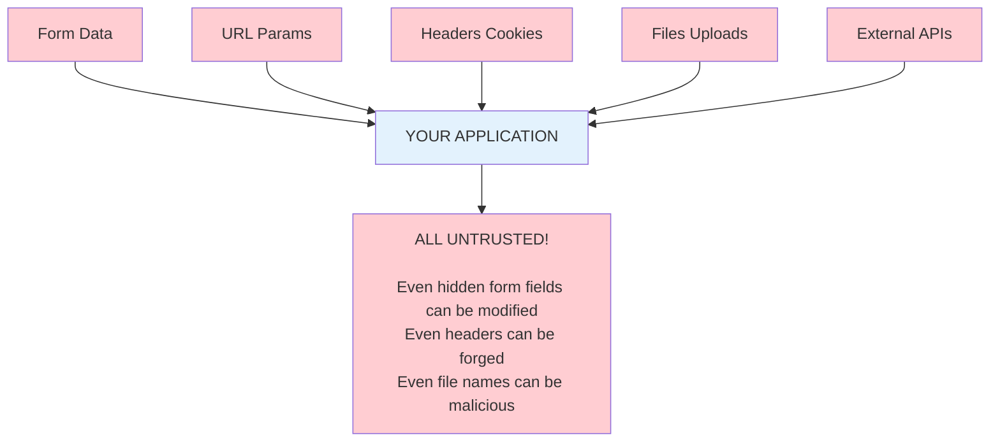
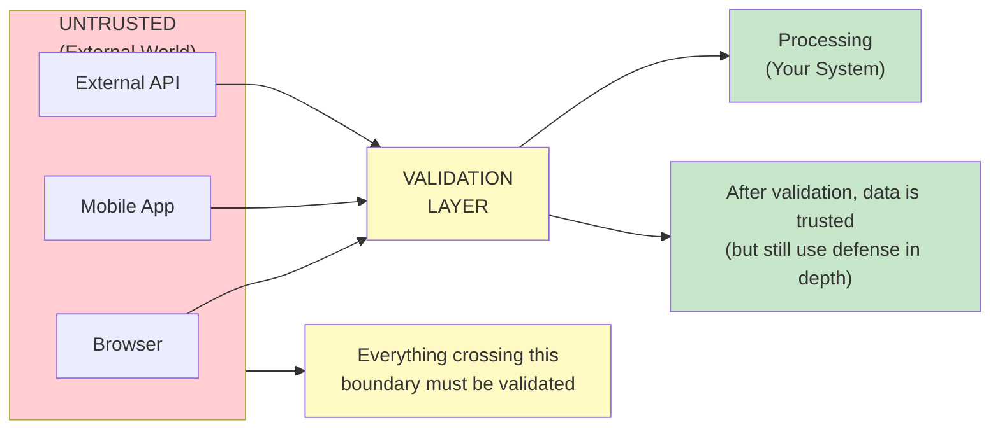
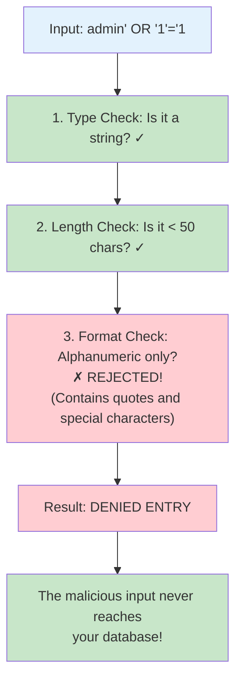
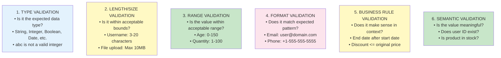

# 🔐 Input Validation: The First Line of Defense

---

## 0️⃣ Prerequisites

Before diving into input validation, you should understand:

- **HTTP Protocol**: How data is sent via query parameters, headers, request body. Covered in Phase 2.
- **OWASP Top 10**: Common vulnerabilities that input validation helps prevent. Covered in `06-owasp-top-10.md`.
- **SQL Injection**: How malicious input can manipulate queries. Covered in `06-owasp-top-10.md`.
- **Regular Expressions**: Pattern matching for input validation.

**Quick Refresher**: Input validation is checking that data from untrusted sources (users, external APIs, files) conforms to expected formats before processing. It's not the only defense, but it's the first line of defense.

---

## 1️⃣ What Problem Does Input Validation Exist to Solve?

### The Core Problem: Untrusted Data Everywhere

Every piece of data entering your system from outside is potentially malicious:



<details>
<summary>ASCII diagram (reference)</summary>

```text
┌─────────────────────────────────────────────────────────────────────────┐
│                    UNTRUSTED INPUT SOURCES                               │
├─────────────────────────────────────────────────────────────────────────┤
│                                                                          │
│  ┌─────────────────────────────────────────────────────────────────┐    │
│  │                     YOUR APPLICATION                             │    │
│  └─────────────────────────────────────────────────────────────────┘    │
│                              ▲                                           │
│     ┌────────────────────────┼────────────────────────┐                 │
│     │                        │                        │                 │
│  ┌──┴───┐   ┌───────┐   ┌───┴────┐   ┌───────┐   ┌───┴────┐           │
│  │ Form │   │ URL   │   │ Headers│   │ Files │   │External│           │
│  │ Data │   │ Params│   │ Cookies│   │Uploads│   │  APIs  │           │
│  └──────┘   └───────┘   └────────┘   └───────┘   └────────┘           │
│     │           │            │            │            │                │
│     └───────────┴────────────┴────────────┴────────────┘                │
│                              │                                           │
│                    ALL UNTRUSTED!                                        │
│                                                                          │
│  Even "hidden" form fields can be modified                              │
│  Even headers can be forged                                              │
│  Even file names can be malicious                                        │
│                                                                          │
└─────────────────────────────────────────────────────────────────────────┘
```

</details>

### What Breaks Without Input Validation

| Attack | Malicious Input | Impact |
|--------|-----------------|--------|
| SQL Injection | `' OR '1'='1` | Database compromise |
| XSS | `<script>alert('xss')</script>` | Session hijacking |
| Command Injection | `; rm -rf /` | Server compromise |
| Path Traversal | `../../../etc/passwd` | File access |
| Buffer Overflow | Very long string | Crash or code execution |
| Integer Overflow | `2147483648` | Logic bypass |
| Format String | `%s%s%s%s%s` | Information leak |

### The Trust Boundary Concept



<details>
<summary>ASCII diagram (reference)</summary>

```text
┌─────────────────────────────────────────────────────────────────────────┐
│                    TRUST BOUNDARIES                                      │
├─────────────────────────────────────────────────────────────────────────┤
│                                                                          │
│  UNTRUSTED                    │              TRUSTED                    │
│  (External World)             │              (Your System)              │
│                               │                                         │
│  ┌──────────────┐            │                                         │
│  │   Browser    │            │                                         │
│  │   Mobile App │   ════════════════>  VALIDATION  ════>  Processing  │
│  │   External   │            │          LAYER                          │
│  │   API        │            │                                         │
│  └──────────────┘            │                                         │
│                               │                                         │
│  Everything crossing this     │  After validation, data is "trusted"   │
│  boundary must be validated   │  (but still use defense in depth)      │
│                               │                                         │
└─────────────────────────────────────────────────────────────────────────┘
```

</details>

---

## 2️⃣ Intuition and Mental Model

### The Bouncer Analogy

Think of input validation like a bouncer at a club:

**Without Validation (No Bouncer)**:
- Anyone walks in
- Weapons, fake IDs, troublemakers all enter
- Problems happen inside

**With Validation (Good Bouncer)**:
- Checks ID (type validation)
- Checks age (range validation)
- Checks dress code (format validation)
- Searches for weapons (sanitization)
- Refuses entry to known troublemakers (blocklist)



<details>
<summary>ASCII diagram (reference)</summary>

```text
┌─────────────────────────────────────────────────────────────────────────┐
│                    VALIDATION AS BOUNCER                                 │
├─────────────────────────────────────────────────────────────────────────┤
│                                                                          │
│  Input: "admin' OR '1'='1"                                              │
│                                                                          │
│  ┌────────────────────────────────────────────────────────────────┐     │
│  │                        BOUNCER CHECKS                          │     │
│  │                                                                 │     │
│  │  1. Type Check: Is it a string? ✓                              │     │
│  │  2. Length Check: Is it < 50 chars? ✓                          │     │
│  │  3. Format Check: Alphanumeric only? ✗ REJECTED!               │     │
│  │     (Contains quotes and special characters)                   │     │
│  │                                                                 │     │
│  │  Result: DENIED ENTRY                                          │     │
│  └────────────────────────────────────────────────────────────────┘     │
│                                                                          │
│  The malicious input never reaches your database!                       │
│                                                                          │
└─────────────────────────────────────────────────────────────────────────┘
```

</details>

---

## 3️⃣ Validation Strategies

### Allowlist vs Blocklist

```mermaid
flowchart TD
    subgraph BLOCKLIST["BLOCKLIST (Dangerous - Avoid)"]
        BLOCK_DESC["Block these bad things<br/>• Block: <script>, javascript:, onclick<br/>• Problem: Attackers find bypasses<br/>• <SCRIPT>, , <svg onload=...><br/>• Always playing catch-up"]
    end
    
    subgraph ALLOWLIST["ALLOWLIST (Preferred)"]
        ALLOW_DESC["Only allow these good things<br/>• Allow: [a-zA-Z0-9_-]<br/>• Everything else rejected<br/>• Attacker can't bypass what's not allowed<br/>• Secure by default"]
    end
    
    EXAMPLE["Example: Username validation<br/>✗ Blocklist: Block ', \", <, >, ;, etc.<br/>✓ Allowlist: Only allow [a-zA-Z0-9_] with length 3-20"]
    
    BLOCKLIST --> EXAMPLE
    ALLOWLIST --> EXAMPLE
    
    style BLOCKLIST fill:#ffcdd2
    style BLOCK_DESC fill:#ffcdd2
    style ALLOWLIST fill:#c8e6c9
    style ALLOW_DESC fill:#c8e6c9
    style EXAMPLE fill:#fff9c4
```

<details>
<summary>ASCII diagram (reference)</summary>

```text
┌─────────────────────────────────────────────────────────────────────────┐
│                    ALLOWLIST vs BLOCKLIST                                │
├─────────────────────────────────────────────────────────────────────────┤
│                                                                          │
│  BLOCKLIST (Dangerous - Avoid)                                          │
│  ─────────────────────────────                                          │
│  "Block these bad things"                                                │
│  • Block: <script>, javascript:, onclick                                │
│  • Problem: Attackers find bypasses                                     │
│  • <SCRIPT>, , <svg onload=...>                       │
│  • Always playing catch-up                                               │
│                                                                          │
│  ALLOWLIST (Preferred)                                                   │
│  ─────────────────────────────                                          │
│  "Only allow these good things"                                         │
│  • Allow: [a-zA-Z0-9_-]                                                 │
│  • Everything else rejected                                              │
│  • Attacker can't bypass what's not allowed                             │
│  • Secure by default                                                     │
│                                                                          │
│  Example: Username validation                                            │
│  ✗ Blocklist: Block ', ", <, >, ;, etc.                                │
│  ✓ Allowlist: Only allow [a-zA-Z0-9_] with length 3-20                 │
│                                                                          │
└─────────────────────────────────────────────────────────────────────────┘
```

</details>

### Validation Types



<details>
<summary>ASCII diagram (reference)</summary>

```text
┌─────────────────────────────────────────────────────────────────────────┐
│                    VALIDATION TYPES                                      │
├─────────────────────────────────────────────────────────────────────────┤
│                                                                          │
│  1. TYPE VALIDATION                                                      │
│     • Is it the expected data type?                                     │
│     • String, Integer, Boolean, Date, etc.                              │
│     • "abc" is not a valid integer                                      │
│                                                                          │
│  2. LENGTH/SIZE VALIDATION                                               │
│     • Is it within acceptable bounds?                                   │
│     • Username: 3-20 characters                                          │
│     • File upload: Max 10MB                                              │
│                                                                          │
│  3. RANGE VALIDATION                                                     │
│     • Is the value within acceptable range?                             │
│     • Age: 0-150                                                         │
│     • Quantity: 1-100                                                    │
│                                                                          │
│  4. FORMAT VALIDATION                                                    │
│     • Does it match expected pattern?                                   │
│     • Email: user@domain.com                                            │
│     • Phone: +1-555-555-5555                                            │
│                                                                          │
│  5. BUSINESS RULE VALIDATION                                             │
│     • Does it make sense in context?                                    │
│     • End date after start date                                          │
│     • Discount <= original price                                         │
│                                                                          │
│  6. SEMANTIC VALIDATION                                                  │
│     • Is the value meaningful?                                          │
│     • Does user ID exist?                                                │
│     • Is product in stock?                                               │
│                                                                          │
└─────────────────────────────────────────────────────────────────────────┘
```

</details>

---

## 4️⃣ How Input Validation Works

### Validation Flow

```
┌─────────────────────────────────────────────────────────────────────────┐
│                    VALIDATION PIPELINE                                   │
├─────────────────────────────────────────────────────────────────────────┤
│                                                                          │
│  Raw Input                                                               │
│      │                                                                   │
│      ▼                                                                   │
│  ┌─────────────────────────────────────────────────────────────────┐    │
│  │ 1. DECODE                                                        │    │
│  │    URL decode, HTML decode, Base64 decode                       │    │
│  │    Normalize Unicode (NFC)                                       │    │
│  └─────────────────────────────────────────────────────────────────┘    │
│      │                                                                   │
│      ▼                                                                   │
│  ┌─────────────────────────────────────────────────────────────────┐    │
│  │ 2. TYPE CHECK                                                    │    │
│  │    Convert to expected type                                      │    │
│  │    Reject if conversion fails                                    │    │
│  └─────────────────────────────────────────────────────────────────┘    │
│      │                                                                   │
│      ▼                                                                   │
│  ┌─────────────────────────────────────────────────────────────────┐    │
│  │ 3. SYNTACTIC VALIDATION                                          │    │
│  │    Check format, length, pattern                                 │    │
│  │    Use allowlist approach                                        │    │
│  └─────────────────────────────────────────────────────────────────┘    │
│      │                                                                   │
│      ▼                                                                   │
│  ┌─────────────────────────────────────────────────────────────────┐    │
│  │ 4. SEMANTIC VALIDATION                                           │    │
│  │    Business rules, referential integrity                        │    │
│  │    Cross-field validation                                        │    │
│  └─────────────────────────────────────────────────────────────────┘    │
│      │                                                                   │
│      ▼                                                                   │
│  Validated Input → Processing                                           │
│                                                                          │
└─────────────────────────────────────────────────────────────────────────┘
```

### Where to Validate

```
┌─────────────────────────────────────────────────────────────────────────┐
│                    VALIDATION LAYERS                                     │
├─────────────────────────────────────────────────────────────────────────┤
│                                                                          │
│  CLIENT-SIDE (UX only, NOT security)                                    │
│  ┌─────────────────────────────────────────────────────────────────┐    │
│  │  • Immediate feedback                                            │    │
│  │  • Reduces server load                                           │    │
│  │  • CAN BE BYPASSED - not a security control!                    │    │
│  └─────────────────────────────────────────────────────────────────┘    │
│                                                                          │
│  API GATEWAY / CONTROLLER (First server-side check)                     │
│  ┌─────────────────────────────────────────────────────────────────┐    │
│  │  • Type validation                                               │    │
│  │  • Format validation                                             │    │
│  │  • Size limits                                                   │    │
│  │  • Required fields                                               │    │
│  └─────────────────────────────────────────────────────────────────┘    │
│                                                                          │
│  SERVICE LAYER (Business validation)                                    │
│  ┌─────────────────────────────────────────────────────────────────┐    │
│  │  • Business rules                                                │    │
│  │  • Cross-field validation                                        │    │
│  │  • Authorization checks                                          │    │
│  └─────────────────────────────────────────────────────────────────┘    │
│                                                                          │
│  DATABASE LAYER (Last defense)                                          │
│  ┌─────────────────────────────────────────────────────────────────┐    │
│  │  • Constraints (NOT NULL, UNIQUE, FK)                           │    │
│  │  • Data type enforcement                                         │    │
│  │  • Triggers for complex rules                                    │    │
│  └─────────────────────────────────────────────────────────────────┘    │
│                                                                          │
└─────────────────────────────────────────────────────────────────────────┘
```

---

## 5️⃣ Simulation-First Explanation

### Validating a User Registration Request

Let's trace validation of this request:

```json
POST /api/users/register
{
  "username": "alice<script>",
  "email": "not-an-email",
  "password": "123",
  "age": "not-a-number",
  "website": "javascript:alert(1)"
}
```

**Step 1: Type Conversion**
```java
// Spring automatically converts JSON to object
// "age": "not-a-number" → NumberFormatException
// Result: 400 Bad Request before validation even runs
```

**Step 2: Bean Validation**
```java
public class UserRegistrationRequest {
    @NotBlank(message = "Username is required")
    @Size(min = 3, max = 20, message = "Username must be 3-20 characters")
    @Pattern(regexp = "^[a-zA-Z0-9_]+$", message = "Username can only contain letters, numbers, underscore")
    private String username;  // "alice<script>" fails Pattern

    @NotBlank(message = "Email is required")
    @Email(message = "Invalid email format")
    private String email;  // "not-an-email" fails @Email

    @NotBlank(message = "Password is required")
    @Size(min = 8, message = "Password must be at least 8 characters")
    private String password;  // "123" fails @Size

    @NotNull(message = "Age is required")
    @Min(value = 13, message = "Must be at least 13 years old")
    @Max(value = 150, message = "Invalid age")
    private Integer age;

    @URL(message = "Invalid URL")
    private String website;  // "javascript:alert(1)" fails @URL
}
```

**Step 3: Controller Receives Validation Errors**
```java
@PostMapping("/register")
public ResponseEntity<?> register(@Valid @RequestBody UserRegistrationRequest request,
                                   BindingResult result) {
    if (result.hasErrors()) {
        Map<String, String> errors = result.getFieldErrors().stream()
            .collect(Collectors.toMap(
                FieldError::getField,
                FieldError::getDefaultMessage
            ));
        return ResponseEntity.badRequest().body(errors);
    }
    // ...
}
```

**Step 4: Response**
```json
HTTP/1.1 400 Bad Request
{
  "username": "Username can only contain letters, numbers, underscore",
  "email": "Invalid email format",
  "password": "Password must be at least 8 characters",
  "age": "Invalid value",
  "website": "Invalid URL"
}
```

---

## 6️⃣ How to Implement Input Validation in Java

### Spring Boot Bean Validation

```java
package com.example.validation;

import jakarta.validation.constraints.*;
import org.hibernate.validator.constraints.URL;
import org.hibernate.validator.constraints.CreditCardNumber;

/**
 * User registration request with comprehensive validation.
 */
public class UserRegistrationRequest {

    // ==================== STRING VALIDATION ====================

    @NotBlank(message = "Username is required")
    @Size(min = 3, max = 20, message = "Username must be 3-20 characters")
    @Pattern(regexp = "^[a-zA-Z][a-zA-Z0-9_]*$", 
             message = "Username must start with letter, contain only letters, numbers, underscore")
    private String username;

    @NotBlank(message = "Email is required")
    @Email(message = "Invalid email format")
    @Size(max = 255, message = "Email too long")
    private String email;

    @NotBlank(message = "Password is required")
    @Size(min = 12, max = 128, message = "Password must be 12-128 characters")
    // Additional password validation in service layer
    private String password;

    @Size(max = 100, message = "Name too long")
    @Pattern(regexp = "^[a-zA-Z\\s'-]*$", message = "Name contains invalid characters")
    private String fullName;

    // ==================== NUMERIC VALIDATION ====================

    @NotNull(message = "Age is required")
    @Min(value = 13, message = "Must be at least 13 years old")
    @Max(value = 150, message = "Invalid age")
    private Integer age;

    @DecimalMin(value = "0.01", message = "Amount must be positive")
    @DecimalMax(value = "1000000.00", message = "Amount exceeds maximum")
    @Digits(integer = 7, fraction = 2, message = "Invalid amount format")
    private BigDecimal amount;

    // ==================== DATE VALIDATION ====================

    @NotNull(message = "Birth date is required")
    @Past(message = "Birth date must be in the past")
    private LocalDate birthDate;

    @Future(message = "Expiry date must be in the future")
    private LocalDate expiryDate;

    // ==================== COLLECTION VALIDATION ====================

    @NotEmpty(message = "At least one interest required")
    @Size(max = 10, message = "Maximum 10 interests allowed")
    private List<@NotBlank @Size(max = 50) String> interests;

    // ==================== URL/URI VALIDATION ====================

    @URL(protocol = "https", message = "Website must be HTTPS URL")
    private String website;

    // ==================== CUSTOM VALIDATION ====================

    @SafeHtml  // Custom validator to prevent XSS
    private String bio;

    @NoSqlInjection  // Custom validator
    private String searchQuery;

    // Getters and setters...
}
```

### Custom Validators

```java
package com.example.validation.custom;

import jakarta.validation.Constraint;
import jakarta.validation.ConstraintValidator;
import jakarta.validation.ConstraintValidatorContext;
import jakarta.validation.Payload;

import java.lang.annotation.*;
import java.util.regex.Pattern;

/**
 * Custom validator to check for common SQL injection patterns.
 * 
 * NOTE: This is defense in depth. Always use parameterized queries!
 */
@Target({ElementType.FIELD, ElementType.PARAMETER})
@Retention(RetentionPolicy.RUNTIME)
@Constraint(validatedBy = NoSqlInjectionValidator.class)
@Documented
public @interface NoSqlInjection {
    String message() default "Input contains potentially dangerous content";
    Class<?>[] groups() default {};
    Class<? extends Payload>[] payload() default {};
}

public class NoSqlInjectionValidator implements ConstraintValidator<NoSqlInjection, String> {

    // Patterns that might indicate SQL injection
    private static final Pattern[] SUSPICIOUS_PATTERNS = {
        Pattern.compile("(?i)('|\"|--)"),                    // Quotes and comments
        Pattern.compile("(?i)(union|select|insert|update|delete|drop|truncate)\\s"),
        Pattern.compile("(?i)(or|and)\\s+\\d+\\s*=\\s*\\d+"), // OR 1=1
        Pattern.compile("(?i)exec(ute)?\\s"),
        Pattern.compile("(?i)xp_"),
        Pattern.compile(";\\s*(drop|delete|truncate)")
    };

    @Override
    public boolean isValid(String value, ConstraintValidatorContext context) {
        if (value == null || value.isEmpty()) {
            return true;  // Let @NotBlank handle null/empty
        }

        for (Pattern pattern : SUSPICIOUS_PATTERNS) {
            if (pattern.matcher(value).find()) {
                return false;
            }
        }
        return true;
    }
}

/**
 * Custom validator for safe HTML content.
 * Allows only specific tags and attributes.
 */
@Target({ElementType.FIELD, ElementType.PARAMETER})
@Retention(RetentionPolicy.RUNTIME)
@Constraint(validatedBy = SafeHtmlValidator.class)
@Documented
public @interface SafeHtml {
    String message() default "HTML content contains unsafe elements";
    Class<?>[] groups() default {};
    Class<? extends Payload>[] payload() default {};
    
    String[] allowedTags() default {"p", "br", "b", "i", "u", "strong", "em"};
}

public class SafeHtmlValidator implements ConstraintValidator<SafeHtml, String> {

    private Set<String> allowedTags;

    @Override
    public void initialize(SafeHtml annotation) {
        this.allowedTags = Set.of(annotation.allowedTags());
    }

    @Override
    public boolean isValid(String value, ConstraintValidatorContext context) {
        if (value == null || value.isEmpty()) {
            return true;
        }

        // Use a proper HTML sanitizer library like OWASP Java HTML Sanitizer
        PolicyFactory policy = new HtmlPolicyBuilder()
            .allowElements(allowedTags.toArray(new String[0]))
            .toFactory();

        String sanitized = policy.sanitize(value);
        
        // If sanitization changed the content, it contained unsafe elements
        return value.equals(sanitized);
    }
}

/**
 * Cross-field validation: Ensure end date is after start date.
 */
@Target({ElementType.TYPE})
@Retention(RetentionPolicy.RUNTIME)
@Constraint(validatedBy = DateRangeValidator.class)
@Documented
public @interface ValidDateRange {
    String message() default "End date must be after start date";
    Class<?>[] groups() default {};
    Class<? extends Payload>[] payload() default {};
    
    String startDate();
    String endDate();
}

public class DateRangeValidator implements ConstraintValidator<ValidDateRange, Object> {

    private String startDateField;
    private String endDateField;

    @Override
    public void initialize(ValidDateRange annotation) {
        this.startDateField = annotation.startDate();
        this.endDateField = annotation.endDate();
    }

    @Override
    public boolean isValid(Object object, ConstraintValidatorContext context) {
        try {
            LocalDate startDate = (LocalDate) BeanUtils.getPropertyDescriptor(
                object.getClass(), startDateField)
                .getReadMethod().invoke(object);
                
            LocalDate endDate = (LocalDate) BeanUtils.getPropertyDescriptor(
                object.getClass(), endDateField)
                .getReadMethod().invoke(object);

            if (startDate == null || endDate == null) {
                return true;  // Let @NotNull handle null
            }

            return endDate.isAfter(startDate);
        } catch (Exception e) {
            return false;
        }
    }
}
```

### Controller Validation

```java
package com.example.controller;

import jakarta.validation.Valid;
import jakarta.validation.constraints.*;
import org.springframework.http.ResponseEntity;
import org.springframework.validation.annotation.Validated;
import org.springframework.web.bind.annotation.*;

@RestController
@RequestMapping("/api/users")
@Validated  // Enable validation on method parameters
public class UserController {

    /**
     * Register new user with validated request body.
     */
    @PostMapping("/register")
    public ResponseEntity<UserResponse> register(
            @Valid @RequestBody UserRegistrationRequest request) {
        // If we reach here, validation passed
        User user = userService.register(request);
        return ResponseEntity.ok(new UserResponse(user));
    }

    /**
     * Get user by ID with path variable validation.
     */
    @GetMapping("/{userId}")
    public ResponseEntity<UserResponse> getUser(
            @PathVariable @Positive(message = "User ID must be positive") Long userId) {
        return userService.findById(userId)
            .map(UserResponse::new)
            .map(ResponseEntity::ok)
            .orElse(ResponseEntity.notFound().build());
    }

    /**
     * Search users with query parameter validation.
     */
    @GetMapping("/search")
    public ResponseEntity<List<UserResponse>> searchUsers(
            @RequestParam @Size(min = 2, max = 50, message = "Query must be 2-50 chars") 
            String query,
            
            @RequestParam(defaultValue = "0") 
            @Min(value = 0, message = "Page must be non-negative") 
            int page,
            
            @RequestParam(defaultValue = "20") 
            @Min(1) @Max(100) 
            int size) {
        
        // Sanitize query for search
        String sanitizedQuery = sanitizeSearchQuery(query);
        
        return ResponseEntity.ok(
            userService.search(sanitizedQuery, page, size)
                .stream()
                .map(UserResponse::new)
                .toList()
        );
    }

    /**
     * Update user with partial validation.
     */
    @PatchMapping("/{userId}")
    public ResponseEntity<UserResponse> updateUser(
            @PathVariable @Positive Long userId,
            @Valid @RequestBody UserUpdateRequest request) {
        
        User user = userService.update(userId, request);
        return ResponseEntity.ok(new UserResponse(user));
    }

    private String sanitizeSearchQuery(String query) {
        // Remove special characters, keep only alphanumeric and spaces
        return query.replaceAll("[^a-zA-Z0-9\\s]", "").trim();
    }
}
```

### Global Exception Handler

```java
package com.example.exception;

import jakarta.validation.ConstraintViolationException;
import org.springframework.http.HttpStatus;
import org.springframework.http.ResponseEntity;
import org.springframework.web.bind.MethodArgumentNotValidException;
import org.springframework.web.bind.annotation.ExceptionHandler;
import org.springframework.web.bind.annotation.RestControllerAdvice;

import java.util.HashMap;
import java.util.Map;

@RestControllerAdvice
public class GlobalExceptionHandler {

    /**
     * Handle @Valid validation errors on request body.
     */
    @ExceptionHandler(MethodArgumentNotValidException.class)
    public ResponseEntity<Map<String, Object>> handleValidationErrors(
            MethodArgumentNotValidException ex) {
        
        Map<String, String> fieldErrors = new HashMap<>();
        ex.getBindingResult().getFieldErrors().forEach(error -> 
            fieldErrors.put(error.getField(), error.getDefaultMessage())
        );

        Map<String, Object> response = new HashMap<>();
        response.put("status", "error");
        response.put("message", "Validation failed");
        response.put("errors", fieldErrors);

        return ResponseEntity.badRequest().body(response);
    }

    /**
     * Handle @Validated validation errors on method parameters.
     */
    @ExceptionHandler(ConstraintViolationException.class)
    public ResponseEntity<Map<String, Object>> handleConstraintViolation(
            ConstraintViolationException ex) {
        
        Map<String, String> errors = new HashMap<>();
        ex.getConstraintViolations().forEach(violation -> {
            String path = violation.getPropertyPath().toString();
            String field = path.contains(".") ? 
                path.substring(path.lastIndexOf('.') + 1) : path;
            errors.put(field, violation.getMessage());
        });

        Map<String, Object> response = new HashMap<>();
        response.put("status", "error");
        response.put("message", "Validation failed");
        response.put("errors", errors);

        return ResponseEntity.badRequest().body(response);
    }
}
```

### File Upload Validation

```java
package com.example.validation;

import org.springframework.web.multipart.MultipartFile;

import java.util.Set;

public class FileUploadValidator {

    private static final Set<String> ALLOWED_CONTENT_TYPES = Set.of(
        "image/jpeg",
        "image/png",
        "image/gif",
        "application/pdf"
    );

    private static final Set<String> ALLOWED_EXTENSIONS = Set.of(
        ".jpg", ".jpeg", ".png", ".gif", ".pdf"
    );

    private static final long MAX_FILE_SIZE = 10 * 1024 * 1024;  // 10MB

    // Dangerous file extensions that should never be allowed
    private static final Set<String> DANGEROUS_EXTENSIONS = Set.of(
        ".exe", ".bat", ".cmd", ".sh", ".php", ".jsp", ".asp", ".aspx",
        ".js", ".html", ".htm", ".svg", ".xml"
    );

    public void validate(MultipartFile file) {
        if (file == null || file.isEmpty()) {
            throw new ValidationException("File is required");
        }

        // 1. Check file size
        if (file.getSize() > MAX_FILE_SIZE) {
            throw new ValidationException("File size exceeds maximum of 10MB");
        }

        // 2. Check content type
        String contentType = file.getContentType();
        if (contentType == null || !ALLOWED_CONTENT_TYPES.contains(contentType)) {
            throw new ValidationException("File type not allowed: " + contentType);
        }

        // 3. Check file extension
        String originalFilename = file.getOriginalFilename();
        if (originalFilename == null) {
            throw new ValidationException("Filename is required");
        }

        String extension = getExtension(originalFilename).toLowerCase();
        
        // Block dangerous extensions
        if (DANGEROUS_EXTENSIONS.contains(extension)) {
            throw new ValidationException("File type not allowed");
        }

        // Only allow specific extensions
        if (!ALLOWED_EXTENSIONS.contains(extension)) {
            throw new ValidationException("File extension not allowed: " + extension);
        }

        // 4. Verify content type matches extension
        if (!contentTypeMatchesExtension(contentType, extension)) {
            throw new ValidationException("Content type doesn't match file extension");
        }

        // 5. Check for path traversal in filename
        if (originalFilename.contains("..") || 
            originalFilename.contains("/") || 
            originalFilename.contains("\\")) {
            throw new ValidationException("Invalid filename");
        }

        // 6. Validate actual file content (magic bytes)
        validateFileContent(file);
    }

    private String getExtension(String filename) {
        int lastDot = filename.lastIndexOf('.');
        return lastDot > 0 ? filename.substring(lastDot) : "";
    }

    private boolean contentTypeMatchesExtension(String contentType, String extension) {
        return switch (extension) {
            case ".jpg", ".jpeg" -> "image/jpeg".equals(contentType);
            case ".png" -> "image/png".equals(contentType);
            case ".gif" -> "image/gif".equals(contentType);
            case ".pdf" -> "application/pdf".equals(contentType);
            default -> false;
        };
    }

    private void validateFileContent(MultipartFile file) {
        try {
            byte[] bytes = file.getBytes();
            if (bytes.length < 4) {
                throw new ValidationException("File too small");
            }

            // Check magic bytes (file signatures)
            String contentType = file.getContentType();
            
            if ("image/jpeg".equals(contentType)) {
                // JPEG starts with FF D8 FF
                if (bytes[0] != (byte) 0xFF || 
                    bytes[1] != (byte) 0xD8 || 
                    bytes[2] != (byte) 0xFF) {
                    throw new ValidationException("Invalid JPEG file");
                }
            } else if ("image/png".equals(contentType)) {
                // PNG starts with 89 50 4E 47
                if (bytes[0] != (byte) 0x89 || 
                    bytes[1] != (byte) 0x50 || 
                    bytes[2] != (byte) 0x4E || 
                    bytes[3] != (byte) 0x47) {
                    throw new ValidationException("Invalid PNG file");
                }
            } else if ("application/pdf".equals(contentType)) {
                // PDF starts with %PDF
                if (bytes[0] != (byte) 0x25 || 
                    bytes[1] != (byte) 0x50 || 
                    bytes[2] != (byte) 0x44 || 
                    bytes[3] != (byte) 0x46) {
                    throw new ValidationException("Invalid PDF file");
                }
            }
        } catch (IOException e) {
            throw new ValidationException("Could not read file");
        }
    }

    /**
     * Generate safe filename for storage.
     */
    public String generateSafeFilename(String originalFilename) {
        String extension = getExtension(originalFilename);
        String uuid = UUID.randomUUID().toString();
        return uuid + extension;
    }
}
```

---

## 7️⃣ Tradeoffs, Pitfalls, and Common Mistakes

### Common Validation Mistakes

| Mistake | Impact | Fix |
|---------|--------|-----|
| Client-side only validation | Easily bypassed | Always validate server-side |
| Blocklist approach | Bypasses found | Use allowlist |
| Trusting content-type header | File type spoofing | Check magic bytes |
| Not normalizing Unicode | Bypass via encoding | Normalize before validation |
| Incomplete validation | Partial protection | Validate all fields |
| Validation after processing | Too late | Validate before any processing |
| Generic error messages | Poor UX | Specific, helpful messages |

### Encoding Issues

```java
// WRONG: Not handling encoding
public boolean validateUsername(String username) {
    return username.matches("^[a-zA-Z0-9]+$");
}
// Can be bypassed with Unicode lookalikes: "аdmin" (Cyrillic 'а')

// RIGHT: Normalize Unicode first
public boolean validateUsernameSecure(String username) {
    // Normalize to NFC form
    String normalized = Normalizer.normalize(username, Normalizer.Form.NFC);
    
    // Check for non-ASCII characters
    if (!normalized.equals(username) || !CharMatcher.ascii().matchesAllOf(username)) {
        return false;
    }
    
    return username.matches("^[a-zA-Z0-9]+$");
}
```

---

## 8️⃣ When NOT to Over-Validate

### Avoid These Patterns

1. **Over-restrictive validation**: Don't reject valid input
   - Names can have apostrophes (O'Brien), hyphens (Smith-Jones)
   - International characters in names (José, François, 田中)

2. **Password complexity theater**: Long passwords are better than complex ones
   - "correct horse battery staple" > "P@ssw0rd!"

3. **Premature optimization**: Don't skip validation for "performance"
   - Security > microseconds

---

## 9️⃣ Comparison: Validation vs Sanitization vs Encoding

| Technique | Purpose | When to Use |
|-----------|---------|-------------|
| **Validation** | Reject bad input | At input boundary |
| **Sanitization** | Clean/modify input | When you must accept risky input |
| **Encoding** | Make safe for output | When outputting to different context |

```java
// Validation: Reject if invalid
if (!isValidEmail(email)) {
    throw new ValidationException("Invalid email");
}

// Sanitization: Clean the input
String sanitizedHtml = Jsoup.clean(userHtml, Whitelist.basic());

// Encoding: Make safe for output context
String htmlSafe = HtmlUtils.htmlEscape(userInput);  // For HTML
String urlSafe = URLEncoder.encode(userInput, UTF_8);  // For URLs
String jsonSafe = JsonStringEncoder.getInstance().quoteAsString(userInput);  // For JSON
```

---

## 🔟 Interview Follow-Up Questions

### L4 Questions

**Q: What's the difference between validation and sanitization?**
A: Validation checks if input meets criteria and rejects invalid input. Sanitization modifies input to make it safe. Validation is preferred because you reject bad data entirely. Sanitization is used when you must accept potentially risky input (like HTML from users) and need to clean it. Example: Validation rejects `<script>` in a username. Sanitization strips `<script>` tags from a blog post while keeping safe HTML.

**Q: Why should you validate on the server even if you validate on the client?**
A: Client-side validation can be bypassed by disabling JavaScript, using browser dev tools, or calling the API directly. It's only for UX (immediate feedback). Server-side validation is the actual security control. Never trust any data from the client.

### L5 Questions

**Q: How would you validate file uploads securely?**
A: Multiple layers:
1. Check file size (prevent DoS)
2. Validate content-type header
3. Check file extension against allowlist
4. Verify magic bytes match claimed type
5. Scan for malware
6. Generate new filename (prevent path traversal)
7. Store outside web root
8. Serve with Content-Disposition: attachment

**Q: Explain the difference between allowlist and blocklist validation.**
A: Blocklist blocks known bad patterns ("block `<script>`"). Problem: attackers find bypasses (`<SCRIPT>`, ``). Allowlist only allows known good patterns ("only allow `[a-zA-Z0-9]`"). Everything else is rejected by default. Allowlist is more secure because attackers can't bypass what's not allowed. Use allowlist whenever possible.

### L6 Questions

**Q: Design a validation framework for a microservices architecture.**
A: 
1. **Shared validation library**: Common validators across services
2. **API contract validation**: OpenAPI/JSON Schema at gateway
3. **Service-level validation**: Business rules in each service
4. **Consistent error format**: Standard error response structure
5. **Validation as code**: Version-controlled validation rules
6. **Performance**: Cache compiled patterns, async validation for expensive checks
7. **Monitoring**: Track validation failures, alert on anomalies

---

## 1️⃣1️⃣ One Clean Mental Summary

Input validation is the first line of defense against attacks. Every piece of data from outside your system is untrusted and must be validated before processing. Use allowlist validation (define what's allowed) rather than blocklist (block what's bad). Validate at the server, not just the client. Validate type, length, format, and business rules. For files, check size, extension, content-type, and magic bytes. Remember: validation rejects bad input, sanitization cleans it, and encoding makes it safe for output. Defense in depth means validating even when using parameterized queries, because validation catches problems early and provides better error messages.

---

## References

- [OWASP Input Validation Cheat Sheet](https://cheatsheetseries.owasp.org/cheatsheets/Input_Validation_Cheat_Sheet.html)
- [Bean Validation Specification](https://beanvalidation.org/2.0/spec/)
- [OWASP Java HTML Sanitizer](https://github.com/OWASP/java-html-sanitizer)
- [Spring Validation Documentation](https://docs.spring.io/spring-framework/reference/core/validation.html)

