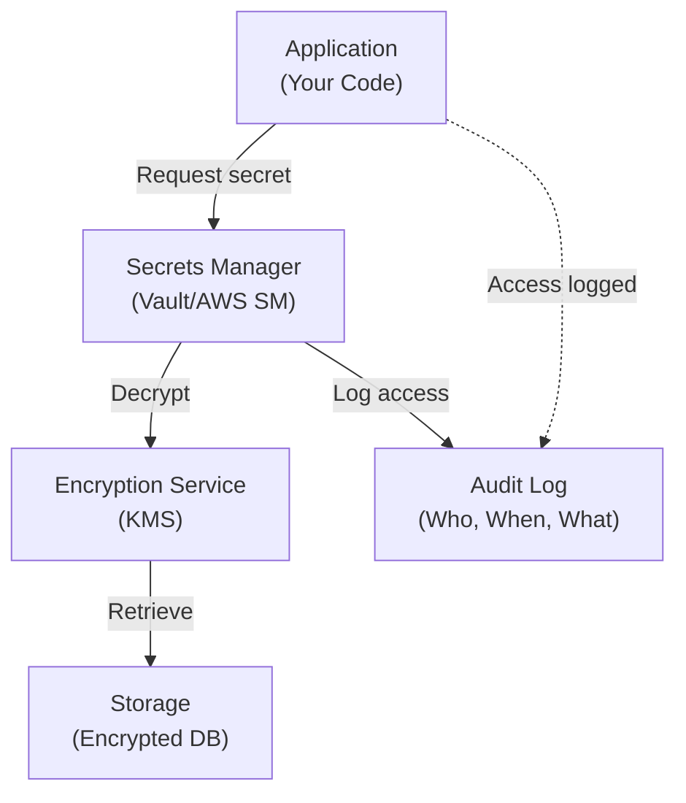
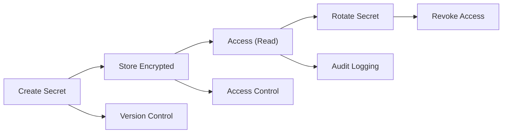
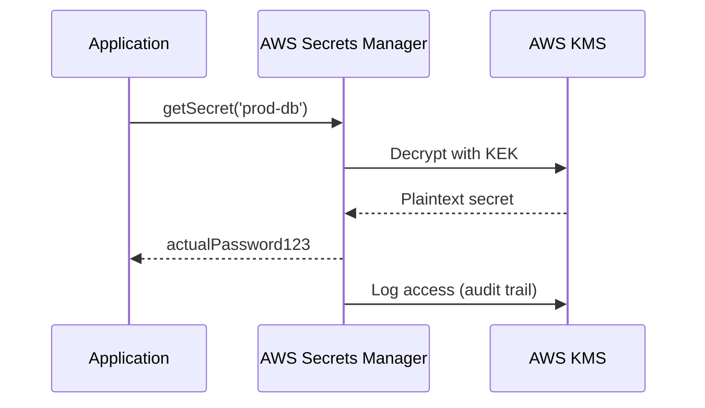

# 🔐 Secrets Management: Protecting Credentials and Sensitive Data

---

## 0️⃣ Prerequisites

Before diving into secrets management, you should understand:

- **Environment Variables**: How applications read configuration from the environment. Basic concept: variables set outside the code that the application reads at runtime.
- **Encryption**: The process of converting readable data into unreadable data that can only be decrypted with a key. We'll explain encryption at rest vs in transit.
- **Key Management**: How cryptographic keys are generated, stored, and rotated. A key is like a password that unlocks encrypted data.
- **Cloud Services**: Basic understanding of cloud providers (AWS, Azure, GCP) and their services. Covered in Phase 10.

**Quick Refresher**: Secrets are sensitive data like passwords, API keys, database credentials, and private keys. They must be protected from unauthorized access.

---

## 1️⃣ What Problem Does Secrets Management Exist to Solve?

### The Core Problem: Secrets Are Everywhere and Vulnerable

Applications need secrets to function:

- **Database passwords**: To connect to databases
- **API keys**: To authenticate with third-party services
- **Private keys**: For TLS certificates and signing
- **OAuth client secrets**: For authentication flows
- **Encryption keys**: To encrypt/decrypt data

### What Systems Looked Like Before Secrets Management

**The Dark Ages (Hardcoded Secrets)**:

```java
// ❌ TERRIBLE: Secrets in code
public class DatabaseConfig {
    private static final String DB_PASSWORD = "mySecretPassword123";
    private static final String API_KEY = "sk_live_abc123xyz";
}
```

**Problems with this approach**:
1. Secrets are committed to version control (Git history forever)
2. Every developer can see production secrets
3. Secrets can't be changed without code deployment
4. Secrets are visible in compiled code (reverse engineering)
5. No audit trail of who accessed secrets

**Real Example**: In 2014, Uber had API keys hardcoded in their mobile app. Attackers extracted these keys and used them to access Uber's backend services, leading to a data breach affecting 57 million users.

### What Breaks Without Proper Secrets Management

| Problem | Impact | Real-World Example |
|---------|--------|-------------------|
| **Secrets in Git** | Anyone with repo access sees secrets | 2019: Thousands of GitHub repos exposed AWS keys |
| **Shared secrets** | Can't revoke access for one person | Employee leaves, still has access |
| **No rotation** | Compromised secrets work forever | 2017: Equifax breach used unrotated credentials |
| **Plain text storage** | Database breach exposes all secrets | 2013: Adobe breach exposed 150 million passwords |
| **No audit trail** | Can't track who accessed what | Compliance violations (SOC2, HIPAA) |

### The Three Security Goals Secrets Management Provides

1. **Confidentiality**: Secrets are encrypted and only accessible to authorized services
2. **Access Control**: Fine-grained permissions on who can read/modify secrets
3. **Auditability**: Complete log of who accessed which secrets and when

---

## 2️⃣ Intuition and Mental Model

### The Bank Vault Analogy

Think of secrets management like a bank vault system:

**Without Secrets Management (Hardcoded)**:
- You write your PIN on a sticky note and leave it on your desk
- Anyone walking by can see it
- You can't change it without replacing the sticky note
- No record of who saw it

**With Secrets Management**:
1. **Vault (Secrets Store)**: All secrets stored in one secure location
2. **Access Cards (IAM)**: Only authorized people can request access
3. **Audit Log**: Every access is recorded (who, when, what)
4. **Key Rotation**: Vault automatically changes locks periodically
5. **Time-Limited Access**: Access cards expire after a set time

### The Master Key Problem

Imagine you have 100 doors, each with a different key:

**Bad Approach**: Make 100 copies of each key and give them to everyone
- If one person leaves, you need to change all 100 locks
- No way to know who opened which door

**Good Approach**: One master key system
- Each person gets one access card
- System logs which doors they opened
- Revoke one card, all access stops
- Rotate master keys periodically

This is exactly what secrets management does: one secure system manages all secrets, with fine-grained access control and audit trails.

---

## 3️⃣ How Secrets Management Works Internally

### Architecture Overview



<details>
<summary>ASCII diagram (reference)</summary>

```text
┌─────────────────────────────────────────────────────────────────┐
│                    SECRETS MANAGEMENT ARCHITECTURE              │
├─────────────────────────────────────────────────────────────────┤
│                                                                 │
│  ┌──────────────┐         ┌──────────────────┐                 │
│  │   Application│────────▶│  Secrets Manager │                 │
│  │   (Your Code)│         │  (Vault/AWS SM)  │                 │
│  └──────────────┘         └──────────────────┘                 │
│         │                            │                          │
│         │                            │                          │
│         │                    ┌────────▼────────┐                 │
│         │                    │  Encryption    │                 │
│         │                    │  Service (KMS) │                 │
│         │                    └────────────────┘                 │
│         │                            │                          │
│         │                    ┌────────▼────────┐                 │
│         │                    │  Storage        │                 │
│         │                    │  (Encrypted DB) │                 │
│         │                    └────────────────┘                 │
│         │                                                       │
│         └───────────────────────────────────────────────────────│
│                    Audit Log (Who, When, What)                 │
│                                                                 │
└─────────────────────────────────────────────────────────────────┘
```
</details>

### Step-by-Step: How an Application Retrieves a Secret

**Step 1: Application Requests Secret**
```java
// Application code
String dbPassword = secretsManager.getSecret("prod-db-password");
```

**Step 2: Secrets Manager Authenticates Request**
- Checks: Is this service authorized to access this secret?
- Verifies: IAM role, service account, or API key
- Logs: Request timestamp, requester identity

**Step 3: Secrets Manager Retrieves Encrypted Secret**
- Reads encrypted secret from storage (database, file system)
- Each secret is encrypted with a master key (Key Encryption Key)

**Step 4: Decryption**
- Uses Key Management Service (KMS) to decrypt the secret
- KMS uses Hardware Security Modules (HSM) for key storage
- Returns plaintext secret to application

**Step 5: Secret Caching (Optional)**
- Application may cache secret in memory (not disk)
- Cache expires after TTL (Time To Live)
- Reduces load on secrets manager

**Step 6: Audit Logging**
- Every access is logged: timestamp, requester, secret name, success/failure

### Secret Lifecycle



<details>
<summary>ASCII diagram (reference)</summary>

```text
┌──────────┐     ┌──────────┐     ┌──────────┐     ┌──────────┐
│  Create  │────▶│  Store   │────▶│  Access  │────▶│  Rotate  │
│  Secret  │     │ Encrypted│     │  (Read)  │     │  Secret  │
└──────────┘     └──────────┘     └──────────┘     └──────────┘
     │                │                 │                │
     │                │                 │                │
     ▼                ▼                 ▼                ▼
┌──────────┐     ┌──────────┐     ┌──────────┐     ┌──────────┐
│  Version │     │  Access  │     │  Audit   │     │  Revoke  │
│  Control │     │  Control │     │  Logging │     │  Access  │
└──────────┘     └──────────┘     └──────────┘     └──────────┘
```
</details>

### Encryption at Rest

Secrets are encrypted before storage:

1. **Secret Value**: `"myPassword123"`
2. **Encryption**: AES-256 encryption with a master key
3. **Encrypted Value**: `"aGVsbG8gd29ybGQK"` (base64 encoded ciphertext)
4. **Storage**: Encrypted value stored in database

**Key Encryption Key (KEK)**: The master key that encrypts all secrets. This key is stored in a Hardware Security Module (HSM) and never leaves it.

---

## 4️⃣ Simulation-First Explanation

### Scenario: Simple Web Application

Let's trace a single request that needs a database password:

**Setup**:
- Application: Spring Boot service
- Database: PostgreSQL
- Secrets Manager: AWS Secrets Manager

**Step 1: Application Starts**
```java
@SpringBootApplication
public class MyApp {
    public static void main(String[] args) {
        // Application starts, needs DB connection
        SpringApplication.run(MyApp.class, args);
    }
}
```

**Step 2: Database Configuration Reads Secret**
```java
@Configuration
public class DatabaseConfig {
    
    @Bean
    public DataSource dataSource() {
        // Request secret from AWS Secrets Manager
        String dbPassword = getSecret("prod-db-password");
        
        return DataSourceBuilder.create()
            .url("jdbc:postgresql://db.example.com:5432/mydb")
            .username("app_user")
            .password(dbPassword)  // Secret retrieved securely
            .build();
    }
    
    private String getSecret(String secretName) {
        // AWS SDK call
        AWSSecretsManager client = AWSSecretsManagerClientBuilder.standard()
            .withRegion("us-east-1")
            .build();
        
        GetSecretValueRequest request = new GetSecretValueRequest()
            .withSecretId(secretName);
        
        GetSecretValueResult result = client.getSecretValue(request);
        return result.getSecretString();  // Returns: "actualPassword123"
    }
}
```

**Step 3: What Happens Behind the Scenes**



<details>
<summary>ASCII diagram (reference)</summary>

```text
Application                    AWS Secrets Manager              AWS KMS
     │                                │                            │
     │─── getSecret("prod-db") ──────▶│                            │
     │                                │                            │
     │                                │─── Decrypt with KEK ──────▶│
     │                                │                            │
     │                                │◀── Plaintext secret ───────│
     │                                │                            │
     │◀── "actualPassword123" ────────│                            │
     │                                │                            │
     │                                │─── Log access ─────────────▶│
     │                                │   (audit trail)            │
```
</details>

**Step 4: Secret Used for Database Connection**
```java
// Application uses secret to connect
Connection conn = DriverManager.getConnection(
    "jdbc:postgresql://db.example.com:5432/mydb",
    "app_user",
    "actualPassword123"  // From secrets manager
);
```

**Step 5: Secret Cached in Memory**
- Application caches secret in memory (not written to disk)
- Cache expires after 1 hour
- Next request uses cached value (no API call)

### What the Secret Looks Like in Storage

**In AWS Secrets Manager (encrypted)**:
```json
{
  "ARN": "arn:aws:secretsmanager:us-east-1:123456789:secret:prod-db-password-abc123",
  "Name": "prod-db-password",
  "SecretString": "actualPassword123",  // Encrypted in storage
  "VersionId": "v1",
  "CreatedDate": "2024-01-15T10:00:00Z"
}
```

**In the Database (encrypted at rest)**:
```
Secret Name: prod-db-password
Encrypted Value: aGVsbG8gd29ybGQK... (base64)
Encryption Key ID: arn:aws:kms:us-east-1:123456789:key/abc-123
```

---

## 5️⃣ How Engineers Actually Use This in Production

### Real-World Implementations

**Netflix**: Uses HashiCorp Vault for secrets management
- All microservices authenticate with Vault using service accounts
- Secrets are automatically rotated every 90 days
- Audit logs are streamed to Splunk for analysis
- Reference: Netflix Tech Blog on Vault

**Uber**: Built custom secrets management system
- All secrets stored in encrypted database
- Access controlled via IAM roles
- Automatic rotation for database passwords
- Secrets are versioned (can rollback if needed)

**Stripe**: Uses AWS Secrets Manager
- API keys stored in Secrets Manager
- Access via IAM roles (no hardcoded credentials)
- Secrets rotated automatically
- Audit logs for compliance (SOC2)

### Common Workflows

**Workflow 1: Adding a New Secret**

```bash
# 1. Create secret via CLI
aws secretsmanager create-secret \
    --name prod-api-key \
    --secret-string "sk_live_abc123"

# 2. Grant access to service
aws secretsmanager put-resource-policy \
    --secret-id prod-api-key \
    --resource-policy '{
        "Version": "2012-10-17",
        "Statement": [{
            "Effect": "Allow",
            "Principal": {"AWS": "arn:aws:iam::123456789:role/my-service"},
            "Action": "secretsmanager:GetSecretValue",
            "Resource": "*"
        }]
    }'

# 3. Application automatically picks it up
# (reads on startup or via API call)
```

**Workflow 2: Rotating a Secret**

```bash
# 1. Create new version
aws secretsmanager put-secret-value \
    --secret-id prod-db-password \
    --secret-string "newPassword456"

# 2. Update application to use new version
# (or use automatic rotation with Lambda)

# 3. Old version remains for rollback
aws secretsmanager get-secret-value \
    --secret-id prod-db-password \
    --version-stage AWSPREVIOUS
```

**Workflow 3: Emergency Secret Revocation**

```bash
# 1. Immediately revoke access
aws secretsmanager delete-resource-policy \
    --secret-id prod-api-key

# 2. Rotate secret to new value
aws secretsmanager rotate-secret \
    --secret-id prod-api-key

# 3. Check audit logs
aws cloudtrail lookup-events \
    --lookup-attributes AttributeKey=ResourceName,AttributeValue=prod-api-key
```

### Automation and CI/CD Integration

**GitHub Actions Example**:
```yaml
name: Deploy Application

jobs:
  deploy:
    runs-on: ubuntu-latest
    steps:
      - name: Get Database Password
        run: |
          DB_PASSWORD=$(aws secretsmanager get-secret-value \
            --secret-id prod-db-password \
            --query SecretString --output text)
          echo "DB_PASSWORD=$DB_PASSWORD" >> $GITHUB_ENV
      
      - name: Deploy
        run: |
          # Use $DB_PASSWORD in deployment
          kubectl set env deployment/my-app DB_PASSWORD=$DB_PASSWORD
```

---

## 6️⃣ How to Implement or Apply It

### Option 1: AWS Secrets Manager (Cloud)

**Maven Dependencies**:
```xml
<dependencies>
    <dependency>
        <groupId>com.amazonaws</groupId>
        <artifactId>aws-java-sdk-secretsmanager</artifactId>
        <version>1.12.500</version>
    </dependency>
    <dependency>
        <groupId>software.amazon.awssdk</groupId>
        <artifactId>secretsmanager</artifactId>
        <version>2.20.0</version>
    </dependency>
</dependencies>
</dependencies>
```

**Java Implementation**:
```java
package com.example.secrets;

import software.amazon.awssdk.auth.credentials.DefaultCredentialsProvider;
import software.amazon.awssdk.regions.Region;
import software.amazon.awssdk.services.secretsmanager.SecretsManagerClient;
import software.amazon.awssdk.services.secretsmanager.model.GetSecretValueRequest;
import software.amazon.awssdk.services.secretsmanager.model.GetSecretValueResponse;
import software.amazon.awssdk.services.secretsmanager.model.SecretsManagerException;

public class SecretsManagerService {
    
    private final SecretsManagerClient client;
    
    public SecretsManagerService() {
        this.client = SecretsManagerClient.builder()
            .region(Region.US_EAST_1)
            .credentialsProvider(DefaultCredentialsProvider.create())
            .build();
    }
    
    /**
     * Retrieves a secret value from AWS Secrets Manager
     * 
     * @param secretName The name or ARN of the secret
     * @return The secret value as a string
     * @throws SecretsManagerException If secret retrieval fails
     */
    public String getSecret(String secretName) {
        try {
            GetSecretValueRequest request = GetSecretValueRequest.builder()
                .secretId(secretName)
                .build();
            
            GetSecretValueResponse response = client.getSecretValue(request);
            return response.secretString();
            
        } catch (SecretsManagerException e) {
            throw new RuntimeException("Failed to retrieve secret: " + secretName, e);
        }
    }
    
    /**
     * Retrieves a secret and parses it as JSON
     * Useful for secrets that contain multiple values
     */
    public <T> T getSecretAsJson(String secretName, Class<T> clazz) {
        String secretString = getSecret(secretName);
        // Use Jackson or Gson to parse JSON
        ObjectMapper mapper = new ObjectMapper();
        try {
            return mapper.readValue(secretString, clazz);
        } catch (JsonProcessingException e) {
            throw new RuntimeException("Failed to parse secret as JSON", e);
        }
    }
    
    public void close() {
        client.close();
    }
}
```

**Spring Boot Integration**:
```java
package com.example.config;

import com.example.secrets.SecretsManagerService;
import org.springframework.beans.factory.annotation.Value;
import org.springframework.context.annotation.Bean;
import org.springframework.context.annotation.Configuration;
import javax.sql.DataSource;
import org.springframework.boot.jdbc.DataSourceBuilder;

@Configuration
public class DatabaseConfig {
    
    @Value("${aws.secrets-manager.db-secret-name}")
    private String dbSecretName;
    
    private final SecretsManagerService secretsManager;
    
    public DatabaseConfig(SecretsManagerService secretsManager) {
        this.secretsManager = secretsManager;
    }
    
    @Bean
    public DataSource dataSource() {
        // Retrieve database credentials from Secrets Manager
        DatabaseCredentials creds = secretsManager.getSecretAsJson(
            dbSecretName, 
            DatabaseCredentials.class
        );
        
        return DataSourceBuilder.create()
            .url(creds.getUrl())
            .username(creds.getUsername())
            .password(creds.getPassword())
            .build();
    }
    
    // Inner class for JSON deserialization
    public static class DatabaseCredentials {
        private String url;
        private String username;
        private String password;
        
        // Getters and setters
        public String getUrl() { return url; }
        public void setUrl(String url) { this.url = url; }
        public String getUsername() { return username; }
        public void setUsername(String username) { this.username = username; }
        public String getPassword() { return password; }
        public void setPassword(String password) { this.password = password; }
    }
}
```

**application.yml**:
```yaml
aws:
  secrets-manager:
    db-secret-name: prod-db-credentials
    region: us-east-1

spring:
  datasource:
    # URL and credentials loaded from Secrets Manager
    driver-class-name: org.postgresql.Driver
```

### Option 2: HashiCorp Vault (Self-Hosted or Cloud)

**Maven Dependencies**:
```xml
<dependency>
    <groupId>com.bettercloud</groupId>
    <artifactId>vault-java-driver</artifactId>
    <version>5.1.0</version>
</dependency>
```

**Java Implementation**:
```java
package com.example.secrets;

import com.bettercloud.vault.Vault;
import com.bettercloud.vault.VaultConfig;
import com.bettercloud.vault.VaultException;
import com.bettercloud.vault.response.LogicalResponse;

public class VaultService {
    
    private final Vault vault;
    
    public VaultService(String vaultAddress, String vaultToken) {
        try {
            VaultConfig config = new VaultConfig()
                .address(vaultAddress)
                .token(vaultToken)
                .build();
            
            this.vault = new Vault(config);
        } catch (VaultException e) {
            throw new RuntimeException("Failed to initialize Vault client", e);
        }
    }
    
    /**
     * Reads a secret from Vault
     * 
     * @param path Secret path (e.g., "secret/data/myapp/db")
     * @return Secret value as map
     */
    public Map<String, String> getSecret(String path) {
        try {
            LogicalResponse response = vault.logical().read(path);
            return response.getData();
        } catch (VaultException e) {
            throw new RuntimeException("Failed to read secret from Vault: " + path, e);
        }
    }
    
    /**
     * Writes a secret to Vault
     */
    public void writeSecret(String path, Map<String, Object> data) {
        try {
            vault.logical().write(path, data);
        } catch (VaultException e) {
            throw new RuntimeException("Failed to write secret to Vault: " + path, e);
        }
    }
}
```

**Vault Setup (Docker)**:
```yaml
# docker-compose.yml
version: '3.8'
services:
  vault:
    image: hashicorp/vault:latest
    ports:
      - "8200:8200"
    environment:
      VAULT_DEV_ROOT_TOKEN_ID: myroot
      VAULT_DEV_LISTEN_ADDRESS: 0.0.0.0:8200
    cap_add:
      - IPC_LOCK
    volumes:
      - ./vault-data:/vault/data
```

**Vault CLI Commands**:
```bash
# Start Vault (dev mode)
docker-compose up -d vault

# Set secret
vault kv put secret/myapp/db \
    username=app_user \
    password=secret123

# Read secret
vault kv get secret/myapp/db

# Enable automatic rotation
vault write database/rotate-root/my-database
```

### Option 3: Environment Variables (Simple, Not Recommended for Production)

**For Local Development Only**:
```java
public class SecretsService {
    
    public String getSecret(String secretName) {
        // Read from environment variable
        String value = System.getenv(secretName);
        
        if (value == null) {
            throw new IllegalStateException(
                "Secret not found in environment: " + secretName
            );
        }
        
        return value;
    }
}
```

**Docker Compose (Local Dev)**:
```yaml
services:
  app:
    image: myapp:latest
    environment:
      DB_PASSWORD: ${DB_PASSWORD}  # From .env file
      API_KEY: ${API_KEY}
    env_file:
      - .env  # Never commit this file!
```

**.env file (Never commit!)**:
```
DB_PASSWORD=local_dev_password
API_KEY=local_dev_key
```

**.gitignore**:
```
.env
.env.local
*.env
```

---

## 7️⃣ Tradeoffs, Pitfalls, and Common Mistakes

### Tradeoffs

| Approach | Pros | Cons | When to Use |
|----------|------|------|-------------|
| **AWS Secrets Manager** | Managed service, automatic rotation, audit logs | Vendor lock-in, cost per secret | AWS-based applications |
| **HashiCorp Vault** | Open source, flexible, self-hosted | Requires infrastructure, operational overhead | Multi-cloud, self-hosted |
| **Environment Variables** | Simple, no dependencies | No encryption, no audit, no rotation | Local development only |
| **Kubernetes Secrets** | Native K8s integration | Base64 encoded (not encrypted), visible in etcd | Kubernetes-only environments |

### Common Pitfalls

**Pitfall 1: Caching Secrets Too Long**
```java
// ❌ BAD: Cache forever
private static String cachedPassword = null;

public String getPassword() {
    if (cachedPassword == null) {
        cachedPassword = secretsManager.getSecret("db-password");
    }
    return cachedPassword;
}

// ✅ GOOD: Cache with TTL
private String cachedPassword;
private long cacheExpiry;

public String getPassword() {
    if (cachedPassword == null || System.currentTimeMillis() > cacheExpiry) {
        cachedPassword = secretsManager.getSecret("db-password");
        cacheExpiry = System.currentTimeMillis() + (60 * 60 * 1000); // 1 hour
    }
    return cachedPassword;
}
```

**Pitfall 2: Logging Secrets**
```java
// ❌ TERRIBLE: Secret in logs
logger.info("Connecting with password: {}", password);

// ✅ GOOD: Never log secrets
logger.info("Connecting to database with user: {}", username);
// Password never logged
```

**Pitfall 3: Storing Secrets in Code**
```java
// ❌ NEVER DO THIS
public class Config {
    private static final String API_KEY = "sk_live_abc123";
}

// ✅ ALWAYS: Read from secrets manager
public class Config {
    private final String apiKey;
    
    public Config(SecretsManagerService secrets) {
        this.apiKey = secrets.getSecret("api-key");
    }
}
```

**Pitfall 4: No Secret Rotation**
```java
// ❌ BAD: Hardcoded, never changes
String password = "myPassword123";

// ✅ GOOD: Automatic rotation
String password = secretsManager.getSecret("db-password");
// Secret rotated automatically, app picks up new value
```

**Pitfall 5: Overly Broad Permissions**
```json
// ❌ BAD: Service can access all secrets
{
  "Effect": "Allow",
  "Action": "secretsmanager:*",
  "Resource": "*"
}

// ✅ GOOD: Least privilege
{
  "Effect": "Allow",
  "Action": "secretsmanager:GetSecretValue",
  "Resource": "arn:aws:secretsmanager:*:*:secret:myapp-*"
}
```

### Performance Considerations

**Problem**: Secrets Manager API calls add latency
- Each `getSecret()` call: ~50-100ms
- If called on every request: significant overhead

**Solution**: Cache secrets in memory
```java
@Singleton
public class SecretCache {
    private final Map<String, CachedSecret> cache = new ConcurrentHashMap<>();
    private final long ttlMillis = 3600000; // 1 hour
    
    public String getSecret(String secretName) {
        CachedSecret cached = cache.get(secretName);
        
        if (cached != null && !cached.isExpired()) {
            return cached.getValue();
        }
        
        // Cache miss or expired: fetch from secrets manager
        String value = secretsManager.getSecret(secretName);
        cache.put(secretName, new CachedSecret(value, System.currentTimeMillis() + ttlMillis));
        return value;
    }
}
```

---

## 8️⃣ When NOT to Use This

### Anti-Patterns

**Don't Use Secrets Management For**:
1. **Public configuration**: API endpoints, feature flags (use config service)
2. **Large files**: Binary data, certificates (use object storage with encryption)
3. **Frequently changing data**: Use databases or caches instead
4. **Computed values**: Derived secrets should be computed, not stored

**When Environment Variables Are Acceptable**:
- Local development (never commit `.env` files)
- CI/CD pipelines (temporary, short-lived)
- Docker containers with secrets injected at runtime
- Kubernetes ConfigMaps for non-sensitive config

**When to Use Alternative Solutions**:
- **Small applications**: Environment variables might be sufficient
- **Legacy systems**: Gradual migration, don't rewrite everything at once
- **Cost-sensitive**: Secrets managers have per-secret costs

---

## 9️⃣ Comparison with Alternatives

### Secrets Manager vs Environment Variables

| Feature | Secrets Manager | Environment Variables |
|---------|----------------|----------------------|
| **Encryption** | ✅ Encrypted at rest | ❌ Plain text |
| **Access Control** | ✅ Fine-grained IAM | ❌ All processes see all env vars |
| **Audit Trail** | ✅ Complete logs | ❌ No logging |
| **Rotation** | ✅ Automatic | ❌ Manual |
| **Versioning** | ✅ Multiple versions | ❌ Single value |
| **Cost** | 💰 Per secret/month | ✅ Free |
| **Complexity** | ⚠️ Requires setup | ✅ Simple |

**When to Choose Each**:
- **Secrets Manager**: Production, compliance requirements, team collaboration
- **Environment Variables**: Local dev, simple apps, temporary secrets

### AWS Secrets Manager vs HashiCorp Vault

| Feature | AWS Secrets Manager | HashiCorp Vault |
|---------|-------------------|-----------------|
| **Hosting** | ✅ Fully managed | ⚠️ Self-hosted or cloud |
| **Multi-cloud** | ❌ AWS only | ✅ Works everywhere |
| **Cost** | 💰 $0.40/secret/month | ✅ Open source (free) |
| **Features** | ✅ Automatic rotation | ✅ More features (PKI, encryption) |
| **Learning Curve** | ✅ Simple | ⚠️ Steeper |
| **Enterprise Support** | ✅ AWS support | ✅ HashiCorp support |

**When to Choose Each**:
- **AWS Secrets Manager**: AWS-native apps, want managed service
- **HashiCorp Vault**: Multi-cloud, need advanced features, want open source

---

## 🔟 Interview Follow-up Questions WITH Answers

### Question 1: "How would you handle secret rotation without downtime?"

**Answer**:
Use a dual-write, dual-read strategy:

1. **Dual Write**: When rotating, write new secret but keep old one active
2. **Dual Read**: Application tries new secret first, falls back to old if needed
3. **Gradual Migration**: Update services one by one to use new secret
4. **Validation**: Verify all services using new secret successfully
5. **Cleanup**: Remove old secret after all services migrated

```java
public class RotatingSecretManager {
    private String currentSecret;
    private String previousSecret;
    
    public String getSecret() {
        // Try current first
        if (validateSecret(currentSecret)) {
            return currentSecret;
        }
        // Fallback to previous
        return previousSecret;
    }
    
    public void rotate() {
        String newSecret = generateNewSecret();
        // Keep both active during rotation
        previousSecret = currentSecret;
        currentSecret = newSecret;
    }
}
```

### Question 2: "How do you prevent secrets from being exposed in logs or error messages?"

**Answer**:
Multiple layers of protection:

1. **Never log secrets**: Use log masking libraries
2. **Sanitize exceptions**: Remove secrets from stack traces
3. **Use secret references**: Log secret names, not values
4. **Static analysis**: Tools to detect secrets in code
5. **Pre-commit hooks**: Scan for secrets before commit

```java
public class SafeLogger {
    private static final Set<String> SECRET_KEYS = Set.of(
        "password", "secret", "key", "token", "credential"
    );
    
    public void log(String message, Map<String, Object> context) {
        Map<String, Object> sanitized = context.entrySet().stream()
            .collect(Collectors.toMap(
                Map.Entry::getKey,
                e -> isSecret(e.getKey()) ? "***REDACTED***" : e.getValue()
            ));
        logger.info(message, sanitized);
    }
    
    private boolean isSecret(String key) {
        return SECRET_KEYS.stream()
            .anyMatch(key.toLowerCase()::contains);
    }
}
```

### Question 3: "How would you implement secrets management for a microservices architecture?"

**Answer**:
Service mesh with centralized secrets:

1. **Service Identity**: Each service has unique identity (service account, IAM role)
2. **Centralized Vault**: All secrets in one system (Vault or AWS SM)
3. **Sidecar Pattern**: Secrets injected via sidecar container
4. **Automatic Rotation**: Vault rotates secrets, services pick up new values
5. **Least Privilege**: Each service only accesses its own secrets

```mermaid
flowchart TD
    ServiceA["Service A<br/>(IAM Role)"]
    ServiceB["Service B<br/>(IAM Role)"]
    SM["Secrets Manager<br/>(Centralized)"]
    
    ServiceA -->|Authenticate<br/>(with IAM role)| SM
    ServiceB -->|Authenticate<br/>(with IAM role)| SM
```

<details>
<summary>ASCII diagram (reference)</summary>

```text
┌─────────────┐         ┌─────────────┐
│  Service A  │         │  Service B  │
│  (IAM Role) │         │  (IAM Role) │
└──────┬──────┘         └──────┬──────┘
       │                       │
       │  Authenticate         │  Authenticate
       │  (with IAM role)      │  (with IAM role)
       │                       │
       └───────────┬───────────┘
                   │
           ┌───────▼────────┐
           │ Secrets Manager│
           │  (Centralized)  │
           └────────────────┘
```
</details>

### Question 4: "What's the difference between encryption at rest and encryption in transit for secrets?"

**Answer**:

**Encryption at Rest**:
- Secrets encrypted when stored (database, disk)
- Uses Key Encryption Key (KEK) stored in HSM
- Protects against disk theft, database breaches
- Example: AWS Secrets Manager encrypts secrets with KMS keys

**Encryption in Transit**:
- Secrets encrypted when transmitted (network)
- Uses TLS between application and secrets manager
- Protects against network sniffing, man-in-the-middle
- Example: HTTPS connection to Secrets Manager API

**Both are needed**: 
- At rest: If attacker steals database backup
- In transit: If attacker intercepts network traffic

### Question 5: "How do you handle secrets in a disaster recovery scenario?"

**Answer**:
Multi-region secrets with backup:

1. **Replication**: Secrets replicated to multiple regions
2. **Backup**: Regular backups of secrets (encrypted)
3. **Recovery Process**: 
   - Restore secrets from backup
   - Verify secret integrity
   - Update applications to use restored secrets
4. **Testing**: Regular DR drills

```java
// Multi-region secrets access
public class MultiRegionSecretsManager {
    private final List<SecretsManagerClient> clients;
    
    public String getSecret(String secretName) {
        // Try primary region first
        for (SecretsManagerClient client : clients) {
            try {
                return client.getSecretValue(secretName);
            } catch (Exception e) {
                // Try next region
                continue;
            }
        }
        throw new RuntimeException("All regions unavailable");
    }
}
```

---

## 1️⃣1️⃣ One Clean Mental Summary

Secrets management is like a bank vault for your application's sensitive data. Instead of writing passwords on sticky notes (hardcoding), you store everything in one secure system (secrets manager) with access cards (IAM roles), audit logs (who accessed what), and automatic lock changes (secret rotation). Applications request secrets when needed, the system verifies they're authorized, decrypts the secret, and logs the access. This protects against breaches, enables compliance, and makes secret rotation painless. Never commit secrets to code, always use a secrets manager in production, and cache secrets in memory to avoid performance overhead.

---

