# 🔐 Zero Trust Architecture: Never Trust, Always Verify

---

## 0️⃣ Prerequisites

Before diving into Zero Trust Architecture, you should understand:

- **Network Security**: Basic understanding of firewalls, VPNs, and network segmentation. Traditional security assumes trusted internal networks.
- **Authentication**: How to verify user identity. Covered in `03-authentication-jwt.md`.
- **Authorization**: How to control access to resources. Covered in `05-authorization.md`.
- **mTLS**: Mutual TLS for service-to-service authentication. Covered in `02-mtls.md`.
- **Microservices**: Understanding of distributed systems. Covered in Phase 10.

**Quick Refresher**: Zero Trust is a security model that assumes no implicit trust—every request must be authenticated and authorized, regardless of where it comes from (inside or outside the network).

---

## 1️⃣ What Problem Does Zero Trust Architecture Exist to Solve?

### The Core Problem: The Perimeter Is Dead

Traditional security model: **"Trust but Verify"**
- Strong perimeter (firewall)
- Trusted internal network
- Once inside, you're trusted
- Problem: If perimeter is breached, attacker has free access

**The Reality**:
- Employees work from anywhere (remote, coffee shops)
- Cloud services span multiple networks
- Mobile devices access corporate resources
- Insider threats exist
- Perimeter can be breached

### What Systems Looked Like Before Zero Trust

**Traditional Security Model (Castle and Moat)**:

```mermaid
flowchart TD
    INTERNET["Internet (Untrusted)"]
    FIREWALL["Firewall<br/>(Perimeter)<br/>← Strong perimeter"]
    
    subgraph INTERNAL["Internal Network (Trusted)"]
        SERVICE_A["Service A"]
        SERVICE_B["Service B"]
        NOTE["Once inside, all services trust<br/>each other (no verification)"]
        
        SERVICE_A -->|Trust| SERVICE_B
    end
    
    PROBLEM["Problem: If attacker breaches perimeter,<br/>they have access to everything"]
    
    INTERNET --> FIREWALL
    FIREWALL --> INTERNAL
    INTERNAL --> PROBLEM
    
    style INTERNET fill:#ffcdd2
    style FIREWALL fill:#fff9c4
    style INTERNAL fill:#c8e6c9
    style SERVICE_A fill:#e3f2fd
    style SERVICE_B fill:#e3f2fd
    style NOTE fill:#fff9c4
    style PROBLEM fill:#ffcdd2
```



<details>
<summary>ASCII diagram (reference)</summary>

```text
┌─────────────────────────────────────────────────────────┐
│                    TRADITIONAL MODEL                   │
├─────────────────────────────────────────────────────────┤
│                                                          │
│  Internet (Untrusted)                                    │
│     │                                                    │
│     ▼                                                    │
│  ┌──────────────┐                                        │
│  │   Firewall   │  ← Strong perimeter                    │
│  │  (Perimeter) │                                        │
│  └──────────────┘                                        │
│     │                                                    │
│     ▼                                                    │
│  ┌──────────────────────────────────────┐               │
│  │   Internal Network (Trusted)          │               │
│  │                                       │               │
│  │   ┌──────────┐    ┌──────────┐       │               │
│  │   │ Service A│    │ Service B│       │               │
│  │   │          │───▶│          │       │               │
│  │   └──────────┘    └──────────┘       │               │
│  │                                       │               │
│  │   Once inside, all services trust    │               │
│  │   each other (no verification)       │               │
│  └──────────────────────────────────────┘               │
│                                                          │
│  Problem: If attacker breaches perimeter,              │
│           they have access to everything                │
│                                                          │
└─────────────────────────────────────────────────────────┘
```

</details>

**Problems with this approach**:
1. Single point of failure (perimeter)
2. Insider threats not addressed
3. Lateral movement (once inside, move freely)
4. No verification between services
5. Assumes network location = trust

### Real-World Breaches That Zero Trust Would Prevent

**2020 SolarWinds Breach**: 
- Attacker compromised software update
- Once inside, moved laterally across network
- Zero Trust would have required verification at each step
- Impact: 18,000 customers affected, government agencies compromised

**2021 Colonial Pipeline Attack**:
- Attacker accessed VPN with stolen credentials
- Once inside, accessed critical systems
- Zero Trust would have required additional verification
- Impact: Pipeline shutdown, fuel shortages

**2013 Target Breach**:
- Attacker accessed HVAC vendor network
- Used vendor credentials to access Target network
- Zero Trust would have isolated vendor access
- Impact: 40 million credit cards stolen

### What Breaks Without Zero Trust

| Attack Scenario | Traditional Model | Zero Trust Model |
|----------------|------------------|------------------|
| **Perimeter Breach** | Full network access | Each resource requires verification |
| **Insider Threat** | Trusted by default | Every action verified |
| **Lateral Movement** | Free movement once inside | Each hop requires authentication |
| **Stolen Credentials** | Full access with credentials | Additional factors required |
| **Compromised Device** | Device trusted on network | Device verified continuously |

---

## 2️⃣ Intuition and Mental Model

### The Airport Security Analogy

Think of Zero Trust like modern airport security:

**Traditional Model (Old Airport)**:
- Check ID once at entrance
- Once inside, go anywhere
- No checks between gates
- Problem: If someone gets past entrance, they have full access

**Zero Trust Model (Modern Airport)**:
1. **Check ID at entrance** (initial authentication)
2. **Check ticket at each gate** (verify authorization for each flight)
3. **Security check before boarding** (verify again)
4. **Continuous monitoring** (watch for suspicious behavior)
5. **No implicit trust** (even employees are checked)

Every step requires verification, regardless of who you are.

### The Bank Vault Analogy

**Traditional Model**:
- One security guard at entrance
- Once inside, access all vaults
- Trust employees implicitly

**Zero Trust Model**:
- Security guard at entrance (authentication)
- Each vault requires separate key (authorization)
- Even employees need verification for each vault
- Continuous monitoring of all access
- No one is trusted by default

### The Principle: "Never Trust, Always Verify"

```mermaid
flowchart TD
    REQUEST["Request"]
    
    STEP1["1. Verify Identity<br/>← Who are you? (Authentication)"]
    STEP2["2. Verify Permission<br/>← What can you access? (Authorization)"]
    STEP3["3. Verify Device<br/>← Is device secure? (Device Trust)"]
    STEP4["4. Verify Network<br/>← Is network secure? (Network Trust)"]
    STEP5["5. Continuous Monitoring<br/>← Monitor for anomalies"]
    
    GRANTED["Access Granted"]
    
    REQUEST --> STEP1
    STEP1 --> STEP2
    STEP2 --> STEP3
    STEP3 --> STEP4
    STEP4 --> STEP5
    STEP5 --> GRANTED
    
    style REQUEST fill:#e3f2fd
    style STEP1 fill:#fff9c4
    style STEP2 fill:#fff9c4
    style STEP3 fill:#c8e6c9
    style STEP4 fill:#c8e6c9
    style STEP5 fill:#fce4ec
    style GRANTED fill:#c8e6c9
```



<details>
<summary>ASCII diagram (reference)</summary>

```text
Request
   │
   ▼
┌─────────────────┐
│ 1. Verify       │  ← Who are you? (Authentication)
│    Identity     │
└─────────────────┘
   │
   ▼
┌─────────────────┐
│ 2. Verify       │  ← What can you access? (Authorization)
│    Permission   │
└─────────────────┘
   │
   ▼
┌─────────────────┐
│ 3. Verify       │  ← Is device secure? (Device Trust)
│    Device       │
└─────────────────┘
   │
   ▼
┌─────────────────┐
│ 4. Verify       │  ← Is network secure? (Network Trust)
│    Network      │
└─────────────────┘
   │
   ▼
┌─────────────────┐
│ 5. Continuous   │  ← Monitor for anomalies
│    Monitoring   │
└─────────────────┘
   │
   ▼
Access Granted
```

</details>

---

## 3️⃣ How Zero Trust Architecture Works Internally

### Core Principles

**1. Verify Explicitly**
- Always authenticate and authorize based on all available data points
- User identity, location, device, service, workload, data classification

**2. Use Least Privilege Access**
- Limit user access with Just-In-Time and Just-Enough-Access (JIT/JEA)
- Risk-based adaptive policies
- Data protection

**3. Assume Breach**
- Minimize blast radius
- Segment access
- Verify end-to-end encryption
- Use analytics to detect threats

### Architecture Components


<details>
<summary>ASCII diagram (reference)</summary>

```text
┌─────────────────────────────────────────────────────────────────┐
│                    ZERO TRUST ARCHITECTURE                      │
├─────────────────────────────────────────────────────────────────┤
│                                                                 │
│  ┌──────────────┐         ┌──────────────┐                    │
│  │   Identity   │         │   Device     │                    │
│  │   Provider   │         │   Management │                    │
│  │  (Azure AD)  │         │   (MDM)      │                    │
│  └──────┬───────┘         └──────┬───────┘                    │
│         │                         │                            │
│         └──────────┬──────────────┘                            │
│                    │                                            │
│                    ▼                                            │
│         ┌──────────────────────┐                                 │
│         │  Policy Engine      │                                 │
│         │  (Access Decisions) │                                 │
│         └──────────┬──────────┘                                 │
│                    │                                            │
│         ┌──────────┴──────────┐                                 │
│         │                     │                                 │
│         ▼                     ▼                                 │
│  ┌──────────────┐    ┌──────────────┐                          │
│  │   Network    │    │   Data       │                          │
│  │   Security   │    │   Protection │                          │
│  │  (Firewall)  │    │  (DLP)      │                          │
│  └──────────────┘    └──────────────┘                          │
│         │                     │                                 │
│         └──────────┬──────────┘                                 │
│                    │                                            │
│                    ▼                                            │
│         ┌──────────────────────┐                                 │
│         │  Resources           │                                 │
│         │  (Services, Data)    │                                 │
│         └──────────────────────┘                                 │
│                                                                 │
│  ┌──────────────────────────────────────────────────────────┐  │
│  │  Continuous Monitoring & Analytics                        │  │
│  │  (Log all access, detect anomalies)                       │  │
│  └──────────────────────────────────────────────────────────┘  │
│                                                                 │
└─────────────────────────────────────────────────────────────────┘
```

</details>

### Request Flow in Zero Trust

**Step 1: User Requests Access**
```
User → "I want to access /api/users/123"
```

**Step 2: Identity Verification**
```
Policy Engine → "Who are you?"
User → Provides credentials (MFA)
Identity Provider → Validates credentials
Policy Engine → "Identity verified: alice@example.com"
```

**Step 3: Device Verification**
```
Policy Engine → "What device are you using?"
Device Management → "Device: Laptop-123, Status: Compliant, Location: Office"
Policy Engine → "Device verified and compliant"
```

**Step 4: Authorization Check**
```
Policy Engine → "Can alice@example.com access /api/users/123?"
Authorization Service → Checks RBAC/ABAC policies
Authorization Service → "Yes, alice is admin OR alice owns user 123"
Policy Engine → "Authorization granted"
```

**Step 5: Network Verification**
```
Policy Engine → "Is network secure?"
Network Security → "Connection encrypted (TLS), from trusted location"
Policy Engine → "Network verified"
```

**Step 6: Access Granted with Monitoring**
```
Policy Engine → "All checks passed, granting access"
         ↓
Access granted to /api/users/123
         ↓
All access logged for monitoring
         ↓
Continuous monitoring for anomalies
```

### Micro-Segmentation

**Traditional Network**: Flat network, all services can talk to each other


<details>
<summary>ASCII diagram (reference)</summary>

```text
┌─────────────────────────────────────┐
│   Internal Network                  │
│                                     │
│   Service A ←→ Service B ←→ Service C│
│   (All can communicate freely)       │
└─────────────────────────────────────┘
```

</details>

**Zero Trust Network**: Micro-segmented, each service isolated


<details>
<summary>ASCII diagram (reference)</summary>

```text
┌─────────────────────────────────────┐
│   Micro-Segmented Network            │
│                                     │
│   ┌──────────┐    ┌──────────┐    │
│   │ Service A│    │ Service B│    │
│   │          │    │          │    │
│   └────┬─────┘    └────┬─────┘    │
│        │               │           │
│        │  (mTLS +      │           │
│        │   Auth)       │           │
│        │               │           │
│        └───────┬───────┘           │
│                │                   │
│           ┌────▼─────┐             │
│           │ Service C│             │
│           │          │             │
│           └──────────┘             │
│                                     │
│   Each service isolated,            │
│   communication requires            │
│   authentication and authorization  │
└─────────────────────────────────────┘
```

</details>

---

## 4️⃣ Simulation-First Explanation

### Scenario: Employee Accessing Internal Service

Let's trace a request in a Zero Trust environment:

**Step 1: Employee Connects to VPN**
```
Employee → "I want to connect to corporate network"
         ↓
VPN Gateway → "Who are you? Verify identity"
         ↓
Employee → Provides username + password + MFA code
         ↓
Identity Provider → Validates credentials
         ↓
VPN Gateway → "Identity verified, but you're not trusted yet"
```

**Step 2: Employee Requests Service**
```
Employee → GET /api/internal/reports
         ↓
API Gateway → "Who are you? What device? Where are you?"
         ↓
Policy Engine evaluates:
  - Identity: alice@example.com ✓
  - Device: Company laptop, compliant ✓
  - Location: Office network ✓
  - Time: Business hours ✓
  - MFA: Completed in last 4 hours ✓
         ↓
Policy Engine → "All checks passed, but need to verify service access"
```

**Step 3: Service-to-Service Communication**
```
API Gateway → Service A (needs data from Service B)
         ↓
Service A → "I want to call Service B"
         ↓
Service Mesh → "Who are you? Verify service identity"
         ↓
Service A → Provides mTLS certificate
         ↓
Service Mesh → Validates certificate
         ↓
Service Mesh → "Service A verified, but need authorization"
         ↓
Authorization Service → "Can Service A call Service B's /data endpoint?"
         ↓
Authorization Service → "Yes, Service A has 'read:data' permission"
         ↓
Service Mesh → "Access granted"
         ↓
Service A → Service B (authenticated, authorized, encrypted)
```

**Step 4: Continuous Monitoring**
```
All access logged:
  - Who: alice@example.com
  - What: GET /api/internal/reports
  - When: 2024-01-15 10:30:00
  - Where: Office network
  - Device: Company laptop
  - Result: Success
         ↓
Analytics Engine → "Normal access pattern"
         ↓
If anomaly detected (e.g., access from unusual location):
  Analytics Engine → "Anomaly detected, require additional verification"
  Policy Engine → "Request MFA again"
```

### What Happens in a Breach Scenario

**Traditional Model**:
```
Attacker breaches perimeter
         ↓
Gains access to internal network
         ↓
Free access to all services (no additional checks)
         ↓
Lateral movement across network
         ↓
Accesses sensitive data
```

**Zero Trust Model**:
```
Attacker breaches perimeter
         ↓
Tries to access Service A
         ↓
Policy Engine → "Verify identity"
         ↓
Attacker → Can't provide valid credentials
         ↓
Access denied
         ↓
Even if attacker compromises one service:
         ↓
Tries to access Service B
         ↓
Policy Engine → "Service A can't access Service B (no permission)"
         ↓
Access denied
         ↓
Blast radius limited to one service
```

---

## 5️⃣ How Engineers Actually Use This in Production

### Real-World Implementations

**Google BeyondCorp**:
- First major Zero Trust implementation
- No VPN required
- Access based on device and user trust
- Reference: Google BeyondCorp Whitepaper

**Microsoft Zero Trust**:
- Azure AD for identity
- Conditional Access policies
- Device compliance checks
- Reference: Microsoft Zero Trust Framework

**Netflix Zero Trust**:
- Service mesh with mTLS
- Every service authenticates
- Fine-grained authorization
- Reference: Netflix Tech Blog

### Common Patterns

**Pattern 1: Service Mesh with mTLS**
```yaml
# Istio Service Mesh Configuration
apiVersion: security.istio.io/v1beta1
kind: PeerAuthentication
metadata:
  name: default
spec:
  mtls:
    mode: STRICT  # All traffic must be mTLS
---
apiVersion: security.istio.io/v1beta1
kind: AuthorizationPolicy
metadata:
  name: service-a-policy
spec:
  selector:
    matchLabels:
      app: service-a
  rules:
  - from:
    - source:
        principals: ["cluster.local/ns/default/sa/service-b"]
    to:
    - operation:
        methods: ["GET"]
        paths: ["/api/data"]
```

**Pattern 2: API Gateway with Policy Enforcement**
```java
@Component
public class ZeroTrustGatewayFilter implements GatewayFilter {
    
    @Override
    public Mono<Void> filter(ServerWebExchange exchange, GatewayFilterChain chain) {
        ServerHttpRequest request = exchange.getRequest();
        
        // 1. Extract identity
        String token = extractToken(request);
        UserIdentity identity = identityService.verifyToken(token);
        
        // 2. Check device
        String deviceId = request.getHeaders().getFirst("X-Device-ID");
        DeviceTrust deviceTrust = deviceService.verifyDevice(deviceId, identity);
        
        // 3. Check location
        String ipAddress = getClientIp(request);
        LocationTrust locationTrust = locationService.verifyLocation(ipAddress);
        
        // 4. Evaluate policy
        PolicyDecision decision = policyEngine.evaluate(
            identity, deviceTrust, locationTrust, request.getPath()
        );
        
        if (!decision.isAllowed()) {
            return Mono.error(new ForbiddenException(decision.getReason()));
        }
        
        // 5. Add context for downstream services
        ServerHttpRequest modifiedRequest = request.mutate()
            .header("X-User-Id", identity.getUserId())
            .header("X-Device-Id", deviceId)
            .build();
        
        // 6. Log access
        auditService.logAccess(identity, request, decision);
        
        return chain.filter(exchange.mutate().request(modifiedRequest).build());
    }
}
```

**Pattern 3: Just-In-Time Access**
```java
@Service
public class JustInTimeAccessService {
    
    public TemporaryAccess grantAccess(String userId, String resource, 
                                     Duration duration) {
        // 1. Verify user has permission to request access
        if (!authorizationService.canRequestAccess(userId, resource)) {
            throw new ForbiddenException();
        }
        
        // 2. Require approval for sensitive resources
        if (isSensitiveResource(resource)) {
            requireApproval(userId, resource);
        }
        
        // 3. Grant temporary access
        TemporaryAccess access = new TemporaryAccess();
        access.setUserId(userId);
        access.setResource(resource);
        access.setExpiresAt(Instant.now().plus(duration));
        access.setToken(generateToken(access));
        
        temporaryAccessRepository.save(access);
        
        // 4. Log access grant
        auditService.log("JIT_ACCESS_GRANTED", userId, resource);
        
        return access;
    }
}
```

---

## 6️⃣ How to Implement or Apply It

### Spring Boot with Zero Trust Components

**Maven Dependencies**:
```xml
<dependencies>
    <dependency>
        <groupId>org.springframework.boot</groupId>
        <artifactId>spring-boot-starter-security</artifactId>
    </dependency>
    <dependency>
        <groupId>org.springframework.boot</groupId>
        <artifactId>spring-boot-starter-oauth2-resource-server</artifactId>
    </dependency>
    <dependency>
        <groupId>org.springframework.cloud</groupId>
        <artifactId>spring-cloud-starter-gateway</artifactId>
    </dependency>
</dependencies>
```

**Policy Engine**:
```java
package com.example.zerotrust;

import org.springframework.stereotype.Service;
import java.util.List;

@Service
public class ZeroTrustPolicyEngine {
    
    private final DeviceTrustService deviceTrustService;
    private final LocationTrustService locationTrustService;
    private final AuthorizationService authorizationService;
    
    public PolicyDecision evaluate(AccessRequest request) {
        // 1. Verify identity (already done in filter)
        UserIdentity identity = request.getIdentity();
        
        // 2. Verify device
        DeviceTrust deviceTrust = deviceTrustService.verifyDevice(
            request.getDeviceId(), 
            identity
        );
        if (!deviceTrust.isTrusted()) {
            return PolicyDecision.deny("Device not trusted: " + deviceTrust.getReason());
        }
        
        // 3. Verify location
        LocationTrust locationTrust = locationTrustService.verifyLocation(
            request.getIpAddress(),
            identity
        );
        if (!locationTrust.isTrusted()) {
            return PolicyDecision.deny("Location not trusted: " + locationTrust.getReason());
        }
        
        // 4. Check authorization
        if (!authorizationService.isAuthorized(identity, request.getResource())) {
            return PolicyDecision.deny("Not authorized to access resource");
        }
        
        // 5. Risk assessment
        RiskScore riskScore = calculateRiskScore(identity, deviceTrust, locationTrust);
        if (riskScore.isHigh()) {
            return PolicyDecision.deny("High risk access denied");
        }
        
        // 6. All checks passed
        return PolicyDecision.allow()
            .withMfaRequired(riskScore.isMedium())
            .withSessionDuration(calculateSessionDuration(riskScore));
    }
    
    private RiskScore calculateRiskScore(UserIdentity identity, 
                                       DeviceTrust deviceTrust,
                                       LocationTrust locationTrust) {
        int score = 0;
        
        // Device factors
        if (!deviceTrust.isCompliant()) score += 30;
        if (deviceTrust.isNewDevice()) score += 20;
        
        // Location factors
        if (locationTrust.isUnusualLocation()) score += 25;
        if (locationTrust.isUnusualTime()) score += 15;
        
        // User factors
        if (identity.hasRecentFailedLogins()) score += 20;
        
        if (score >= 50) return RiskScore.HIGH;
        if (score >= 25) return RiskScore.MEDIUM;
        return RiskScore.LOW;
    }
}
```

**Device Trust Service**:
```java
@Service
public class DeviceTrustService {
    
    private final DeviceRepository deviceRepository;
    
    public DeviceTrust verifyDevice(String deviceId, UserIdentity identity) {
        Device device = deviceRepository.findByDeviceId(deviceId)
            .orElseThrow(() -> new DeviceNotFoundException());
        
        // Check device is registered to user
        if (!device.getUserId().equals(identity.getUserId())) {
            return DeviceTrust.untrusted("Device not registered to user");
        }
        
        // Check device compliance
        if (!device.isCompliant()) {
            return DeviceTrust.untrusted("Device not compliant: " + device.getComplianceStatus());
        }
        
        // Check device is not compromised
        if (device.isCompromised()) {
            return DeviceTrust.untrusted("Device is compromised");
        }
        
        // Check device certificate is valid
        if (!device.hasValidCertificate()) {
            return DeviceTrust.untrusted("Device certificate invalid or expired");
        }
        
        return DeviceTrust.trusted(device);
    }
}
```

**Location Trust Service**:
```java
@Service
public class LocationTrustService {
    
    private final GeoLocationService geoLocationService;
    private final AccessHistoryRepository accessHistoryRepository;
    
    public LocationTrust verifyLocation(String ipAddress, UserIdentity identity) {
        // 1. Get geographic location
        GeoLocation location = geoLocationService.getLocation(ipAddress);
        
        // 2. Check if location is unusual
        List<AccessHistory> recentAccess = accessHistoryRepository
            .findRecentAccessByUser(identity.getUserId(), Duration.ofDays(30));
        
        boolean isUnusualLocation = recentAccess.stream()
            .noneMatch(access -> access.getLocation().isNear(location, 100)); // 100km radius
        
        if (isUnusualLocation) {
            return LocationTrust.untrusted("Unusual location: " + location.getCountry());
        }
        
        // 3. Check if time is unusual
        boolean isUnusualTime = isOutsideBusinessHours(location);
        if (isUnusualTime) {
            return LocationTrust.untrusted("Access outside business hours");
        }
        
        // 4. Check for known malicious IPs
        if (isMaliciousIp(ipAddress)) {
            return LocationTrust.untrusted("IP address is known malicious");
        }
        
        return LocationTrust.trusted(location);
    }
}
```

**Service-to-Service Authentication (mTLS)**:
```java
@Configuration
public class MTLSConfig {
    
    @Bean
    public RestTemplate restTemplate() throws Exception {
        // Load client certificate
        KeyStore keyStore = KeyStore.getInstance("PKCS12");
        keyStore.load(
            new FileInputStream("client.p12"),
            "password".toCharArray()
        );
        
        // Load trust store (CA certificates)
        KeyStore trustStore = KeyStore.getInstance("JKS");
        trustStore.load(
            new FileInputStream("truststore.jks"),
            "password".toCharArray()
        );
        
        // Configure SSL context
        SSLContext sslContext = SSLContexts.custom()
            .loadKeyMaterial(keyStore, "password".toCharArray())
            .loadTrustMaterial(trustStore, null)
            .build();
        
        // Create HTTP client with mTLS
        CloseableHttpClient httpClient = HttpClients.custom()
            .setSSLContext(sslContext)
            .build();
        
        HttpComponentsClientHttpRequestFactory factory = 
            new HttpComponentsClientHttpRequestFactory(httpClient);
        
        return new RestTemplate(factory);
    }
}
```

---

## 7️⃣ Tradeoffs, Pitfalls, and Common Mistakes

### Tradeoffs

| Aspect | Traditional Model | Zero Trust Model |
|--------|------------------|------------------|
| **Complexity** | ✅ Simpler | ⚠️ More complex |
| **Performance** | ✅ Lower latency | ⚠️ Additional checks add latency |
| **Security** | ⚠️ Perimeter-based | ✅ Defense in depth |
| **User Experience** | ✅ Seamless (once inside) | ⚠️ More authentication steps |
| **Cost** | ✅ Lower | ⚠️ Higher (more components) |

### Common Pitfalls

**Pitfall 1: Implementing Zero Trust Only at Perimeter**
```java
// ❌ BAD: Only check at API gateway
@RestController
public class UserController {
    @GetMapping("/api/users/{id}")
    public User getUser(@PathVariable Long id) {
        // No additional checks, trusts gateway
        return userRepository.findById(id).orElseThrow();
    }
}

// ✅ GOOD: Verify at every layer
@RestController
public class UserController {
    @GetMapping("/api/users/{id}")
    @PreAuthorize("hasPermission(#id, 'User', 'read')")
    public User getUser(@PathVariable Long id) {
        // Additional authorization check
        User currentUser = getCurrentUser();
        if (!currentUser.isAdmin() && !currentUser.getId().equals(id)) {
            throw new ForbiddenException();
        }
        return userRepository.findById(id).orElseThrow();
    }
}
```

**Pitfall 2: Not Implementing Service-to-Service Zero Trust**
```java
// ❌ BAD: Services trust each other
@Service
public class OrderService {
    public void processOrder(Order order) {
        // No authentication between services
        inventoryService.reserveItems(order.getItems());
    }
}

// ✅ GOOD: Services authenticate each other
@Service
public class OrderService {
    public void processOrder(Order order) {
        // mTLS ensures service identity
        // Authorization checks service permissions
        inventoryService.reserveItems(order.getItems());
    }
}
```

**Pitfall 3: Ignoring Device Trust**
```java
// ❌ BAD: Only check user identity
public PolicyDecision evaluate(AccessRequest request) {
    if (request.getIdentity().isAuthenticated()) {
        return PolicyDecision.allow();  // Ignores device
    }
    return PolicyDecision.deny();
}

// ✅ GOOD: Check device trust
public PolicyDecision evaluate(AccessRequest request) {
    if (!request.getIdentity().isAuthenticated()) {
        return PolicyDecision.deny();
    }
    
    DeviceTrust deviceTrust = deviceService.verifyDevice(
        request.getDeviceId(), 
        request.getIdentity()
    );
    
    if (!deviceTrust.isTrusted()) {
        return PolicyDecision.deny("Device not trusted");
    }
    
    return PolicyDecision.allow();
}
```

### Performance Considerations

**Latency Impact**:
- Identity verification: ~50-100ms
- Device trust check: ~20-50ms
- Location verification: ~30-80ms
- Policy evaluation: ~10-30ms
- **Total**: ~110-260ms additional latency

**Optimization Strategies**:
1. **Cache trust decisions**: Cache device/location trust for short periods
2. **Async verification**: Verify non-critical factors asynchronously
3. **Risk-based**: Skip some checks for low-risk requests
4. **CDN caching**: Cache static resources at edge

---

## 8️⃣ When NOT to Use This

### Anti-Patterns

**Don't Implement Zero Trust For**:
1. **Public read-only APIs**: No sensitive data, authentication not needed
2. **Internal development tools**: Overhead not worth it
3. **Legacy systems**: Gradual migration, not all at once

**When Traditional Model is Acceptable**:
- Small internal networks with physical security
- Air-gapped systems (no network connection)
- Development environments (with proper isolation)

**Over-Engineering Warning**:
- Zero Trust adds complexity
- Not all systems need it
- Balance security with usability
- Consider risk vs. benefit

---

## 9️⃣ Comparison with Alternatives

### Zero Trust vs Traditional Security

| Feature | Traditional | Zero Trust |
|---------|------------|------------|
| **Trust Model** | Trust internal network | Never trust, always verify |
| **Perimeter** | Strong perimeter | No perimeter |
| **Internal Security** | Minimal | Maximum |
| **Insider Threats** | Not addressed | Addressed |
| **Lateral Movement** | Easy once inside | Blocked at each step |
| **Complexity** | Lower | Higher |
| **Cost** | Lower | Higher |

**When to Choose Each**:
- **Traditional**: Small networks, physical security, air-gapped systems
- **Zero Trust**: Cloud, remote work, sensitive data, compliance requirements

### Zero Trust vs VPN

| Feature | VPN | Zero Trust |
|---------|-----|-----------|
| **Model** | Trust once connected | Verify every request |
| **Access** | Full network access | Granular resource access |
| **Security** | Perimeter-based | Per-resource |
| **Complexity** | Lower | Higher |
| **User Experience** | Connect once | Continuous verification |

**When to Choose Each**:
- **VPN**: Simple use case, trusted devices, small organization
- **Zero Trust**: Cloud-first, remote work, need granular control

---

## 🔟 Interview Follow-up Questions WITH Answers

### Question 1: "How do you implement Zero Trust for microservices?"

**Answer**:
Service mesh with mTLS and policy enforcement:

1. **Service Mesh**: All service-to-service communication through mesh
2. **mTLS**: Every service authenticates with certificates
3. **Policy Enforcement**: Service mesh enforces authorization policies
4. **Identity**: Each service has unique identity (service account)
5. **Monitoring**: All service communication logged

```yaml
# Istio Authorization Policy
apiVersion: security.istio.io/v1beta1
kind: AuthorizationPolicy
metadata:
  name: service-a-policy
spec:
  selector:
    matchLabels:
      app: service-a
  rules:
  - from:
    - source:
        principals: ["cluster.local/ns/default/sa/service-b"]
    to:
    - operation:
        methods: ["GET"]
        paths: ["/api/data"]
```

### Question 2: "How do you handle Zero Trust for mobile applications?"

**Answer**:
Device trust + app attestation:

1. **Device Registration**: Register device with MDM
2. **Device Compliance**: Check device is compliant (not jailbroken, has security updates)
3. **App Attestation**: Verify app integrity (not tampered)
4. **Certificate Pinning**: Pin server certificates in app
5. **Biometric Auth**: Use device biometrics for additional verification

```java
public class MobileDeviceTrustService {
    
    public DeviceTrust verifyMobileDevice(String deviceId, String appSignature) {
        Device device = deviceRepository.findByDeviceId(deviceId);
        
        // Check device is registered
        if (device == null) {
            return DeviceTrust.untrusted("Device not registered");
        }
        
        // Check device compliance
        if (device.isJailbroken() || device.isRooted()) {
            return DeviceTrust.untrusted("Device is compromised");
        }
        
        // Verify app signature
        if (!verifyAppSignature(appSignature)) {
            return DeviceTrust.untrusted("App signature invalid");
        }
        
        return DeviceTrust.trusted(device);
    }
}
```

### Question 3: "How do you implement Just-In-Time access in Zero Trust?"

**Answer**:
Temporary access grants with approval workflow:

1. **Request Access**: User requests access to resource
2. **Approval**: Require approval for sensitive resources
3. **Time-Limited**: Grant access for specific duration
4. **Audit**: Log all JIT access grants
5. **Auto-Revoke**: Automatically revoke after expiration

```java
public class JustInTimeAccessService {
    
    public TemporaryAccess grantAccess(String userId, String resource, 
                                     Duration duration, boolean requiresApproval) {
        if (requiresApproval) {
            ApprovalRequest approval = createApprovalRequest(userId, resource);
            approvalService.requestApproval(approval);
            // Access granted after approval
        }
        
        TemporaryAccess access = new TemporaryAccess();
        access.setUserId(userId);
        access.setResource(resource);
        access.setExpiresAt(Instant.now().plus(duration));
        access.setToken(generateToken(access));
        
        temporaryAccessRepository.save(access);
        
        // Schedule auto-revocation
        scheduleRevocation(access.getId(), duration);
        
        return access;
    }
}
```

### Question 4: "How do you handle Zero Trust for third-party integrations?"

**Answer**:
Strict API access with limited permissions:

1. **API Keys**: Issue unique API keys per third party
2. **Scoped Access**: Limit to specific resources/endpoints
3. **IP Whitelisting**: Restrict to known IP addresses
4. **Request Signing**: Require HMAC request signing
5. **Monitoring**: Monitor all third-party access

```java
public class ThirdPartyAccessService {
    
    public boolean verifyThirdPartyRequest(HttpServletRequest request) {
        // 1. Extract API key
        String apiKey = extractApiKey(request);
        ThirdPartyClient client = clientRepository.findByApiKey(apiKey);
        
        if (client == null) {
            return false;
        }
        
        // 2. Verify IP whitelist
        String clientIp = getClientIp(request);
        if (!client.getIpWhitelist().contains(clientIp)) {
            return false;
        }
        
        // 3. Verify request signature
        String signature = request.getHeader("X-Signature");
        if (!verifySignature(signature, request, client.getSecretKey())) {
            return false;
        }
        
        // 4. Check scopes
        if (!client.hasScopeForPath(request.getPath())) {
            return false;
        }
        
        return true;
    }
}
```

### Question 5: "How do you measure the effectiveness of Zero Trust?"

**Answer**:
Key metrics and monitoring:

1. **Access Denials**: Track denied access attempts
2. **Anomaly Detection**: Detect unusual access patterns
3. **Mean Time to Detect**: How quickly breaches are detected
4. **Blast Radius**: Limit of breach impact
5. **Compliance**: Track compliance with policies

```java
public class ZeroTrustMetrics {
    
    public void trackAccess(AccessRequest request, PolicyDecision decision) {
        // Track access attempts
        metrics.increment("zerotrust.access.attempts");
        
        if (decision.isAllowed()) {
            metrics.increment("zerotrust.access.allowed");
        } else {
            metrics.increment("zerotrust.access.denied", 
                "reason", decision.getReason());
        }
        
        // Track risk scores
        metrics.record("zerotrust.risk.score", decision.getRiskScore());
        
        // Track device trust
        metrics.increment("zerotrust.device.trusted", 
            decision.getDeviceTrust().isTrusted());
        
        // Alert on anomalies
        if (isAnomalous(request)) {
            alertService.sendAlert("Anomalous access detected", request);
        }
    }
}
```

---

## 1️⃣1️⃣ One Clean Mental Summary

Zero Trust Architecture is the security principle of "never trust, always verify." Unlike traditional security that trusts everything inside the perimeter, Zero Trust assumes no implicit trust—every request must be authenticated and authorized, regardless of source. It requires verifying identity (who), device (what device), location (where), and authorization (what can they access) for every request. Service-to-service communication uses mTLS for authentication. The network is micro-segmented so each service is isolated. Continuous monitoring detects anomalies. If one component is compromised, the blast radius is limited because each resource requires separate verification. Zero Trust is more complex than traditional security but provides defense in depth, especially important for cloud environments, remote work, and sensitive data.

---

