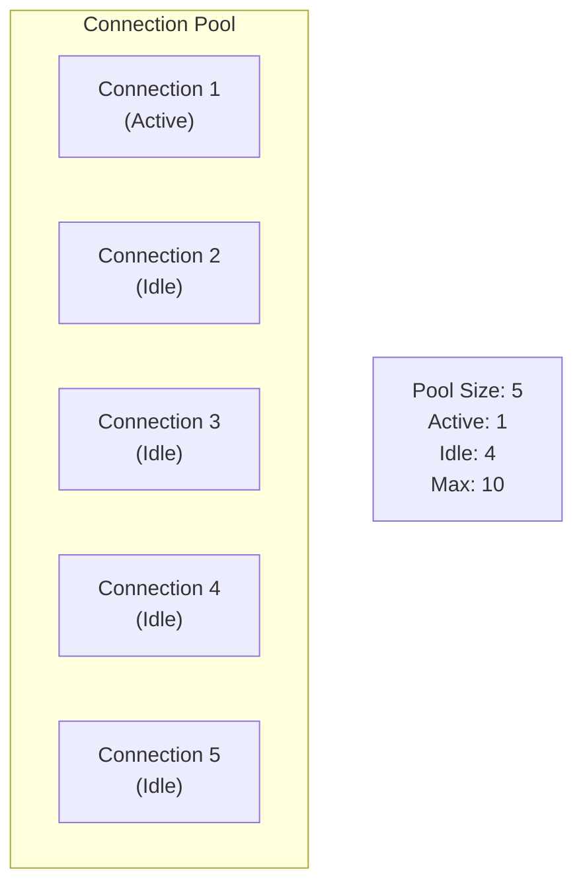

# ⚡ Connection Pooling: Reusing Connections for Performance

---

## 0️⃣ Prerequisites

Before diving into connection pooling, you should understand:

- **TCP Connections**: How network connections work (handshake, overhead). Basic understanding that establishing a connection takes time.
- **Database Connections**: How applications connect to databases. Covered in Phase 3.
- **HTTP Connections**: How HTTP clients make requests. Covered in Phase 2.
- **Threading**: Basic understanding of concurrent requests. Multiple requests can happen simultaneously.

**Quick Refresher**: Connection pooling reuses existing connections instead of creating new ones for each request, dramatically improving performance by avoiding the overhead of connection establishment.

---

## 1️⃣ What Problem Does Connection Pooling Exist to Solve?

### The Core Problem: Creating Connections Is Expensive

Every time an application needs to connect to a database, HTTP service, or any remote resource, it must:

1. **DNS Lookup**: Resolve hostname to IP address (~10-50ms)
2. **TCP Handshake**: Three-way handshake to establish connection (~20-100ms)
3. **TLS Handshake**: If using HTTPS, additional handshake (~50-200ms)
4. **Authentication**: Database/API authentication (~10-50ms)
5. **Connection Setup**: Initialize connection state (~10-50ms)

**Total**: ~100-450ms per connection

### What Systems Looked Like Before Connection Pooling

**The Dark Ages (No Pooling)**:

```java
// ❌ TERRIBLE: Create new connection for every request
@RestController
public class UserController {
    
    @GetMapping("/users/{id}")
    public User getUser(@PathVariable Long id) {
        // Create new database connection
        Connection conn = DriverManager.getConnection(
            "jdbc:postgresql://localhost:5432/mydb",
            "user",
            "password"
        );
        
        // Execute query
        PreparedStatement stmt = conn.prepareStatement("SELECT * FROM users WHERE id = ?");
        stmt.setLong(1, id);
        ResultSet rs = stmt.executeQuery();
        
        // Process result
        User user = mapToUser(rs);
        
        // Close connection (wasteful!)
        conn.close();
        
        return user;
    }
}
```

**Problems with this approach**:
1. **Slow**: 100-450ms overhead per request
2. **Resource Intensive**: Each connection uses memory and file descriptors
3. **Database Overload**: Database server overwhelmed with connection churn
4. **Doesn't Scale**: Can't handle high concurrent requests
5. **Wasteful**: Connections are closed immediately after use

### Real-World Performance Impact

**Without Connection Pooling**:
- 1000 requests/second = 1000 new connections/second
- Each connection: ~200ms overhead
- Total overhead: 200 seconds of connection time per second
- Database can't handle this load
- Application becomes slow and unresponsive

**With Connection Pooling**:
- 1000 requests/second = reuse existing connections
- Connection overhead: ~0ms (connections already established)
- Database handles load efficiently
- Application responds quickly

### What Breaks Without Connection Pooling

| Problem | Impact | Example |
|---------|--------|---------|
| **Slow Response Times** | 100-450ms added to every request | User sees 500ms delay |
| **Database Overload** | Too many connections overwhelm DB | Database crashes |
| **Resource Exhaustion** | File descriptors, memory exhausted | Application crashes |
| **Poor Scalability** | Can't handle concurrent requests | System fails under load |
| **High Latency** | Every request waits for connection | Poor user experience |

---

## 2️⃣ Intuition and Mental Model

### The Taxi Stand Analogy

Think of connection pooling like a taxi stand:

**Without Pooling (Calling Taxi Company)**:
- Every time you need a ride, you call the taxi company
- Wait for them to send a taxi (connection establishment)
- Take your ride
- Taxi leaves (connection closed)
- Next time, call again and wait

**With Pooling (Taxi Stand)**:
- Taxis wait at the stand (connections in pool)
- You arrive and immediately get a taxi (reuse connection)
- Take your ride (use connection)
- Return taxi to stand (return connection to pool)
- Next person immediately gets a taxi (no waiting)

### The Library Card Analogy

**Without Pooling**:
- Every time you want a book, you apply for a library card
- Wait for approval
- Get the book
- Return the card
- Next time, apply again

**With Pooling**:
- Library cards are kept at the desk (connection pool)
- You check out a card (get connection from pool)
- Use it to get books (execute queries)
- Return the card (return connection to pool)
- Next person uses the same card (reuse connection)

### The Key Insight: Reuse Over Recreate

```
Without Pooling:
Request → Create Connection (200ms) → Use (10ms) → Close → Next Request

With Pooling:
Request → Get from Pool (0ms) → Use (10ms) → Return to Pool → Next Request
```

The connection is created once and reused many times.

---

## 3️⃣ How Connection Pooling Works Internally

### Pool Architecture



<details>
<summary>ASCII diagram (reference)</summary>

```text
┌─────────────────────────────────────────────────────────────┐
│                    CONNECTION POOL                            │
├─────────────────────────────────────────────────────────────┤
│                                                              │
│  ┌──────────────┐    ┌──────────────┐    ┌──────────────┐ │
│  │  Connection  │    │  Connection  │    │  Connection  │ │
│  │     1       │    │      2       │    │      3       │ │
│  │  (Active)   │    │  (Idle)      │    │  (Idle)      │ │
│  └──────────────┘    └──────────────┘    └──────────────┘ │
│                                                              │
│  ┌──────────────┐    ┌──────────────┐                       │
│  │  Connection  │    │  Connection  │                       │
│  │     4       │    │      5       │                       │
│  │  (Idle)     │    │  (Idle)      │                       │
│  └──────────────┘    └──────────────┘                       │
│                                                              │
│  Pool Size: 5                                                │
│  Active: 1                                                    │
│  Idle: 4                                                      │
│  Max: 10                                                      │
│                                                              │
└─────────────────────────────────────────────────────────────┘
```
</details>

### Connection Lifecycle

**Step 1: Pool Initialization**
```
Application starts
         ↓
Create connection pool
         ↓
Create initial connections (e.g., 5)
         ↓
Connections ready in pool
```

**Step 2: Request Arrives**
```
Request needs database connection
         ↓
Check pool for available connection
         ↓
If available: Get connection from pool
If not available: Wait or create new (up to max)
         ↓
Mark connection as "in use"
         ↓
Use connection for query
```

**Step 3: Request Completes**
```
Query completes
         ↓
Return connection to pool
         ↓
Mark connection as "idle"
         ↓
Connection ready for next request
```

**Step 4: Connection Cleanup**
```
Idle connection timeout expires
         ↓
Close connection
         ↓
Remove from pool
```

### Pool Configuration Parameters

| Parameter | Description | Typical Value |
|-----------|-------------|---------------|
| **minIdle** | Minimum idle connections | 5-10 |
| **maxTotal** | Maximum total connections | 20-100 |
| **maxIdle** | Maximum idle connections | 10-50 |
| **connectionTimeout** | Max wait time to get connection | 30 seconds |
| **idleTimeout** | Time before idle connection closed | 10 minutes |
| **maxLifetime** | Max connection lifetime | 30 minutes |
| **testOnBorrow** | Test connection before giving it out | true |
| **testWhileIdle** | Test idle connections periodically | true |

---

## 4️⃣ Simulation-First Explanation

### Scenario: Web Application Handling Requests

Let's trace how connection pooling works with real requests:

**Setup**:
- Application: Spring Boot with HikariCP (connection pool)
- Database: PostgreSQL
- Pool Configuration: min=5, max=20

**Step 1: Application Starts**
```java
@SpringBootApplication
public class Application {
    public static void main(String[] args) {
        SpringApplication.run(Application.class, args);
    }
}
```

**What Happens**:
```
Application starts
         ↓
HikariCP initializes
         ↓
Creates 5 initial connections (minIdle=5)
         ↓
Connections ready in pool:
  - Connection 1 (idle)
  - Connection 2 (idle)
  - Connection 3 (idle)
  - Connection 4 (idle)
  - Connection 5 (idle)
```

**Step 2: First Request Arrives**
```java
@GetMapping("/users/1")
public User getUser(@PathVariable Long id) {
    // Application requests connection
    User user = userRepository.findById(id).orElseThrow();
    return user;
}
```

**What Happens**:
```
Request arrives
         ↓
JPA/Hibernate requests connection from pool
         ↓
HikariCP: Get connection from pool
         ↓
Connection 1: Available → Mark as "in use"
         ↓
Execute query: SELECT * FROM users WHERE id = 1
         ↓
Query completes (10ms)
         ↓
Return Connection 1 to pool → Mark as "idle"
         ↓
Response sent to client
```

**Step 3: Multiple Concurrent Requests**
```
Request 1 arrives → Gets Connection 1 (in use)
Request 2 arrives → Gets Connection 2 (in use)
Request 3 arrives → Gets Connection 3 (in use)
Request 4 arrives → Gets Connection 4 (in use)
Request 5 arrives → Gets Connection 5 (in use)
Request 6 arrives → No available connection
         ↓
HikariCP: Create new connection (Connection 6)
         ↓
Request 6 gets Connection 6
```

**Step 4: Requests Complete**
```
Request 1 completes → Connection 1 returned to pool (idle)
Request 2 completes → Connection 2 returned to pool (idle)
Request 3 completes → Connection 3 returned to pool (idle)
...
```

**Step 5: Idle Connection Cleanup**
```
Connection 6 idle for 10 minutes
         ↓
HikariCP: Test connection (testWhileIdle=true)
         ↓
Connection still valid
         ↓
Keep in pool (but close if exceeds maxIdle)
```

### Performance Comparison

**Without Pooling (100 requests)**:
```
Request 1: Create connection (200ms) + Query (10ms) = 210ms
Request 2: Create connection (200ms) + Query (10ms) = 210ms
...
Request 100: Create connection (200ms) + Query (10ms) = 210ms

Total: 21,000ms (21 seconds)
```

**With Pooling (100 requests)**:
```
Request 1: Get from pool (0ms) + Query (10ms) = 10ms
Request 2: Get from pool (0ms) + Query (10ms) = 10ms
...
Request 100: Get from pool (0ms) + Query (10ms) = 10ms

Total: 1,000ms (1 second)
```

**Improvement**: 21x faster!

---

## 5️⃣ How Engineers Actually Use This in Production

### Real-World Implementations

**HikariCP (Java)**:
- Default connection pool for Spring Boot
- Fast, lightweight, production-ready
- Used by: Most Java applications
- Reference: HikariCP GitHub

**Apache Commons DBCP**:
- Older, still used in legacy systems
- More features but slower than HikariCP

**c3p0**:
- Legacy connection pool
- Replaced by HikariCP in most cases

**HTTP Connection Pooling**:
- OkHttp (Android/Java): Built-in connection pooling
- Apache HttpClient: Connection pooling for HTTP
- RestTemplate/WebClient: Spring's HTTP clients with pooling

### Common Patterns

**Pattern 1: Database Connection Pooling (HikariCP)**
```yaml
# application.yml
spring:
  datasource:
    hikari:
      minimum-idle: 5
      maximum-pool-size: 20
      connection-timeout: 30000
      idle-timeout: 600000
      max-lifetime: 1800000
      connection-test-query: SELECT 1
```

**Pattern 2: HTTP Client Connection Pooling**
```java
@Configuration
public class HttpClientConfig {
    
    @Bean
    public RestTemplate restTemplate() {
        // Create connection manager with pooling
        PoolingHttpClientConnectionManager connectionManager = 
            new PoolingHttpClientConnectionManager();
        connectionManager.setMaxTotal(100);  // Max total connections
        connectionManager.setDefaultMaxPerRoute(20);  // Max per route
        
        // Create HTTP client with connection manager
        CloseableHttpClient httpClient = HttpClients.custom()
            .setConnectionManager(connectionManager)
            .build();
        
        HttpComponentsClientHttpRequestFactory factory = 
            new HttpComponentsClientHttpRequestFactory(httpClient);
        
        return new RestTemplate(factory);
    }
}
```

**Pattern 3: Redis Connection Pooling**
```java
@Configuration
public class RedisConfig {
    
    @Bean
    public LettuceConnectionFactory redisConnectionFactory() {
        LettuceClientConfiguration clientConfig = 
            LettuceClientConfiguration.builder()
                .poolConfig(GenericObjectPoolConfig.builder()
                    .minIdle(5)
                    .maxTotal(20)
                    .build())
                .build();
        
        RedisStandaloneConfiguration serverConfig = 
            new RedisStandaloneConfiguration("localhost", 6379);
        
        return new LettuceConnectionFactory(serverConfig, clientConfig);
    }
}
```

---

## 6️⃣ How to Implement or Apply It

### Spring Boot with HikariCP (Default)

**Maven Dependencies** (already included in Spring Boot):
```xml
<dependencies>
    <dependency>
        <groupId>org.springframework.boot</groupId>
        <artifactId>spring-boot-starter-data-jpa</artifactId>
    </dependency>
    <!-- HikariCP is included by default -->
</dependencies>
```

**Configuration**:
```yaml
# application.yml
spring:
  datasource:
    url: jdbc:postgresql://localhost:5432/mydb
    username: app_user
    password: ${DB_PASSWORD}
    hikari:
      # Pool sizing
      minimum-idle: 5
      maximum-pool-size: 20
      
      # Timeouts
      connection-timeout: 30000  # 30 seconds
      idle-timeout: 600000  # 10 minutes
      max-lifetime: 1800000  # 30 minutes
      
      # Connection testing
      connection-test-query: SELECT 1
      test-on-borrow: true
      test-while-idle: true
      
      # Leak detection
      leak-detection-threshold: 60000  # 60 seconds
```

**Java Configuration** (Alternative):
```java
@Configuration
public class DataSourceConfig {
    
    @Bean
    @ConfigurationProperties("spring.datasource.hikari")
    public HikariDataSource dataSource() {
        HikariConfig config = new HikariConfig();
        config.setJdbcUrl("jdbc:postgresql://localhost:5432/mydb");
        config.setUsername("app_user");
        config.setPassword(System.getenv("DB_PASSWORD"));
        
        // Pool configuration
        config.setMinimumIdle(5);
        config.setMaximumPoolSize(20);
        config.setConnectionTimeout(30000);
        config.setIdleTimeout(600000);
        config.setMaxLifetime(1800000);
        
        // Connection testing
        config.setConnectionTestQuery("SELECT 1");
        config.setTestOnBorrow(true);
        config.setTestWhileIdle(true);
        
        // Leak detection
        config.setLeakDetectionThreshold(60000);
        
        return new HikariDataSource(config);
    }
}
```

**Monitoring Connection Pool**:
```java
@Component
public class ConnectionPoolMonitor {
    
    private final HikariDataSource dataSource;
    
    @Scheduled(fixedRate = 60000)  // Every minute
    public void logPoolStats() {
        HikariPoolMXBean poolBean = dataSource.getHikariPoolMXBean();
        
        logger.info("Connection Pool Stats: " +
            "Active: " + poolBean.getActiveConnections() +
            ", Idle: " + poolBean.getIdleConnections() +
            ", Total: " + poolBean.getTotalConnections() +
            ", Waiting: " + poolBean.getThreadsAwaitingConnection());
    }
}
```

### HTTP Client Connection Pooling

**OkHttp (Recommended for Java/Android)**:
```java
@Configuration
public class OkHttpConfig {
    
    @Bean
    public OkHttpClient okHttpClient() {
        // Connection pool
        ConnectionPool connectionPool = new ConnectionPool(
            10,  // Max idle connections
            5,   // Keep alive duration (minutes)
            TimeUnit.MINUTES
        );
        
        return new OkHttpClient.Builder()
            .connectionPool(connectionPool)
            .connectTimeout(30, TimeUnit.SECONDS)
            .readTimeout(30, TimeUnit.SECONDS)
            .writeTimeout(30, TimeUnit.SECONDS)
            .build();
    }
}
```

**Spring WebClient (Reactive)**:
```java
@Configuration
public class WebClientConfig {
    
    @Bean
    public WebClient webClient() {
        // Connection pool for Netty (underlying HTTP client)
        ConnectionProvider connectionProvider = ConnectionProvider.builder("custom")
            .maxConnections(100)
            .maxIdleTime(Duration.ofSeconds(20))
            .maxLifeTime(Duration.ofSeconds(60))
            .pendingAcquireTimeout(Duration.ofSeconds(60))
            .evictInBackground(Duration.ofSeconds(120))
            .build();
        
        HttpClient httpClient = HttpClient.create(connectionProvider);
        
        return WebClient.builder()
            .clientConnector(new ReactorClientHttpConnector(httpClient))
            .build();
    }
}
```

---

## 7️⃣ Tradeoffs, Pitfalls, and Common Mistakes

### Tradeoffs

| Aspect | No Pooling | Connection Pooling |
|--------|-----------|-------------------|
| **Latency** | ⚠️ High (connection overhead) | ✅ Low (reuse) |
| **Memory** | ✅ Lower | ⚠️ Higher (connections in memory) |
| **Complexity** | ✅ Simple | ⚠️ More complex |
| **Scalability** | ❌ Poor | ✅ Good |
| **Resource Usage** | ⚠️ High (churn) | ✅ Efficient |

### Common Pitfalls

**Pitfall 1: Pool Size Too Small**
```yaml
# ❌ BAD: Pool too small
spring:
  datasource:
    hikari:
      maximum-pool-size: 5  # Too small for 100 concurrent requests
```

```yaml
# ✅ GOOD: Size based on load
spring:
  datasource:
    hikari:
      maximum-pool-size: 20  # Handles concurrent load
```

**Rule of Thumb**: `maxPoolSize = (number_of_threads × 2) + number_of_spare_connections`

**Pitfall 2: Not Testing Connections**
```yaml
# ❌ BAD: No connection testing
spring:
  datasource:
    hikari:
      test-on-borrow: false
      test-while-idle: false
# Stale connections will cause errors
```

```yaml
# ✅ GOOD: Test connections
spring:
  datasource:
    hikari:
      test-on-borrow: true
      test-while-idle: true
      connection-test-query: SELECT 1
```

**Pitfall 3: Connection Leaks**
```java
// ❌ BAD: Connection not closed
public User getUser(Long id) {
    Connection conn = dataSource.getConnection();
    // Use connection
    // Forgot to close! Connection leak
    return user;
}

// ✅ GOOD: Use try-with-resources
public User getUser(Long id) {
    try (Connection conn = dataSource.getConnection()) {
        // Use connection
        return user;
    }  // Automatically closed
}

// ✅ BETTER: Use JPA (handles connections automatically)
@Repository
public interface UserRepository extends JpaRepository<User, Long> {
    // JPA handles connection pooling automatically
}
```

**Pitfall 4: Pool Size Too Large**
```yaml
# ❌ BAD: Pool too large
spring:
  datasource:
    hikari:
      maximum-pool-size: 1000  # Overwhelms database
```

```yaml
# ✅ GOOD: Reasonable size
spring:
  datasource:
    hikari:
      maximum-pool-size: 20  # Based on database capacity
```

**Pitfall 5: Not Monitoring Pool**
```java
// ❌ BAD: No monitoring
// Can't detect connection leaks or pool exhaustion

// ✅ GOOD: Monitor pool metrics
@Scheduled(fixedRate = 60000)
public void monitorPool() {
    HikariPoolMXBean pool = dataSource.getHikariPoolMXBean();
    if (pool.getThreadsAwaitingConnection() > 0) {
        logger.warn("Connection pool exhausted! Waiting threads: " + 
            pool.getThreadsAwaitingConnection());
    }
}
```

### Performance Considerations

**Pool Sizing Formula**:
```
maxPoolSize = (T × C) + S

Where:
T = Number of threads (application threads)
C = Connections per thread (usually 1)
S = Spare connections (buffer, usually 2-5)
```

**Example**:
- Application: 10 threads
- Connections per thread: 1
- Spare connections: 5
- **maxPoolSize = (10 × 1) + 5 = 15**

**Connection Lifetime**:
- Too short: Frequent reconnection overhead
- Too long: Stale connections, database timeout
- **Recommended**: 30 minutes to 1 hour

---

## 8️⃣ When NOT to Use This

### Anti-Patterns

**Don't Use Connection Pooling For**:
1. **One-off scripts**: Overhead not worth it
2. **Long-running connections**: Pools are for short-lived connections
3. **Stateful connections**: Connections with session state

**When Simple Connections Work**:
- Batch scripts that run once
- Command-line tools
- One-time data migrations

**Over-Pooling Warning**:
- Too many connections waste resources
- Database has connection limits
- Balance pool size with database capacity

---

## 9️⃣ Comparison with Alternatives

### Connection Pooling vs No Pooling

| Feature | No Pooling | Connection Pooling |
|---------|-----------|-------------------|
| **Latency** | ⚠️ High (200ms+ per request) | ✅ Low (~0ms) |
| **Scalability** | ❌ Poor | ✅ Good |
| **Resource Usage** | ⚠️ High churn | ✅ Efficient |
| **Complexity** | ✅ Simple | ⚠️ More complex |
| **Memory** | ✅ Lower | ⚠️ Higher |

**When to Choose Each**:
- **No Pooling**: One-off scripts, simple tools
- **Connection Pooling**: Web applications, high-throughput systems

### HikariCP vs Other Pools

| Feature | HikariCP | DBCP | c3p0 |
|---------|----------|------|------|
| **Performance** | ✅ Fastest | ⚠️ Slower | ⚠️ Slowest |
| **Features** | ✅ Essential features | ✅ More features | ✅ Most features |
| **Maintenance** | ✅ Active | ⚠️ Legacy | ❌ Deprecated |
| **Recommendation** | ✅ Use this | ⚠️ Legacy only | ❌ Don't use |

---

## 🔟 Interview Follow-up Questions WITH Answers

### Question 1: "How do you size a connection pool?"

**Answer**:
Based on application load and database capacity:

1. **Calculate Thread Count**: How many concurrent requests?
2. **Database Capacity**: How many connections can database handle?
3. **Formula**: `maxPoolSize = (threads × connections_per_thread) + spare`
4. **Test**: Load test with different pool sizes
5. **Monitor**: Watch for connection wait times

```java
// Example calculation
int threads = 10;  // Application thread pool size
int connectionsPerThread = 1;
int spare = 5;
int maxPoolSize = (threads * connectionsPerThread) + spare;  // 15

// But also consider database limits
int databaseMaxConnections = 100;
int maxPoolSize = Math.min(15, databaseMaxConnections / 2);  // Don't use all DB connections
```

### Question 2: "How do you detect connection leaks?"

**Answer**:
Multiple detection methods:

1. **Leak Detection Threshold**: HikariCP can detect leaks
2. **Monitoring**: Track active connections over time
3. **Logging**: Log when connections aren't returned
4. **Alerts**: Alert on pool exhaustion

```yaml
spring:
  datasource:
    hikari:
      leak-detection-threshold: 60000  # Alert if connection held > 60s
```

```java
@Scheduled(fixedRate = 60000)
public void detectLeaks() {
    HikariPoolMXBean pool = dataSource.getHikariPoolMXBean();
    int active = pool.getActiveConnections();
    int total = pool.getTotalConnections();
    
    // If all connections are active for too long, possible leak
    if (active == total && active > 0) {
        logger.warn("Possible connection leak: all connections active");
    }
}
```

### Question 3: "How do you handle connection pool exhaustion?"

**Answer**:
Multiple strategies:

1. **Increase Pool Size**: If database can handle it
2. **Connection Timeout**: Fail fast instead of waiting forever
3. **Circuit Breaker**: Stop requests if pool exhausted
4. **Queue Requests**: Queue requests instead of failing
5. **Scale Out**: Add more application instances

```java
@Bean
public HikariDataSource dataSource() {
    HikariConfig config = new HikariConfig();
    config.setMaximumPoolSize(20);
    config.setConnectionTimeout(30000);  // Fail after 30s instead of waiting forever
    config.setRegisterMbeans(true);  // Enable monitoring
    return new HikariDataSource(config);
}
```

### Question 4: "What's the difference between minIdle and maxPoolSize?"

**Answer**:

**minIdle**: Minimum number of idle connections to maintain
- Pool keeps at least this many connections ready
- Pre-warmed connections for fast response
- Example: minIdle=5 means always have 5 connections ready

**maxPoolSize**: Maximum total connections (active + idle)
- Pool will never exceed this many connections
- Includes both active and idle connections
- Example: maxPoolSize=20 means max 20 connections total

**Relationship**:
- minIdle ≤ maxPoolSize (usually minIdle < maxPoolSize)
- Pool maintains minIdle connections even when idle
- Pool can grow up to maxPoolSize under load

### Question 5: "How do you handle database failover with connection pooling?"

**Answer**:
Connection validation and retry:

1. **Test Connections**: test-on-borrow, test-while-idle
2. **Connection Validation**: Validate before use
3. **Retry Logic**: Retry on connection failure
4. **Failover URLs**: Multiple database URLs

```yaml
spring:
  datasource:
    url: jdbc:postgresql://primary:5432,standby:5432/mydb
    hikari:
      connection-test-query: SELECT 1
      test-on-borrow: true
      test-while-idle: true
      # HikariCP will automatically failover to standby
```

```java
@Retryable(value = {SQLException.class}, maxAttempts = 3)
public User getUser(Long id) {
    // Retry on connection failure
    return userRepository.findById(id).orElseThrow();
}
```

---

## 1️⃣1️⃣ One Clean Mental Summary

Connection pooling is like a taxi stand for database and HTTP connections. Instead of calling for a new connection every time (which takes 100-450ms), you reuse connections from a pool (0ms overhead). The pool maintains a set of ready connections (minIdle), can grow under load (up to maxPoolSize), and automatically tests and replaces stale connections. This dramatically improves performance—21x faster in our example—and allows applications to handle high concurrent load. Use HikariCP for databases (it's the fastest), configure pool size based on your load (threads × 2 + spare), enable connection testing to catch stale connections, and monitor for connection leaks. Connection pooling is essential for production applications and is enabled by default in Spring Boot.

---

