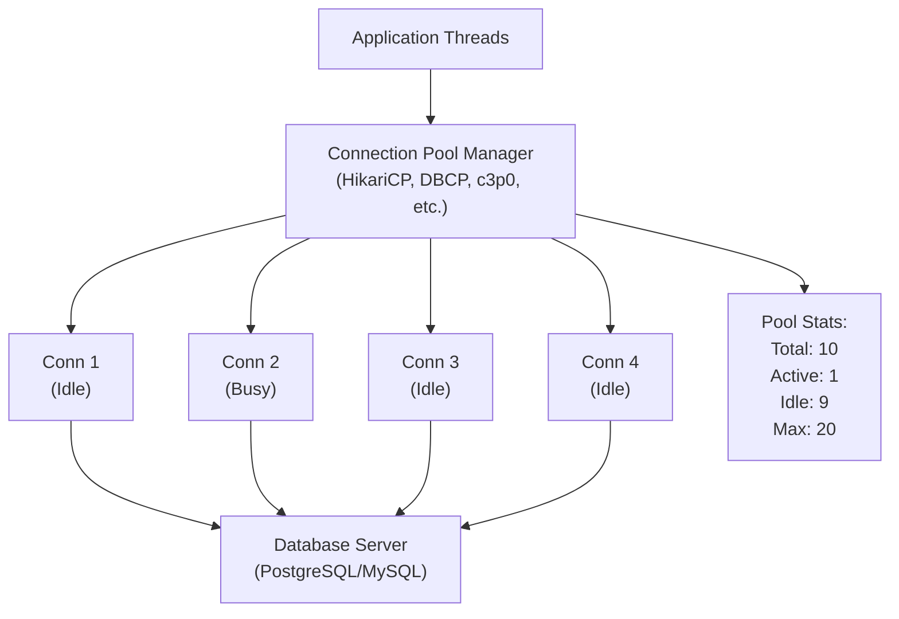

# ⚡ Database Connection Pooling: Optimizing Database Connections

---

## 0️⃣ Prerequisites

Before diving into database connection pooling, you should understand:

- **Connection Pooling Basics**: General concept of connection pooling. Covered in `13-connection-pooling.md`.
- **Database Connections**: How applications connect to databases (JDBC, connection strings). Covered in Phase 3.
- **SQL Queries**: Basic understanding of how queries are executed. Covered in Phase 3.
- **Threading**: Understanding of concurrent database access. Multiple threads can access database simultaneously.

**Quick Refresher**: Database connection pooling specifically optimizes database connections, which are expensive to create. It reuses connections across multiple queries, dramatically improving database performance and application scalability.

---

## 1️⃣ What Problem Does Database Connection Pooling Exist to Solve?

### The Core Problem: Database Connections Are Very Expensive

Creating a database connection involves:

1. **Network Round Trip**: TCP connection to database server (~10-50ms)
2. **TCP Handshake**: Three-way handshake (~20-100ms)
3. **TLS Handshake**: If using SSL/TLS (~50-200ms)
4. **Authentication**: Database authentication (~10-50ms)
5. **Session Initialization**: Set up database session (~10-50ms)
6. **Connection Validation**: Database validates connection (~10-20ms)

**Total**: ~110-470ms per connection

### What Systems Looked Like Before Database Connection Pooling

**The Dark Ages (No Pooling)**:

```java
// ❌ TERRIBLE: New connection for every query
public class UserService {
    
    public User getUser(Long id) {
        // Create new connection
        Connection conn = DriverManager.getConnection(
            "jdbc:postgresql://localhost:5432/mydb",
            "user",
            "password"
        );
        
        try {
            PreparedStatement stmt = conn.prepareStatement(
                "SELECT * FROM users WHERE id = ?"
            );
            stmt.setLong(1, id);
            ResultSet rs = stmt.executeQuery();
            
            User user = mapResultSetToUser(rs);
            return user;
        } finally {
            conn.close();  // Close connection (wasteful!)
        }
    }
}
```

**Problems with this approach**:
1. **Extremely Slow**: 110-470ms overhead per query
2. **Database Overload**: Database server overwhelmed with connection churn
3. **Resource Exhaustion**: Database has connection limits (typically 100-1000)
4. **Poor Scalability**: Can't handle concurrent requests
5. **Connection Limits**: Hit database max connections quickly

### Real-World Performance Impact

**Scenario**: Web application handling 100 requests/second

**Without Connection Pooling**:
- 100 requests/second = 100 new connections/second
- Each connection: ~200ms overhead
- Database connections: 100 active connections
- Database max connections: 100 (exhausted!)
- Result: Database rejects new connections, application fails

**With Connection Pooling**:
- 100 requests/second = reuse 10-20 connections
- Connection overhead: ~0ms (connections already established)
- Database connections: 10-20 active connections
- Database max connections: 100 (plenty of headroom)
- Result: Application handles load efficiently

### What Breaks Without Database Connection Pooling

| Problem | Impact | Example |
|---------|--------|---------|
| **Slow Queries** | 110-470ms added to every query | User sees 500ms delay |
| **Database Overload** | Too many connections overwhelm DB | Database crashes |
| **Connection Exhaustion** | Hit database max connections | "Too many connections" error |
| **Poor Scalability** | Can't handle concurrent requests | System fails under load |
| **Resource Waste** | Connections created and destroyed constantly | High CPU/memory usage |

---

## 2️⃣ Intuition and Mental Model

### The Library Analogy

Think of database connection pooling like a library:

**Without Pooling (Public Library)**:
- Every time you want a book, you go to the library
- Wait in line to get a library card (connection establishment)
- Get your book (execute query)
- Return the card and leave (close connection)
- Next time, get a new card and wait again

**With Pooling (Private Library with Reserved Seats)**:
- Library has reserved seats (connection pool)
- You arrive and immediately sit down (get connection from pool)
- Read your book (execute query)
- Leave but seat stays reserved (return connection to pool)
- Next person immediately sits down (reuse connection)

### The Restaurant Table Analogy

**Without Pooling**:
- Every customer gets a new table
- Set up table (connection setup)
- Serve meal (execute query)
- Clear and remove table (close connection)
- Next customer: set up new table

**With Pooling**:
- Restaurant has tables ready (connection pool)
- Customer sits at available table (get connection)
- Serve meal (execute query)
- Clear table but keep it (return connection)
- Next customer: immediately use same table

### The Key Insight: Database Connections Are Stateful

Unlike HTTP connections, database connections maintain:
- **Transaction state**: Current transaction context
- **Session variables**: User settings, timezone
- **Prepared statements**: Cached query plans
- **Locks**: Table/row locks held by connection

Reusing connections preserves this state and improves performance.

---

## 3️⃣ How Database Connection Pooling Works Internally

### Pool Architecture



<details>
<summary>ASCII diagram (reference)</summary>

```text
┌─────────────────────────────────────────────────────────────┐
│              DATABASE CONNECTION POOL                       │
├─────────────────────────────────────────────────────────────┤
│                                                              │
│  Application Threads                                         │
│     │                                                        │
│     ▼                                                        │
│  ┌──────────────────────────────────────┐                  │
│  │      Connection Pool Manager          │                  │
│  │  (HikariCP, DBCP, c3p0, etc.)        │                  │
│  └──────────────────────────────────────┘                  │
│     │                                                        │
│     ├──────────┬──────────┬──────────┐                     │
│     ▼          ▼          ▼          ▼                      │
│  ┌──────┐  ┌──────┐  ┌──────┐  ┌──────┐                   │
│  │Conn 1│  │Conn 2│  │Conn 3│  │Conn 4│                   │
│  │(Idle)│  │(Busy)│  │(Idle)│  │(Idle)│                   │
│  └──────┘  └──────┘  └──────┘  └──────┘                   │
│     │          │          │          │                      │
│     └──────────┴──────────┴──────────┘                      │
│                    │                                        │
│                    ▼                                        │
│         ┌──────────────────────┐                            │
│         │   Database Server    │                            │
│         │   (PostgreSQL/MySQL) │                            │
│         └──────────────────────┘                            │
│                                                              │
│  Pool Stats:                                                 │
│  - Total: 10                                                 │
│  - Active: 1                                                 │
│  - Idle: 9                                                   │
│  - Max: 20                                                   │
│                                                              │
└─────────────────────────────────────────────────────────────┘
```
</details>

### Connection Lifecycle

**Step 1: Pool Initialization**
```
Application starts
         ↓
Connection pool initializes
         ↓
Creates initial connections (minIdle, e.g., 5)
         ↓
Each connection:
  - Establishes TCP connection to database
  - Performs TLS handshake (if SSL)
  - Authenticates with database
  - Initializes session
         ↓
Connections ready in pool (idle)
```

**Step 2: Request Arrives**
```
Application thread needs database connection
         ↓
Request connection from pool
         ↓
Pool checks for available connection
         ↓
If available:
  - Get connection from pool
  - Mark as "in use"
  - Validate connection (test-on-borrow)
  - Return to application
         ↓
If not available:
  - Check if can create new (under maxPoolSize)
  - Create new connection
  - Or wait for connection (up to connectionTimeout)
```

**Step 3: Execute Query**
```
Application uses connection
         ↓
Execute SQL query
         ↓
Process results
         ↓
Query completes
```

**Step 4: Return Connection**
```
Query completes
         ↓
Return connection to pool
         ↓
Mark connection as "idle"
         ↓
Connection ready for next request
```

**Step 5: Connection Maintenance**
```
Periodically (test-while-idle):
         ↓
Test idle connections
         ↓
If connection invalid:
  - Close connection
  - Create replacement
         ↓
If connection idle too long (idleTimeout):
  - Close connection
  - Remove from pool
```

### Pool Configuration Parameters

| Parameter | Description | Typical Value | Impact |
|-----------|-------------|---------------|--------|
| **minimumIdle** | Min idle connections | 5-10 | Pre-warmed connections |
| **maximumPoolSize** | Max total connections | 20-100 | Concurrency limit |
| **connectionTimeout** | Max wait for connection | 30s | Fail fast |
| **idleTimeout** | Time before idle connection closed | 10min | Resource cleanup |
| **maxLifetime** | Max connection lifetime | 30min | Prevent stale connections |
| **connectionTestQuery** | Query to test connection | SELECT 1 | Validate connection |
| **testOnBorrow** | Test before giving connection | true | Catch stale connections |
| **testWhileIdle** | Test idle connections | true | Maintain pool health |

---

## 4️⃣ Simulation-First Explanation

### Scenario: Spring Boot Application with HikariCP

Let's trace how database connection pooling works:

**Setup**:
- Application: Spring Boot with JPA/Hibernate
- Database: PostgreSQL
- Pool: HikariCP (default in Spring Boot)
- Configuration: minIdle=5, maxPoolSize=20

**Step 1: Application Starts**
```java
@SpringBootApplication
public class Application {
    public static void main(String[] args) {
        SpringApplication.run(Application.class, args);
    }
}
```

**What Happens**:
```
Spring Boot starts
         ↓
HikariCP initializes
         ↓
Creates 5 initial connections (minimumIdle=5)
         ↓
Each connection:
  1. Connect to PostgreSQL (50ms)
  2. TLS handshake (100ms)
  3. Authenticate (20ms)
  4. Initialize session (10ms)
  Total: ~180ms per connection
         ↓
5 connections ready in pool (idle)
Pool state: Total=5, Active=0, Idle=5
```

**Step 2: First Request**
```java
@GetMapping("/users/1")
public User getUser(@PathVariable Long id) {
    return userRepository.findById(id).orElseThrow();
}
```

**What Happens**:
```
Request arrives
         ↓
JPA/Hibernate needs connection
         ↓
HikariCP: Get connection from pool
         ↓
Connection 1: Available (idle)
         ↓
Test connection (test-on-borrow=true):
  Execute: SELECT 1
  Result: Success (connection valid)
         ↓
Mark Connection 1 as "in use"
         ↓
JPA executes query:
  SELECT * FROM users WHERE id = 1
         ↓
Query completes (10ms)
         ↓
Return Connection 1 to pool
         ↓
Mark Connection 1 as "idle"
         ↓
Response sent to client
Total time: 10ms (vs 190ms without pooling)
```

**Step 3: Concurrent Requests**
```
Request 1 arrives → Gets Connection 1 (in use)
Request 2 arrives → Gets Connection 2 (in use)
Request 3 arrives → Gets Connection 3 (in use)
Request 4 arrives → Gets Connection 4 (in use)
Request 5 arrives → Gets Connection 5 (in use)
Request 6 arrives → No available connection
         ↓
HikariCP: Create new connection (Connection 6)
  - Connect to database (50ms)
  - TLS handshake (100ms)
  - Authenticate (20ms)
  - Total: ~170ms
         ↓
Request 6 gets Connection 6
         ↓
Pool state: Total=6, Active=6, Idle=0
```

**Step 4: Requests Complete**
```
Request 1 completes → Connection 1 returned (idle)
Request 2 completes → Connection 2 returned (idle)
Request 3 completes → Connection 3 returned (idle)
...
         ↓
Pool state: Total=6, Active=0, Idle=6
```

**Step 5: Idle Connection Cleanup**
```
Connection 6 idle for 10 minutes (idleTimeout)
         ↓
HikariCP: Test connection (test-while-idle=true)
  Execute: SELECT 1
  Result: Success
         ↓
Connection still valid, but exceeds maxIdle
         ↓
Close Connection 6 (exceeds maxIdle=5)
         ↓
Pool state: Total=5, Active=0, Idle=5
```

### Performance Comparison

**Without Pooling (1000 queries)**:
```
Query 1: Create connection (200ms) + Query (10ms) = 210ms
Query 2: Create connection (200ms) + Query (10ms) = 210ms
...
Query 1000: Create connection (200ms) + Query (10ms) = 210ms

Total: 210,000ms (210 seconds)
Average: 210ms per query
```

**With Pooling (1000 queries, 20 connections)**:
```
Query 1-20: Get from pool (0ms) + Query (10ms) = 10ms
Query 21-40: Get from pool (0ms) + Query (10ms) = 10ms
...
Query 981-1000: Get from pool (0ms) + Query (10ms) = 10ms

Total: 10,000ms (10 seconds)
Average: 10ms per query
```

**Improvement**: 21x faster!

---

## 5️⃣ How Engineers Actually Use This in Production

### Real-World Implementations

**HikariCP** (Most Common):
- Default in Spring Boot
- Fastest Java connection pool
- Used by: Most Java applications
- Reference: HikariCP GitHub

**PgBouncer** (PostgreSQL Specific):
- Connection pooler for PostgreSQL
- Sits between application and database
- Reduces connection overhead
- Used by: High-scale PostgreSQL deployments

**Apache Commons DBCP**:
- Older, still used in legacy systems
- More features but slower than HikariCP

### Common Patterns

**Pattern 1: Spring Boot Default (HikariCP)**
```yaml
# application.yml
spring:
  datasource:
    url: jdbc:postgresql://localhost:5432/mydb
    username: app_user
    password: ${DB_PASSWORD}
    hikari:
      minimum-idle: 5
      maximum-pool-size: 20
      connection-timeout: 30000
      idle-timeout: 600000
      max-lifetime: 1800000
      connection-test-query: SELECT 1
      test-on-borrow: true
      test-while-idle: true
```

**Pattern 2: PgBouncer (PostgreSQL Connection Pooler)**
```yaml
# pg_bouncer.ini
[databases]
mydb = host=localhost port=5432 dbname=mydb

[pgbouncer]
pool_mode = transaction  # Pool at transaction level
max_client_conn = 1000   # Max client connections
default_pool_size = 20   # Connections per database
```

**Pattern 3: Multiple Data Sources**
```java
@Configuration
public class MultiDataSourceConfig {
    
    @Bean
    @Primary
    @ConfigurationProperties("spring.datasource.primary")
    public DataSource primaryDataSource() {
        return DataSourceBuilder.create()
            .type(HikariDataSource.class)
            .build();
    }
    
    @Bean
    @ConfigurationProperties("spring.datasource.secondary")
    public DataSource secondaryDataSource() {
        return DataSourceBuilder.create()
            .type(HikariDataSource.class)
            .build();
    }
}
```

---

## 6️⃣ How to Implement or Apply It

### Spring Boot with HikariCP (Default)

**Maven Dependencies** (included by default):
```xml
<dependencies>
    <dependency>
        <groupId>org.springframework.boot</groupId>
        <artifactId>spring-boot-starter-data-jpa</artifactId>
    </dependency>
    <!-- HikariCP included automatically -->
</dependencies>
```

**Configuration**:
```yaml
# application.yml
spring:
  datasource:
    url: jdbc:postgresql://localhost:5432/mydb
    username: app_user
    password: ${DB_PASSWORD}
    driver-class-name: org.postgresql.Driver
    hikari:
      # Pool sizing
      minimum-idle: 5
      maximum-pool-size: 20
      
      # Timeouts
      connection-timeout: 30000  # 30 seconds
      idle-timeout: 600000  # 10 minutes
      max-lifetime: 1800000  # 30 minutes
      
      # Connection testing
      connection-test-query: SELECT 1
      test-on-borrow: true
      test-while-idle: true
      
      # Leak detection
      leak-detection-threshold: 60000  # 60 seconds
      
      # Performance
      connection-init-sql: SET timezone = 'UTC'
```

**Java Configuration** (Programmatic):
```java
@Configuration
public class DataSourceConfig {
    
    @Bean
    @ConfigurationProperties("spring.datasource.hikari")
    public HikariDataSource dataSource() {
        HikariConfig config = new HikariConfig();
        
        // Connection URL
        config.setJdbcUrl("jdbc:postgresql://localhost:5432/mydb");
        config.setUsername("app_user");
        config.setPassword(System.getenv("DB_PASSWORD"));
        
        // Pool configuration
        config.setMinimumIdle(5);
        config.setMaximumPoolSize(20);
        config.setConnectionTimeout(30000);
        config.setIdleTimeout(600000);
        config.setMaxLifetime(1800000);
        
        // Connection testing
        config.setConnectionTestQuery("SELECT 1");
        config.setTestOnBorrow(true);
        config.setTestWhileIdle(true);
        
        // Leak detection
        config.setLeakDetectionThreshold(60000);
        
        // Performance optimizations
        config.setConnectionInitSql("SET timezone = 'UTC'");
        
        return new HikariDataSource(config);
    }
}
```

**Monitoring and Metrics**:
```java
@Component
public class ConnectionPoolMonitor {
    
    private final HikariDataSource dataSource;
    
    public ConnectionPoolMonitor(HikariDataSource dataSource) {
        this.dataSource = dataSource;
    }
    
    @Scheduled(fixedRate = 60000)  // Every minute
    public void logPoolStats() {
        HikariPoolMXBean poolBean = dataSource.getHikariPoolMXBean();
        
        logger.info("Database Connection Pool Stats: " +
            "Active: " + poolBean.getActiveConnections() +
            ", Idle: " + poolBean.getIdleConnections() +
            ", Total: " + poolBean.getTotalConnections() +
            ", Waiting: " + poolBean.getThreadsAwaitingConnection() +
            ", Timeout: " + poolBean.getThreadsAwaitingConnection());
        
        // Alert if pool exhausted
        if (poolBean.getThreadsAwaitingConnection() > 0) {
            logger.warn("Connection pool exhausted! " + 
                poolBean.getThreadsAwaitingConnection() + " threads waiting");
        }
    }
    
    @EventListener
    public void onApplicationReady(ApplicationReadyEvent event) {
        // Log pool configuration on startup
        HikariConfig config = dataSource.getHikariConfig();
        logger.info("HikariCP Configuration: " +
            "minIdle=" + config.getMinimumIdle() +
            ", maxPoolSize=" + config.getMaximumPoolSize() +
            ", connectionTimeout=" + config.getConnectionTimeout());
    }
}
```

**Actuator Endpoint** (Spring Boot Actuator):
```yaml
# application.yml
management:
  endpoints:
    web:
      exposure:
        include: health,metrics,hikaricp
  metrics:
    export:
      prometheus:
        enabled: true
```

Access metrics at: `http://localhost:8080/actuator/metrics/hikaricp.connections.active`

---

## 7️⃣ Tradeoffs, Pitfalls, and Common Mistakes

### Tradeoffs

| Aspect | No Pooling | Connection Pooling |
|--------|-----------|-------------------|
| **Query Latency** | ⚠️ High (200ms+ overhead) | ✅ Low (~0ms overhead) |
| **Memory Usage** | ✅ Lower | ⚠️ Higher (connections in memory) |
| **Database Connections** | ⚠️ High churn | ✅ Stable |
| **Scalability** | ❌ Poor | ✅ Good |
| **Complexity** | ✅ Simple | ⚠️ More complex |

### Common Pitfalls

**Pitfall 1: Pool Size Too Small**
```yaml
# ❌ BAD: Pool too small for load
spring:
  datasource:
    hikari:
      maximum-pool-size: 5  # Too small for 50 concurrent requests
```

**Impact**: Connection wait times, timeouts, poor performance

**Solution**: Size based on concurrent load
```yaml
# ✅ GOOD: Sized for load
spring:
  datasource:
    hikari:
      maximum-pool-size: 20  # Handles concurrent requests
```

**Pitfall 2: Pool Size Too Large**
```yaml
# ❌ BAD: Pool too large
spring:
  datasource:
    hikari:
      maximum-pool-size: 1000  # Overwhelms database
```

**Impact**: Database connection exhaustion, poor performance

**Solution**: Match database capacity
```yaml
# ✅ GOOD: Reasonable size
spring:
  datasource:
    hikari:
      maximum-pool-size: 20  # Based on database capacity
```

**Pitfall 3: Not Testing Connections**
```yaml
# ❌ BAD: No connection testing
spring:
  datasource:
    hikari:
      test-on-borrow: false
      test-while-idle: false
```

**Impact**: Stale connections cause errors

**Solution**: Enable connection testing
```yaml
# ✅ GOOD: Test connections
spring:
  datasource:
    hikari:
      test-on-borrow: true
      test-while-idle: true
      connection-test-query: SELECT 1
```

**Pitfall 4: Connection Leaks**
```java
// ❌ BAD: Connection not closed
public User getUser(Long id) {
    Connection conn = dataSource.getConnection();
    // Use connection
    // Forgot to close! Connection leak
    return user;
}
```

**Impact**: Pool exhaustion, application hangs

**Solution**: Use JPA or try-with-resources
```java
// ✅ GOOD: JPA handles connections automatically
@Repository
public interface UserRepository extends JpaRepository<User, Long> {
    // JPA manages connections
}

// ✅ GOOD: Manual connection management
public User getUser(Long id) {
    try (Connection conn = dataSource.getConnection()) {
        // Use connection
        return user;
    }  // Automatically closed
}
```

**Pitfall 5: Not Monitoring Pool**
```java
// ❌ BAD: No monitoring
// Can't detect problems until too late
```

**Solution**: Monitor pool metrics
```java
// ✅ GOOD: Monitor pool
@Scheduled(fixedRate = 60000)
public void monitorPool() {
    HikariPoolMXBean pool = dataSource.getHikariPoolMXBean();
    if (pool.getThreadsAwaitingConnection() > 0) {
        alertService.sendAlert("Connection pool exhausted");
    }
}
```

### Performance Considerations

**Pool Sizing Formula**:
```
maxPoolSize = (T × C) + S

Where:
T = Number of application threads
C = Connections per thread (usually 1)
S = Spare connections (buffer, 2-5)
```

**Example**:
- Application threads: 10
- Connections per thread: 1
- Spare: 5
- **maxPoolSize = (10 × 1) + 5 = 15**

**Database Capacity**:
- PostgreSQL default: 100 connections
- MySQL default: 151 connections
- **Rule**: Don't use more than 50% of database capacity
- **Example**: If DB max=100, use maxPoolSize=20 per application instance

**Connection Lifetime**:
- Too short: Frequent reconnection overhead
- Too long: Stale connections, database timeouts
- **Recommended**: 30 minutes to 1 hour

---

## 8️⃣ When NOT to Use This

### Anti-Patterns

**Don't Use Database Connection Pooling For**:
1. **One-off scripts**: Overhead not worth it
2. **Long-running transactions**: Connections held for hours
3. **Batch jobs with single connection**: One connection is enough

**When Simple Connections Work**:
- Command-line tools
- One-time data migrations
- Batch scripts that run once

**Over-Pooling Warning**:
- Too many connections waste resources
- Database has connection limits
- Balance pool size with database capacity

---

## 9️⃣ Comparison with Alternatives

### HikariCP vs Other Pools

| Feature | HikariCP | DBCP | c3p0 |
|---------|----------|------|------|
| **Performance** | ✅ Fastest | ⚠️ Slower | ⚠️ Slowest |
| **Features** | ✅ Essential | ✅ More | ✅ Most |
| **Maintenance** | ✅ Active | ⚠️ Legacy | ❌ Deprecated |
| **Recommendation** | ✅ Use this | ⚠️ Legacy only | ❌ Don't use |

### Application-Level vs Database-Level Pooling

| Feature | Application Pool (HikariCP) | Database Pool (PgBouncer) |
|---------|----------------------------|---------------------------|
| **Location** | In application | Between app and DB |
| **Control** | Application controls | Database controls |
| **Overhead** | Lower | Slightly higher |
| **Use Case** | Standard applications | High-scale deployments |

**When to Choose Each**:
- **Application Pool**: Standard applications, Spring Boot
- **Database Pool**: High-scale, multiple applications, PostgreSQL-specific

---

## 🔟 Interview Follow-up Questions WITH Answers

### Question 1: "How do you size a database connection pool?"

**Answer**:
Based on application load and database capacity:

1. **Calculate Thread Count**: How many concurrent database requests?
2. **Database Capacity**: How many connections can database handle?
3. **Formula**: `maxPoolSize = (threads × connections_per_thread) + spare`
4. **Database Limit**: Don't exceed 50% of database max connections
5. **Test**: Load test with different pool sizes

```java
// Example calculation
int appThreads = 10;  // Application thread pool
int connectionsPerThread = 1;
int spare = 5;
int calculated = (appThreads * connectionsPerThread) + spare;  // 15

// But also consider database limits
int databaseMaxConnections = 100;
int maxPoolSize = Math.min(calculated, databaseMaxConnections / 2);  // 15

// For multiple application instances
int instances = 3;
int maxPoolSizePerInstance = databaseMaxConnections / (instances * 2);  // ~16 per instance
```

### Question 2: "How do you handle database failover with connection pooling?"

**Answer**:
Connection validation and retry:

1. **Test Connections**: test-on-borrow, test-while-idle
2. **Failover URLs**: Multiple database URLs in connection string
3. **Retry Logic**: Retry on connection failure
4. **Circuit Breaker**: Stop requests if database unavailable

```yaml
spring:
  datasource:
    url: jdbc:postgresql://primary:5432,standby:5432/mydb?loadBalanceHosts=true
    hikari:
      connection-test-query: SELECT 1
      test-on-borrow: true
      test-while-idle: true
```

```java
@Retryable(value = {SQLException.class}, maxAttempts = 3)
public User getUser(Long id) {
    // Retry on connection failure
    return userRepository.findById(id).orElseThrow();
}
```

### Question 3: "What's the difference between minIdle and maxPoolSize?"

**Answer**:

**minIdle**: Minimum number of idle connections to maintain
- Pool keeps at least this many connections ready
- Pre-warmed for fast response
- Example: minIdle=5 means always have 5 connections ready

**maxPoolSize**: Maximum total connections (active + idle)
- Pool will never exceed this many connections
- Includes both active and idle
- Example: maxPoolSize=20 means max 20 connections total

**Relationship**:
- minIdle ≤ maxPoolSize (usually minIdle < maxPoolSize)
- Pool maintains minIdle even when idle
- Pool can grow up to maxPoolSize under load

### Question 4: "How do you detect and fix connection leaks?"

**Answer**:
Multiple detection methods:

1. **Leak Detection**: HikariCP leak detection threshold
2. **Monitoring**: Track active connections over time
3. **Alerts**: Alert on pool exhaustion

```yaml
spring:
  datasource:
    hikari:
      leak-detection-threshold: 60000  # Alert if connection held > 60s
```

```java
@Scheduled(fixedRate = 60000)
public void detectLeaks() {
    HikariPoolMXBean pool = dataSource.getHikariPoolMXBean();
    int active = pool.getActiveConnections();
    int total = pool.getTotalConnections();
    
    // If all connections active for too long, possible leak
    if (active == total && active > 0) {
        logger.warn("Possible connection leak: all connections active");
        alertService.sendAlert("Connection leak detected");
    }
}
```

**Fix**: Use JPA (automatic) or try-with-resources (manual)

### Question 5: "How do connection pools handle database restarts?"

**Answer**:
Connection validation and automatic recovery:

1. **Connection Testing**: test-on-borrow detects stale connections
2. **Automatic Replacement**: Pool replaces invalid connections
3. **Retry Logic**: Application retries failed queries

```yaml
spring:
  datasource:
    hikari:
      connection-test-query: SELECT 1
      test-on-borrow: true
      test-while-idle: true
      # Pool automatically replaces stale connections
```

```java
// Pool automatically handles:
// 1. Test connection before use
// 2. If invalid, create new connection
// 3. Remove old connection from pool
```

---

## 1️⃣1️⃣ One Clean Mental Summary

Database connection pooling is like a taxi stand for database connections. Instead of creating a new connection every time (which takes 110-470ms), you reuse connections from a pool (0ms overhead). The pool maintains ready connections (minIdle), can grow under load (up to maxPoolSize), and automatically tests and replaces stale connections. This dramatically improves performance—21x faster in our example—and allows applications to handle high concurrent database load. Use HikariCP (it's the fastest and default in Spring Boot), size your pool based on concurrent load (threads × 2 + spare), enable connection testing to catch stale connections, monitor for connection leaks, and never exceed 50% of your database's connection capacity. Database connection pooling is essential for production applications.

---

