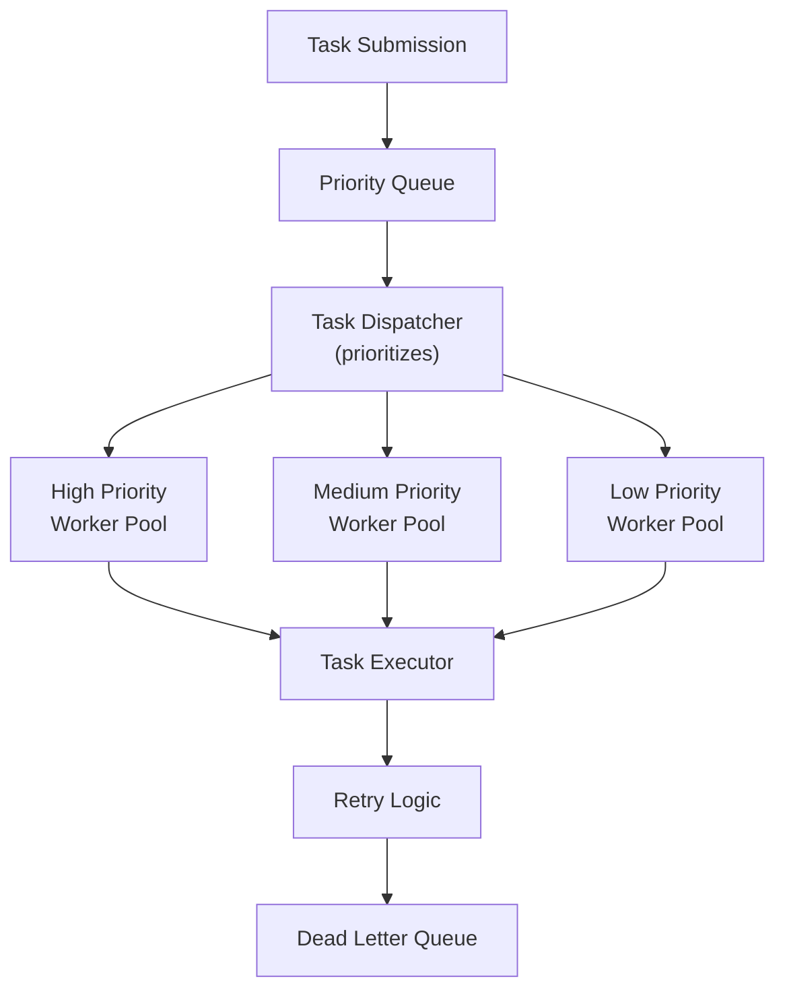

# Async Processing

## 0️⃣ Prerequisites

- Understanding of threads and concurrency basics (threads, executors)
- Knowledge of CompletableFuture or Promises (basic familiarity)
- Understanding of database connection pooling (covered in topic 13)
- Basic familiarity with Spring Boot (@Async annotation)

**Quick refresher**: Threads allow multiple operations to execute concurrently. An Executor manages a pool of threads to execute tasks. Database connection pooling reuses connections to avoid creation overhead.

## 1️⃣ What problem does this exist to solve?

### The Pain Point

Synchronous, blocking operations create several problems:

1. **Thread blocking**: A thread waiting for I/O (database, HTTP call) is idle, wasting resources
2. **Poor scalability**: With limited threads, system can't handle more concurrent requests
3. **Slow user experience**: Sequential operations make users wait unnecessarily
4. **Resource waste**: CPU sits idle while waiting for network or disk I/O
5. **Cascading failures**: One slow operation blocks others, causing timeouts

### What Systems Look Like Without Async Processing

Without async processing:

- **Thread pool exhausted**: All 100 threads blocked waiting for database, new requests rejected
- **Slow API responses**: Must wait for 3 sequential database calls (300ms each = 900ms total)
- **Poor resource utilization**: CPU at 10% while threads wait for I/O
- **Timeout cascades**: One slow operation causes others to timeout waiting
- **Limited concurrency**: Can only handle as many requests as available threads

### Real Examples

**Example 1**: User profile page needs data from 5 services (user service, posts service, comments service, etc.). Synchronous calls take 2.5 seconds total (500ms each). With async, all calls happen in parallel, total time: 500ms.

**Example 2**: Email sending during user registration. Synchronous email send blocks response for 2 seconds. With async, registration completes in 50ms, email sent in background.

**Example 3**: Analytics event processing. Each API request writes events synchronously, slowing responses. With async, events queued and processed in background, API responds immediately.

## 2️⃣ Intuition and Mental Model

**Think of ordering food at a restaurant:**

**Synchronous (blocking)**: You order appetizer, wait for it, eat it, then order main course, wait for it, eat it, then order dessert, wait for it, eat it. Total time: 90 minutes.

**Asynchronous (non-blocking)**: You order all three courses at once. While waiting, you do other things (chat, check phone). The kitchen prepares them in parallel (different chefs). Food arrives when ready, you eat it. Total time: 30 minutes.

**The mental model**: Async processing lets you start multiple operations and continue doing other work while waiting. Instead of blocking and waiting for each operation, you submit tasks and get notified when they complete.

**Another analogy**: Think of async like placing multiple Amazon orders. You don't wait for each package to arrive before ordering the next. You place all orders, they ship independently, and you receive notifications when each arrives. You can do other things in the meantime.

## 3️⃣ How it works internally

### Async Processing Mechanics

#### Step 1: Submit Task
Instead of executing immediately, task is submitted to an executor:

```java
// Synchronous (blocking)
String result = database.query(); // Blocks thread until complete
process(result);

// Asynchronous (non-blocking)
CompletableFuture<String> future = executor.submit(() -> database.query());
// Thread continues immediately, doesn't wait
processOtherThings();
// Later, get result when ready
String result = future.get(); // Blocks only when actually needed
```

#### Step 2: Task Execution
Executor assigns task to a worker thread:

1. **Main thread**: Submits task, continues execution
2. **Worker thread**: Executes task independently
3. **Both threads**: Run concurrently

#### Step 3: Result Handling
When task completes:

1. **Callback**: Registered callback is invoked
2. **Future**: Result stored in Future, can be retrieved
3. **Promise chain**: Next operation in chain executes

### Thread Pool Architecture

**Executor Service** manages thread pool:

```
Main Thread Pool (100 threads)
├── Thread 1: Handling HTTP request
├── Thread 2: Processing async task A
├── Thread 3: Processing async task B
├── Thread 4: Waiting for database (blocked)
└── ...
```

**Async Executor** (separate pool for async tasks):

```
Async Thread Pool (50 threads)
├── Thread 1: Database query for task A
├── Thread 2: Database query for task B
├── Thread 3: HTTP call to external service
└── ...
```

**Key insight**: Main threads don't block waiting for async tasks. They submit work and continue, freeing threads to handle more requests.

### CompletableFuture Lifecycle

**Creation**: Task submitted, returns Future immediately
```java
CompletableFuture<String> future = CompletableFuture.supplyAsync(() -> {
    return expensiveOperation();
});
```

**Execution**: Task runs on separate thread
- Thread from ForkJoinPool (default) or custom executor
- Operation executes independently

**Completion**: Result available or exception thrown
```java
future.whenComplete((result, error) -> {
    if (error != null) {
        handleError(error);
    } else {
        processResult(result);
    }
});
```

**Chaining**: Transform result or chain operations
```java
future
    .thenApply(result -> transform(result))
    .thenCompose(result -> anotherAsyncOperation(result))
    .thenAccept(result -> processFinalResult(result));
```

## 4️⃣ Simulation-first explanation

### Scenario: User Profile Page with Multiple Data Sources

**Start**: 1 application server, needs data from 3 services

**Synchronous approach (blocking)**:

```java
@Service
public class UserProfileService {
    
    public UserProfileDTO getUserProfile(Long userId) {
        // Call 1: Get user (300ms)
        User user = userService.getUser(userId);
        
        // Call 2: Get posts (400ms) - waits for call 1 to finish
        List<Post> posts = postService.getUserPosts(userId);
        
        // Call 3: Get followers (200ms) - waits for call 2 to finish
        List<User> followers = followerService.getFollowers(userId);
        
        // Total time: 300 + 400 + 200 = 900ms
        return new UserProfileDTO(user, posts, followers);
    }
}
```

**Timeline**:
```
Time: 0ms    300ms    700ms    900ms
      |-------|--------|--------|
      User    Posts    Followers Done
```

**Asynchronous approach (non-blocking)**:

```java
@Service
public class UserProfileService {
    
    @Autowired
    private ExecutorService executorService;
    
    public UserProfileDTO getUserProfile(Long userId) {
        // Start all calls in parallel (non-blocking)
        CompletableFuture<User> userFuture = 
            CompletableFuture.supplyAsync(
                () -> userService.getUser(userId), 
                executorService);
        
        CompletableFuture<List<Post>> postsFuture = 
            CompletableFuture.supplyAsync(
                () -> postService.getUserPosts(userId), 
                executorService);
        
        CompletableFuture<List<User>> followersFuture = 
            CompletableFuture.supplyAsync(
                () -> followerService.getFollowers(userId), 
                executorService);
        
        // Wait for all to complete (blocks only when all are done)
        CompletableFuture.allOf(userFuture, postsFuture, followersFuture).join();
        
        // Get results (already completed, instant)
        User user = userFuture.get();
        List<Post> posts = postsFuture.get();
        List<User> followers = followersFuture.get();
        
        // Total time: max(300, 400, 200) = 400ms
        return new UserProfileDTO(user, posts, followers);
    }
}
```

**Timeline**:
```
Time: 0ms             400ms
      |----------------|
      User ────────────┐
      Posts ───────────┤
      Followers ───────┘
      All done
```

**Performance improvement**: 900ms → 400ms (2.25x faster)

### Scenario: Email Sending During Registration

**Synchronous (blocks response)**:

```java
@PostMapping("/register")
public ResponseEntity<User> register(@RequestBody RegisterRequest request) {
    // Create user (50ms)
    User user = userService.createUser(request);
    
    // Send welcome email (2000ms) - BLOCKS response
    emailService.sendWelcomeEmail(user.getEmail());
    
    // Response sent after 2050ms
    return ResponseEntity.ok(user);
}
```

**Asynchronous (non-blocking)**:

```java
@PostMapping("/register")
public ResponseEntity<User> register(@RequestBody RegisterRequest request) {
    // Create user (50ms)
    User user = userService.createUser(request);
    
    // Send email asynchronously (doesn't block)
    CompletableFuture.runAsync(() -> 
        emailService.sendWelcomeEmail(user.getEmail())
    );
    
    // Response sent immediately after 50ms
    return ResponseEntity.ok(user);
}
```

**Performance improvement**: 2050ms → 50ms (41x faster response time)

### Scenario: Parallel Database Queries

**Fetching data for dashboard**:

```java
// Synchronous: Sequential queries
public DashboardData getDashboard() {
    Stats stats = db.query("SELECT ... FROM stats"); // 200ms
    List<Event> events = db.query("SELECT ... FROM events"); // 300ms
    List<User> users = db.query("SELECT ... FROM users"); // 250ms
    // Total: 750ms
}

// Asynchronous: Parallel queries
public DashboardData getDashboard() {
    CompletableFuture<Stats> statsFuture = 
        CompletableFuture.supplyAsync(() -> db.query("SELECT ... FROM stats"));
    CompletableFuture<List<Event>> eventsFuture = 
        CompletableFuture.supplyAsync(() -> db.query("SELECT ... FROM events"));
    CompletableFuture<List<User>> usersFuture = 
        CompletableFuture.supplyAsync(() -> db.query("SELECT ... FROM users"));
    
    CompletableFuture.allOf(statsFuture, eventsFuture, usersFuture).join();
    
    // Total: max(200, 300, 250) = 300ms
}
```

## 5️⃣ How engineers actually use this in production

### Real-World Practices

#### 1. Microservices Parallel Calls

**Netflix's API Gateway**: Aggregates data from multiple microservices:
- User service, recommendation service, playback service called in parallel
- Response time reduced from 2 seconds to 500ms
- Uses async HTTP client (WebClient in Spring, async-http-client)

#### 2. Event-Driven Processing

**Uber's event processing**: Events processed asynchronously:
- User action triggers event
- Event queued asynchronously
- API responds immediately
- Background workers process events

#### 3. Email and Notification Sending

**Amazon's notification system**: All notifications sent asynchronously:
- Order confirmation emails
- Shipping notifications
- Marketing emails
- All queued and sent in background

#### 4. Caching with Async Refresh

**Facebook's cache warming**: Cache refreshed asynchronously:
- Cache hit returns immediately
- Cache miss triggers async refresh
- Stale data returned while refresh happens
- Next request gets fresh data

### Production Workflow

**Step 1: Identify Blocking Operations**
- Database queries that don't depend on each other
- External API calls
- File I/O operations
- Email/notification sending

**Step 2: Convert to Async**
- Use CompletableFuture or @Async
- Configure appropriate thread pools
- Handle errors appropriately

**Step 3: Test and Monitor**
- Verify performance improvements
- Monitor thread pool usage
- Watch for resource exhaustion
- Track async operation failures

## 6️⃣ How to implement or apply it

### Java/Spring Boot Implementation

#### Example 1: Basic CompletableFuture

**Simple async operation**:
```java
@Service
public class AsyncService {
    
    @Autowired
    private ExecutorService executorService;
    
    public CompletableFuture<String> fetchDataAsync() {
        return CompletableFuture.supplyAsync(() -> {
            // Simulate long-running operation
            try {
                Thread.sleep(1000);
            } catch (InterruptedException e) {
                Thread.currentThread().interrupt();
            }
            return "Data loaded";
        }, executorService);
    }
    
    public void useAsyncData() {
        CompletableFuture<String> future = fetchDataAsync();
        
        // Do other work while waiting
        doOtherWork();
        
        // Get result when needed (blocks if not ready)
        try {
            String result = future.get(); // or future.get(5, TimeUnit.SECONDS) with timeout
            processResult(result);
        } catch (Exception e) {
            handleError(e);
        }
    }
}
```

#### Example 2: Spring @Async

**Configuration**:
```java
@Configuration
@EnableAsync
public class AsyncConfig implements AsyncConfigurer {
    
    @Override
    @Bean(name = "taskExecutor")
    public Executor getAsyncExecutor() {
        ThreadPoolTaskExecutor executor = new ThreadPoolTaskExecutor();
        executor.setCorePoolSize(10);
        executor.setMaxPoolSize(50);
        executor.setQueueCapacity(100);
        executor.setThreadNamePrefix("async-");
        executor.initialize();
        return executor;
    }
    
    @Override
    public AsyncUncaughtExceptionHandler getAsyncUncaughtExceptionHandler() {
        return new CustomAsyncExceptionHandler();
    }
}
```

**Service with @Async**:
```java
@Service
public class EmailService {
    
    @Async("taskExecutor")
    public CompletableFuture<Void> sendEmailAsync(String to, String subject, String body) {
        try {
            // Simulate email sending
            Thread.sleep(2000);
            sendEmail(to, subject, body);
            return CompletableFuture.completedFuture(null);
        } catch (Exception e) {
            return CompletableFuture.failedFuture(e);
        }
    }
    
    @Async
    public void sendEmailFireAndForget(String to, String subject, String body) {
        // Fire-and-forget: no return value, errors logged but not propagated
        try {
            sendEmail(to, subject, body);
        } catch (Exception e) {
            log.error("Failed to send email", e);
        }
    }
}
```

**Using @Async service**:
```java
@Service
public class UserService {
    
    @Autowired
    private EmailService emailService;
    
    public User registerUser(RegisterRequest request) {
        User user = createUser(request);
        
        // Send email asynchronously (doesn't block)
        emailService.sendEmailFireAndForget(
            user.getEmail(),
            "Welcome!",
            "Thanks for registering"
        );
        
        return user; // Returns immediately
    }
}
```

#### Example 3: Parallel Service Calls

**Aggregating data from multiple services**:
```java
@Service
public class DashboardService {
    
    @Autowired
    private UserService userService;
    
    @Autowired
    private PostService postService;
    
    @Autowired
    private AnalyticsService analyticsService;
    
    @Autowired
    private ExecutorService executorService;
    
    public DashboardDTO getDashboard(Long userId) {
        // Start all calls in parallel
        CompletableFuture<User> userFuture = CompletableFuture.supplyAsync(
            () -> userService.getUser(userId), executorService);
        
        CompletableFuture<List<Post>> postsFuture = CompletableFuture.supplyAsync(
            () -> postService.getUserPosts(userId), executorService);
        
        CompletableFuture<Analytics> analyticsFuture = CompletableFuture.supplyAsync(
            () -> analyticsService.getUserAnalytics(userId), executorService);
        
        // Wait for all to complete
        CompletableFuture.allOf(userFuture, postsFuture, analyticsFuture).join();
        
        try {
            return DashboardDTO.builder()
                .user(userFuture.get())
                .posts(postsFuture.get())
                .analytics(analyticsFuture.get())
                .build();
        } catch (Exception e) {
            throw new RuntimeException("Failed to load dashboard", e);
        }
    }
}
```

#### Example 4: CompletableFuture Chaining

**Chaining async operations**:
```java
@Service
public class DataProcessingService {
    
    public CompletableFuture<ProcessedData> processDataAsync(String input) {
        return CompletableFuture
            .supplyAsync(() -> fetchData(input))        // Step 1: Fetch
            .thenApply(data -> transformData(data))     // Step 2: Transform
            .thenCompose(data -> validateDataAsync(data)) // Step 3: Async validate
            .thenApply(data -> enrichData(data))        // Step 4: Enrich
            .exceptionally(ex -> {
                log.error("Processing failed", ex);
                return getDefaultData(); // Fallback
            });
    }
    
    private CompletableFuture<Data> validateDataAsync(Data data) {
        return CompletableFuture.supplyAsync(() -> {
            validate(data);
            return data;
        });
    }
}
```

#### Example 5: Combining Multiple Futures

**Wait for all or any**:
```java
@Service
public class AggregationService {
    
    public CompletableFuture<Result> aggregateResults(List<String> sources) {
        List<CompletableFuture<SourceData>> futures = sources.stream()
            .map(source -> fetchDataAsync(source))
            .collect(Collectors.toList());
        
        // Wait for all to complete
        CompletableFuture<List<SourceData>> allResults = 
            CompletableFuture.allOf(futures.toArray(new CompletableFuture[0]))
                .thenApply(v -> futures.stream()
                    .map(CompletableFuture::join)
                    .collect(Collectors.toList()));
        
        return allResults.thenApply(this::combineResults);
    }
    
    public CompletableFuture<Result> getFirstResult(List<String> sources) {
        List<CompletableFuture<SourceData>> futures = sources.stream()
            .map(source -> fetchDataAsync(source))
            .collect(Collectors.toList());
        
        // Return first to complete
        CompletableFuture<SourceData> firstResult = 
            CompletableFuture.anyOf(futures.toArray(new CompletableFuture[0]))
                .thenApply(SourceData.class::cast);
        
        return firstResult.thenApply(this::processResult);
    }
}
```

#### Example 6: Async with Timeout

**Handling timeouts**:
```java
@Service
public class ExternalServiceClient {
    
    public CompletableFuture<Response> callExternalServiceAsync() {
        CompletableFuture<Response> future = CompletableFuture.supplyAsync(() -> {
            return externalService.call(); // Might be slow
        });
        
        // Add timeout
        return future.orTimeout(5, TimeUnit.SECONDS)
            .exceptionally(ex -> {
                if (ex instanceof TimeoutException) {
                    log.warn("External service call timed out");
                    return getDefaultResponse();
                }
                throw new RuntimeException(ex);
            });
    }
}
```

#### Example 7: Async Error Handling

**Comprehensive error handling**:
```java
@Service
public class RobustAsyncService {
    
    public CompletableFuture<Result> processWithErrorHandling(Input input) {
        return CompletableFuture
            .supplyAsync(() -> step1(input))
            .thenApply(this::step2)
            .thenCompose(this::step3Async)
            .handle((result, error) -> {
                if (error != null) {
                    log.error("Processing failed", error);
                    // Retry logic, fallback, or rethrow
                    return retryOrFallback(input, error);
                }
                return result;
            })
            .whenComplete((result, error) -> {
                if (error == null) {
                    log.info("Processing completed successfully");
                }
            });
    }
}
```

## 7️⃣ Tradeoffs, pitfalls, and common mistakes

### Tradeoffs

#### 1. Complexity vs Performance
- **Async**: Better performance, more complex code
- **Sync**: Simpler code, worse performance
- **Decision**: Use async when performance gain justifies complexity

#### 2. Error Handling Complexity
- **Sync**: Errors propagate naturally with try-catch
- **Async**: Errors in callbacks, harder to handle
- **Solution**: Use CompletableFuture exception handling, proper logging

#### 3. Debugging Difficulty
- **Sync**: Stack traces are straightforward
- **Async**: Stack traces across threads, harder to trace
- **Solution**: Use proper logging, correlation IDs, async debugging tools

### Common Pitfalls

#### Pitfall 1: Blocking in Async Context
**Problem**: Blocking calls defeat the purpose of async
```java
// Bad: Blocking in async method
@Async
public CompletableFuture<String> fetchData() {
    String result = blockingHttpClient.get(url); // Blocks thread!
    return CompletableFuture.completedFuture(result);
}
```

**Solution**: Use non-blocking client or run in separate executor
```java
// Good: Non-blocking HTTP client
@Async
public CompletableFuture<String> fetchData() {
    return webClient.get()
        .uri(url)
        .retrieve()
        .bodyToMono(String.class)
        .toFuture();
}
```

#### Pitfall 2: Not Configuring Thread Pool
**Problem**: Using default thread pool, exhausting resources
```java
// Bad: Uses ForkJoinPool.commonPool() (limited threads)
CompletableFuture.supplyAsync(() -> expensiveOperation());
```

**Solution**: Configure dedicated thread pool
```java
// Good: Custom executor with proper sizing
@Autowired
private ExecutorService customExecutor;

CompletableFuture.supplyAsync(() -> expensiveOperation(), customExecutor);
```

#### Pitfall 3: Fire-and-Forget Error Handling
**Problem**: Errors in fire-and-forget operations are lost
```java
// Bad: Errors silently ignored
@Async
public void sendEmail(String to) {
    emailService.send(to); // If this fails, no one knows
}
```

**Solution**: Always handle errors
```java
// Good: Error handling
@Async
public void sendEmail(String to) {
    try {
        emailService.send(to);
    } catch (Exception e) {
        log.error("Failed to send email to {}", to, e);
        // Maybe retry, send to dead letter queue, alert, etc.
    }
}
```

#### Pitfall 4: Shared Mutable State
**Problem**: Race conditions in async code
```java
// Bad: Shared mutable state
private int counter = 0;

@Async
public void increment() {
    counter++; // Race condition!
}
```

**Solution**: Use thread-safe data structures or avoid shared state
```java
// Good: Thread-safe
private AtomicInteger counter = new AtomicInteger(0);

@Async
public void increment() {
    counter.incrementAndGet();
}
```

#### Pitfall 5: Forgetting to Wait for Completion
**Problem**: Method returns before async operations complete
```java
// Bad: Returns before email is sent
public User registerUser(RegisterRequest request) {
    User user = createUser(request);
    emailService.sendEmailAsync(user.getEmail()); // Started but not waited
    return user; // Email might not be sent yet
}
```

**Solution**: Wait if completion matters, or use fire-and-forget intentionally
```java
// Good: Fire-and-forget is intentional
public User registerUser(RegisterRequest request) {
    User user = createUser(request);
    emailService.sendEmailFireAndForget(user.getEmail()); // Intentional fire-and-forget
    return user;
}

// Or wait if needed
public User registerUser(RegisterRequest request) {
    User user = createUser(request);
    emailService.sendEmailAsync(user.getEmail()).join(); // Wait for completion
    return user;
}
```

### Performance Gotchas

#### Gotcha 1: Thread Pool Exhaustion
**Problem**: Too many async operations exhaust thread pool
**Solution**: Limit concurrent operations, use bounded queues, monitor pool usage

#### Gotcha 2: Context Switching Overhead
**Problem**: Too much async for small operations adds overhead
**Solution**: Only use async for operations with significant I/O wait time

#### Gotcha 3: Memory Usage
**Problem**: Many pending async operations consume memory
**Solution**: Limit queue sizes, monitor memory usage

## 8️⃣ When NOT to use this

### When Async Isn't Needed

1. **Fast operations**: Operations completing in < 10ms don't benefit from async

2. **Sequential dependencies**: Operations that must run in order don't benefit

3. **Simple code paths**: If sync code is simple and fast enough, keep it simple

4. **CPU-bound operations**: Async doesn't help CPU-bound work (use parallel streams instead)

### Anti-Patterns

1. **Async everywhere**: Not all code needs to be async

2. **Ignoring errors**: Async errors must be handled explicitly

3. **No thread pool limits**: Unlimited async operations can exhaust resources

## 9️⃣ Comparison with Alternatives

### Async Processing vs Synchronous Processing

**Async**: Non-blocking, better resource utilization
- Pros: Handles more concurrent operations, faster response times
- Cons: More complex, harder to debug

**Synchronous**: Blocking, simpler code
- Pros: Simple, easy to understand and debug
- Cons: Wastes threads on I/O wait, limited concurrency

**Best practice**: Use async for I/O-bound operations, sync for CPU-bound or simple operations

### Async Processing vs Message Queues

**Async**: In-process, immediate execution
- Pros: Low latency, simple setup
- Cons: Lost if process crashes, memory limits

**Message Queues**: Persistent, decoupled
- Pros: Durable, can handle large backlogs, survives crashes
- Cons: Higher latency, more infrastructure

**Best practice**: Use async for fast, in-process operations. Use queues for durable, long-running tasks.

### Async Processing vs Reactive Programming

**Async (CompletableFuture)**: Simple async operations
- Pros: Easy to understand, good for simple async
- Cons: Can get complex with many chained operations

**Reactive (Reactor/RxJava)**: Stream-based, backpressure
- Pros: Better for streams, handles backpressure, composable
- Cons: Steeper learning curve, more complex

**Best practice**: Use CompletableFuture for simple async. Use reactive for streams and complex event flows.

## 🔟 Interview follow-up questions WITH answers

### Question 1: What's the difference between @Async and CompletableFuture?

**Answer**:
**@Async**: Spring annotation that makes method execute asynchronously
- Simpler syntax, Spring manages execution
- Returns void or CompletableFuture
- Uses configured executor
- Good for: Simple async methods, fire-and-forget operations

**CompletableFuture**: Java API for async programming
- More control, manual executor management
- Rich API for chaining, combining, error handling
- Works without Spring
- Good for: Complex async flows, combining multiple async operations

**When to use which**:
- Use `@Async` for simple async methods (email sending, logging)
- Use `CompletableFuture` for complex flows, parallel operations, chaining

**Example**:
```java
// @Async: Simple fire-and-forget
@Async
public void sendEmail(String to) { ... }

// CompletableFuture: Complex flow
CompletableFuture.allOf(future1, future2, future3)
    .thenApply(...)
    .thenCompose(...)
```

### Question 2: How do you handle errors in async code?

**Answer**:
**Strategies**:

1. **Exceptionally**: Transform errors
```java
future.exceptionally(ex -> {
    log.error("Operation failed", ex);
    return defaultValue;
});
```

2. **Handle**: Transform both success and error
```java
future.handle((result, error) -> {
    if (error != null) {
        return handleError(error);
    }
    return result;
});
```

3. **WhenComplete**: Side effects on completion
```java
future.whenComplete((result, error) -> {
    if (error != null) {
        alertService.sendAlert(error);
    }
});
```

4. **Try-catch with get()**: Synchronous error handling
```java
try {
    String result = future.get();
} catch (ExecutionException e) {
    handleError(e.getCause());
}
```

**Best practices**:
- Always handle errors in async code
- Log errors with context
- Consider retry logic for transient errors
- Use fallback values when appropriate

### Question 3: How would you implement async processing in a microservices architecture?

**Answer**:
**Approaches**:

1. **Async HTTP calls**: Non-blocking HTTP client
```java
WebClient webClient = WebClient.create();
Mono<Response> response = webClient.get()
    .uri("http://service/api")
    .retrieve()
    .bodyToMono(Response.class);
```

2. **Message queues**: Publish events, process asynchronously
```java
// Producer: Fire-and-forget
rabbitTemplate.convertAndSend("exchange", "routing", event);

// Consumer: Process asynchronously
@RabbitListener(queues = "queue")
public void handleEvent(Event event) {
    processEvent(event);
}
```

3. **Event-driven**: Events trigger async processing
```java
@EventListener
@Async
public void handleUserCreated(UserCreatedEvent event) {
    sendWelcomeEmail(event.getUser());
    createRecommendations(event.getUser());
}
```

**Considerations**:
- Service discovery for async calls
- Circuit breakers for resilience
- Distributed tracing for debugging
- Idempotency for retries

### Question 4: What happens if an async operation never completes?

**Answer**:
**Problems**:
- Thread blocked waiting (if using `get()`)
- Thread pool exhaustion
- Memory leaks (futures held in memory)
- Application hangs or becomes unresponsive

**Solutions**:

1. **Timeouts**: Always use timeouts
```java
future.get(5, TimeUnit.SECONDS);
// or
future.orTimeout(5, TimeUnit.SECONDS);
```

2. **Cancellation**: Cancel long-running operations
```java
CompletableFuture<String> future = ...;
// Later, if needed
future.cancel(true);
```

3. **Monitoring**: Track async operation durations
```java
Timer.Sample sample = Timer.start(registry);
CompletableFuture<String> future = operationAsync();
future.whenComplete((result, error) -> {
    sample.stop(timer);
});
```

4. **Circuit breakers**: Stop calling failing services
```java
if (circuitBreaker.isOpen()) {
    return CompletableFuture.failedFuture(new CircuitBreakerOpenException());
}
```

### Question 5: How do you test async code?

**Answer**:
**Strategies**:

1. **Wait for completion**: Use `get()` or `join()` in tests
```java
@Test
public void testAsyncOperation() {
    CompletableFuture<String> future = service.asyncOperation();
    String result = future.get(); // Wait for completion
    assertEquals("expected", result);
}
```

2. **Mock executor**: Use same-thread executor for testing
```java
ExecutorService testExecutor = Executors.newSingleThreadExecutor();
CompletableFuture<String> future = CompletableFuture.supplyAsync(
    () -> operation(), testExecutor);
```

3. **Awaitility**: Wait for async conditions
```java
await().atMost(5, SECONDS).until(() -> {
    return asyncOperation.isComplete();
});
```

4. **Spring @Async testing**: Use `@SpringBootTest` with async enabled
```java
@SpringBootTest
@EnableAsync
public class AsyncServiceTest {
    @Autowired
    private AsyncService asyncService;
    
    @Test
    public void test() throws Exception {
        CompletableFuture<String> future = asyncService.asyncMethod();
        String result = future.get(5, TimeUnit.SECONDS);
        assertNotNull(result);
    }
}
```

### Question 6 (L5/L6): How would you design an async task processing system that handles failures, retries, and priorities?

**Answer**:
**System components**:

1. **Task Queue**: Priority queue for tasks
   - High priority tasks processed first
   - Different queues for different priorities

2. **Worker Pool**: Thread pool with priority execution
   - Separate pools for different priority levels
   - Dynamic scaling based on load

3. **Retry Logic**: Exponential backoff for failures
   - Configurable retry attempts
   - Dead letter queue for permanent failures

4. **Failure Handling**: Comprehensive error handling
   - Error classification (transient vs permanent)
   - Alerting for repeated failures
   - Manual intervention capabilities

**Architecture**:


<details>
<summary>ASCII diagram (reference)</summary>

```text
Task Submission → Priority Queue
                      ↓
              Task Dispatcher (prioritizes)
                      ↓
         ┌────────────┼────────────┐
         ↓            ↓            ↓
    High Priority  Medium      Low Priority
    Worker Pool    Worker Pool  Worker Pool
         ↓            ↓            ↓
    Task Executor → Retry Logic → Dead Letter Queue
```
</details>

**Implementation considerations**:
- Task metadata (priority, retry count, created time)
- Monitoring and metrics (queue depth, processing time, failure rate)
- Rate limiting per priority level
- Backpressure handling (reject tasks when overloaded)

## 1️⃣1️⃣ One clean mental summary

Async processing allows operations to execute concurrently without blocking threads, dramatically improving system throughput and responsiveness. Instead of waiting for each operation to complete sequentially, async code submits tasks and continues execution, getting results when ready. Key implementations include CompletableFuture for programmatic async operations and Spring's @Async for simple method-level async execution. Critical considerations include proper thread pool configuration, comprehensive error handling (errors don't propagate naturally in async), timeout management to prevent hanging operations, and understanding when async actually helps (I/O-bound operations) vs when it doesn't (CPU-bound work). Always measure performance improvements and monitor thread pool usage to avoid resource exhaustion.

