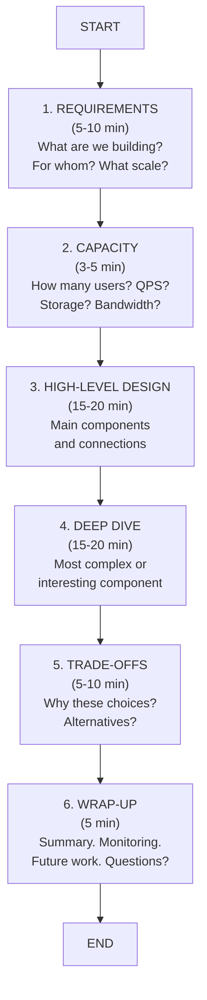
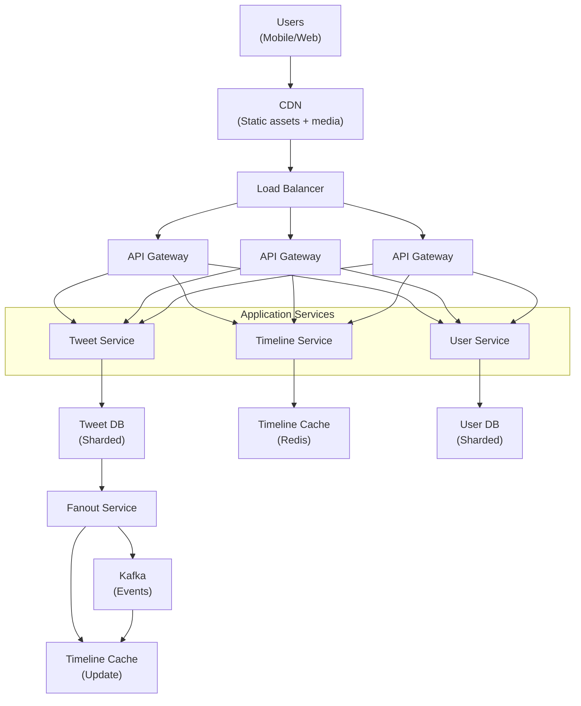
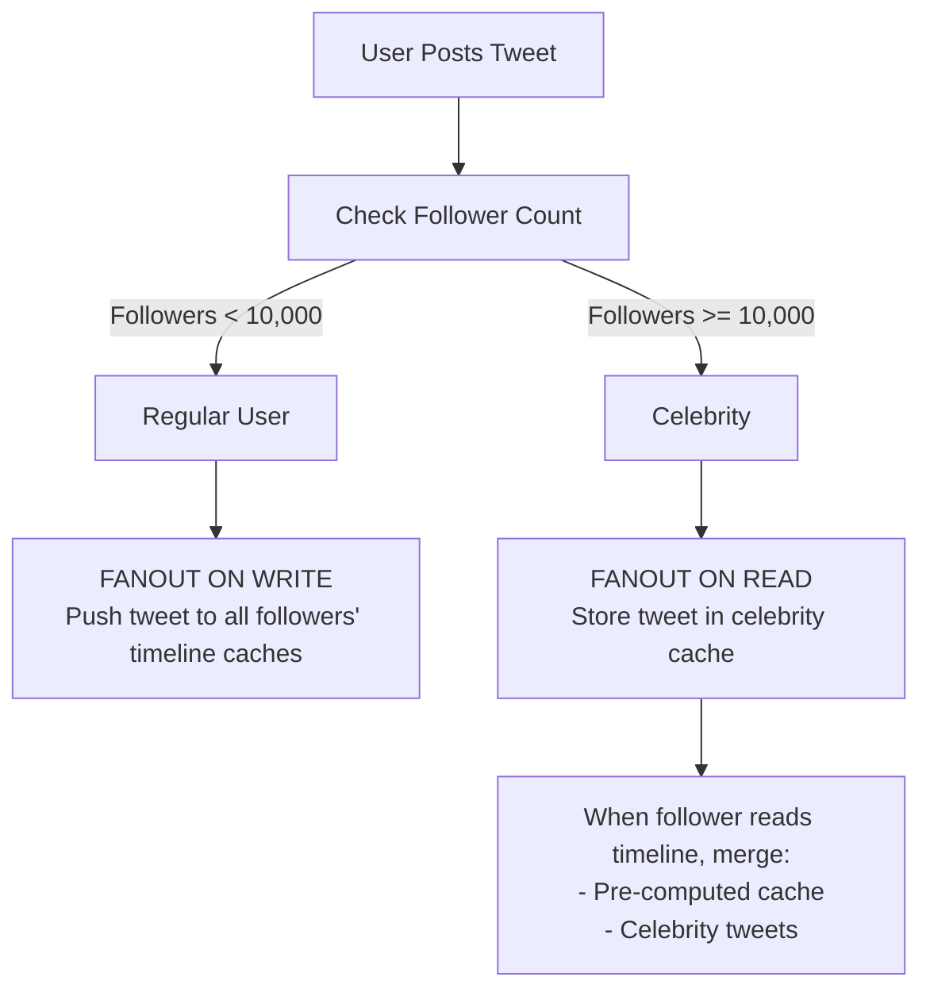
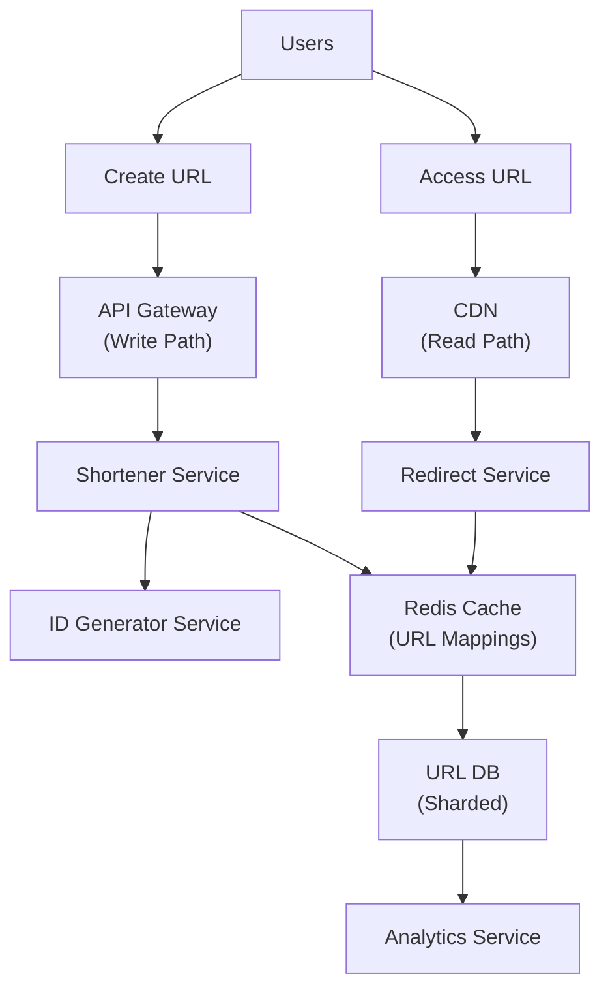
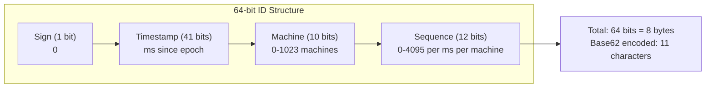
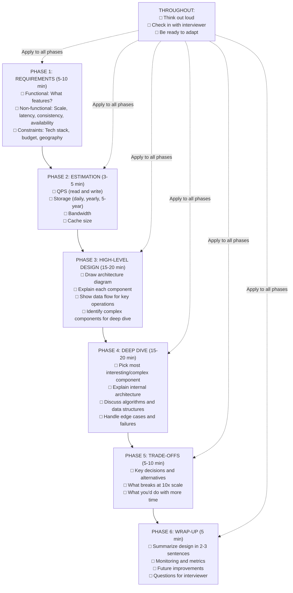

# Problem Approach Framework

## 0️⃣ Prerequisites

Before diving into interview frameworks, you should understand:

- **System Design Basics**: Familiarity with components like databases, caches, load balancers, and message queues (covered in Phases 1-6)
- **High-Level Design Concepts**: Understanding of how to structure a system at a high level (covered in Phase 9)
- **Trade-off Thinking**: The ability to weigh pros and cons of different approaches (covered throughout the course)

Quick refresher: A system design interview is a 45-60 minute conversation where you design a complex software system from scratch. Unlike coding interviews with right/wrong answers, system design interviews evaluate your thinking process, communication, and ability to make justified decisions.

---

## 1️⃣ What Problem Does This Exist to Solve?

### The Specific Pain Point

System design interviews are inherently unstructured. You're given a vague prompt like "Design Twitter" or "Design a URL shortener" and expected to produce a complete, scalable architecture in under an hour.

Without a framework, candidates commonly:

1. **Freeze up**: The open-ended nature causes analysis paralysis
2. **Ramble**: Jump between topics without clear direction
3. **Miss critical components**: Forget to discuss scaling, failure handling, or trade-offs
4. **Run out of time**: Spend 30 minutes on database schema and never discuss caching
5. **Fail to demonstrate seniority**: Talk about implementation details instead of architectural decisions

### What Happens Without a Framework

Imagine walking into an interview for "Design Instagram":

**Without a framework:**
- You immediately start drawing boxes for "User Service" and "Photo Service"
- The interviewer asks "What's the expected scale?" and you realize you never asked
- You spend 20 minutes explaining how to store photos in S3
- With 10 minutes left, you haven't discussed feed generation, caching, or CDN
- The interviewer asks about trade-offs and you say "I don't know, it depends"
- Result: No hire. You demonstrated coding knowledge, not system design thinking.

**With a framework:**
- You spend 5 minutes clarifying requirements and constraints
- You do quick capacity estimation to anchor the design
- You present a high-level architecture covering all major components
- You deep dive into the most interesting/complex component (feed generation)
- You explicitly discuss trade-offs and alternatives
- Result: Strong hire. You demonstrated structured thinking and senior-level judgment.

### Real Examples of the Problem

**Example 1: The Over-Engineer**
A candidate designing a URL shortener spent 35 minutes explaining a distributed ID generation system using Snowflake IDs, Zookeeper coordination, and a custom base62 encoding library. They never discussed the actual redirect flow, caching strategy, or analytics requirements. The interviewer had to interrupt multiple times. Result: No hire for L5, might consider for L4.

**Example 2: The Under-Communicator**
A candidate designing a chat system drew a perfect architecture diagram in the first 10 minutes, then sat silently waiting for questions. When asked "Why did you choose WebSockets?", they said "Because it's real-time." No discussion of alternatives (long polling, SSE), trade-offs (connection limits, mobile battery), or failure handling. Result: No hire. Technical knowledge was there, but couldn't demonstrate thinking process.

---

## 2️⃣ Intuition and Mental Model

### The Restaurant Analogy

Think of a system design interview like opening a restaurant. The interviewer is an investor asking "How would you run this restaurant?"

A bad pitch: "We'll have tables, chairs, a kitchen, and we'll cook food."

A good pitch follows this structure:

1. **Clarify the concept** (5-10 min): "What kind of restaurant? Fine dining or fast casual? What cuisine? What's our target customer? What's our budget? How many covers per night?"

2. **High-level layout** (15-20 min): "Here's the floor plan. Entrance leads to host stand, then dining room. Kitchen is in back with separate prep and cooking stations. Bar area here for waiting customers. Restrooms by the exit."

3. **Deep dive on critical systems** (15-20 min): "Let me explain the kitchen workflow. Orders come in through the POS, print at the appropriate station, expeditor coordinates timing, runners deliver to tables. Here's how we handle a 200-cover Friday night without tickets backing up..."

4. **Trade-offs and alternatives** (5-10 min): "We chose gas stoves over induction because our chefs are trained on gas and the upfront cost is lower, but we lose some energy efficiency. We're using a traditional brigade system instead of a flat hierarchy because..."

5. **Wrap-up** (5 min): "Any questions about the concept? Here's how we'd measure success: table turnover rate, food cost percentage, customer satisfaction scores."

### The Framework as a Map



<details>
<summary>ASCII diagram (reference)</summary>

```text
┌─────────────────────────────────────────────────────────────────────┐
│                    SYSTEM DESIGN INTERVIEW MAP                       │
├─────────────────────────────────────────────────────────────────────┤
│                                                                      │
│  START                                                               │
│    │                                                                 │
│    ▼                                                                 │
│  ┌──────────────────────┐                                           │
│  │  1. REQUIREMENTS     │  "What are we building? For whom?         │
│  │     (5-10 min)       │   What scale? What constraints?"          │
│  └──────────┬───────────┘                                           │
│             │                                                        │
│             ▼                                                        │
│  ┌──────────────────────┐                                           │
│  │  2. CAPACITY         │  "How many users? QPS? Storage?           │
│  │     (3-5 min)        │   Bandwidth? This anchors our design."    │
│  └──────────┬───────────┘                                           │
│             │                                                        │
│             ▼                                                        │
│  ┌──────────────────────┐                                           │
│  │  3. HIGH-LEVEL       │  "Here are the main components           │
│  │     DESIGN           │   and how they connect."                  │
│  │     (15-20 min)      │                                           │
│  └──────────┬───────────┘                                           │
│             │                                                        │
│             ▼                                                        │
│  ┌──────────────────────┐                                           │
│  │  4. DEEP DIVE        │  "Let's zoom into the most complex        │
│  │     (15-20 min)      │   or interesting component."              │
│  └──────────┬───────────┘                                           │
│             │                                                        │
│             ▼                                                        │
│  ┌──────────────────────┐                                           │
│  │  5. TRADE-OFFS       │  "Here's why I made these choices.        │
│  │     (5-10 min)       │   Here are alternatives."                 │
│  └──────────┬───────────┘                                           │
│             │                                                        │
│             ▼                                                        │
│  ┌──────────────────────┐                                           │
│  │  6. WRAP-UP          │  "Summary. Monitoring. Future work.       │
│  │     (5 min)          │   Questions for you?"                     │
│  └──────────────────────┘                                           │
│                                                                      │
│  END                                                                 │
│                                                                      │
└─────────────────────────────────────────────────────────────────────┘
```
</details>

This map ensures you never get lost. At any point, you know where you are and where you're going next.

---

## 3️⃣ How It Works Internally

Let's break down each phase in detail.

### Phase 1: Requirements Clarification (5-10 minutes)

**Purpose**: Scope the problem, avoid wasted effort, show senior thinking.

**What to clarify**:

1. **Functional Requirements**: What features must the system support?
   - Core features (must-have for MVP)
   - Extended features (nice-to-have)
   - Out of scope (explicitly excluded)

2. **Non-Functional Requirements**: What quality attributes matter?
   - Scale (users, requests, data volume)
   - Latency (p50, p99 targets)
   - Availability (99.9%? 99.99%?)
   - Consistency (strong vs eventual)
   - Durability (can we lose data?)

3. **Constraints and Assumptions**:
   - Geographic distribution
   - Budget/cost considerations
   - Existing infrastructure
   - Team size and expertise

**Template questions to ask**:

```
FUNCTIONAL:
- "What are the core features we must support?"
- "Who are the users? Internal or external?"
- "What are the most important user flows?"
- "Are there any features explicitly out of scope?"

NON-FUNCTIONAL:
- "What's the expected scale? Users? Requests per second?"
- "What latency is acceptable? p99 target?"
- "What's the availability requirement?"
- "Is strong consistency required, or is eventual consistency acceptable?"
- "How important is data durability?"

CONSTRAINTS:
- "Is this a greenfield project or integrating with existing systems?"
- "Any specific technology constraints?"
- "Global users or single region?"
- "Any cost constraints we should consider?"
```

**Example: Designing Twitter**

Candidate: "Before I start, I'd like to clarify a few things. For functional requirements, are we focusing on the core tweeting and feed experience, or also including DMs, notifications, and search?"

Interviewer: "Let's focus on posting tweets and the home timeline."

Candidate: "Got it. For scale, are we designing for Twitter's actual scale, around 500 million tweets per day and 200 million daily active users?"

Interviewer: "Yes, let's design for that scale."

Candidate: "For the timeline, is eventual consistency acceptable? Meaning if I tweet, it's okay if my followers see it after a few seconds delay?"

Interviewer: "Yes, a few seconds delay is fine."

Candidate: "Last question, should we optimize for read-heavy or write-heavy? I assume timelines are read much more often than tweets are posted."

Interviewer: "Correct, reads are about 100x more frequent than writes."

Now the candidate has clear scope and can make informed decisions.

### Phase 2: Capacity Estimation (3-5 minutes)

**Purpose**: Anchor the design in reality, demonstrate quantitative thinking.

**What to estimate**:

1. **Traffic**: Requests per second (QPS)
2. **Storage**: Total data to store
3. **Bandwidth**: Data transfer rates
4. **Memory**: Cache sizing

**Quick math shortcuts**:

```
USEFUL NUMBERS TO MEMORIZE:
- 1 day = 86,400 seconds ≈ 100,000 seconds (for quick math)
- 1 month ≈ 2.5 million seconds
- 1 year ≈ 30 million seconds

STORAGE:
- 1 KB = 1,000 bytes (for estimation, use powers of 10)
- 1 MB = 1,000 KB
- 1 GB = 1,000 MB
- 1 TB = 1,000 GB

TYPICAL SIZES:
- Tweet/short text: ~500 bytes
- User profile: ~1 KB
- Image thumbnail: ~50 KB
- Full image: ~500 KB
- Video (1 min): ~50 MB
```

**Example: Twitter capacity estimation**

```
GIVEN:
- 200 million DAU
- 500 million tweets/day
- Average user reads 100 tweets/day

TRAFFIC:
- Write QPS: 500M tweets / 100K seconds = 5,000 QPS
- Peak write QPS: 5,000 × 3 = 15,000 QPS
- Read QPS: 200M users × 100 tweets / 100K seconds = 200,000 QPS
- Peak read QPS: 200,000 × 3 = 600,000 QPS

STORAGE (5 years):
- Tweet size: 500 bytes (text + metadata)
- Daily: 500M × 500 bytes = 250 GB/day
- Yearly: 250 GB × 365 = ~90 TB/year
- 5 years: ~450 TB (just tweets, not media)

BANDWIDTH:
- Write: 5,000 QPS × 500 bytes = 2.5 MB/s
- Read: 200,000 QPS × 500 bytes = 100 MB/s = 800 Mbps
```

This tells us:
- We need to handle 600K+ read QPS (need heavy caching, CDN)
- Storage is manageable (hundreds of TB, not PB)
- Read-heavy system (100:1 read/write ratio)

### Phase 3: High-Level Design (15-20 minutes)

**Purpose**: Show the big picture, demonstrate breadth of knowledge.

**What to include**:

1. **Client layer**: How users interact (web, mobile, API)
2. **Edge layer**: CDN, load balancers, API gateway
3. **Application layer**: Services and their responsibilities
4. **Data layer**: Databases, caches, message queues
5. **Data flow**: How a request moves through the system

**Structure your explanation**:

1. Start with a simple diagram
2. Explain each component's purpose
3. Show the data flow for key operations
4. Identify the most complex/interesting parts

**Example: Twitter high-level design**



<details>
<summary>ASCII diagram (reference)</summary>

```text
┌─────────────────────────────────────────────────────────────────────┐
│                         TWITTER ARCHITECTURE                         │
└─────────────────────────────────────────────────────────────────────┘

                              ┌─────────┐
                              │  Users  │
                              │(Mobile/ │
                              │  Web)   │
                              └────┬────┘
                                   │
                                   ▼
                            ┌──────────────┐
                            │     CDN      │
                            │(Static assets│
                            │   + media)   │
                            └──────┬───────┘
                                   │
                                   ▼
                         ┌─────────────────┐
                         │  Load Balancer  │
                         └────────┬────────┘
                                  │
                    ┌─────────────┼─────────────┐
                    │             │             │
                    ▼             ▼             ▼
             ┌──────────┐  ┌──────────┐  ┌──────────┐
             │   API    │  │   API    │  │   API    │
             │ Gateway  │  │ Gateway  │  │ Gateway  │
             └────┬─────┘  └────┬─────┘  └────┬─────┘
                  │             │             │
                  └─────────────┼─────────────┘
                                │
          ┌─────────────────────┼─────────────────────┐
          │                     │                     │
          ▼                     ▼                     ▼
   ┌─────────────┐      ┌─────────────┐      ┌─────────────┐
   │   Tweet     │      │  Timeline   │      │    User     │
   │  Service    │      │  Service    │      │  Service    │
   └──────┬──────┘      └──────┬──────┘      └──────┬──────┘
          │                    │                    │
          │                    │                    │
          ▼                    ▼                    ▼
   ┌─────────────┐      ┌─────────────┐      ┌─────────────┐
   │   Tweet     │      │  Timeline   │      │    User     │
   │    DB       │      │   Cache     │      │    DB       │
   │ (Sharded)   │      │  (Redis)    │      │ (Sharded)   │
   └─────────────┘      └─────────────┘      └─────────────┘
          │
          ▼
   ┌─────────────┐
   │   Fanout    │
   │  Service    │──────────────────────┐
   └─────────────┘                      │
          │                             │
          ▼                             ▼
   ┌─────────────┐              ┌─────────────┐
   │    Kafka    │              │   Timeline  │
   │   (Events)  │              │   Cache     │
   └─────────────┘              │  (Update)   │
                                └─────────────┘
```
</details>

**Explanation flow**:

"Let me walk through the main components:

1. **CDN**: Serves static assets and cached media. Reduces load on our servers.

2. **Load Balancer**: Distributes traffic across API gateways. Handles SSL termination.

3. **API Gateway**: Authentication, rate limiting, request routing. Stateless for horizontal scaling.

4. **Tweet Service**: Handles posting tweets. Writes to sharded Tweet DB, then publishes event to Kafka.

5. **Timeline Service**: Handles reading home timeline. Reads from pre-computed Timeline Cache (Redis).

6. **User Service**: Manages user profiles, follow relationships. Writes to sharded User DB.

7. **Fanout Service**: Consumes tweet events from Kafka. Updates followers' timeline caches.

The key insight is we pre-compute timelines. When you post a tweet, we push it to all your followers' caches. When they open the app, we just read from cache, no computation needed."

### Phase 4: Deep Dive (15-20 minutes)

**Purpose**: Show depth of knowledge, demonstrate senior-level thinking.

**What to deep dive**:

- The most complex component
- The most interesting engineering challenge
- Whatever the interviewer asks about

**How to deep dive**:

1. Explain the internal architecture
2. Discuss data structures and algorithms
3. Walk through edge cases
4. Discuss failure scenarios
5. Explain scaling considerations

**Example: Deep dive on Twitter Fanout**

"Let me deep dive into the Fanout Service, which is the most interesting engineering challenge.

**The Problem**: When a user tweets, we need to update all their followers' timelines. For a celebrity with 50 million followers, that's 50 million cache updates per tweet.

**The Solution**: Hybrid fanout approach.



<details>
<summary>ASCII diagram (reference)</summary>

```text
┌─────────────────────────────────────────────────────────────────────┐
│                      HYBRID FANOUT STRATEGY                          │
└─────────────────────────────────────────────────────────────────────┘

                         User Posts Tweet
                               │
                               ▼
                    ┌──────────────────────┐
                    │  Check Follower Count │
                    └──────────┬───────────┘
                               │
              ┌────────────────┴────────────────┐
              │                                 │
              ▼                                 ▼
     Followers < 10,000              Followers >= 10,000
     (Regular User)                  (Celebrity)
              │                                 │
              ▼                                 ▼
     ┌────────────────┐              ┌────────────────┐
     │ FANOUT ON WRITE│              │ FANOUT ON READ │
     │                │              │                │
     │ Push tweet to  │              │ Store tweet in │
     │ all followers' │              │ celebrity cache│
     │ timeline caches│              │                │
     └────────────────┘              └────────────────┘
                                              │
                                              ▼
                                     When follower reads
                                     timeline, merge:
                                     - Pre-computed cache
                                     - Celebrity tweets
```
</details>

**Why hybrid?**

- Regular users: Fanout on write. 1,000 followers × 1 tweet = 1,000 cache writes. Fast, manageable.
- Celebrities: Fanout on read. 50M followers × 1 tweet = 50M writes. Too slow, would delay tweet visibility.

**Implementation details**:

```java
public class FanoutService {
    
    private static final int CELEBRITY_THRESHOLD = 10_000;
    
    public void processTweet(Tweet tweet) {
        User author = userService.getUser(tweet.getAuthorId());
        List<Long> followerIds = followService.getFollowerIds(author.getId());
        
        if (followerIds.size() < CELEBRITY_THRESHOLD) {
            // Fanout on write for regular users
            fanoutOnWrite(tweet, followerIds);
        } else {
            // Fanout on read for celebrities
            fanoutOnRead(tweet, author);
        }
    }
    
    private void fanoutOnWrite(Tweet tweet, List<Long> followerIds) {
        // Batch updates for efficiency
        List<List<Long>> batches = partition(followerIds, 1000);
        
        for (List<Long> batch : batches) {
            // Async update to timeline cache
            CompletableFuture.runAsync(() -> {
                for (Long followerId : batch) {
                    timelineCache.addToTimeline(followerId, tweet);
                }
            });
        }
    }
    
    private void fanoutOnRead(Tweet tweet, User celebrity) {
        // Just store in celebrity's tweet cache
        celebrityTweetCache.addTweet(celebrity.getId(), tweet);
    }
}
```

**Failure handling**:

- If fanout fails mid-way, we have Kafka for replay
- Idempotent cache updates (tweet ID as key)
- Dead letter queue for persistent failures

**Scaling considerations**:

- Partition fanout workers by follower ID range
- Use Redis cluster for timeline cache
- Celebrity cache is much smaller, can be replicated globally"

### Phase 5: Trade-offs and Alternatives (5-10 minutes)

**Purpose**: Show you understand there's no perfect solution, demonstrate judgment.

**What to discuss**:

1. Key decisions you made and why
2. Alternatives you considered
3. What you'd do differently with more time/resources
4. What breaks at 10x scale

**Example: Twitter trade-offs**

"Let me discuss the key trade-offs in this design:

**Trade-off 1: Fanout on write vs read**

| Aspect | Fanout on Write | Fanout on Read |
|--------|-----------------|----------------|
| Write latency | Higher (update many caches) | Lower (just store tweet) |
| Read latency | Lower (pre-computed) | Higher (compute on demand) |
| Storage | Higher (duplicate data) | Lower (single copy) |
| Best for | Regular users | Celebrities |

We chose hybrid because pure fanout-on-write doesn't scale for celebrities, and pure fanout-on-read makes reads too slow for regular users.

**Trade-off 2: Eventual consistency**

We accepted eventual consistency for timelines. A tweet might take a few seconds to appear in followers' feeds. This allows us to:
- Use async fanout (faster writes)
- Handle failures gracefully (retry later)
- Scale horizontally

Alternative: Strong consistency would require synchronous updates, blocking until all caches are updated. This would make posting a tweet take seconds instead of milliseconds.

**Trade-off 3: Pre-computed vs on-demand timelines**

We pre-compute timelines in Redis. Alternative is to compute on demand by querying all followed users' tweets.

| Pre-computed | On-demand |
|--------------|-----------|
| O(1) read | O(n) read where n = following count |
| High storage | Low storage |
| Stale data possible | Always fresh |
| Complex fanout logic | Simple read logic |

At Twitter's scale (200M DAU reading 100 tweets each), the read optimization is worth the storage cost."

### Phase 6: Wrap-up (5 minutes)

**Purpose**: Leave a strong impression, show completeness.

**What to include**:

1. **Summary**: 2-3 sentences recapping the design
2. **Monitoring**: What metrics would you track?
3. **Future improvements**: What would you add with more time?
4. **Questions**: Show curiosity about the interviewer's experience

**Example: Twitter wrap-up**

"To summarize: We designed a Twitter-scale system handling 600K read QPS using a hybrid fanout approach. Regular user tweets are pushed to follower caches immediately. Celebrity tweets are merged at read time. The system is eventually consistent, prioritizing availability and read performance.

For monitoring, I'd track:
- Timeline read latency (p50, p99)
- Fanout lag (time from tweet to cache update)
- Cache hit rate (should be >99%)
- Kafka consumer lag

Future improvements:
- Ranking algorithm for timeline ordering
- Real-time notifications via WebSocket
- Search indexing for tweets
- Analytics pipeline for engagement metrics

Do you have any questions about the design? I'm also curious, does this match how Twitter actually works, or are there approaches I missed?"

---

## 4️⃣ Simulation: A Complete 45-Minute Interview

Let's walk through a complete interview for "Design a URL Shortener."

### Minutes 0-5: Requirements

**Interviewer**: "Design a URL shortener like bit.ly."

**Candidate**: "Great, let me clarify the requirements.

For functional requirements:
- Users can submit a long URL and get a short URL back
- Users can access the short URL and get redirected to the original
- Should short URLs expire, or are they permanent?
- Can users customize the short URL, or is it always auto-generated?
- Do we need analytics (click counts, referrers)?"

**Interviewer**: "Let's say URLs are permanent, auto-generated only, and yes to basic analytics."

**Candidate**: "For non-functional requirements:
- What's the expected scale? How many URLs shortened per day?
- What's the read/write ratio? I assume more reads than writes.
- What latency is acceptable for redirects?
- What's our availability target?"

**Interviewer**: "Let's say 100 million URLs shortened per day, 10:1 read/write ratio, redirects should be under 100ms, and 99.9% availability."

**Candidate**: "Perfect. So we're designing for 100M writes/day, 1B reads/day, low-latency reads, and high availability. Short URLs are permanent and auto-generated. Basic click analytics included. Let me do some quick capacity estimation."

### Minutes 5-8: Capacity Estimation

**Candidate**: "Let me estimate the numbers:

Traffic:
- Write QPS: 100M / 100K seconds = 1,000 QPS
- Read QPS: 1B / 100K seconds = 10,000 QPS
- Peak (3x): 3,000 write QPS, 30,000 read QPS

Storage (10 years):
- Each URL mapping: ~500 bytes (short URL + long URL + metadata)
- Daily: 100M × 500 bytes = 50 GB/day
- 10 years: 50 GB × 365 × 10 = ~180 TB

This is manageable. We'll need good caching for the 30K read QPS."

### Minutes 8-25: High-Level Design

**Candidate**: "Let me draw the high-level architecture."



<details>
<summary>ASCII diagram (reference)</summary>

```text
┌─────────────────────────────────────────────────────────────────────┐
│                     URL SHORTENER ARCHITECTURE                       │
└─────────────────────────────────────────────────────────────────────┘

                              ┌─────────┐
                              │  Users  │
                              └────┬────┘
                                   │
                         ┌─────────┴─────────┐
                         │                   │
                    Create URL          Access URL
                         │                   │
                         ▼                   ▼
                  ┌──────────────┐    ┌──────────────┐
                  │ API Gateway  │    │     CDN      │
                  │ (Write Path) │    │ (Read Path)  │
                  └──────┬───────┘    └──────┬───────┘
                         │                   │
                         ▼                   ▼
                  ┌──────────────┐    ┌──────────────┐
                  │   Shortener  │    │   Redirect   │
                  │   Service    │    │   Service    │
                  └──────┬───────┘    └──────┬───────┘
                         │                   │
              ┌──────────┴──────────┐        │
              │                     │        │
              ▼                     ▼        ▼
       ┌──────────────┐      ┌──────────────────┐
       │  ID Generator│      │    Redis Cache   │
       │   Service    │      │  (URL Mappings)  │
       └──────────────┘      └────────┬─────────┘
                                      │
                                      ▼
                             ┌──────────────┐
                             │   URL DB     │
                             │  (Sharded)   │
                             └──────────────┘
                                      │
                                      ▼
                             ┌──────────────┐
                             │  Analytics   │
                             │   Service    │
                             └──────────────┘
```
</details>

**Candidate**: "Let me explain each component:

1. **API Gateway**: Handles authentication, rate limiting. Separates read and write traffic.

2. **Shortener Service**: Handles URL creation. Gets unique ID, encodes to short URL, stores mapping.

3. **ID Generator Service**: Generates globally unique IDs. Critical component, I'll deep dive on this.

4. **Redirect Service**: Handles URL access. Looks up mapping, returns 301/302 redirect.

5. **Redis Cache**: Caches hot URL mappings. Most URLs follow power law, few URLs get most traffic.

6. **URL DB**: Persistent storage for all mappings. Sharded by short URL for even distribution.

7. **Analytics Service**: Tracks clicks asynchronously. Doesn't block redirects.

Let me walk through the two main flows:

**Create URL flow**:
1. User submits long URL to API Gateway
2. Shortener Service requests unique ID from ID Generator
3. ID is encoded to base62 (a-z, A-Z, 0-9) to create short URL
4. Mapping stored in URL DB
5. Short URL returned to user

**Access URL flow**:
1. User accesses short.url/abc123
2. CDN checks cache, if hit, redirects immediately
3. If miss, Redirect Service checks Redis cache
4. If miss, queries URL DB
5. Returns 301 redirect to long URL
6. Async: Analytics Service logs the click"

### Minutes 25-40: Deep Dive

**Interviewer**: "Tell me more about the ID generation. How do you ensure uniqueness at scale?"

**Candidate**: "Great question. This is the core challenge. Let me explore three approaches:

**Approach 1: Auto-increment database ID**

```
┌─────────────────┐
│   Single DB     │
│  AUTO_INCREMENT │
│    1, 2, 3...   │
└─────────────────┘
```

Pros: Simple, guaranteed unique
Cons: Single point of failure, doesn't scale horizontally

**Approach 2: UUID**

```java
String id = UUID.randomUUID().toString(); // 128 bits
```

Pros: No coordination needed, scales infinitely
Cons: Too long (36 chars), not URL-friendly, no ordering

**Approach 3: Distributed ID Generator (Snowflake-style)**

This is what I'd recommend. Let me explain:



<details>
<summary>ASCII diagram (reference)</summary>

```text
┌─────────────────────────────────────────────────────────────────────┐
│                    SNOWFLAKE ID STRUCTURE (64 bits)                  │
├─────────────────────────────────────────────────────────────────────┤
│                                                                      │
│  ┌─────────┬──────────────┬────────────┬─────────────────────────┐  │
│  │ Sign(1) │ Timestamp(41)│ Machine(10)│     Sequence(12)        │  │
│  │    0    │   ms since   │  0-1023    │       0-4095            │  │
│  │         │    epoch     │  machines  │    per ms per machine   │  │
│  └─────────┴──────────────┴────────────┴─────────────────────────┘  │
│                                                                      │
│  Total: 64 bits = 8 bytes                                           │
│  Base62 encoded: 11 characters                                      │
│                                                                      │
└─────────────────────────────────────────────────────────────────────┘
```
</details>

**How it works**:

1. **Timestamp (41 bits)**: Milliseconds since custom epoch. Gives us 69 years of IDs.

2. **Machine ID (10 bits)**: 1024 unique machines. Each machine generates IDs independently.

3. **Sequence (12 bits)**: 4096 IDs per millisecond per machine.

**Capacity**: 1024 machines × 4096 IDs/ms = 4 million IDs per millisecond. Far exceeds our 3000 QPS requirement.

**Implementation**:

```java
public class SnowflakeIdGenerator {
    
    private static final long EPOCH = 1609459200000L; // Jan 1, 2021
    private static final int MACHINE_BITS = 10;
    private static final int SEQUENCE_BITS = 12;
    
    private final long machineId;
    private long sequence = 0;
    private long lastTimestamp = -1;
    
    public SnowflakeIdGenerator(long machineId) {
        if (machineId < 0 || machineId >= (1 << MACHINE_BITS)) {
            throw new IllegalArgumentException("Invalid machine ID");
        }
        this.machineId = machineId;
    }
    
    public synchronized long nextId() {
        long timestamp = System.currentTimeMillis();
        
        if (timestamp == lastTimestamp) {
            // Same millisecond, increment sequence
            sequence = (sequence + 1) & ((1 << SEQUENCE_BITS) - 1);
            if (sequence == 0) {
                // Sequence exhausted, wait for next millisecond
                timestamp = waitNextMillis(timestamp);
            }
        } else {
            // New millisecond, reset sequence
            sequence = 0;
        }
        
        lastTimestamp = timestamp;
        
        return ((timestamp - EPOCH) << (MACHINE_BITS + SEQUENCE_BITS))
             | (machineId << SEQUENCE_BITS)
             | sequence;
    }
    
    private long waitNextMillis(long currentTimestamp) {
        long timestamp = System.currentTimeMillis();
        while (timestamp <= currentTimestamp) {
            timestamp = System.currentTimeMillis();
        }
        return timestamp;
    }
}
```

**Base62 encoding**:

```java
public class Base62Encoder {
    
    private static final String ALPHABET = 
        "0123456789ABCDEFGHIJKLMNOPQRSTUVWXYZabcdefghijklmnopqrstuvwxyz";
    
    public static String encode(long id) {
        StringBuilder sb = new StringBuilder();
        while (id > 0) {
            sb.append(ALPHABET.charAt((int)(id % 62)));
            id /= 62;
        }
        return sb.reverse().toString();
    }
    
    public static long decode(String shortUrl) {
        long id = 0;
        for (char c : shortUrl.toCharArray()) {
            id = id * 62 + ALPHABET.indexOf(c);
        }
        return id;
    }
}
```

**Result**: 64-bit ID → 11 character short URL (e.g., `short.url/2a9Bc3dE5fG`)

**Failure handling**:

- If ID Generator fails, we have 1024 machines, others continue
- Clock skew: Reject requests if clock goes backward
- Machine ID assignment: Use Zookeeper or database for coordination"

### Minutes 40-45: Trade-offs and Wrap-up

**Candidate**: "Let me discuss the key trade-offs:

**301 vs 302 redirect**:
- 301 (permanent): Browser caches, reduces our load, but we lose analytics
- 302 (temporary): Browser always hits us, better analytics, higher load
- Recommendation: 302 for analytics, with CDN caching for performance

**Short URL length**:
- 6 chars (62^6 = 56 billion URLs): Enough for 100M/day for 1.5 years
- 7 chars (62^7 = 3.5 trillion URLs): Enough for decades
- Recommendation: Start with 7 for future-proofing

**Cache eviction**:
- LRU works well due to power law distribution
- 20% of URLs get 80% of traffic
- Cache hit rate should be >95%

To summarize: We designed a URL shortener handling 30K read QPS using Snowflake IDs for uniqueness, Redis for caching hot URLs, and sharded storage for persistence. The system is highly available with no single point of failure.

For monitoring, I'd track redirect latency, cache hit rate, and ID generation rate.

Any questions about the design?"

---

## 5️⃣ How Engineers Actually Use This in Production

### Real Interview Experiences

**Google L5 Interview (2023)**:
"I was asked to design Google Docs. I spent the first 7 minutes on requirements, which felt long but was crucial. The interviewer kept asking 'What about X?' and I realized they wanted me to discover collaborative editing, version history, and offline support on my own. The framework saved me because I didn't jump into WebSockets immediately."

**Meta E5 Interview (2023)**:
"Design Facebook Messenger. I followed the framework religiously. During deep dive, the interviewer asked about message ordering guarantees. Because I had done capacity estimation earlier, I could say 'At 10B messages/day, we can't use a single global sequence, so we use per-conversation ordering with vector clocks.' The numbers grounded my answer."

**Amazon L6 Interview (2022)**:
"Design a distributed cache. The interviewer was very quiet, just nodding. I kept checking in: 'Does this make sense? Should I go deeper here?' The framework gave me confidence to keep driving. At the end, they said my structured approach was exactly what they look for in senior candidates."

### Company-Specific Variations

**Google**: Emphasizes scale and distributed systems. Expect questions about consistency, partitioning, and failure handling. They like when you reference Google papers (Spanner, BigTable, MapReduce).

**Meta**: Emphasizes product thinking. Start with user experience, then work backward to architecture. They like when you consider mobile-first and global scale.

**Amazon**: Emphasizes operational excellence. Discuss monitoring, alerting, runbooks, and on-call. They like when you think about what happens at 2 AM when things break.

**Netflix**: Emphasizes resilience and chaos engineering. Discuss failure injection, circuit breakers, and graceful degradation. They like when you assume everything will fail.

**Uber**: Emphasizes real-time systems and location-based services. Discuss geospatial indexing, real-time matching, and surge pricing algorithms.

---

## 6️⃣ Tradeoffs, Pitfalls, and Common Mistakes

### Pitfall 1: Skipping Requirements

**What happens**: You design a beautiful system that solves the wrong problem.

**Example**: Designing a chat system with strong consistency when the interviewer wanted eventual consistency with offline support.

**Fix**: Always spend 5-10 minutes on requirements. It's never wasted time.

### Pitfall 2: No Capacity Estimation

**What happens**: Your design is either over-engineered or under-engineered.

**Example**: Designing a Kafka-based event system for 100 QPS (overkill) or a single-server solution for 1M QPS (won't work).

**Fix**: Always do back-of-envelope math. It takes 3 minutes and grounds your design.

### Pitfall 3: Going Too Deep Too Early

**What happens**: You spend 30 minutes on database schema and never discuss the overall architecture.

**Example**: Explaining B-tree indexing for 15 minutes when the interviewer wanted to see the end-to-end flow.

**Fix**: Breadth first, then depth. Cover all components at a high level before diving deep.

### Pitfall 4: Not Driving the Conversation

**What happens**: You wait for the interviewer to ask questions instead of proactively explaining.

**Example**: Drawing a diagram and then sitting silently.

**Fix**: Think out loud. Explain why you're making each decision. Check in periodically.

### Pitfall 5: Ignoring Trade-offs

**What happens**: You present your design as the only solution without discussing alternatives.

**Example**: "We'll use Kafka" without explaining why not RabbitMQ or Redis Streams.

**Fix**: For every major decision, briefly mention what you considered and why you chose this approach.

### Pitfall 6: Not Handling Failure Scenarios

**What happens**: Your design only works in the happy path.

**Example**: Never discussing what happens when the database goes down or the cache is cold.

**Fix**: For each component, ask yourself "What if this fails?" Discuss graceful degradation.

---

## 7️⃣ When NOT to Use This Framework

### Scenario 1: Coding-Heavy System Design

Some interviews are more about implementation than architecture. If the interviewer says "Let's code this," switch to implementation mode.

**Signs**: They provide a specific interface to implement, they want to see actual code, they're timing your coding.

**Adjust**: Spend less time on high-level design, more on clean code and edge cases.

### Scenario 2: Very Specific Deep Dive

Sometimes the interviewer wants to go deep on one topic immediately.

**Signs**: "Tell me how you'd implement consistent hashing" or "Walk me through the Raft consensus algorithm."

**Adjust**: Skip the framework, go directly to the technical deep dive.

### Scenario 3: Product Design Interview

Some interviews focus on product decisions, not technical architecture.

**Signs**: "How would you design the user experience for X?" or "What features would you prioritize?"

**Adjust**: Focus on user flows, prioritization frameworks, and metrics, not infrastructure.

---

## 8️⃣ Comparison with Alternative Approaches

### Alternative 1: No Framework (Freeform)

**Pros**: Flexible, can adapt to any question
**Cons**: Easy to get lost, miss critical components, run out of time

**When to use**: Only if you have extensive interview experience and can self-regulate.

### Alternative 2: Component-First Approach

Start by listing all components, then connect them.

**Pros**: Ensures you don't miss components
**Cons**: Doesn't establish requirements first, may over-engineer

**When to use**: When you're very familiar with the problem domain.

### Alternative 3: User-Story Driven

Start with user stories, derive architecture from them.

**Pros**: Product-focused, ensures user needs are met
**Cons**: May miss non-functional requirements, less systematic

**When to use**: Product-focused interviews at companies like Meta or Airbnb.

### Recommendation

The framework in this document is the most reliable for general system design interviews. It works across companies and problem types. Master this first, then adapt based on context.

---

## 9️⃣ Interview Follow-up Questions WITH Answers

### Q1: "Why did you start with requirements instead of jumping into the design?"

**Answer**: "Requirements clarification serves three purposes. First, it scopes the problem so I don't waste time on features we don't need. Second, it surfaces constraints that affect architectural decisions, like consistency requirements or latency targets. Third, it demonstrates senior-level thinking. Junior engineers jump to solutions. Senior engineers ensure they're solving the right problem."

### Q2: "How do you decide how much time to spend on each phase?"

**Answer**: "I use a rough 10-20-20-10-5 split for a 45-minute interview: 10 minutes on requirements and estimation, 20 minutes on high-level design, 20 minutes on deep dive, and 5 minutes on wrap-up. But I adjust based on interviewer signals. If they seem eager to deep dive, I'll shorten the high-level section. If they keep asking clarifying questions, I'll extend requirements."

### Q3: "What if you don't know how to design a component?"

**Answer**: "I'd be transparent: 'I'm not deeply familiar with X, but here's how I'd approach it.' Then I'd reason from first principles, discuss what problems it needs to solve, and propose a reasonable approach. Interviewers value problem-solving process over memorized solutions. I might also ask, 'Is this an area you'd like me to focus on, or should I move to components I know better?'"

### Q4: "How do you handle an interviewer who keeps interrupting?"

**Answer**: "Interruptions are usually signals. Either I'm going in the wrong direction, I'm being too verbose, or they want to steer toward their area of expertise. I'd acknowledge the interruption, answer their question concisely, then ask 'Should I continue with my original approach, or would you like me to focus on this area?' This shows I'm collaborative and can adapt."

### Q5: "What's the difference between L4, L5, and L6 expectations?"

**Answer**: 
- **L4 (New Grad)**: Can design a working system with guidance. Knows basic components and trade-offs. Might miss edge cases.
- **L5 (Mid-level)**: Can design end-to-end independently. Considers failure scenarios, scaling, and operational concerns. Drives the conversation.
- **L6 (Senior)**: Proposes multiple solutions with clear trade-offs. Considers organizational impact, cost, and long-term evolution. Could mentor others through the design.

The framework helps at all levels, but depth of discussion and quality of trade-off analysis distinguishes levels.

---

## 🔟 One Clean Mental Summary

A system design interview is a 45-minute conversation where you demonstrate structured thinking, not just technical knowledge. The framework, requirements, estimation, high-level design, deep dive, trade-offs, and wrap-up, ensures you cover all bases while showing senior-level judgment.

The key insight: Interviewers aren't looking for the "right" answer. They're evaluating how you think, communicate, and make decisions under uncertainty. The framework makes your thinking visible and your decisions defensible.

Master this framework, practice it until it's automatic, and you'll walk into any system design interview with confidence. The structure frees your mental energy to focus on the actual problem instead of worrying about what to say next.

---

## Quick Reference Card



<details>
<summary>ASCII diagram (reference)</summary>

```text
┌─────────────────────────────────────────────────────────────────────┐
│                 SYSTEM DESIGN INTERVIEW CHEAT SHEET                  │
├─────────────────────────────────────────────────────────────────────┤
│                                                                      │
│  PHASE 1: REQUIREMENTS (5-10 min)                                   │
│  □ Functional: What features?                                       │
│  □ Non-functional: Scale, latency, consistency, availability        │
│  □ Constraints: Tech stack, budget, geography                       │
│                                                                      │
│  PHASE 2: ESTIMATION (3-5 min)                                      │
│  □ QPS (read and write)                                             │
│  □ Storage (daily, yearly, 5-year)                                  │
│  □ Bandwidth                                                        │
│  □ Cache size                                                       │
│                                                                      │
│  PHASE 3: HIGH-LEVEL DESIGN (15-20 min)                             │
│  □ Draw architecture diagram                                        │
│  □ Explain each component                                           │
│  □ Show data flow for key operations                                │
│  □ Identify complex components for deep dive                        │
│                                                                      │
│  PHASE 4: DEEP DIVE (15-20 min)                                     │
│  □ Pick most interesting/complex component                          │
│  □ Explain internal architecture                                    │
│  □ Discuss algorithms and data structures                           │
│  □ Handle edge cases and failures                                   │
│                                                                      │
│  PHASE 5: TRADE-OFFS (5-10 min)                                     │
│  □ Key decisions and alternatives                                   │
│  □ What breaks at 10x scale                                         │
│  □ What you'd do with more time                                     │
│                                                                      │
│  PHASE 6: WRAP-UP (5 min)                                           │
│  □ Summarize design in 2-3 sentences                                │
│  □ Monitoring and metrics                                           │
│  □ Future improvements                                              │
│  □ Questions for interviewer                                        │
│                                                                      │
│  THROUGHOUT:                                                        │
│  □ Think out loud                                                   │
│  □ Check in with interviewer                                        │
│  □ Be ready to adapt                                                │
│                                                                      │
└─────────────────────────────────────────────────────────────────────┘
```
</details>

