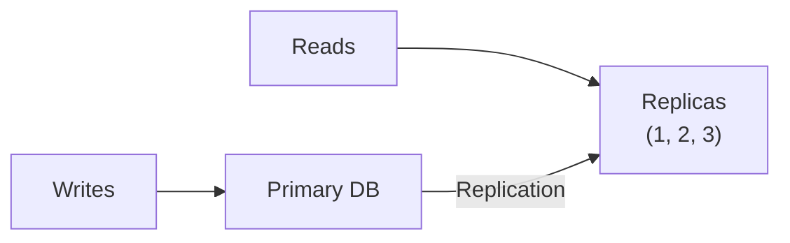
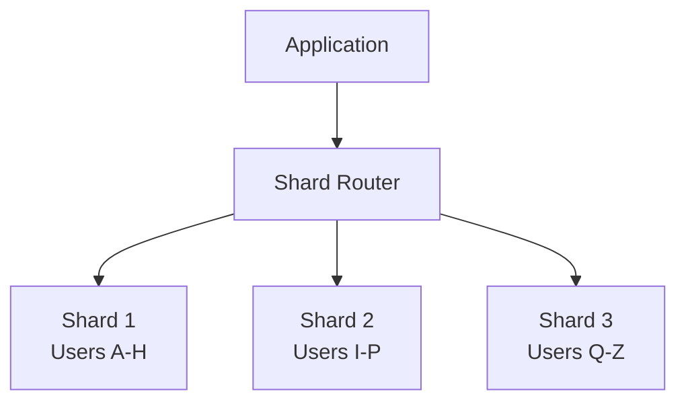
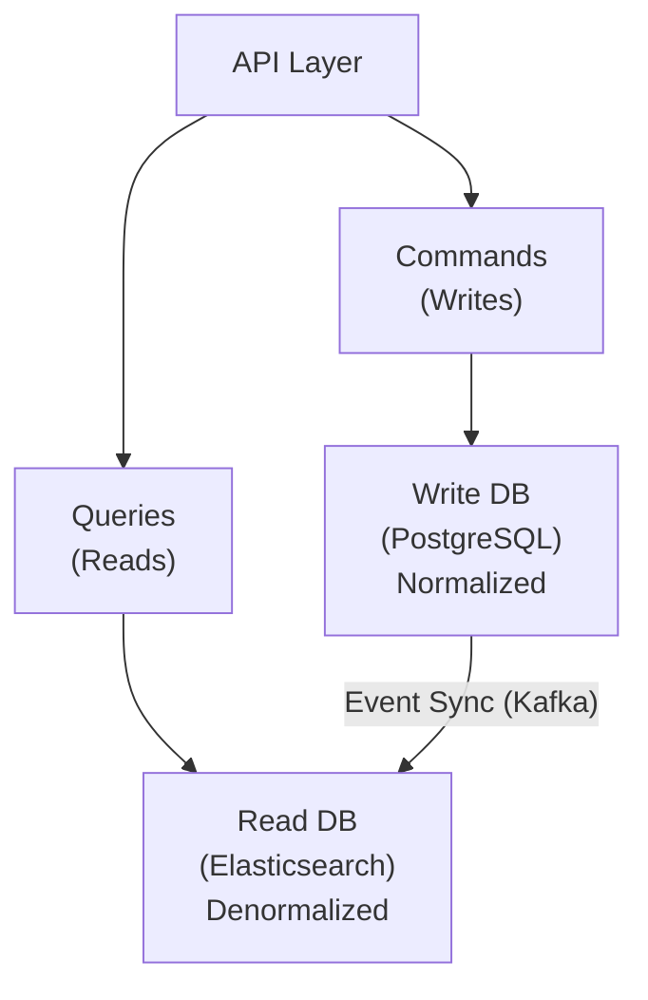
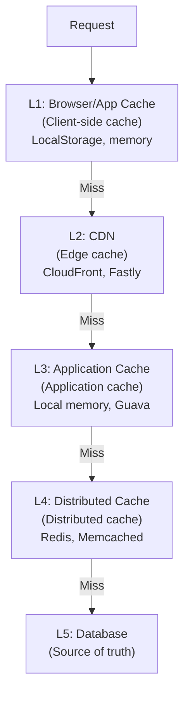
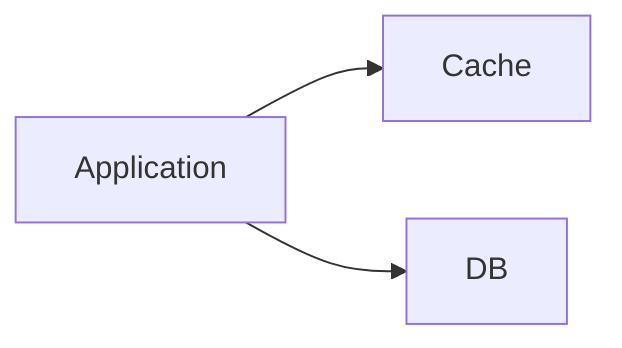
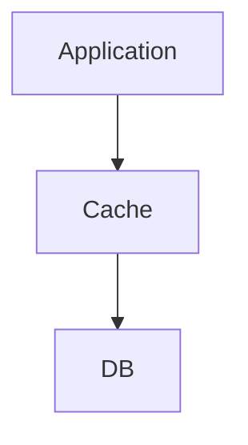
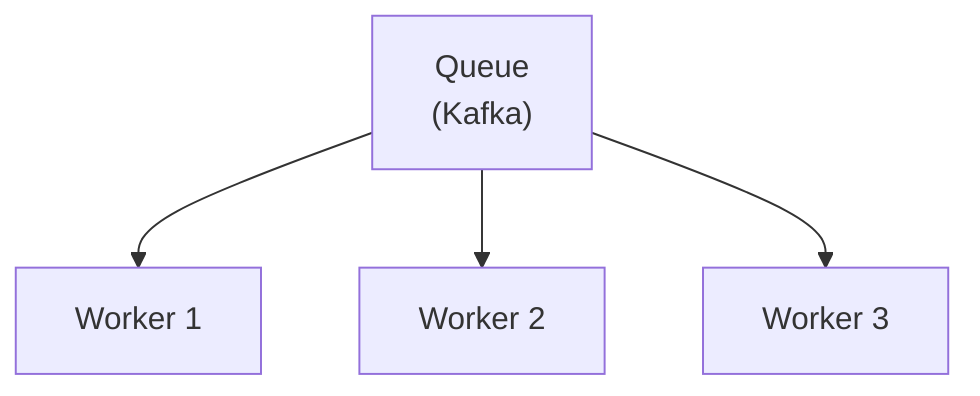
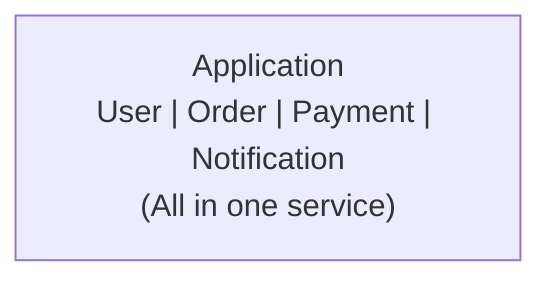
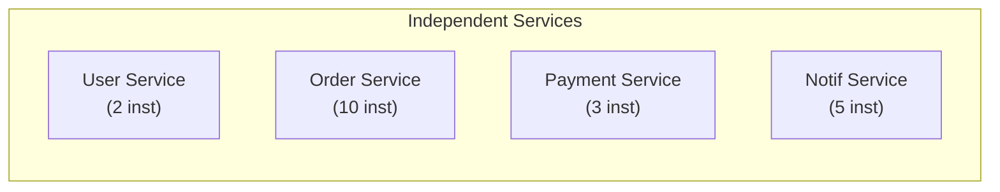

# Scalability Patterns

## 0️⃣ Prerequisites

Before diving into scalability patterns, you should understand:

- **Distributed Systems Basics**: Replication, partitioning, and consistency (covered in Phases 1 and 5)
- **Database Fundamentals**: SQL vs NoSQL, indexing, and sharding (covered in Phase 3)
- **Caching Concepts**: Caching patterns and eviction policies (covered in Phase 4)
- **Trade-off Analysis**: How to evaluate and justify design decisions (covered in Topic 9)

Quick refresher: Scalability is the ability of a system to handle increased load by adding resources. A scalable system can grow to meet demand without fundamental redesign. Understanding scalability patterns is essential for system design interviews because interviewers often ask "How would you scale this to 10x or 100x?"

---

## 1️⃣ What Problem Does This Exist to Solve?

### The Specific Pain Point

Systems that work perfectly for 1,000 users often break at 1,000,000 users. The patterns that work at small scale don't work at large scale:

- A single database can handle 10,000 QPS but not 1,000,000 QPS
- A single server can serve 1,000 concurrent users but not 100,000
- Synchronous processing works for 100 requests/second but not 10,000
- A monolithic application works for a 10-person team but not 100

Without understanding scalability patterns, candidates:

1. **Design systems that can't grow**: Single points of failure, no horizontal scaling
2. **Over-engineer for small scale**: Microservices for 100 users
3. **Can't answer "How would you scale this?"**: Common interview question
4. **Miss bottlenecks**: Don't identify what will break first
5. **Propose impractical solutions**: "Just add more servers" without understanding the implications

### What Breaks Without Scalability Thinking

**Scenario 1: The Database Bottleneck**

A candidate designed a system with a single PostgreSQL database. When asked "What if we have 100x more users?", they said "We'll add more application servers." But the database was the bottleneck, and adding app servers wouldn't help.

**Scenario 2: The Synchronous Trap**

A candidate designed an e-commerce checkout that synchronously called 5 external services. At 100 orders/minute, this worked. At 10,000 orders/minute, the p99 latency was 30 seconds because any slow service blocked the entire flow.

**Scenario 3: The State Problem**

A candidate stored user sessions in application server memory. When asked about scaling, they realized they couldn't add more servers without losing session state or implementing sticky sessions (which creates other problems).

---

## 2️⃣ Intuition and Mental Model

### The Scaling Ladder

Think of scaling as climbing a ladder. Each rung represents a new level of scale and requires different patterns:

```
┌─────────────────────────────────────────────────────────────────────┐
│                    THE SCALING LADDER                                │
├─────────────────────────────────────────────────────────────────────┤
│                                                                      │
│  RUNG 5: GLOBAL SCALE (100M+ users)                                 │
│  ─────────────────────────────────                                  │
│  - Multi-region deployment                                          │
│  - Global load balancing                                            │
│  - Data sovereignty compliance                                      │
│  - Edge computing                                                   │
│                                                                      │
│  RUNG 4: MASSIVE SCALE (10M+ users)                                 │
│  ────────────────────────────────                                   │
│  - Database sharding                                                │
│  - Event-driven architecture                                        │
│  - Microservices                                                    │
│  - Advanced caching (multi-tier)                                    │
│                                                                      │
│  RUNG 3: LARGE SCALE (1M+ users)                                    │
│  ───────────────────────────────                                    │
│  - Read replicas                                                    │
│  - Message queues                                                   │
│  - CDN for static content                                           │
│  - Distributed caching                                              │
│                                                                      │
│  RUNG 2: MEDIUM SCALE (100K+ users)                                 │
│  ─────────────────────────────────                                  │
│  - Load balancing                                                   │
│  - Database optimization (indexes)                                  │
│  - Basic caching                                                    │
│  - Async processing for non-critical paths                          │
│                                                                      │
│  RUNG 1: SMALL SCALE (10K users)                                    │
│  ───────────────────────────────                                    │
│  - Single server                                                    │
│  - Single database                                                  │
│  - Vertical scaling                                                 │
│  - Simple architecture                                              │
│                                                                      │
└─────────────────────────────────────────────────────────────────────┘
```

### The Bottleneck Mindset

Scaling is about identifying and removing bottlenecks. The bottleneck is always somewhere:

```
┌─────────────────────────────────────────────────────────────────────┐
│                    COMMON BOTTLENECKS                                │
├─────────────────────────────────────────────────────────────────────┤
│                                                                      │
│  LAYER              BOTTLENECK              SOLUTION                │
│  ─────────────────────────────────────────────────────────────      │
│  Network            Bandwidth               CDN, compression        │
│  Load Balancer      Connection limits       Multiple LBs            │
│  Application        CPU/Memory              Horizontal scaling      │
│  Database (reads)   Query throughput        Read replicas, cache    │
│  Database (writes)  Write throughput        Sharding, async writes  │
│  Storage            IOPS                    SSD, distributed storage│
│  External APIs      Rate limits             Caching, batching       │
│                                                                      │
└─────────────────────────────────────────────────────────────────────┘
```

---

## 3️⃣ How It Works Internally

### Pattern 1: Horizontal vs Vertical Scaling

```
┌─────────────────────────────────────────────────────────────────────┐
│                    VERTICAL VS HORIZONTAL SCALING                    │
├─────────────────────────────────────────────────────────────────────┤
│                                                                      │
│  VERTICAL SCALING (Scale Up)                                        │
│  ───────────────────────────                                        │
│                                                                      │
│  Before:          After:                                            │
│  ┌─────────┐      ┌─────────────────┐                               │
│  │ 4 CPU   │      │     16 CPU      │                               │
│  │ 16 GB   │  →   │     64 GB       │                               │
│  │ 500 GB  │      │     2 TB        │                               │
│  └─────────┘      └─────────────────┘                               │
│                                                                      │
│  Pros: Simple, no code changes                                      │
│  Cons: Hardware limits, single point of failure, expensive          │
│                                                                      │
│  ─────────────────────────────────────────────────────────────      │
│                                                                      │
│  HORIZONTAL SCALING (Scale Out)                                     │
│  ─────────────────────────────                                      │
│                                                                      │
│  Before:          After:                                            │
│  ┌─────────┐      ┌─────────┐ ┌─────────┐ ┌─────────┐              │
│  │ Server  │      │ Server  │ │ Server  │ │ Server  │              │
│  │    1    │  →   │    1    │ │    2    │ │    3    │              │
│  └─────────┘      └─────────┘ └─────────┘ └─────────┘              │
│                                                                      │
│  Pros: No hardware limit, redundancy, cost-effective                │
│  Cons: Complexity, state management, data consistency               │
│                                                                      │
└─────────────────────────────────────────────────────────────────────┘
```

**When to use Vertical Scaling**:
- Early stage, simple systems
- Databases that are hard to shard
- When horizontal scaling adds too much complexity
- Quick fix while planning horizontal scaling

**When to use Horizontal Scaling**:
- High availability requirements
- Stateless services
- Beyond single-machine limits
- Cost optimization at scale

### Pattern 2: Database Scaling Patterns

#### Read Replicas

```
┌─────────────────────────────────────────────────────────────────────┐
│                    READ REPLICAS                                     │
└─────────────────────────────────────────────────────────────────────┘

                    ┌─────────────────┐
                    │   Application   │
                    └────────┬────────┘
                             │
              ┌──────────────┴──────────────┐
              │                             │
           Writes                        Reads
              │                             │
              ▼                             ▼


<details>
<summary>ASCII diagram (reference)</summary>

```text
        ┌──────────┐               ┌───────────────┐
        │  Primary │──Replication─▶│   Replicas    │
        │    DB    │               │   (1, 2, 3)   │
        └──────────┘               └───────────────┘
```
</details>

  USE CASE: Read-heavy workloads (10:1 read/write ratio or higher)
  
  TRADE-OFF: Replication lag means reads might be slightly stale
```

#### Database Sharding



<details>
<summary>ASCII diagram (reference)</summary>

```text
┌─────────────────────────────────────────────────────────────────────┐
│                    DATABASE SHARDING                                 │
└─────────────────────────────────────────────────────────────────────┘

                    ┌─────────────────┐
                    │   Application   │
                    └────────┬────────┘
                             │
                    ┌────────┴────────┐
                    │  Shard Router   │
                    └────────┬────────┘
                             │
           ┌─────────────────┼─────────────────┐
           │                 │                 │
           ▼                 ▼                 ▼
      ┌─────────┐       ┌─────────┐       ┌─────────┐
      │ Shard 1 │       │ Shard 2 │       │ Shard 3 │
      │Users A-H│       │Users I-P│       │Users Q-Z│
      └─────────┘       └─────────┘       └─────────┘

  SHARDING STRATEGIES:
  
  1. RANGE-BASED: Users A-H → Shard 1
     Pros: Range queries efficient
     Cons: Hot spots (new users all in one shard)
  
  2. HASH-BASED: hash(user_id) % 3 → Shard N
     Pros: Even distribution
     Cons: Range queries require all shards
  
  3. DIRECTORY-BASED: Lookup table maps key → shard
     Pros: Flexible
     Cons: Lookup table is bottleneck
```
</details>

#### CQRS (Command Query Responsibility Segregation)



<details>
<summary>ASCII diagram (reference)</summary>

```text
┌─────────────────────────────────────────────────────────────────────┐
│                    CQRS FOR SCALING                                  │
└─────────────────────────────────────────────────────────────────────┘

                         ┌─────────────────┐
                         │    API Layer    │
                         └────────┬────────┘
                                  │
                    ┌─────────────┴─────────────┐
                    │                           │
               Commands                      Queries
               (Writes)                      (Reads)
                    │                           │
                    ▼                           ▼
           ┌────────────────┐         ┌────────────────┐
           │   Write DB     │         │    Read DB     │
           │  (PostgreSQL)  │         │(Elasticsearch) │
           │   Normalized   │         │ Denormalized   │
           └───────┬────────┘         └────────────────┘
                   │                          ▲
                   │                          │
                   └──────────────────────────┘
                        Event Sync (Kafka)

  USE CASE: Different read/write patterns, complex queries
  
  TRADE-OFF: Eventual consistency between read and write DBs
```
</details>

### Pattern 3: Caching Patterns for Scale

#### Multi-Tier Caching



<details>
<summary>ASCII diagram (reference)</summary>

```text
┌─────────────────────────────────────────────────────────────────────┐
│                    MULTI-TIER CACHING                                │
└─────────────────────────────────────────────────────────────────────┘

         Request
            │
            ▼
    ┌───────────────┐
    │  Browser/App  │  ← L1: Client-side cache
    │    Cache      │     (LocalStorage, memory)
    └───────┬───────┘
            │ Miss
            ▼
    ┌───────────────┐
    │      CDN      │  ← L2: Edge cache
    │               │     (CloudFront, Fastly)
    └───────┬───────┘
            │ Miss
            ▼
    ┌───────────────┐
    │  Application  │  ← L3: Application cache
    │    Cache      │     (Local memory, Guava)
    └───────┬───────┘
            │ Miss
            ▼
    ┌───────────────┐
    │  Distributed  │  ← L4: Distributed cache
    │    Cache      │     (Redis, Memcached)
    └───────┬───────┘
            │ Miss
            ▼
    ┌───────────────┐
    │   Database    │  ← L5: Source of truth
    └───────────────┘

  CACHE HIT RATES (example):
  - L1 (Browser): 30%
  - L2 (CDN): 50% of remaining
  - L3 (App): 70% of remaining
  - L4 (Redis): 90% of remaining
  - L5 (DB): Only 1-2% of original requests
```
</details>

#### Cache-Aside vs Read-Through

**Cache-Aside Pattern:**



Application manages cache explicitly:
1. Check cache
2. If miss, query DB
3. Store in cache
4. Return data

Pros: Application has full control  
Cons: Application must handle cache logic

**Read-Through Pattern:**



Cache handles DB queries:
1. Application queries cache
2. Cache queries DB on miss
3. Cache stores and returns

Pros: Simpler application code  
Cons: Cache must understand data model

<details>
<summary>ASCII diagram (reference)</summary>

```text
┌─────────────────────────────────────────────────────────────────────┐
│                    CACHE-ASIDE PATTERN                               │
└─────────────────────────────────────────────────────────────────────┘

  Application manages cache explicitly:
  
  1. Check cache
  2. If miss, query DB
  3. Store in cache
  4. Return data

  ┌─────────────┐
  │ Application │
  └──────┬──────┘
         │
    ┌────┴────┐
    │         │
    ▼         ▼
┌───────┐ ┌───────┐
│ Cache │ │  DB   │
└───────┘ └───────┘

  Pros: Application has full control
  Cons: Application must handle cache logic


┌─────────────────────────────────────────────────────────────────────┐
│                    READ-THROUGH PATTERN                              │
└─────────────────────────────────────────────────────────────────────┘

  Cache handles DB queries:
  
  1. Application queries cache
  2. Cache queries DB on miss
  3. Cache stores and returns

  ┌─────────────┐
  │ Application │
  └──────┬──────┘
         │
         ▼
    ┌───────┐
    │ Cache │
    └───┬───┘
        │
        ▼
    ┌───────┐
    │  DB   │
    └───────┘

  Pros: Simpler application code
  Cons: Cache must understand data model
```
</details>

### Pattern 4: Message Queue Scaling

```
┌─────────────────────────────────────────────────────────────────────┐
│                    MESSAGE QUEUE FOR SCALING                         │
└─────────────────────────────────────────────────────────────────────┘

  PROBLEM: Synchronous processing can't handle spikes

  SYNCHRONOUS:
  ```mermaid
  flowchart LR
      Client["Client"] --> Server["Server"]
      Server --> DB["DB"]
  ```
  
  If DB is slow, client waits. If spike occurs, system overloads.

  ASYNCHRONOUS WITH QUEUE:
  ```mermaid
  flowchart LR
      Client["Client"] --> Server["Server"]
      Server --> Queue["Queue"]
      Queue --> Workers["Workers"]
      Workers --> DB["DB"]
  ```
  
  Client gets immediate response. Queue absorbs spikes.

<details>
<summary>ASCII diagram (reference)</summary>

```text
  ┌──────┐    ┌──────┐    ┌───────┐    ┌────────┐    ┌──────┐
  │Client│───▶│Server│───▶│ Queue │───▶│Workers │───▶│  DB  │
  └──────┘    └──────┘    └───────┘    └────────┘    └──────┘
```
</details>
  Workers process at sustainable rate.

  SCALING WORKERS:
  


Add workers to increase throughput.  
Queue provides backpressure if workers can't keep up.

<details>
<summary>ASCII diagram (reference)</summary>

```text
                    ┌───────────┐
                    │   Queue   │
                    │  (Kafka)  │
                    └─────┬─────┘
                          │
         ┌────────────────┼────────────────┐
         │                │                │
         ▼                ▼                ▼
    ┌─────────┐      ┌─────────┐      ┌─────────┐
    │Worker 1 │      │Worker 2 │      │Worker 3 │
    └─────────┘      └─────────┘      └─────────┘
```
</details>

### Pattern 5: Microservices Decomposition

**Monolith:**



Scale everything together (even if only orders are busy)

**Microservices:**



Scale each service independently based on load.

**WHEN TO DECOMPOSE:**
- Service has different scaling needs
- Service has different deployment frequency
- Service has different team ownership

<details>
<summary>ASCII diagram (reference)</summary>

```text
┌─────────────────────────────────────────────────────────────────────┐
│                    MICROSERVICES FOR SCALING                         │
└─────────────────────────────────────────────────────────────────────┘

  MONOLITH:
  ┌─────────────────────────────────────┐
  │           Application               │
  │  ┌─────┐ ┌─────┐ ┌─────┐ ┌─────┐   │
  │  │User │ │Order│ │Pay- │ │Notif│   │
  │  │     │ │     │ │ment │ │     │   │
  │  └─────┘ └─────┘ └─────┘ └─────┘   │
  └─────────────────────────────────────┘
  
  Scale everything together (even if only orders are busy)

  MICROSERVICES:
  ┌─────────┐  ┌─────────┐  ┌─────────┐  ┌─────────┐
  │  User   │  │  Order  │  │ Payment │  │  Notif  │
  │ Service │  │ Service │  │ Service │  │ Service │
  │ (2 inst)│  │(10 inst)│  │ (3 inst)│  │ (5 inst)│
  └─────────┘  └─────────┘  └─────────┘  └─────────┘
  
  Scale each service independently based on load.

  WHEN TO DECOMPOSE:
  - Service has different scaling needs
  - Service has different deployment frequency
  - Service has different team ownership
```
</details>
  - Service has different technology needs
  
  WHEN NOT TO DECOMPOSE:
  - Small team (< 10 engineers)
  - Simple domain
  - Low scale requirements
  - Tight coupling between components
```

### Pattern 6: CDN for Static Content

```
┌─────────────────────────────────────────────────────────────────────┐
│                    CDN SCALING                                       │
└─────────────────────────────────────────────────────────────────────┘

  WITHOUT CDN:
  
  User (Tokyo) ──────────────────────────────▶ Server (US)
                     High latency (200ms)

  WITH CDN:
  
  User (Tokyo) ───▶ CDN Edge (Tokyo) ───▶ Server (US)
                    Low latency (20ms)   (Only on cache miss)

  CDN ARCHITECTURE:
  
           ┌──────────┐
           │  Origin  │
           │  Server  │
           └────┬─────┘
                │
    ┌───────────┼───────────┐
    │           │           │
    ▼           ▼           ▼
┌───────┐  ┌───────┐  ┌───────┐
│ Edge  │  │ Edge  │  │ Edge  │
│  US   │  │  EU   │  │ Asia  │
└───────┘  └───────┘  └───────┘
    ▲           ▲           ▲
    │           │           │
 US Users    EU Users   Asia Users

  WHAT TO PUT ON CDN:
  - Static assets (JS, CSS, images)
  - Video content
  - API responses that don't change often
  - HTML pages (for static sites)
  
  WHAT NOT TO PUT ON CDN:
  - User-specific data
  - Real-time data
  - Sensitive information
```

---

## 4️⃣ Simulation: Scaling Discussion in an Interview

**Interviewer**: "You've designed this e-commerce system for 100,000 users. How would you scale it to 10 million users?"

**Candidate**: "Let me identify the bottlenecks and address them systematically.

**Current Architecture**:
- Single PostgreSQL database
- 3 application servers behind a load balancer
- Redis cache
- Single region deployment

**Bottleneck Analysis at 10M users**:

1. **Database**: At 100x users, our database will be the first bottleneck. Currently handling 1,000 QPS, we'll need 100,000 QPS.

2. **Application Servers**: Can scale horizontally, but need to ensure they're stateless.

3. **Cache**: Redis can handle the load, but might need clustering for redundancy.

4. **Geographic Latency**: 10M users are likely global, single region won't work.

**Scaling Strategy**:

**Step 1: Database Scaling**

```
CURRENT:                    SCALED:
┌──────────┐               ┌──────────┐
│ Postgres │               │ Primary  │
│ (Single) │      →        └────┬─────┘
└──────────┘                    │
                     ┌──────────┼──────────┐
                     ▼          ▼          ▼
                ┌────────┐ ┌────────┐ ┌────────┐
                │Replica1│ │Replica2│ │Replica3│
                └────────┘ └────────┘ └────────┘
```

- Add read replicas for read scaling (80% of queries are reads)
- This gets us to ~10x scale

For 100x, we need sharding:

```
┌─────────────────────────────────────────────────────────────────────┐
│  Shard by user_id:                                                  │
│  - Users 0-3.3M → Shard 1                                          │
│  - Users 3.3M-6.6M → Shard 2                                       │
│  - Users 6.6M-10M → Shard 3                                        │
│                                                                      │
│  Each shard has its own replicas for read scaling                   │
└─────────────────────────────────────────────────────────────────────┘
```

**Step 2: Async Processing**

Move non-critical operations to async:

```
SYNCHRONOUS (before):
Order → Payment → Inventory → Email → Response

ASYNCHRONOUS (after):
Order → Payment → Inventory → Response
                      ↓
                   [Queue]
                      ↓
                 Email Worker
```

This reduces response time and allows independent scaling of email sending.

**Step 3: Multi-Region Deployment**

```
┌─────────────────────────────────────────────────────────────────────┐
│                                                                      │
│     US-EAST                              EU-WEST                    │
│  ┌───────────────┐                   ┌───────────────┐              │
│  │ App Servers   │                   │ App Servers   │              │
│  │ DB (Primary)  │◀──Replication────▶│ DB (Replica)  │              │
│  │ Redis Cluster │                   │ Redis Cluster │              │
│  └───────────────┘                   └───────────────┘              │
│         ▲                                   ▲                       │
│         │                                   │                       │
│         └───────────┬───────────────────────┘                       │
│                     │                                               │
│              ┌──────┴──────┐                                        │
│              │ Global LB   │                                        │
│              │ (Route 53)  │                                        │
│              └─────────────┘                                        │
│                                                                      │
└─────────────────────────────────────────────────────────────────────┘
```

**Step 4: CDN for Static Content**

```
- Product images → CloudFront
- JS/CSS bundles → CloudFront
- Reduces origin load by 60-70%
```

**Summary of Changes**:

| Component | Before | After |
|-----------|--------|-------|
| Database | Single instance | Sharded + Replicas |
| App Servers | 3 instances | Auto-scaling (10-50) |
| Cache | Single Redis | Redis Cluster |
| Regions | 1 | 2+ |
| CDN | None | CloudFront |
| Processing | Synchronous | Async for non-critical |

**Trade-offs**:

1. **Sharding adds complexity**: Cross-shard queries are expensive. We'll need to denormalize some data.

2. **Multi-region adds latency for writes**: Writes go to primary region. We accept this for consistency.

3. **Async processing means eventual consistency**: User might not see email confirmation immediately. Acceptable for this use case.

Does this scaling approach make sense? Should I dive deeper into any component?"

---

## 5️⃣ Quick Reference: Scaling Patterns

```
┌─────────────────────────────────────────────────────────────────────┐
│                    SCALING PATTERNS QUICK REFERENCE                  │
├─────────────────────────────────────────────────────────────────────┤
│                                                                      │
│  BOTTLENECK          PATTERN                  WHEN TO USE           │
│  ────────────────────────────────────────────────────────────       │
│  CPU/Memory          Horizontal scaling       Stateless services    │
│  Database reads      Read replicas            Read-heavy workloads  │
│  Database writes     Sharding                 Write-heavy workloads │
│  Complex queries     CQRS                     Different R/W patterns│
│  Latency             Caching (multi-tier)     Repeated data access  │
│  Geographic latency  CDN, Multi-region        Global users          │
│  Spike handling      Message queues           Unpredictable load    │
│  Service coupling    Microservices            Independent scaling   │
│                                                                      │
│  SCALING CHECKLIST                                                  │
│  □ Identify the bottleneck first                                    │
│  □ Start simple, add complexity as needed                           │
│  □ Make services stateless for horizontal scaling                   │
│  □ Use caching aggressively                                         │
│  □ Move non-critical work to async                                  │
│  □ Consider geographic distribution                                 │
│  □ Monitor and measure to validate                                  │
│                                                                      │
└─────────────────────────────────────────────────────────────────────┘
```

---

## 6️⃣ Interview Follow-up Questions WITH Answers

### Q1: "How do you decide between vertical and horizontal scaling?"

**Answer**: "I start with vertical scaling for simplicity, then move to horizontal when we hit limits or need redundancy.

Vertical scaling is simpler (no code changes) but has limits (biggest machine is finite) and creates single points of failure.

Horizontal scaling requires the application to be stateless but provides redundancy and virtually unlimited scale.

For databases, vertical scaling is often the first step because horizontal scaling (sharding) adds significant complexity. For stateless application servers, horizontal scaling is usually straightforward and preferred."

### Q2: "What's the first thing you'd do to scale this system?"

**Answer**: "First, I'd measure to identify the actual bottleneck. Adding app servers doesn't help if the database is the bottleneck.

I'd look at:
- CPU/memory utilization of each component
- Database query times and QPS
- Network latency between components
- Queue depths if using async processing

Then I'd address the bottleneck with the simplest solution: caching for repeated reads, read replicas for read-heavy DB load, async processing for write spikes, or horizontal scaling for CPU-bound services."

### Q3: "How do you handle database sharding?"

**Answer**: "Sharding is a last resort because it adds significant complexity. Before sharding, I'd try:
1. Query optimization and indexing
2. Read replicas for read scaling
3. Caching to reduce DB load
4. Vertical scaling (bigger instance)

If sharding is necessary, I'd:
1. Choose a shard key that distributes evenly (usually user_id or tenant_id)
2. Use hash-based sharding for even distribution
3. Plan for cross-shard queries (they're expensive, so minimize them)
4. Consider using a sharding-aware database like CockroachDB or Vitess"

### Q4: "How do you scale writes?"

**Answer**: "Writes are harder to scale than reads because you can't just add replicas. Options include:

1. **Async writes**: Queue writes and process in background. Good for non-critical data.

2. **Batching**: Combine multiple writes into one. Good for high-volume, low-latency-tolerance scenarios.

3. **Sharding**: Distribute writes across multiple databases. Each shard handles a portion.

4. **Write-behind caching**: Write to cache, async flush to DB. Risky if cache fails.

5. **Event sourcing**: Write events to append-only log, derive state. Good for audit trails.

The choice depends on consistency requirements and acceptable latency."

---

## 🔟 One Clean Mental Summary

Scaling is about identifying and removing bottlenecks. Start simple, measure to find the actual bottleneck, then apply the appropriate pattern. The scaling ladder progresses from vertical scaling to horizontal scaling, read replicas, caching, sharding, async processing, and finally multi-region deployment.

Key patterns: horizontal scaling for stateless services, read replicas for read-heavy databases, sharding for write-heavy databases, multi-tier caching for repeated reads, message queues for spike handling, and CDN for static content.

Always consider the trade-offs: horizontal scaling adds complexity, sharding complicates queries, async processing means eventual consistency, and multi-region adds latency for writes. The goal is to scale just enough to meet requirements without over-engineering.

